# Opinion Poll by SWG, 5–7 February 2018

<a href="#voting-intentions">Voting Intentions</a> | <a href="#seats">Seats</a> | <a href="#coalitions">Coalitions</a> | <a href="#technical-information">Technical Information</a>

## Voting Intentions

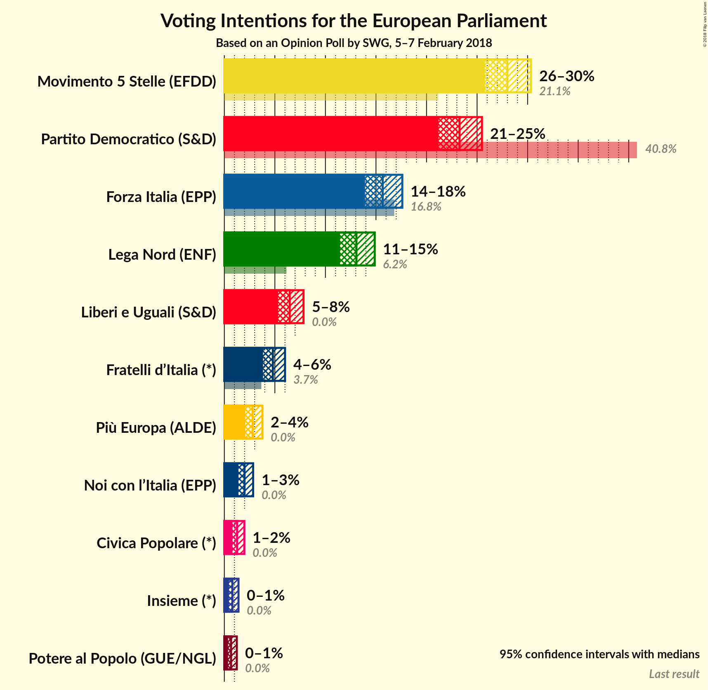

### Confidence Intervals

| Party | Last Result | Poll Result | 80% Confidence Interval | 90% Confidence Interval | 95% Confidence Interval | 99% Confidence Interval |
|:-----:|:-----------:|:-----------:|:-----------------------:|:-----------------------:|:-----------------------:|:-----------------------:|
| Movimento 5 Stelle (EFDD) | 0.0% | 28.0% | 26.5–29.5% |26.1–30.0% |25.8–30.3% |25.1–31.1% |
| Partito Democratico (S&D) | 0.0% | 23.3% | 21.9–24.7% |21.5–25.1% |21.2–25.5% |20.6–26.2% |
| Forza Italia (EPP) | 0.0% | 15.7% | 14.5–16.9% |14.2–17.3% |13.9–17.6% |13.4–18.2% |
| Lega Nord (ENF) | 0.0% | 13.1% | 12.0–14.3% |11.7–14.6% |11.4–14.9% |11.0–15.5% |
| Liberi e Uguali (S&D) | 0.0% | 6.5% | 5.7–7.4% |5.5–7.6% |5.3–7.8% |5.0–8.3% |
| Fratelli d’Italia (—) | 0.0% | 4.8% | 4.2–5.6% |4.0–5.8% |3.8–6.0% |3.5–6.4% |
| Più Europa (—) | 0.0% | 2.8% | 2.3–3.4% |2.2–3.6% |2.1–3.8% |1.9–4.1% |
| Noi con l’Italia (—) | 0.0% | 2.0% | 1.6–2.6% |1.5–2.7% |1.4–2.9% |1.2–3.1% |
| Civica Popolare (—) | 0.0% | 1.3% | 1.0–1.7% |0.9–1.9% |0.8–2.0% |0.7–2.2% |
| Insieme (—) | 0.0% | 0.8% | 0.6–1.2% |0.5–1.3% |0.5–1.4% |0.4–1.6% |
| Potere al Popolo (GUE/NGL) | 0.0% | 0.7% | 0.5–1.0% |0.4–1.1% |0.4–1.2% |0.3–1.4% |

*Note:* The poll result column reflects the actual value used in the calculations. Published results may vary slightly, and in addition be rounded to fewer digits.

## Seats

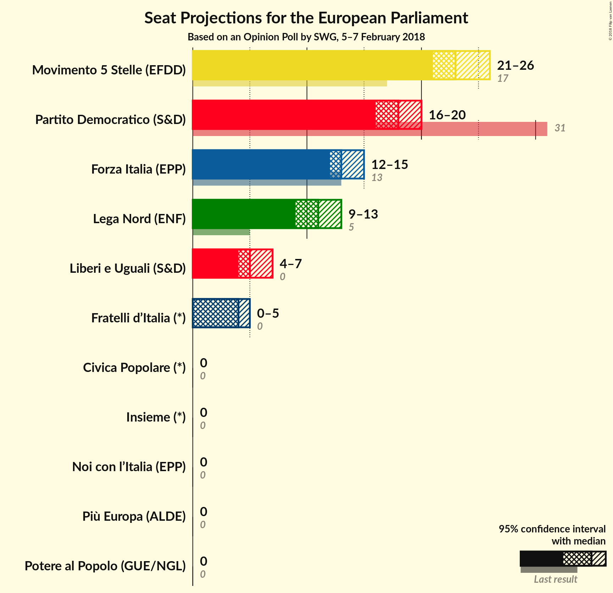

### Confidence Intervals

| Party | Last Result | Median | 80% Confidence Interval | 90% Confidence Interval | 95% Confidence Interval | 99% Confidence Interval |
|:-----:|:-----------:|:------:|:-----------------------:|:-----------------------:|:-----------------------:|:-----------------------:|
| <a href="#movimento-5-stelle-(efdd)">Movimento 5 Stelle (EFDD)</a> | 0 | 22 | 21–24 |21–24 |20–25 |20–25 |
| <a href="#partito-democratico-(s&d)">Partito Democratico (S&D)</a> | 0 | 18 | 16–19 |16–19 |16–19 |15–20 |
| <a href="#forza-italia-(epp)">Forza Italia (EPP)</a> | 0 | 12 | 11–14 |11–14 |11–14 |11–15 |
| <a href="#lega-nord-(enf)">Lega Nord (ENF)</a> | 0 | 10 | 10–11 |9–12 |9–12 |9–13 |
| <a href="#liberi-e-uguali-(s&d)">Liberi e Uguali (S&D)</a> | 0 | 5 | 5–6 |4–6 |4–6 |4–7 |
| <a href="#fratelli-d’italia-(—)">Fratelli d’Italia (—)</a> | 0 | 4 | 3–5 |0–5 |0–5 |0–5 |
| <a href="#più-europa-(—)">Più Europa (—)</a> | 0 | 0 | 0 |0 |0 |0 |
| <a href="#noi-con-l’italia-(—)">Noi con l’Italia (—)</a> | 0 | 0 | 0 |0 |0 |0 |
| <a href="#civica-popolare-(—)">Civica Popolare (—)</a> | 0 | 0 | 0 |0 |0 |0 |
| <a href="#insieme-(—)">Insieme (—)</a> | 0 | 0 | 0 |0 |0 |0 |
| <a href="#potere-al-popolo-(gue/ngl)">Potere al Popolo (GUE/NGL)</a> | 0 | 0 | 0 |0 |0 |0 |

### Movimento 5 Stelle (EFDD)

*For a full overview of the results for this party, see the [Movimento 5 Stelle (EFDD)](party-movimento5stelleefdd.html) page.*

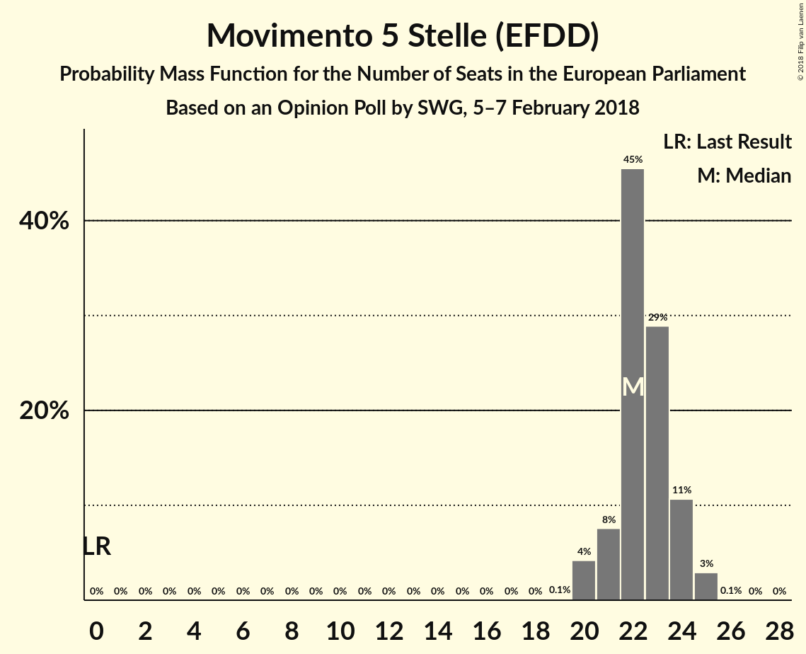

| Number of Seats | Probability | Accumulated | Special Marks |
|:---------------:|:-----------:|:-----------:|:-------------:|
| 0 | 0% | 100% | Last Result |
| 1 | 0% | 100% |  |
| 2 | 0% | 100% |  |
| 3 | 0% | 100% |  |
| 4 | 0% | 100% |  |
| 5 | 0% | 100% |  |
| 6 | 0% | 100% |  |
| 7 | 0% | 100% |  |
| 8 | 0% | 100% |  |
| 9 | 0% | 100% |  |
| 10 | 0% | 100% |  |
| 11 | 0% | 100% |  |
| 12 | 0% | 100% |  |
| 13 | 0% | 100% |  |
| 14 | 0% | 100% |  |
| 15 | 0% | 100% |  |
| 16 | 0% | 100% |  |
| 17 | 0% | 100% |  |
| 18 | 0% | 100% |  |
| 19 | 0.1% | 100% |  |
| 20 | 4% | 99.9% |  |
| 21 | 8% | 96% |  |
| 22 | 45% | 88% | Median |
| 23 | 29% | 43% |  |
| 24 | 11% | 14% |  |
| 25 | 3% | 3% |  |
| 26 | 0.1% | 0.1% |  |
| 27 | 0% | 0% |  |

### Partito Democratico (S&D)

*For a full overview of the results for this party, see the [Partito Democratico (S&D)](party-partitodemocraticosd.html) page.*

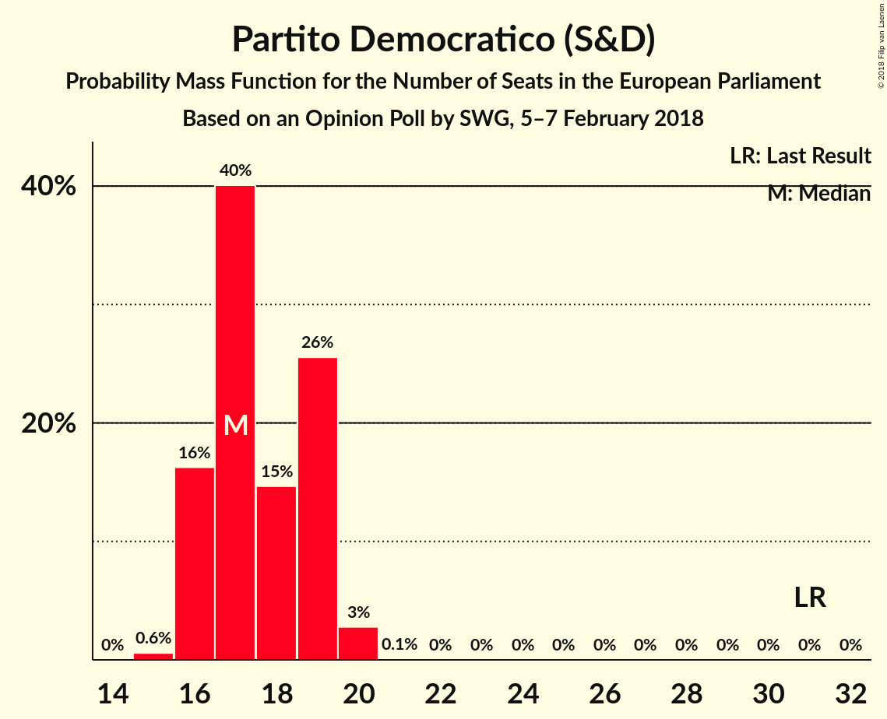

| Number of Seats | Probability | Accumulated | Special Marks |
|:---------------:|:-----------:|:-----------:|:-------------:|
| 0 | 0% | 100% | Last Result |
| 1 | 0% | 100% |  |
| 2 | 0% | 100% |  |
| 3 | 0% | 100% |  |
| 4 | 0% | 100% |  |
| 5 | 0% | 100% |  |
| 6 | 0% | 100% |  |
| 7 | 0% | 100% |  |
| 8 | 0% | 100% |  |
| 9 | 0% | 100% |  |
| 10 | 0% | 100% |  |
| 11 | 0% | 100% |  |
| 12 | 0% | 100% |  |
| 13 | 0% | 100% |  |
| 14 | 0% | 100% |  |
| 15 | 0.6% | 100% |  |
| 16 | 20% | 99.4% |  |
| 17 | 25% | 80% |  |
| 18 | 18% | 55% | Median |
| 19 | 35% | 37% |  |
| 20 | 2% | 2% |  |
| 21 | 0.1% | 0.1% |  |
| 22 | 0% | 0% |  |

### Forza Italia (EPP)

*For a full overview of the results for this party, see the [Forza Italia (EPP)](party-forzaitaliaepp.html) page.*

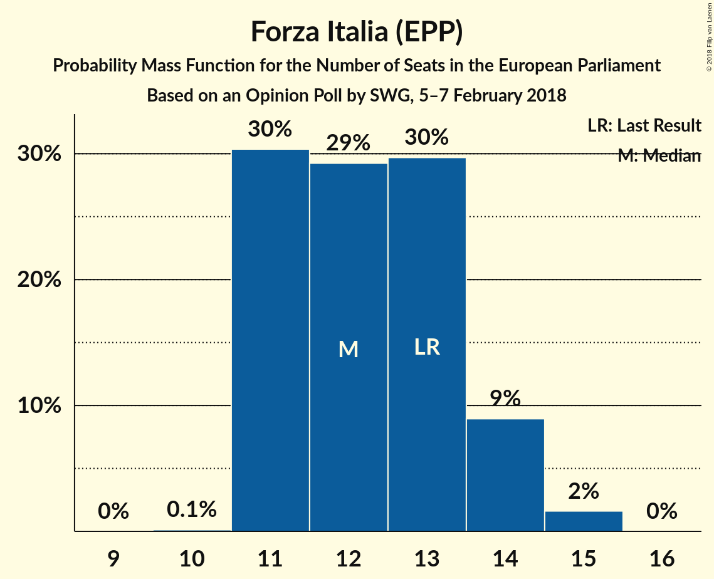

| Number of Seats | Probability | Accumulated | Special Marks |
|:---------------:|:-----------:|:-----------:|:-------------:|
| 0 | 0% | 100% | Last Result |
| 1 | 0% | 100% |  |
| 2 | 0% | 100% |  |
| 3 | 0% | 100% |  |
| 4 | 0% | 100% |  |
| 5 | 0% | 100% |  |
| 6 | 0% | 100% |  |
| 7 | 0% | 100% |  |
| 8 | 0% | 100% |  |
| 9 | 0% | 100% |  |
| 10 | 0.1% | 100% |  |
| 11 | 30% | 99.9% |  |
| 12 | 29% | 70% | Median |
| 13 | 30% | 40% |  |
| 14 | 9% | 11% |  |
| 15 | 2% | 2% |  |
| 16 | 0% | 0% |  |

### Lega Nord (ENF)

*For a full overview of the results for this party, see the [Lega Nord (ENF)](party-leganordenf.html) page.*

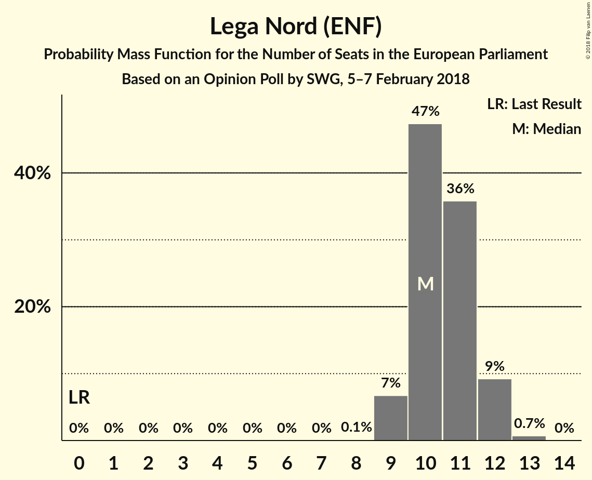

| Number of Seats | Probability | Accumulated | Special Marks |
|:---------------:|:-----------:|:-----------:|:-------------:|
| 0 | 0% | 100% | Last Result |
| 1 | 0% | 100% |  |
| 2 | 0% | 100% |  |
| 3 | 0% | 100% |  |
| 4 | 0% | 100% |  |
| 5 | 0% | 100% |  |
| 6 | 0% | 100% |  |
| 7 | 0% | 100% |  |
| 8 | 0.1% | 100% |  |
| 9 | 7% | 99.9% |  |
| 10 | 47% | 93% | Median |
| 11 | 36% | 46% |  |
| 12 | 9% | 10% |  |
| 13 | 0.7% | 0.7% |  |
| 14 | 0% | 0% |  |

### Liberi e Uguali (S&D)

*For a full overview of the results for this party, see the [Liberi e Uguali (S&D)](party-liberieugualisd.html) page.*

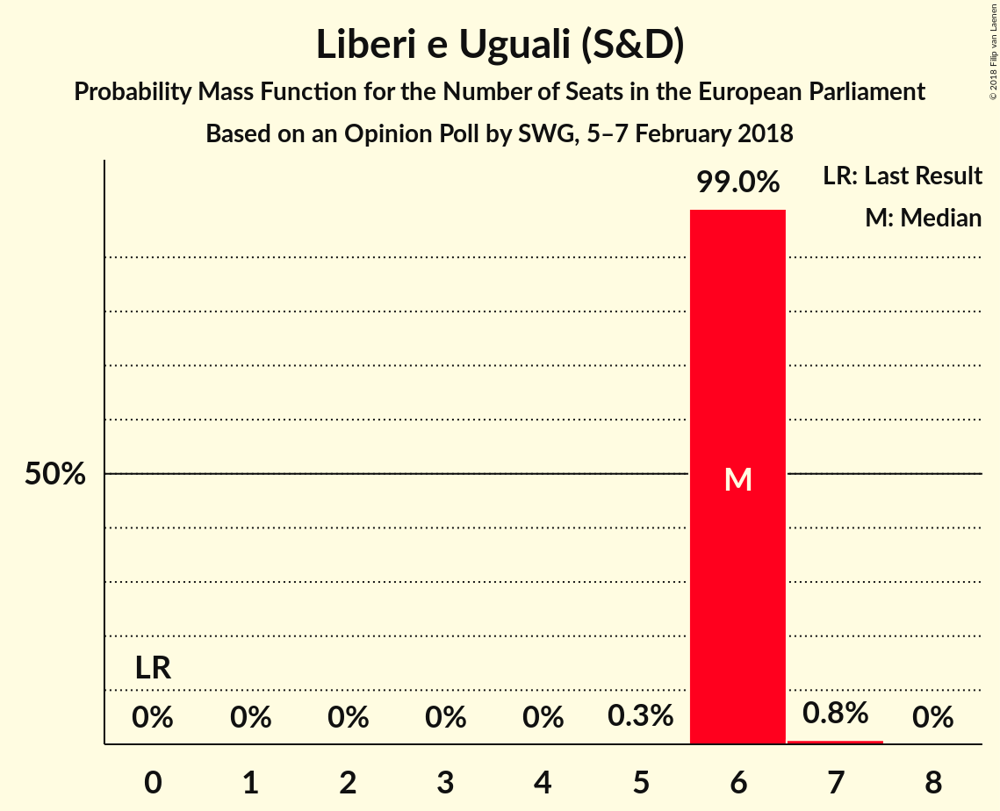

| Number of Seats | Probability | Accumulated | Special Marks |
|:---------------:|:-----------:|:-----------:|:-------------:|
| 0 | 0% | 100% | Last Result |
| 1 | 0% | 100% |  |
| 2 | 0% | 100% |  |
| 3 | 0% | 100% |  |
| 4 | 7% | 100% |  |
| 5 | 63% | 93% | Median |
| 6 | 30% | 31% |  |
| 7 | 0.7% | 0.7% |  |
| 8 | 0% | 0% |  |

### Fratelli d’Italia (—)

*For a full overview of the results for this party, see the [Fratelli d’Italia (—)](party-fratellid’italia—.html) page.*

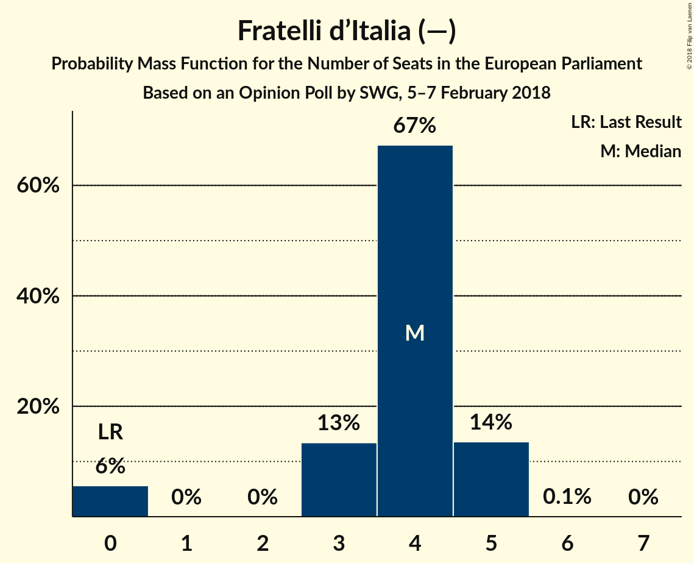

| Number of Seats | Probability | Accumulated | Special Marks |
|:---------------:|:-----------:|:-----------:|:-------------:|
| 0 | 5% | 100% | Last Result |
| 1 | 0% | 95% |  |
| 2 | 0% | 95% |  |
| 3 | 15% | 95% |  |
| 4 | 57% | 79% | Median |
| 5 | 22% | 22% |  |
| 6 | 0.1% | 0.1% |  |
| 7 | 0% | 0% |  |

### Più Europa (—)

*For a full overview of the results for this party, see the [Più Europa (—)](party-piùeuropa—.html) page.*

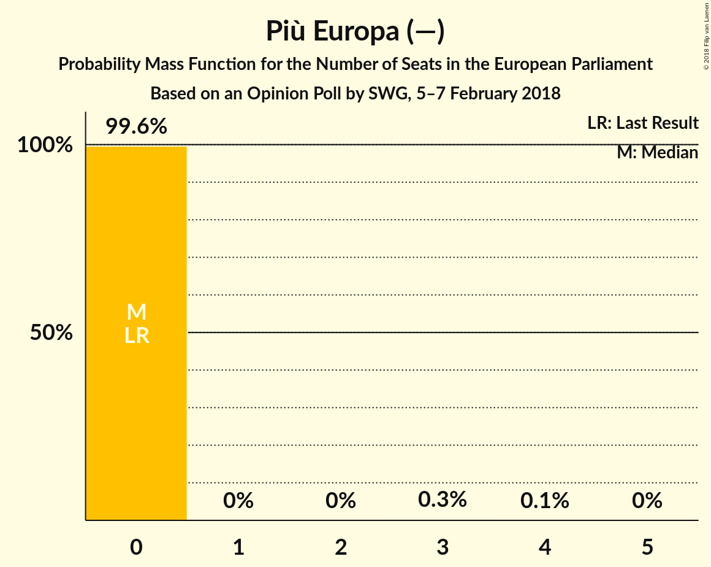

| Number of Seats | Probability | Accumulated | Special Marks |
|:---------------:|:-----------:|:-----------:|:-------------:|
| 0 | 99.6% | 100% | Last Result, Median |
| 1 | 0% | 0.4% |  |
| 2 | 0% | 0.4% |  |
| 3 | 0.3% | 0.4% |  |
| 4 | 0.1% | 0.1% |  |
| 5 | 0% | 0% |  |

### Noi con l’Italia (—)

*For a full overview of the results for this party, see the [Noi con l’Italia (—)](party-noiconl’italia—.html) page.*

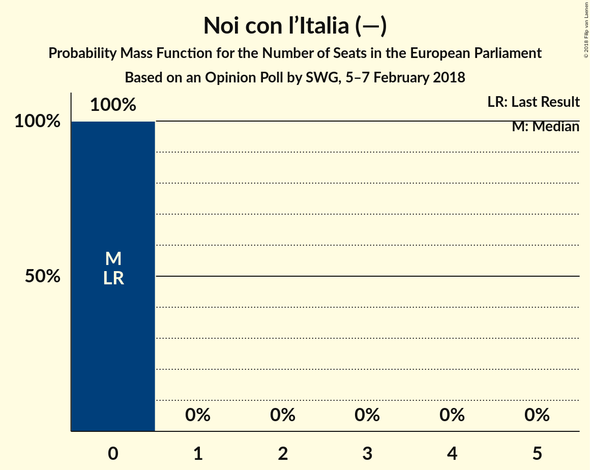

| Number of Seats | Probability | Accumulated | Special Marks |
|:---------------:|:-----------:|:-----------:|:-------------:|
| 0 | 100% | 100% | Last Result, Median |

### Civica Popolare (—)

*For a full overview of the results for this party, see the [Civica Popolare (—)](party-civicapopolare—.html) page.*

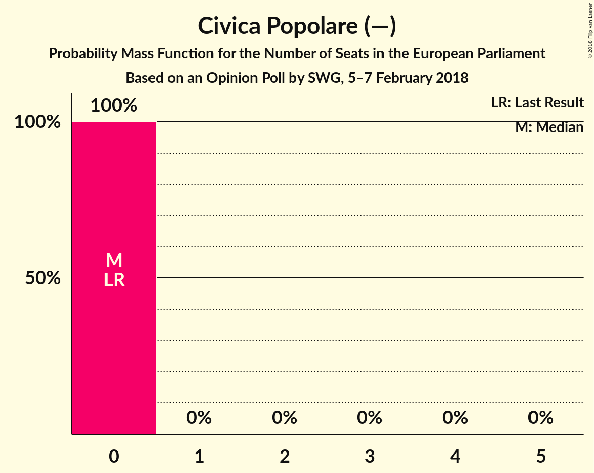

| Number of Seats | Probability | Accumulated | Special Marks |
|:---------------:|:-----------:|:-----------:|:-------------:|
| 0 | 100% | 100% | Last Result, Median |

### Insieme (—)

*For a full overview of the results for this party, see the [Insieme (—)](party-insieme—.html) page.*

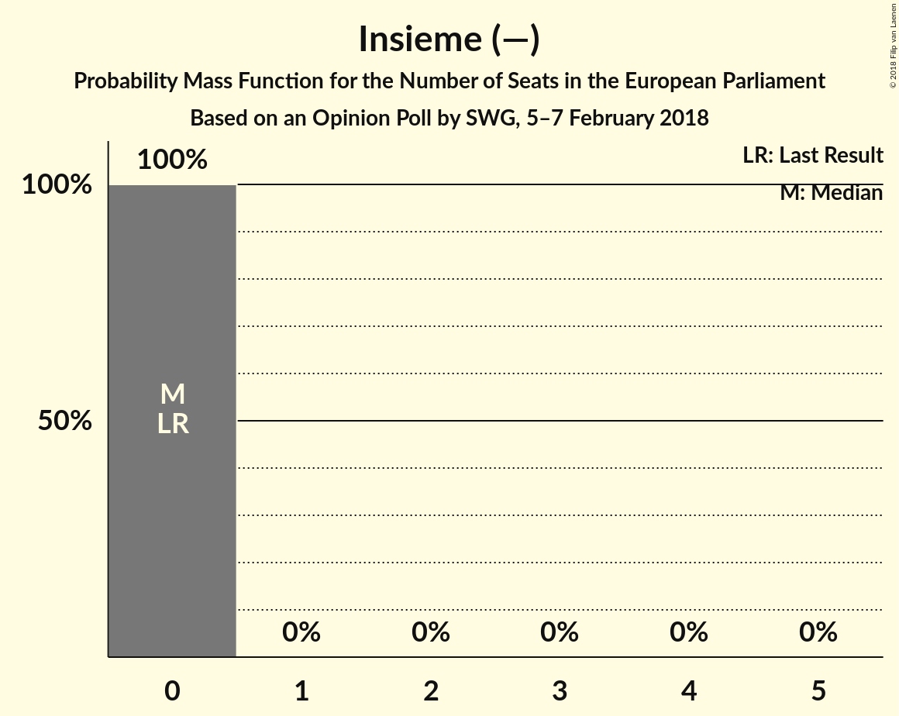

| Number of Seats | Probability | Accumulated | Special Marks |
|:---------------:|:-----------:|:-----------:|:-------------:|
| 0 | 100% | 100% | Last Result, Median |

### Potere al Popolo (GUE/NGL)

*For a full overview of the results for this party, see the [Potere al Popolo (GUE/NGL)](party-poterealpopologuengl.html) page.*

| Number of Seats | Probability | Accumulated | Special Marks |
|:---------------:|:-----------:|:-----------:|:-------------:|
| 0 | 100% | 100% | Last Result, Median |

## Coalitions

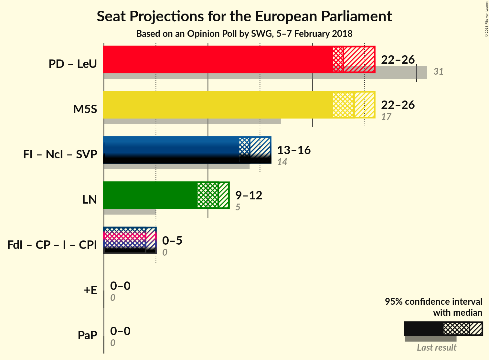

### Confidence Intervals

| Coalition | Last Result | Median | Majority? | 80% Confidence Interval | 90% Confidence Interval | 95% Confidence Interval | 99% Confidence Interval |
|:---------:|:-----------:|:------:|:---------:|:-----------------------:|:-----------------------:|:-----------------------:|:-----------------------:|
| Partito Democratico (S&D) – Liberi e Uguali (S&D) | 0 | 23 | 0% | 21–24 | 21–25 | 21–25 | 20–26 |
| Movimento 5 Stelle (EFDD) | 0 | 22 | 0% | 21–24 | 21–24 | 20–25 | 20–25 |
| Lega Nord (ENF) | 0 | 10 | 0% | 10–11 | 9–12 | 9–12 | 9–13 |
| Potere al Popolo (GUE/NGL) | 0 | 0 | 0% | 0 | 0 | 0 | 0 |

### Partito Democratico (S&D) – Liberi e Uguali (S&D)

| Number of Seats | Probability | Accumulated | Special Marks |
|:---------------:|:-----------:|:-----------:|:-------------:|
| 0 | 0% | 100% | Last Result |
| 1 | 0% | 100% |  |
| 2 | 0% | 100% |  |
| 3 | 0% | 100% |  |
| 4 | 0% | 100% |  |
| 5 | 0% | 100% |  |
| 6 | 0% | 100% |  |
| 7 | 0% | 100% |  |
| 8 | 0% | 100% |  |
| 9 | 0% | 100% |  |
| 10 | 0% | 100% |  |
| 11 | 0% | 100% |  |
| 12 | 0% | 100% |  |
| 13 | 0% | 100% |  |
| 14 | 0% | 100% |  |
| 15 | 0% | 100% |  |
| 16 | 0% | 100% |  |
| 17 | 0% | 100% |  |
| 18 | 0% | 100% |  |
| 19 | 0.1% | 100% |  |
| 20 | 1.3% | 99.9% |  |
| 21 | 13% | 98.6% |  |
| 22 | 19% | 86% |  |
| 23 | 24% | 66% | Median |
| 24 | 38% | 43% |  |
| 25 | 4% | 5% |  |
| 26 | 0.4% | 0.6% |  |
| 27 | 0.2% | 0.2% |  |
| 28 | 0% | 0% |  |

### Movimento 5 Stelle (EFDD)

| Number of Seats | Probability | Accumulated | Special Marks |
|:---------------:|:-----------:|:-----------:|:-------------:|
| 0 | 0% | 100% | Last Result |
| 1 | 0% | 100% |  |
| 2 | 0% | 100% |  |
| 3 | 0% | 100% |  |
| 4 | 0% | 100% |  |
| 5 | 0% | 100% |  |
| 6 | 0% | 100% |  |
| 7 | 0% | 100% |  |
| 8 | 0% | 100% |  |
| 9 | 0% | 100% |  |
| 10 | 0% | 100% |  |
| 11 | 0% | 100% |  |
| 12 | 0% | 100% |  |
| 13 | 0% | 100% |  |
| 14 | 0% | 100% |  |
| 15 | 0% | 100% |  |
| 16 | 0% | 100% |  |
| 17 | 0% | 100% |  |
| 18 | 0% | 100% |  |
| 19 | 0.1% | 100% |  |
| 20 | 4% | 99.9% |  |
| 21 | 8% | 96% |  |
| 22 | 45% | 88% | Median |
| 23 | 29% | 43% |  |
| 24 | 11% | 14% |  |
| 25 | 3% | 3% |  |
| 26 | 0.1% | 0.1% |  |
| 27 | 0% | 0% |  |

### Lega Nord (ENF)

| Number of Seats | Probability | Accumulated | Special Marks |
|:---------------:|:-----------:|:-----------:|:-------------:|
| 0 | 0% | 100% | Last Result |
| 1 | 0% | 100% |  |
| 2 | 0% | 100% |  |
| 3 | 0% | 100% |  |
| 4 | 0% | 100% |  |
| 5 | 0% | 100% |  |
| 6 | 0% | 100% |  |
| 7 | 0% | 100% |  |
| 8 | 0.1% | 100% |  |
| 9 | 7% | 99.9% |  |
| 10 | 47% | 93% | Median |
| 11 | 36% | 46% |  |
| 12 | 9% | 10% |  |
| 13 | 0.7% | 0.7% |  |
| 14 | 0% | 0% |  |

### Potere al Popolo (GUE/NGL)

| Number of Seats | Probability | Accumulated | Special Marks |
|:---------------:|:-----------:|:-----------:|:-------------:|
| 0 | 100% | 100% | Last Result, Median |

## Technical Information

### Opinion Poll

+ **Polling firm:** SWG
+ **Commissioner(s):** —
+ **Fieldwork period:** 5–7 February 2018

### Calculations

+ **Sample size:** 1500
+ **Simulations done:** 1,048,576
+ **Error estimate:** 0.88%

