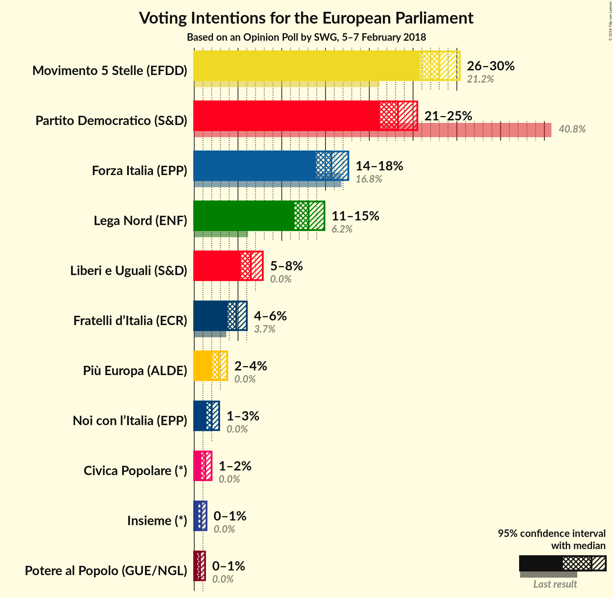
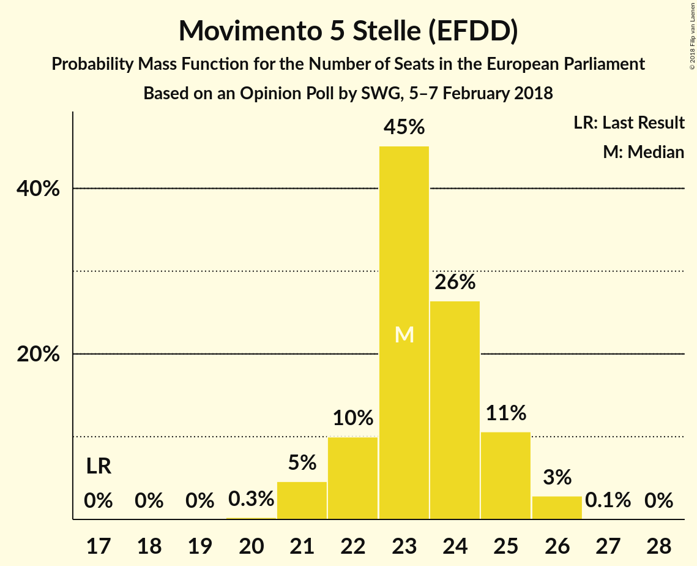
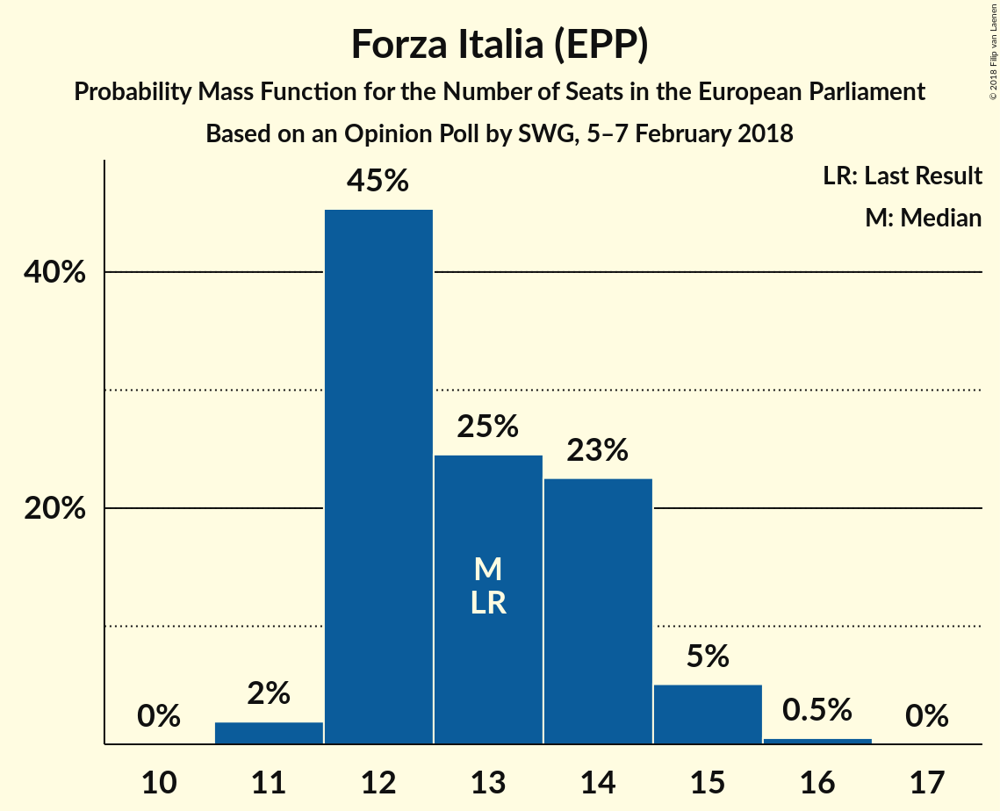
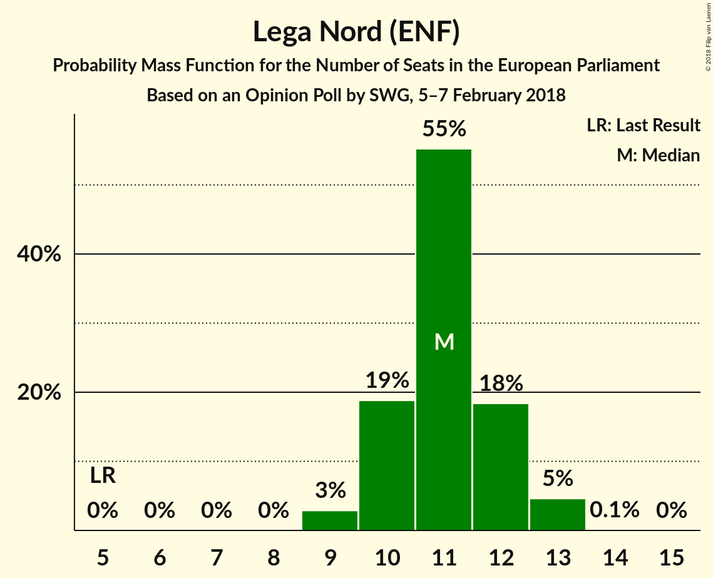
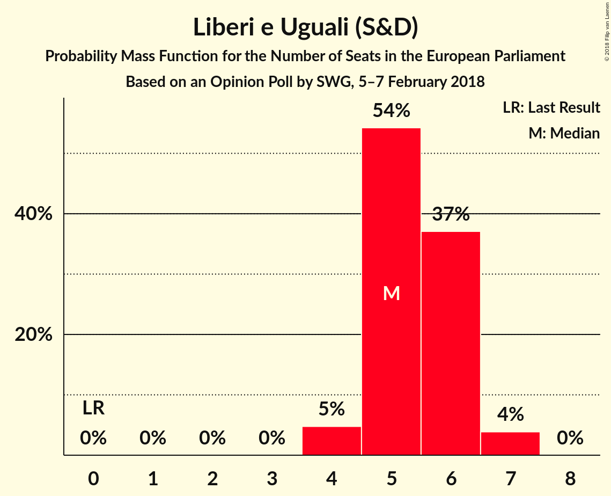
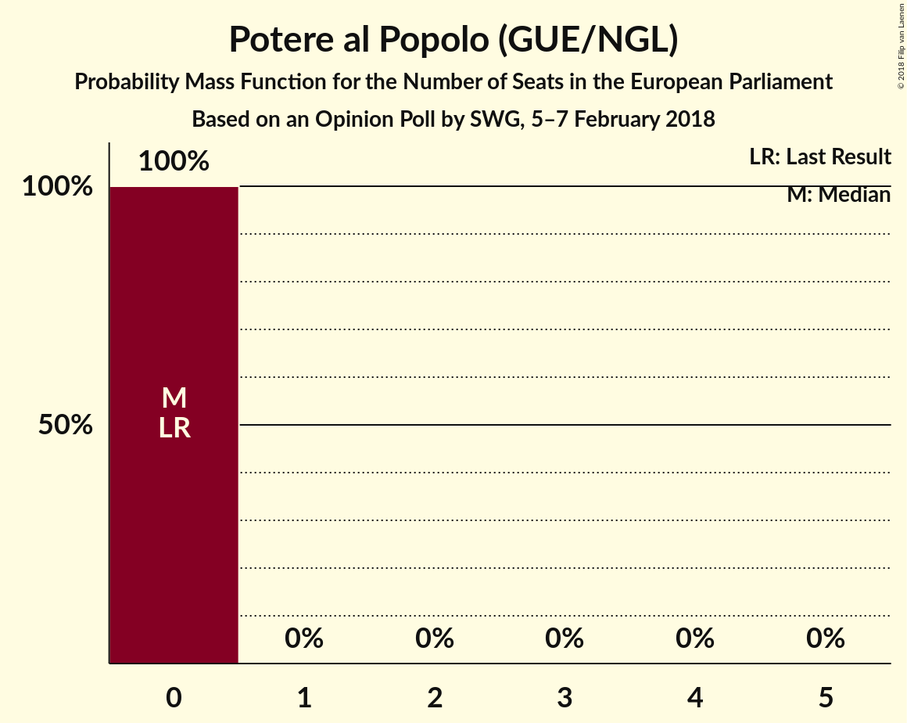
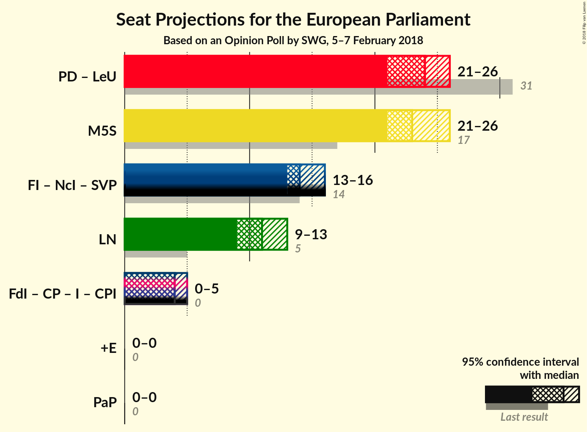

# Opinion Poll by SWG, 5–7 February 2018

<a href="#voting-intentions">Voting Intentions</a> | <a href="#seats">Seats</a> | <a href="#coalitions">Coalitions</a> | <a href="#technical-information">Technical Information</a>

## Voting Intentions

### Confidence Intervals

| Party | Last Result | Poll Result | 80% Confidence Interval | 90% Confidence Interval | 95% Confidence Interval | 99% Confidence Interval |
|:-----:|:-----------:|:-----------:|:-----------------------:|:-----------------------:|:-----------------------:|:-----------------------:|
| Movimento 5 Stelle (EFDD) | 21.1% | 28.0% | 26.5–29.5% |26.1–30.0% |25.8–30.3% |25.1–31.1% |
| Partito Democratico (S&D) | 40.8% | 23.3% | 21.9–24.7% |21.5–25.1% |21.2–25.5% |20.6–26.2% |
| Forza Italia (EPP) | 16.8% | 15.7% | 14.5–16.9% |14.2–17.3% |13.9–17.6% |13.4–18.2% |
| Lega Nord (ENF) | 6.2% | 13.1% | 12.0–14.3% |11.7–14.6% |11.4–14.9% |11.0–15.5% |
| Liberi e Uguali (S&D) | 0.0% | 6.5% | 5.7–7.4% |5.5–7.6% |5.3–7.8% |5.0–8.3% |
| Fratelli d’Italia (*) | 3.7% | 4.8% | 4.2–5.6% |4.0–5.8% |3.8–6.0% |3.5–6.4% |
| Più Europa (ALDE) | 0.0% | 2.8% | 2.3–3.4% |2.2–3.6% |2.1–3.8% |1.9–4.1% |
| Noi con l’Italia (EPP) | 0.0% | 2.0% | 1.6–2.6% |1.5–2.7% |1.4–2.9% |1.2–3.1% |
| Civica Popolare (*) | 0.0% | 1.3% | 1.0–1.7% |0.9–1.9% |0.8–2.0% |0.7–2.2% |
| Insieme (*) | 0.0% | 0.8% | 0.6–1.2% |0.5–1.3% |0.5–1.4% |0.4–1.6% |
| Potere al Popolo (GUE/NGL) | 0.0% | 0.7% | 0.5–1.0% |0.4–1.1% |0.4–1.2% |0.3–1.4% |

*Note:* The poll result column reflects the actual value used in the calculations. Published results may vary slightly, and in addition be rounded to fewer digits.

## Seats

### Confidence Intervals

| Party | Last Result | Median | 80% Confidence Interval | 90% Confidence Interval | 95% Confidence Interval | 99% Confidence Interval |
|:-----:|:-----------:|:------:|:-----------------------:|:-----------------------:|:-----------------------:|:-----------------------:|
| <a href="#movimento-5-stelle-(efdd)">Movimento 5 Stelle (EFDD)</a> | 17 | 23 | 23 |23 |23 |20–23 |
| <a href="#partito-democratico-(s&d)">Partito Democratico (S&D)</a> | 31 | 18 | 18 |18 |18 |17–19 |
| <a href="#forza-italia-(epp)">Forza Italia (EPP)</a> | 13 | 13 | 13 |13 |13 |13–14 |
| <a href="#lega-nord-(enf)">Lega Nord (ENF)</a> | 5 | 11 | 11 |11 |11 |10–12 |
| <a href="#liberi-e-uguali-(s&d)">Liberi e Uguali (S&D)</a> | 0 | 6 | 6 |6 |6 |6–7 |
| <a href="#fratelli-d’italia-(*)">Fratelli d’Italia (*)</a> | 0 | 4 | 4 |4 |4 |4 |
| <a href="#più-europa-(alde)">Più Europa (ALDE)</a> | 0 | 0 | 0 |0 |0 |0–3 |
| <a href="#noi-con-l’italia-(epp)">Noi con l’Italia (EPP)</a> | 0 | 0 | 0 |0 |0 |0 |
| <a href="#civica-popolare-(*)">Civica Popolare (*)</a> | 0 | 0 | 0 |0 |0 |0 |
| <a href="#insieme-(*)">Insieme (*)</a> | 0 | 0 | 0 |0 |0 |0 |
| <a href="#potere-al-popolo-(gue/ngl)">Potere al Popolo (GUE/NGL)</a> | 0 | 0 | 0 |0 |0 |0 |

### Movimento 5 Stelle (EFDD)

*For a full overview of the results for this party, see the [Movimento 5 Stelle (EFDD)](party-movimento5stelleefdd.html) page.*

| Number of Seats | Probability | Accumulated | Special Marks |
|:---------------:|:-----------:|:-----------:|:-------------:|
| 17 | 0% | 100% | Last Result |
| 18 | 0% | 100% |  |
| 19 | 0% | 100% |  |
| 20 | 1.0% | 100% |  |
| 21 | 0.8% | 99.0% |  |
| 22 | 0.3% | 98% |  |
| 23 | 98% | 98% | Median |
| 24 | 0% | 0% |  |

### Partito Democratico (S&D)

*For a full overview of the results for this party, see the [Partito Democratico (S&D)](party-partitodemocraticosd.html) page.*

| Number of Seats | Probability | Accumulated | Special Marks |
|:---------------:|:-----------:|:-----------:|:-------------:|
| 17 | 1.0% | 100% |  |
| 18 | 98% | 99.0% | Median |
| 19 | 1.0% | 1.0% |  |
| 20 | 0% | 0% |  |
| 21 | 0% | 0% |  |
| 22 | 0% | 0% |  |
| 23 | 0% | 0% |  |
| 24 | 0% | 0% |  |
| 25 | 0% | 0% |  |
| 26 | 0% | 0% |  |
| 27 | 0% | 0% |  |
| 28 | 0% | 0% |  |
| 29 | 0% | 0% |  |
| 30 | 0% | 0% |  |
| 31 | 0% | 0% | Last Result |

### Forza Italia (EPP)

*For a full overview of the results for this party, see the [Forza Italia (EPP)](party-forzaitaliaepp.html) page.*

| Number of Seats | Probability | Accumulated | Special Marks |
|:---------------:|:-----------:|:-----------:|:-------------:|
| 13 | 99.0% | 100% | Last Result, Median |
| 14 | 1.0% | 1.0% |  |
| 15 | 0% | 0% |  |

### Lega Nord (ENF)

*For a full overview of the results for this party, see the [Lega Nord (ENF)](party-leganordenf.html) page.*

| Number of Seats | Probability | Accumulated | Special Marks |
|:---------------:|:-----------:|:-----------:|:-------------:|
| 5 | 0% | 100% | Last Result |
| 6 | 0% | 100% |  |
| 7 | 0% | 100% |  |
| 8 | 0% | 100% |  |
| 9 | 0.3% | 100% |  |
| 10 | 1.0% | 99.7% |  |
| 11 | 98% | 98.7% | Median |
| 12 | 0.8% | 0.8% |  |
| 13 | 0% | 0% |  |

### Liberi e Uguali (S&D)

*For a full overview of the results for this party, see the [Liberi e Uguali (S&D)](party-liberieugualisd.html) page.*

| Number of Seats | Probability | Accumulated | Special Marks |
|:---------------:|:-----------:|:-----------:|:-------------:|
| 0 | 0% | 100% | Last Result |
| 1 | 0% | 100% |  |
| 2 | 0% | 100% |  |
| 3 | 0% | 100% |  |
| 4 | 0% | 100% |  |
| 5 | 0.3% | 100% |  |
| 6 | 99.0% | 99.7% | Median |
| 7 | 0.8% | 0.8% |  |
| 8 | 0% | 0% |  |

### Fratelli d’Italia (*)

*For a full overview of the results for this party, see the [Fratelli d’Italia (*)](party-fratellid’italia.html) page.*

| Number of Seats | Probability | Accumulated | Special Marks |
|:---------------:|:-----------:|:-----------:|:-------------:|
| 0 | 0% | 100% | Last Result |
| 1 | 0% | 100% |  |
| 2 | 0% | 100% |  |
| 3 | 0% | 100% |  |
| 4 | 100% | 100% | Median |

### Più Europa (ALDE)

*For a full overview of the results for this party, see the [Più Europa (ALDE)](party-piùeuropaalde.html) page.*

| Number of Seats | Probability | Accumulated | Special Marks |
|:---------------:|:-----------:|:-----------:|:-------------:|
| 0 | 98.7% | 100% | Last Result, Median |
| 1 | 0% | 1.3% |  |
| 2 | 0% | 1.3% |  |
| 3 | 1.0% | 1.3% |  |
| 4 | 0.3% | 0.3% |  |
| 5 | 0% | 0% |  |

### Noi con l’Italia (EPP)

*For a full overview of the results for this party, see the [Noi con l’Italia (EPP)](party-noiconl’italiaepp.html) page.*

| Number of Seats | Probability | Accumulated | Special Marks |
|:---------------:|:-----------:|:-----------:|:-------------:|
| 0 | 100% | 100% | Last Result, Median |

### Civica Popolare (*)

*For a full overview of the results for this party, see the [Civica Popolare (*)](party-civicapopolare.html) page.*

| Number of Seats | Probability | Accumulated | Special Marks |
|:---------------:|:-----------:|:-----------:|:-------------:|
| 0 | 100% | 100% | Last Result, Median |

### Insieme (*)

*For a full overview of the results for this party, see the [Insieme (*)](party-insieme.html) page.*

| Number of Seats | Probability | Accumulated | Special Marks |
|:---------------:|:-----------:|:-----------:|:-------------:|
| 0 | 100% | 100% | Last Result, Median |

### Potere al Popolo (GUE/NGL)

*For a full overview of the results for this party, see the [Potere al Popolo (GUE/NGL)](party-poterealpopologuengl.html) page.*

| Number of Seats | Probability | Accumulated | Special Marks |
|:---------------:|:-----------:|:-----------:|:-------------:|
| 0 | 100% | 100% | Last Result, Median |

## Coalitions

### Confidence Intervals

| Coalition | Last Result | Median | Majority? | 80% Confidence Interval | 90% Confidence Interval | 95% Confidence Interval | 99% Confidence Interval |
|:---------:|:-----------:|:------:|:---------:|:-----------------------:|:-----------------------:|:-----------------------:|:-----------------------:|
| Partito Democratico (S&D) – Liberi e Uguali (S&D) | 31 | 24 | 0% | 24 | 24 | 24 | 24–25 |
| Movimento 5 Stelle (EFDD) | 17 | 23 | 0% | 23 | 23 | 23 | 20–23 |
| Lega Nord (ENF) | 5 | 11 | 0% | 11 | 11 | 11 | 10–12 |
| Più Europa (ALDE) | 0 | 0 | 0% | 0 | 0 | 0 | 0–3 |
| Potere al Popolo (GUE/NGL) | 0 | 0 | 0% | 0 | 0 | 0 | 0 |

### Partito Democratico (S&D) – Liberi e Uguali (S&D)

| Number of Seats | Probability | Accumulated | Special Marks |
|:---------------:|:-----------:|:-----------:|:-------------:|
| 22 | 0.3% | 100% |  |
| 23 | 0% | 99.7% |  |
| 24 | 98.7% | 99.7% | Median |
| 25 | 1.0% | 1.0% |  |
| 26 | 0% | 0% |  |
| 27 | 0% | 0% |  |
| 28 | 0% | 0% |  |
| 29 | 0% | 0% |  |
| 30 | 0% | 0% |  |
| 31 | 0% | 0% | Last Result |

### Movimento 5 Stelle (EFDD)

| Number of Seats | Probability | Accumulated | Special Marks |
|:---------------:|:-----------:|:-----------:|:-------------:|
| 17 | 0% | 100% | Last Result |
| 18 | 0% | 100% |  |
| 19 | 0% | 100% |  |
| 20 | 1.0% | 100% |  |
| 21 | 0.8% | 99.0% |  |
| 22 | 0.3% | 98% |  |
| 23 | 98% | 98% | Median |
| 24 | 0% | 0% |  |

### Lega Nord (ENF)

| Number of Seats | Probability | Accumulated | Special Marks |
|:---------------:|:-----------:|:-----------:|:-------------:|
| 5 | 0% | 100% | Last Result |
| 6 | 0% | 100% |  |
| 7 | 0% | 100% |  |
| 8 | 0% | 100% |  |
| 9 | 0.3% | 100% |  |
| 10 | 1.0% | 99.7% |  |
| 11 | 98% | 98.7% | Median |
| 12 | 0.8% | 0.8% |  |
| 13 | 0% | 0% |  |

### Più Europa (ALDE)

| Number of Seats | Probability | Accumulated | Special Marks |
|:---------------:|:-----------:|:-----------:|:-------------:|
| 0 | 98.7% | 100% | Last Result, Median |
| 1 | 0% | 1.3% |  |
| 2 | 0% | 1.3% |  |
| 3 | 1.0% | 1.3% |  |
| 4 | 0.3% | 0.3% |  |
| 5 | 0% | 0% |  |

### Potere al Popolo (GUE/NGL)

| Number of Seats | Probability | Accumulated | Special Marks |
|:---------------:|:-----------:|:-----------:|:-------------:|
| 0 | 100% | 100% | Last Result, Median |

## Technical Information

### Opinion Poll

+ **Polling firm:** SWG
+ **Commissioner(s):** —
+ **Fieldwork period:** 5–7 February 2018

### Calculations

+ **Sample size:** 1500
+ **Simulations done:** 1,024
+ **Error estimate:** 3.22%

