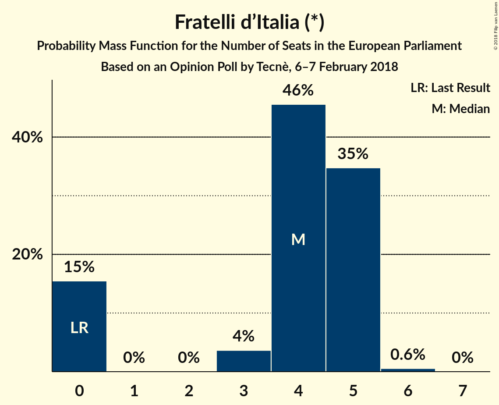
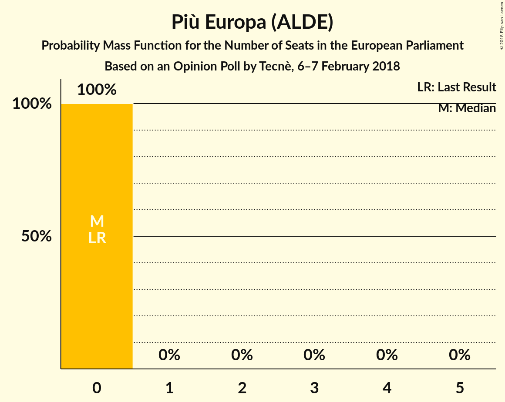

# Opinion Poll by Tecnè, 6–7 February 2018

<a href="#voting-intentions">Voting Intentions</a> | <a href="#seats">Seats</a> | <a href="#coalitions">Coalitions</a> | <a href="#technical-information">Technical Information</a>

## Voting Intentions

### Confidence Intervals

| Party | Last Result | Poll Result | 80% Confidence Interval | 90% Confidence Interval | 95% Confidence Interval | 99% Confidence Interval |
|:-----:|:-----------:|:-----------:|:-----------------------:|:-----------------------:|:-----------------------:|:-----------------------:|
| Movimento 5 Stelle (EFDD) | 21.1% | 28.0% | 26.2–29.9% |25.7–30.4% |25.3–30.9% |24.5–31.8% |
| Partito Democratico (S&D) | 40.8% | 22.1% | 20.5–23.9% |20.1–24.4% |19.7–24.8% |18.9–25.7% |
| Forza Italia (EPP) | 16.8% | 18.3% | 16.8–20.0% |16.4–20.5% |16.1–20.9% |15.4–21.7% |
| Lega Nord (ENF) | 6.2% | 13.2% | 11.9–14.6% |11.5–15.0% |11.2–15.4% |10.6–16.1% |
| Liberi e Uguali (S&D) | 0.0% | 5.7% | 4.8–6.7% |4.6–7.0% |4.4–7.3% |4.0–7.8% |
| Fratelli d’Italia (*) | 3.7% | 4.9% | 4.1–5.9% |3.9–6.2% |3.7–6.4% |3.4–6.9% |
| Noi con l’Italia (EPP) | 0.0% | 2.9% | 2.3–3.7% |2.1–3.9% |2.0–4.1% |1.8–4.5% |
| Più Europa (ALDE) | 0.0% | 1.6% | 1.2–2.2% |1.1–2.4% |1.0–2.6% |0.8–2.9% |

*Note:* The poll result column reflects the actual value used in the calculations. Published results may vary slightly, and in addition be rounded to fewer digits.

## Seats

### Confidence Intervals

| Party | Last Result | Median | 80% Confidence Interval | 90% Confidence Interval | 95% Confidence Interval | 99% Confidence Interval |
|:-----:|:-----------:|:------:|:-----------------------:|:-----------------------:|:-----------------------:|:-----------------------:|
| <a href="#movimento-5-stelle-(efdd)">Movimento 5 Stelle (EFDD)</a> | 17 | 24 | 23–24 |23–24 |23–24 |21–28 |
| <a href="#partito-democratico-(s&d)">Partito Democratico (S&D)</a> | 31 | 16 | 15–18 |15–18 |15–19 |14–20 |
| <a href="#forza-italia-(epp)">Forza Italia (EPP)</a> | 13 | 14 | 13–15 |13–15 |13–16 |13–16 |
| <a href="#lega-nord-(enf)">Lega Nord (ENF)</a> | 5 | 9 | 9–10 |9–10 |9–13 |9–13 |
| <a href="#liberi-e-uguali-(s&d)">Liberi e Uguali (S&D)</a> | 0 | 4 | 4–5 |4–7 |4–7 |3–7 |
| <a href="#fratelli-d’italia-(*)">Fratelli d’Italia (*)</a> | 0 | 5 | 4–5 |3–5 |3–5 |0–6 |
| <a href="#noi-con-l’italia-(epp)">Noi con l’Italia (EPP)</a> | 0 | 0 | 0–4 |0–4 |0–4 |0–4 |
| <a href="#più-europa-(alde)">Più Europa (ALDE)</a> | 0 | 0 | 0 |0 |0 |0 |

### Movimento 5 Stelle (EFDD)

*For a full overview of the results for this party, see the [Movimento 5 Stelle (EFDD)](party-movimento5stelleefdd.html) page.*

| Number of Seats | Probability | Accumulated | Special Marks |
|:---------------:|:-----------:|:-----------:|:-------------:|
| 17 | 0% | 100% | Last Result |
| 18 | 0% | 100% |  |
| 19 | 0% | 100% |  |
| 20 | 0% | 100% |  |
| 21 | 0.5% | 100% |  |
| 22 | 2% | 99.5% |  |
| 23 | 21% | 98% |  |
| 24 | 74% | 76% | Median |
| 25 | 2% | 2% |  |
| 26 | 0.1% | 0.7% |  |
| 27 | 0% | 0.6% |  |
| 28 | 0.6% | 0.6% |  |
| 29 | 0% | 0% |  |

### Partito Democratico (S&D)

*For a full overview of the results for this party, see the [Partito Democratico (S&D)](party-partitodemocraticosd.html) page.*

| Number of Seats | Probability | Accumulated | Special Marks |
|:---------------:|:-----------:|:-----------:|:-------------:|
| 14 | 1.1% | 100% |  |
| 15 | 14% | 98.9% |  |
| 16 | 75% | 85% | Median |
| 17 | 0.4% | 11% |  |
| 18 | 7% | 10% |  |
| 19 | 2% | 3% |  |
| 20 | 2% | 2% |  |
| 21 | 0% | 0% |  |
| 22 | 0% | 0% |  |
| 23 | 0% | 0% |  |
| 24 | 0% | 0% |  |
| 25 | 0% | 0% |  |
| 26 | 0% | 0% |  |
| 27 | 0% | 0% |  |
| 28 | 0% | 0% |  |
| 29 | 0% | 0% |  |
| 30 | 0% | 0% |  |
| 31 | 0% | 0% | Last Result |

### Forza Italia (EPP)

*For a full overview of the results for this party, see the [Forza Italia (EPP)](party-forzaitaliaepp.html) page.*

| Number of Seats | Probability | Accumulated | Special Marks |
|:---------------:|:-----------:|:-----------:|:-------------:|
| 12 | 0.4% | 100% |  |
| 13 | 15% | 99.6% | Last Result |
| 14 | 64% | 84% | Median |
| 15 | 17% | 20% |  |
| 16 | 3% | 3% |  |
| 17 | 0% | 0% |  |

### Lega Nord (ENF)

*For a full overview of the results for this party, see the [Lega Nord (ENF)](party-leganordenf.html) page.*

| Number of Seats | Probability | Accumulated | Special Marks |
|:---------------:|:-----------:|:-----------:|:-------------:|
| 5 | 0% | 100% | Last Result |
| 6 | 0% | 100% |  |
| 7 | 0.1% | 100% |  |
| 8 | 0.1% | 99.9% |  |
| 9 | 81% | 99.8% | Median |
| 10 | 15% | 19% |  |
| 11 | 1.5% | 4% |  |
| 12 | 0.1% | 3% |  |
| 13 | 2% | 3% |  |
| 14 | 0% | 0% |  |

### Liberi e Uguali (S&D)

*For a full overview of the results for this party, see the [Liberi e Uguali (S&D)](party-liberieugualisd.html) page.*

| Number of Seats | Probability | Accumulated | Special Marks |
|:---------------:|:-----------:|:-----------:|:-------------:|
| 0 | 0.1% | 100% | Last Result |
| 1 | 0% | 99.9% |  |
| 2 | 0% | 99.9% |  |
| 3 | 2% | 99.9% |  |
| 4 | 74% | 98% | Median |
| 5 | 17% | 24% |  |
| 6 | 1.2% | 7% |  |
| 7 | 6% | 6% |  |
| 8 | 0% | 0% |  |

### Fratelli d’Italia (*)

*For a full overview of the results for this party, see the [Fratelli d’Italia (*)](party-fratellid’italia.html) page.*

| Number of Seats | Probability | Accumulated | Special Marks |
|:---------------:|:-----------:|:-----------:|:-------------:|
| 0 | 2% | 100% | Last Result |
| 1 | 0% | 98% |  |
| 2 | 0% | 98% |  |
| 3 | 4% | 98% |  |
| 4 | 20% | 94% |  |
| 5 | 73% | 74% | Median |
| 6 | 0.7% | 0.8% |  |
| 7 | 0% | 0% |  |

### Noi con l’Italia (EPP)

*For a full overview of the results for this party, see the [Noi con l’Italia (EPP)](party-noiconl’italiaepp.html) page.*

| Number of Seats | Probability | Accumulated | Special Marks |
|:---------------:|:-----------:|:-----------:|:-------------:|
| 0 | 84% | 100% | Last Result, Median |
| 1 | 0% | 16% |  |
| 2 | 0% | 16% |  |
| 3 | 0.2% | 16% |  |
| 4 | 16% | 16% |  |
| 5 | 0% | 0% |  |

### Più Europa (ALDE)

*For a full overview of the results for this party, see the [Più Europa (ALDE)](party-piùeuropaalde.html) page.*

| Number of Seats | Probability | Accumulated | Special Marks |
|:---------------:|:-----------:|:-----------:|:-------------:|
| 0 | 100% | 100% | Last Result, Median |

## Coalitions

### Confidence Intervals

| Coalition | Last Result | Median | Majority? | 80% Confidence Interval | 90% Confidence Interval | 95% Confidence Interval | 99% Confidence Interval |
|:---------:|:-----------:|:------:|:---------:|:-----------------------:|:-----------------------:|:-----------------------:|:-----------------------:|
| Partito Democratico (S&D) – Liberi e Uguali (S&D) | 31 | 20 | 0% | 20–22 | 20–25 | 20–25 | 19–25 |
| Movimento 5 Stelle (EFDD) | 17 | 24 | 0% | 23–24 | 23–24 | 23–24 | 21–28 |
| Lega Nord (ENF) | 5 | 9 | 0% | 9–10 | 9–10 | 9–13 | 9–13 |
| Più Europa (ALDE) | 0 | 0 | 0% | 0 | 0 | 0 | 0 |

### Partito Democratico (S&D) – Liberi e Uguali (S&D)

| Number of Seats | Probability | Accumulated | Special Marks |
|:---------------:|:-----------:|:-----------:|:-------------:|
| 17 | 0.1% | 100% |  |
| 18 | 0% | 99.9% |  |
| 19 | 1.3% | 99.9% |  |
| 20 | 88% | 98.6% | Median |
| 21 | 0.2% | 11% |  |
| 22 | 0.7% | 11% |  |
| 23 | 2% | 10% |  |
| 24 | 1.3% | 8% |  |
| 25 | 6% | 6% |  |
| 26 | 0% | 0% |  |
| 27 | 0% | 0% |  |
| 28 | 0% | 0% |  |
| 29 | 0% | 0% |  |
| 30 | 0% | 0% |  |
| 31 | 0% | 0% | Last Result |

### Movimento 5 Stelle (EFDD)

| Number of Seats | Probability | Accumulated | Special Marks |
|:---------------:|:-----------:|:-----------:|:-------------:|
| 17 | 0% | 100% | Last Result |
| 18 | 0% | 100% |  |
| 19 | 0% | 100% |  |
| 20 | 0% | 100% |  |
| 21 | 0.5% | 100% |  |
| 22 | 2% | 99.5% |  |
| 23 | 21% | 98% |  |
| 24 | 74% | 76% | Median |
| 25 | 2% | 2% |  |
| 26 | 0.1% | 0.7% |  |
| 27 | 0% | 0.6% |  |
| 28 | 0.6% | 0.6% |  |
| 29 | 0% | 0% |  |

### Lega Nord (ENF)

| Number of Seats | Probability | Accumulated | Special Marks |
|:---------------:|:-----------:|:-----------:|:-------------:|
| 5 | 0% | 100% | Last Result |
| 6 | 0% | 100% |  |
| 7 | 0.1% | 100% |  |
| 8 | 0.1% | 99.9% |  |
| 9 | 81% | 99.8% | Median |
| 10 | 15% | 19% |  |
| 11 | 1.5% | 4% |  |
| 12 | 0.1% | 3% |  |
| 13 | 2% | 3% |  |
| 14 | 0% | 0% |  |

### Più Europa (ALDE)

| Number of Seats | Probability | Accumulated | Special Marks |
|:---------------:|:-----------:|:-----------:|:-------------:|
| 0 | 100% | 100% | Last Result, Median |

## Technical Information

### Opinion Poll

+ **Polling firm:** Tecnè
+ **Commissioner(s):** —
+ **Fieldwork period:** 6–7 February 2018

### Calculations

+ **Sample size:** 1003
+ **Simulations done:** 1,024
+ **Error estimate:** 2.24%

