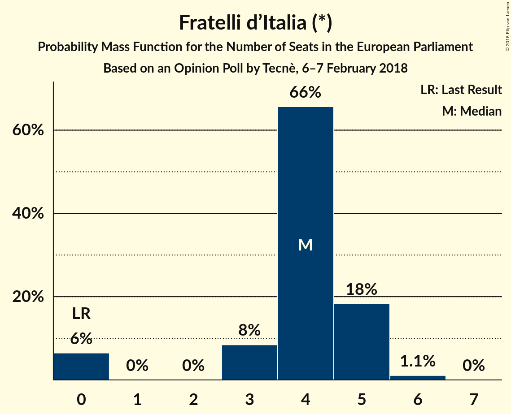
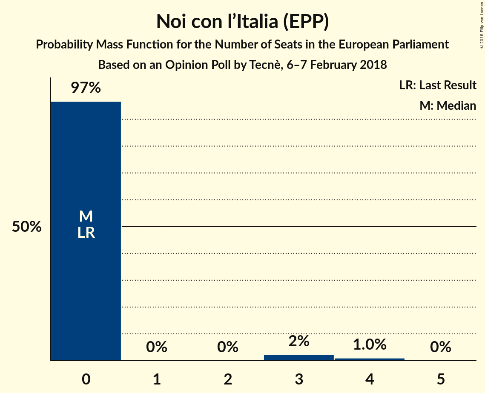

# Opinion Poll by Tecnè, 6–7 February 2018

<a href="#voting-intentions">Voting Intentions</a> | <a href="#seats">Seats</a> | <a href="#coalitions">Coalitions</a> | <a href="#technical-information">Technical Information</a>

## Voting Intentions

### Confidence Intervals

| Party | Last Result | Poll Result | 80% Confidence Interval | 90% Confidence Interval | 95% Confidence Interval | 99% Confidence Interval |
|:-----:|:-----------:|:-----------:|:-----------------------:|:-----------------------:|:-----------------------:|:-----------------------:|
| Movimento 5 Stelle (EFDD) | 21.1% | 28.0% | 26.2–29.9% |25.7–30.4% |25.3–30.9% |24.5–31.8% |
| Partito Democratico (S&D) | 40.8% | 22.1% | 20.5–23.9% |20.1–24.4% |19.7–24.8% |18.9–25.7% |
| Forza Italia (EPP) | 16.8% | 18.3% | 16.8–20.0% |16.4–20.5% |16.1–20.9% |15.4–21.7% |
| Lega Nord (ENF) | 6.2% | 13.2% | 11.9–14.6% |11.5–15.0% |11.2–15.4% |10.6–16.1% |
| Liberi e Uguali (S&D) | 0.0% | 5.7% | 4.8–6.7% |4.6–7.0% |4.4–7.3% |4.0–7.8% |
| Fratelli d’Italia (*) | 3.7% | 4.9% | 4.1–5.9% |3.9–6.2% |3.7–6.4% |3.4–6.9% |
| Noi con l’Italia (EPP) | 0.0% | 2.9% | 2.3–3.7% |2.1–3.9% |2.0–4.1% |1.8–4.5% |
| Più Europa (ALDE) | 0.0% | 1.6% | 1.2–2.2% |1.1–2.4% |1.0–2.6% |0.8–2.9% |

*Note:* The poll result column reflects the actual value used in the calculations. Published results may vary slightly, and in addition be rounded to fewer digits.

## Seats

### Confidence Intervals

| Party | Last Result | Median | 80% Confidence Interval | 90% Confidence Interval | 95% Confidence Interval | 99% Confidence Interval |
|:-----:|:-----------:|:------:|:-----------------------:|:-----------------------:|:-----------------------:|:-----------------------:|
| <a href="#movimento-5-stelle-(efdd)">Movimento 5 Stelle (EFDD)</a> | 17 | 23 | 21–25 |21–25 |20–26 |19–27 |
| <a href="#partito-democratico-(s&d)">Partito Democratico (S&D)</a> | 31 | 17 | 16–19 |15–19 |15–19 |14–20 |
| <a href="#forza-italia-(epp)">Forza Italia (EPP)</a> | 13 | 15 | 13–17 |13–17 |13–18 |12–18 |
| <a href="#lega-nord-(enf)">Lega Nord (ENF)</a> | 5 | 11 | 10–12 |9–12 |9–12 |9–13 |
| <a href="#liberi-e-uguali-(s&d)">Liberi e Uguali (S&D)</a> | 0 | 5 | 4–6 |4–6 |4–6 |0–7 |
| <a href="#fratelli-d’italia-(*)">Fratelli d’Italia (*)</a> | 0 | 4 | 0–5 |0–5 |0–5 |0–6 |
| <a href="#noi-con-l’italia-(epp)">Noi con l’Italia (EPP)</a> | 0 | 0 | 0 |0–3 |0–3 |0–4 |
| <a href="#più-europa-(alde)">Più Europa (ALDE)</a> | 0 | 0 | 0 |0 |0 |0 |

### Movimento 5 Stelle (EFDD)

*For a full overview of the results for this party, see the [Movimento 5 Stelle (EFDD)](party-movimento5stelleefdd.html) page.*

| Number of Seats | Probability | Accumulated | Special Marks |
|:---------------:|:-----------:|:-----------:|:-------------:|
| 17 | 0% | 100% | Last Result |
| 18 | 0% | 100% |  |
| 19 | 0.5% | 100% |  |
| 20 | 4% | 99.5% |  |
| 21 | 14% | 95% |  |
| 22 | 30% | 81% |  |
| 23 | 20% | 51% | Median |
| 24 | 18% | 31% |  |
| 25 | 9% | 13% |  |
| 26 | 2% | 4% |  |
| 27 | 1.1% | 1.3% |  |
| 28 | 0.1% | 0.1% |  |
| 29 | 0% | 0% |  |

### Partito Democratico (S&D)

*For a full overview of the results for this party, see the [Partito Democratico (S&D)](party-partitodemocraticosd.html) page.*

| Number of Seats | Probability | Accumulated | Special Marks |
|:---------------:|:-----------:|:-----------:|:-------------:|
| 13 | 0.1% | 100% |  |
| 14 | 0.5% | 99.9% |  |
| 15 | 9% | 99.5% |  |
| 16 | 22% | 90% |  |
| 17 | 32% | 69% | Median |
| 18 | 15% | 37% |  |
| 19 | 20% | 21% |  |
| 20 | 1.1% | 1.4% |  |
| 21 | 0.3% | 0.3% |  |
| 22 | 0% | 0% |  |
| 23 | 0% | 0% |  |
| 24 | 0% | 0% |  |
| 25 | 0% | 0% |  |
| 26 | 0% | 0% |  |
| 27 | 0% | 0% |  |
| 28 | 0% | 0% |  |
| 29 | 0% | 0% |  |
| 30 | 0% | 0% |  |
| 31 | 0% | 0% | Last Result |

### Forza Italia (EPP)

*For a full overview of the results for this party, see the [Forza Italia (EPP)](party-forzaitaliaepp.html) page.*

| Number of Seats | Probability | Accumulated | Special Marks |
|:---------------:|:-----------:|:-----------:|:-------------:|
| 12 | 0.8% | 100% |  |
| 13 | 11% | 99.2% | Last Result |
| 14 | 18% | 88% |  |
| 15 | 33% | 70% | Median |
| 16 | 26% | 37% |  |
| 17 | 7% | 11% |  |
| 18 | 4% | 4% |  |
| 19 | 0.5% | 0.5% |  |
| 20 | 0% | 0% |  |

### Lega Nord (ENF)

*For a full overview of the results for this party, see the [Lega Nord (ENF)](party-leganordenf.html) page.*

| Number of Seats | Probability | Accumulated | Special Marks |
|:---------------:|:-----------:|:-----------:|:-------------:|
| 5 | 0% | 100% | Last Result |
| 6 | 0% | 100% |  |
| 7 | 0% | 100% |  |
| 8 | 0.3% | 100% |  |
| 9 | 9% | 99.7% |  |
| 10 | 23% | 91% |  |
| 11 | 42% | 68% | Median |
| 12 | 25% | 27% |  |
| 13 | 2% | 2% |  |
| 14 | 0.3% | 0.3% |  |
| 15 | 0% | 0% |  |

### Liberi e Uguali (S&D)

*For a full overview of the results for this party, see the [Liberi e Uguali (S&D)](party-liberieugualisd.html) page.*

| Number of Seats | Probability | Accumulated | Special Marks |
|:---------------:|:-----------:|:-----------:|:-------------:|
| 0 | 0.6% | 100% | Last Result |
| 1 | 0% | 99.4% |  |
| 2 | 0% | 99.4% |  |
| 3 | 2% | 99.4% |  |
| 4 | 41% | 98% |  |
| 5 | 39% | 57% | Median |
| 6 | 16% | 17% |  |
| 7 | 1.0% | 1.0% |  |
| 8 | 0% | 0% |  |

### Fratelli d’Italia (*)

*For a full overview of the results for this party, see the [Fratelli d’Italia (*)](party-fratellid’italia.html) page.*

| Number of Seats | Probability | Accumulated | Special Marks |
|:---------------:|:-----------:|:-----------:|:-------------:|
| 0 | 15% | 100% | Last Result |
| 1 | 0% | 85% |  |
| 2 | 0% | 85% |  |
| 3 | 4% | 85% |  |
| 4 | 46% | 81% | Median |
| 5 | 35% | 35% |  |
| 6 | 0.6% | 0.6% |  |
| 7 | 0% | 0% |  |

### Noi con l’Italia (EPP)

*For a full overview of the results for this party, see the [Noi con l’Italia (EPP)](party-noiconl’italiaepp.html) page.*

| Number of Seats | Probability | Accumulated | Special Marks |
|:---------------:|:-----------:|:-----------:|:-------------:|
| 0 | 91% | 100% | Last Result, Median |
| 1 | 0% | 9% |  |
| 2 | 0% | 9% |  |
| 3 | 7% | 9% |  |
| 4 | 2% | 2% |  |
| 5 | 0% | 0% |  |

### Più Europa (ALDE)

*For a full overview of the results for this party, see the [Più Europa (ALDE)](party-piùeuropaalde.html) page.*

| Number of Seats | Probability | Accumulated | Special Marks |
|:---------------:|:-----------:|:-----------:|:-------------:|
| 0 | 100% | 100% | Last Result, Median |

## Coalitions

### Confidence Intervals

| Coalition | Last Result | Median | Majority? | 80% Confidence Interval | 90% Confidence Interval | 95% Confidence Interval | 99% Confidence Interval |
|:---------:|:-----------:|:------:|:---------:|:-----------------------:|:-----------------------:|:-----------------------:|:-----------------------:|
| Movimento 5 Stelle (EFDD) | 17 | 23 | 0% | 21–25 | 21–25 | 20–26 | 19–27 |
| Partito Democratico (S&D) – Liberi e Uguali (S&D) | 31 | 22 | 0% | 20–24 | 20–24 | 19–25 | 18–25 |
| Lega Nord (ENF) | 5 | 11 | 0% | 10–12 | 9–12 | 9–12 | 9–13 |
| Più Europa (ALDE) | 0 | 0 | 0% | 0 | 0 | 0 | 0 |

### Movimento 5 Stelle (EFDD)

| Number of Seats | Probability | Accumulated | Special Marks |
|:---------------:|:-----------:|:-----------:|:-------------:|
| 17 | 0% | 100% | Last Result |
| 18 | 0% | 100% |  |
| 19 | 0.5% | 100% |  |
| 20 | 4% | 99.5% |  |
| 21 | 14% | 95% |  |
| 22 | 30% | 81% |  |
| 23 | 20% | 51% | Median |
| 24 | 18% | 31% |  |
| 25 | 9% | 13% |  |
| 26 | 2% | 4% |  |
| 27 | 1.1% | 1.3% |  |
| 28 | 0.1% | 0.1% |  |
| 29 | 0% | 0% |  |

### Partito Democratico (S&D) – Liberi e Uguali (S&D)

| Number of Seats | Probability | Accumulated | Special Marks |
|:---------------:|:-----------:|:-----------:|:-------------:|
| 17 | 0.2% | 100% |  |
| 18 | 0.5% | 99.7% |  |
| 19 | 2% | 99.3% |  |
| 20 | 16% | 97% |  |
| 21 | 23% | 81% |  |
| 22 | 19% | 58% | Median |
| 23 | 27% | 39% |  |
| 24 | 8% | 12% |  |
| 25 | 3% | 3% |  |
| 26 | 0.3% | 0.3% |  |
| 27 | 0% | 0% |  |
| 28 | 0% | 0% |  |
| 29 | 0% | 0% |  |
| 30 | 0% | 0% |  |
| 31 | 0% | 0% | Last Result |

### Lega Nord (ENF)

| Number of Seats | Probability | Accumulated | Special Marks |
|:---------------:|:-----------:|:-----------:|:-------------:|
| 5 | 0% | 100% | Last Result |
| 6 | 0% | 100% |  |
| 7 | 0% | 100% |  |
| 8 | 0.3% | 100% |  |
| 9 | 9% | 99.7% |  |
| 10 | 23% | 91% |  |
| 11 | 42% | 68% | Median |
| 12 | 25% | 27% |  |
| 13 | 2% | 2% |  |
| 14 | 0.3% | 0.3% |  |
| 15 | 0% | 0% |  |

### Più Europa (ALDE)

| Number of Seats | Probability | Accumulated | Special Marks |
|:---------------:|:-----------:|:-----------:|:-------------:|
| 0 | 100% | 100% | Last Result, Median |

## Technical Information

### Opinion Poll

+ **Polling firm:** Tecnè
+ **Commissioner(s):** —
+ **Fieldwork period:** 6–7 February 2018

### Calculations

+ **Sample size:** 1003
+ **Simulations done:** 131,072
+ **Error estimate:** 2.10%

