# Opinion Poll by Index, 8 February 2018

<a href="#voting-intentions">Voting Intentions</a> | <a href="#seats">Seats</a> | <a href="#coalitions">Coalitions</a> | <a href="#technical-information">Technical Information</a>

## Voting Intentions

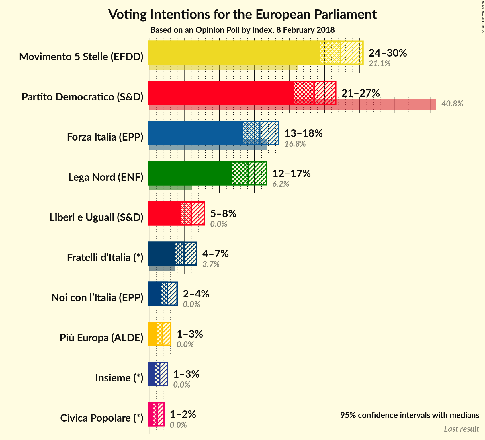

### Confidence Intervals

| Party | Last Result | Poll Result | 80% Confidence Interval | 90% Confidence Interval | 95% Confidence Interval | 99% Confidence Interval |
|:-----:|:-----------:|:-----------:|:-----------------------:|:-----------------------:|:-----------------------:|:-----------------------:|
| Movimento 5 Stelle (EFDD) | 21.1% | 27.2% | 25.3–29.3% |24.8–29.9% |24.3–30.5% |23.4–31.5% |
| Partito Democratico (S&D) | 40.8% | 23.5% | 21.7–25.5% |21.1–26.1% |20.7–26.6% |19.8–27.6% |
| Forza Italia (EPP) | 16.8% | 15.8% | 14.2–17.5% |13.8–18.0% |13.4–18.4% |12.7–19.3% |
| Lega Nord (ENF) | 6.2% | 14.1% | 12.7–15.8% |12.2–16.3% |11.9–16.7% |11.2–17.6% |
| Liberi e Uguali (S&D) | 0.0% | 6.0% | 5.0–7.2% |4.8–7.6% |4.6–7.9% |4.1–8.5% |
| Fratelli d’Italia (—) | 3.7% | 5.0% | 4.1–6.1% |3.9–6.5% |3.7–6.8% |3.3–7.3% |
| Noi con l’Italia (—) | 0.0% | 2.6% | 2.0–3.5% |1.9–3.8% |1.7–4.0% |1.5–4.5% |
| Più Europa (—) | 0.0% | 1.9% | 1.4–2.7% |1.2–2.9% |1.1–3.1% |0.9–3.5% |
| Insieme (—) | 0.0% | 1.5% | 1.1–2.2% |1.0–2.4% |0.9–2.6% |0.7–3.0% |
| Civica Popolare (—) | 0.0% | 1.1% | 0.8–1.8% |0.7–2.0% |0.6–2.1% |0.5–2.5% |

*Note:* The poll result column reflects the actual value used in the calculations. Published results may vary slightly, and in addition be rounded to fewer digits.

## Seats

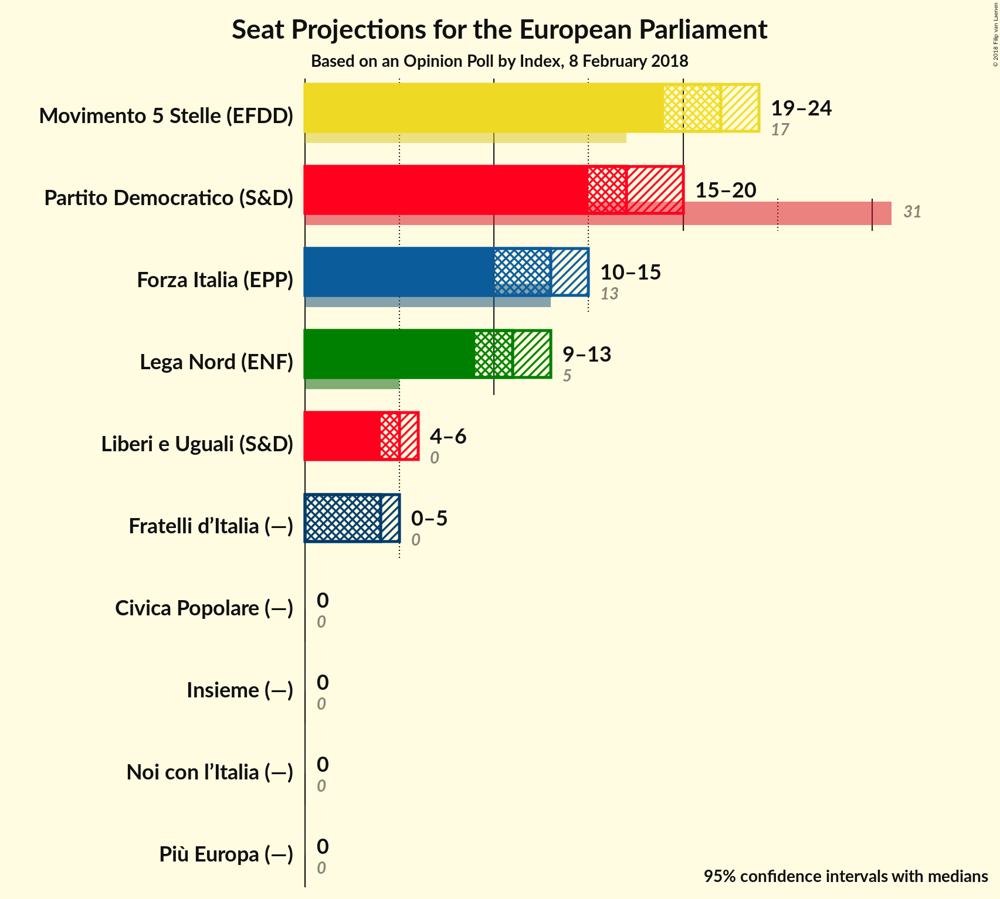

### Confidence Intervals

| Party | Last Result | Median | 80% Confidence Interval | 90% Confidence Interval | 95% Confidence Interval | 99% Confidence Interval |
|:-----:|:-----------:|:------:|:-----------------------:|:-----------------------:|:-----------------------:|:-----------------------:|
| <a href="#movimento-5-stelle-(efdd)">Movimento 5 Stelle (EFDD)</a> | 17 | 22 | 22 |22 |21–22 |21–22 |
| <a href="#partito-democratico-(s&d)">Partito Democratico (S&D)</a> | 31 | 18 | 18 |18 |18 |17–20 |
| <a href="#forza-italia-(epp)">Forza Italia (EPP)</a> | 13 | 13 | 13 |13 |13 |11–14 |
| <a href="#lega-nord-(enf)">Lega Nord (ENF)</a> | 5 | 11 | 11 |11 |11–12 |9–14 |
| <a href="#liberi-e-uguali-(s&d)">Liberi e Uguali (S&D)</a> | 0 | 6 | 5–6 |5–6 |5–6 |4–7 |
| <a href="#fratelli-d’italia-(—)">Fratelli d’Italia (—)</a> | 0 | 5 | 5–6 |5–6 |5–6 |5–6 |
| <a href="#noi-con-l’italia-(—)">Noi con l’Italia (—)</a> | 0 | 0 | 0 |0 |0 |0 |
| <a href="#più-europa-(—)">Più Europa (—)</a> | 0 | 0 | 0 |0 |0 |0 |
| <a href="#insieme-(—)">Insieme (—)</a> | 0 | 0 | 0 |0 |0 |0 |
| <a href="#civica-popolare-(—)">Civica Popolare (—)</a> | 0 | 0 | 0 |0 |0 |0 |

### Movimento 5 Stelle (EFDD)

*For a full overview of the results for this party, see the [Movimento 5 Stelle (EFDD)](party-movimento5stelleefdd.html) page.*

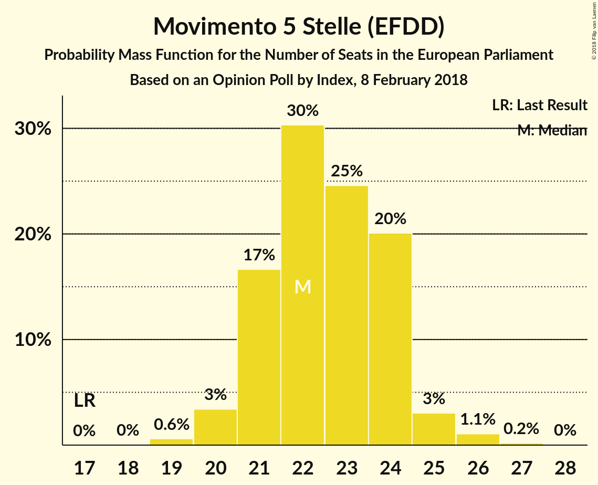

| Number of Seats | Probability | Accumulated | Special Marks |
|:---------------:|:-----------:|:-----------:|:-------------:|
| 17 | 0% | 100% | Last Result |
| 18 | 0.2% | 100% |  |
| 19 | 0% | 99.8% |  |
| 20 | 0.1% | 99.8% |  |
| 21 | 2% | 99.7% |  |
| 22 | 97% | 97% | Median |
| 23 | 0% | 0.2% |  |
| 24 | 0% | 0.2% |  |
| 25 | 0% | 0.2% |  |
| 26 | 0.1% | 0.2% |  |
| 27 | 0% | 0.1% |  |
| 28 | 0% | 0% |  |

### Partito Democratico (S&D)

*For a full overview of the results for this party, see the [Partito Democratico (S&D)](party-partitodemocraticosd.html) page.*

| Number of Seats | Probability | Accumulated | Special Marks |
|:---------------:|:-----------:|:-----------:|:-------------:|
| 14 | 0.1% | 100% |  |
| 15 | 0% | 99.9% |  |
| 16 | 0% | 99.9% |  |
| 17 | 2% | 99.9% |  |
| 18 | 97% | 98% | Median |
| 19 | 0.2% | 0.7% |  |
| 20 | 0.5% | 0.5% |  |
| 21 | 0% | 0% |  |
| 22 | 0% | 0% |  |
| 23 | 0% | 0% |  |
| 24 | 0% | 0% |  |
| 25 | 0% | 0% |  |
| 26 | 0% | 0% |  |
| 27 | 0% | 0% |  |
| 28 | 0% | 0% |  |
| 29 | 0% | 0% |  |
| 30 | 0% | 0% |  |
| 31 | 0% | 0% | Last Result |

### Forza Italia (EPP)

*For a full overview of the results for this party, see the [Forza Italia (EPP)](party-forzaitaliaepp.html) page.*

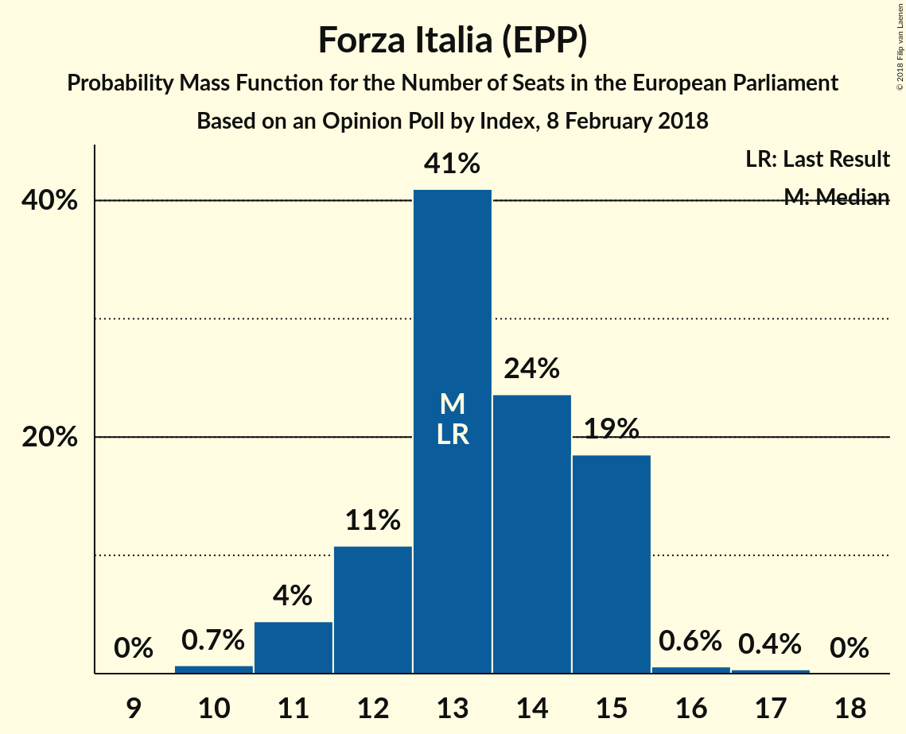

| Number of Seats | Probability | Accumulated | Special Marks |
|:---------------:|:-----------:|:-----------:|:-------------:|
| 10 | 0.1% | 100% |  |
| 11 | 2% | 99.9% |  |
| 12 | 0% | 98% |  |
| 13 | 97% | 98% | Last Result, Median |
| 14 | 0.5% | 0.8% |  |
| 15 | 0% | 0.3% |  |
| 16 | 0.2% | 0.3% |  |
| 17 | 0.1% | 0.1% |  |
| 18 | 0% | 0% |  |

### Lega Nord (ENF)

*For a full overview of the results for this party, see the [Lega Nord (ENF)](party-leganordenf.html) page.*

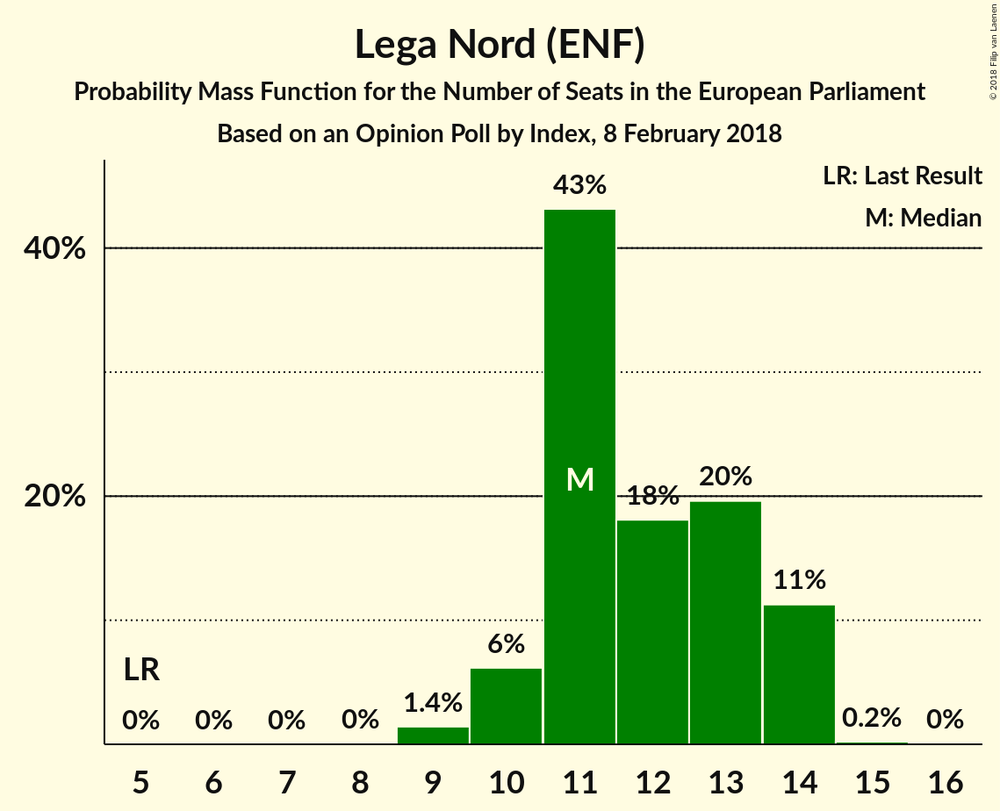

| Number of Seats | Probability | Accumulated | Special Marks |
|:---------------:|:-----------:|:-----------:|:-------------:|
| 5 | 0% | 100% | Last Result |
| 6 | 0% | 100% |  |
| 7 | 0% | 100% |  |
| 8 | 0% | 100% |  |
| 9 | 0.5% | 100% |  |
| 10 | 0% | 99.5% |  |
| 11 | 95% | 99.5% | Median |
| 12 | 2% | 4% |  |
| 13 | 0.1% | 2% |  |
| 14 | 2% | 2% |  |
| 15 | 0% | 0% |  |

### Liberi e Uguali (S&D)

*For a full overview of the results for this party, see the [Liberi e Uguali (S&D)](party-liberieugualisd.html) page.*

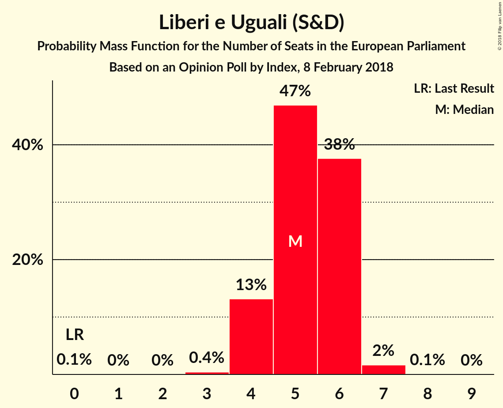

| Number of Seats | Probability | Accumulated | Special Marks |
|:---------------:|:-----------:|:-----------:|:-------------:|
| 0 | 0% | 100% | Last Result |
| 1 | 0% | 100% |  |
| 2 | 0% | 100% |  |
| 3 | 0% | 100% |  |
| 4 | 2% | 100% |  |
| 5 | 39% | 98% |  |
| 6 | 57% | 59% | Median |
| 7 | 2% | 2% |  |
| 8 | 0% | 0% |  |

### Fratelli d’Italia (—)

*For a full overview of the results for this party, see the [Fratelli d’Italia (—)](party-fratellid’italia—.html) page.*

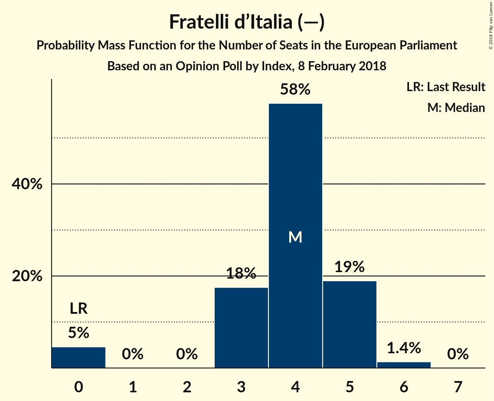

| Number of Seats | Probability | Accumulated | Special Marks |
|:---------------:|:-----------:|:-----------:|:-------------:|
| 0 | 0% | 100% | Last Result |
| 1 | 0% | 100% |  |
| 2 | 0% | 100% |  |
| 3 | 0% | 100% |  |
| 4 | 0% | 100% |  |
| 5 | 59% | 99.9% | Median |
| 6 | 41% | 41% |  |
| 7 | 0% | 0% |  |

### Noi con l’Italia (—)

*For a full overview of the results for this party, see the [Noi con l’Italia (—)](party-noiconl’italia—.html) page.*

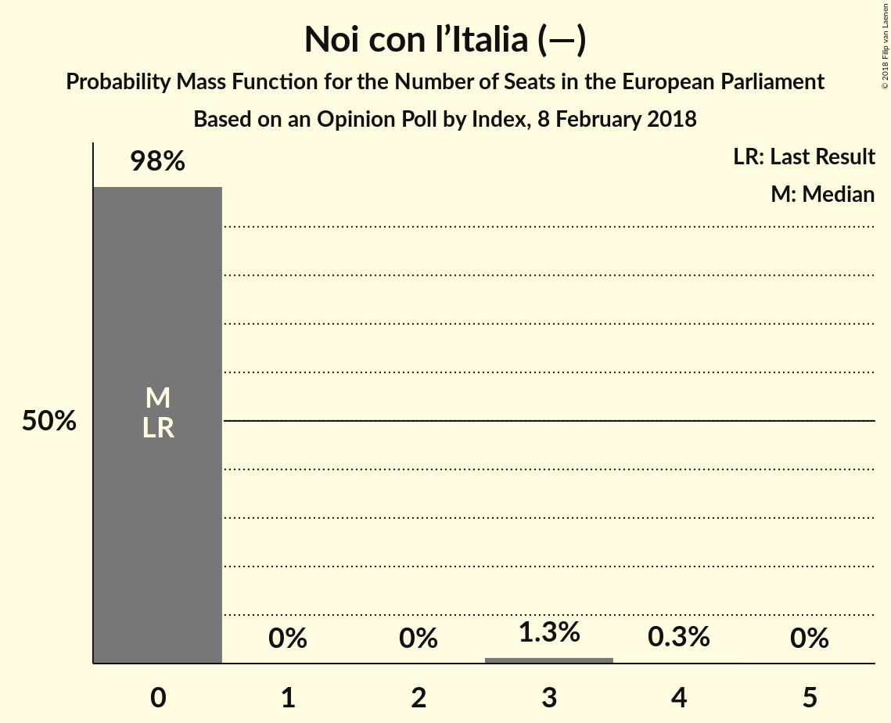

| Number of Seats | Probability | Accumulated | Special Marks |
|:---------------:|:-----------:|:-----------:|:-------------:|
| 0 | 100% | 100% | Last Result, Median |

### Più Europa (—)

*For a full overview of the results for this party, see the [Più Europa (—)](party-piùeuropa—.html) page.*

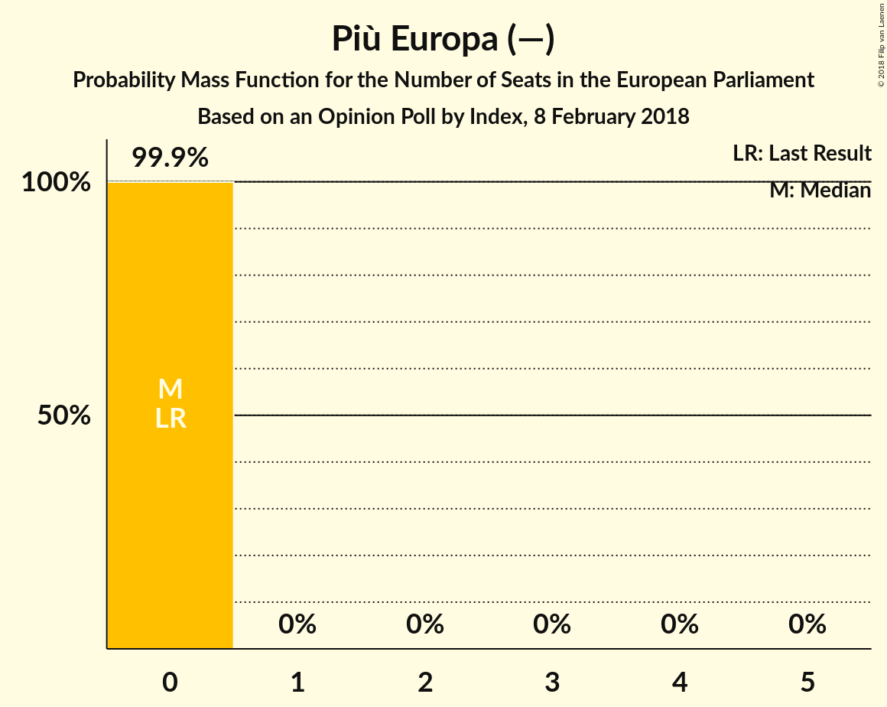

| Number of Seats | Probability | Accumulated | Special Marks |
|:---------------:|:-----------:|:-----------:|:-------------:|
| 0 | 100% | 100% | Last Result, Median |

### Insieme (—)

*For a full overview of the results for this party, see the [Insieme (—)](party-insieme—.html) page.*

| Number of Seats | Probability | Accumulated | Special Marks |
|:---------------:|:-----------:|:-----------:|:-------------:|
| 0 | 100% | 100% | Last Result, Median |

### Civica Popolare (—)

*For a full overview of the results for this party, see the [Civica Popolare (—)](party-civicapopolare—.html) page.*

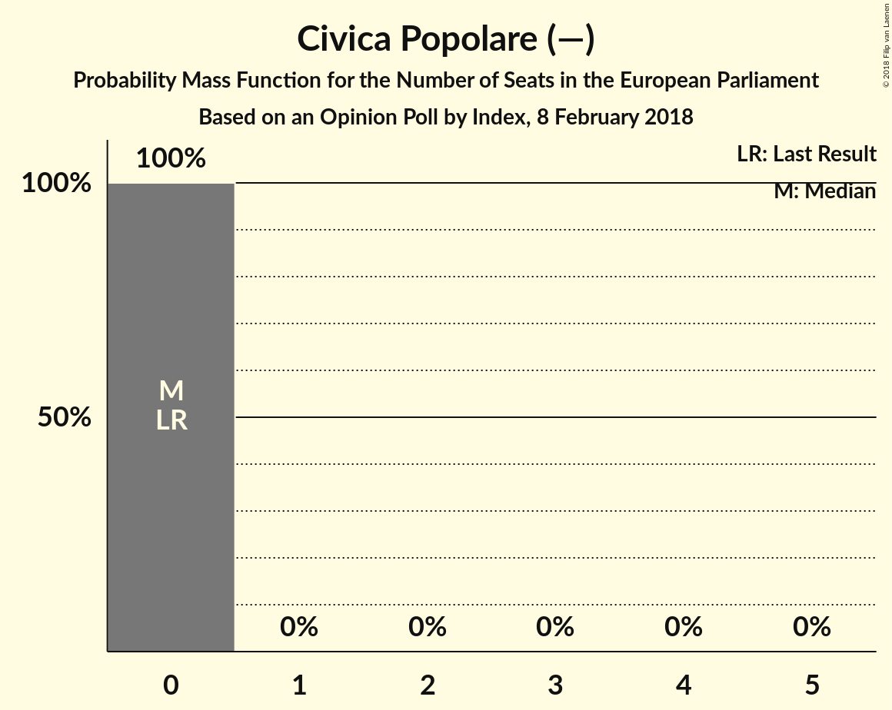

| Number of Seats | Probability | Accumulated | Special Marks |
|:---------------:|:-----------:|:-----------:|:-------------:|
| 0 | 100% | 100% | Last Result, Median |

## Coalitions

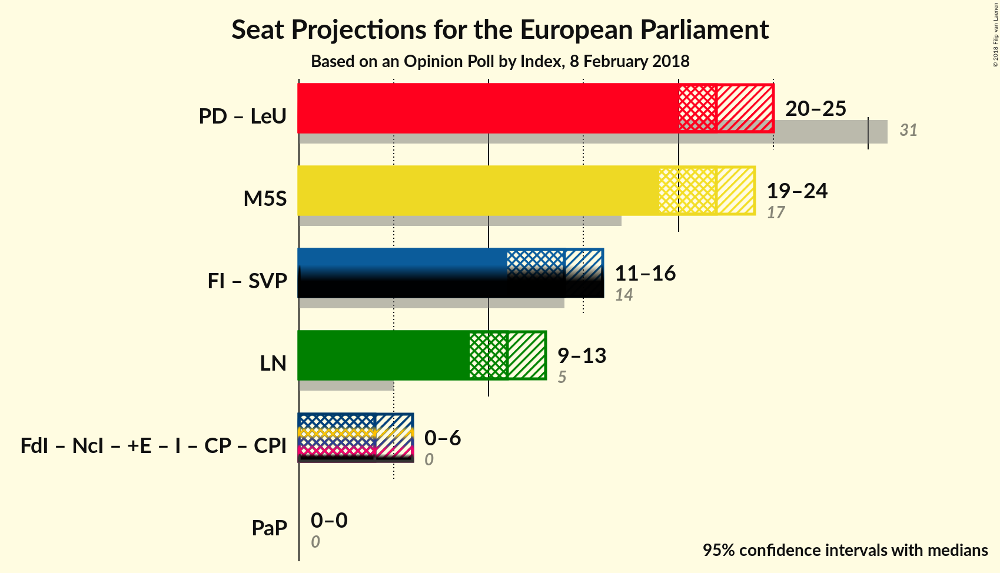

### Confidence Intervals

| Coalition | Last Result | Median | Majority? | 80% Confidence Interval | 90% Confidence Interval | 95% Confidence Interval | 99% Confidence Interval |
|:---------:|:-----------:|:------:|:---------:|:-----------------------:|:-----------------------:|:-----------------------:|:-----------------------:|
| Partito Democratico (S&D) – Liberi e Uguali (S&D) | 31 | 24 | 0% | 23–24 | 23–24 | 23–24 | 22–25 |
| Movimento 5 Stelle (EFDD) | 17 | 22 | 0% | 22 | 22 | 21–22 | 21–22 |
| Lega Nord (ENF) | 5 | 11 | 0% | 11 | 11 | 11–12 | 9–14 |

### Partito Democratico (S&D) – Liberi e Uguali (S&D)

| Number of Seats | Probability | Accumulated | Special Marks |
|:---------------:|:-----------:|:-----------:|:-------------:|
| 18 | 0.1% | 100% |  |
| 19 | 0% | 99.9% |  |
| 20 | 0% | 99.9% |  |
| 21 | 0.1% | 99.9% |  |
| 22 | 2% | 99.8% |  |
| 23 | 38% | 98% |  |
| 24 | 59% | 60% | Median |
| 25 | 0.5% | 0.5% |  |
| 26 | 0% | 0% |  |
| 27 | 0% | 0% |  |
| 28 | 0% | 0% |  |
| 29 | 0% | 0% |  |
| 30 | 0% | 0% |  |
| 31 | 0% | 0% | Last Result |

### Movimento 5 Stelle (EFDD)

| Number of Seats | Probability | Accumulated | Special Marks |
|:---------------:|:-----------:|:-----------:|:-------------:|
| 17 | 0% | 100% | Last Result |
| 18 | 0.2% | 100% |  |
| 19 | 0% | 99.8% |  |
| 20 | 0.1% | 99.8% |  |
| 21 | 2% | 99.7% |  |
| 22 | 97% | 97% | Median |
| 23 | 0% | 0.2% |  |
| 24 | 0% | 0.2% |  |
| 25 | 0% | 0.2% |  |
| 26 | 0.1% | 0.2% |  |
| 27 | 0% | 0.1% |  |
| 28 | 0% | 0% |  |

### Lega Nord (ENF)

| Number of Seats | Probability | Accumulated | Special Marks |
|:---------------:|:-----------:|:-----------:|:-------------:|
| 5 | 0% | 100% | Last Result |
| 6 | 0% | 100% |  |
| 7 | 0% | 100% |  |
| 8 | 0% | 100% |  |
| 9 | 0.5% | 100% |  |
| 10 | 0% | 99.5% |  |
| 11 | 95% | 99.5% | Median |
| 12 | 2% | 4% |  |
| 13 | 0.1% | 2% |  |
| 14 | 2% | 2% |  |
| 15 | 0% | 0% |  |

## Technical Information

### Opinion Poll

+ **Polling firm:** Index
+ **Commissioner(s):** —
+ **Fieldwork period:** 8 February 2018

### Calculations

+ **Sample size:** 800
+ **Simulations done:** 1,024
+ **Error estimate:** 3.52%

