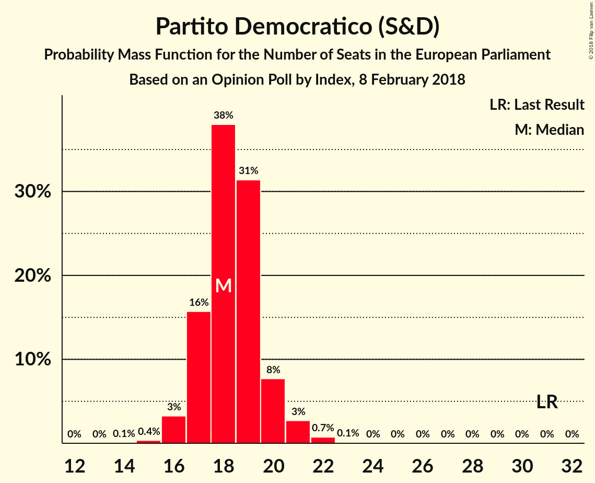
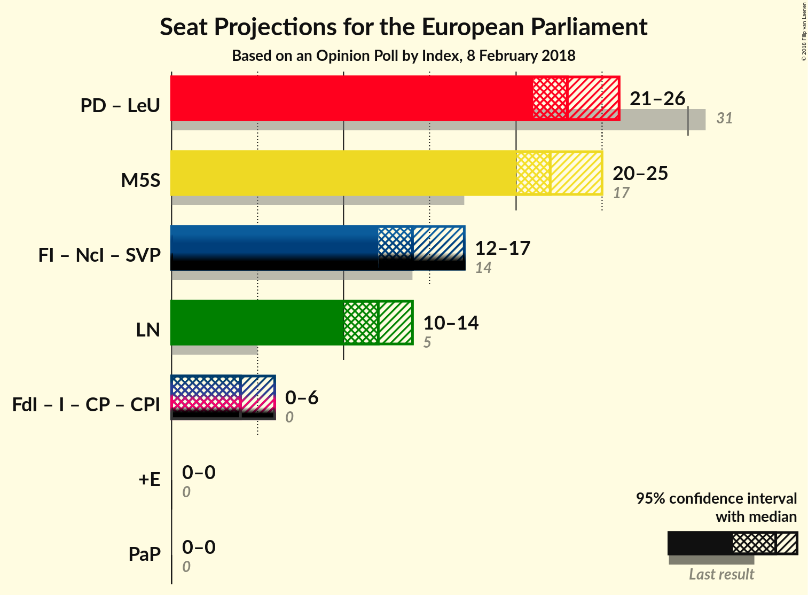

# Opinion Poll by Index, 8 February 2018

<a href="#voting-intentions">Voting Intentions</a> | <a href="#seats">Seats</a> | <a href="#coalitions">Coalitions</a> | <a href="#technical-information">Technical Information</a>

## Voting Intentions

### Confidence Intervals

| Party | Last Result | Poll Result | 80% Confidence Interval | 90% Confidence Interval | 95% Confidence Interval | 99% Confidence Interval |
|:-----:|:-----------:|:-----------:|:-----------------------:|:-----------------------:|:-----------------------:|:-----------------------:|
| Movimento 5 Stelle (EFDD) | 21.1% | 27.2% | 25.3–29.3% |24.8–29.9% |24.3–30.5% |23.4–31.5% |
| Partito Democratico (S&D) | 40.8% | 23.5% | 21.7–25.5% |21.1–26.1% |20.7–26.6% |19.8–27.6% |
| Forza Italia (EPP) | 16.8% | 15.8% | 14.2–17.5% |13.8–18.0% |13.4–18.4% |12.7–19.3% |
| Lega Nord (ENF) | 6.2% | 14.1% | 12.7–15.8% |12.2–16.3% |11.9–16.7% |11.2–17.6% |
| Liberi e Uguali (S&D) | 0.0% | 6.0% | 5.0–7.2% |4.8–7.6% |4.6–7.9% |4.1–8.5% |
| Fratelli d’Italia (*) | 3.7% | 5.0% | 4.1–6.1% |3.9–6.5% |3.7–6.8% |3.3–7.3% |
| Noi con l’Italia (EPP) | 0.0% | 2.6% | 2.0–3.5% |1.9–3.8% |1.7–4.0% |1.5–4.5% |
| Più Europa (ALDE) | 0.0% | 1.9% | 1.4–2.7% |1.2–2.9% |1.1–3.1% |0.9–3.5% |
| Insieme (*) | 0.0% | 1.5% | 1.1–2.2% |1.0–2.4% |0.9–2.6% |0.7–3.0% |
| Civica Popolare (*) | 0.0% | 1.1% | 0.8–1.8% |0.7–2.0% |0.6–2.1% |0.5–2.5% |

*Note:* The poll result column reflects the actual value used in the calculations. Published results may vary slightly, and in addition be rounded to fewer digits.

## Seats

### Confidence Intervals

| Party | Last Result | Median | 80% Confidence Interval | 90% Confidence Interval | 95% Confidence Interval | 99% Confidence Interval |
|:-----:|:-----------:|:------:|:-----------------------:|:-----------------------:|:-----------------------:|:-----------------------:|
| <a href="#movimento-5-stelle-(efdd)">Movimento 5 Stelle (EFDD)</a> | 17 | 22 | 21–24 |21–25 |20–25 |19–26 |
| <a href="#partito-democratico-(s&d)">Partito Democratico (S&D)</a> | 31 | 18 | 16–20 |16–21 |16–21 |16–22 |
| <a href="#forza-italia-(epp)">Forza Italia (EPP)</a> | 13 | 13 | 12–15 |11–15 |11–15 |10–16 |
| <a href="#lega-nord-(enf)">Lega Nord (ENF)</a> | 5 | 11 | 11–14 |10–14 |10–14 |9–14 |
| <a href="#liberi-e-uguali-(s&d)">Liberi e Uguali (S&D)</a> | 0 | 5 | 4–6 |4–6 |4–7 |3–7 |
| <a href="#fratelli-d’italia-(*)">Fratelli d’Italia (*)</a> | 0 | 4 | 3–6 |0–6 |0–6 |0–6 |
| <a href="#noi-con-l’italia-(epp)">Noi con l’Italia (EPP)</a> | 0 | 0 | 0 |0 |0 |0–4 |
| <a href="#più-europa-(alde)">Più Europa (ALDE)</a> | 0 | 0 | 0 |0 |0 |0 |
| <a href="#insieme-(*)">Insieme (*)</a> | 0 | 0 | 0 |0 |0 |0 |
| <a href="#civica-popolare-(*)">Civica Popolare (*)</a> | 0 | 0 | 0 |0 |0 |0 |

### Movimento 5 Stelle (EFDD)

*For a full overview of the results for this party, see the [Movimento 5 Stelle (EFDD)](party-movimento5stelleefdd.html) page.*

| Number of Seats | Probability | Accumulated | Special Marks |
|:---------------:|:-----------:|:-----------:|:-------------:|
| 17 | 0% | 100% | Last Result |
| 18 | 0.1% | 100% |  |
| 19 | 0.8% | 99.9% |  |
| 20 | 3% | 99.1% |  |
| 21 | 22% | 96% |  |
| 22 | 35% | 74% | Median |
| 23 | 20% | 40% |  |
| 24 | 12% | 19% |  |
| 25 | 5% | 7% |  |
| 26 | 1.2% | 2% |  |
| 27 | 0.3% | 0.3% |  |
| 28 | 0% | 0% |  |

### Partito Democratico (S&D)

*For a full overview of the results for this party, see the [Partito Democratico (S&D)](party-partitodemocraticosd.html) page.*

| Number of Seats | Probability | Accumulated | Special Marks |
|:---------------:|:-----------:|:-----------:|:-------------:|
| 15 | 0.2% | 100% |  |
| 16 | 11% | 99.7% |  |
| 17 | 12% | 89% |  |
| 18 | 44% | 77% | Median |
| 19 | 14% | 33% |  |
| 20 | 11% | 20% |  |
| 21 | 7% | 8% |  |
| 22 | 2% | 2% |  |
| 23 | 0.1% | 0.1% |  |
| 24 | 0% | 0% |  |
| 25 | 0% | 0% |  |
| 26 | 0% | 0% |  |
| 27 | 0% | 0% |  |
| 28 | 0% | 0% |  |
| 29 | 0% | 0% |  |
| 30 | 0% | 0% |  |
| 31 | 0% | 0% | Last Result |

### Forza Italia (EPP)

*For a full overview of the results for this party, see the [Forza Italia (EPP)](party-forzaitaliaepp.html) page.*

| Number of Seats | Probability | Accumulated | Special Marks |
|:---------------:|:-----------:|:-----------:|:-------------:|
| 10 | 0.7% | 100% |  |
| 11 | 4% | 99.3% |  |
| 12 | 11% | 95% |  |
| 13 | 41% | 84% | Last Result, Median |
| 14 | 24% | 43% |  |
| 15 | 19% | 19% |  |
| 16 | 0.6% | 1.0% |  |
| 17 | 0.4% | 0.4% |  |
| 18 | 0% | 0% |  |

### Lega Nord (ENF)

*For a full overview of the results for this party, see the [Lega Nord (ENF)](party-leganordenf.html) page.*

| Number of Seats | Probability | Accumulated | Special Marks |
|:---------------:|:-----------:|:-----------:|:-------------:|
| 5 | 0% | 100% | Last Result |
| 6 | 0% | 100% |  |
| 7 | 0% | 100% |  |
| 8 | 0% | 100% |  |
| 9 | 1.4% | 100% |  |
| 10 | 6% | 98.5% |  |
| 11 | 43% | 92% | Median |
| 12 | 18% | 49% |  |
| 13 | 20% | 31% |  |
| 14 | 11% | 11% |  |
| 15 | 0.2% | 0.2% |  |
| 16 | 0% | 0% |  |

### Liberi e Uguali (S&D)

*For a full overview of the results for this party, see the [Liberi e Uguali (S&D)](party-liberieugualisd.html) page.*

| Number of Seats | Probability | Accumulated | Special Marks |
|:---------------:|:-----------:|:-----------:|:-------------:|
| 0 | 0.1% | 100% | Last Result |
| 1 | 0% | 99.9% |  |
| 2 | 0% | 99.9% |  |
| 3 | 0.9% | 99.9% |  |
| 4 | 39% | 99.0% |  |
| 5 | 39% | 60% | Median |
| 6 | 17% | 21% |  |
| 7 | 3% | 3% |  |
| 8 | 0.1% | 0.1% |  |
| 9 | 0% | 0% |  |

### Fratelli d’Italia (*)

*For a full overview of the results for this party, see the [Fratelli d’Italia (*)](party-fratellid’italia.html) page.*

| Number of Seats | Probability | Accumulated | Special Marks |
|:---------------:|:-----------:|:-----------:|:-------------:|
| 0 | 5% | 100% | Last Result |
| 1 | 0% | 95% |  |
| 2 | 0% | 95% |  |
| 3 | 9% | 95% |  |
| 4 | 48% | 86% | Median |
| 5 | 26% | 38% |  |
| 6 | 11% | 12% |  |
| 7 | 0% | 0.1% |  |
| 8 | 0% | 0% |  |

### Noi con l’Italia (EPP)

*For a full overview of the results for this party, see the [Noi con l’Italia (EPP)](party-noiconl’italiaepp.html) page.*

| Number of Seats | Probability | Accumulated | Special Marks |
|:---------------:|:-----------:|:-----------:|:-------------:|
| 0 | 98.6% | 100% | Last Result, Median |
| 1 | 0% | 1.4% |  |
| 2 | 0% | 1.4% |  |
| 3 | 0.8% | 1.4% |  |
| 4 | 0.7% | 0.7% |  |
| 5 | 0% | 0% |  |

### Più Europa (ALDE)

*For a full overview of the results for this party, see the [Più Europa (ALDE)](party-piùeuropaalde.html) page.*

| Number of Seats | Probability | Accumulated | Special Marks |
|:---------------:|:-----------:|:-----------:|:-------------:|
| 0 | 99.9% | 100% | Last Result, Median |
| 1 | 0% | 0.1% |  |
| 2 | 0% | 0.1% |  |
| 3 | 0.1% | 0.1% |  |
| 4 | 0% | 0% |  |

### Insieme (*)

*For a full overview of the results for this party, see the [Insieme (*)](party-insieme.html) page.*

| Number of Seats | Probability | Accumulated | Special Marks |
|:---------------:|:-----------:|:-----------:|:-------------:|
| 0 | 100% | 100% | Last Result, Median |

### Civica Popolare (*)

*For a full overview of the results for this party, see the [Civica Popolare (*)](party-civicapopolare.html) page.*

| Number of Seats | Probability | Accumulated | Special Marks |
|:---------------:|:-----------:|:-----------:|:-------------:|
| 0 | 100% | 100% | Last Result, Median |

## Coalitions

### Confidence Intervals

| Coalition | Last Result | Median | Majority? | 80% Confidence Interval | 90% Confidence Interval | 95% Confidence Interval | 99% Confidence Interval |
|:---------:|:-----------:|:------:|:---------:|:-----------------------:|:-----------------------:|:-----------------------:|:-----------------------:|
| Partito Democratico (S&D) – Liberi e Uguali (S&D) | 31 | 23 | 0% | 22–25 | 21–26 | 21–27 | 20–28 |
| Movimento 5 Stelle (EFDD) | 17 | 22 | 0% | 21–24 | 21–25 | 20–25 | 19–26 |
| Lega Nord (ENF) | 5 | 11 | 0% | 11–14 | 10–14 | 10–14 | 9–14 |
| Più Europa (ALDE) | 0 | 0 | 0% | 0 | 0 | 0 | 0 |

### Partito Democratico (S&D) – Liberi e Uguali (S&D)

| Number of Seats | Probability | Accumulated | Special Marks |
|:---------------:|:-----------:|:-----------:|:-------------:|
| 19 | 0.1% | 100% |  |
| 20 | 0.4% | 99.8% |  |
| 21 | 7% | 99.4% |  |
| 22 | 31% | 92% |  |
| 23 | 33% | 61% | Median |
| 24 | 11% | 29% |  |
| 25 | 9% | 18% |  |
| 26 | 6% | 9% |  |
| 27 | 2% | 3% |  |
| 28 | 0.9% | 0.9% |  |
| 29 | 0% | 0% |  |
| 30 | 0% | 0% |  |
| 31 | 0% | 0% | Last Result |

### Movimento 5 Stelle (EFDD)

| Number of Seats | Probability | Accumulated | Special Marks |
|:---------------:|:-----------:|:-----------:|:-------------:|
| 17 | 0% | 100% | Last Result |
| 18 | 0.1% | 100% |  |
| 19 | 0.8% | 99.9% |  |
| 20 | 3% | 99.1% |  |
| 21 | 22% | 96% |  |
| 22 | 35% | 74% | Median |
| 23 | 20% | 40% |  |
| 24 | 12% | 19% |  |
| 25 | 5% | 7% |  |
| 26 | 1.2% | 2% |  |
| 27 | 0.3% | 0.3% |  |
| 28 | 0% | 0% |  |

### Lega Nord (ENF)

| Number of Seats | Probability | Accumulated | Special Marks |
|:---------------:|:-----------:|:-----------:|:-------------:|
| 5 | 0% | 100% | Last Result |
| 6 | 0% | 100% |  |
| 7 | 0% | 100% |  |
| 8 | 0% | 100% |  |
| 9 | 1.4% | 100% |  |
| 10 | 6% | 98.5% |  |
| 11 | 43% | 92% | Median |
| 12 | 18% | 49% |  |
| 13 | 20% | 31% |  |
| 14 | 11% | 11% |  |
| 15 | 0.2% | 0.2% |  |
| 16 | 0% | 0% |  |

### Più Europa (ALDE)

| Number of Seats | Probability | Accumulated | Special Marks |
|:---------------:|:-----------:|:-----------:|:-------------:|
| 0 | 99.9% | 100% | Last Result, Median |
| 1 | 0% | 0.1% |  |
| 2 | 0% | 0.1% |  |
| 3 | 0.1% | 0.1% |  |
| 4 | 0% | 0% |  |

## Technical Information

### Opinion Poll

+ **Polling firm:** Index
+ **Commissioner(s):** —
+ **Fieldwork period:** 8 February 2018

### Calculations

+ **Sample size:** 800
+ **Simulations done:** 262,144
+ **Error estimate:** 1.72%

