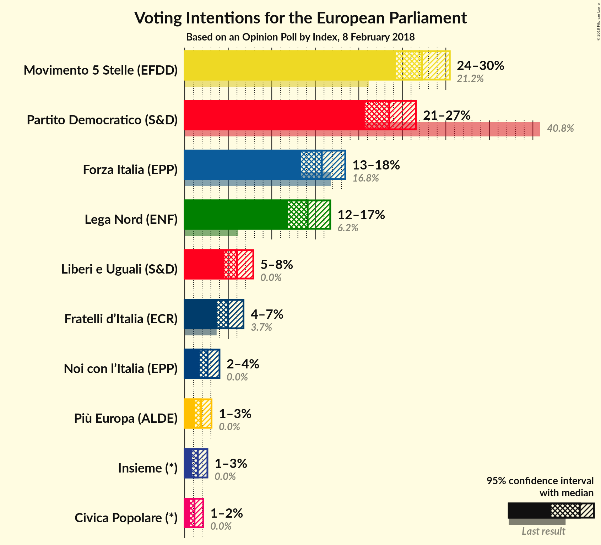

# Opinion Poll by Index, 8 February 2018

<a href="#voting-intentions">Voting Intentions</a> | <a href="#seats">Seats</a> | <a href="#coalitions">Coalitions</a> | <a href="#technical-information">Technical Information</a>

## Voting Intentions

### Confidence Intervals

| Party | Last Result | Poll Result | 80% Confidence Interval | 90% Confidence Interval | 95% Confidence Interval | 99% Confidence Interval |
|:-----:|:-----------:|:-----------:|:-----------------------:|:-----------------------:|:-----------------------:|:-----------------------:|
| Movimento 5 Stelle (EFDD) | 21.1% | 27.2% | 25.3–29.3% |24.8–29.9% |24.3–30.5% |23.4–31.5% |
| Partito Democratico (S&D) | 40.8% | 23.5% | 21.7–25.5% |21.1–26.1% |20.7–26.6% |19.8–27.6% |
| Forza Italia (EPP) | 16.8% | 15.8% | 14.2–17.5% |13.8–18.0% |13.4–18.4% |12.7–19.3% |
| Lega Nord (ENF) | 6.2% | 14.1% | 12.7–15.8% |12.2–16.3% |11.9–16.7% |11.2–17.6% |
| Liberi e Uguali (S&D) | 0.0% | 6.0% | 5.0–7.2% |4.8–7.6% |4.6–7.9% |4.1–8.5% |
| Fratelli d’Italia (*) | 3.7% | 5.0% | N/A |N/A |N/A |N/A |
| Noi con l’Italia (EPP) | 0.0% | 2.6% | N/A |N/A |N/A |N/A |
| Più Europa (ALDE) | 0.0% | 1.9% | N/A |N/A |N/A |N/A |
| Insieme (*) | 0.0% | 1.5% | N/A |N/A |N/A |N/A |
| Civica Popolare (*) | 0.0% | 1.1% | N/A |N/A |N/A |N/A |

*Note:* The poll result column reflects the actual value used in the calculations. Published results may vary slightly, and in addition be rounded to fewer digits.

## Seats

### Confidence Intervals

| Party | Last Result | Median | 80% Confidence Interval | 90% Confidence Interval | 95% Confidence Interval | 99% Confidence Interval |
|:-----:|:-----------:|:------:|:-----------------------:|:-----------------------:|:-----------------------:|:-----------------------:|
| <a href="#movimento-5-stelle-(efdd)">Movimento 5 Stelle (EFDD)</a> | 17 | 22 | 21–24 |21–24 |20–25 |19–26 |
| <a href="#partito-democratico-(s&d)">Partito Democratico (S&D)</a> | 31 | 18 | 17–20 |17–20 |16–21 |16–22 |
| <a href="#forza-italia-(epp)">Forza Italia (EPP)</a> | 13 | 13 | 12–14 |12–15 |11–15 |11–16 |
| <a href="#lega-nord-(enf)">Lega Nord (ENF)</a> | 5 | 12 | 11–13 |10–13 |10–14 |9–14 |
| <a href="#liberi-e-uguali-(s&d)">Liberi e Uguali (S&D)</a> | 0 | 5 | 4–6 |4–6 |4–6 |3–7 |
| <a href="#fratelli-d’italia-(*)">Fratelli d’Italia (*)</a> | 0 | N/A | N/A |N/A |N/A |N/A |
| <a href="#noi-con-l’italia-(epp)">Noi con l’Italia (EPP)</a> | 0 | N/A | N/A |N/A |N/A |N/A |
| <a href="#più-europa-(alde)">Più Europa (ALDE)</a> | 0 | N/A | N/A |N/A |N/A |N/A |
| <a href="#insieme-(*)">Insieme (*)</a> | 0 | N/A | N/A |N/A |N/A |N/A |
| <a href="#civica-popolare-(*)">Civica Popolare (*)</a> | 0 | N/A | N/A |N/A |N/A |N/A |

