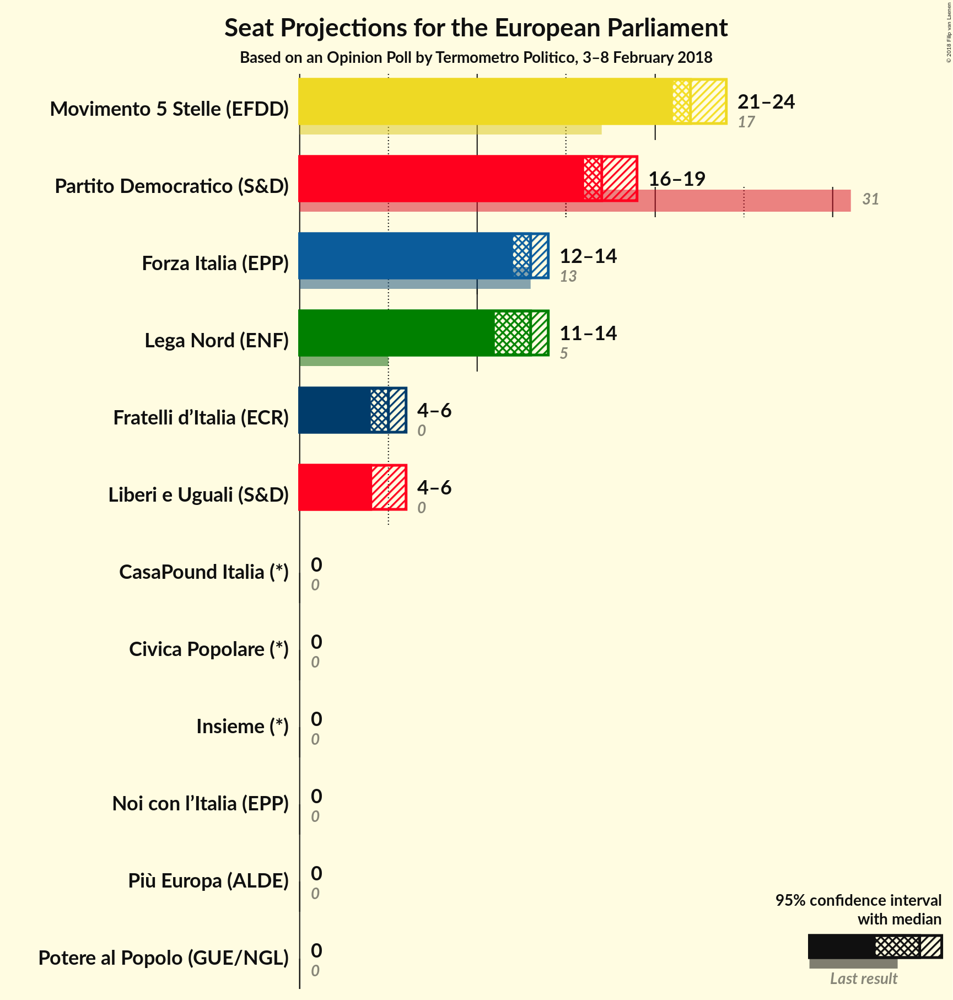

# Opinion Poll by Termometro Politico, 3–8 February 2018

<a href="#voting-intentions">Voting Intentions</a> | <a href="#seats">Seats</a> | <a href="#coalitions">Coalitions</a> | <a href="#technical-information">Technical Information</a>

## Voting Intentions

### Confidence Intervals

| Party | Last Result | Poll Result | 80% Confidence Interval | 90% Confidence Interval | 95% Confidence Interval | 99% Confidence Interval |
|:-----:|:-----------:|:-----------:|:-----------------------:|:-----------------------:|:-----------------------:|:-----------------------:|
| Movimento 5 Stelle (EFDD) | 21.1% | 26.8% | 25.8–27.8% |25.6–28.1% |25.3–28.3% |24.9–28.8% |
| Partito Democratico (S&D) | 40.8% | 21.9% | 21.0–22.8% |20.8–23.1% |20.6–23.3% |20.1–23.8% |
| Forza Italia (EPP) | 16.8% | 15.3% | 14.6–16.1% |14.3–16.4% |14.2–16.6% |13.8–16.9% |
| Lega Nord (ENF) | 6.2% | 14.8% | 14.1–15.6% |13.8–15.8% |13.7–16.0% |13.3–16.4% |
| Fratelli d’Italia (*) | 3.7% | 5.5% | N/A |N/A |N/A |N/A |
| Liberi e Uguali (S&D) | 0.0% | 5.3% | 4.8–5.8% |4.7–6.0% |4.6–6.1% |4.4–6.4% |
| Più Europa (ALDE) | 0.0% | 2.1% | N/A |N/A |N/A |N/A |
| Noi con l’Italia (EPP) | 0.0% | 2.0% | N/A |N/A |N/A |N/A |
| CasaPound Italia (*) | 0.0% | 1.9% | N/A |N/A |N/A |N/A |
| Potere al Popolo (GUE/NGL) | 0.0% | 1.5% | 1.3–1.8% |1.2–1.9% |1.2–2.0% |1.1–2.1% |
| Insieme (*) | 0.0% | 0.7% | N/A |N/A |N/A |N/A |
| Civica Popolare (*) | 0.0% | 0.5% | N/A |N/A |N/A |N/A |

*Note:* The poll result column reflects the actual value used in the calculations. Published results may vary slightly, and in addition be rounded to fewer digits.

## Seats

### Confidence Intervals

| Party | Last Result | Median | 80% Confidence Interval | 90% Confidence Interval | 95% Confidence Interval | 99% Confidence Interval |
|:-----:|:-----------:|:------:|:-----------------------:|:-----------------------:|:-----------------------:|:-----------------------:|
| <a href="#movimento-5-stelle-(efdd)">Movimento 5 Stelle (EFDD)</a> | 17 | 22 | 22–23 |22–24 |21–24 |21–25 |
| <a href="#partito-democratico-(s&d)">Partito Democratico (S&D)</a> | 31 | 17 | 17–19 |16–19 |16–19 |16–19 |
| <a href="#forza-italia-(epp)">Forza Italia (EPP)</a> | 13 | 13 | 12–14 |12–14 |12–14 |12–15 |
| <a href="#lega-nord-(enf)">Lega Nord (ENF)</a> | 5 | 13 | 12–14 |12–14 |11–14 |11–14 |
| <a href="#fratelli-d’italia-(*)">Fratelli d’Italia (*)</a> | 0 | N/A | N/A |N/A |N/A |N/A |
| <a href="#liberi-e-uguali-(s&d)">Liberi e Uguali (S&D)</a> | 0 | 4 | 4–5 |4–5 |4–6 |3–6 |
| <a href="#più-europa-(alde)">Più Europa (ALDE)</a> | 0 | N/A | N/A |N/A |N/A |N/A |
| <a href="#noi-con-l’italia-(epp)">Noi con l’Italia (EPP)</a> | 0 | N/A | N/A |N/A |N/A |N/A |
| <a href="#casapound-italia-(*)">CasaPound Italia (*)</a> | 0 | N/A | N/A |N/A |N/A |N/A |
| <a href="#potere-al-popolo-(gue/ngl)">Potere al Popolo (GUE/NGL)</a> | 0 | 0 | 0 |0 |0 |0 |
| <a href="#insieme-(*)">Insieme (*)</a> | 0 | N/A | N/A |N/A |N/A |N/A |
| <a href="#civica-popolare-(*)">Civica Popolare (*)</a> | 0 | N/A | N/A |N/A |N/A |N/A |

