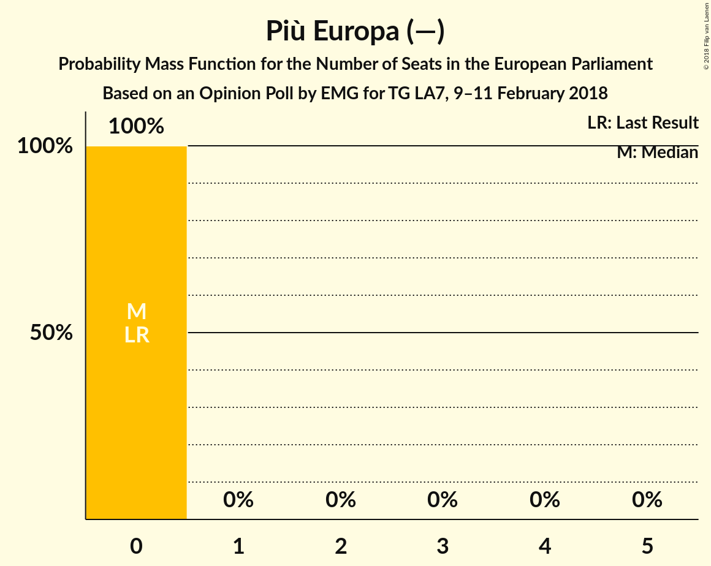
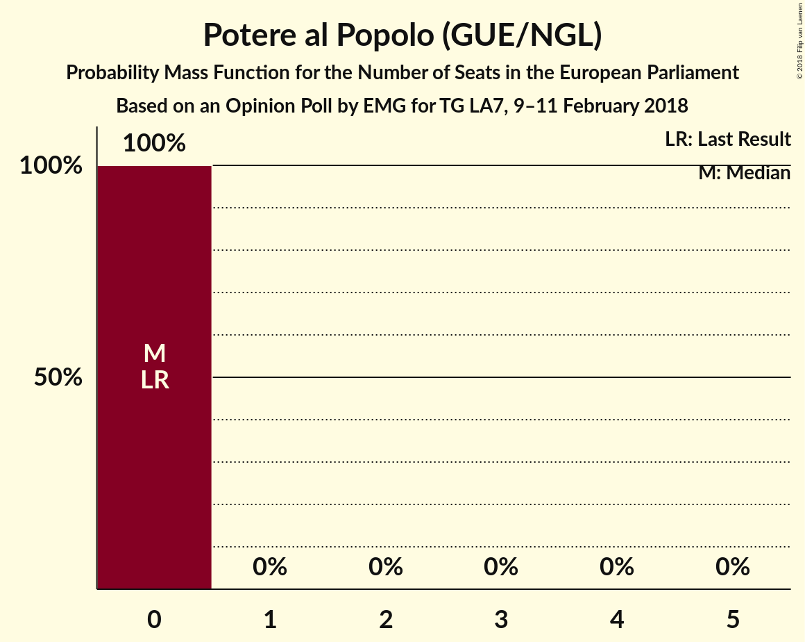

# Opinion Poll by EMG for TG LA7, 9–11 February 2018

<a href="#voting-intentions">Voting Intentions</a> | <a href="#seats">Seats</a> | <a href="#coalitions">Coalitions</a> | <a href="#technical-information">Technical Information</a>

## Voting Intentions

### Confidence Intervals

| Party | Last Result | Poll Result | 80% Confidence Interval | 90% Confidence Interval | 95% Confidence Interval | 99% Confidence Interval |
|:-----:|:-----------:|:-----------:|:-----------------------:|:-----------------------:|:-----------------------:|:-----------------------:|
| Movimento 5 Stelle (EFDD) | 21.1% | 27.3% | 25.9–28.8% |25.5–29.2% |25.2–29.6% |24.5–30.3% |
| Partito Democratico (S&D) | 40.8% | 22.8% | 21.5–24.2% |21.1–24.6% |20.8–24.9% |20.2–25.6% |
| Forza Italia (EPP) | 16.8% | 16.1% | 15.0–17.3% |14.7–17.7% |14.4–18.0% |13.9–18.6% |
| Lega Nord (ENF) | 6.2% | 13.9% | 12.8–15.0% |12.5–15.4% |12.3–15.7% |11.8–16.2% |
| Liberi e Uguali (S&D) | 0.0% | 5.2% | 4.6–6.0% |4.4–6.2% |4.2–6.4% |3.9–6.8% |
| Fratelli d’Italia (—) | 3.7% | 4.6% | 4.0–5.3% |3.8–5.5% |3.7–5.7% |3.4–6.1% |
| Noi con l’Italia (—) | 0.0% | 2.8% | 2.3–3.4% |2.2–3.6% |2.1–3.7% |1.9–4.0% |
| Più Europa (—) | 0.0% | 2.1% | 1.7–2.7% |1.6–2.8% |1.5–2.9% |1.3–3.2% |
| Insieme (—) | 0.0% | 1.6% | 1.3–2.1% |1.2–2.2% |1.1–2.4% |1.0–2.6% |
| Civica Popolare (—) | 0.0% | 1.0% | 0.7–1.4% |0.7–1.5% |0.6–1.6% |0.5–1.8% |
| Potere al Popolo (GUE/NGL) | 0.0% | 0.8% | 0.6–1.2% |0.5–1.3% |0.5–1.4% |0.4–1.6% |
| CasaPound Italia (—) | 0.0% | 0.6% | 0.4–1.0% |0.4–1.1% |0.3–1.1% |0.3–1.3% |

*Note:* The poll result column reflects the actual value used in the calculations. Published results may vary slightly, and in addition be rounded to fewer digits.

## Seats

### Confidence Intervals

| Party | Last Result | Median | 80% Confidence Interval | 90% Confidence Interval | 95% Confidence Interval | 99% Confidence Interval |
|:-----:|:-----------:|:------:|:-----------------------:|:-----------------------:|:-----------------------:|:-----------------------:|
| <a href="#movimento-5-stelle-(efdd)">Movimento 5 Stelle (EFDD)</a> | 17 | 23 | 23–24 |23–24 |23–24 |23–24 |
| <a href="#partito-democratico-(s&d)">Partito Democratico (S&D)</a> | 31 | 18 | 15–18 |15–18 |15–19 |15–19 |
| <a href="#forza-italia-(epp)">Forza Italia (EPP)</a> | 13 | 13 | 13–15 |13–15 |13–15 |12–15 |
| <a href="#lega-nord-(enf)">Lega Nord (ENF)</a> | 5 | 12 | 11–12 |11–12 |11–12 |11–12 |
| <a href="#liberi-e-uguali-(s&d)">Liberi e Uguali (S&D)</a> | 0 | 5 | 5 |5 |5 |4–5 |
| <a href="#fratelli-d’italia-(—)">Fratelli d’Italia (—)</a> | 0 | 4 | 4–5 |4–5 |4–5 |4–5 |
| <a href="#noi-con-l’italia-(—)">Noi con l’Italia (—)</a> | 0 | 0 | 0 |0 |0 |0 |
| <a href="#più-europa-(—)">Più Europa (—)</a> | 0 | 0 | 0 |0 |0 |0 |
| <a href="#insieme-(—)">Insieme (—)</a> | 0 | 0 | 0 |0 |0 |0 |
| <a href="#civica-popolare-(—)">Civica Popolare (—)</a> | 0 | 0 | 0 |0 |0 |0 |
| <a href="#potere-al-popolo-(gue/ngl)">Potere al Popolo (GUE/NGL)</a> | 0 | 0 | 0 |0 |0 |0 |
| <a href="#casapound-italia-(—)">CasaPound Italia (—)</a> | 0 | 0 | 0 |0 |0 |0 |

### Movimento 5 Stelle (EFDD)

*For a full overview of the results for this party, see the [Movimento 5 Stelle (EFDD)](party-movimento5stelleefdd.html) page.*

| Number of Seats | Probability | Accumulated | Special Marks |
|:---------------:|:-----------:|:-----------:|:-------------:|
| 17 | 0% | 100% | Last Result |
| 18 | 0% | 100% |  |
| 19 | 0% | 100% |  |
| 20 | 0% | 100% |  |
| 21 | 0% | 100% |  |
| 22 | 0.1% | 100% |  |
| 23 | 83% | 99.8% | Median |
| 24 | 17% | 17% |  |
| 25 | 0% | 0% |  |

### Partito Democratico (S&D)

*For a full overview of the results for this party, see the [Partito Democratico (S&D)](party-partitodemocraticosd.html) page.*

| Number of Seats | Probability | Accumulated | Special Marks |
|:---------------:|:-----------:|:-----------:|:-------------:|
| 15 | 17% | 100% |  |
| 16 | 0% | 83% |  |
| 17 | 0% | 83% |  |
| 18 | 81% | 83% | Median |
| 19 | 2% | 3% |  |
| 20 | 0% | 0.1% |  |
| 21 | 0% | 0.1% |  |
| 22 | 0% | 0.1% |  |
| 23 | 0.1% | 0.1% |  |
| 24 | 0% | 0% |  |
| 25 | 0% | 0% |  |
| 26 | 0% | 0% |  |
| 27 | 0% | 0% |  |
| 28 | 0% | 0% |  |
| 29 | 0% | 0% |  |
| 30 | 0% | 0% |  |
| 31 | 0% | 0% | Last Result |

### Forza Italia (EPP)

*For a full overview of the results for this party, see the [Forza Italia (EPP)](party-forzaitaliaepp.html) page.*

| Number of Seats | Probability | Accumulated | Special Marks |
|:---------------:|:-----------:|:-----------:|:-------------:|
| 11 | 0.1% | 100% |  |
| 12 | 0.6% | 99.9% |  |
| 13 | 80% | 99.3% | Last Result, Median |
| 14 | 2% | 19% |  |
| 15 | 17% | 17% |  |
| 16 | 0% | 0% |  |

### Lega Nord (ENF)

*For a full overview of the results for this party, see the [Lega Nord (ENF)](party-leganordenf.html) page.*

| Number of Seats | Probability | Accumulated | Special Marks |
|:---------------:|:-----------:|:-----------:|:-------------:|
| 5 | 0% | 100% | Last Result |
| 6 | 0% | 100% |  |
| 7 | 0% | 100% |  |
| 8 | 0% | 100% |  |
| 9 | 0% | 100% |  |
| 10 | 0% | 100% |  |
| 11 | 19% | 100% |  |
| 12 | 81% | 81% | Median |
| 13 | 0% | 0% |  |

### Liberi e Uguali (S&D)

*For a full overview of the results for this party, see the [Liberi e Uguali (S&D)](party-liberieugualisd.html) page.*

| Number of Seats | Probability | Accumulated | Special Marks |
|:---------------:|:-----------:|:-----------:|:-------------:|
| 0 | 0% | 100% | Last Result |
| 1 | 0% | 100% |  |
| 2 | 0% | 100% |  |
| 3 | 0% | 100% |  |
| 4 | 2% | 100% |  |
| 5 | 98% | 98% | Median |
| 6 | 0% | 0% |  |

### Fratelli d’Italia (—)

*For a full overview of the results for this party, see the [Fratelli d’Italia (—)](party-fratellid’italia—.html) page.*

| Number of Seats | Probability | Accumulated | Special Marks |
|:---------------:|:-----------:|:-----------:|:-------------:|
| 0 | 0% | 100% | Last Result |
| 1 | 0% | 100% |  |
| 2 | 0% | 100% |  |
| 3 | 0% | 100% |  |
| 4 | 83% | 100% | Median |
| 5 | 17% | 17% |  |
| 6 | 0% | 0% |  |

### Noi con l’Italia (—)

*For a full overview of the results for this party, see the [Noi con l’Italia (—)](party-noiconl’italia—.html) page.*

| Number of Seats | Probability | Accumulated | Special Marks |
|:---------------:|:-----------:|:-----------:|:-------------:|
| 0 | 100% | 100% | Last Result, Median |

### Più Europa (—)

*For a full overview of the results for this party, see the [Più Europa (—)](party-piùeuropa—.html) page.*

| Number of Seats | Probability | Accumulated | Special Marks |
|:---------------:|:-----------:|:-----------:|:-------------:|
| 0 | 100% | 100% | Last Result, Median |

### Insieme (—)

*For a full overview of the results for this party, see the [Insieme (—)](party-insieme—.html) page.*

| Number of Seats | Probability | Accumulated | Special Marks |
|:---------------:|:-----------:|:-----------:|:-------------:|
| 0 | 100% | 100% | Last Result, Median |

### Civica Popolare (—)

*For a full overview of the results for this party, see the [Civica Popolare (—)](party-civicapopolare—.html) page.*

| Number of Seats | Probability | Accumulated | Special Marks |
|:---------------:|:-----------:|:-----------:|:-------------:|
| 0 | 100% | 100% | Last Result, Median |

### Potere al Popolo (GUE/NGL)

*For a full overview of the results for this party, see the [Potere al Popolo (GUE/NGL)](party-poterealpopologuengl.html) page.*

| Number of Seats | Probability | Accumulated | Special Marks |
|:---------------:|:-----------:|:-----------:|:-------------:|
| 0 | 100% | 100% | Last Result, Median |

### CasaPound Italia (—)

*For a full overview of the results for this party, see the [CasaPound Italia (—)](party-casapounditalia—.html) page.*

| Number of Seats | Probability | Accumulated | Special Marks |
|:---------------:|:-----------:|:-----------:|:-------------:|
| 0 | 100% | 100% | Last Result, Median |

## Coalitions

### Confidence Intervals

| Coalition | Last Result | Median | Majority? | 80% Confidence Interval | 90% Confidence Interval | 95% Confidence Interval | 99% Confidence Interval |
|:---------:|:-----------:|:------:|:---------:|:-----------------------:|:-----------------------:|:-----------------------:|:-----------------------:|
| Movimento 5 Stelle (EFDD) | 17 | 23 | 0% | 23–24 | 23–24 | 23–24 | 23–24 |
| Partito Democratico (S&D) – Liberi e Uguali (S&D) | 31 | 23 | 0% | 20–23 | 20–23 | 20–23 | 20–23 |
| Lega Nord (ENF) | 5 | 12 | 0% | 11–12 | 11–12 | 11–12 | 11–12 |
| Fratelli d’Italia (—) – Noi con l’Italia (—) – Più Europa (—) – Insieme (—) – Civica Popolare (—) – CasaPound Italia (—) | 0 | 4 | 0% | 4–5 | 4–5 | 4–5 | 4–5 |
| Potere al Popolo (GUE/NGL) | 0 | 0 | 0% | 0 | 0 | 0 | 0 |

### Movimento 5 Stelle (EFDD)

| Number of Seats | Probability | Accumulated | Special Marks |
|:---------------:|:-----------:|:-----------:|:-------------:|
| 17 | 0% | 100% | Last Result |
| 18 | 0% | 100% |  |
| 19 | 0% | 100% |  |
| 20 | 0% | 100% |  |
| 21 | 0% | 100% |  |
| 22 | 0.1% | 100% |  |
| 23 | 83% | 99.8% | Median |
| 24 | 17% | 17% |  |
| 25 | 0% | 0% |  |

### Partito Democratico (S&D) – Liberi e Uguali (S&D)

| Number of Seats | Probability | Accumulated | Special Marks |
|:---------------:|:-----------:|:-----------:|:-------------:|
| 20 | 17% | 100% |  |
| 21 | 0% | 83% |  |
| 22 | 0% | 83% |  |
| 23 | 83% | 83% | Median |
| 24 | 0% | 0.2% |  |
| 25 | 0% | 0.1% |  |
| 26 | 0% | 0.1% |  |
| 27 | 0.1% | 0.1% |  |
| 28 | 0% | 0% |  |
| 29 | 0% | 0% |  |
| 30 | 0% | 0% |  |
| 31 | 0% | 0% | Last Result |

### Lega Nord (ENF)

| Number of Seats | Probability | Accumulated | Special Marks |
|:---------------:|:-----------:|:-----------:|:-------------:|
| 5 | 0% | 100% | Last Result |
| 6 | 0% | 100% |  |
| 7 | 0% | 100% |  |
| 8 | 0% | 100% |  |
| 9 | 0% | 100% |  |
| 10 | 0% | 100% |  |
| 11 | 19% | 100% |  |
| 12 | 81% | 81% | Median |
| 13 | 0% | 0% |  |

### Fratelli d’Italia (—) – Noi con l’Italia (—) – Più Europa (—) – Insieme (—) – Civica Popolare (—) – CasaPound Italia (—)

| Number of Seats | Probability | Accumulated | Special Marks |
|:---------------:|:-----------:|:-----------:|:-------------:|
| 0 | 0% | 100% | Last Result |
| 1 | 0% | 100% |  |
| 2 | 0% | 100% |  |
| 3 | 0% | 100% |  |
| 4 | 83% | 100% | Median |
| 5 | 17% | 17% |  |
| 6 | 0% | 0% |  |

### Potere al Popolo (GUE/NGL)

| Number of Seats | Probability | Accumulated | Special Marks |
|:---------------:|:-----------:|:-----------:|:-------------:|
| 0 | 100% | 100% | Last Result, Median |

## Technical Information

### Opinion Poll

+ **Polling firm:** EMG
+ **Commissioner(s):** TG LA7
+ **Fieldwork period:** 9–11 February 2018

### Calculations

+ **Sample size:** 1614
+ **Simulations done:** 1,024
+ **Error estimate:** 2.51%

