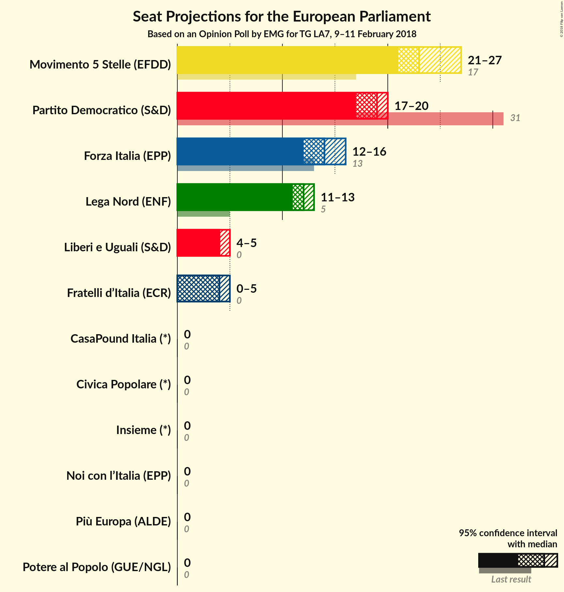

# Opinion Poll by EMG for TG LA7, 9–11 February 2018

<a href="#voting-intentions">Voting Intentions</a> | <a href="#seats">Seats</a> | <a href="#coalitions">Coalitions</a> | <a href="#technical-information">Technical Information</a>

## Voting Intentions

### Confidence Intervals

| Party | Last Result | Poll Result | 80% Confidence Interval | 90% Confidence Interval | 95% Confidence Interval | 99% Confidence Interval |
|:-----:|:-----------:|:-----------:|:-----------------------:|:-----------------------:|:-----------------------:|:-----------------------:|
| Movimento 5 Stelle (EFDD) | 21.1% | 27.3% | 25.9–28.8% |25.5–29.2% |25.2–29.6% |24.5–30.3% |
| Partito Democratico (S&D) | 40.8% | 22.8% | 21.5–24.2% |21.1–24.6% |20.8–24.9% |20.2–25.6% |
| Forza Italia (EPP) | 16.8% | 16.1% | 15.0–17.3% |14.7–17.7% |14.4–18.0% |13.9–18.6% |
| Lega Nord (ENF) | 6.2% | 13.9% | 12.8–15.0% |12.5–15.4% |12.3–15.7% |11.8–16.2% |
| Liberi e Uguali (S&D) | 0.0% | 5.2% | 4.6–6.0% |4.4–6.2% |4.2–6.4% |3.9–6.8% |
| Fratelli d’Italia (*) | 3.7% | 4.6% | N/A |N/A |N/A |N/A |
| Noi con l’Italia (EPP) | 0.0% | 2.8% | N/A |N/A |N/A |N/A |
| Più Europa (ALDE) | 0.0% | 2.1% | N/A |N/A |N/A |N/A |
| Insieme (*) | 0.0% | 1.6% | N/A |N/A |N/A |N/A |
| Civica Popolare (*) | 0.0% | 1.0% | N/A |N/A |N/A |N/A |
| Potere al Popolo (GUE/NGL) | 0.0% | 0.8% | 0.6–1.2% |0.5–1.3% |0.5–1.4% |0.4–1.6% |
| CasaPound Italia (*) | 0.0% | 0.6% | N/A |N/A |N/A |N/A |

*Note:* The poll result column reflects the actual value used in the calculations. Published results may vary slightly, and in addition be rounded to fewer digits.

## Seats

### Confidence Intervals

| Party | Last Result | Median | 80% Confidence Interval | 90% Confidence Interval | 95% Confidence Interval | 99% Confidence Interval |
|:-----:|:-----------:|:------:|:-----------------------:|:-----------------------:|:-----------------------:|:-----------------------:|
| <a href="#movimento-5-stelle-(efdd)">Movimento 5 Stelle (EFDD)</a> | 17 | 23 | 22–25 |22–27 |21–27 |21–27 |
| <a href="#partito-democratico-(s&d)">Partito Democratico (S&D)</a> | 31 | 19 | 18–19 |17–19 |17–20 |16–21 |
| <a href="#forza-italia-(epp)">Forza Italia (EPP)</a> | 13 | 14 | 13–15 |12–15 |12–16 |12–16 |
| <a href="#lega-nord-(enf)">Lega Nord (ENF)</a> | 5 | 12 | 11–12 |11–13 |11–13 |10–13 |
| <a href="#liberi-e-uguali-(s&d)">Liberi e Uguali (S&D)</a> | 0 | 4 | 4–5 |4–5 |4–5 |4–6 |
| <a href="#fratelli-d’italia-(*)">Fratelli d’Italia (*)</a> | 0 | N/A | N/A |N/A |N/A |N/A |
| <a href="#noi-con-l’italia-(epp)">Noi con l’Italia (EPP)</a> | 0 | N/A | N/A |N/A |N/A |N/A |
| <a href="#più-europa-(alde)">Più Europa (ALDE)</a> | 0 | N/A | N/A |N/A |N/A |N/A |
| <a href="#insieme-(*)">Insieme (*)</a> | 0 | N/A | N/A |N/A |N/A |N/A |
| <a href="#civica-popolare-(*)">Civica Popolare (*)</a> | 0 | N/A | N/A |N/A |N/A |N/A |
| <a href="#potere-al-popolo-(gue/ngl)">Potere al Popolo (GUE/NGL)</a> | 0 | 0 | 0 |0 |0 |0 |
| <a href="#casapound-italia-(*)">CasaPound Italia (*)</a> | 0 | N/A | N/A |N/A |N/A |N/A |

