# Opinion Poll by Lorien Consulting, 8–11 February 2018

<a href="#voting-intentions">Voting Intentions</a> | <a href="#seats">Seats</a> | <a href="#coalitions">Coalitions</a> | <a href="#technical-information">Technical Information</a>

## Voting Intentions

### Confidence Intervals

| Party | Last Result | Poll Result | 80% Confidence Interval | 90% Confidence Interval | 95% Confidence Interval | 99% Confidence Interval |
|:-----:|:-----------:|:-----------:|:-----------------------:|:-----------------------:|:-----------------------:|:-----------------------:|
| Movimento 5 Stelle (EFDD) | 21.1% | 27.6% | 25.8–29.5% |25.3–30.0% |24.9–30.5% |24.1–31.4% |
| Partito Democratico (S&D) | 40.8% | 23.6% | 21.9–25.4% |21.5–25.9% |21.1–26.3% |20.3–27.2% |
| Forza Italia (EPP) | 16.8% | 17.9% | 16.4–19.5% |16.0–20.0% |15.6–20.4% |15.0–21.2% |
| Lega Nord (ENF) | 6.2% | 12.3% | 11.1–13.7% |10.7–14.1% |10.4–14.5% |9.8–15.2% |
| Liberi e Uguali (S&D) | 0.0% | 5.0% | 4.2–6.0% |4.0–6.3% |3.8–6.5% |3.5–7.1% |
| Fratelli d’Italia (—) | 3.7% | 4.6% | 3.9–5.6% |3.6–5.9% |3.5–6.1% |3.1–6.6% |
| Potere al Popolo (GUE/NGL) | 0.0% | 2.7% | 2.1–3.5% |2.0–3.7% |1.9–3.9% |1.6–4.3% |
| Civica Popolare (—) | 0.0% | 1.5% | 1.1–2.1% |1.0–2.3% |0.9–2.5% |0.7–2.8% |
| CasaPound Italia (—) | 0.0% | 1.5% | 1.1–2.1% |1.0–2.3% |0.9–2.5% |0.7–2.8% |
| Più Europa (—) | 0.0% | 1.2% | 0.9–1.8% |0.8–1.9% |0.7–2.1% |0.5–2.4% |
| Noi con l’Italia (—) | 0.0% | 1.2% | 0.9–1.8% |0.8–1.9% |0.7–2.1% |0.5–2.4% |
| Insieme (—) | 0.0% | 0.8% | 0.5–1.3% |0.5–1.4% |0.4–1.6% |0.3–1.9% |

*Note:* The poll result column reflects the actual value used in the calculations. Published results may vary slightly, and in addition be rounded to fewer digits.

## Seats

### Confidence Intervals

| Party | Last Result | Median | 80% Confidence Interval | 90% Confidence Interval | 95% Confidence Interval | 99% Confidence Interval |
|:-----:|:-----------:|:------:|:-----------------------:|:-----------------------:|:-----------------------:|:-----------------------:|
| <a href="#movimento-5-stelle-(efdd)">Movimento 5 Stelle (EFDD)</a> | 17 | 23 | 20–24 |20–25 |19–25 |19–26 |
| <a href="#partito-democratico-(s&d)">Partito Democratico (S&D)</a> | 31 | 18 | 15–20 |15–20 |15–21 |15–21 |
| <a href="#forza-italia-(epp)">Forza Italia (EPP)</a> | 13 | 14 | 13–15 |13–16 |12–16 |12–17 |
| <a href="#lega-nord-(enf)">Lega Nord (ENF)</a> | 5 | 10 | 9–11 |9–11 |8–12 |8–12 |
| <a href="#liberi-e-uguali-(s&d)">Liberi e Uguali (S&D)</a> | 0 | 4 | 3–5 |3–5 |0–5 |0–6 |
| <a href="#fratelli-d’italia-(—)">Fratelli d’Italia (—)</a> | 0 | 4 | 3–4 |0–5 |0–5 |0–5 |
| <a href="#potere-al-popolo-(gue/ngl)">Potere al Popolo (GUE/NGL)</a> | 0 | 0 | 0 |0–3 |0–4 |0–4 |
| <a href="#civica-popolare-(—)">Civica Popolare (—)</a> | 0 | 0 | 0 |0 |0 |0 |
| <a href="#casapound-italia-(—)">CasaPound Italia (—)</a> | 0 | 0 | 0 |0 |0 |0 |
| <a href="#più-europa-(—)">Più Europa (—)</a> | 0 | 0 | 0 |0 |0 |0 |
| <a href="#noi-con-l’italia-(—)">Noi con l’Italia (—)</a> | 0 | 0 | 0 |0 |0 |0 |
| <a href="#insieme-(—)">Insieme (—)</a> | 0 | 0 | 0 |0 |0 |0 |

### Movimento 5 Stelle (EFDD)

*For a full overview of the results for this party, see the [Movimento 5 Stelle (EFDD)](party-movimento5stelleefdd.html) page.*

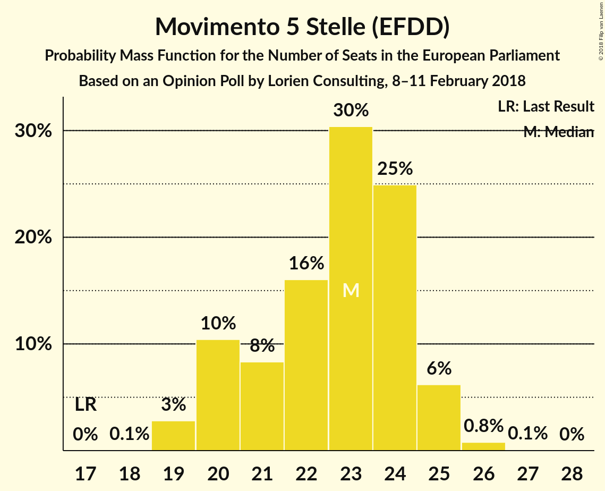

| Number of Seats | Probability | Accumulated | Special Marks |
|:---------------:|:-----------:|:-----------:|:-------------:|
| 17 | 0% | 100% | Last Result |
| 18 | 0.1% | 100% |  |
| 19 | 4% | 99.9% |  |
| 20 | 9% | 96% |  |
| 21 | 8% | 87% |  |
| 22 | 12% | 79% |  |
| 23 | 38% | 67% | Median |
| 24 | 24% | 30% |  |
| 25 | 5% | 6% |  |
| 26 | 0.6% | 0.7% |  |
| 27 | 0.1% | 0.1% |  |
| 28 | 0% | 0% |  |

### Partito Democratico (S&D)

*For a full overview of the results for this party, see the [Partito Democratico (S&D)](party-partitodemocraticosd.html) page.*

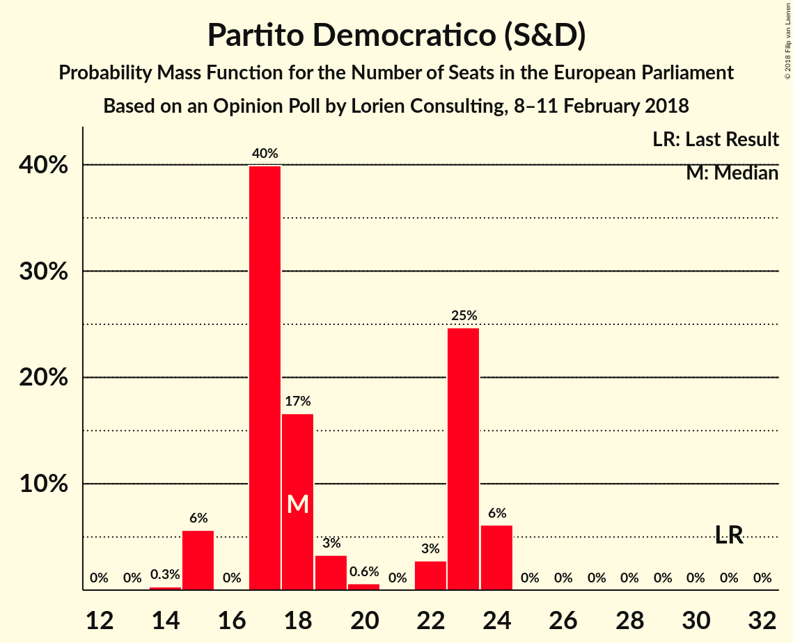

| Number of Seats | Probability | Accumulated | Special Marks |
|:---------------:|:-----------:|:-----------:|:-------------:|
| 15 | 14% | 100% |  |
| 16 | 5% | 86% |  |
| 17 | 28% | 81% |  |
| 18 | 24% | 53% | Median |
| 19 | 14% | 29% |  |
| 20 | 11% | 15% |  |
| 21 | 3% | 4% |  |
| 22 | 0.4% | 0.4% |  |
| 23 | 0% | 0% |  |
| 24 | 0% | 0% |  |
| 25 | 0% | 0% |  |
| 26 | 0% | 0% |  |
| 27 | 0% | 0% |  |
| 28 | 0% | 0% |  |
| 29 | 0% | 0% |  |
| 30 | 0% | 0% |  |
| 31 | 0% | 0% | Last Result |

### Forza Italia (EPP)

*For a full overview of the results for this party, see the [Forza Italia (EPP)](party-forzaitaliaepp.html) page.*

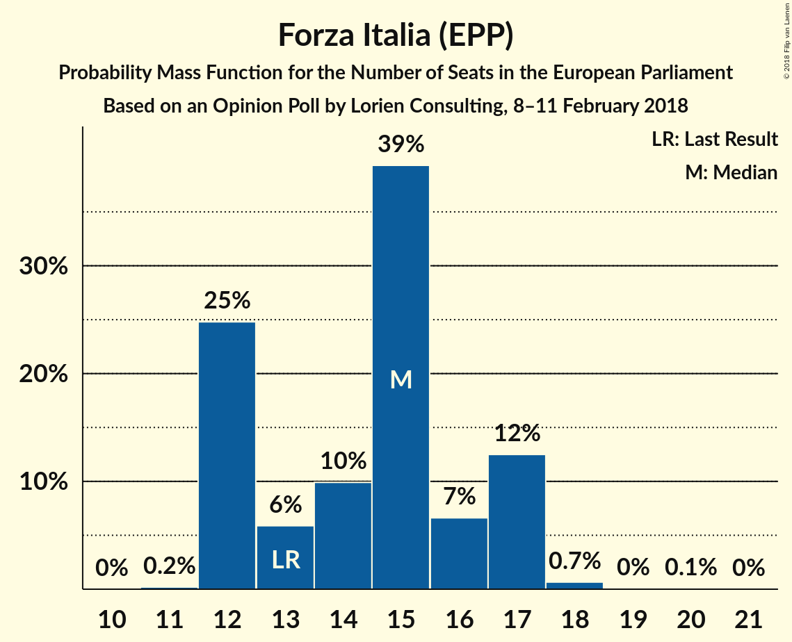

| Number of Seats | Probability | Accumulated | Special Marks |
|:---------------:|:-----------:|:-----------:|:-------------:|
| 11 | 0.1% | 100% |  |
| 12 | 3% | 99.9% |  |
| 13 | 32% | 97% | Last Result |
| 14 | 38% | 65% | Median |
| 15 | 20% | 27% |  |
| 16 | 6% | 7% |  |
| 17 | 0.7% | 0.9% |  |
| 18 | 0.1% | 0.2% |  |
| 19 | 0.1% | 0.1% |  |
| 20 | 0% | 0% |  |

### Lega Nord (ENF)

*For a full overview of the results for this party, see the [Lega Nord (ENF)](party-leganordenf.html) page.*

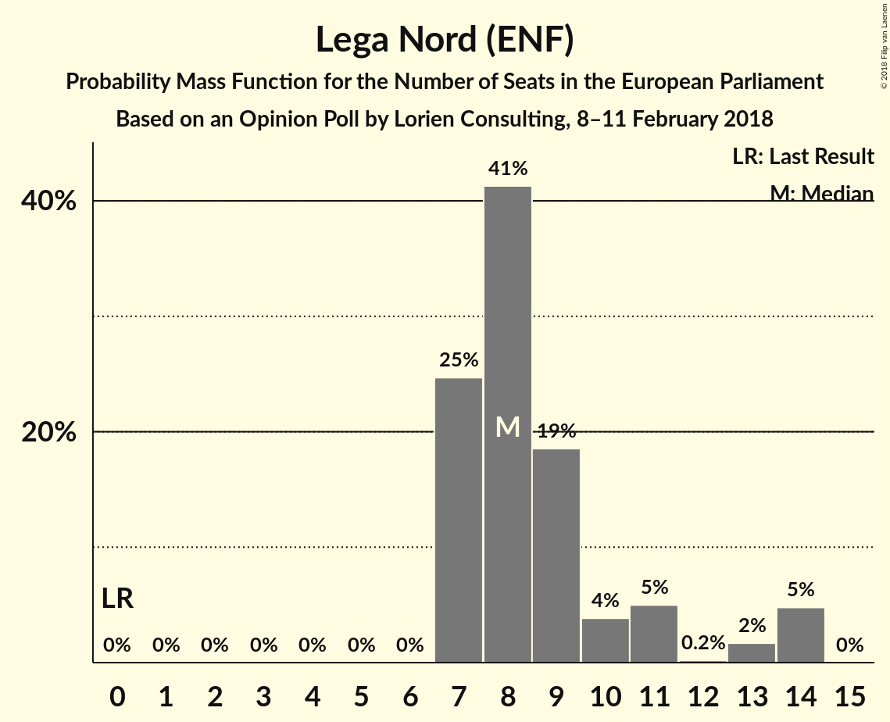

| Number of Seats | Probability | Accumulated | Special Marks |
|:---------------:|:-----------:|:-----------:|:-------------:|
| 5 | 0% | 100% | Last Result |
| 6 | 0% | 100% |  |
| 7 | 0.1% | 100% |  |
| 8 | 3% | 99.9% |  |
| 9 | 42% | 97% |  |
| 10 | 38% | 55% | Median |
| 11 | 14% | 17% |  |
| 12 | 4% | 4% |  |
| 13 | 0.2% | 0.2% |  |
| 14 | 0% | 0% |  |

### Liberi e Uguali (S&D)

*For a full overview of the results for this party, see the [Liberi e Uguali (S&D)](party-liberieugualisd.html) page.*

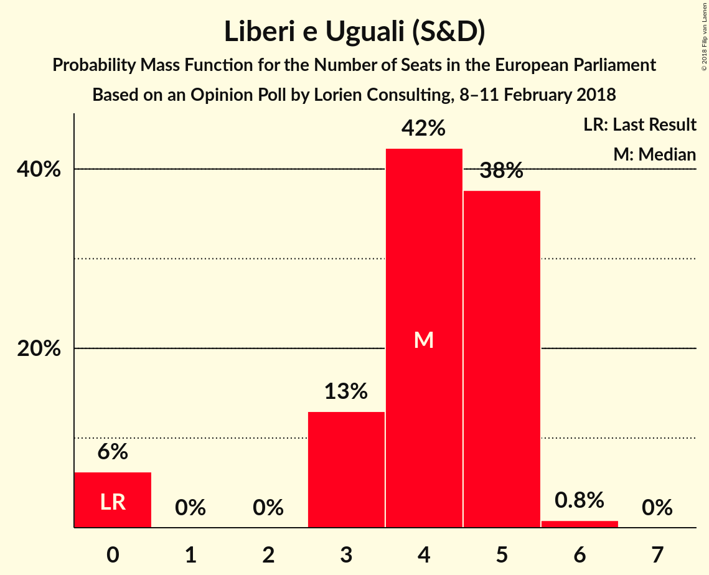

| Number of Seats | Probability | Accumulated | Special Marks |
|:---------------:|:-----------:|:-----------:|:-------------:|
| 0 | 3% | 100% | Last Result |
| 1 | 0% | 97% |  |
| 2 | 0% | 97% |  |
| 3 | 16% | 97% |  |
| 4 | 34% | 81% | Median |
| 5 | 46% | 47% |  |
| 6 | 1.0% | 1.0% |  |
| 7 | 0% | 0% |  |

### Fratelli d’Italia (—)

*For a full overview of the results for this party, see the [Fratelli d’Italia (—)](party-fratellid’italia—.html) page.*

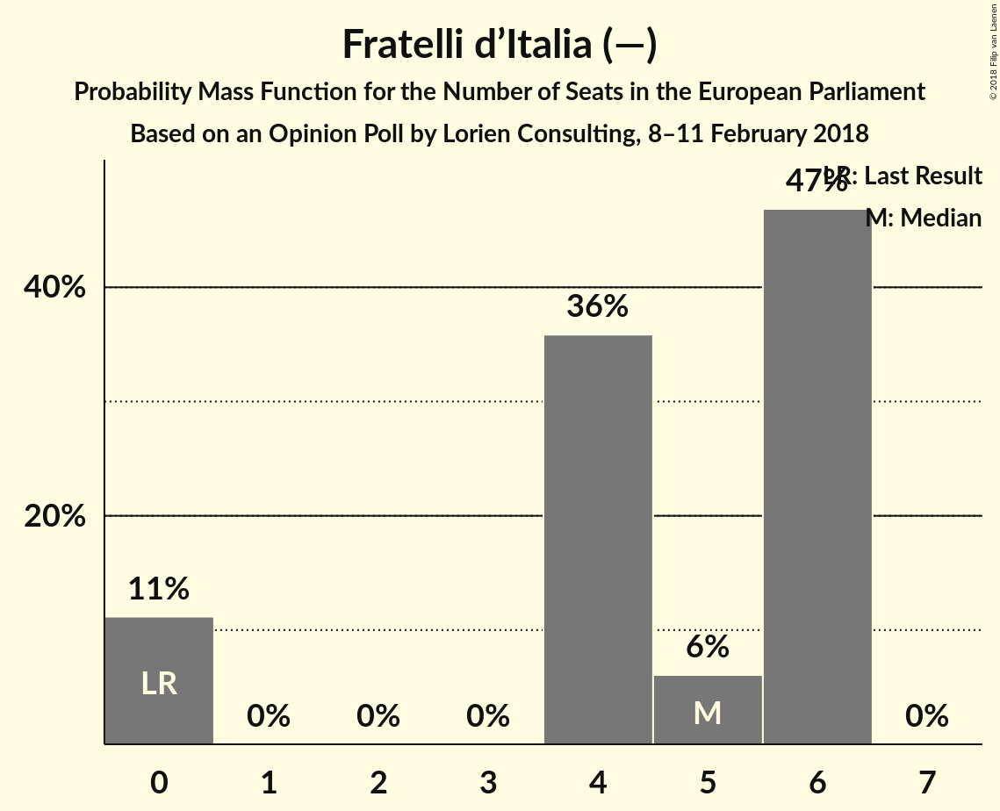

| Number of Seats | Probability | Accumulated | Special Marks |
|:---------------:|:-----------:|:-----------:|:-------------:|
| 0 | 8% | 100% | Last Result |
| 1 | 0% | 92% |  |
| 2 | 0% | 92% |  |
| 3 | 33% | 92% |  |
| 4 | 51% | 59% | Median |
| 5 | 9% | 9% |  |
| 6 | 0.1% | 0.1% |  |
| 7 | 0% | 0% |  |

### Potere al Popolo (GUE/NGL)

*For a full overview of the results for this party, see the [Potere al Popolo (GUE/NGL)](party-poterealpopologuengl.html) page.*

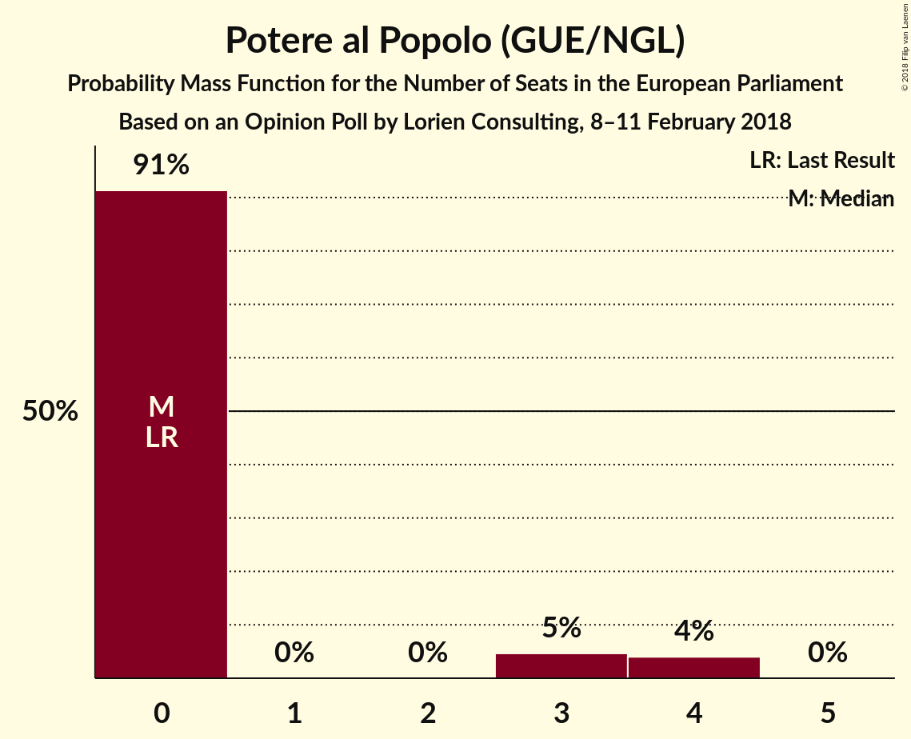

| Number of Seats | Probability | Accumulated | Special Marks |
|:---------------:|:-----------:|:-----------:|:-------------:|
| 0 | 91% | 100% | Last Result, Median |
| 1 | 0% | 9% |  |
| 2 | 0% | 9% |  |
| 3 | 5% | 9% |  |
| 4 | 4% | 4% |  |
| 5 | 0% | 0% |  |

### Civica Popolare (—)

*For a full overview of the results for this party, see the [Civica Popolare (—)](party-civicapopolare—.html) page.*

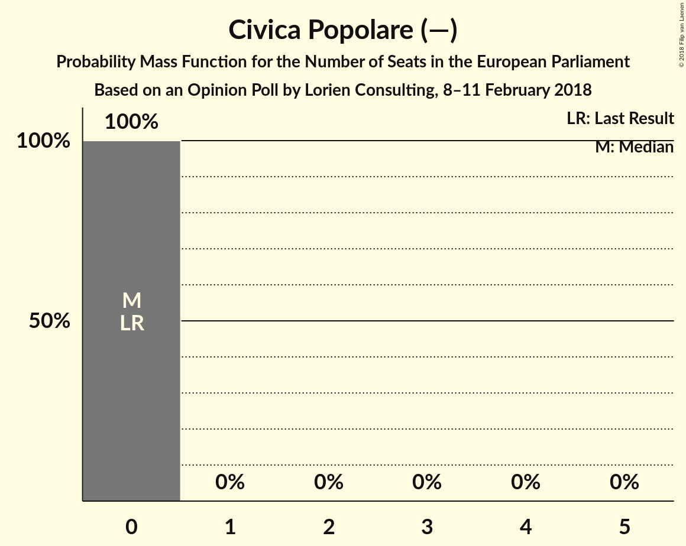

| Number of Seats | Probability | Accumulated | Special Marks |
|:---------------:|:-----------:|:-----------:|:-------------:|
| 0 | 100% | 100% | Last Result, Median |

### CasaPound Italia (—)

*For a full overview of the results for this party, see the [CasaPound Italia (—)](party-casapounditalia—.html) page.*

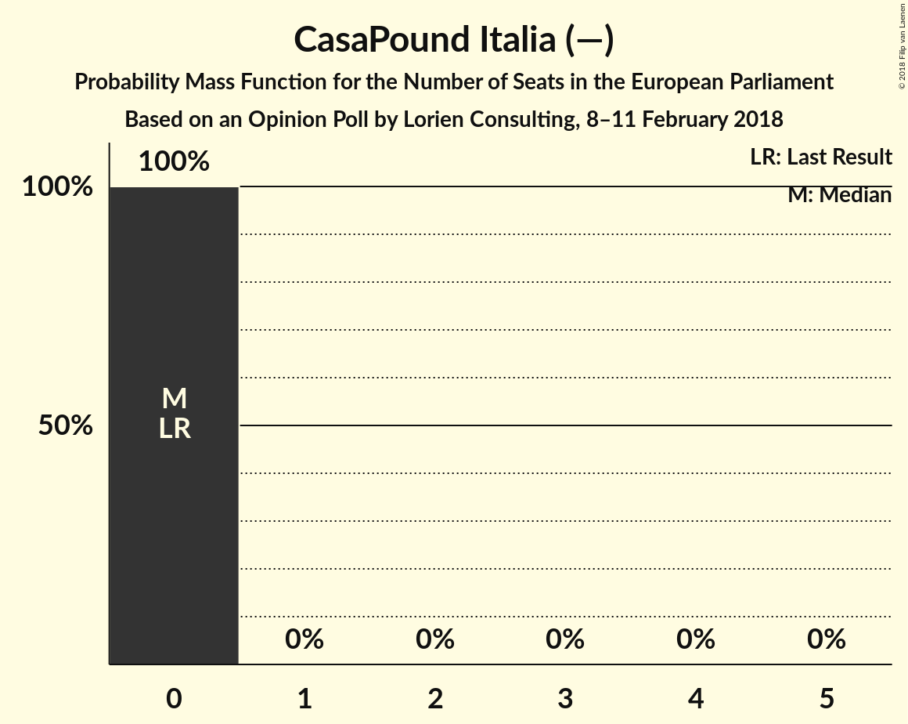

| Number of Seats | Probability | Accumulated | Special Marks |
|:---------------:|:-----------:|:-----------:|:-------------:|
| 0 | 100% | 100% | Last Result, Median |

### Più Europa (—)

*For a full overview of the results for this party, see the [Più Europa (—)](party-piùeuropa—.html) page.*

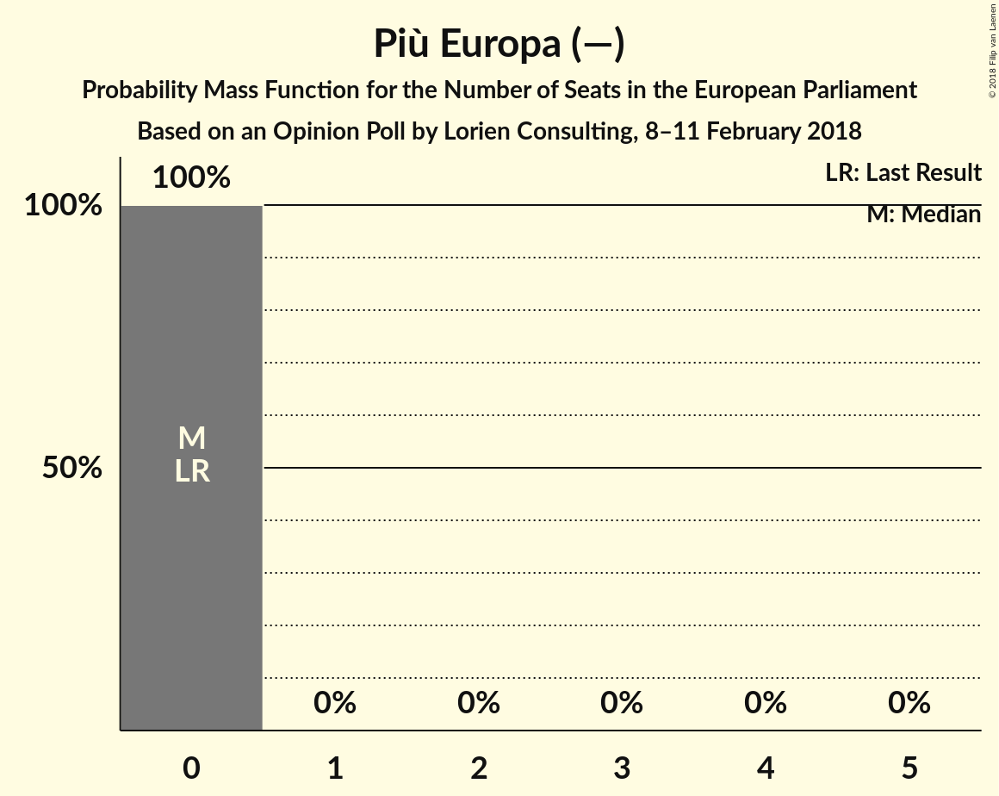

| Number of Seats | Probability | Accumulated | Special Marks |
|:---------------:|:-----------:|:-----------:|:-------------:|
| 0 | 100% | 100% | Last Result, Median |

### Noi con l’Italia (—)

*For a full overview of the results for this party, see the [Noi con l’Italia (—)](party-noiconl’italia—.html) page.*

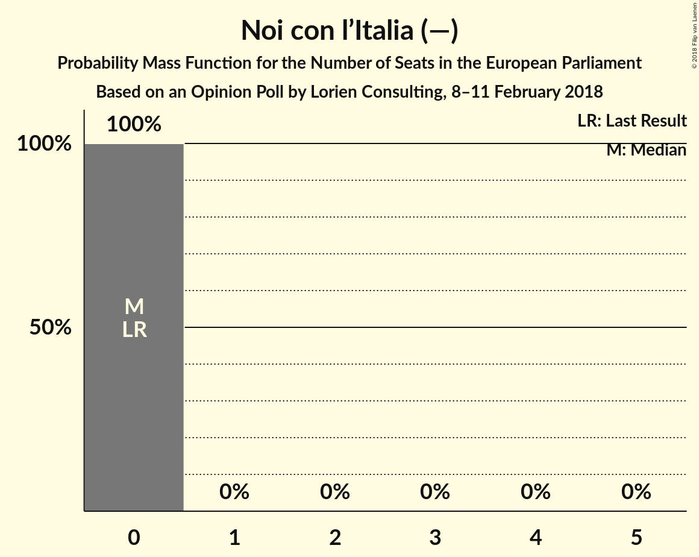

| Number of Seats | Probability | Accumulated | Special Marks |
|:---------------:|:-----------:|:-----------:|:-------------:|
| 0 | 100% | 100% | Last Result, Median |

### Insieme (—)

*For a full overview of the results for this party, see the [Insieme (—)](party-insieme—.html) page.*

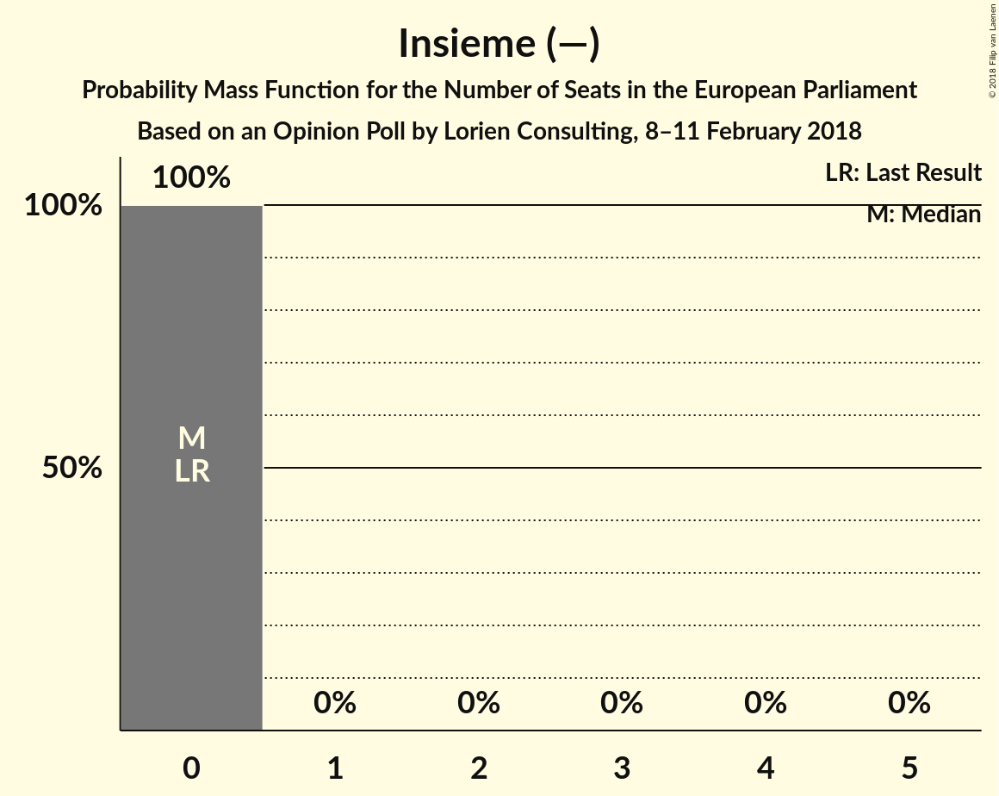

| Number of Seats | Probability | Accumulated | Special Marks |
|:---------------:|:-----------:|:-----------:|:-------------:|
| 0 | 100% | 100% | Last Result, Median |

## Coalitions

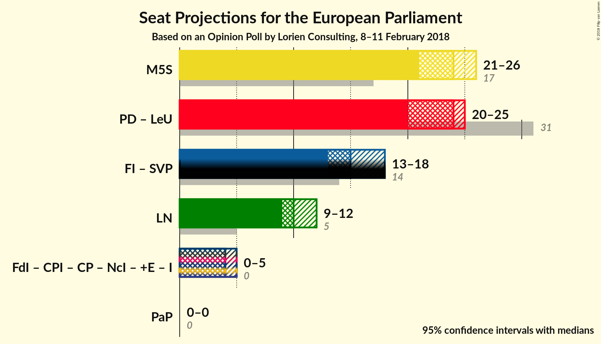

### Confidence Intervals

| Coalition | Last Result | Median | Majority? | 80% Confidence Interval | 90% Confidence Interval | 95% Confidence Interval | 99% Confidence Interval |
|:---------:|:-----------:|:------:|:---------:|:-----------------------:|:-----------------------:|:-----------------------:|:-----------------------:|
| Partito Democratico (S&D) – Liberi e Uguali (S&D) | 31 | 22 | 0% | 20–24 | 20–25 | 19–25 | 19–25 |
| Movimento 5 Stelle (EFDD) | 17 | 23 | 0% | 20–24 | 20–25 | 19–25 | 19–26 |
| Lega Nord (ENF) | 5 | 10 | 0% | 9–11 | 9–11 | 8–12 | 8–12 |
| Fratelli d’Italia (—) – CasaPound Italia (—) – Civica Popolare (—) – Noi con l’Italia (—) – Più Europa (—) – Insieme (—) | 0 | 4 | 0% | 3–4 | 0–5 | 0–5 | 0–5 |
| Potere al Popolo (GUE/NGL) | 0 | 0 | 0% | 0 | 0–3 | 0–4 | 0–4 |

### Partito Democratico (S&D) – Liberi e Uguali (S&D)

| Number of Seats | Probability | Accumulated | Special Marks |
|:---------------:|:-----------:|:-----------:|:-------------:|
| 16 | 0.1% | 100% |  |
| 17 | 0.2% | 99.9% |  |
| 18 | 0.1% | 99.7% |  |
| 19 | 4% | 99.6% |  |
| 20 | 21% | 96% |  |
| 21 | 24% | 75% |  |
| 22 | 6% | 51% | Median |
| 23 | 30% | 45% |  |
| 24 | 10% | 16% |  |
| 25 | 5% | 6% |  |
| 26 | 0.1% | 0.3% |  |
| 27 | 0.2% | 0.2% |  |
| 28 | 0% | 0% |  |
| 29 | 0% | 0% |  |
| 30 | 0% | 0% |  |
| 31 | 0% | 0% | Last Result |

### Movimento 5 Stelle (EFDD)

| Number of Seats | Probability | Accumulated | Special Marks |
|:---------------:|:-----------:|:-----------:|:-------------:|
| 17 | 0% | 100% | Last Result |
| 18 | 0.1% | 100% |  |
| 19 | 4% | 99.9% |  |
| 20 | 9% | 96% |  |
| 21 | 8% | 87% |  |
| 22 | 12% | 79% |  |
| 23 | 38% | 67% | Median |
| 24 | 24% | 30% |  |
| 25 | 5% | 6% |  |
| 26 | 0.6% | 0.7% |  |
| 27 | 0.1% | 0.1% |  |
| 28 | 0% | 0% |  |

### Lega Nord (ENF)

| Number of Seats | Probability | Accumulated | Special Marks |
|:---------------:|:-----------:|:-----------:|:-------------:|
| 5 | 0% | 100% | Last Result |
| 6 | 0% | 100% |  |
| 7 | 0.1% | 100% |  |
| 8 | 3% | 99.9% |  |
| 9 | 42% | 97% |  |
| 10 | 38% | 55% | Median |
| 11 | 14% | 17% |  |
| 12 | 4% | 4% |  |
| 13 | 0.2% | 0.2% |  |
| 14 | 0% | 0% |  |

### Fratelli d’Italia (—) – CasaPound Italia (—) – Civica Popolare (—) – Noi con l’Italia (—) – Più Europa (—) – Insieme (—)

| Number of Seats | Probability | Accumulated | Special Marks |
|:---------------:|:-----------:|:-----------:|:-------------:|
| 0 | 8% | 100% | Last Result |
| 1 | 0% | 92% |  |
| 2 | 0% | 92% |  |
| 3 | 33% | 92% |  |
| 4 | 51% | 59% | Median |
| 5 | 9% | 9% |  |
| 6 | 0.1% | 0.1% |  |
| 7 | 0% | 0% |  |

### Potere al Popolo (GUE/NGL)

| Number of Seats | Probability | Accumulated | Special Marks |
|:---------------:|:-----------:|:-----------:|:-------------:|
| 0 | 91% | 100% | Last Result, Median |
| 1 | 0% | 9% |  |
| 2 | 0% | 9% |  |
| 3 | 5% | 9% |  |
| 4 | 4% | 4% |  |
| 5 | 0% | 0% |  |

## Technical Information

### Opinion Poll

+ **Polling firm:** Lorien Consulting
+ **Commissioner(s):** —
+ **Fieldwork period:** 8–11 February 2018

### Calculations

+ **Sample size:** 1000
+ **Simulations done:** 1,048,576
+ **Error estimate:** 2.74%

