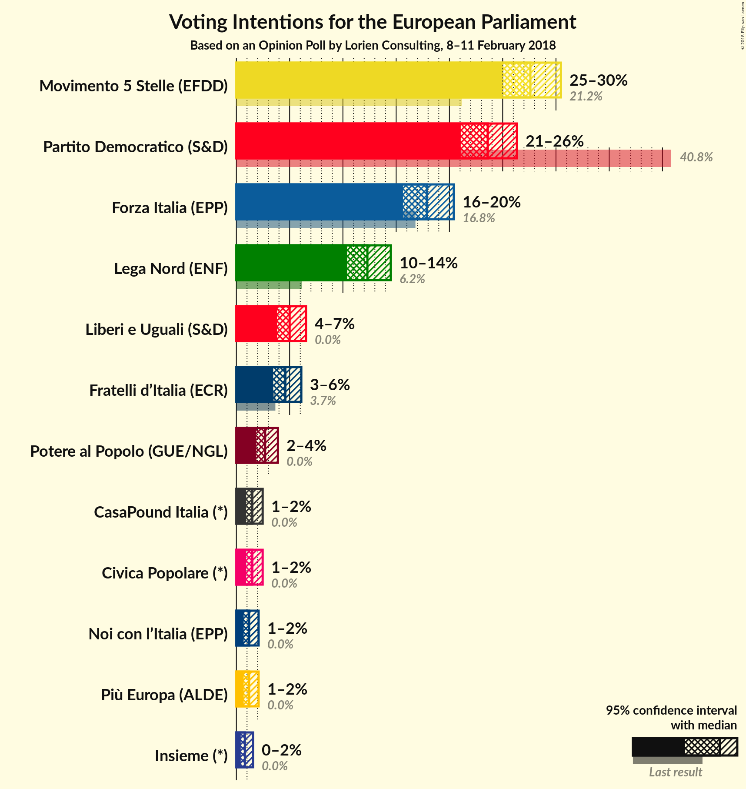
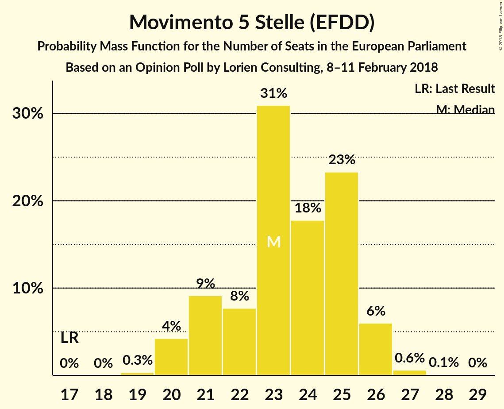
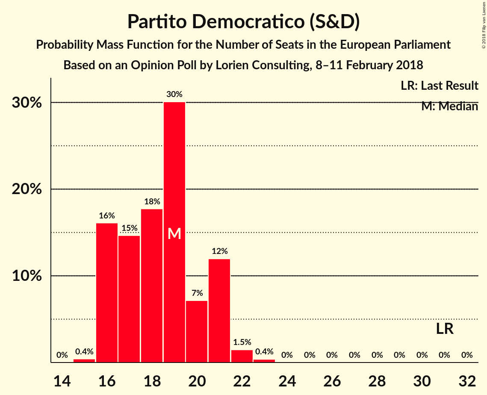
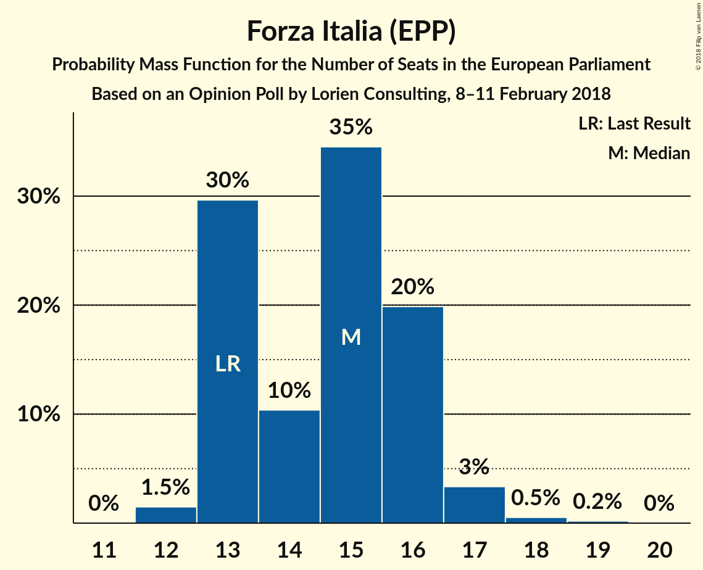
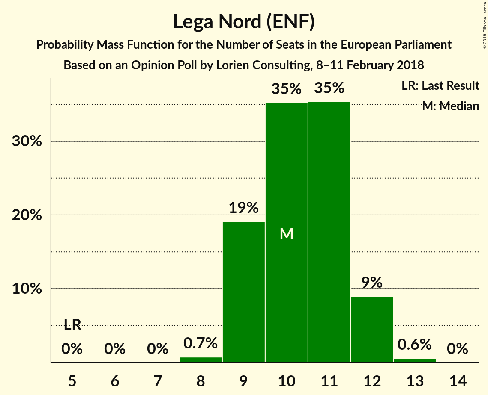
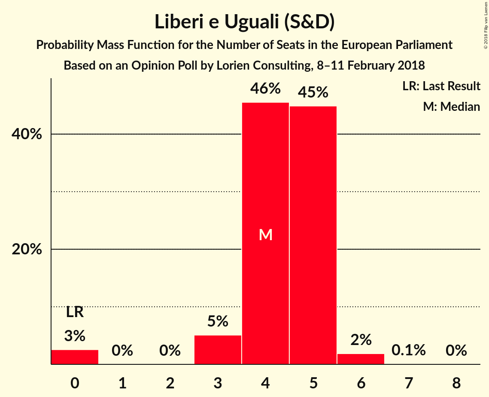
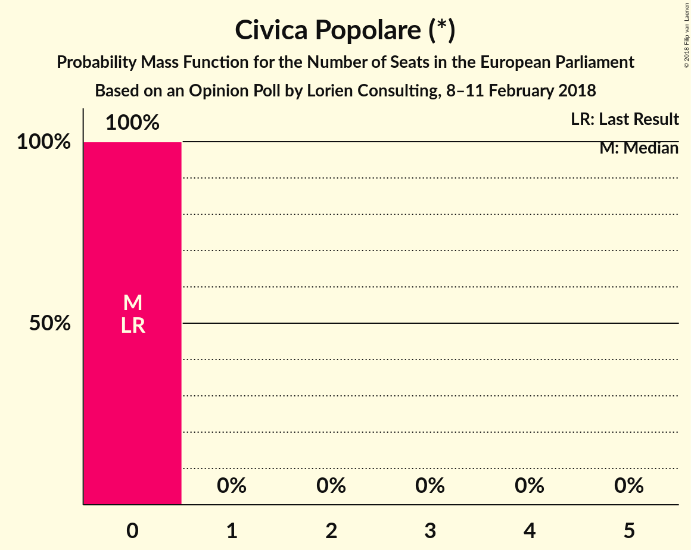
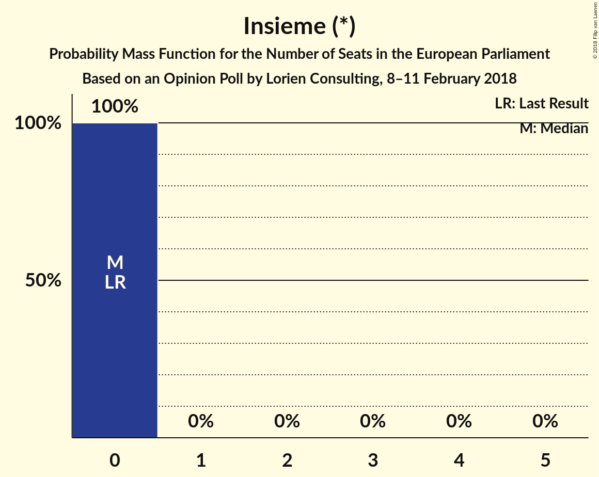

# Opinion Poll by Lorien Consulting, 8–11 February 2018

<a href="#voting-intentions">Voting Intentions</a> | <a href="#seats">Seats</a> | <a href="#coalitions">Coalitions</a> | <a href="#technical-information">Technical Information</a>

## Voting Intentions

### Confidence Intervals

| Party | Last Result | Poll Result | 80% Confidence Interval | 90% Confidence Interval | 95% Confidence Interval | 99% Confidence Interval |
|:-----:|:-----------:|:-----------:|:-----------------------:|:-----------------------:|:-----------------------:|:-----------------------:|
| Movimento 5 Stelle (EFDD) | 21.1% | 27.6% | 25.8–29.5% |25.3–30.0% |24.9–30.5% |24.1–31.4% |
| Partito Democratico (S&D) | 40.8% | 23.6% | 21.9–25.4% |21.5–25.9% |21.1–26.3% |20.3–27.2% |
| Forza Italia (EPP) | 16.8% | 17.9% | 16.4–19.5% |16.0–20.0% |15.6–20.4% |15.0–21.2% |
| Lega Nord (ENF) | 6.2% | 12.3% | 11.1–13.7% |10.7–14.1% |10.4–14.5% |9.8–15.2% |
| Liberi e Uguali (S&D) | 0.0% | 5.0% | 4.2–6.0% |4.0–6.3% |3.8–6.5% |3.5–7.1% |
| Fratelli d’Italia (*) | 3.7% | 4.6% | 3.9–5.6% |3.6–5.9% |3.5–6.1% |3.1–6.6% |
| Potere al Popolo (GUE/NGL) | 0.0% | 2.7% | 2.1–3.5% |2.0–3.7% |1.9–3.9% |1.6–4.3% |
| Civica Popolare (*) | 0.0% | 1.5% | 1.1–2.1% |1.0–2.3% |0.9–2.5% |0.7–2.8% |
| CasaPound Italia (*) | 0.0% | 1.5% | 1.1–2.1% |1.0–2.3% |0.9–2.5% |0.7–2.8% |
| Più Europa (ALDE) | 0.0% | 1.2% | 0.9–1.8% |0.8–1.9% |0.7–2.1% |0.5–2.4% |
| Noi con l’Italia (EPP) | 0.0% | 1.2% | 0.9–1.8% |0.8–1.9% |0.7–2.1% |0.5–2.4% |
| Insieme (*) | 0.0% | 0.8% | 0.5–1.3% |0.5–1.4% |0.4–1.6% |0.3–1.9% |

*Note:* The poll result column reflects the actual value used in the calculations. Published results may vary slightly, and in addition be rounded to fewer digits.

## Seats

### Confidence Intervals

| Party | Last Result | Median | 80% Confidence Interval | 90% Confidence Interval | 95% Confidence Interval | 99% Confidence Interval |
|:-----:|:-----------:|:------:|:-----------------------:|:-----------------------:|:-----------------------:|:-----------------------:|
| <a href="#movimento-5-stelle-(efdd)">Movimento 5 Stelle (EFDD)</a> | 17 | 24 | 22–25 |21–25 |21–26 |20–26 |
| <a href="#partito-democratico-(s&d)">Partito Democratico (S&D)</a> | 31 | 19 | 16–20 |16–21 |16–21 |15–22 |
| <a href="#forza-italia-(epp)">Forza Italia (EPP)</a> | 13 | 14 | 13–16 |13–16 |12–17 |12–18 |
| <a href="#lega-nord-(enf)">Lega Nord (ENF)</a> | 5 | 10 | 9–11 |9–11 |9–12 |9–12 |
| <a href="#liberi-e-uguali-(s&d)">Liberi e Uguali (S&D)</a> | 0 | 5 | 4–5 |4–5 |3–5 |0–6 |
| <a href="#fratelli-d’italia-(*)">Fratelli d’Italia (*)</a> | 0 | 4 | 3–4 |3–5 |0–5 |0–6 |
| <a href="#potere-al-popolo-(gue/ngl)">Potere al Popolo (GUE/NGL)</a> | 0 | 0 | 0 |0 |0 |0–3 |
| <a href="#civica-popolare-(*)">Civica Popolare (*)</a> | 0 | 0 | 0 |0 |0 |0 |
| <a href="#casapound-italia-(*)">CasaPound Italia (*)</a> | 0 | 0 | 0 |0 |0 |0 |
| <a href="#più-europa-(alde)">Più Europa (ALDE)</a> | 0 | 0 | 0 |0 |0 |0 |
| <a href="#noi-con-l’italia-(epp)">Noi con l’Italia (EPP)</a> | 0 | 0 | 0 |0 |0 |0 |
| <a href="#insieme-(*)">Insieme (*)</a> | 0 | 0 | 0 |0 |0 |0 |

### Movimento 5 Stelle (EFDD)

*For a full overview of the results for this party, see the [Movimento 5 Stelle (EFDD)](party-movimento5stelleefdd.html) page.*

| Number of Seats | Probability | Accumulated | Special Marks |
|:---------------:|:-----------:|:-----------:|:-------------:|
| 17 | 0% | 100% | Last Result |
| 18 | 0% | 100% |  |
| 19 | 0.1% | 100% |  |
| 20 | 2% | 99.9% |  |
| 21 | 7% | 98% |  |
| 22 | 3% | 91% |  |
| 23 | 30% | 88% |  |
| 24 | 17% | 57% | Median |
| 25 | 36% | 40% |  |
| 26 | 4% | 4% |  |
| 27 | 0.1% | 0.1% |  |
| 28 | 0% | 0% |  |

### Partito Democratico (S&D)

*For a full overview of the results for this party, see the [Partito Democratico (S&D)](party-partitodemocraticosd.html) page.*

| Number of Seats | Probability | Accumulated | Special Marks |
|:---------------:|:-----------:|:-----------:|:-------------:|
| 15 | 0.8% | 100% |  |
| 16 | 26% | 99.2% |  |
| 17 | 4% | 73% |  |
| 18 | 2% | 69% |  |
| 19 | 53% | 67% | Median |
| 20 | 6% | 14% |  |
| 21 | 7% | 8% |  |
| 22 | 1.1% | 1.3% |  |
| 23 | 0.2% | 0.2% |  |
| 24 | 0% | 0% |  |
| 25 | 0% | 0% |  |
| 26 | 0% | 0% |  |
| 27 | 0% | 0% |  |
| 28 | 0% | 0% |  |
| 29 | 0% | 0% |  |
| 30 | 0% | 0% |  |
| 31 | 0% | 0% | Last Result |

### Forza Italia (EPP)

*For a full overview of the results for this party, see the [Forza Italia (EPP)](party-forzaitaliaepp.html) page.*

| Number of Seats | Probability | Accumulated | Special Marks |
|:---------------:|:-----------:|:-----------:|:-------------:|
| 12 | 3% | 100% |  |
| 13 | 41% | 97% | Last Result |
| 14 | 10% | 56% | Median |
| 15 | 13% | 46% |  |
| 16 | 29% | 32% |  |
| 17 | 3% | 4% |  |
| 18 | 0.2% | 0.6% |  |
| 19 | 0.3% | 0.3% |  |
| 20 | 0% | 0% |  |

### Lega Nord (ENF)

*For a full overview of the results for this party, see the [Lega Nord (ENF)](party-leganordenf.html) page.*

| Number of Seats | Probability | Accumulated | Special Marks |
|:---------------:|:-----------:|:-----------:|:-------------:|
| 5 | 0% | 100% | Last Result |
| 6 | 0% | 100% |  |
| 7 | 0% | 100% |  |
| 8 | 0.4% | 100% |  |
| 9 | 15% | 99.6% |  |
| 10 | 42% | 85% | Median |
| 11 | 41% | 43% |  |
| 12 | 2% | 3% |  |
| 13 | 0.2% | 0.2% |  |
| 14 | 0% | 0% |  |

### Liberi e Uguali (S&D)

*For a full overview of the results for this party, see the [Liberi e Uguali (S&D)](party-liberieugualisd.html) page.*

| Number of Seats | Probability | Accumulated | Special Marks |
|:---------------:|:-----------:|:-----------:|:-------------:|
| 0 | 1.3% | 100% | Last Result |
| 1 | 0% | 98.7% |  |
| 2 | 0% | 98.7% |  |
| 3 | 3% | 98.7% |  |
| 4 | 28% | 96% |  |
| 5 | 66% | 68% | Median |
| 6 | 2% | 2% |  |
| 7 | 0% | 0% |  |

### Fratelli d’Italia (*)

*For a full overview of the results for this party, see the [Fratelli d’Italia (*)](party-fratellid’italia.html) page.*

| Number of Seats | Probability | Accumulated | Special Marks |
|:---------------:|:-----------:|:-----------:|:-------------:|
| 0 | 3% | 100% | Last Result |
| 1 | 0% | 97% |  |
| 2 | 0% | 97% |  |
| 3 | 37% | 97% |  |
| 4 | 54% | 61% | Median |
| 5 | 6% | 7% |  |
| 6 | 0.5% | 0.5% |  |
| 7 | 0% | 0% |  |

### Potere al Popolo (GUE/NGL)

*For a full overview of the results for this party, see the [Potere al Popolo (GUE/NGL)](party-poterealpopologuengl.html) page.*

| Number of Seats | Probability | Accumulated | Special Marks |
|:---------------:|:-----------:|:-----------:|:-------------:|
| 0 | 99.4% | 100% | Last Result, Median |
| 1 | 0% | 0.6% |  |
| 2 | 0% | 0.6% |  |
| 3 | 0.4% | 0.6% |  |
| 4 | 0.2% | 0.2% |  |
| 5 | 0% | 0% |  |

### Civica Popolare (*)

*For a full overview of the results for this party, see the [Civica Popolare (*)](party-civicapopolare.html) page.*

| Number of Seats | Probability | Accumulated | Special Marks |
|:---------------:|:-----------:|:-----------:|:-------------:|
| 0 | 100% | 100% | Last Result, Median |

### CasaPound Italia (*)

*For a full overview of the results for this party, see the [CasaPound Italia (*)](party-casapounditalia.html) page.*

| Number of Seats | Probability | Accumulated | Special Marks |
|:---------------:|:-----------:|:-----------:|:-------------:|
| 0 | 100% | 100% | Last Result, Median |

### Più Europa (ALDE)

*For a full overview of the results for this party, see the [Più Europa (ALDE)](party-piùeuropaalde.html) page.*

| Number of Seats | Probability | Accumulated | Special Marks |
|:---------------:|:-----------:|:-----------:|:-------------:|
| 0 | 100% | 100% | Last Result, Median |

### Noi con l’Italia (EPP)

*For a full overview of the results for this party, see the [Noi con l’Italia (EPP)](party-noiconl’italiaepp.html) page.*

| Number of Seats | Probability | Accumulated | Special Marks |
|:---------------:|:-----------:|:-----------:|:-------------:|
| 0 | 100% | 100% | Last Result, Median |

### Insieme (*)

*For a full overview of the results for this party, see the [Insieme (*)](party-insieme.html) page.*

| Number of Seats | Probability | Accumulated | Special Marks |
|:---------------:|:-----------:|:-----------:|:-------------:|
| 0 | 100% | 100% | Last Result, Median |

## Coalitions

### Confidence Intervals

| Coalition | Last Result | Median | Majority? | 80% Confidence Interval | 90% Confidence Interval | 95% Confidence Interval | 99% Confidence Interval |
|:---------:|:-----------:|:------:|:---------:|:-----------------------:|:-----------------------:|:-----------------------:|:-----------------------:|
| Movimento 5 Stelle (EFDD) | 17 | 24 | 0% | 22–25 | 21–25 | 21–26 | 20–26 |
| Partito Democratico (S&D) – Liberi e Uguali (S&D) | 31 | 24 | 0% | 21–24 | 21–25 | 20–25 | 20–26 |
| Lega Nord (ENF) | 5 | 10 | 0% | 9–11 | 9–11 | 9–12 | 9–12 |
| Fratelli d’Italia (*) – CasaPound Italia (*) – Civica Popolare (*) – Insieme (*) | 0 | 4 | 0% | 3–4 | 3–5 | 0–5 | 0–6 |
| Più Europa (ALDE) | 0 | 0 | 0% | 0 | 0 | 0 | 0 |
| Potere al Popolo (GUE/NGL) | 0 | 0 | 0% | 0 | 0 | 0 | 0–3 |

### Movimento 5 Stelle (EFDD)

| Number of Seats | Probability | Accumulated | Special Marks |
|:---------------:|:-----------:|:-----------:|:-------------:|
| 17 | 0% | 100% | Last Result |
| 18 | 0% | 100% |  |
| 19 | 0.1% | 100% |  |
| 20 | 2% | 99.9% |  |
| 21 | 7% | 98% |  |
| 22 | 3% | 91% |  |
| 23 | 30% | 88% |  |
| 24 | 17% | 57% | Median |
| 25 | 36% | 40% |  |
| 26 | 4% | 4% |  |
| 27 | 0.1% | 0.1% |  |
| 28 | 0% | 0% |  |

### Partito Democratico (S&D) – Liberi e Uguali (S&D)

| Number of Seats | Probability | Accumulated | Special Marks |
|:---------------:|:-----------:|:-----------:|:-------------:|
| 17 | 0.1% | 100% |  |
| 18 | 0% | 99.9% |  |
| 19 | 0% | 99.9% |  |
| 20 | 4% | 99.8% |  |
| 21 | 27% | 96% |  |
| 22 | 1.1% | 69% |  |
| 23 | 17% | 68% |  |
| 24 | 41% | 51% | Median |
| 25 | 8% | 10% |  |
| 26 | 1.4% | 1.5% |  |
| 27 | 0.1% | 0.1% |  |
| 28 | 0% | 0% |  |
| 29 | 0% | 0% |  |
| 30 | 0% | 0% |  |
| 31 | 0% | 0% | Last Result |

### Lega Nord (ENF)

| Number of Seats | Probability | Accumulated | Special Marks |
|:---------------:|:-----------:|:-----------:|:-------------:|
| 5 | 0% | 100% | Last Result |
| 6 | 0% | 100% |  |
| 7 | 0% | 100% |  |
| 8 | 0.4% | 100% |  |
| 9 | 15% | 99.6% |  |
| 10 | 42% | 85% | Median |
| 11 | 41% | 43% |  |
| 12 | 2% | 3% |  |
| 13 | 0.2% | 0.2% |  |
| 14 | 0% | 0% |  |

### Fratelli d’Italia (*) – CasaPound Italia (*) – Civica Popolare (*) – Insieme (*)

| Number of Seats | Probability | Accumulated | Special Marks |
|:---------------:|:-----------:|:-----------:|:-------------:|
| 0 | 3% | 100% | Last Result |
| 1 | 0% | 97% |  |
| 2 | 0% | 97% |  |
| 3 | 37% | 97% |  |
| 4 | 54% | 61% | Median |
| 5 | 6% | 7% |  |
| 6 | 0.5% | 0.5% |  |
| 7 | 0% | 0% |  |

### Più Europa (ALDE)

| Number of Seats | Probability | Accumulated | Special Marks |
|:---------------:|:-----------:|:-----------:|:-------------:|
| 0 | 100% | 100% | Last Result, Median |

### Potere al Popolo (GUE/NGL)

| Number of Seats | Probability | Accumulated | Special Marks |
|:---------------:|:-----------:|:-----------:|:-------------:|
| 0 | 99.4% | 100% | Last Result, Median |
| 1 | 0% | 0.6% |  |
| 2 | 0% | 0.6% |  |
| 3 | 0.4% | 0.6% |  |
| 4 | 0.2% | 0.2% |  |
| 5 | 0% | 0% |  |

## Technical Information

### Opinion Poll

+ **Polling firm:** Lorien Consulting
+ **Commissioner(s):** —
+ **Fieldwork period:** 8–11 February 2018

### Calculations

+ **Sample size:** 1000
+ **Simulations done:** 524,288
+ **Error estimate:** 4.83%

