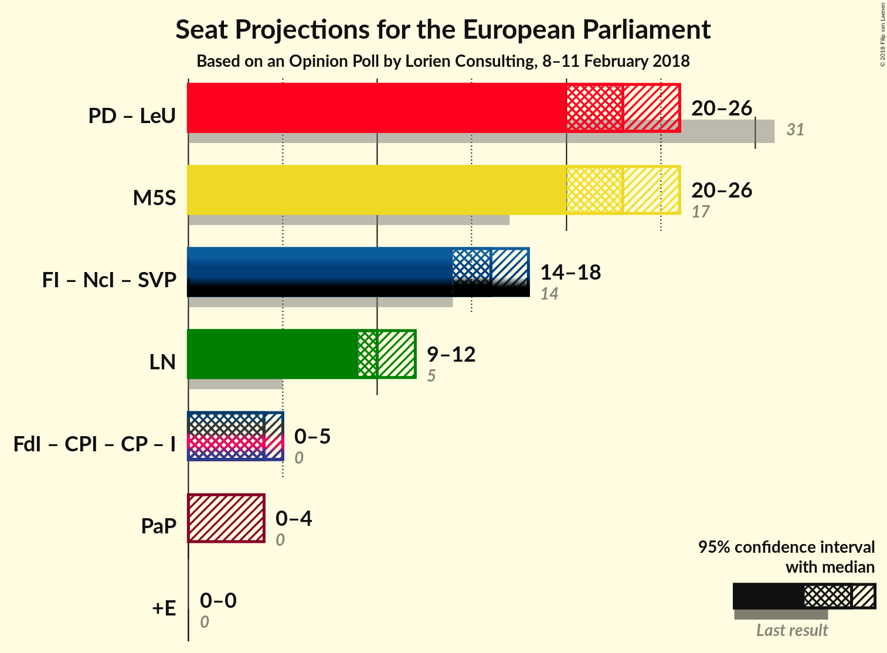

# Opinion Poll by Lorien Consulting, 8–11 February 2018

<a href="#voting-intentions">Voting Intentions</a> | <a href="#seats">Seats</a> | <a href="#coalitions">Coalitions</a> | <a href="#technical-information">Technical Information</a>

## Voting Intentions

### Confidence Intervals

| Party | Last Result | Poll Result | 80% Confidence Interval | 90% Confidence Interval | 95% Confidence Interval | 99% Confidence Interval |
|:-----:|:-----------:|:-----------:|:-----------------------:|:-----------------------:|:-----------------------:|:-----------------------:|
| Movimento 5 Stelle (EFDD) | 0.0% | 27.6% | N/A |N/A |N/A |N/A |
| Partito Democratico (S&D) | 0.0% | 23.6% | N/A |N/A |N/A |N/A |
| Forza Italia (EPP) | 0.0% | 17.9% | N/A |N/A |N/A |N/A |
| Lega Nord (ENF) | 0.0% | 12.3% | N/A |N/A |N/A |N/A |
| Liberi e Uguali (S&D) | 0.0% | 5.0% | N/A |N/A |N/A |N/A |
| Fratelli d’Italia (—) | 0.0% | 4.6% | N/A |N/A |N/A |N/A |
| Potere al Popolo (GUE/NGL) | 0.0% | 2.7% | N/A |N/A |N/A |N/A |
| Civica Popolare (—) | 0.0% | 1.5% | N/A |N/A |N/A |N/A |
| CasaPound Italia (—) | 0.0% | 1.5% | N/A |N/A |N/A |N/A |
| Più Europa (—) | 0.0% | 1.2% | N/A |N/A |N/A |N/A |
| Noi con l’Italia (—) | 0.0% | 1.2% | N/A |N/A |N/A |N/A |
| Insieme (—) | 0.0% | 0.8% | N/A |N/A |N/A |N/A |

*Note:* The poll result column reflects the actual value used in the calculations. Published results may vary slightly, and in addition be rounded to fewer digits.

## Seats

### Confidence Intervals

| Party | Last Result | Median | 80% Confidence Interval | 90% Confidence Interval | 95% Confidence Interval | 99% Confidence Interval |
|:-----:|:-----------:|:------:|:-----------------------:|:-----------------------:|:-----------------------:|:-----------------------:|
| <a href="#movimento-5-stelle-(efdd)">Movimento 5 Stelle (EFDD)</a> | 0 | N/A | N/A |N/A |N/A |N/A |
| <a href="#partito-democratico-(s&d)">Partito Democratico (S&D)</a> | 0 | N/A | N/A |N/A |N/A |N/A |
| <a href="#forza-italia-(epp)">Forza Italia (EPP)</a> | 0 | N/A | N/A |N/A |N/A |N/A |
| <a href="#lega-nord-(enf)">Lega Nord (ENF)</a> | 0 | N/A | N/A |N/A |N/A |N/A |
| <a href="#liberi-e-uguali-(s&d)">Liberi e Uguali (S&D)</a> | 0 | N/A | N/A |N/A |N/A |N/A |
| <a href="#fratelli-d’italia-(—)">Fratelli d’Italia (—)</a> | 0 | N/A | N/A |N/A |N/A |N/A |
| <a href="#potere-al-popolo-(gue/ngl)">Potere al Popolo (GUE/NGL)</a> | 0 | N/A | N/A |N/A |N/A |N/A |
| <a href="#civica-popolare-(—)">Civica Popolare (—)</a> | 0 | N/A | N/A |N/A |N/A |N/A |
| <a href="#casapound-italia-(—)">CasaPound Italia (—)</a> | 0 | N/A | N/A |N/A |N/A |N/A |
| <a href="#più-europa-(—)">Più Europa (—)</a> | 0 | N/A | N/A |N/A |N/A |N/A |
| <a href="#noi-con-l’italia-(—)">Noi con l’Italia (—)</a> | 0 | N/A | N/A |N/A |N/A |N/A |
| <a href="#insieme-(—)">Insieme (—)</a> | 0 | N/A | N/A |N/A |N/A |N/A |

## Coalitions

## Technical Information

### Opinion Poll

+ **Polling firm:** Lorien Consulting
+ **Commissioner(s):** —
+ **Fieldwork period:** 8–11 February 2018

### Calculations

+ **Sample size:** 1000
+ **Simulations done:** 0
+ **Error estimate:** 100.00%

