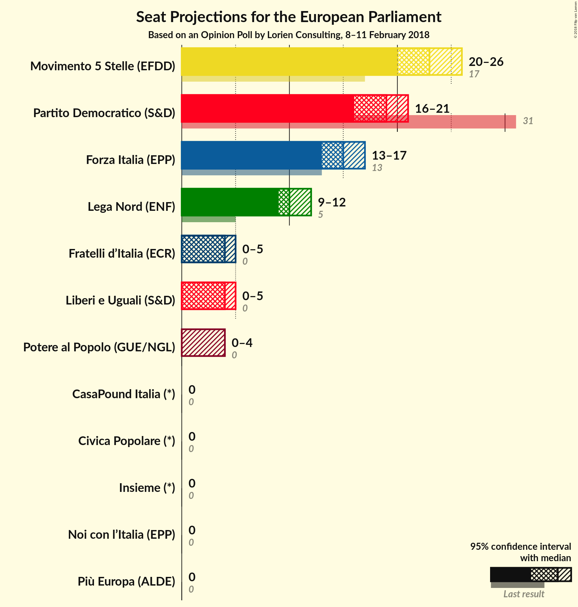

# Opinion Poll by Lorien Consulting, 8–11 February 2018

<a href="#voting-intentions">Voting Intentions</a> | <a href="#seats">Seats</a> | <a href="#coalitions">Coalitions</a> | <a href="#technical-information">Technical Information</a>

## Voting Intentions

### Confidence Intervals

| Party | Last Result | Poll Result | 80% Confidence Interval | 90% Confidence Interval | 95% Confidence Interval | 99% Confidence Interval |
|:-----:|:-----------:|:-----------:|:-----------------------:|:-----------------------:|:-----------------------:|:-----------------------:|
| Movimento 5 Stelle (EFDD) | 21.1% | 27.6% | 25.8–29.5% |25.3–30.0% |24.9–30.5% |24.1–31.4% |
| Partito Democratico (S&D) | 40.8% | 23.6% | 21.9–25.4% |21.5–25.9% |21.1–26.3% |20.3–27.2% |
| Forza Italia (EPP) | 16.8% | 17.9% | 16.4–19.5% |16.0–20.0% |15.6–20.4% |15.0–21.2% |
| Lega Nord (ENF) | 6.2% | 12.3% | 11.1–13.7% |10.7–14.1% |10.4–14.5% |9.8–15.2% |
| Liberi e Uguali (S&D) | 0.0% | 5.0% | 4.2–6.0% |4.0–6.3% |3.8–6.5% |3.5–7.1% |
| Fratelli d’Italia (*) | 3.7% | 4.6% | N/A |N/A |N/A |N/A |
| Potere al Popolo (GUE/NGL) | 0.0% | 2.7% | 2.1–3.5% |2.0–3.7% |1.9–3.9% |1.6–4.3% |
| Civica Popolare (*) | 0.0% | 1.5% | N/A |N/A |N/A |N/A |
| CasaPound Italia (*) | 0.0% | 1.5% | N/A |N/A |N/A |N/A |
| Più Europa (ALDE) | 0.0% | 1.2% | N/A |N/A |N/A |N/A |
| Noi con l’Italia (EPP) | 0.0% | 1.2% | N/A |N/A |N/A |N/A |
| Insieme (*) | 0.0% | 0.8% | N/A |N/A |N/A |N/A |

*Note:* The poll result column reflects the actual value used in the calculations. Published results may vary slightly, and in addition be rounded to fewer digits.

## Seats

### Confidence Intervals

| Party | Last Result | Median | 80% Confidence Interval | 90% Confidence Interval | 95% Confidence Interval | 99% Confidence Interval |
|:-----:|:-----------:|:------:|:-----------------------:|:-----------------------:|:-----------------------:|:-----------------------:|
| <a href="#movimento-5-stelle-(efdd)">Movimento 5 Stelle (EFDD)</a> | 17 | 24 | 22–25 |21–25 |21–26 |20–26 |
| <a href="#partito-democratico-(s&d)">Partito Democratico (S&D)</a> | 31 | 19 | 16–20 |16–21 |16–21 |15–22 |
| <a href="#forza-italia-(epp)">Forza Italia (EPP)</a> | 13 | 14 | 13–16 |13–16 |12–17 |12–18 |
| <a href="#lega-nord-(enf)">Lega Nord (ENF)</a> | 5 | 10 | 9–11 |9–11 |9–12 |9–12 |
| <a href="#liberi-e-uguali-(s&d)">Liberi e Uguali (S&D)</a> | 0 | 5 | 4–5 |4–5 |3–5 |0–6 |
| <a href="#fratelli-d’italia-(*)">Fratelli d’Italia (*)</a> | 0 | N/A | N/A |N/A |N/A |N/A |
| <a href="#potere-al-popolo-(gue/ngl)">Potere al Popolo (GUE/NGL)</a> | 0 | 0 | 0 |0 |0 |0–3 |
| <a href="#civica-popolare-(*)">Civica Popolare (*)</a> | 0 | N/A | N/A |N/A |N/A |N/A |
| <a href="#casapound-italia-(*)">CasaPound Italia (*)</a> | 0 | N/A | N/A |N/A |N/A |N/A |
| <a href="#più-europa-(alde)">Più Europa (ALDE)</a> | 0 | N/A | N/A |N/A |N/A |N/A |
| <a href="#noi-con-l’italia-(epp)">Noi con l’Italia (EPP)</a> | 0 | N/A | N/A |N/A |N/A |N/A |
| <a href="#insieme-(*)">Insieme (*)</a> | 0 | N/A | N/A |N/A |N/A |N/A |

