# Opinion Poll by Bidimedia, 8–12 February 2018

<a href="#voting-intentions">Voting Intentions</a> | <a href="#seats">Seats</a> | <a href="#coalitions">Coalitions</a> | <a href="#technical-information">Technical Information</a>

## Voting Intentions

### Confidence Intervals

| Party | Last Result | Poll Result | 80% Confidence Interval | 90% Confidence Interval | 95% Confidence Interval | 99% Confidence Interval |
|:-----:|:-----------:|:-----------:|:-----------------------:|:-----------------------:|:-----------------------:|:-----------------------:|
| Movimento 5 Stelle (EFDD) | 21.1% | 25.3% | 23.8–26.9% |23.4–27.4% |23.0–27.8% |22.3–28.5% |
| Partito Democratico (S&D) | 40.8% | 24.4% | 22.9–26.0% |22.5–26.4% |22.1–26.8% |21.4–27.6% |
| Forza Italia (EPP) | 16.8% | 16.3% | 15.0–17.7% |14.7–18.1% |14.4–18.4% |13.8–19.1% |
| Lega Nord (ENF) | 6.2% | 14.5% | 13.3–15.9% |13.0–16.2% |12.7–16.6% |12.2–17.2% |
| Liberi e Uguali (S&D) | 0.0% | 4.6% | 3.9–5.5% |3.7–5.7% |3.6–5.9% |3.3–6.3% |
| Fratelli d’Italia (*) | 3.7% | 3.9% | 3.3–4.7% |3.1–4.9% |3.0–5.1% |2.7–5.5% |
| Noi con l’Italia (EPP) | 0.0% | 2.5% | 2.1–3.2% |1.9–3.4% |1.8–3.6% |1.6–3.9% |
| Più Europa (ALDE) | 0.0% | 1.9% | 1.5–2.5% |1.4–2.7% |1.3–2.8% |1.1–3.1% |
| Civica Popolare (*) | 0.0% | 1.4% | 1.1–1.9% |0.9–2.1% |0.9–2.2% |0.7–2.5% |
| Potere al Popolo (GUE/NGL) | 0.0% | 1.2% | 0.9–1.7% |0.8–1.9% |0.8–2.0% |0.6–2.3% |
| CasaPound Italia (*) | 0.0% | 1.1% | 0.8–1.6% |0.7–1.7% |0.6–1.8% |0.5–2.1% |
| Insieme (*) | 0.0% | 1.0% | 0.7–1.5% |0.6–1.6% |0.6–1.7% |0.5–2.0% |

*Note:* The poll result column reflects the actual value used in the calculations. Published results may vary slightly, and in addition be rounded to fewer digits.

## Seats

### Confidence Intervals

| Party | Last Result | Median | 80% Confidence Interval | 90% Confidence Interval | 95% Confidence Interval | 99% Confidence Interval |
|:-----:|:-----------:|:------:|:-----------------------:|:-----------------------:|:-----------------------:|:-----------------------:|
| <a href="#movimento-5-stelle-(efdd)">Movimento 5 Stelle (EFDD)</a> | 17 | 23 | 22–23 |21–23 |21–23 |18–25 |
| <a href="#partito-democratico-(s&d)">Partito Democratico (S&D)</a> | 31 | 21 | 19–21 |19–21 |19–21 |18–23 |
| <a href="#forza-italia-(epp)">Forza Italia (EPP)</a> | 13 | 14 | 13–15 |13–16 |12–16 |12–17 |
| <a href="#lega-nord-(enf)">Lega Nord (ENF)</a> | 5 | 13 | 13–15 |12–15 |12–15 |11–16 |
| <a href="#liberi-e-uguali-(s&d)">Liberi e Uguali (S&D)</a> | 0 | 4 | 0–4 |0–4 |0–5 |0–6 |
| <a href="#fratelli-d’italia-(*)">Fratelli d’Italia (*)</a> | 0 | 0 | 0–4 |0–4 |0–4 |0–4 |
| <a href="#noi-con-l’italia-(epp)">Noi con l’Italia (EPP)</a> | 0 | 0 | 0 |0 |0 |0 |
| <a href="#più-europa-(alde)">Più Europa (ALDE)</a> | 0 | 0 | 0 |0 |0 |0 |
| <a href="#civica-popolare-(*)">Civica Popolare (*)</a> | 0 | 0 | 0 |0 |0 |0 |
| <a href="#potere-al-popolo-(gue/ngl)">Potere al Popolo (GUE/NGL)</a> | 0 | 0 | 0 |0 |0 |0 |
| <a href="#casapound-italia-(*)">CasaPound Italia (*)</a> | 0 | 0 | 0 |0 |0 |0 |
| <a href="#insieme-(*)">Insieme (*)</a> | 0 | 0 | 0 |0 |0 |0 |

### Movimento 5 Stelle (EFDD)

*For a full overview of the results for this party, see the [Movimento 5 Stelle (EFDD)](party-movimento5stelleefdd.html) page.*

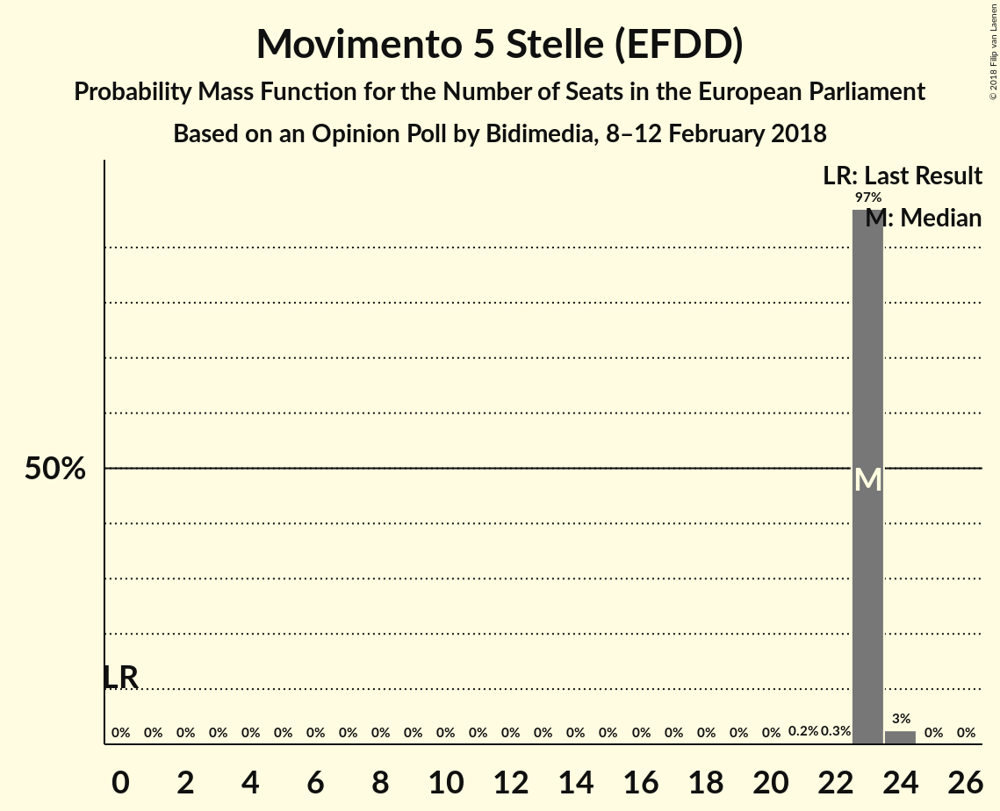

| Number of Seats | Probability | Accumulated | Special Marks |
|:---------------:|:-----------:|:-----------:|:-------------:|
| 17 | 0% | 100% | Last Result |
| 18 | 1.4% | 100% |  |
| 19 | 0.2% | 98.6% |  |
| 20 | 0.7% | 98% |  |
| 21 | 5% | 98% |  |
| 22 | 14% | 92% |  |
| 23 | 76% | 79% | Median |
| 24 | 2% | 2% |  |
| 25 | 0.6% | 0.7% |  |
| 26 | 0% | 0.1% |  |
| 27 | 0% | 0.1% |  |
| 28 | 0% | 0% |  |

### Partito Democratico (S&D)

*For a full overview of the results for this party, see the [Partito Democratico (S&D)](party-partitodemocraticosd.html) page.*

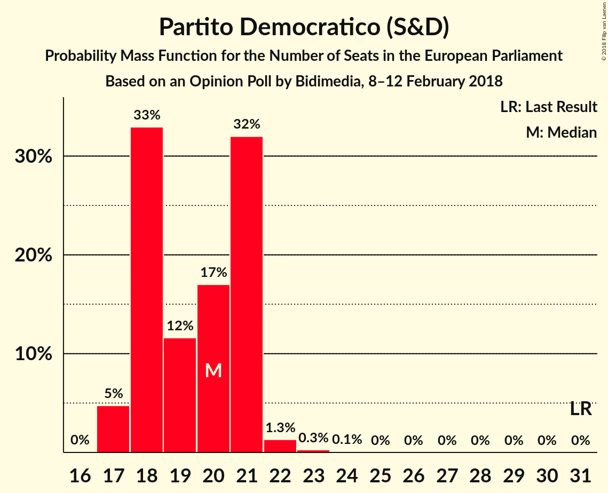

| Number of Seats | Probability | Accumulated | Special Marks |
|:---------------:|:-----------:|:-----------:|:-------------:|
| 17 | 0.1% | 100% |  |
| 18 | 2% | 99.9% |  |
| 19 | 16% | 98% |  |
| 20 | 9% | 82% |  |
| 21 | 71% | 73% | Median |
| 22 | 1.2% | 2% |  |
| 23 | 0.7% | 1.1% |  |
| 24 | 0.2% | 0.4% |  |
| 25 | 0.2% | 0.2% |  |
| 26 | 0% | 0% |  |
| 27 | 0% | 0% |  |
| 28 | 0% | 0% |  |
| 29 | 0% | 0% |  |
| 30 | 0% | 0% |  |
| 31 | 0% | 0% | Last Result |

### Forza Italia (EPP)

*For a full overview of the results for this party, see the [Forza Italia (EPP)](party-forzaitaliaepp.html) page.*

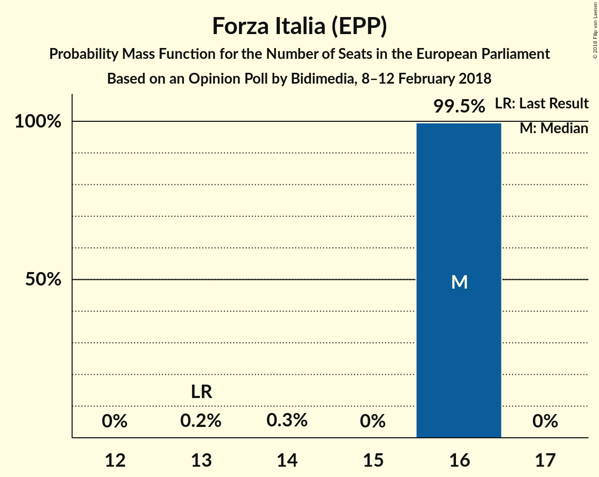

| Number of Seats | Probability | Accumulated | Special Marks |
|:---------------:|:-----------:|:-----------:|:-------------:|
| 11 | 0.1% | 100% |  |
| 12 | 2% | 99.9% |  |
| 13 | 10% | 97% | Last Result |
| 14 | 74% | 87% | Median |
| 15 | 6% | 13% |  |
| 16 | 7% | 7% |  |
| 17 | 0.3% | 0.6% |  |
| 18 | 0.2% | 0.2% |  |
| 19 | 0% | 0% |  |

### Lega Nord (ENF)

*For a full overview of the results for this party, see the [Lega Nord (ENF)](party-leganordenf.html) page.*

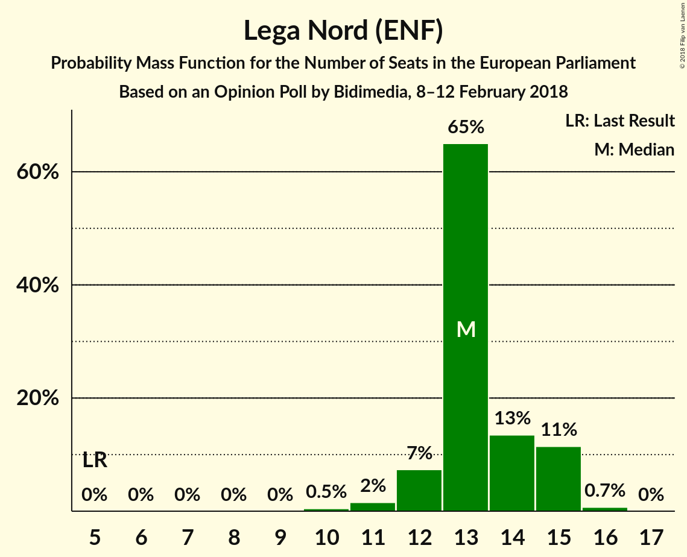

| Number of Seats | Probability | Accumulated | Special Marks |
|:---------------:|:-----------:|:-----------:|:-------------:|
| 5 | 0% | 100% | Last Result |
| 6 | 0% | 100% |  |
| 7 | 0% | 100% |  |
| 8 | 0% | 100% |  |
| 9 | 0% | 100% |  |
| 10 | 0.5% | 100% |  |
| 11 | 2% | 99.5% |  |
| 12 | 7% | 98% |  |
| 13 | 65% | 91% | Median |
| 14 | 13% | 26% |  |
| 15 | 11% | 12% |  |
| 16 | 0.7% | 0.7% |  |
| 17 | 0% | 0% |  |

### Liberi e Uguali (S&D)

*For a full overview of the results for this party, see the [Liberi e Uguali (S&D)](party-liberieugualisd.html) page.*

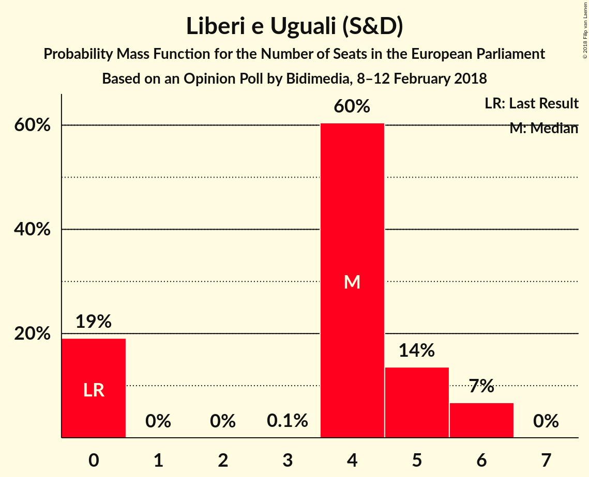

| Number of Seats | Probability | Accumulated | Special Marks |
|:---------------:|:-----------:|:-----------:|:-------------:|
| 0 | 16% | 100% | Last Result |
| 1 | 0% | 84% |  |
| 2 | 0% | 84% |  |
| 3 | 0.1% | 84% |  |
| 4 | 80% | 84% | Median |
| 5 | 4% | 4% |  |
| 6 | 0.5% | 0.5% |  |
| 7 | 0% | 0% |  |

### Fratelli d’Italia (*)

*For a full overview of the results for this party, see the [Fratelli d’Italia (*)](party-fratellid’italia.html) page.*

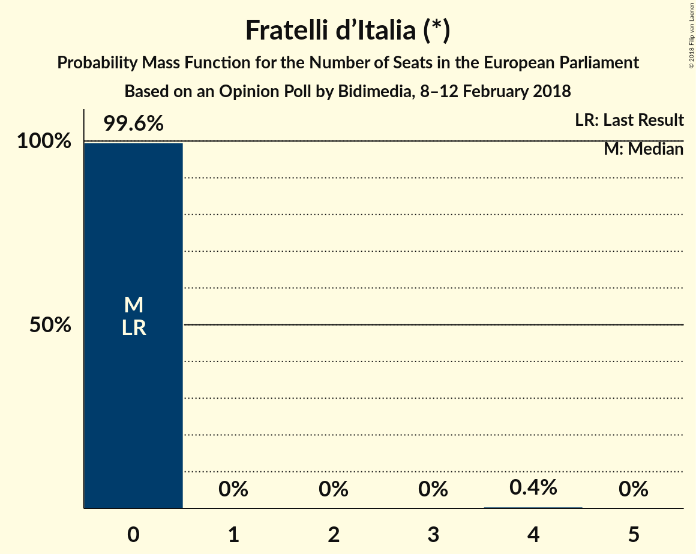

| Number of Seats | Probability | Accumulated | Special Marks |
|:---------------:|:-----------:|:-----------:|:-------------:|
| 0 | 75% | 100% | Last Result, Median |
| 1 | 0% | 25% |  |
| 2 | 0% | 25% |  |
| 3 | 1.4% | 25% |  |
| 4 | 24% | 24% |  |
| 5 | 0.4% | 0.4% |  |
| 6 | 0% | 0% |  |

### Noi con l’Italia (EPP)

*For a full overview of the results for this party, see the [Noi con l’Italia (EPP)](party-noiconl’italiaepp.html) page.*

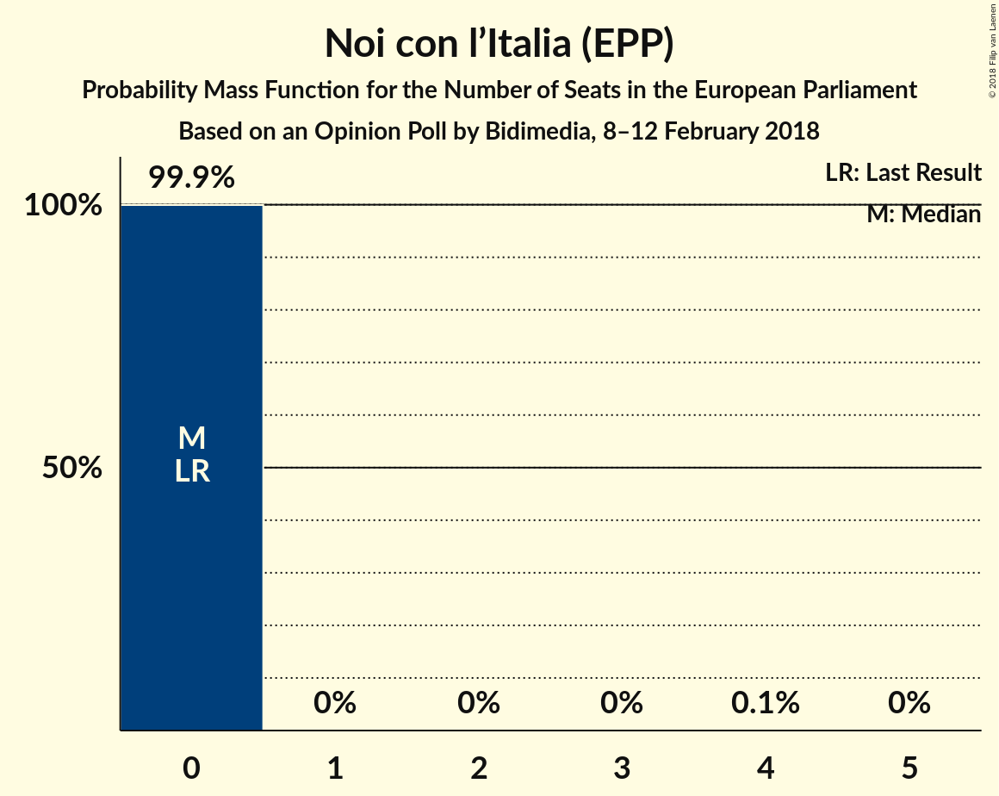

| Number of Seats | Probability | Accumulated | Special Marks |
|:---------------:|:-----------:|:-----------:|:-------------:|
| 0 | 99.9% | 100% | Last Result, Median |
| 1 | 0% | 0.1% |  |
| 2 | 0% | 0.1% |  |
| 3 | 0% | 0.1% |  |
| 4 | 0.1% | 0.1% |  |
| 5 | 0% | 0% |  |

### Più Europa (ALDE)

*For a full overview of the results for this party, see the [Più Europa (ALDE)](party-piùeuropaalde.html) page.*

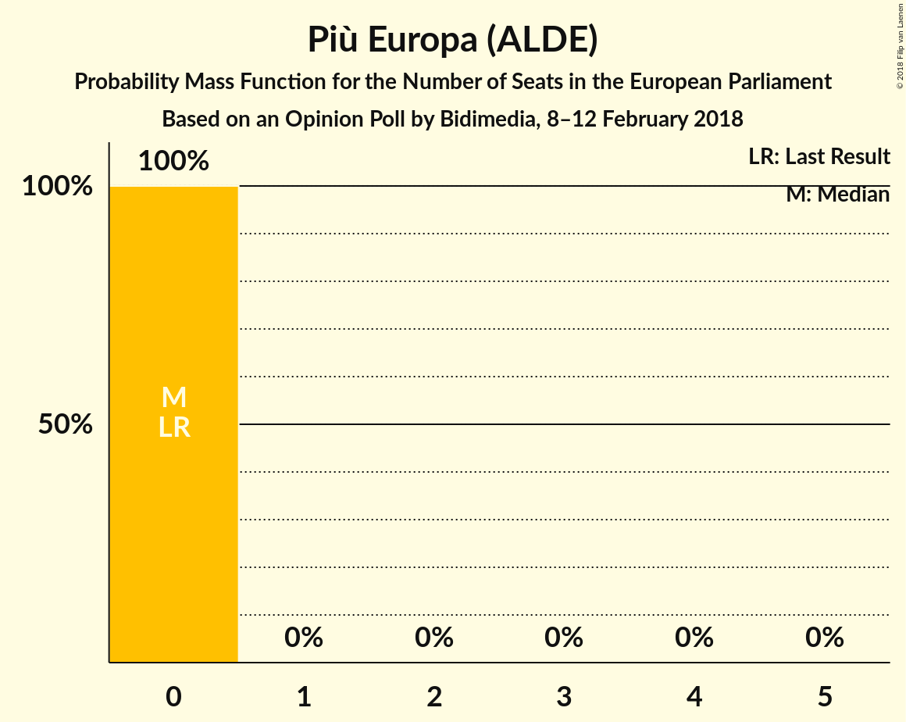

| Number of Seats | Probability | Accumulated | Special Marks |
|:---------------:|:-----------:|:-----------:|:-------------:|
| 0 | 100% | 100% | Last Result, Median |

### Civica Popolare (*)

*For a full overview of the results for this party, see the [Civica Popolare (*)](party-civicapopolare.html) page.*

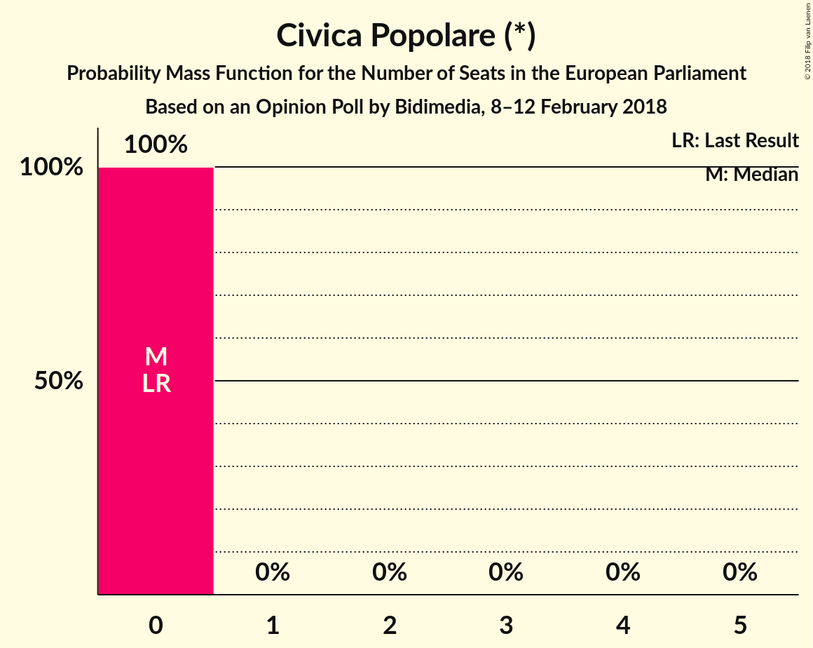

| Number of Seats | Probability | Accumulated | Special Marks |
|:---------------:|:-----------:|:-----------:|:-------------:|
| 0 | 100% | 100% | Last Result, Median |

### Potere al Popolo (GUE/NGL)

*For a full overview of the results for this party, see the [Potere al Popolo (GUE/NGL)](party-poterealpopologuengl.html) page.*

| Number of Seats | Probability | Accumulated | Special Marks |
|:---------------:|:-----------:|:-----------:|:-------------:|
| 0 | 100% | 100% | Last Result, Median |

### CasaPound Italia (*)

*For a full overview of the results for this party, see the [CasaPound Italia (*)](party-casapounditalia.html) page.*

| Number of Seats | Probability | Accumulated | Special Marks |
|:---------------:|:-----------:|:-----------:|:-------------:|
| 0 | 100% | 100% | Last Result, Median |

### Insieme (*)

*For a full overview of the results for this party, see the [Insieme (*)](party-insieme.html) page.*

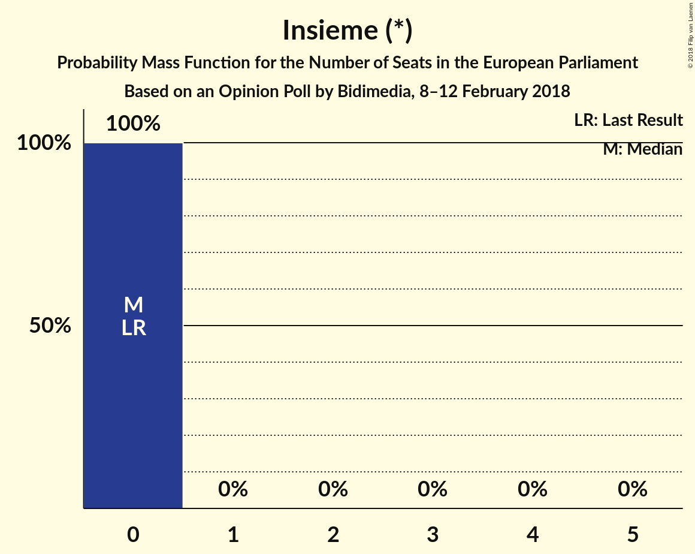

| Number of Seats | Probability | Accumulated | Special Marks |
|:---------------:|:-----------:|:-----------:|:-------------:|
| 0 | 100% | 100% | Last Result, Median |

## Coalitions

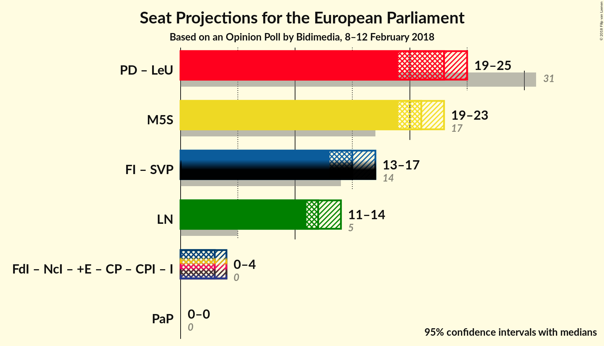

### Confidence Intervals

| Coalition | Last Result | Median | Majority? | 80% Confidence Interval | 90% Confidence Interval | 95% Confidence Interval | 99% Confidence Interval |
|:---------:|:-----------:|:------:|:---------:|:-----------------------:|:-----------------------:|:-----------------------:|:-----------------------:|
| Partito Democratico (S&D) – Liberi e Uguali (S&D) | 31 | 25 | 0% | 21–25 | 19–25 | 19–25 | 19–27 |
| Movimento 5 Stelle (EFDD) | 17 | 23 | 0% | 22–23 | 21–23 | 21–23 | 18–25 |
| Lega Nord (ENF) | 5 | 13 | 0% | 13–15 | 12–15 | 12–15 | 11–16 |
| Fratelli d’Italia (*) – Civica Popolare (*) – CasaPound Italia (*) – Insieme (*) | 0 | 0 | 0% | 0–4 | 0–4 | 0–4 | 0–4 |
| Più Europa (ALDE) | 0 | 0 | 0% | 0 | 0 | 0 | 0 |
| Potere al Popolo (GUE/NGL) | 0 | 0 | 0% | 0 | 0 | 0 | 0 |

### Partito Democratico (S&D) – Liberi e Uguali (S&D)

| Number of Seats | Probability | Accumulated | Special Marks |
|:---------------:|:-----------:|:-----------:|:-------------:|
| 19 | 9% | 100% |  |
| 20 | 0.1% | 91% |  |
| 21 | 6% | 91% |  |
| 22 | 3% | 85% |  |
| 23 | 6% | 83% |  |
| 24 | 9% | 77% |  |
| 25 | 66% | 68% | Median |
| 26 | 1.2% | 2% |  |
| 27 | 0.7% | 0.7% |  |
| 28 | 0% | 0% |  |
| 29 | 0% | 0% |  |
| 30 | 0% | 0% |  |
| 31 | 0% | 0% | Last Result |

### Movimento 5 Stelle (EFDD)

| Number of Seats | Probability | Accumulated | Special Marks |
|:---------------:|:-----------:|:-----------:|:-------------:|
| 17 | 0% | 100% | Last Result |
| 18 | 1.4% | 100% |  |
| 19 | 0.2% | 98.6% |  |
| 20 | 0.7% | 98% |  |
| 21 | 5% | 98% |  |
| 22 | 14% | 92% |  |
| 23 | 76% | 79% | Median |
| 24 | 2% | 2% |  |
| 25 | 0.6% | 0.7% |  |
| 26 | 0% | 0.1% |  |
| 27 | 0% | 0.1% |  |
| 28 | 0% | 0% |  |

### Lega Nord (ENF)

| Number of Seats | Probability | Accumulated | Special Marks |
|:---------------:|:-----------:|:-----------:|:-------------:|
| 5 | 0% | 100% | Last Result |
| 6 | 0% | 100% |  |
| 7 | 0% | 100% |  |
| 8 | 0% | 100% |  |
| 9 | 0% | 100% |  |
| 10 | 0.5% | 100% |  |
| 11 | 2% | 99.5% |  |
| 12 | 7% | 98% |  |
| 13 | 65% | 91% | Median |
| 14 | 13% | 26% |  |
| 15 | 11% | 12% |  |
| 16 | 0.7% | 0.7% |  |
| 17 | 0% | 0% |  |

### Fratelli d’Italia (*) – Civica Popolare (*) – CasaPound Italia (*) – Insieme (*)

| Number of Seats | Probability | Accumulated | Special Marks |
|:---------------:|:-----------:|:-----------:|:-------------:|
| 0 | 75% | 100% | Last Result, Median |
| 1 | 0% | 25% |  |
| 2 | 0% | 25% |  |
| 3 | 1.4% | 25% |  |
| 4 | 24% | 24% |  |
| 5 | 0.4% | 0.4% |  |
| 6 | 0% | 0% |  |

### Più Europa (ALDE)

| Number of Seats | Probability | Accumulated | Special Marks |
|:---------------:|:-----------:|:-----------:|:-------------:|
| 0 | 100% | 100% | Last Result, Median |

### Potere al Popolo (GUE/NGL)

| Number of Seats | Probability | Accumulated | Special Marks |
|:---------------:|:-----------:|:-----------:|:-------------:|
| 0 | 100% | 100% | Last Result, Median |

## Technical Information

### Opinion Poll

+ **Polling firm:** Bidimedia
+ **Commissioner(s):** —
+ **Fieldwork period:** 8–12 February 2018

### Calculations

+ **Sample size:** 1300
+ **Simulations done:** 131,072
+ **Error estimate:** 1.66%

