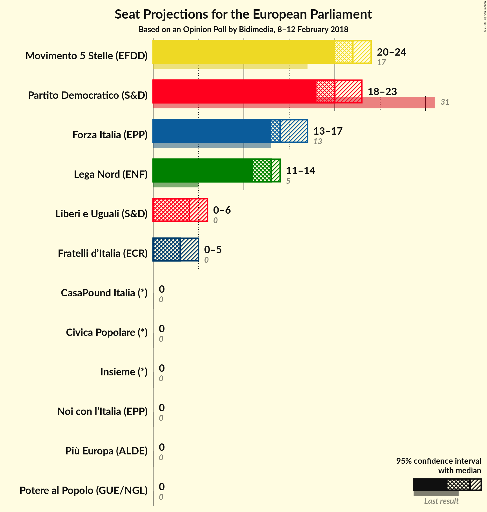

# Opinion Poll by Bidimedia, 8–12 February 2018

<a href="#voting-intentions">Voting Intentions</a> | <a href="#seats">Seats</a> | <a href="#coalitions">Coalitions</a> | <a href="#technical-information">Technical Information</a>

## Voting Intentions

### Confidence Intervals

| Party | Last Result | Poll Result | 80% Confidence Interval | 90% Confidence Interval | 95% Confidence Interval | 99% Confidence Interval |
|:-----:|:-----------:|:-----------:|:-----------------------:|:-----------------------:|:-----------------------:|:-----------------------:|
| Movimento 5 Stelle (EFDD) | 21.1% | 25.3% | 23.8–26.9% |23.4–27.4% |23.0–27.8% |22.3–28.5% |
| Partito Democratico (S&D) | 40.8% | 24.4% | 22.9–26.0% |22.5–26.4% |22.1–26.8% |21.4–27.6% |
| Forza Italia (EPP) | 16.8% | 16.3% | 15.0–17.7% |14.7–18.1% |14.4–18.4% |13.8–19.1% |
| Lega Nord (ENF) | 6.2% | 14.5% | 13.3–15.9% |13.0–16.2% |12.7–16.6% |12.2–17.2% |
| Liberi e Uguali (S&D) | 0.0% | 4.6% | 3.9–5.5% |3.7–5.7% |3.6–5.9% |3.3–6.3% |
| Fratelli d’Italia (*) | 3.7% | 3.9% | N/A |N/A |N/A |N/A |
| Noi con l’Italia (EPP) | 0.0% | 2.5% | N/A |N/A |N/A |N/A |
| Più Europa (ALDE) | 0.0% | 1.9% | N/A |N/A |N/A |N/A |
| Civica Popolare (*) | 0.0% | 1.4% | N/A |N/A |N/A |N/A |
| Potere al Popolo (GUE/NGL) | 0.0% | 1.2% | 0.9–1.7% |0.8–1.9% |0.8–2.0% |0.6–2.3% |
| CasaPound Italia (*) | 0.0% | 1.1% | N/A |N/A |N/A |N/A |
| Insieme (*) | 0.0% | 1.0% | N/A |N/A |N/A |N/A |

*Note:* The poll result column reflects the actual value used in the calculations. Published results may vary slightly, and in addition be rounded to fewer digits.

## Seats

### Confidence Intervals

| Party | Last Result | Median | 80% Confidence Interval | 90% Confidence Interval | 95% Confidence Interval | 99% Confidence Interval |
|:-----:|:-----------:|:------:|:-----------------------:|:-----------------------:|:-----------------------:|:-----------------------:|
| <a href="#movimento-5-stelle-(efdd)">Movimento 5 Stelle (EFDD)</a> | 17 | 22 | 21–24 |20–24 |20–24 |19–25 |
| <a href="#partito-democratico-(s&d)">Partito Democratico (S&D)</a> | 31 | 20 | 18–22 |18–23 |18–23 |17–23 |
| <a href="#forza-italia-(epp)">Forza Italia (EPP)</a> | 13 | 14 | 13–17 |13–17 |13–17 |12–17 |
| <a href="#lega-nord-(enf)">Lega Nord (ENF)</a> | 5 | 13 | 11–14 |11–14 |11–14 |10–15 |
| <a href="#liberi-e-uguali-(s&d)">Liberi e Uguali (S&D)</a> | 0 | 4 | 0–5 |0–6 |0–6 |0–6 |
| <a href="#fratelli-d’italia-(*)">Fratelli d’Italia (*)</a> | 0 | N/A | N/A |N/A |N/A |N/A |
| <a href="#noi-con-l’italia-(epp)">Noi con l’Italia (EPP)</a> | 0 | N/A | N/A |N/A |N/A |N/A |
| <a href="#più-europa-(alde)">Più Europa (ALDE)</a> | 0 | N/A | N/A |N/A |N/A |N/A |
| <a href="#civica-popolare-(*)">Civica Popolare (*)</a> | 0 | N/A | N/A |N/A |N/A |N/A |
| <a href="#potere-al-popolo-(gue/ngl)">Potere al Popolo (GUE/NGL)</a> | 0 | 0 | 0 |0 |0 |0 |
| <a href="#casapound-italia-(*)">CasaPound Italia (*)</a> | 0 | N/A | N/A |N/A |N/A |N/A |
| <a href="#insieme-(*)">Insieme (*)</a> | 0 | N/A | N/A |N/A |N/A |N/A |

