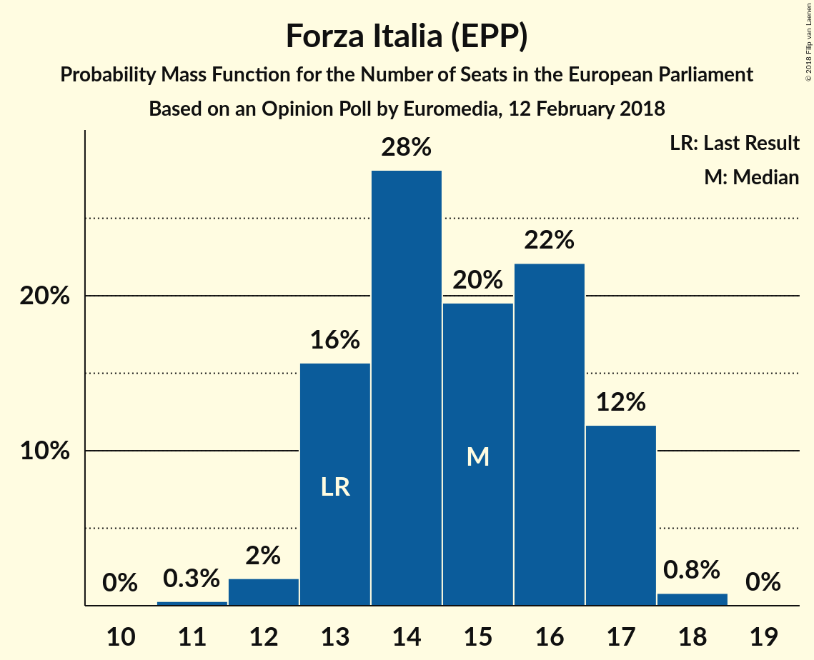
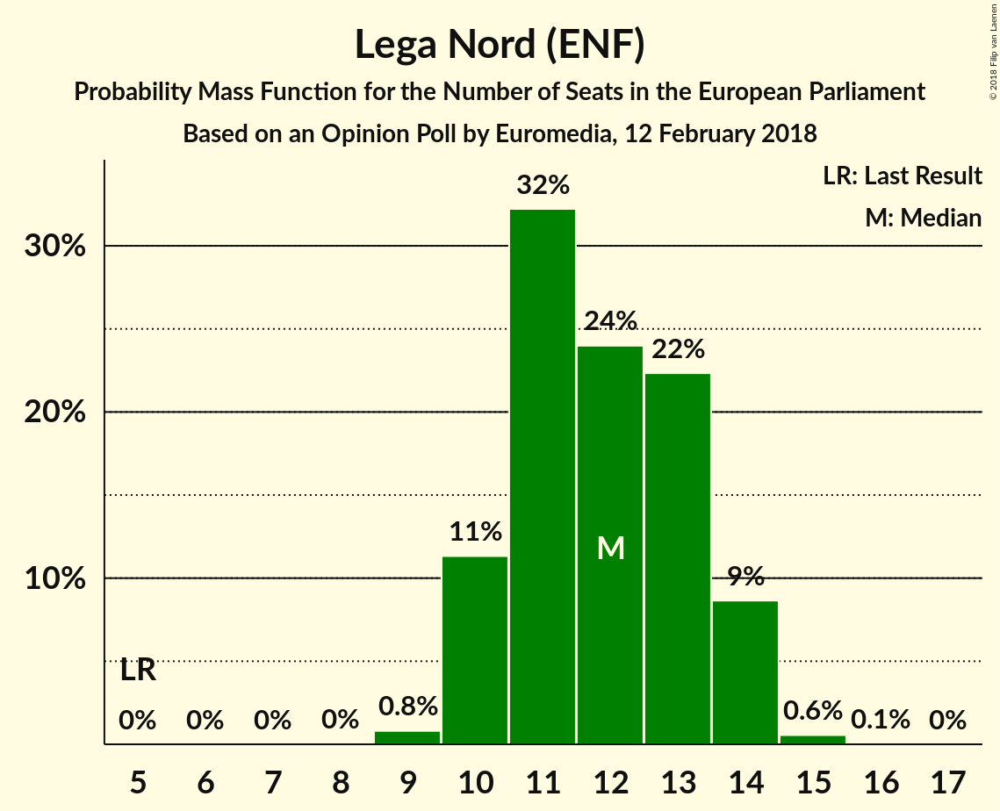

# Opinion Poll by Euromedia, 12 February 2018

<a href="#voting-intentions">Voting Intentions</a> | <a href="#seats">Seats</a> | <a href="#coalitions">Coalitions</a> | <a href="#technical-information">Technical Information</a>

## Voting Intentions

### Confidence Intervals

| Party | Last Result | Poll Result | 80% Confidence Interval | 90% Confidence Interval | 95% Confidence Interval | 99% Confidence Interval |
|:-----:|:-----------:|:-----------:|:-----------------------:|:-----------------------:|:-----------------------:|:-----------------------:|
| Movimento 5 Stelle (EFDD) | 21.2% | 27.0% | 25.1–29.1% |24.5–29.7% |24.0–30.2% |23.1–31.2% |
| Partito Democratico (S&D) | 40.8% | 22.4% | 20.6–24.4% |20.1–24.9% |19.6–25.4% |18.8–26.4% |
| Forza Italia (EPP) | 16.8% | 17.5% | 15.9–19.3% |15.4–19.8% |15.0–20.3% |14.3–21.2% |
| Lega Nord (ENF) | 6.2% | 14.1% | 12.7–15.8% |12.2–16.3% |11.9–16.7% |11.2–17.6% |
| Liberi e Uguali (S&D) | 0.0% | 6.1% | 5.2–7.4% |4.9–7.7% |4.7–8.0% |4.2–8.6% |
| Fratelli d’Italia (*) | 3.7% | 4.8% | 3.9–5.9% |3.7–6.2% |3.5–6.5% |3.1–7.0% |
| Noi con l’Italia (EPP) | 0.0% | 2.2% | 1.7–3.1% |1.6–3.3% |1.4–3.5% |1.2–4.0% |
| Più Europa (ALDE) | 0.0% | 2.0% | 1.5–2.8% |1.4–3.0% |1.2–3.2% |1.0–3.7% |
| Insieme (*) | 0.0% | 0.8% | 0.5–1.3% |0.4–1.5% |0.4–1.6% |0.2–2.0% |
| CasaPound Italia (*) | 0.0% | 0.8% | 0.5–1.3% |0.4–1.5% |0.4–1.6% |0.2–2.0% |
| Civica Popolare (*) | 0.0% | 0.5% | 0.3–1.0% |0.2–1.1% |0.2–1.3% |0.1–1.6% |

*Note:* The poll result column reflects the actual value used in the calculations. Published results may vary slightly, and in addition be rounded to fewer digits.

## Seats

### Confidence Intervals

| Party | Last Result | Median | 80% Confidence Interval | 90% Confidence Interval | 95% Confidence Interval | 99% Confidence Interval |
|:-----:|:-----------:|:------:|:-----------------------:|:-----------------------:|:-----------------------:|:-----------------------:|
| <a href="#movimento-5-stelle-(efdd)">Movimento 5 Stelle (EFDD)</a> | 17 | 22 | 20–24 |20–24 |20–25 |19–26 |
| <a href="#partito-democratico-(s&d)">Partito Democratico (S&D)</a> | 31 | 17 | 16–20 |15–20 |15–20 |15–21 |
| <a href="#forza-italia-(epp)">Forza Italia (EPP)</a> | 13 | 15 | 13–17 |13–17 |13–17 |12–18 |
| <a href="#lega-nord-(enf)">Lega Nord (ENF)</a> | 5 | 12 | 10–13 |10–14 |10–14 |9–15 |
| <a href="#liberi-e-uguali-(s&d)">Liberi e Uguali (S&D)</a> | 0 | 5 | 4–6 |4–6 |4–7 |3–7 |
| <a href="#fratelli-d’italia-(*)">Fratelli d’Italia (*)</a> | 0 | 4 | 0–5 |0–5 |0–5 |0–6 |
| <a href="#noi-con-l’italia-(epp)">Noi con l’Italia (EPP)</a> | 0 | 0 | 0 |0 |0 |0–3 |
| <a href="#più-europa-(alde)">Più Europa (ALDE)</a> | 0 | 0 | 0 |0 |0 |0 |
| <a href="#insieme-(*)">Insieme (*)</a> | 0 | 0 | 0 |0 |0 |0 |
| <a href="#casapound-italia-(*)">CasaPound Italia (*)</a> | 0 | 0 | 0 |0 |0 |0 |
| <a href="#civica-popolare-(*)">Civica Popolare (*)</a> | 0 | 0 | 0 |0 |0 |0 |

### Movimento 5 Stelle (EFDD)

*For a full overview of the results for this party, see the [Movimento 5 Stelle (EFDD)](party-movimento5stelleefdd.html) page.*

| Number of Seats | Probability | Accumulated | Special Marks |
|:---------------:|:-----------:|:-----------:|:-------------:|
| 17 | 0% | 100% | Last Result |
| 18 | 0.1% | 100% |  |
| 19 | 0.9% | 99.9% |  |
| 20 | 9% | 99.0% |  |
| 21 | 17% | 90% |  |
| 22 | 26% | 73% | Median |
| 23 | 22% | 46% |  |
| 24 | 20% | 24% |  |
| 25 | 3% | 4% |  |
| 26 | 0.4% | 0.6% |  |
| 27 | 0.2% | 0.2% |  |
| 28 | 0% | 0% |  |

### Partito Democratico (S&D)

*For a full overview of the results for this party, see the [Partito Democratico (S&D)](party-partitodemocraticosd.html) page.*

| Number of Seats | Probability | Accumulated | Special Marks |
|:---------------:|:-----------:|:-----------:|:-------------:|
| 14 | 0.4% | 100% |  |
| 15 | 5% | 99.6% |  |
| 16 | 27% | 94% |  |
| 17 | 21% | 68% | Median |
| 18 | 21% | 47% |  |
| 19 | 14% | 26% |  |
| 20 | 11% | 11% |  |
| 21 | 0.5% | 0.6% |  |
| 22 | 0.1% | 0.1% |  |
| 23 | 0% | 0% |  |
| 24 | 0% | 0% |  |
| 25 | 0% | 0% |  |
| 26 | 0% | 0% |  |
| 27 | 0% | 0% |  |
| 28 | 0% | 0% |  |
| 29 | 0% | 0% |  |
| 30 | 0% | 0% |  |
| 31 | 0% | 0% | Last Result |

### Forza Italia (EPP)

*For a full overview of the results for this party, see the [Forza Italia (EPP)](party-forzaitaliaepp.html) page.*

| Number of Seats | Probability | Accumulated | Special Marks |
|:---------------:|:-----------:|:-----------:|:-------------:|
| 11 | 0.3% | 100% |  |
| 12 | 2% | 99.7% |  |
| 13 | 16% | 98% | Last Result |
| 14 | 28% | 82% |  |
| 15 | 20% | 54% | Median |
| 16 | 22% | 35% |  |
| 17 | 12% | 13% |  |
| 18 | 0.8% | 0.8% |  |
| 19 | 0% | 0% |  |

### Lega Nord (ENF)

*For a full overview of the results for this party, see the [Lega Nord (ENF)](party-leganordenf.html) page.*

| Number of Seats | Probability | Accumulated | Special Marks |
|:---------------:|:-----------:|:-----------:|:-------------:|
| 5 | 0% | 100% | Last Result |
| 6 | 0% | 100% |  |
| 7 | 0% | 100% |  |
| 8 | 0% | 100% |  |
| 9 | 0.8% | 100% |  |
| 10 | 11% | 99.1% |  |
| 11 | 32% | 88% |  |
| 12 | 24% | 56% | Median |
| 13 | 22% | 32% |  |
| 14 | 9% | 9% |  |
| 15 | 0.6% | 0.6% |  |
| 16 | 0.1% | 0.1% |  |
| 17 | 0% | 0% |  |

### Liberi e Uguali (S&D)

*For a full overview of the results for this party, see the [Liberi e Uguali (S&D)](party-liberieugualisd.html) page.*

| Number of Seats | Probability | Accumulated | Special Marks |
|:---------------:|:-----------:|:-----------:|:-------------:|
| 0 | 0.2% | 100% | Last Result |
| 1 | 0% | 99.8% |  |
| 2 | 0% | 99.8% |  |
| 3 | 2% | 99.8% |  |
| 4 | 19% | 98% |  |
| 5 | 53% | 79% | Median |
| 6 | 22% | 27% |  |
| 7 | 4% | 4% |  |
| 8 | 0.2% | 0.2% |  |
| 9 | 0% | 0% |  |

### Fratelli d’Italia (*)

*For a full overview of the results for this party, see the [Fratelli d’Italia (*)](party-fratellid’italia.html) page.*

| Number of Seats | Probability | Accumulated | Special Marks |
|:---------------:|:-----------:|:-----------:|:-------------:|
| 0 | 18% | 100% | Last Result |
| 1 | 0% | 82% |  |
| 2 | 0% | 82% |  |
| 3 | 13% | 82% |  |
| 4 | 42% | 68% | Median |
| 5 | 25% | 26% |  |
| 6 | 0.9% | 0.9% |  |
| 7 | 0% | 0% |  |

### Noi con l’Italia (EPP)

*For a full overview of the results for this party, see the [Noi con l’Italia (EPP)](party-noiconl’italiaepp.html) page.*

| Number of Seats | Probability | Accumulated | Special Marks |
|:---------------:|:-----------:|:-----------:|:-------------:|
| 0 | 99.2% | 100% | Last Result, Median |
| 1 | 0% | 0.8% |  |
| 2 | 0% | 0.8% |  |
| 3 | 0.5% | 0.8% |  |
| 4 | 0.2% | 0.2% |  |
| 5 | 0% | 0% |  |

### Più Europa (ALDE)

*For a full overview of the results for this party, see the [Più Europa (ALDE)](party-piùeuropaalde.html) page.*

| Number of Seats | Probability | Accumulated | Special Marks |
|:---------------:|:-----------:|:-----------:|:-------------:|
| 0 | 99.9% | 100% | Last Result, Median |
| 1 | 0% | 0.1% |  |
| 2 | 0% | 0.1% |  |
| 3 | 0.1% | 0.1% |  |
| 4 | 0% | 0% |  |

### Insieme (*)

*For a full overview of the results for this party, see the [Insieme (*)](party-insieme.html) page.*

| Number of Seats | Probability | Accumulated | Special Marks |
|:---------------:|:-----------:|:-----------:|:-------------:|
| 0 | 100% | 100% | Last Result, Median |

### CasaPound Italia (*)

*For a full overview of the results for this party, see the [CasaPound Italia (*)](party-casapounditalia.html) page.*

| Number of Seats | Probability | Accumulated | Special Marks |
|:---------------:|:-----------:|:-----------:|:-------------:|
| 0 | 100% | 100% | Last Result, Median |

### Civica Popolare (*)

*For a full overview of the results for this party, see the [Civica Popolare (*)](party-civicapopolare.html) page.*

| Number of Seats | Probability | Accumulated | Special Marks |
|:---------------:|:-----------:|:-----------:|:-------------:|
| 0 | 100% | 100% | Last Result, Median |

## Coalitions

### Confidence Intervals

| Coalition | Last Result | Median | Majority? | 80% Confidence Interval | 90% Confidence Interval | 95% Confidence Interval | 99% Confidence Interval |
|:---------:|:-----------:|:------:|:---------:|:-----------------------:|:-----------------------:|:-----------------------:|:-----------------------:|
| Partito Democratico (S&D) – Liberi e Uguali (S&D) | 31 | 23 | 0% | 20–25 | 20–25 | 20–26 | 20–26 |
| Movimento 5 Stelle (EFDD) | 17 | 22 | 0% | 20–24 | 20–24 | 20–25 | 19–26 |
| Lega Nord (ENF) | 5 | 12 | 0% | 10–13 | 10–14 | 10–14 | 9–15 |
| Fratelli d’Italia (*) – CasaPound Italia (*) – Insieme (*) – Civica Popolare (*) | 0 | 4 | 0% | 0–5 | 0–5 | 0–5 | 0–6 |
| Più Europa (ALDE) | 0 | 0 | 0% | 0 | 0 | 0 | 0 |

### Partito Democratico (S&D) – Liberi e Uguali (S&D)

| Number of Seats | Probability | Accumulated | Special Marks |
|:---------------:|:-----------:|:-----------:|:-------------:|
| 18 | 0.2% | 100% |  |
| 19 | 0.3% | 99.8% |  |
| 20 | 13% | 99.5% |  |
| 21 | 15% | 87% |  |
| 22 | 22% | 72% | Median |
| 23 | 19% | 50% |  |
| 24 | 21% | 31% |  |
| 25 | 7% | 11% |  |
| 26 | 3% | 4% |  |
| 27 | 0.1% | 0.2% |  |
| 28 | 0.1% | 0.1% |  |
| 29 | 0% | 0% |  |
| 30 | 0% | 0% |  |
| 31 | 0% | 0% | Last Result |

### Movimento 5 Stelle (EFDD)

| Number of Seats | Probability | Accumulated | Special Marks |
|:---------------:|:-----------:|:-----------:|:-------------:|
| 17 | 0% | 100% | Last Result |
| 18 | 0.1% | 100% |  |
| 19 | 0.9% | 99.9% |  |
| 20 | 9% | 99.0% |  |
| 21 | 17% | 90% |  |
| 22 | 26% | 73% | Median |
| 23 | 22% | 46% |  |
| 24 | 20% | 24% |  |
| 25 | 3% | 4% |  |
| 26 | 0.4% | 0.6% |  |
| 27 | 0.2% | 0.2% |  |
| 28 | 0% | 0% |  |

### Lega Nord (ENF)

| Number of Seats | Probability | Accumulated | Special Marks |
|:---------------:|:-----------:|:-----------:|:-------------:|
| 5 | 0% | 100% | Last Result |
| 6 | 0% | 100% |  |
| 7 | 0% | 100% |  |
| 8 | 0% | 100% |  |
| 9 | 0.8% | 100% |  |
| 10 | 11% | 99.1% |  |
| 11 | 32% | 88% |  |
| 12 | 24% | 56% | Median |
| 13 | 22% | 32% |  |
| 14 | 9% | 9% |  |
| 15 | 0.6% | 0.6% |  |
| 16 | 0.1% | 0.1% |  |
| 17 | 0% | 0% |  |

### Fratelli d’Italia (*) – CasaPound Italia (*) – Insieme (*) – Civica Popolare (*)

| Number of Seats | Probability | Accumulated | Special Marks |
|:---------------:|:-----------:|:-----------:|:-------------:|
| 0 | 18% | 100% | Last Result |
| 1 | 0% | 82% |  |
| 2 | 0% | 82% |  |
| 3 | 13% | 82% |  |
| 4 | 42% | 68% | Median |
| 5 | 25% | 26% |  |
| 6 | 0.9% | 0.9% |  |
| 7 | 0% | 0% |  |

### Più Europa (ALDE)

| Number of Seats | Probability | Accumulated | Special Marks |
|:---------------:|:-----------:|:-----------:|:-------------:|
| 0 | 99.9% | 100% | Last Result, Median |
| 1 | 0% | 0.1% |  |
| 2 | 0% | 0.1% |  |
| 3 | 0.1% | 0.1% |  |
| 4 | 0% | 0% |  |

## Technical Information

### Opinion Poll

+ **Polling firm:** Euromedia
+ **Commissioner(s):** —
+ **Fieldwork period:** 12 February 2018

### Calculations

+ **Sample size:** 800
+ **Simulations done:** 1,048,576
+ **Error estimate:** 5.73%

