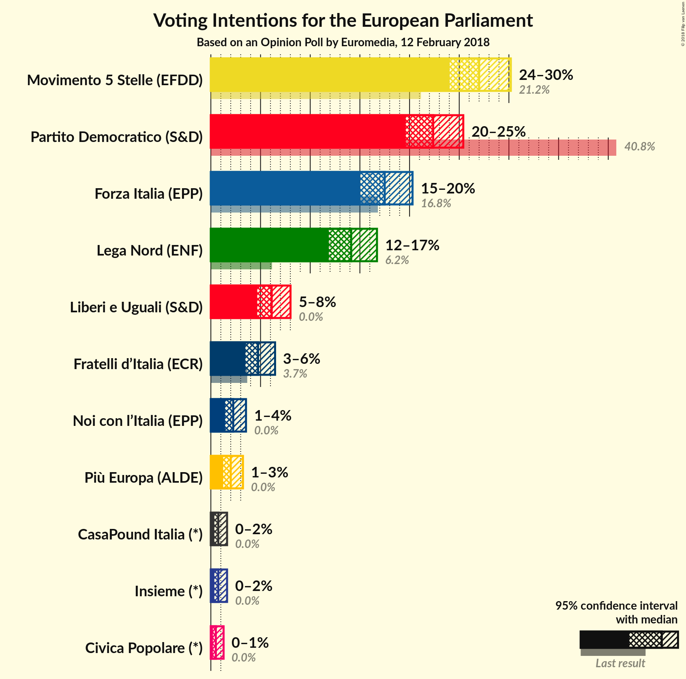
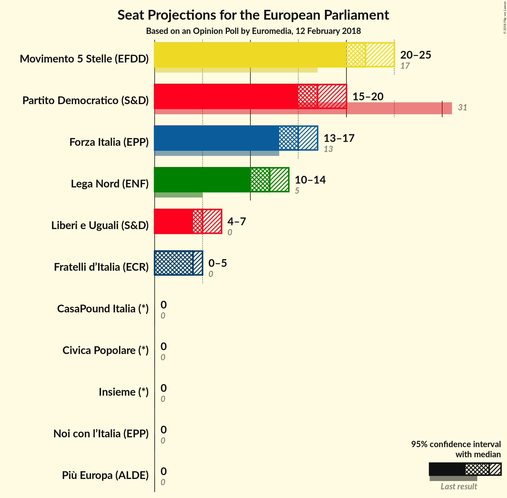

# Opinion Poll by Euromedia, 12 February 2018

<a href="#voting-intentions">Voting Intentions</a> | <a href="#seats">Seats</a> | <a href="#coalitions">Coalitions</a> | <a href="#technical-information">Technical Information</a>

## Voting Intentions

### Confidence Intervals

| Party | Last Result | Poll Result | 80% Confidence Interval | 90% Confidence Interval | 95% Confidence Interval | 99% Confidence Interval |
|:-----:|:-----------:|:-----------:|:-----------------------:|:-----------------------:|:-----------------------:|:-----------------------:|
| Movimento 5 Stelle (EFDD) | 21.1% | 27.0% | 25.1–29.1% |24.5–29.7% |24.0–30.2% |23.1–31.2% |
| Partito Democratico (S&D) | 40.8% | 22.4% | 20.6–24.4% |20.1–24.9% |19.6–25.4% |18.8–26.4% |
| Forza Italia (EPP) | 16.8% | 17.5% | 15.9–19.3% |15.4–19.8% |15.0–20.3% |14.3–21.2% |
| Lega Nord (ENF) | 6.2% | 14.1% | 12.7–15.8% |12.2–16.3% |11.9–16.7% |11.2–17.6% |
| Liberi e Uguali (S&D) | 0.0% | 6.1% | 5.2–7.4% |4.9–7.7% |4.7–8.0% |4.2–8.6% |
| Fratelli d’Italia (*) | 3.7% | 4.8% | N/A |N/A |N/A |N/A |
| Noi con l’Italia (EPP) | 0.0% | 2.2% | N/A |N/A |N/A |N/A |
| Più Europa (ALDE) | 0.0% | 2.0% | N/A |N/A |N/A |N/A |
| Insieme (*) | 0.0% | 0.8% | N/A |N/A |N/A |N/A |
| CasaPound Italia (*) | 0.0% | 0.8% | N/A |N/A |N/A |N/A |
| Civica Popolare (*) | 0.0% | 0.5% | N/A |N/A |N/A |N/A |

*Note:* The poll result column reflects the actual value used in the calculations. Published results may vary slightly, and in addition be rounded to fewer digits.

## Seats

### Confidence Intervals

| Party | Last Result | Median | 80% Confidence Interval | 90% Confidence Interval | 95% Confidence Interval | 99% Confidence Interval |
|:-----:|:-----------:|:------:|:-----------------------:|:-----------------------:|:-----------------------:|:-----------------------:|
| <a href="#movimento-5-stelle-(efdd)">Movimento 5 Stelle (EFDD)</a> | 17 | 22 | 20–24 |20–25 |20–25 |19–25 |
| <a href="#partito-democratico-(s&d)">Partito Democratico (S&D)</a> | 31 | 18 | 16–20 |16–20 |15–20 |15–21 |
| <a href="#forza-italia-(epp)">Forza Italia (EPP)</a> | 13 | 15 | 13–17 |13–17 |13–17 |12–18 |
| <a href="#lega-nord-(enf)">Lega Nord (ENF)</a> | 5 | 12 | 10–14 |10–14 |10–14 |9–15 |
| <a href="#liberi-e-uguali-(s&d)">Liberi e Uguali (S&D)</a> | 0 | 5 | 4–6 |4–6 |3–7 |3–7 |
| <a href="#fratelli-d’italia-(*)">Fratelli d’Italia (*)</a> | 0 | N/A | N/A |N/A |N/A |N/A |
| <a href="#noi-con-l’italia-(epp)">Noi con l’Italia (EPP)</a> | 0 | N/A | N/A |N/A |N/A |N/A |
| <a href="#più-europa-(alde)">Più Europa (ALDE)</a> | 0 | N/A | N/A |N/A |N/A |N/A |
| <a href="#insieme-(*)">Insieme (*)</a> | 0 | N/A | N/A |N/A |N/A |N/A |
| <a href="#casapound-italia-(*)">CasaPound Italia (*)</a> | 0 | N/A | N/A |N/A |N/A |N/A |
| <a href="#civica-popolare-(*)">Civica Popolare (*)</a> | 0 | N/A | N/A |N/A |N/A |N/A |

