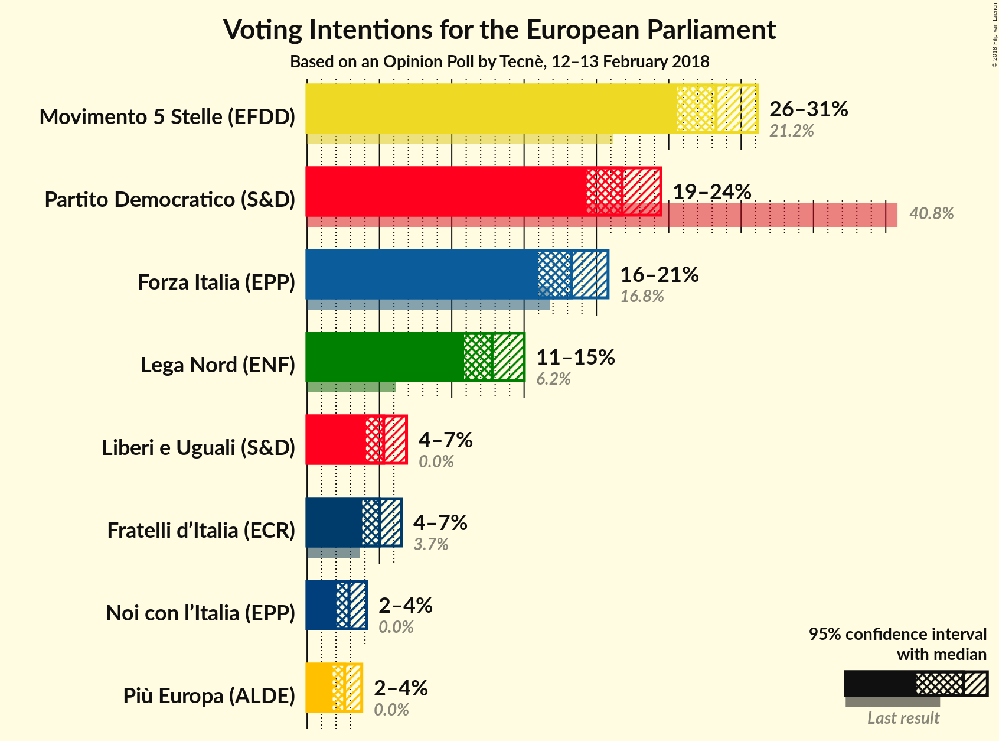
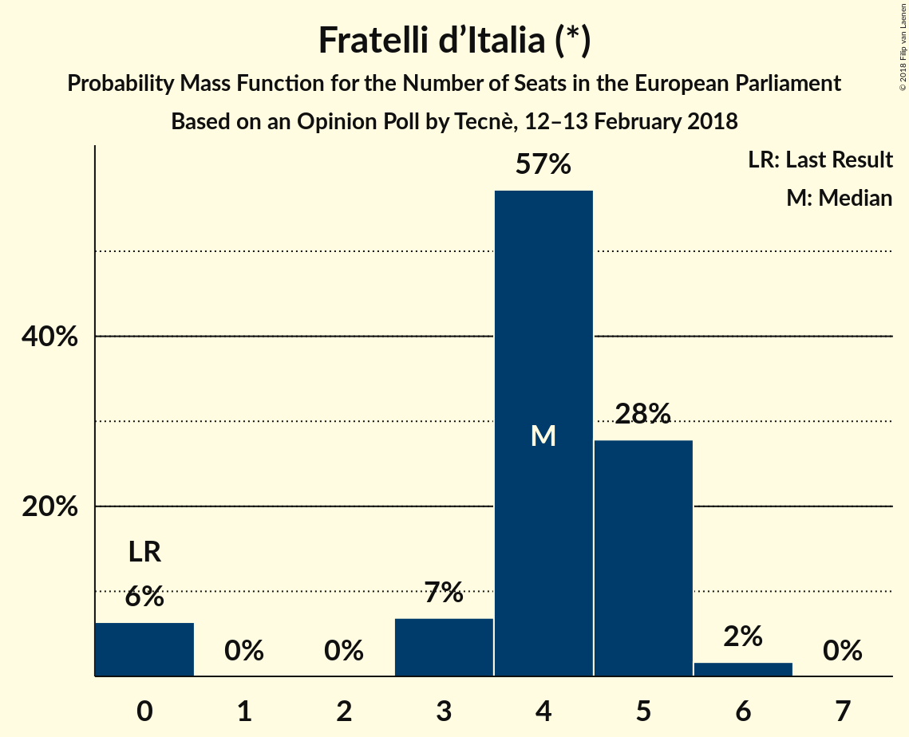
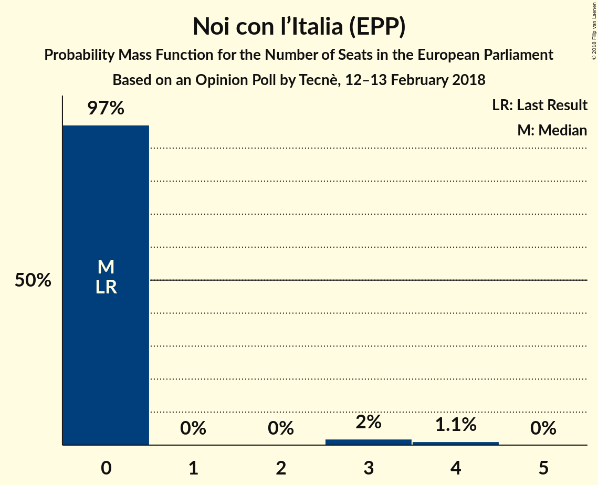
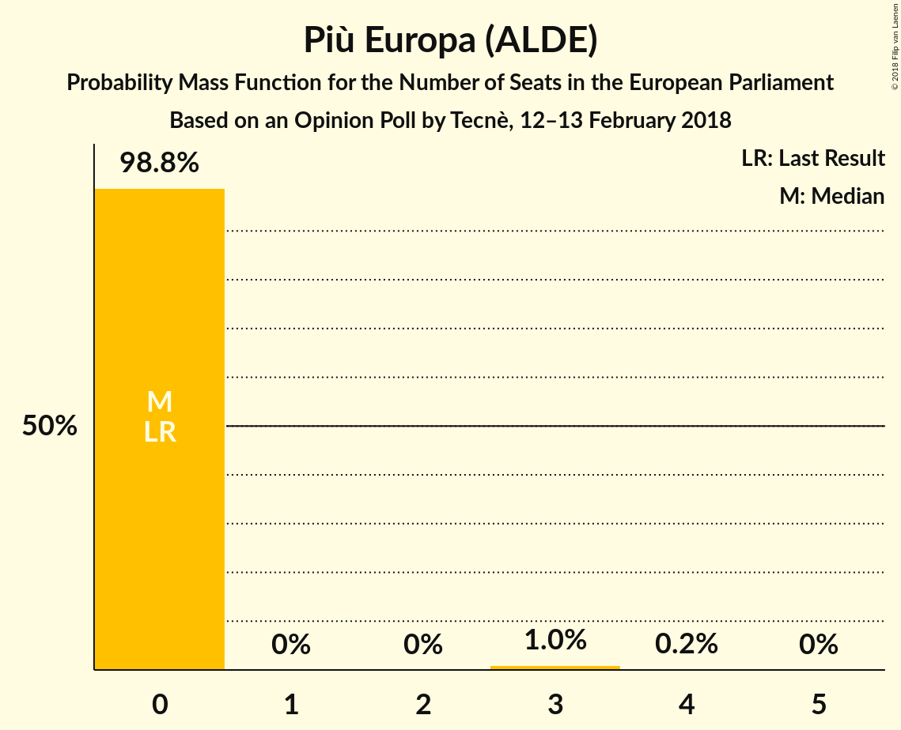

# Opinion Poll by Tecnè, 12–13 February 2018

<a href="#voting-intentions">Voting Intentions</a> | <a href="#seats">Seats</a> | <a href="#coalitions">Coalitions</a> | <a href="#technical-information">Technical Information</a>

## Voting Intentions

### Confidence Intervals

| Party | Last Result | Poll Result | 80% Confidence Interval | 90% Confidence Interval | 95% Confidence Interval | 99% Confidence Interval |
|:-----:|:-----------:|:-----------:|:-----------------------:|:-----------------------:|:-----------------------:|:-----------------------:|
| Movimento 5 Stelle (EFDD) | 21.1% | 28.3% | 26.5–30.1% |26.0–30.7% |25.6–31.2% |24.7–32.1% |
| Partito Democratico (S&D) | 40.8% | 21.8% | 20.2–23.5% |19.7–24.0% |19.3–24.4% |18.6–25.3% |
| Forza Italia (EPP) | 16.8% | 18.3% | 16.8–19.9% |16.4–20.4% |16.0–20.8% |15.3–21.6% |
| Lega Nord (ENF) | 6.2% | 12.8% | 11.5–14.2% |11.2–14.6% |10.9–15.0% |10.3–15.7% |
| Liberi e Uguali (S&D) | 0.0% | 5.3% | 4.5–6.3% |4.3–6.6% |4.1–6.9% |3.7–7.4% |
| Fratelli d’Italia (*) | 3.7% | 5.0% | 4.2–6.0% |4.0–6.3% |3.8–6.5% |3.5–7.0% |
| Noi con l’Italia (EPP) | 0.0% | 2.9% | 2.3–3.7% |2.1–3.9% |2.0–4.1% |1.8–4.6% |
| Più Europa (ALDE) | 0.0% | 2.6% | 2.1–3.4% |1.9–3.6% |1.8–3.8% |1.5–4.2% |

*Note:* The poll result column reflects the actual value used in the calculations. Published results may vary slightly, and in addition be rounded to fewer digits.

## Seats

### Confidence Intervals

| Party | Last Result | Median | 80% Confidence Interval | 90% Confidence Interval | 95% Confidence Interval | 99% Confidence Interval |
|:-----:|:-----------:|:------:|:-----------------------:|:-----------------------:|:-----------------------:|:-----------------------:|
| <a href="#movimento-5-stelle-(efdd)">Movimento 5 Stelle (EFDD)</a> | 17 | 21 | 21–24 |21–24 |21–24 |20–27 |
| <a href="#partito-democratico-(s&d)">Partito Democratico (S&D)</a> | 31 | 18 | 18–20 |17–20 |17–20 |15–20 |
| <a href="#forza-italia-(epp)">Forza Italia (EPP)</a> | 13 | 18 | 12–18 |12–18 |12–18 |12–19 |
| <a href="#lega-nord-(enf)">Lega Nord (ENF)</a> | 5 | 11 | 10–12 |10–12 |9–14 |9–14 |
| <a href="#liberi-e-uguali-(s&d)">Liberi e Uguali (S&D)</a> | 0 | 4 | 4–5 |4–5 |3–5 |0–5 |
| <a href="#fratelli-d’italia-(*)">Fratelli d’Italia (*)</a> | 0 | 3 | 3–4 |3–4 |3–5 |3–5 |
| <a href="#noi-con-l’italia-(epp)">Noi con l’Italia (EPP)</a> | 0 | 0 | 0 |0 |0–4 |0–4 |
| <a href="#più-europa-(alde)">Più Europa (ALDE)</a> | 0 | 0 | 0 |0 |0 |0 |

### Movimento 5 Stelle (EFDD)

*For a full overview of the results for this party, see the [Movimento 5 Stelle (EFDD)](party-movimento5stelleefdd.html) page.*

| Number of Seats | Probability | Accumulated | Special Marks |
|:---------------:|:-----------:|:-----------:|:-------------:|
| 17 | 0% | 100% | Last Result |
| 18 | 0% | 100% |  |
| 19 | 0% | 100% |  |
| 20 | 2% | 100% |  |
| 21 | 72% | 98% | Median |
| 22 | 3% | 26% |  |
| 23 | 5% | 23% |  |
| 24 | 16% | 18% |  |
| 25 | 0.5% | 2% |  |
| 26 | 0% | 1.3% |  |
| 27 | 1.3% | 1.3% |  |
| 28 | 0% | 0% |  |

### Partito Democratico (S&D)

*For a full overview of the results for this party, see the [Partito Democratico (S&D)](party-partitodemocraticosd.html) page.*

| Number of Seats | Probability | Accumulated | Special Marks |
|:---------------:|:-----------:|:-----------:|:-------------:|
| 14 | 0.1% | 100% |  |
| 15 | 0.5% | 99.9% |  |
| 16 | 1.3% | 99.5% |  |
| 17 | 8% | 98% |  |
| 18 | 76% | 90% | Median |
| 19 | 0.4% | 14% |  |
| 20 | 14% | 14% |  |
| 21 | 0% | 0% |  |
| 22 | 0% | 0% |  |
| 23 | 0% | 0% |  |
| 24 | 0% | 0% |  |
| 25 | 0% | 0% |  |
| 26 | 0% | 0% |  |
| 27 | 0% | 0% |  |
| 28 | 0% | 0% |  |
| 29 | 0% | 0% |  |
| 30 | 0% | 0% |  |
| 31 | 0% | 0% | Last Result |

### Forza Italia (EPP)

*For a full overview of the results for this party, see the [Forza Italia (EPP)](party-forzaitaliaepp.html) page.*

| Number of Seats | Probability | Accumulated | Special Marks |
|:---------------:|:-----------:|:-----------:|:-------------:|
| 12 | 15% | 100% |  |
| 13 | 14% | 85% | Last Result |
| 14 | 3% | 71% |  |
| 15 | 8% | 68% |  |
| 16 | 1.4% | 60% |  |
| 17 | 0.3% | 59% |  |
| 18 | 57% | 59% | Median |
| 19 | 2% | 2% |  |
| 20 | 0% | 0% |  |

### Lega Nord (ENF)

*For a full overview of the results for this party, see the [Lega Nord (ENF)](party-leganordenf.html) page.*

| Number of Seats | Probability | Accumulated | Special Marks |
|:---------------:|:-----------:|:-----------:|:-------------:|
| 5 | 0% | 100% | Last Result |
| 6 | 0% | 100% |  |
| 7 | 0.2% | 100% |  |
| 8 | 0% | 99.8% |  |
| 9 | 3% | 99.8% |  |
| 10 | 19% | 97% |  |
| 11 | 61% | 78% | Median |
| 12 | 14% | 17% |  |
| 13 | 0.5% | 4% |  |
| 14 | 3% | 3% |  |
| 15 | 0.2% | 0.2% |  |
| 16 | 0% | 0% |  |

### Liberi e Uguali (S&D)

*For a full overview of the results for this party, see the [Liberi e Uguali (S&D)](party-liberieugualisd.html) page.*

| Number of Seats | Probability | Accumulated | Special Marks |
|:---------------:|:-----------:|:-----------:|:-------------:|
| 0 | 2% | 100% | Last Result |
| 1 | 0% | 98% |  |
| 2 | 0% | 98% |  |
| 3 | 1.3% | 98% |  |
| 4 | 78% | 97% | Median |
| 5 | 18% | 18% |  |
| 6 | 0.1% | 0.1% |  |
| 7 | 0% | 0% |  |

### Fratelli d’Italia (*)

*For a full overview of the results for this party, see the [Fratelli d’Italia (*)](party-fratellid’italia.html) page.*

| Number of Seats | Probability | Accumulated | Special Marks |
|:---------------:|:-----------:|:-----------:|:-------------:|
| 0 | 0.1% | 100% | Last Result |
| 1 | 0% | 99.9% |  |
| 2 | 0% | 99.9% |  |
| 3 | 58% | 99.9% | Median |
| 4 | 38% | 42% |  |
| 5 | 3% | 3% |  |
| 6 | 0% | 0.2% |  |
| 7 | 0.1% | 0.1% |  |
| 8 | 0% | 0% |  |

### Noi con l’Italia (EPP)

*For a full overview of the results for this party, see the [Noi con l’Italia (EPP)](party-noiconl’italiaepp.html) page.*

| Number of Seats | Probability | Accumulated | Special Marks |
|:---------------:|:-----------:|:-----------:|:-------------:|
| 0 | 97% | 100% | Last Result, Median |
| 1 | 0% | 3% |  |
| 2 | 0% | 3% |  |
| 3 | 0.1% | 3% |  |
| 4 | 3% | 3% |  |
| 5 | 0% | 0% |  |

### Più Europa (ALDE)

*For a full overview of the results for this party, see the [Più Europa (ALDE)](party-piùeuropaalde.html) page.*

| Number of Seats | Probability | Accumulated | Special Marks |
|:---------------:|:-----------:|:-----------:|:-------------:|
| 0 | 99.7% | 100% | Last Result, Median |
| 1 | 0% | 0.3% |  |
| 2 | 0% | 0.3% |  |
| 3 | 0.3% | 0.3% |  |
| 4 | 0% | 0% |  |

## Coalitions

### Confidence Intervals

| Coalition | Last Result | Median | Majority? | 80% Confidence Interval | 90% Confidence Interval | 95% Confidence Interval | 99% Confidence Interval |
|:---------:|:-----------:|:------:|:---------:|:-----------------------:|:-----------------------:|:-----------------------:|:-----------------------:|
| Partito Democratico (S&D) – Liberi e Uguali (S&D) | 31 | 22 | 0% | 22–25 | 21–25 | 19–25 | 18–25 |
| Movimento 5 Stelle (EFDD) | 17 | 21 | 0% | 21–24 | 21–24 | 21–24 | 20–27 |
| Lega Nord (ENF) | 5 | 11 | 0% | 10–12 | 10–12 | 9–14 | 9–14 |
| Più Europa (ALDE) | 0 | 0 | 0% | 0 | 0 | 0 | 0 |

### Partito Democratico (S&D) – Liberi e Uguali (S&D)

| Number of Seats | Probability | Accumulated | Special Marks |
|:---------------:|:-----------:|:-----------:|:-------------:|
| 15 | 0.4% | 100% |  |
| 16 | 0% | 99.6% |  |
| 17 | 0% | 99.5% |  |
| 18 | 1.3% | 99.5% |  |
| 19 | 2% | 98% |  |
| 20 | 0.1% | 97% |  |
| 21 | 3% | 97% |  |
| 22 | 79% | 93% | Median |
| 23 | 0.1% | 14% |  |
| 24 | 0.2% | 14% |  |
| 25 | 14% | 14% |  |
| 26 | 0% | 0% |  |
| 27 | 0% | 0% |  |
| 28 | 0% | 0% |  |
| 29 | 0% | 0% |  |
| 30 | 0% | 0% |  |
| 31 | 0% | 0% | Last Result |

### Movimento 5 Stelle (EFDD)

| Number of Seats | Probability | Accumulated | Special Marks |
|:---------------:|:-----------:|:-----------:|:-------------:|
| 17 | 0% | 100% | Last Result |
| 18 | 0% | 100% |  |
| 19 | 0% | 100% |  |
| 20 | 2% | 100% |  |
| 21 | 72% | 98% | Median |
| 22 | 3% | 26% |  |
| 23 | 5% | 23% |  |
| 24 | 16% | 18% |  |
| 25 | 0.5% | 2% |  |
| 26 | 0% | 1.3% |  |
| 27 | 1.3% | 1.3% |  |
| 28 | 0% | 0% |  |

### Lega Nord (ENF)

| Number of Seats | Probability | Accumulated | Special Marks |
|:---------------:|:-----------:|:-----------:|:-------------:|
| 5 | 0% | 100% | Last Result |
| 6 | 0% | 100% |  |
| 7 | 0.2% | 100% |  |
| 8 | 0% | 99.8% |  |
| 9 | 3% | 99.8% |  |
| 10 | 19% | 97% |  |
| 11 | 61% | 78% | Median |
| 12 | 14% | 17% |  |
| 13 | 0.5% | 4% |  |
| 14 | 3% | 3% |  |
| 15 | 0.2% | 0.2% |  |
| 16 | 0% | 0% |  |

### Più Europa (ALDE)

| Number of Seats | Probability | Accumulated | Special Marks |
|:---------------:|:-----------:|:-----------:|:-------------:|
| 0 | 99.7% | 100% | Last Result, Median |
| 1 | 0% | 0.3% |  |
| 2 | 0% | 0.3% |  |
| 3 | 0.3% | 0.3% |  |
| 4 | 0% | 0% |  |

## Technical Information

### Opinion Poll

+ **Polling firm:** Tecnè
+ **Commissioner(s):** —
+ **Fieldwork period:** 12–13 February 2018

### Calculations

+ **Sample size:** 1001
+ **Simulations done:** 1,024
+ **Error estimate:** 6.11%

