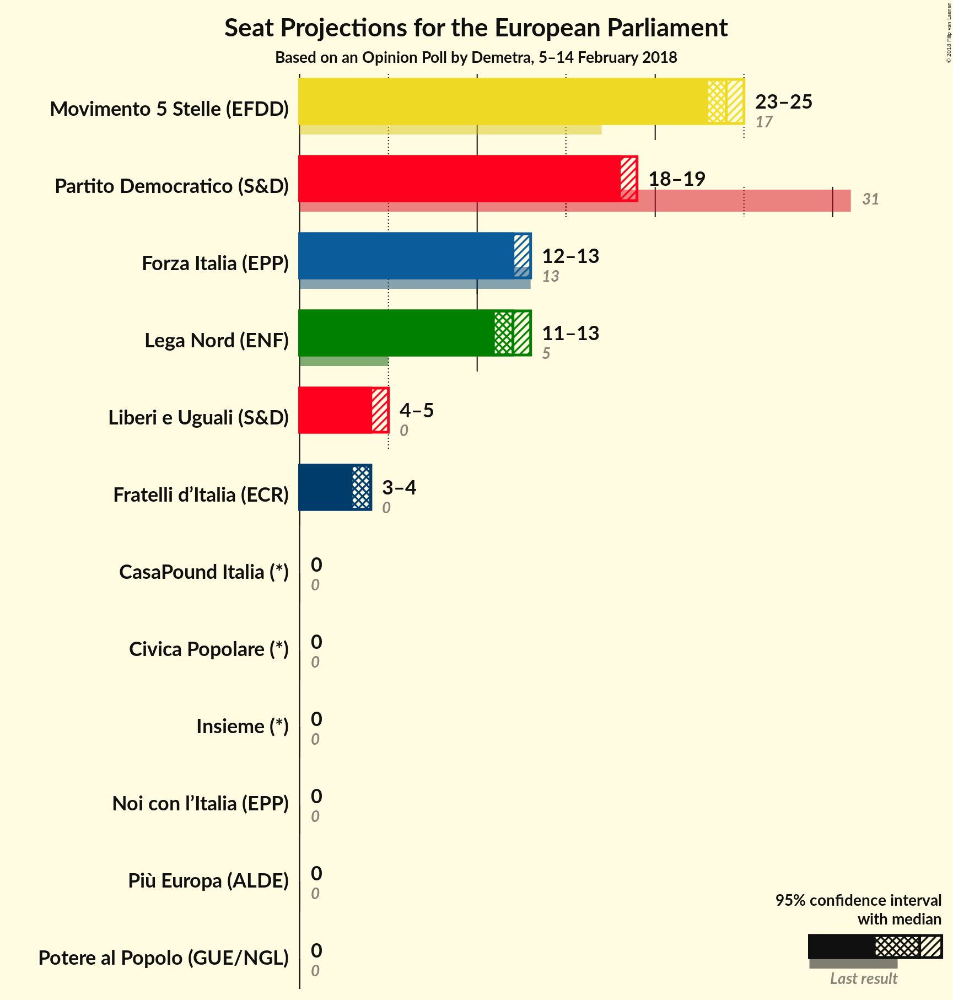
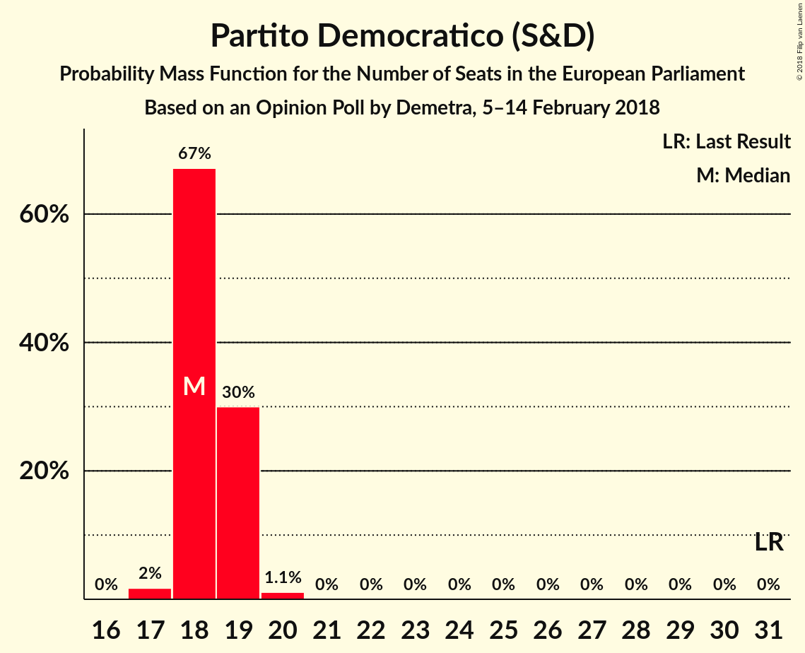
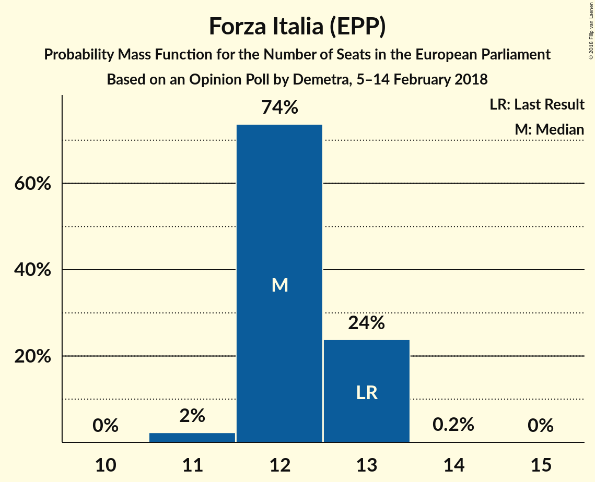
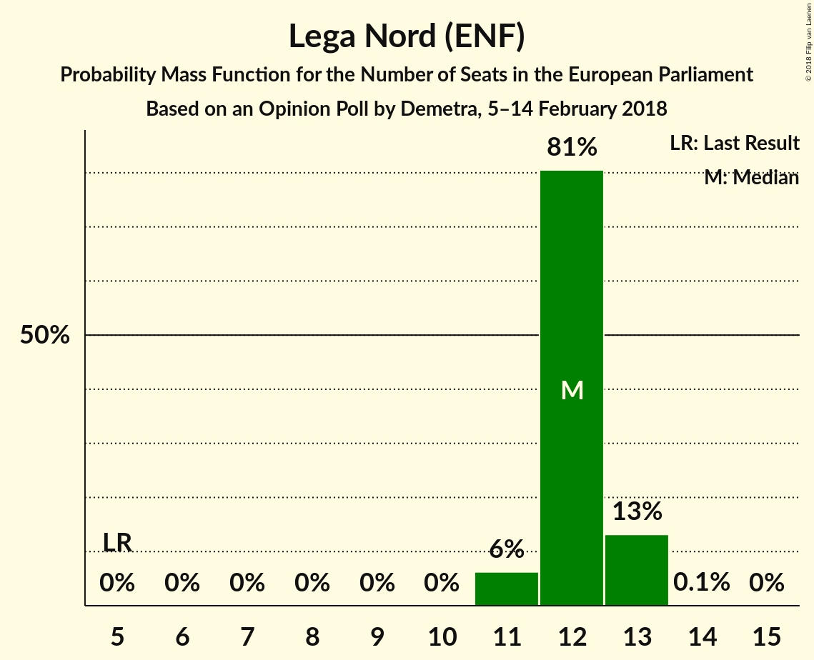
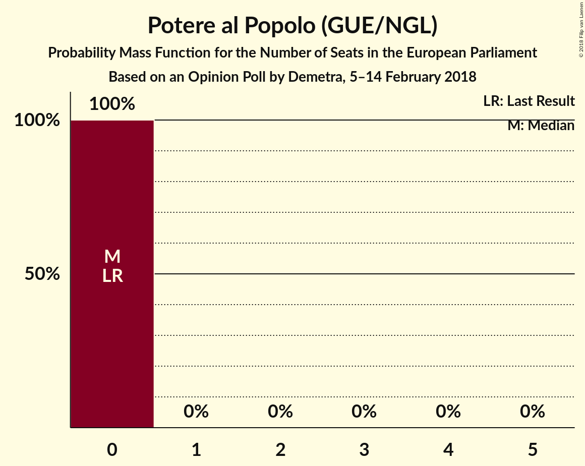
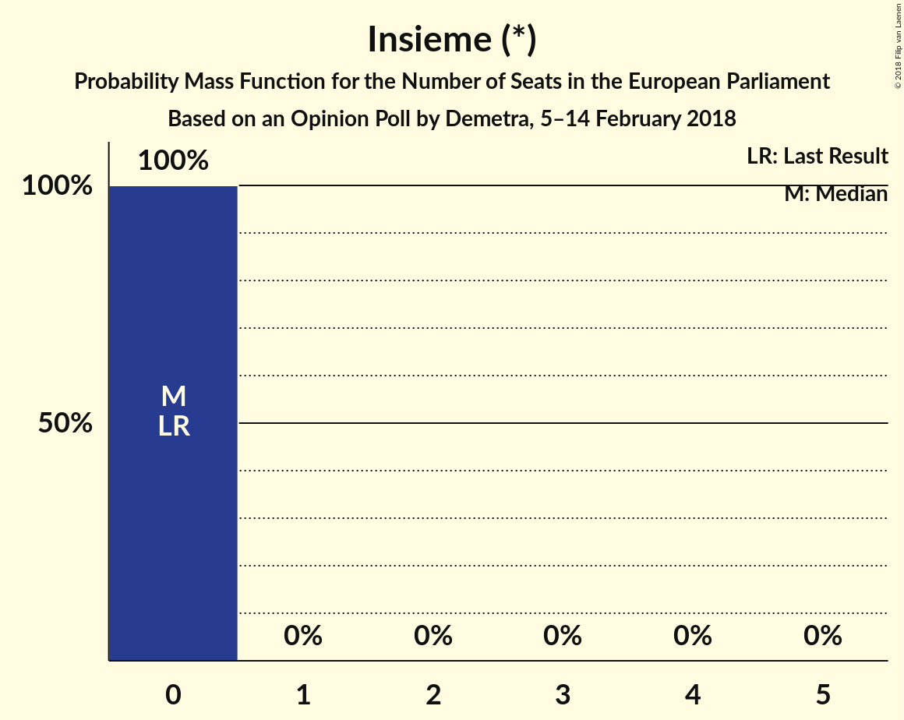

# Opinion Poll by Demetra, 5–14 February 2018

<a href="#voting-intentions">Voting Intentions</a> | <a href="#seats">Seats</a> | <a href="#coalitions">Coalitions</a> | <a href="#technical-information">Technical Information</a>

## Voting Intentions

### Confidence Intervals

| Party | Last Result | Poll Result | 80% Confidence Interval | 90% Confidence Interval | 95% Confidence Interval | 99% Confidence Interval |
|:-----:|:-----------:|:-----------:|:-----------------------:|:-----------------------:|:-----------------------:|:-----------------------:|
| Movimento 5 Stelle (EFDD) | 21.2% | 29.4% | 28.7–30.2% |28.4–30.4% |28.3–30.6% |27.9–30.9% |
| Partito Democratico (S&D) | 40.8% | 23.7% | 23.0–24.4% |22.8–24.6% |22.6–24.8% |22.3–25.1% |
| Forza Italia (EPP) | 16.8% | 15.0% | 14.4–15.6% |14.3–15.8% |14.1–15.9% |13.8–16.2% |
| Lega Nord (ENF) | 6.2% | 14.7% | 14.1–15.3% |14.0–15.5% |13.8–15.6% |13.5–15.9% |
| Liberi e Uguali (S&D) | 0.0% | 5.3% | 4.9–5.7% |4.8–5.8% |4.8–5.9% |4.6–6.1% |
| Fratelli d’Italia (ECR) | 3.7% | 4.4% | 4.1–4.8% |4.0–4.9% |3.9–5.0% |3.7–5.1% |
| Più Europa (ALDE) | 0.0% | 2.6% | 2.3–2.9% |2.3–3.0% |2.2–3.0% |2.1–3.2% |
| Potere al Popolo (GUE/NGL) | 0.0% | 1.3% | 1.1–1.5% |1.1–1.6% |1.0–1.6% |1.0–1.7% |
| Civica Popolare (*) | 0.0% | 0.6% | 0.5–0.8% |0.5–0.8% |0.4–0.8% |0.4–0.9% |
| Noi con l’Italia (EPP) | 0.0% | 0.6% | 0.5–0.8% |0.5–0.8% |0.4–0.8% |0.4–0.9% |
| CasaPound Italia (*) | 0.0% | 0.6% | 0.5–0.8% |0.5–0.8% |0.4–0.8% |0.4–0.9% |
| Insieme (*) | 0.0% | 0.5% | 0.4–0.6% |0.4–0.7% |0.4–0.7% |0.3–0.8% |

*Note:* The poll result column reflects the actual value used in the calculations. Published results may vary slightly, and in addition be rounded to fewer digits.

## Seats

### Confidence Intervals

| Party | Last Result | Median | 80% Confidence Interval | 90% Confidence Interval | 95% Confidence Interval | 99% Confidence Interval |
|:-----:|:-----------:|:------:|:-----------------------:|:-----------------------:|:-----------------------:|:-----------------------:|
| <a href="#movimento-5-stelle-(efdd)">Movimento 5 Stelle (EFDD)</a> | 17 | 24 | 23–25 |23–25 |23–25 |23–26 |
| <a href="#partito-democratico-(s&d)">Partito Democratico (S&D)</a> | 31 | 18 | 18–19 |18–19 |18–19 |17–20 |
| <a href="#forza-italia-(epp)">Forza Italia (EPP)</a> | 13 | 12 | 12–13 |12–13 |12–13 |11–13 |
| <a href="#lega-nord-(enf)">Lega Nord (ENF)</a> | 5 | 12 | 12–13 |11–13 |11–13 |11–13 |
| <a href="#liberi-e-uguali-(s&d)">Liberi e Uguali (S&D)</a> | 0 | 4 | 4–5 |4–5 |4–5 |4–5 |
| <a href="#fratelli-d’italia-(ecr)">Fratelli d’Italia (ECR)</a> | 0 | 4 | 3–4 |3–4 |3–4 |0–4 |
| <a href="#più-europa-(alde)">Più Europa (ALDE)</a> | 0 | 0 | 0 |0 |0 |0 |
| <a href="#potere-al-popolo-(gue/ngl)">Potere al Popolo (GUE/NGL)</a> | 0 | 0 | 0 |0 |0 |0 |
| <a href="#civica-popolare-(*)">Civica Popolare (*)</a> | 0 | 0 | 0 |0 |0 |0 |
| <a href="#noi-con-l’italia-(epp)">Noi con l’Italia (EPP)</a> | 0 | 0 | 0 |0 |0 |0 |
| <a href="#casapound-italia-(*)">CasaPound Italia (*)</a> | 0 | 0 | 0 |0 |0 |0 |
| <a href="#insieme-(*)">Insieme (*)</a> | 0 | 0 | 0 |0 |0 |0 |

### Movimento 5 Stelle (EFDD)

*For a full overview of the results for this party, see the [Movimento 5 Stelle (EFDD)](party-movimento5stelleefdd.html) page.*

| Number of Seats | Probability | Accumulated | Special Marks |
|:---------------:|:-----------:|:-----------:|:-------------:|
| 17 | 0% | 100% | Last Result |
| 18 | 0% | 100% |  |
| 19 | 0% | 100% |  |
| 20 | 0% | 100% |  |
| 21 | 0% | 100% |  |
| 22 | 0% | 100% |  |
| 23 | 10% | 100% |  |
| 24 | 59% | 90% | Median |
| 25 | 30% | 31% |  |
| 26 | 0.8% | 0.8% |  |
| 27 | 0% | 0% |  |

### Partito Democratico (S&D)

*For a full overview of the results for this party, see the [Partito Democratico (S&D)](party-partitodemocraticosd.html) page.*

| Number of Seats | Probability | Accumulated | Special Marks |
|:---------------:|:-----------:|:-----------:|:-------------:|
| 17 | 2% | 100% |  |
| 18 | 67% | 98% | Median |
| 19 | 30% | 31% |  |
| 20 | 1.1% | 1.1% |  |
| 21 | 0% | 0% |  |
| 22 | 0% | 0% |  |
| 23 | 0% | 0% |  |
| 24 | 0% | 0% |  |
| 25 | 0% | 0% |  |
| 26 | 0% | 0% |  |
| 27 | 0% | 0% |  |
| 28 | 0% | 0% |  |
| 29 | 0% | 0% |  |
| 30 | 0% | 0% |  |
| 31 | 0% | 0% | Last Result |

### Forza Italia (EPP)

*For a full overview of the results for this party, see the [Forza Italia (EPP)](party-forzaitaliaepp.html) page.*

| Number of Seats | Probability | Accumulated | Special Marks |
|:---------------:|:-----------:|:-----------:|:-------------:|
| 11 | 2% | 100% |  |
| 12 | 74% | 98% | Median |
| 13 | 24% | 24% | Last Result |
| 14 | 0.2% | 0.2% |  |
| 15 | 0% | 0% |  |

### Lega Nord (ENF)

*For a full overview of the results for this party, see the [Lega Nord (ENF)](party-leganordenf.html) page.*

| Number of Seats | Probability | Accumulated | Special Marks |
|:---------------:|:-----------:|:-----------:|:-------------:|
| 5 | 0% | 100% | Last Result |
| 6 | 0% | 100% |  |
| 7 | 0% | 100% |  |
| 8 | 0% | 100% |  |
| 9 | 0% | 100% |  |
| 10 | 0% | 100% |  |
| 11 | 6% | 100% |  |
| 12 | 81% | 94% | Median |
| 13 | 13% | 13% |  |
| 14 | 0.1% | 0.1% |  |
| 15 | 0% | 0% |  |

### Liberi e Uguali (S&D)

*For a full overview of the results for this party, see the [Liberi e Uguali (S&D)](party-liberieugualisd.html) page.*

| Number of Seats | Probability | Accumulated | Special Marks |
|:---------------:|:-----------:|:-----------:|:-------------:|
| 0 | 0% | 100% | Last Result |
| 1 | 0% | 100% |  |
| 2 | 0% | 100% |  |
| 3 | 0% | 100% |  |
| 4 | 59% | 100% | Median |
| 5 | 41% | 41% |  |
| 6 | 0% | 0% |  |

### Fratelli d’Italia (ECR)

*For a full overview of the results for this party, see the [Fratelli d’Italia (ECR)](party-fratellid’italiaecr.html) page.*

| Number of Seats | Probability | Accumulated | Special Marks |
|:---------------:|:-----------:|:-----------:|:-------------:|
| 0 | 2% | 100% | Last Result |
| 1 | 0% | 98% |  |
| 2 | 0% | 98% |  |
| 3 | 16% | 98% |  |
| 4 | 83% | 83% | Median |
| 5 | 0% | 0% |  |

### Più Europa (ALDE)

*For a full overview of the results for this party, see the [Più Europa (ALDE)](party-piùeuropaalde.html) page.*

| Number of Seats | Probability | Accumulated | Special Marks |
|:---------------:|:-----------:|:-----------:|:-------------:|
| 0 | 100% | 100% | Last Result, Median |

### Potere al Popolo (GUE/NGL)

*For a full overview of the results for this party, see the [Potere al Popolo (GUE/NGL)](party-poterealpopologuengl.html) page.*

| Number of Seats | Probability | Accumulated | Special Marks |
|:---------------:|:-----------:|:-----------:|:-------------:|
| 0 | 100% | 100% | Last Result, Median |

### Civica Popolare (*)

*For a full overview of the results for this party, see the [Civica Popolare (*)](party-civicapopolare.html) page.*

| Number of Seats | Probability | Accumulated | Special Marks |
|:---------------:|:-----------:|:-----------:|:-------------:|
| 0 | 100% | 100% | Last Result, Median |

### Noi con l’Italia (EPP)

*For a full overview of the results for this party, see the [Noi con l’Italia (EPP)](party-noiconl’italiaepp.html) page.*

| Number of Seats | Probability | Accumulated | Special Marks |
|:---------------:|:-----------:|:-----------:|:-------------:|
| 0 | 100% | 100% | Last Result, Median |

### CasaPound Italia (*)

*For a full overview of the results for this party, see the [CasaPound Italia (*)](party-casapounditalia.html) page.*

| Number of Seats | Probability | Accumulated | Special Marks |
|:---------------:|:-----------:|:-----------:|:-------------:|
| 0 | 100% | 100% | Last Result, Median |

### Insieme (*)

*For a full overview of the results for this party, see the [Insieme (*)](party-insieme.html) page.*

| Number of Seats | Probability | Accumulated | Special Marks |
|:---------------:|:-----------:|:-----------:|:-------------:|
| 0 | 100% | 100% | Last Result, Median |

## Coalitions

### Confidence Intervals

| Coalition | Last Result | Median | Majority? | 80% Confidence Interval | 90% Confidence Interval | 95% Confidence Interval | 99% Confidence Interval |
|:---------:|:-----------:|:------:|:---------:|:-----------------------:|:-----------------------:|:-----------------------:|:-----------------------:|
| Movimento 5 Stelle (EFDD) | 17 | 24 | 0% | 23–25 | 23–25 | 23–25 | 23–26 |
| Partito Democratico (S&D) – Liberi e Uguali (S&D) | 31 | 23 | 0% | 22–23 | 22–24 | 22–24 | 21–24 |
| Lega Nord (ENF) | 5 | 12 | 0% | 12–13 | 11–13 | 11–13 | 11–13 |
| Fratelli d’Italia (ECR) – CasaPound Italia (*) – Civica Popolare (*) – Insieme (*) | 0 | 4 | 0% | 3–4 | 3–4 | 3–4 | 0–4 |
| Più Europa (ALDE) | 0 | 0 | 0% | 0 | 0 | 0 | 0 |
| Potere al Popolo (GUE/NGL) | 0 | 0 | 0% | 0 | 0 | 0 | 0 |

### Movimento 5 Stelle (EFDD)

| Number of Seats | Probability | Accumulated | Special Marks |
|:---------------:|:-----------:|:-----------:|:-------------:|
| 17 | 0% | 100% | Last Result |
| 18 | 0% | 100% |  |
| 19 | 0% | 100% |  |
| 20 | 0% | 100% |  |
| 21 | 0% | 100% |  |
| 22 | 0% | 100% |  |
| 23 | 10% | 100% |  |
| 24 | 59% | 90% | Median |
| 25 | 30% | 31% |  |
| 26 | 0.8% | 0.8% |  |
| 27 | 0% | 0% |  |

### Partito Democratico (S&D) – Liberi e Uguali (S&D)

| Number of Seats | Probability | Accumulated | Special Marks |
|:---------------:|:-----------:|:-----------:|:-------------:|
| 21 | 1.2% | 100% |  |
| 22 | 34% | 98.8% | Median |
| 23 | 58% | 65% |  |
| 24 | 7% | 7% |  |
| 25 | 0.4% | 0.4% |  |
| 26 | 0% | 0% |  |
| 27 | 0% | 0% |  |
| 28 | 0% | 0% |  |
| 29 | 0% | 0% |  |
| 30 | 0% | 0% |  |
| 31 | 0% | 0% | Last Result |

### Lega Nord (ENF)

| Number of Seats | Probability | Accumulated | Special Marks |
|:---------------:|:-----------:|:-----------:|:-------------:|
| 5 | 0% | 100% | Last Result |
| 6 | 0% | 100% |  |
| 7 | 0% | 100% |  |
| 8 | 0% | 100% |  |
| 9 | 0% | 100% |  |
| 10 | 0% | 100% |  |
| 11 | 6% | 100% |  |
| 12 | 81% | 94% | Median |
| 13 | 13% | 13% |  |
| 14 | 0.1% | 0.1% |  |
| 15 | 0% | 0% |  |

### Fratelli d’Italia (ECR) – CasaPound Italia (*) – Civica Popolare (*) – Insieme (*)

| Number of Seats | Probability | Accumulated | Special Marks |
|:---------------:|:-----------:|:-----------:|:-------------:|
| 0 | 2% | 100% | Last Result |
| 1 | 0% | 98% |  |
| 2 | 0% | 98% |  |
| 3 | 16% | 98% |  |
| 4 | 83% | 83% | Median |
| 5 | 0% | 0% |  |

### Più Europa (ALDE)

| Number of Seats | Probability | Accumulated | Special Marks |
|:---------------:|:-----------:|:-----------:|:-------------:|
| 0 | 100% | 100% | Last Result, Median |

### Potere al Popolo (GUE/NGL)

| Number of Seats | Probability | Accumulated | Special Marks |
|:---------------:|:-----------:|:-----------:|:-------------:|
| 0 | 100% | 100% | Last Result, Median |

## Technical Information

### Opinion Poll

+ **Polling firm:** Demetra
+ **Commissioner(s):** —
+ **Fieldwork period:** 5–14 February 2018

### Calculations

+ **Sample size:** 6006
+ **Simulations done:** 1,048,576
+ **Error estimate:** 0.98%

