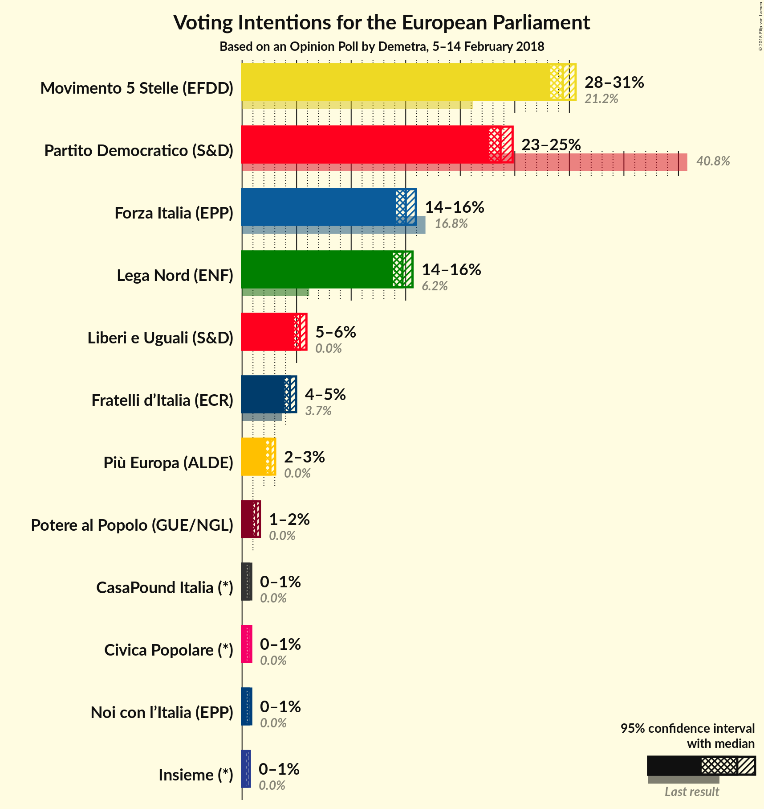

# Opinion Poll by Demetra, 5–14 February 2018

<a href="#voting-intentions">Voting Intentions</a> | <a href="#seats">Seats</a> | <a href="#coalitions">Coalitions</a> | <a href="#technical-information">Technical Information</a>

## Voting Intentions

### Confidence Intervals

| Party | Last Result | Poll Result | 80% Confidence Interval | 90% Confidence Interval | 95% Confidence Interval | 99% Confidence Interval |
|:-----:|:-----------:|:-----------:|:-----------------------:|:-----------------------:|:-----------------------:|:-----------------------:|
| Movimento 5 Stelle (EFDD) | 21.1% | 29.4% | 28.7–30.2% |28.4–30.4% |28.3–30.6% |27.9–30.9% |
| Partito Democratico (S&D) | 40.8% | 23.7% | 23.0–24.4% |22.8–24.6% |22.6–24.8% |22.3–25.1% |
| Forza Italia (EPP) | 16.8% | 15.0% | 14.4–15.6% |14.3–15.8% |14.1–15.9% |13.8–16.2% |
| Lega Nord (ENF) | 6.2% | 14.7% | 14.1–15.3% |14.0–15.5% |13.8–15.6% |13.5–15.9% |
| Liberi e Uguali (S&D) | 0.0% | 5.3% | 4.9–5.7% |4.8–5.8% |4.8–5.9% |4.6–6.1% |
| Fratelli d’Italia (*) | 3.7% | 4.4% | N/A |N/A |N/A |N/A |
| Più Europa (ALDE) | 0.0% | 2.6% | N/A |N/A |N/A |N/A |
| Potere al Popolo (GUE/NGL) | 0.0% | 1.3% | 1.1–1.5% |1.1–1.6% |1.0–1.6% |1.0–1.7% |
| Civica Popolare (*) | 0.0% | 0.6% | N/A |N/A |N/A |N/A |
| Noi con l’Italia (EPP) | 0.0% | 0.6% | N/A |N/A |N/A |N/A |
| CasaPound Italia (*) | 0.0% | 0.6% | N/A |N/A |N/A |N/A |
| Insieme (*) | 0.0% | 0.5% | N/A |N/A |N/A |N/A |

*Note:* The poll result column reflects the actual value used in the calculations. Published results may vary slightly, and in addition be rounded to fewer digits.

## Seats

### Confidence Intervals

| Party | Last Result | Median | 80% Confidence Interval | 90% Confidence Interval | 95% Confidence Interval | 99% Confidence Interval |
|:-----:|:-----------:|:------:|:-----------------------:|:-----------------------:|:-----------------------:|:-----------------------:|
| <a href="#movimento-5-stelle-(efdd)">Movimento 5 Stelle (EFDD)</a> | 17 | 25 | 24–25 |24–25 |24–25 |23–26 |
| <a href="#partito-democratico-(s&d)">Partito Democratico (S&D)</a> | 31 | 18 | 18–19 |18–19 |17–19 |17–20 |
| <a href="#forza-italia-(epp)">Forza Italia (EPP)</a> | 13 | 12 | 12–13 |12–13 |11–13 |11–13 |
| <a href="#lega-nord-(enf)">Lega Nord (ENF)</a> | 5 | 12 | 12 |11–13 |11–13 |11–13 |
| <a href="#liberi-e-uguali-(s&d)">Liberi e Uguali (S&D)</a> | 0 | 4 | 4 |4–5 |4–5 |4–5 |
| <a href="#fratelli-d’italia-(*)">Fratelli d’Italia (*)</a> | 0 | N/A | N/A |N/A |N/A |N/A |
| <a href="#più-europa-(alde)">Più Europa (ALDE)</a> | 0 | N/A | N/A |N/A |N/A |N/A |
| <a href="#potere-al-popolo-(gue/ngl)">Potere al Popolo (GUE/NGL)</a> | 0 | 0 | 0 |0 |0 |0 |
| <a href="#civica-popolare-(*)">Civica Popolare (*)</a> | 0 | N/A | N/A |N/A |N/A |N/A |
| <a href="#noi-con-l’italia-(epp)">Noi con l’Italia (EPP)</a> | 0 | N/A | N/A |N/A |N/A |N/A |
| <a href="#casapound-italia-(*)">CasaPound Italia (*)</a> | 0 | N/A | N/A |N/A |N/A |N/A |
| <a href="#insieme-(*)">Insieme (*)</a> | 0 | N/A | N/A |N/A |N/A |N/A |

