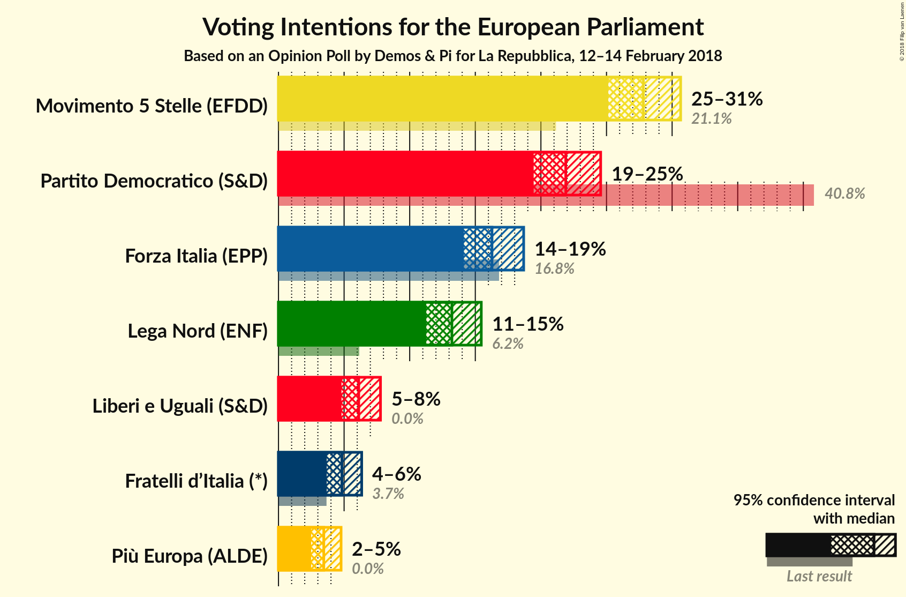
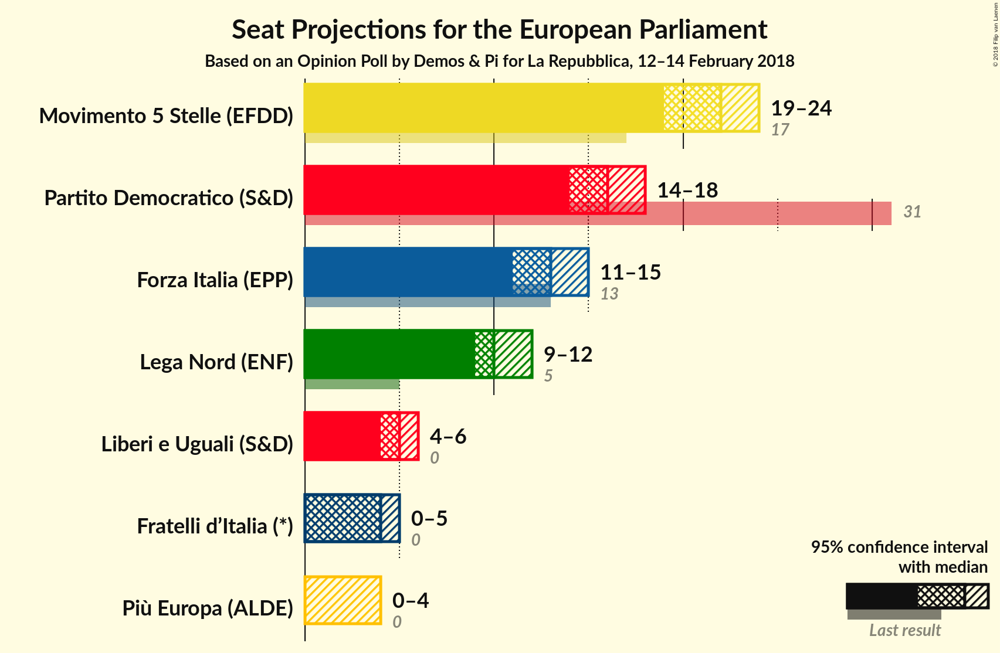
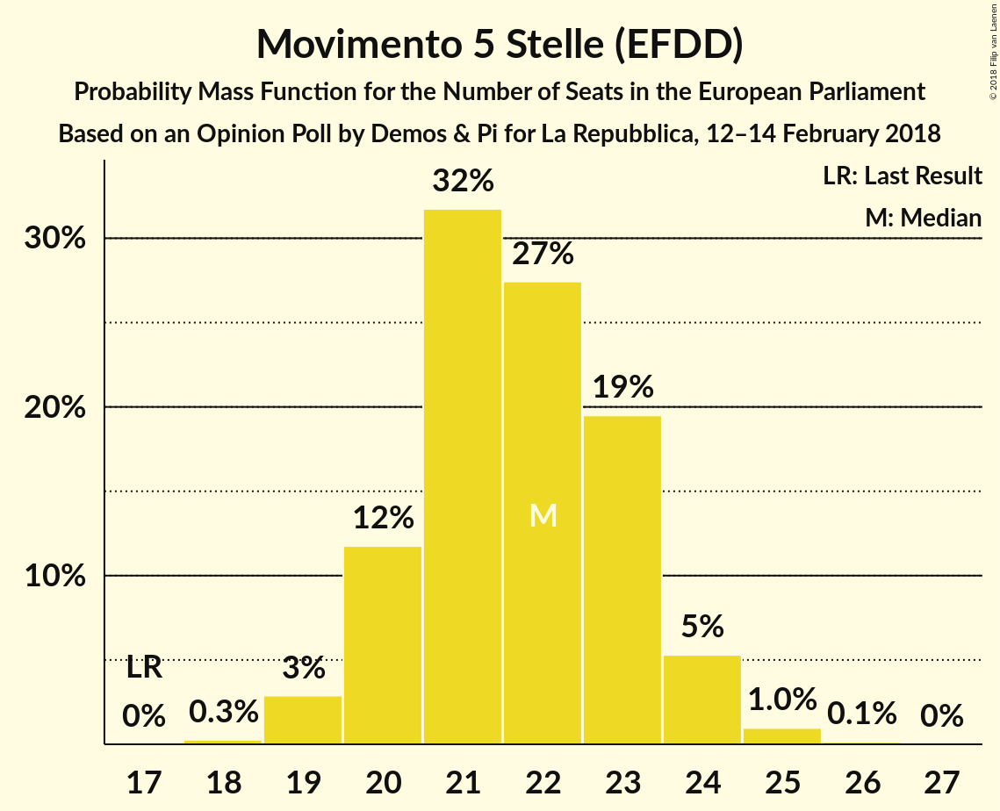
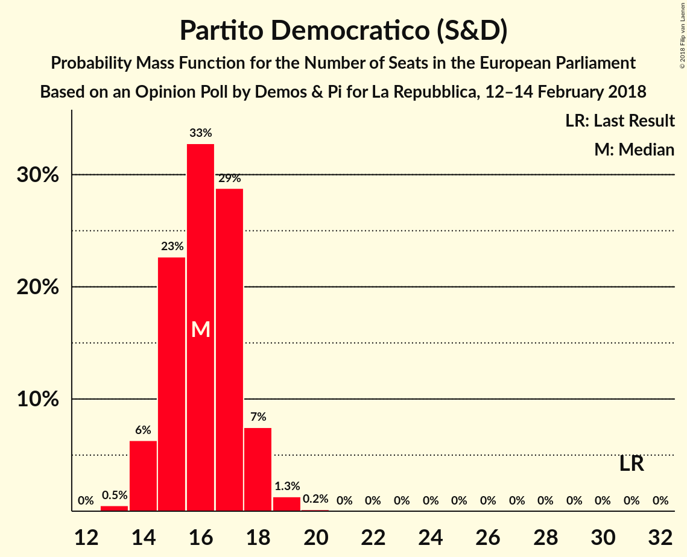
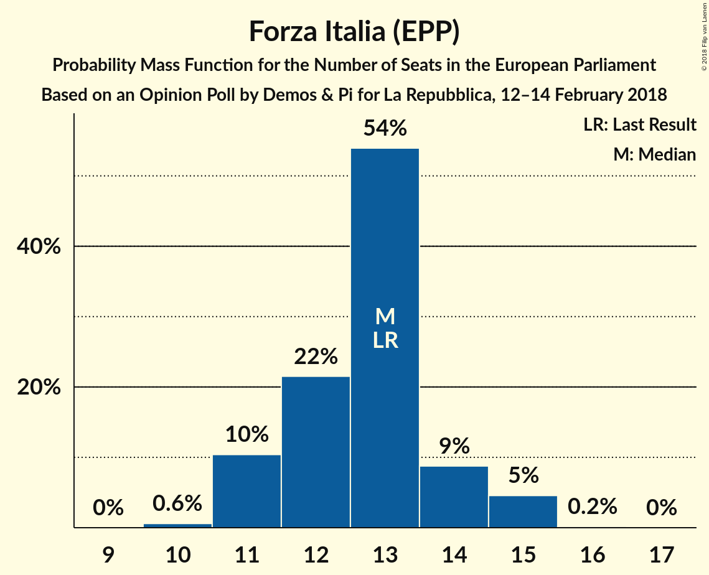
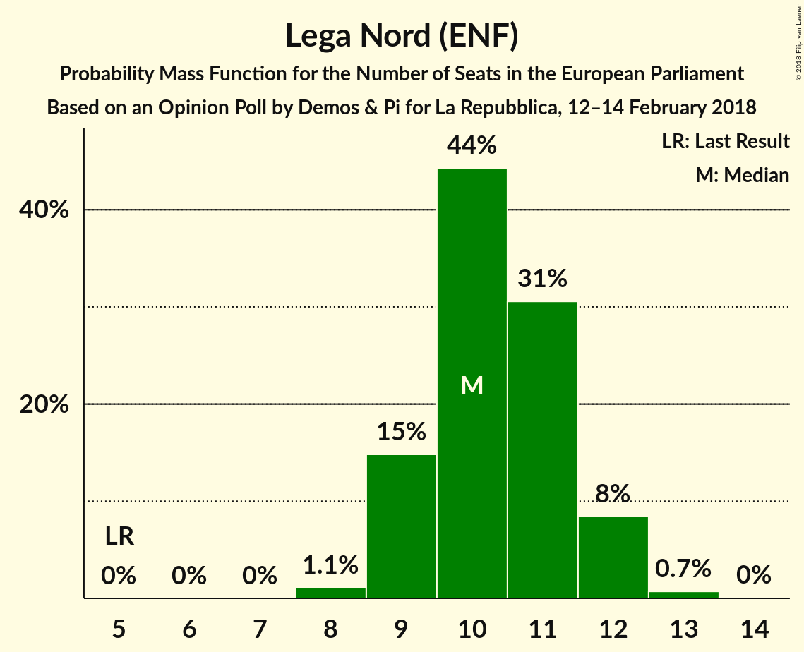
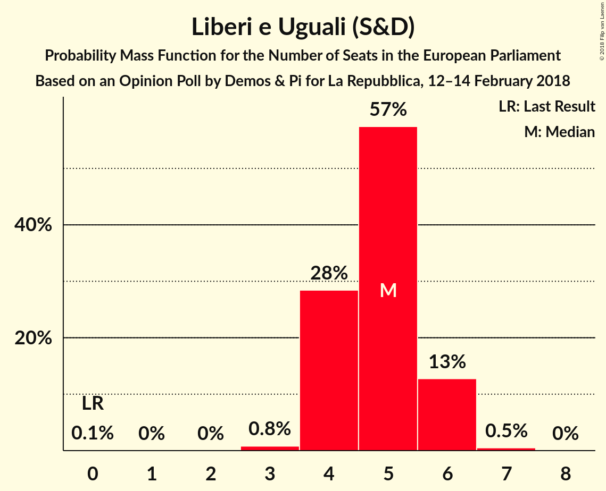
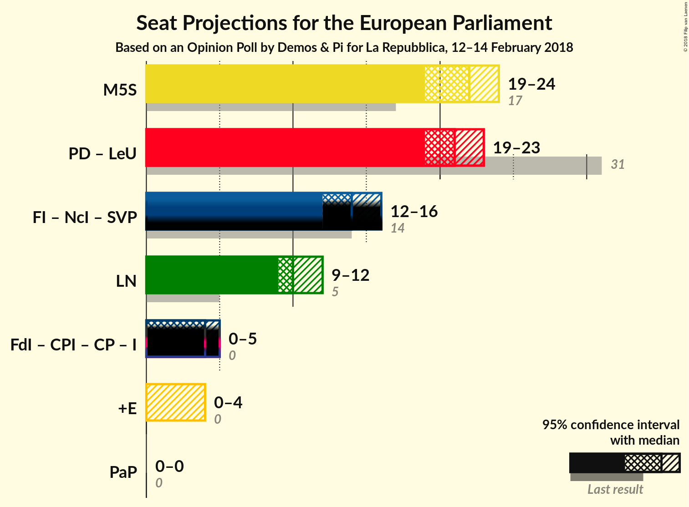

# Opinion Poll by Demos & Pi for La Repubblica, 12–14 February 2018

<a href="#voting-intentions">Voting Intentions</a> | <a href="#seats">Seats</a> | <a href="#coalitions">Coalitions</a> | <a href="#technical-information">Technical Information</a>

## Voting Intentions

### Confidence Intervals

| Party | Last Result | Poll Result | 80% Confidence Interval | 90% Confidence Interval | 95% Confidence Interval | 99% Confidence Interval |
|:-----:|:-----------:|:-----------:|:-----------------------:|:-----------------------:|:-----------------------:|:-----------------------:|
| Movimento 5 Stelle (EFDD) | 21.1% | 27.8% | 26.0–29.7% |25.6–30.2% |25.1–30.7% |24.3–31.6% |
| Partito Democratico (S&D) | 40.8% | 21.9% | 20.3–23.6% |19.8–24.1% |19.4–24.6% |18.7–25.4% |
| Forza Italia (EPP) | 16.8% | 16.3% | 14.9–17.8% |14.5–18.3% |14.1–18.7% |13.5–19.4% |
| Lega Nord (ENF) | 6.2% | 13.2% | 11.9–14.7% |11.6–15.1% |11.3–15.5% |10.7–16.2% |
| Liberi e Uguali (S&D) | 0.0% | 6.1% | 5.2–7.2% |5.0–7.5% |4.8–7.8% |4.4–8.3% |
| Fratelli d’Italia (—) | 3.7% | 4.8% | 4.1–5.8% |3.9–6.1% |3.7–6.3% |3.3–6.8% |
| Più Europa (—) | 0.0% | 3.5% | 2.8–4.3% |2.6–4.6% |2.5–4.8% |2.2–5.2% |

*Note:* The poll result column reflects the actual value used in the calculations. Published results may vary slightly, and in addition be rounded to fewer digits.

## Seats

### Confidence Intervals

| Party | Last Result | Median | 80% Confidence Interval | 90% Confidence Interval | 95% Confidence Interval | 99% Confidence Interval |
|:-----:|:-----------:|:------:|:-----------------------:|:-----------------------:|:-----------------------:|:-----------------------:|
| <a href="#movimento-5-stelle-(efdd)">Movimento 5 Stelle (EFDD)</a> | 17 | 21 | 21–23 |21–23 |20–23 |20–23 |
| <a href="#partito-democratico-(s&d)">Partito Democratico (S&D)</a> | 31 | 18 | 14–18 |14–18 |14–18 |14–19 |
| <a href="#forza-italia-(epp)">Forza Italia (EPP)</a> | 13 | 12 | 12 |12 |11–13 |10–13 |
| <a href="#lega-nord-(enf)">Lega Nord (ENF)</a> | 5 | 9 | 9–13 |9–13 |9–13 |9–13 |
| <a href="#liberi-e-uguali-(s&d)">Liberi e Uguali (S&D)</a> | 0 | 5 | 4–6 |4–6 |4–6 |3–6 |
| <a href="#fratelli-d’italia-(—)">Fratelli d’Italia (—)</a> | 0 | 4 | 4 |4 |3–5 |3–5 |
| <a href="#più-europa-(—)">Più Europa (—)</a> | 0 | 0 | 0 |0 |0–3 |0–4 |

### Movimento 5 Stelle (EFDD)

*For a full overview of the results for this party, see the [Movimento 5 Stelle (EFDD)](party-movimento5stelleefdd.html) page.*

| Number of Seats | Probability | Accumulated | Special Marks |
|:---------------:|:-----------:|:-----------:|:-------------:|
| 17 | 0% | 100% | Last Result |
| 18 | 0% | 100% |  |
| 19 | 0.1% | 100% |  |
| 20 | 5% | 99.9% |  |
| 21 | 60% | 95% | Median |
| 22 | 22% | 35% |  |
| 23 | 12% | 12% |  |
| 24 | 0.1% | 0.1% |  |
| 25 | 0% | 0.1% |  |
| 26 | 0% | 0% |  |

### Partito Democratico (S&D)

*For a full overview of the results for this party, see the [Partito Democratico (S&D)](party-partitodemocraticosd.html) page.*

| Number of Seats | Probability | Accumulated | Special Marks |
|:---------------:|:-----------:|:-----------:|:-------------:|
| 14 | 12% | 100% |  |
| 15 | 0.3% | 88% |  |
| 16 | 0% | 88% |  |
| 17 | 3% | 88% |  |
| 18 | 83% | 84% | Median |
| 19 | 1.4% | 1.4% |  |
| 20 | 0% | 0% |  |
| 21 | 0% | 0% |  |
| 22 | 0% | 0% |  |
| 23 | 0% | 0% |  |
| 24 | 0% | 0% |  |
| 25 | 0% | 0% |  |
| 26 | 0% | 0% |  |
| 27 | 0% | 0% |  |
| 28 | 0% | 0% |  |
| 29 | 0% | 0% |  |
| 30 | 0% | 0% |  |
| 31 | 0% | 0% | Last Result |

### Forza Italia (EPP)

*For a full overview of the results for this party, see the [Forza Italia (EPP)](party-forzaitaliaepp.html) page.*

| Number of Seats | Probability | Accumulated | Special Marks |
|:---------------:|:-----------:|:-----------:|:-------------:|
| 10 | 0.8% | 100% |  |
| 11 | 3% | 99.2% |  |
| 12 | 93% | 96% | Median |
| 13 | 3% | 3% | Last Result |
| 14 | 0.1% | 0.2% |  |
| 15 | 0% | 0.1% |  |
| 16 | 0% | 0% |  |

### Lega Nord (ENF)

*For a full overview of the results for this party, see the [Lega Nord (ENF)](party-leganordenf.html) page.*

| Number of Seats | Probability | Accumulated | Special Marks |
|:---------------:|:-----------:|:-----------:|:-------------:|
| 5 | 0% | 100% | Last Result |
| 6 | 0% | 100% |  |
| 7 | 0% | 100% |  |
| 8 | 0.3% | 100% |  |
| 9 | 83% | 99.7% | Median |
| 10 | 4% | 17% |  |
| 11 | 2% | 12% |  |
| 12 | 0.3% | 10% |  |
| 13 | 10% | 10% |  |
| 14 | 0% | 0% |  |

### Liberi e Uguali (S&D)

*For a full overview of the results for this party, see the [Liberi e Uguali (S&D)](party-liberieugualisd.html) page.*

| Number of Seats | Probability | Accumulated | Special Marks |
|:---------------:|:-----------:|:-----------:|:-------------:|
| 0 | 0% | 100% | Last Result |
| 1 | 0% | 100% |  |
| 2 | 0% | 100% |  |
| 3 | 0.9% | 100% |  |
| 4 | 13% | 99.1% |  |
| 5 | 66% | 86% | Median |
| 6 | 20% | 20% |  |
| 7 | 0% | 0% |  |

### Fratelli d’Italia (—)

*For a full overview of the results for this party, see the [Fratelli d’Italia (—)](party-fratellid’italia—.html) page.*

| Number of Seats | Probability | Accumulated | Special Marks |
|:---------------:|:-----------:|:-----------:|:-------------:|
| 0 | 0.4% | 100% | Last Result |
| 1 | 0% | 99.6% |  |
| 2 | 0% | 99.6% |  |
| 3 | 2% | 99.6% |  |
| 4 | 94% | 97% | Median |
| 5 | 3% | 3% |  |
| 6 | 0% | 0% |  |

### Più Europa (—)

*For a full overview of the results for this party, see the [Più Europa (—)](party-piùeuropa—.html) page.*

| Number of Seats | Probability | Accumulated | Special Marks |
|:---------------:|:-----------:|:-----------:|:-------------:|
| 0 | 97% | 100% | Last Result, Median |
| 1 | 0% | 3% |  |
| 2 | 0% | 3% |  |
| 3 | 0.3% | 3% |  |
| 4 | 2% | 2% |  |
| 5 | 0% | 0% |  |

## Coalitions

### Confidence Intervals

| Coalition | Last Result | Median | Majority? | 80% Confidence Interval | 90% Confidence Interval | 95% Confidence Interval | 99% Confidence Interval |
|:---------:|:-----------:|:------:|:---------:|:-----------------------:|:-----------------------:|:-----------------------:|:-----------------------:|
| Partito Democratico (S&D) – Liberi e Uguali (S&D) | 31 | 23 | 0% | 18–24 | 18–24 | 18–24 | 18–24 |
| Movimento 5 Stelle (EFDD) | 17 | 21 | 0% | 21–23 | 21–23 | 20–23 | 20–23 |
| Lega Nord (ENF) | 5 | 9 | 0% | 9–13 | 9–13 | 9–13 | 9–13 |

### Partito Democratico (S&D) – Liberi e Uguali (S&D)

| Number of Seats | Probability | Accumulated | Special Marks |
|:---------------:|:-----------:|:-----------:|:-------------:|
| 18 | 12% | 100% |  |
| 19 | 0.6% | 88% |  |
| 20 | 0% | 88% |  |
| 21 | 0.1% | 88% |  |
| 22 | 3% | 87% |  |
| 23 | 65% | 84% | Median |
| 24 | 20% | 20% |  |
| 25 | 0% | 0% |  |
| 26 | 0% | 0% |  |
| 27 | 0% | 0% |  |
| 28 | 0% | 0% |  |
| 29 | 0% | 0% |  |
| 30 | 0% | 0% |  |
| 31 | 0% | 0% | Last Result |

### Movimento 5 Stelle (EFDD)

| Number of Seats | Probability | Accumulated | Special Marks |
|:---------------:|:-----------:|:-----------:|:-------------:|
| 17 | 0% | 100% | Last Result |
| 18 | 0% | 100% |  |
| 19 | 0.1% | 100% |  |
| 20 | 5% | 99.9% |  |
| 21 | 60% | 95% | Median |
| 22 | 22% | 35% |  |
| 23 | 12% | 12% |  |
| 24 | 0.1% | 0.1% |  |
| 25 | 0% | 0.1% |  |
| 26 | 0% | 0% |  |

### Lega Nord (ENF)

| Number of Seats | Probability | Accumulated | Special Marks |
|:---------------:|:-----------:|:-----------:|:-------------:|
| 5 | 0% | 100% | Last Result |
| 6 | 0% | 100% |  |
| 7 | 0% | 100% |  |
| 8 | 0.3% | 100% |  |
| 9 | 83% | 99.7% | Median |
| 10 | 4% | 17% |  |
| 11 | 2% | 12% |  |
| 12 | 0.3% | 10% |  |
| 13 | 10% | 10% |  |
| 14 | 0% | 0% |  |

## Technical Information

### Opinion Poll

+ **Polling firm:** Demos & Pi
+ **Commissioner(s):** La Repubblica
+ **Fieldwork period:** 12–14 February 2018

### Calculations

+ **Sample size:** 1014
+ **Simulations done:** 1,024
+ **Error estimate:** 4.86%

