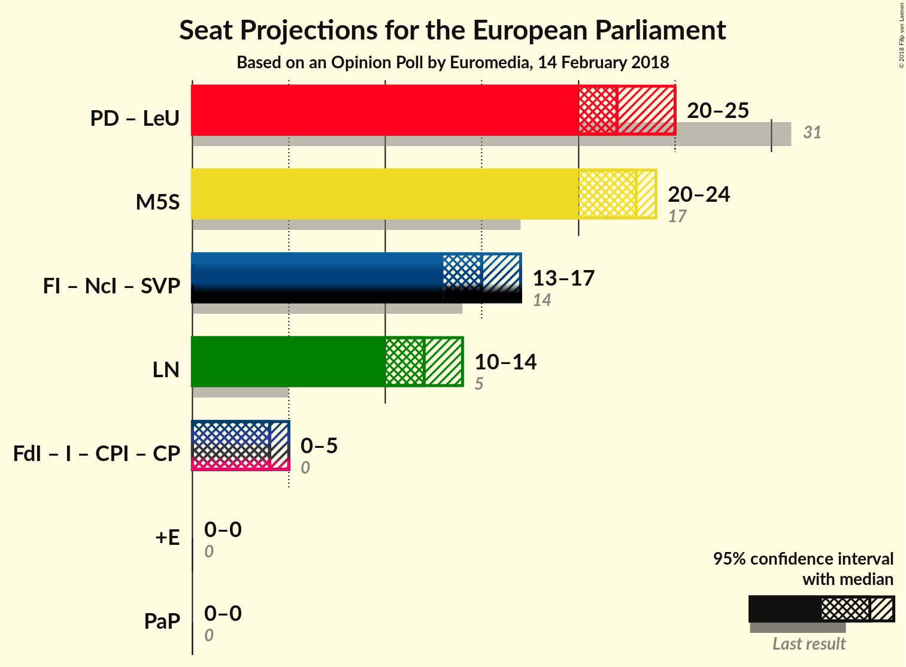

# Opinion Poll by Euromedia, 14 February 2018

<a href="#voting-intentions">Voting Intentions</a> | <a href="#seats">Seats</a> | <a href="#coalitions">Coalitions</a> | <a href="#technical-information">Technical Information</a>

## Voting Intentions

### Confidence Intervals

| Party | Last Result | Poll Result | 80% Confidence Interval | 90% Confidence Interval | 95% Confidence Interval | 99% Confidence Interval |
|:-----:|:-----------:|:-----------:|:-----------------------:|:-----------------------:|:-----------------------:|:-----------------------:|
| Movimento 5 Stelle (EFDD) | 21.2% | 26.9% | 24.9–29.0% |24.4–29.6% |23.9–30.1% |23.0–31.1% |
| Partito Democratico (S&D) | 40.8% | 22.2% | 20.4–24.2% |19.9–24.8% |19.5–25.3% |18.7–26.2% |
| Forza Italia (EPP) | 16.8% | 17.4% | 15.7–19.2% |15.3–19.7% |14.9–20.2% |14.2–21.1% |
| Lega Nord (ENF) | 6.2% | 14.2% | 12.8–15.9% |12.3–16.4% |12.0–16.9% |11.3–17.7% |
| Liberi e Uguali (S&D) | 0.0% | 5.9% | 4.9–7.1% |4.7–7.4% |4.5–7.7% |4.0–8.4% |
| Fratelli d’Italia (ECR) | 3.7% | 4.9% | 4.0–6.0% |3.8–6.3% |3.6–6.6% |3.2–7.2% |
| Più Europa (ALDE) | 0.0% | 2.2% | 1.7–3.1% |1.6–3.3% |1.4–3.5% |1.2–4.0% |
| Noi con l’Italia (EPP) | 0.0% | 2.2% | 1.7–3.1% |1.6–3.3% |1.4–3.5% |1.2–4.0% |
| Insieme (*) | 0.0% | 0.8% | 0.5–1.3% |0.4–1.5% |0.4–1.6% |0.2–2.0% |
| CasaPound Italia (*) | 0.0% | 0.6% | 0.4–1.2% |0.3–1.3% |0.3–1.5% |0.2–1.8% |
| Civica Popolare (*) | 0.0% | 0.5% | 0.3–1.0% |0.2–1.1% |0.2–1.3% |0.1–1.6% |

*Note:* The poll result column reflects the actual value used in the calculations. Published results may vary slightly, and in addition be rounded to fewer digits.

## Seats

### Confidence Intervals

| Party | Last Result | Median | 80% Confidence Interval | 90% Confidence Interval | 95% Confidence Interval | 99% Confidence Interval |
|:-----:|:-----------:|:------:|:-----------------------:|:-----------------------:|:-----------------------:|:-----------------------:|
| <a href="#movimento-5-stelle-(efdd)">Movimento 5 Stelle (EFDD)</a> | 17 | 23 | 21–24 |21–24 |20–24 |19–25 |
| <a href="#partito-democratico-(s&d)">Partito Democratico (S&D)</a> | 31 | 17 | 16–19 |16–20 |15–20 |15–20 |
| <a href="#forza-italia-(epp)">Forza Italia (EPP)</a> | 13 | 14 | 13–15 |12–16 |12–16 |12–17 |
| <a href="#lega-nord-(enf)">Lega Nord (ENF)</a> | 5 | 12 | 11–13 |11–14 |10–14 |9–15 |
| <a href="#liberi-e-uguali-(s&d)">Liberi e Uguali (S&D)</a> | 0 | 5 | 4–6 |4–6 |4–6 |4–7 |
| <a href="#fratelli-d’italia-(ecr)">Fratelli d’Italia (ECR)</a> | 0 | 4 | 3–5 |3–5 |0–5 |0–6 |
| <a href="#più-europa-(alde)">Più Europa (ALDE)</a> | 0 | 0 | 0 |0 |0 |0 |
| <a href="#noi-con-l’italia-(epp)">Noi con l’Italia (EPP)</a> | 0 | 0 | 0 |0 |0 |0 |
| <a href="#insieme-(*)">Insieme (*)</a> | 0 | 0 | 0 |0 |0 |0 |
| <a href="#casapound-italia-(*)">CasaPound Italia (*)</a> | 0 | 0 | 0 |0 |0 |0 |
| <a href="#civica-popolare-(*)">Civica Popolare (*)</a> | 0 | 0 | 0 |0 |0 |0 |

### Movimento 5 Stelle (EFDD)

*For a full overview of the results for this party, see the [Movimento 5 Stelle (EFDD)](party-movimento5stelleefdd.html) page.*

| Number of Seats | Probability | Accumulated | Special Marks |
|:---------------:|:-----------:|:-----------:|:-------------:|
| 17 | 0% | 100% | Last Result |
| 18 | 0.3% | 100% |  |
| 19 | 0.7% | 99.7% |  |
| 20 | 3% | 99.0% |  |
| 21 | 21% | 96% |  |
| 22 | 17% | 75% |  |
| 23 | 14% | 58% | Median |
| 24 | 42% | 44% |  |
| 25 | 2% | 2% |  |
| 26 | 0.2% | 0.4% |  |
| 27 | 0.1% | 0.1% |  |
| 28 | 0% | 0% |  |

### Partito Democratico (S&D)

*For a full overview of the results for this party, see the [Partito Democratico (S&D)](party-partitodemocraticosd.html) page.*

| Number of Seats | Probability | Accumulated | Special Marks |
|:---------------:|:-----------:|:-----------:|:-------------:|
| 14 | 0.5% | 100% |  |
| 15 | 4% | 99.5% |  |
| 16 | 13% | 95% |  |
| 17 | 42% | 82% | Median |
| 18 | 12% | 40% |  |
| 19 | 23% | 28% |  |
| 20 | 5% | 5% |  |
| 21 | 0.2% | 0.3% |  |
| 22 | 0% | 0.1% |  |
| 23 | 0% | 0% |  |
| 24 | 0% | 0% |  |
| 25 | 0% | 0% |  |
| 26 | 0% | 0% |  |
| 27 | 0% | 0% |  |
| 28 | 0% | 0% |  |
| 29 | 0% | 0% |  |
| 30 | 0% | 0% |  |
| 31 | 0% | 0% | Last Result |

### Forza Italia (EPP)

*For a full overview of the results for this party, see the [Forza Italia (EPP)](party-forzaitaliaepp.html) page.*

| Number of Seats | Probability | Accumulated | Special Marks |
|:---------------:|:-----------:|:-----------:|:-------------:|
| 11 | 0% | 100% |  |
| 12 | 5% | 99.9% |  |
| 13 | 6% | 95% | Last Result |
| 14 | 58% | 89% | Median |
| 15 | 21% | 31% |  |
| 16 | 7% | 9% |  |
| 17 | 2% | 2% |  |
| 18 | 0.3% | 0.3% |  |
| 19 | 0% | 0% |  |

### Lega Nord (ENF)

*For a full overview of the results for this party, see the [Lega Nord (ENF)](party-leganordenf.html) page.*

| Number of Seats | Probability | Accumulated | Special Marks |
|:---------------:|:-----------:|:-----------:|:-------------:|
| 5 | 0% | 100% | Last Result |
| 6 | 0% | 100% |  |
| 7 | 0% | 100% |  |
| 8 | 0% | 100% |  |
| 9 | 0.9% | 100% |  |
| 10 | 3% | 99.1% |  |
| 11 | 28% | 96% |  |
| 12 | 41% | 68% | Median |
| 13 | 21% | 27% |  |
| 14 | 5% | 6% |  |
| 15 | 0.9% | 0.9% |  |
| 16 | 0% | 0% |  |

### Liberi e Uguali (S&D)

*For a full overview of the results for this party, see the [Liberi e Uguali (S&D)](party-liberieugualisd.html) page.*

| Number of Seats | Probability | Accumulated | Special Marks |
|:---------------:|:-----------:|:-----------:|:-------------:|
| 0 | 0.2% | 100% | Last Result |
| 1 | 0% | 99.8% |  |
| 2 | 0% | 99.8% |  |
| 3 | 0.1% | 99.8% |  |
| 4 | 47% | 99.6% |  |
| 5 | 43% | 53% | Median |
| 6 | 8% | 10% |  |
| 7 | 2% | 2% |  |
| 8 | 0% | 0% |  |

### Fratelli d’Italia (ECR)

*For a full overview of the results for this party, see the [Fratelli d’Italia (ECR)](party-fratellid’italiaecr.html) page.*

| Number of Seats | Probability | Accumulated | Special Marks |
|:---------------:|:-----------:|:-----------:|:-------------:|
| 0 | 5% | 100% | Last Result |
| 1 | 0% | 95% |  |
| 2 | 0% | 95% |  |
| 3 | 11% | 95% |  |
| 4 | 71% | 84% | Median |
| 5 | 11% | 13% |  |
| 6 | 2% | 2% |  |
| 7 | 0% | 0% |  |

### Più Europa (ALDE)

*For a full overview of the results for this party, see the [Più Europa (ALDE)](party-piùeuropaalde.html) page.*

| Number of Seats | Probability | Accumulated | Special Marks |
|:---------------:|:-----------:|:-----------:|:-------------:|
| 0 | 99.9% | 100% | Last Result, Median |
| 1 | 0% | 0.1% |  |
| 2 | 0% | 0.1% |  |
| 3 | 0.1% | 0.1% |  |
| 4 | 0.1% | 0.1% |  |
| 5 | 0% | 0% |  |

### Noi con l’Italia (EPP)

*For a full overview of the results for this party, see the [Noi con l’Italia (EPP)](party-noiconl’italiaepp.html) page.*

| Number of Seats | Probability | Accumulated | Special Marks |
|:---------------:|:-----------:|:-----------:|:-------------:|
| 0 | 99.8% | 100% | Last Result, Median |
| 1 | 0% | 0.2% |  |
| 2 | 0% | 0.2% |  |
| 3 | 0.2% | 0.2% |  |
| 4 | 0.1% | 0.1% |  |
| 5 | 0% | 0% |  |

### Insieme (*)

*For a full overview of the results for this party, see the [Insieme (*)](party-insieme.html) page.*

| Number of Seats | Probability | Accumulated | Special Marks |
|:---------------:|:-----------:|:-----------:|:-------------:|
| 0 | 100% | 100% | Last Result, Median |

### CasaPound Italia (*)

*For a full overview of the results for this party, see the [CasaPound Italia (*)](party-casapounditalia.html) page.*

| Number of Seats | Probability | Accumulated | Special Marks |
|:---------------:|:-----------:|:-----------:|:-------------:|
| 0 | 100% | 100% | Last Result, Median |

### Civica Popolare (*)

*For a full overview of the results for this party, see the [Civica Popolare (*)](party-civicapopolare.html) page.*

| Number of Seats | Probability | Accumulated | Special Marks |
|:---------------:|:-----------:|:-----------:|:-------------:|
| 0 | 100% | 100% | Last Result, Median |

## Coalitions

### Confidence Intervals

| Coalition | Last Result | Median | Majority? | 80% Confidence Interval | 90% Confidence Interval | 95% Confidence Interval | 99% Confidence Interval |
|:---------:|:-----------:|:------:|:---------:|:-----------------------:|:-----------------------:|:-----------------------:|:-----------------------:|
| Partito Democratico (S&D) – Liberi e Uguali (S&D) | 31 | 22 | 0% | 21–24 | 20–25 | 20–25 | 19–26 |
| Movimento 5 Stelle (EFDD) | 17 | 23 | 0% | 21–24 | 21–24 | 20–24 | 19–25 |
| Lega Nord (ENF) | 5 | 12 | 0% | 11–13 | 11–14 | 10–14 | 9–15 |
| Fratelli d’Italia (ECR) – Insieme (*) – CasaPound Italia (*) – Civica Popolare (*) | 0 | 4 | 0% | 3–5 | 3–5 | 0–5 | 0–6 |
| Più Europa (ALDE) | 0 | 0 | 0% | 0 | 0 | 0 | 0 |

### Partito Democratico (S&D) – Liberi e Uguali (S&D)

| Number of Seats | Probability | Accumulated | Special Marks |
|:---------------:|:-----------:|:-----------:|:-------------:|
| 17 | 0% | 100% |  |
| 18 | 0.3% | 99.9% |  |
| 19 | 0.7% | 99.6% |  |
| 20 | 4% | 98.9% |  |
| 21 | 33% | 95% |  |
| 22 | 26% | 62% | Median |
| 23 | 22% | 36% |  |
| 24 | 7% | 14% |  |
| 25 | 6% | 7% |  |
| 26 | 0.8% | 1.0% |  |
| 27 | 0.1% | 0.1% |  |
| 28 | 0% | 0% |  |
| 29 | 0% | 0% |  |
| 30 | 0% | 0% |  |
| 31 | 0% | 0% | Last Result |

### Movimento 5 Stelle (EFDD)

| Number of Seats | Probability | Accumulated | Special Marks |
|:---------------:|:-----------:|:-----------:|:-------------:|
| 17 | 0% | 100% | Last Result |
| 18 | 0.3% | 100% |  |
| 19 | 0.7% | 99.7% |  |
| 20 | 3% | 99.0% |  |
| 21 | 21% | 96% |  |
| 22 | 17% | 75% |  |
| 23 | 14% | 58% | Median |
| 24 | 42% | 44% |  |
| 25 | 2% | 2% |  |
| 26 | 0.2% | 0.4% |  |
| 27 | 0.1% | 0.1% |  |
| 28 | 0% | 0% |  |

### Lega Nord (ENF)

| Number of Seats | Probability | Accumulated | Special Marks |
|:---------------:|:-----------:|:-----------:|:-------------:|
| 5 | 0% | 100% | Last Result |
| 6 | 0% | 100% |  |
| 7 | 0% | 100% |  |
| 8 | 0% | 100% |  |
| 9 | 0.9% | 100% |  |
| 10 | 3% | 99.1% |  |
| 11 | 28% | 96% |  |
| 12 | 41% | 68% | Median |
| 13 | 21% | 27% |  |
| 14 | 5% | 6% |  |
| 15 | 0.9% | 0.9% |  |
| 16 | 0% | 0% |  |

### Fratelli d’Italia (ECR) – Insieme (*) – CasaPound Italia (*) – Civica Popolare (*)

| Number of Seats | Probability | Accumulated | Special Marks |
|:---------------:|:-----------:|:-----------:|:-------------:|
| 0 | 5% | 100% | Last Result |
| 1 | 0% | 95% |  |
| 2 | 0% | 95% |  |
| 3 | 11% | 95% |  |
| 4 | 71% | 84% | Median |
| 5 | 11% | 13% |  |
| 6 | 2% | 2% |  |
| 7 | 0% | 0% |  |

### Più Europa (ALDE)

| Number of Seats | Probability | Accumulated | Special Marks |
|:---------------:|:-----------:|:-----------:|:-------------:|
| 0 | 99.9% | 100% | Last Result, Median |
| 1 | 0% | 0.1% |  |
| 2 | 0% | 0.1% |  |
| 3 | 0.1% | 0.1% |  |
| 4 | 0.1% | 0.1% |  |
| 5 | 0% | 0% |  |

## Technical Information

### Opinion Poll

+ **Polling firm:** Euromedia
+ **Commissioner(s):** —
+ **Fieldwork period:** 14 February 2018

### Calculations

+ **Sample size:** 800
+ **Simulations done:** 1,048,576
+ **Error estimate:** 3.31%

