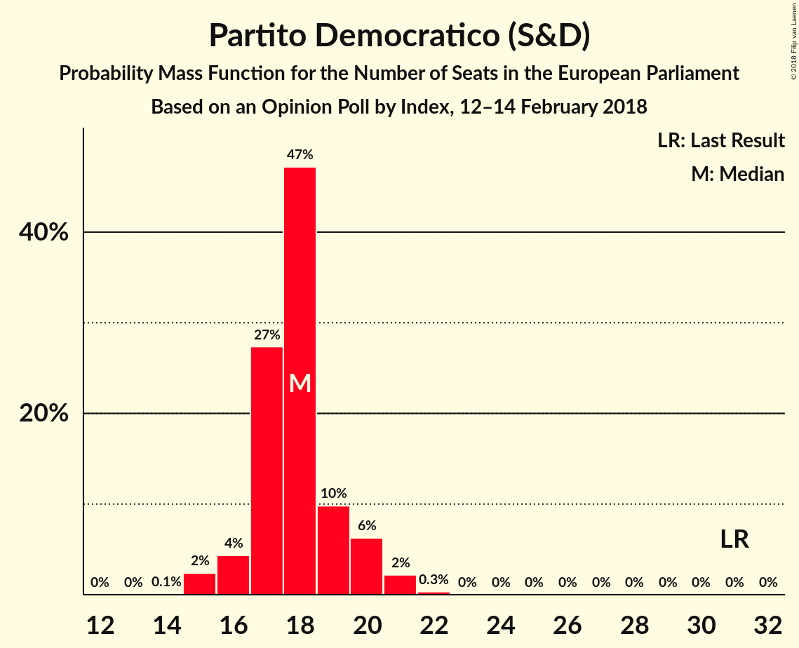

# Opinion Poll by Index, 12–14 February 2018

<a href="#voting-intentions">Voting Intentions</a> | <a href="#seats">Seats</a> | <a href="#coalitions">Coalitions</a> | <a href="#technical-information">Technical Information</a>

## Voting Intentions

### Confidence Intervals

| Party | Last Result | Poll Result | 80% Confidence Interval | 90% Confidence Interval | 95% Confidence Interval | 99% Confidence Interval |
|:-----:|:-----------:|:-----------:|:-----------------------:|:-----------------------:|:-----------------------:|:-----------------------:|
| Movimento 5 Stelle (EFDD) | 21.1% | 27.6% | 25.7–29.7% |25.1–30.3% |24.6–30.8% |23.7–31.9% |
| Partito Democratico (S&D) | 40.8% | 22.8% | 20.9–24.7% |20.4–25.3% |20.0–25.8% |19.1–26.8% |
| Forza Italia (EPP) | 16.8% | 16.4% | 14.8–18.2% |14.3–18.7% |14.0–19.1% |13.2–20.0% |
| Lega Nord (ENF) | 6.2% | 13.8% | 12.3–15.4% |11.9–15.9% |11.5–16.3% |10.9–17.1% |
| Liberi e Uguali (S&D) | 0.0% | 5.9% | 4.9–7.1% |4.7–7.4% |4.5–7.7% |4.0–8.4% |
| Fratelli d’Italia (—) | 3.7% | 4.9% | 4.0–6.0% |3.8–6.3% |3.6–6.6% |3.2–7.2% |
| Noi con l’Italia (—) | 0.0% | 2.4% | 1.8–3.2% |1.6–3.5% |1.5–3.7% |1.3–4.1% |
| Più Europa (—) | 0.0% | 2.2% | 1.7–3.1% |1.6–3.3% |1.4–3.5% |1.2–4.0% |
| Civica Popolare (—) | 0.0% | 1.2% | 0.9–1.9% |0.8–2.1% |0.7–2.3% |0.5–2.7% |
| Insieme (—) | 0.0% | 1.0% | 0.7–1.6% |0.6–1.8% |0.5–2.0% |0.4–2.3% |

*Note:* The poll result column reflects the actual value used in the calculations. Published results may vary slightly, and in addition be rounded to fewer digits.

## Seats

### Confidence Intervals

| Party | Last Result | Median | 80% Confidence Interval | 90% Confidence Interval | 95% Confidence Interval | 99% Confidence Interval |
|:-----:|:-----------:|:------:|:-----------------------:|:-----------------------:|:-----------------------:|:-----------------------:|
| <a href="#movimento-5-stelle-(efdd)">Movimento 5 Stelle (EFDD)</a> | 17 | 22 | 21–24 |20–24 |20–24 |19–25 |
| <a href="#partito-democratico-(s&d)">Partito Democratico (S&D)</a> | 31 | 17 | 16–19 |16–19 |15–20 |14–20 |
| <a href="#forza-italia-(epp)">Forza Italia (EPP)</a> | 13 | 13 | 12–14 |11–15 |11–15 |11–16 |
| <a href="#lega-nord-(enf)">Lega Nord (ENF)</a> | 5 | 11 | 10–12 |10–13 |9–13 |9–14 |
| <a href="#liberi-e-uguali-(s&d)">Liberi e Uguali (S&D)</a> | 0 | 5 | 4–5 |4–6 |4–6 |3–7 |
| <a href="#fratelli-d’italia-(—)">Fratelli d’Italia (—)</a> | 0 | 4 | 3–5 |3–5 |0–5 |0–5 |
| <a href="#noi-con-l’italia-(—)">Noi con l’Italia (—)</a> | 0 | 0 | 0 |0 |0 |0 |
| <a href="#più-europa-(—)">Più Europa (—)</a> | 0 | 0 | 0 |0 |0 |0 |
| <a href="#civica-popolare-(—)">Civica Popolare (—)</a> | 0 | 0 | 0 |0 |0 |0 |
| <a href="#insieme-(—)">Insieme (—)</a> | 0 | 0 | 0 |0 |0 |0 |

### Movimento 5 Stelle (EFDD)

*For a full overview of the results for this party, see the [Movimento 5 Stelle (EFDD)](party-movimento5stelleefdd.html) page.*

| Number of Seats | Probability | Accumulated | Special Marks |
|:---------------:|:-----------:|:-----------:|:-------------:|
| 17 | 0% | 100% | Last Result |
| 18 | 0.2% | 100% |  |
| 19 | 0.9% | 99.8% |  |
| 20 | 8% | 98.9% |  |
| 21 | 22% | 91% |  |
| 22 | 21% | 69% | Median |
| 23 | 35% | 48% |  |
| 24 | 11% | 13% |  |
| 25 | 2% | 2% |  |
| 26 | 0.4% | 0.5% |  |
| 27 | 0.1% | 0.1% |  |
| 28 | 0% | 0% |  |

### Partito Democratico (S&D)

*For a full overview of the results for this party, see the [Partito Democratico (S&D)](party-partitodemocraticosd.html) page.*

| Number of Seats | Probability | Accumulated | Special Marks |
|:---------------:|:-----------:|:-----------:|:-------------:|
| 14 | 0.7% | 100% |  |
| 15 | 4% | 99.3% |  |
| 16 | 22% | 96% |  |
| 17 | 48% | 73% | Median |
| 18 | 14% | 26% |  |
| 19 | 8% | 11% |  |
| 20 | 3% | 3% |  |
| 21 | 0.3% | 0.4% |  |
| 22 | 0% | 0% |  |
| 23 | 0% | 0% |  |
| 24 | 0% | 0% |  |
| 25 | 0% | 0% |  |
| 26 | 0% | 0% |  |
| 27 | 0% | 0% |  |
| 28 | 0% | 0% |  |
| 29 | 0% | 0% |  |
| 30 | 0% | 0% |  |
| 31 | 0% | 0% | Last Result |

### Forza Italia (EPP)

*For a full overview of the results for this party, see the [Forza Italia (EPP)](party-forzaitaliaepp.html) page.*

| Number of Seats | Probability | Accumulated | Special Marks |
|:---------------:|:-----------:|:-----------:|:-------------:|
| 10 | 0.2% | 100% |  |
| 11 | 7% | 99.8% |  |
| 12 | 31% | 93% |  |
| 13 | 44% | 62% | Last Result, Median |
| 14 | 12% | 18% |  |
| 15 | 5% | 6% |  |
| 16 | 1.4% | 2% |  |
| 17 | 0.2% | 0.3% |  |
| 18 | 0% | 0% |  |

### Lega Nord (ENF)

*For a full overview of the results for this party, see the [Lega Nord (ENF)](party-leganordenf.html) page.*

| Number of Seats | Probability | Accumulated | Special Marks |
|:---------------:|:-----------:|:-----------:|:-------------:|
| 5 | 0% | 100% | Last Result |
| 6 | 0% | 100% |  |
| 7 | 0% | 100% |  |
| 8 | 0.2% | 100% |  |
| 9 | 4% | 99.8% |  |
| 10 | 25% | 96% |  |
| 11 | 43% | 70% | Median |
| 12 | 20% | 28% |  |
| 13 | 7% | 7% |  |
| 14 | 0.5% | 0.5% |  |
| 15 | 0% | 0% |  |

### Liberi e Uguali (S&D)

*For a full overview of the results for this party, see the [Liberi e Uguali (S&D)](party-liberieugualisd.html) page.*

| Number of Seats | Probability | Accumulated | Special Marks |
|:---------------:|:-----------:|:-----------:|:-------------:|
| 0 | 0.4% | 100% | Last Result |
| 1 | 0% | 99.6% |  |
| 2 | 0% | 99.6% |  |
| 3 | 1.3% | 99.6% |  |
| 4 | 26% | 98% |  |
| 5 | 62% | 72% | Median |
| 6 | 9% | 10% |  |
| 7 | 0.6% | 0.6% |  |
| 8 | 0% | 0% |  |

### Fratelli d’Italia (—)

*For a full overview of the results for this party, see the [Fratelli d’Italia (—)](party-fratellid’italia—.html) page.*

| Number of Seats | Probability | Accumulated | Special Marks |
|:---------------:|:-----------:|:-----------:|:-------------:|
| 0 | 3% | 100% | Last Result |
| 1 | 0% | 97% |  |
| 2 | 0% | 97% |  |
| 3 | 7% | 97% |  |
| 4 | 68% | 90% | Median |
| 5 | 22% | 22% |  |
| 6 | 0.3% | 0.3% |  |
| 7 | 0% | 0% |  |

### Noi con l’Italia (—)

*For a full overview of the results for this party, see the [Noi con l’Italia (—)](party-noiconl’italia—.html) page.*

| Number of Seats | Probability | Accumulated | Special Marks |
|:---------------:|:-----------:|:-----------:|:-------------:|
| 0 | 99.6% | 100% | Last Result, Median |
| 1 | 0% | 0.4% |  |
| 2 | 0% | 0.4% |  |
| 3 | 0.4% | 0.4% |  |
| 4 | 0.1% | 0.1% |  |
| 5 | 0% | 0% |  |

### Più Europa (—)

*For a full overview of the results for this party, see the [Più Europa (—)](party-piùeuropa—.html) page.*

| Number of Seats | Probability | Accumulated | Special Marks |
|:---------------:|:-----------:|:-----------:|:-------------:|
| 0 | 99.7% | 100% | Last Result, Median |
| 1 | 0% | 0.3% |  |
| 2 | 0% | 0.3% |  |
| 3 | 0.2% | 0.3% |  |
| 4 | 0.1% | 0.1% |  |
| 5 | 0% | 0% |  |

### Civica Popolare (—)

*For a full overview of the results for this party, see the [Civica Popolare (—)](party-civicapopolare—.html) page.*

| Number of Seats | Probability | Accumulated | Special Marks |
|:---------------:|:-----------:|:-----------:|:-------------:|
| 0 | 100% | 100% | Last Result, Median |

### Insieme (—)

*For a full overview of the results for this party, see the [Insieme (—)](party-insieme—.html) page.*

| Number of Seats | Probability | Accumulated | Special Marks |
|:---------------:|:-----------:|:-----------:|:-------------:|
| 0 | 100% | 100% | Last Result, Median |

## Coalitions

### Confidence Intervals

| Coalition | Last Result | Median | Majority? | 80% Confidence Interval | 90% Confidence Interval | 95% Confidence Interval | 99% Confidence Interval |
|:---------:|:-----------:|:------:|:---------:|:-----------------------:|:-----------------------:|:-----------------------:|:-----------------------:|
| Partito Democratico (S&D) – Liberi e Uguali (S&D) | 31 | 22 | 0% | 21–23 | 20–24 | 19–25 | 18–25 |
| Movimento 5 Stelle (EFDD) | 17 | 22 | 0% | 21–24 | 20–24 | 20–24 | 19–25 |
| Lega Nord (ENF) | 5 | 11 | 0% | 10–12 | 10–13 | 9–13 | 9–14 |

### Partito Democratico (S&D) – Liberi e Uguali (S&D)

| Number of Seats | Probability | Accumulated | Special Marks |
|:---------------:|:-----------:|:-----------:|:-------------:|
| 17 | 0.1% | 100% |  |
| 18 | 0.5% | 99.9% |  |
| 19 | 2% | 99.4% |  |
| 20 | 4% | 97% |  |
| 21 | 28% | 93% |  |
| 22 | 42% | 65% | Median |
| 23 | 13% | 22% |  |
| 24 | 6% | 9% |  |
| 25 | 3% | 3% |  |
| 26 | 0.2% | 0.3% |  |
| 27 | 0% | 0.1% |  |
| 28 | 0% | 0% |  |
| 29 | 0% | 0% |  |
| 30 | 0% | 0% |  |
| 31 | 0% | 0% | Last Result |

### Movimento 5 Stelle (EFDD)

| Number of Seats | Probability | Accumulated | Special Marks |
|:---------------:|:-----------:|:-----------:|:-------------:|
| 17 | 0% | 100% | Last Result |
| 18 | 0.2% | 100% |  |
| 19 | 0.9% | 99.8% |  |
| 20 | 8% | 98.9% |  |
| 21 | 22% | 91% |  |
| 22 | 21% | 69% | Median |
| 23 | 35% | 48% |  |
| 24 | 11% | 13% |  |
| 25 | 2% | 2% |  |
| 26 | 0.4% | 0.5% |  |
| 27 | 0.1% | 0.1% |  |
| 28 | 0% | 0% |  |

### Lega Nord (ENF)

| Number of Seats | Probability | Accumulated | Special Marks |
|:---------------:|:-----------:|:-----------:|:-------------:|
| 5 | 0% | 100% | Last Result |
| 6 | 0% | 100% |  |
| 7 | 0% | 100% |  |
| 8 | 0.2% | 100% |  |
| 9 | 4% | 99.8% |  |
| 10 | 25% | 96% |  |
| 11 | 43% | 70% | Median |
| 12 | 20% | 28% |  |
| 13 | 7% | 7% |  |
| 14 | 0.5% | 0.5% |  |
| 15 | 0% | 0% |  |

## Technical Information

### Opinion Poll

+ **Polling firm:** Index
+ **Commissioner(s):** —
+ **Fieldwork period:** 12–14 February 2018

### Calculations

+ **Sample size:** 800
+ **Simulations done:** 1,048,576
+ **Error estimate:** 1.43%

