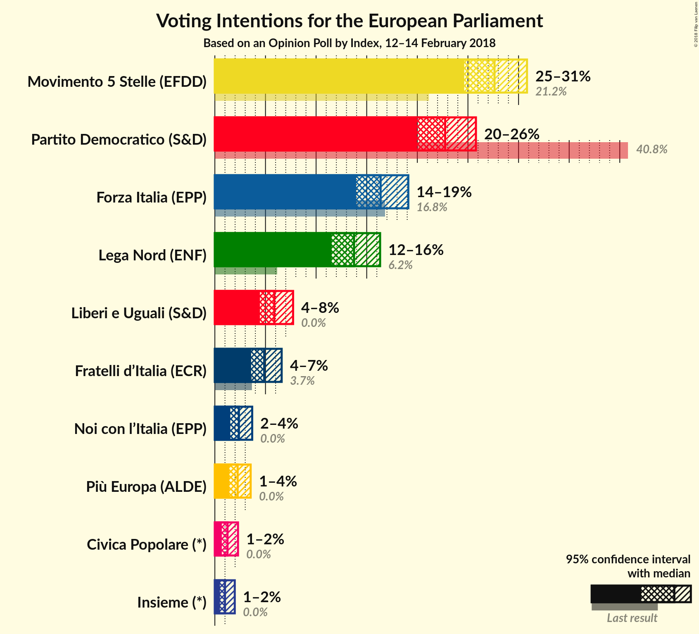
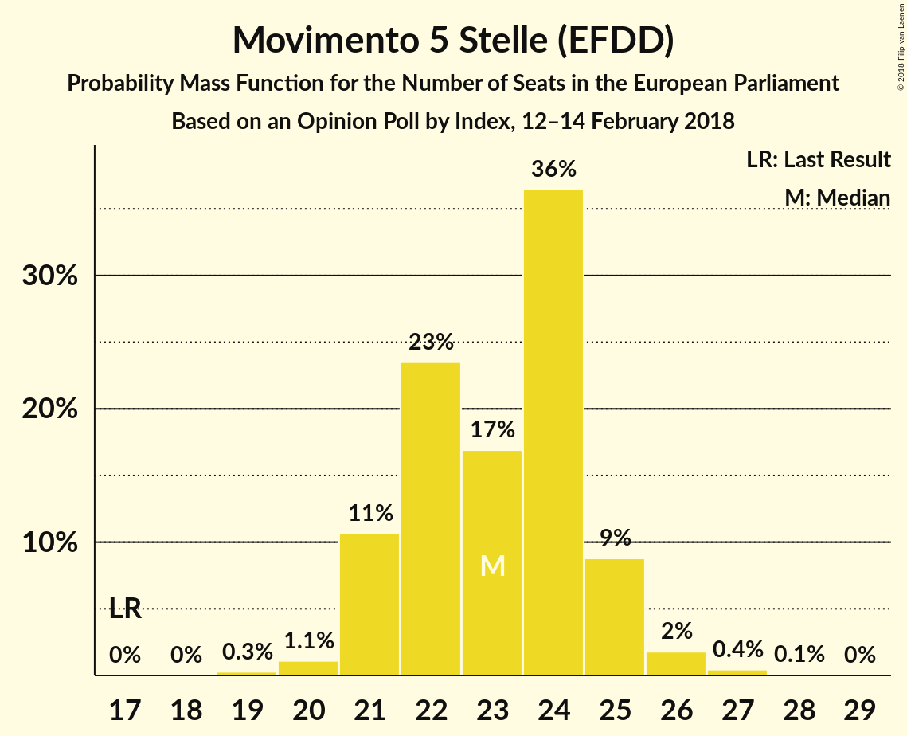
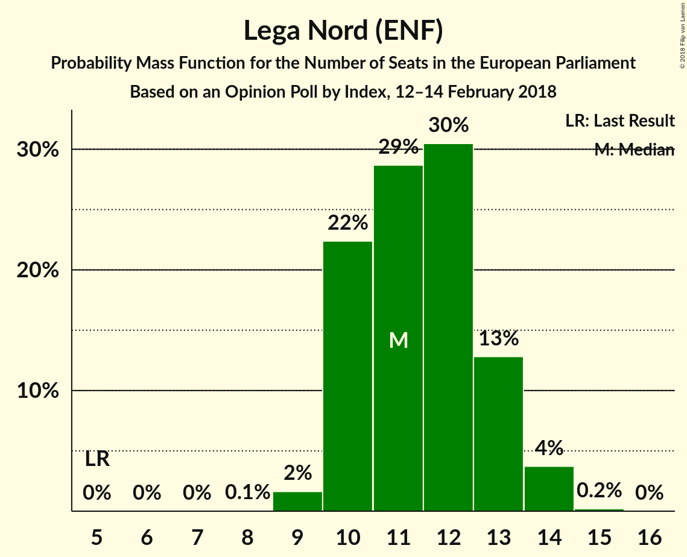

# Opinion Poll by Index, 12–14 February 2018

<a href="#voting-intentions">Voting Intentions</a> | <a href="#seats">Seats</a> | <a href="#coalitions">Coalitions</a> | <a href="#technical-information">Technical Information</a>

## Voting Intentions

### Confidence Intervals

| Party | Last Result | Poll Result | 80% Confidence Interval | 90% Confidence Interval | 95% Confidence Interval | 99% Confidence Interval |
|:-----:|:-----------:|:-----------:|:-----------------------:|:-----------------------:|:-----------------------:|:-----------------------:|
| Movimento 5 Stelle (EFDD) | 21.1% | 27.6% | 25.7–29.7% |25.1–30.3% |24.6–30.8% |23.7–31.9% |
| Partito Democratico (S&D) | 40.8% | 22.8% | 20.9–24.7% |20.4–25.3% |20.0–25.8% |19.1–26.8% |
| Forza Italia (EPP) | 16.8% | 16.4% | 14.8–18.2% |14.3–18.7% |14.0–19.1% |13.2–20.0% |
| Lega Nord (ENF) | 6.2% | 13.8% | 12.3–15.4% |11.9–15.9% |11.5–16.3% |10.9–17.1% |
| Liberi e Uguali (S&D) | 0.0% | 5.9% | 4.9–7.1% |4.7–7.4% |4.5–7.7% |4.0–8.4% |
| Fratelli d’Italia (*) | 3.7% | 4.9% | 4.0–6.0% |3.8–6.3% |3.6–6.6% |3.2–7.2% |
| Noi con l’Italia (EPP) | 0.0% | 2.4% | 1.8–3.2% |1.6–3.5% |1.5–3.7% |1.3–4.1% |
| Più Europa (ALDE) | 0.0% | 2.2% | 1.7–3.1% |1.6–3.3% |1.4–3.5% |1.2–4.0% |
| Civica Popolare (*) | 0.0% | 1.2% | 0.9–1.9% |0.8–2.1% |0.7–2.3% |0.5–2.7% |
| Insieme (*) | 0.0% | 1.0% | 0.7–1.6% |0.6–1.8% |0.5–2.0% |0.4–2.3% |

*Note:* The poll result column reflects the actual value used in the calculations. Published results may vary slightly, and in addition be rounded to fewer digits.

## Seats

### Confidence Intervals

| Party | Last Result | Median | 80% Confidence Interval | 90% Confidence Interval | 95% Confidence Interval | 99% Confidence Interval |
|:-----:|:-----------:|:------:|:-----------------------:|:-----------------------:|:-----------------------:|:-----------------------:|
| <a href="#movimento-5-stelle-(efdd)">Movimento 5 Stelle (EFDD)</a> | 17 | 24 | 21–25 |21–25 |21–25 |20–27 |
| <a href="#partito-democratico-(s&d)">Partito Democratico (S&D)</a> | 31 | 18 | 17–19 |16–20 |15–20 |15–21 |
| <a href="#forza-italia-(epp)">Forza Italia (EPP)</a> | 13 | 13 | 12–14 |12–15 |11–15 |11–16 |
| <a href="#lega-nord-(enf)">Lega Nord (ENF)</a> | 5 | 12 | 10–13 |10–14 |10–14 |9–14 |
| <a href="#liberi-e-uguali-(s&d)">Liberi e Uguali (S&D)</a> | 0 | 5 | 4–6 |4–6 |4–6 |3–7 |
| <a href="#fratelli-d’italia-(*)">Fratelli d’Italia (*)</a> | 0 | 4 | 4–5 |3–5 |0–5 |0–6 |
| <a href="#noi-con-l’italia-(epp)">Noi con l’Italia (EPP)</a> | 0 | 0 | 0 |0 |0 |0 |
| <a href="#più-europa-(alde)">Più Europa (ALDE)</a> | 0 | 0 | 0 |0 |0 |0 |
| <a href="#civica-popolare-(*)">Civica Popolare (*)</a> | 0 | 0 | 0 |0 |0 |0 |
| <a href="#insieme-(*)">Insieme (*)</a> | 0 | 0 | 0 |0 |0 |0 |

### Movimento 5 Stelle (EFDD)

*For a full overview of the results for this party, see the [Movimento 5 Stelle (EFDD)](party-movimento5stelleefdd.html) page.*

| Number of Seats | Probability | Accumulated | Special Marks |
|:---------------:|:-----------:|:-----------:|:-------------:|
| 17 | 0% | 100% | Last Result |
| 18 | 0% | 100% |  |
| 19 | 0.2% | 100% |  |
| 20 | 0.7% | 99.7% |  |
| 21 | 15% | 99.1% |  |
| 22 | 17% | 84% |  |
| 23 | 9% | 67% |  |
| 24 | 48% | 59% | Median |
| 25 | 9% | 10% |  |
| 26 | 0.7% | 1.4% |  |
| 27 | 0.6% | 0.7% |  |
| 28 | 0.1% | 0.1% |  |
| 29 | 0% | 0% |  |

### Partito Democratico (S&D)

*For a full overview of the results for this party, see the [Partito Democratico (S&D)](party-partitodemocraticosd.html) page.*

| Number of Seats | Probability | Accumulated | Special Marks |
|:---------------:|:-----------:|:-----------:|:-------------:|
| 14 | 0.1% | 100% |  |
| 15 | 4% | 99.9% |  |
| 16 | 6% | 96% |  |
| 17 | 29% | 91% |  |
| 18 | 47% | 62% | Median |
| 19 | 7% | 15% |  |
| 20 | 6% | 8% |  |
| 21 | 2% | 2% |  |
| 22 | 0.2% | 0.3% |  |
| 23 | 0% | 0% |  |
| 24 | 0% | 0% |  |
| 25 | 0% | 0% |  |
| 26 | 0% | 0% |  |
| 27 | 0% | 0% |  |
| 28 | 0% | 0% |  |
| 29 | 0% | 0% |  |
| 30 | 0% | 0% |  |
| 31 | 0% | 0% | Last Result |

### Forza Italia (EPP)

*For a full overview of the results for this party, see the [Forza Italia (EPP)](party-forzaitaliaepp.html) page.*

| Number of Seats | Probability | Accumulated | Special Marks |
|:---------------:|:-----------:|:-----------:|:-------------:|
| 11 | 3% | 100% |  |
| 12 | 17% | 97% |  |
| 13 | 49% | 79% | Last Result, Median |
| 14 | 22% | 30% |  |
| 15 | 7% | 8% |  |
| 16 | 1.2% | 2% |  |
| 17 | 0.3% | 0.4% |  |
| 18 | 0.1% | 0.1% |  |
| 19 | 0% | 0% |  |

### Lega Nord (ENF)

*For a full overview of the results for this party, see the [Lega Nord (ENF)](party-leganordenf.html) page.*

| Number of Seats | Probability | Accumulated | Special Marks |
|:---------------:|:-----------:|:-----------:|:-------------:|
| 5 | 0% | 100% | Last Result |
| 6 | 0% | 100% |  |
| 7 | 0% | 100% |  |
| 8 | 0.1% | 100% |  |
| 9 | 2% | 99.9% |  |
| 10 | 25% | 98% |  |
| 11 | 21% | 74% |  |
| 12 | 32% | 53% | Median |
| 13 | 16% | 21% |  |
| 14 | 5% | 6% |  |
| 15 | 0.2% | 0.2% |  |
| 16 | 0% | 0% |  |

### Liberi e Uguali (S&D)

*For a full overview of the results for this party, see the [Liberi e Uguali (S&D)](party-liberieugualisd.html) page.*

| Number of Seats | Probability | Accumulated | Special Marks |
|:---------------:|:-----------:|:-----------:|:-------------:|
| 0 | 0.3% | 100% | Last Result |
| 1 | 0% | 99.7% |  |
| 2 | 0% | 99.7% |  |
| 3 | 0.6% | 99.7% |  |
| 4 | 13% | 99.1% |  |
| 5 | 73% | 86% | Median |
| 6 | 13% | 14% |  |
| 7 | 1.2% | 1.2% |  |
| 8 | 0% | 0% |  |

### Fratelli d’Italia (*)

*For a full overview of the results for this party, see the [Fratelli d’Italia (*)](party-fratellid’italia.html) page.*

| Number of Seats | Probability | Accumulated | Special Marks |
|:---------------:|:-----------:|:-----------:|:-------------:|
| 0 | 3% | 100% | Last Result |
| 1 | 0% | 97% |  |
| 2 | 0% | 97% |  |
| 3 | 5% | 97% |  |
| 4 | 46% | 92% | Median |
| 5 | 44% | 46% |  |
| 6 | 2% | 2% |  |
| 7 | 0% | 0% |  |

### Noi con l’Italia (EPP)

*For a full overview of the results for this party, see the [Noi con l’Italia (EPP)](party-noiconl’italiaepp.html) page.*

| Number of Seats | Probability | Accumulated | Special Marks |
|:---------------:|:-----------:|:-----------:|:-------------:|
| 0 | 99.5% | 100% | Last Result, Median |
| 1 | 0% | 0.5% |  |
| 2 | 0% | 0.5% |  |
| 3 | 0.2% | 0.5% |  |
| 4 | 0.2% | 0.2% |  |
| 5 | 0% | 0% |  |

### Più Europa (ALDE)

*For a full overview of the results for this party, see the [Più Europa (ALDE)](party-piùeuropaalde.html) page.*

| Number of Seats | Probability | Accumulated | Special Marks |
|:---------------:|:-----------:|:-----------:|:-------------:|
| 0 | 99.7% | 100% | Last Result, Median |
| 1 | 0% | 0.3% |  |
| 2 | 0% | 0.3% |  |
| 3 | 0.2% | 0.3% |  |
| 4 | 0.1% | 0.1% |  |
| 5 | 0% | 0% |  |

### Civica Popolare (*)

*For a full overview of the results for this party, see the [Civica Popolare (*)](party-civicapopolare.html) page.*

| Number of Seats | Probability | Accumulated | Special Marks |
|:---------------:|:-----------:|:-----------:|:-------------:|
| 0 | 100% | 100% | Last Result, Median |

### Insieme (*)

*For a full overview of the results for this party, see the [Insieme (*)](party-insieme.html) page.*

| Number of Seats | Probability | Accumulated | Special Marks |
|:---------------:|:-----------:|:-----------:|:-------------:|
| 0 | 100% | 100% | Last Result, Median |

## Coalitions

### Confidence Intervals

| Coalition | Last Result | Median | Majority? | 80% Confidence Interval | 90% Confidence Interval | 95% Confidence Interval | 99% Confidence Interval |
|:---------:|:-----------:|:------:|:---------:|:-----------------------:|:-----------------------:|:-----------------------:|:-----------------------:|
| Partito Democratico (S&D) – Liberi e Uguali (S&D) | 31 | 23 | 0% | 21–24 | 21–25 | 19–26 | 19–26 |
| Movimento 5 Stelle (EFDD) | 17 | 24 | 0% | 21–25 | 21–25 | 21–25 | 20–27 |
| Lega Nord (ENF) | 5 | 12 | 0% | 10–13 | 10–14 | 10–14 | 9–14 |
| Più Europa (ALDE) | 0 | 0 | 0% | 0 | 0 | 0 | 0 |

### Partito Democratico (S&D) – Liberi e Uguali (S&D)

| Number of Seats | Probability | Accumulated | Special Marks |
|:---------------:|:-----------:|:-----------:|:-------------:|
| 18 | 0.1% | 100% |  |
| 19 | 3% | 99.9% |  |
| 20 | 2% | 97% |  |
| 21 | 6% | 95% |  |
| 22 | 29% | 89% |  |
| 23 | 40% | 60% | Median |
| 24 | 12% | 20% |  |
| 25 | 5% | 8% |  |
| 26 | 3% | 4% |  |
| 27 | 0.2% | 0.2% |  |
| 28 | 0% | 0% |  |
| 29 | 0% | 0% |  |
| 30 | 0% | 0% |  |
| 31 | 0% | 0% | Last Result |

### Movimento 5 Stelle (EFDD)

| Number of Seats | Probability | Accumulated | Special Marks |
|:---------------:|:-----------:|:-----------:|:-------------:|
| 17 | 0% | 100% | Last Result |
| 18 | 0% | 100% |  |
| 19 | 0.2% | 100% |  |
| 20 | 0.7% | 99.7% |  |
| 21 | 15% | 99.1% |  |
| 22 | 17% | 84% |  |
| 23 | 9% | 67% |  |
| 24 | 48% | 59% | Median |
| 25 | 9% | 10% |  |
| 26 | 0.7% | 1.4% |  |
| 27 | 0.6% | 0.7% |  |
| 28 | 0.1% | 0.1% |  |
| 29 | 0% | 0% |  |

### Lega Nord (ENF)

| Number of Seats | Probability | Accumulated | Special Marks |
|:---------------:|:-----------:|:-----------:|:-------------:|
| 5 | 0% | 100% | Last Result |
| 6 | 0% | 100% |  |
| 7 | 0% | 100% |  |
| 8 | 0.1% | 100% |  |
| 9 | 2% | 99.9% |  |
| 10 | 25% | 98% |  |
| 11 | 21% | 74% |  |
| 12 | 32% | 53% | Median |
| 13 | 16% | 21% |  |
| 14 | 5% | 6% |  |
| 15 | 0.2% | 0.2% |  |
| 16 | 0% | 0% |  |

### Più Europa (ALDE)

| Number of Seats | Probability | Accumulated | Special Marks |
|:---------------:|:-----------:|:-----------:|:-------------:|
| 0 | 99.7% | 100% | Last Result, Median |
| 1 | 0% | 0.3% |  |
| 2 | 0% | 0.3% |  |
| 3 | 0.2% | 0.3% |  |
| 4 | 0.1% | 0.1% |  |
| 5 | 0% | 0% |  |

## Technical Information

### Opinion Poll

+ **Polling firm:** Index
+ **Commissioner(s):** —
+ **Fieldwork period:** 12–14 February 2018

### Calculations

+ **Sample size:** 800
+ **Simulations done:** 524,288
+ **Error estimate:** 2.30%

