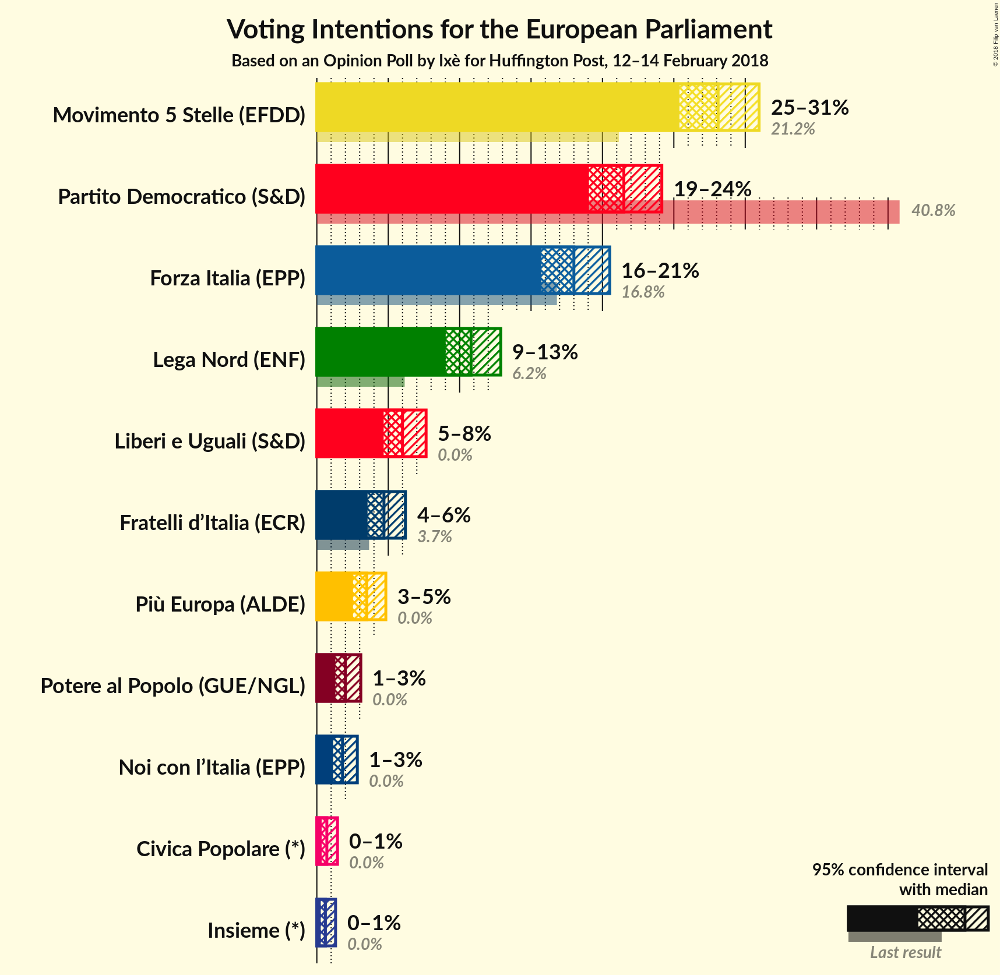
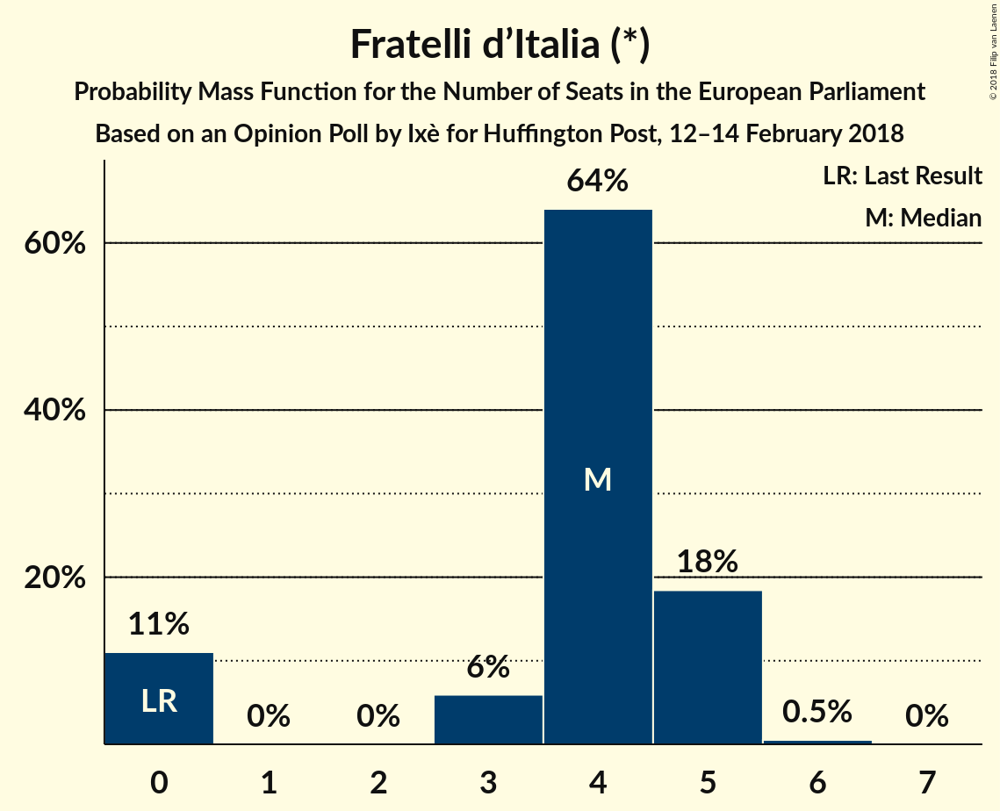

# Opinion Poll by Ixè for Huffington Post, 12–14 February 2018

<a href="#voting-intentions">Voting Intentions</a> | <a href="#seats">Seats</a> | <a href="#coalitions">Coalitions</a> | <a href="#technical-information">Technical Information</a>

## Voting Intentions

### Confidence Intervals

| Party | Last Result | Poll Result | 80% Confidence Interval | 90% Confidence Interval | 95% Confidence Interval | 99% Confidence Interval |
|:-----:|:-----------:|:-----------:|:-----------------------:|:-----------------------:|:-----------------------:|:-----------------------:|
| Movimento 5 Stelle (EFDD) | 21.2% | 28.1% | 26.3–30.0% |25.8–30.5% |25.4–31.0% |24.6–31.9% |
| Partito Democratico (S&D) | 40.8% | 21.5% | 19.9–23.2% |19.4–23.7% |19.1–24.2% |18.3–25.0% |
| Forza Italia (EPP) | 16.8% | 18.0% | 16.5–19.6% |16.1–20.1% |15.7–20.5% |15.0–21.3% |
| Lega Nord (ENF) | 6.2% | 10.8% | 9.6–12.2% |9.3–12.5% |9.0–12.9% |8.5–13.6% |
| Liberi e Uguali (S&D) | 0.0% | 6.0% | 5.1–7.1% |4.9–7.4% |4.7–7.7% |4.3–8.2% |
| Fratelli d’Italia (*) | 3.7% | 4.7% | 3.9–5.7% |3.7–6.0% |3.6–6.2% |3.2–6.7% |
| Più Europa (ALDE) | 0.0% | 3.5% | 2.9–4.4% |2.7–4.6% |2.5–4.8% |2.2–5.3% |
| Potere al Popolo (GUE/NGL) | 0.0% | 2.0% | 1.5–2.7% |1.4–2.9% |1.3–3.1% |1.1–3.4% |
| Noi con l’Italia (EPP) | 0.0% | 1.8% | 1.4–2.5% |1.2–2.7% |1.1–2.8% |1.0–3.2% |
| Civica Popolare (*) | 0.0% | 0.7% | 0.5–1.2% |0.4–1.3% |0.3–1.4% |0.2–1.7% |
| Insieme (*) | 0.0% | 0.6% | 0.4–1.1% |0.3–1.2% |0.3–1.3% |0.2–1.6% |

*Note:* The poll result column reflects the actual value used in the calculations. Published results may vary slightly, and in addition be rounded to fewer digits.

## Seats

### Confidence Intervals

| Party | Last Result | Median | 80% Confidence Interval | 90% Confidence Interval | 95% Confidence Interval | 99% Confidence Interval |
|:-----:|:-----------:|:------:|:-----------------------:|:-----------------------:|:-----------------------:|:-----------------------:|
| <a href="#movimento-5-stelle-(efdd)">Movimento 5 Stelle (EFDD)</a> | 17 | 24 | 21–25 |21–26 |21–27 |21–28 |
| <a href="#partito-democratico-(s&d)">Partito Democratico (S&D)</a> | 31 | 17 | 16–19 |15–19 |14–20 |14–20 |
| <a href="#forza-italia-(epp)">Forza Italia (EPP)</a> | 13 | 16 | 14–17 |14–17 |13–17 |13–18 |
| <a href="#lega-nord-(enf)">Lega Nord (ENF)</a> | 5 | 9 | 8–10 |8–10 |8–11 |7–12 |
| <a href="#liberi-e-uguali-(s&d)">Liberi e Uguali (S&D)</a> | 0 | 5 | 4–6 |4–6 |4–6 |4–7 |
| <a href="#fratelli-d’italia-(*)">Fratelli d’Italia (*)</a> | 0 | 4 | 0–5 |0–5 |0–5 |0–6 |
| <a href="#più-europa-(alde)">Più Europa (ALDE)</a> | 0 | 0 | 0–3 |0–4 |0–4 |0–4 |
| <a href="#potere-al-popolo-(gue/ngl)">Potere al Popolo (GUE/NGL)</a> | 0 | 0 | 0 |0 |0 |0 |
| <a href="#noi-con-l’italia-(epp)">Noi con l’Italia (EPP)</a> | 0 | 0 | 0 |0 |0 |0 |
| <a href="#civica-popolare-(*)">Civica Popolare (*)</a> | 0 | 0 | 0 |0 |0 |0 |
| <a href="#insieme-(*)">Insieme (*)</a> | 0 | 0 | 0 |0 |0 |0 |

### Movimento 5 Stelle (EFDD)

*For a full overview of the results for this party, see the [Movimento 5 Stelle (EFDD)](party-movimento5stelleefdd.html) page.*

| Number of Seats | Probability | Accumulated | Special Marks |
|:---------------:|:-----------:|:-----------:|:-------------:|
| 17 | 0% | 100% | Last Result |
| 18 | 0% | 100% |  |
| 19 | 0% | 100% |  |
| 20 | 0.4% | 100% |  |
| 21 | 16% | 99.6% |  |
| 22 | 6% | 83% |  |
| 23 | 24% | 78% |  |
| 24 | 34% | 54% | Median |
| 25 | 12% | 19% |  |
| 26 | 5% | 8% |  |
| 27 | 3% | 3% |  |
| 28 | 0.7% | 0.8% |  |
| 29 | 0% | 0% |  |

### Partito Democratico (S&D)

*For a full overview of the results for this party, see the [Partito Democratico (S&D)](party-partitodemocraticosd.html) page.*

| Number of Seats | Probability | Accumulated | Special Marks |
|:---------------:|:-----------:|:-----------:|:-------------:|
| 14 | 3% | 100% |  |
| 15 | 4% | 97% |  |
| 16 | 20% | 94% |  |
| 17 | 33% | 74% | Median |
| 18 | 29% | 42% |  |
| 19 | 10% | 12% |  |
| 20 | 3% | 3% |  |
| 21 | 0.1% | 0.2% |  |
| 22 | 0% | 0% |  |
| 23 | 0% | 0% |  |
| 24 | 0% | 0% |  |
| 25 | 0% | 0% |  |
| 26 | 0% | 0% |  |
| 27 | 0% | 0% |  |
| 28 | 0% | 0% |  |
| 29 | 0% | 0% |  |
| 30 | 0% | 0% |  |
| 31 | 0% | 0% | Last Result |

### Forza Italia (EPP)

*For a full overview of the results for this party, see the [Forza Italia (EPP)](party-forzaitaliaepp.html) page.*

| Number of Seats | Probability | Accumulated | Special Marks |
|:---------------:|:-----------:|:-----------:|:-------------:|
| 12 | 0.1% | 100% |  |
| 13 | 5% | 99.9% | Last Result |
| 14 | 12% | 95% |  |
| 15 | 27% | 83% |  |
| 16 | 42% | 57% | Median |
| 17 | 13% | 14% |  |
| 18 | 1.0% | 1.4% |  |
| 19 | 0.4% | 0.4% |  |
| 20 | 0% | 0% |  |

### Lega Nord (ENF)

*For a full overview of the results for this party, see the [Lega Nord (ENF)](party-leganordenf.html) page.*

| Number of Seats | Probability | Accumulated | Special Marks |
|:---------------:|:-----------:|:-----------:|:-------------:|
| 5 | 0% | 100% | Last Result |
| 6 | 0% | 100% |  |
| 7 | 0.9% | 100% |  |
| 8 | 24% | 99.1% |  |
| 9 | 45% | 75% | Median |
| 10 | 26% | 30% |  |
| 11 | 3% | 4% |  |
| 12 | 0.5% | 0.6% |  |
| 13 | 0% | 0% |  |

### Liberi e Uguali (S&D)

*For a full overview of the results for this party, see the [Liberi e Uguali (S&D)](party-liberieugualisd.html) page.*

| Number of Seats | Probability | Accumulated | Special Marks |
|:---------------:|:-----------:|:-----------:|:-------------:|
| 0 | 0.1% | 100% | Last Result |
| 1 | 0% | 99.9% |  |
| 2 | 0% | 99.9% |  |
| 3 | 0.2% | 99.9% |  |
| 4 | 16% | 99.7% |  |
| 5 | 63% | 84% | Median |
| 6 | 18% | 21% |  |
| 7 | 2% | 2% |  |
| 8 | 0.1% | 0.1% |  |
| 9 | 0% | 0% |  |

### Fratelli d’Italia (*)

*For a full overview of the results for this party, see the [Fratelli d’Italia (*)](party-fratellid’italia.html) page.*

| Number of Seats | Probability | Accumulated | Special Marks |
|:---------------:|:-----------:|:-----------:|:-------------:|
| 0 | 11% | 100% | Last Result |
| 1 | 0% | 89% |  |
| 2 | 0% | 89% |  |
| 3 | 6% | 89% |  |
| 4 | 64% | 83% | Median |
| 5 | 18% | 19% |  |
| 6 | 0.5% | 0.5% |  |
| 7 | 0% | 0% |  |

### Più Europa (ALDE)

*For a full overview of the results for this party, see the [Più Europa (ALDE)](party-piùeuropaalde.html) page.*

| Number of Seats | Probability | Accumulated | Special Marks |
|:---------------:|:-----------:|:-----------:|:-------------:|
| 0 | 71% | 100% | Last Result, Median |
| 1 | 0% | 29% |  |
| 2 | 0% | 29% |  |
| 3 | 19% | 29% |  |
| 4 | 9% | 9% |  |
| 5 | 0.3% | 0.3% |  |
| 6 | 0% | 0% |  |

### Potere al Popolo (GUE/NGL)

*For a full overview of the results for this party, see the [Potere al Popolo (GUE/NGL)](party-poterealpopologuengl.html) page.*

| Number of Seats | Probability | Accumulated | Special Marks |
|:---------------:|:-----------:|:-----------:|:-------------:|
| 0 | 100% | 100% | Last Result, Median |

### Noi con l’Italia (EPP)

*For a full overview of the results for this party, see the [Noi con l’Italia (EPP)](party-noiconl’italiaepp.html) page.*

| Number of Seats | Probability | Accumulated | Special Marks |
|:---------------:|:-----------:|:-----------:|:-------------:|
| 0 | 100% | 100% | Last Result, Median |

### Civica Popolare (*)

*For a full overview of the results for this party, see the [Civica Popolare (*)](party-civicapopolare.html) page.*

| Number of Seats | Probability | Accumulated | Special Marks |
|:---------------:|:-----------:|:-----------:|:-------------:|
| 0 | 100% | 100% | Last Result, Median |

### Insieme (*)

*For a full overview of the results for this party, see the [Insieme (*)](party-insieme.html) page.*

| Number of Seats | Probability | Accumulated | Special Marks |
|:---------------:|:-----------:|:-----------:|:-------------:|
| 0 | 100% | 100% | Last Result, Median |

## Coalitions

### Confidence Intervals

| Coalition | Last Result | Median | Majority? | 80% Confidence Interval | 90% Confidence Interval | 95% Confidence Interval | 99% Confidence Interval |
|:---------:|:-----------:|:------:|:---------:|:-----------------------:|:-----------------------:|:-----------------------:|:-----------------------:|
| Movimento 5 Stelle (EFDD) | 17 | 24 | 0% | 21–25 | 21–26 | 21–27 | 21–28 |
| Partito Democratico (S&D) – Liberi e Uguali (S&D) | 31 | 22 | 0% | 21–24 | 20–24 | 19–25 | 19–26 |
| Lega Nord (ENF) | 5 | 9 | 0% | 8–10 | 8–10 | 8–11 | 7–12 |
| Più Europa (ALDE) | 0 | 0 | 0% | 0–3 | 0–4 | 0–4 | 0–4 |
| Potere al Popolo (GUE/NGL) | 0 | 0 | 0% | 0 | 0 | 0 | 0 |

### Movimento 5 Stelle (EFDD)

| Number of Seats | Probability | Accumulated | Special Marks |
|:---------------:|:-----------:|:-----------:|:-------------:|
| 17 | 0% | 100% | Last Result |
| 18 | 0% | 100% |  |
| 19 | 0% | 100% |  |
| 20 | 0.4% | 100% |  |
| 21 | 16% | 99.6% |  |
| 22 | 6% | 83% |  |
| 23 | 24% | 78% |  |
| 24 | 34% | 54% | Median |
| 25 | 12% | 19% |  |
| 26 | 5% | 8% |  |
| 27 | 3% | 3% |  |
| 28 | 0.7% | 0.8% |  |
| 29 | 0% | 0% |  |

### Partito Democratico (S&D) – Liberi e Uguali (S&D)

| Number of Seats | Probability | Accumulated | Special Marks |
|:---------------:|:-----------:|:-----------:|:-------------:|
| 17 | 0.1% | 100% |  |
| 18 | 0.3% | 99.9% |  |
| 19 | 3% | 99.7% |  |
| 20 | 3% | 97% |  |
| 21 | 20% | 93% |  |
| 22 | 26% | 73% | Median |
| 23 | 34% | 48% |  |
| 24 | 11% | 14% |  |
| 25 | 2% | 3% |  |
| 26 | 0.4% | 0.8% |  |
| 27 | 0.3% | 0.3% |  |
| 28 | 0% | 0% |  |
| 29 | 0% | 0% |  |
| 30 | 0% | 0% |  |
| 31 | 0% | 0% | Last Result |

### Lega Nord (ENF)

| Number of Seats | Probability | Accumulated | Special Marks |
|:---------------:|:-----------:|:-----------:|:-------------:|
| 5 | 0% | 100% | Last Result |
| 6 | 0% | 100% |  |
| 7 | 0.9% | 100% |  |
| 8 | 24% | 99.1% |  |
| 9 | 45% | 75% | Median |
| 10 | 26% | 30% |  |
| 11 | 3% | 4% |  |
| 12 | 0.5% | 0.6% |  |
| 13 | 0% | 0% |  |

### Più Europa (ALDE)

| Number of Seats | Probability | Accumulated | Special Marks |
|:---------------:|:-----------:|:-----------:|:-------------:|
| 0 | 71% | 100% | Last Result, Median |
| 1 | 0% | 29% |  |
| 2 | 0% | 29% |  |
| 3 | 19% | 29% |  |
| 4 | 9% | 9% |  |
| 5 | 0.3% | 0.3% |  |
| 6 | 0% | 0% |  |

### Potere al Popolo (GUE/NGL)

| Number of Seats | Probability | Accumulated | Special Marks |
|:---------------:|:-----------:|:-----------:|:-------------:|
| 0 | 100% | 100% | Last Result, Median |

## Technical Information

### Opinion Poll

+ **Polling firm:** Ixè
+ **Commissioner(s):** Huffington Post
+ **Fieldwork period:** 12–14 February 2018

### Calculations

+ **Sample size:** 1000
+ **Simulations done:** 1,048,576
+ **Error estimate:** 3.41%

