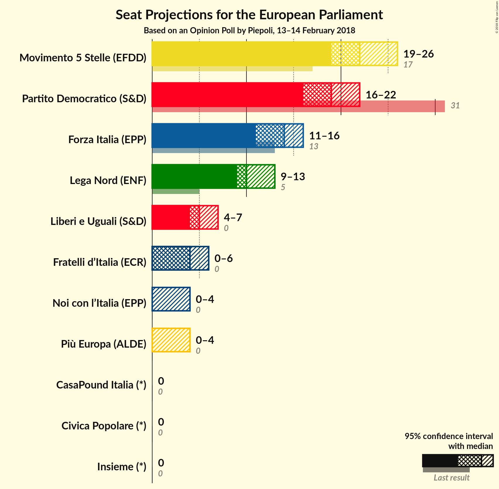

# Opinion Poll by Piepoli, 13–14 February 2018

<a href="#voting-intentions">Voting Intentions</a> | <a href="#seats">Seats</a> | <a href="#coalitions">Coalitions</a> | <a href="#technical-information">Technical Information</a>

## Voting Intentions

### Confidence Intervals

| Party | Last Result | Poll Result | 80% Confidence Interval | 90% Confidence Interval | 95% Confidence Interval | 99% Confidence Interval |
|:-----:|:-----------:|:-----------:|:-----------------------:|:-----------------------:|:-----------------------:|:-----------------------:|
| Movimento 5 Stelle (EFDD) | 21.1% | 26.9% | 24.5–29.6% |23.8–30.3% |23.2–31.0% |22.1–32.3% |
| Partito Democratico (S&D) | 40.8% | 24.6% | 22.2–27.1% |21.6–27.9% |21.0–28.5% |19.9–29.8% |
| Forza Italia (EPP) | 16.8% | 16.0% | 14.1–18.3% |13.5–18.9% |13.1–19.5% |12.2–20.6% |
| Lega Nord (ENF) | 6.2% | 13.1% | 11.3–15.2% |10.8–15.8% |10.4–16.3% |9.6–17.4% |
| Liberi e Uguali (S&D) | 0.0% | 5.9% | 4.8–7.5% |4.5–8.0% |4.2–8.4% |3.7–9.2% |
| Fratelli d’Italia (*) | 3.7% | 5.0% | N/A |N/A |N/A |N/A |
| Più Europa (ALDE) | 0.0% | 3.0% | N/A |N/A |N/A |N/A |
| Noi con l’Italia (EPP) | 0.0% | 3.0% | N/A |N/A |N/A |N/A |
| Insieme (*) | 0.0% | 1.0% | N/A |N/A |N/A |N/A |
| Civica Popolare (*) | 0.0% | 0.6% | N/A |N/A |N/A |N/A |
| CasaPound Italia (*) | 0.0% | 0.6% | N/A |N/A |N/A |N/A |

*Note:* The poll result column reflects the actual value used in the calculations. Published results may vary slightly, and in addition be rounded to fewer digits.

## Seats

### Confidence Intervals

| Party | Last Result | Median | 80% Confidence Interval | 90% Confidence Interval | 95% Confidence Interval | 99% Confidence Interval |
|:-----:|:-----------:|:------:|:-----------------------:|:-----------------------:|:-----------------------:|:-----------------------:|
| <a href="#movimento-5-stelle-(efdd)">Movimento 5 Stelle (EFDD)</a> | 17 | 22 | 20–23 |19–25 |19–26 |18–27 |
| <a href="#partito-democratico-(s&d)">Partito Democratico (S&D)</a> | 31 | 19 | 18–20 |17–21 |16–22 |15–24 |
| <a href="#forza-italia-(epp)">Forza Italia (EPP)</a> | 13 | 14 | 11–15 |11–16 |11–16 |10–18 |
| <a href="#lega-nord-(enf)">Lega Nord (ENF)</a> | 5 | 10 | 9–12 |9–13 |9–13 |8–14 |
| <a href="#liberi-e-uguali-(s&d)">Liberi e Uguali (S&D)</a> | 0 | 5 | 4–6 |4–6 |4–7 |0–7 |
| <a href="#fratelli-d’italia-(*)">Fratelli d’Italia (*)</a> | 0 | N/A | N/A |N/A |N/A |N/A |
| <a href="#più-europa-(alde)">Più Europa (ALDE)</a> | 0 | N/A | N/A |N/A |N/A |N/A |
| <a href="#noi-con-l’italia-(epp)">Noi con l’Italia (EPP)</a> | 0 | N/A | N/A |N/A |N/A |N/A |
| <a href="#insieme-(*)">Insieme (*)</a> | 0 | N/A | N/A |N/A |N/A |N/A |
| <a href="#civica-popolare-(*)">Civica Popolare (*)</a> | 0 | N/A | N/A |N/A |N/A |N/A |
| <a href="#casapound-italia-(*)">CasaPound Italia (*)</a> | 0 | N/A | N/A |N/A |N/A |N/A |

