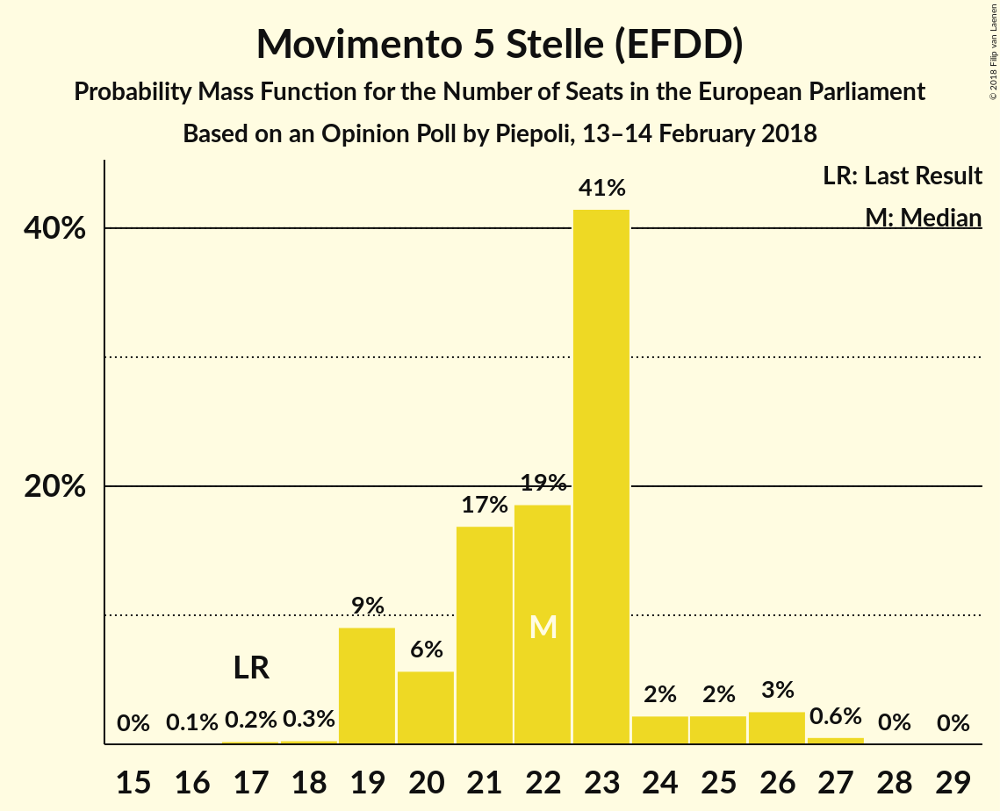
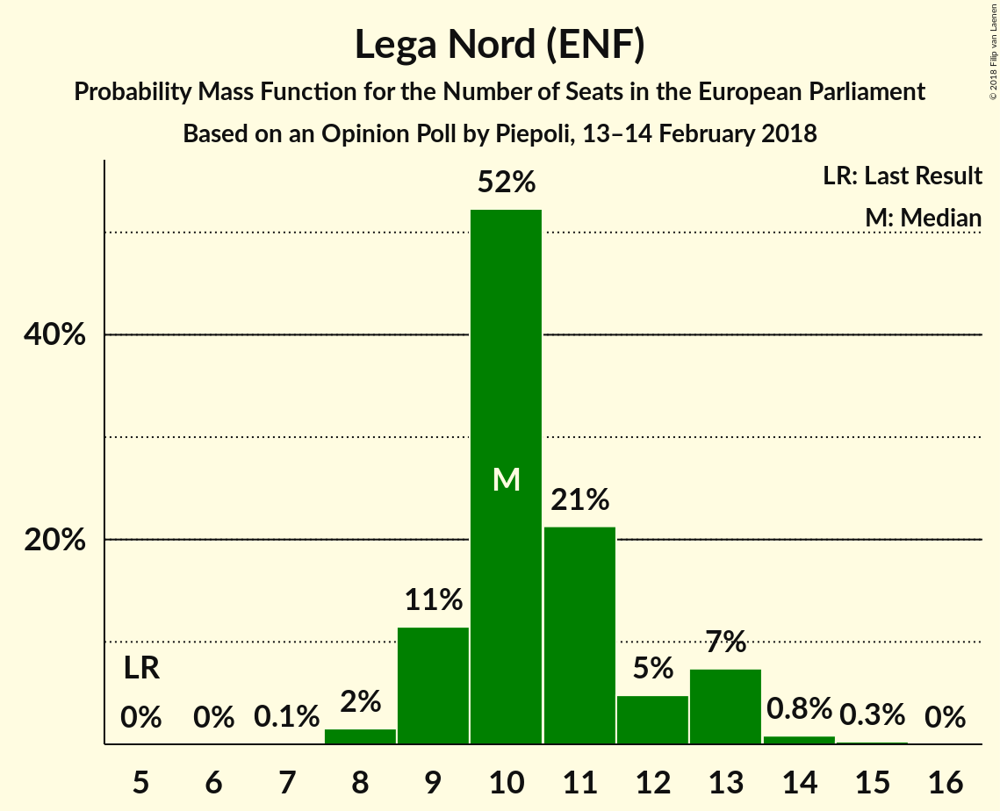
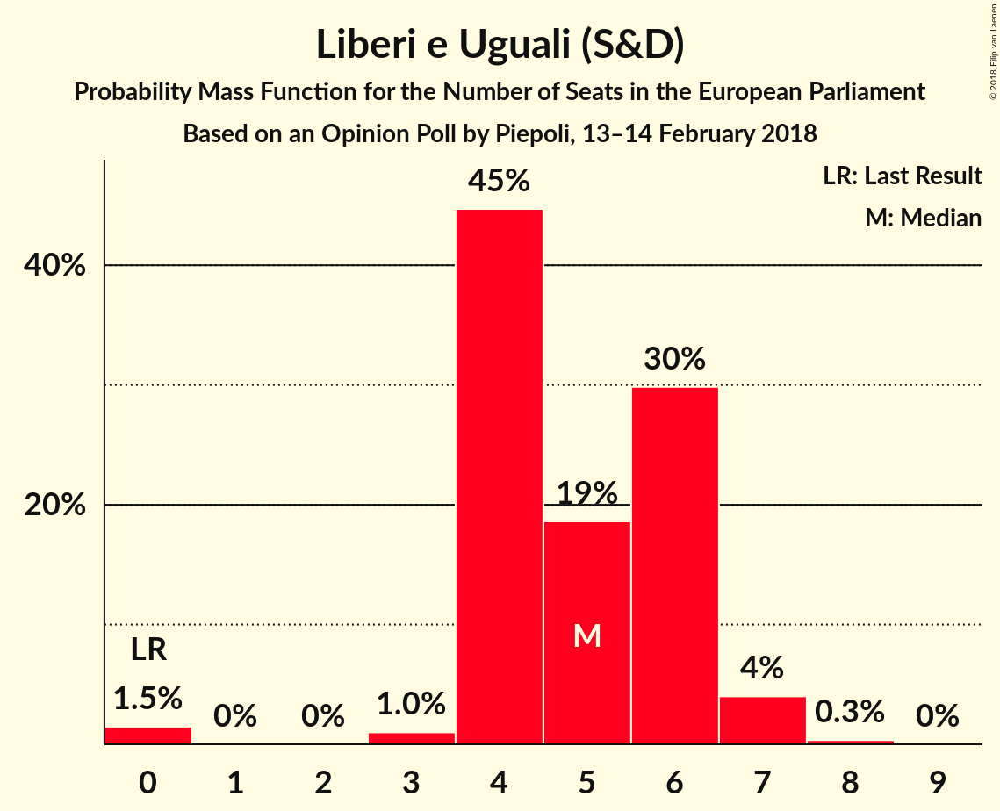
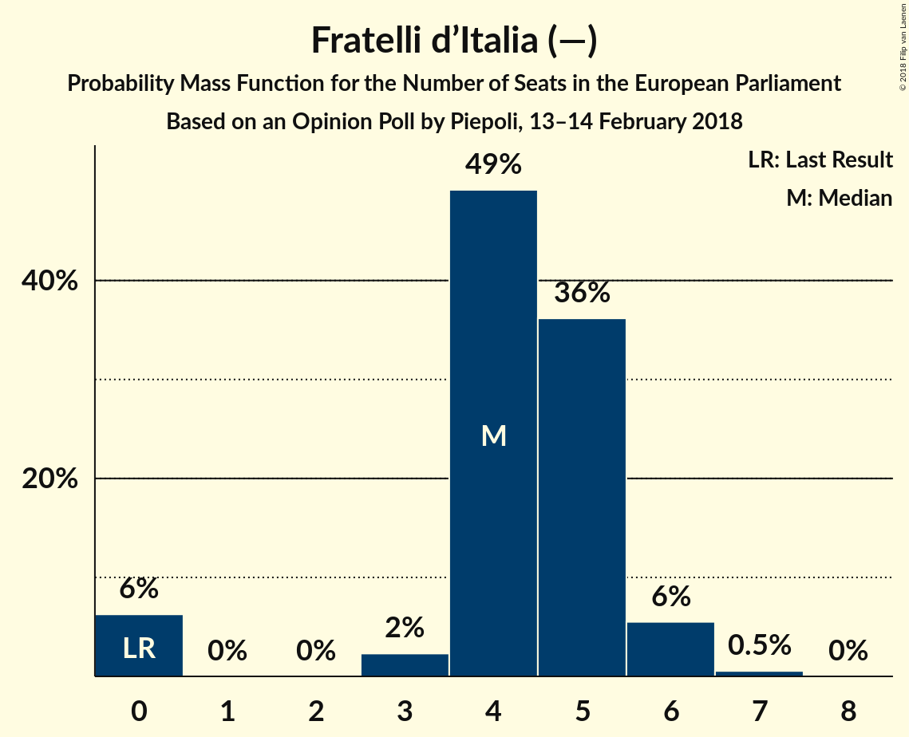
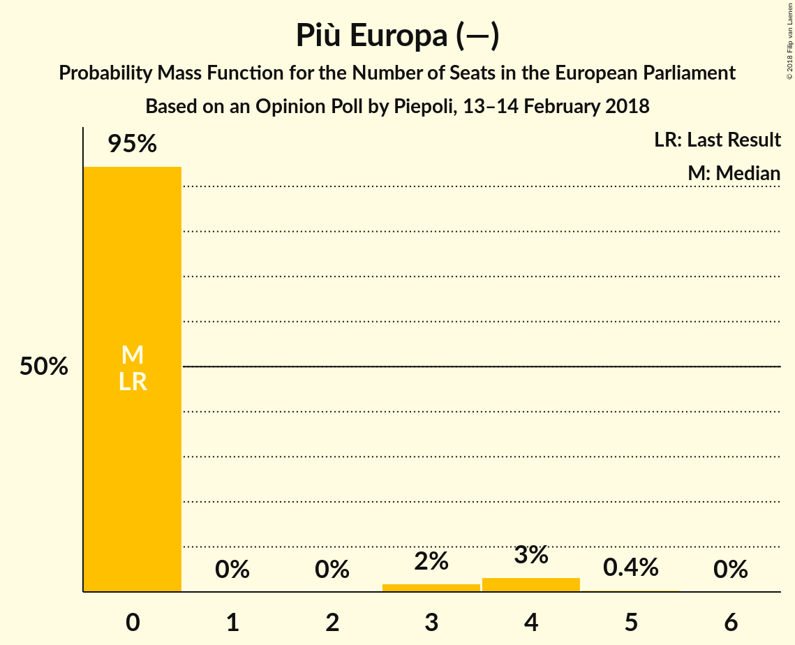
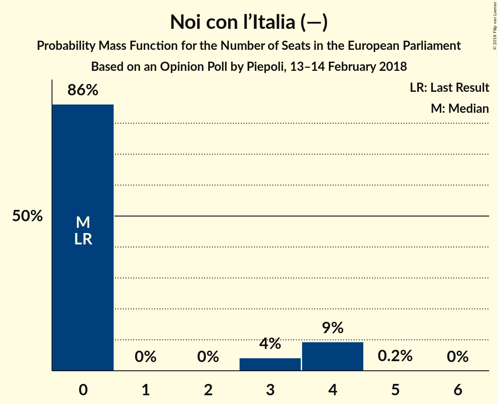
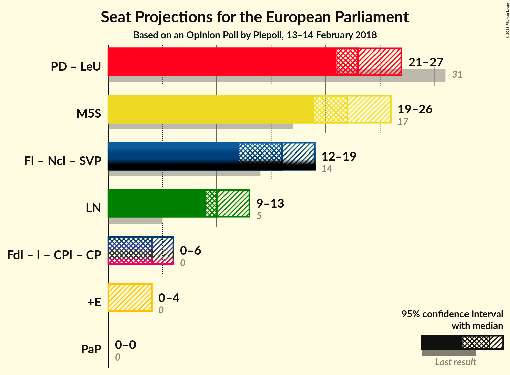

# Opinion Poll by Piepoli, 13–14 February 2018

<a href="#voting-intentions">Voting Intentions</a> | <a href="#seats">Seats</a> | <a href="#coalitions">Coalitions</a> | <a href="#technical-information">Technical Information</a>

## Voting Intentions

### Confidence Intervals

| Party | Last Result | Poll Result | 80% Confidence Interval | 90% Confidence Interval | 95% Confidence Interval | 99% Confidence Interval |
|:-----:|:-----------:|:-----------:|:-----------------------:|:-----------------------:|:-----------------------:|:-----------------------:|
| Movimento 5 Stelle (EFDD) | 21.1% | 26.9% | 24.5–29.6% |23.8–30.3% |23.2–31.0% |22.1–32.3% |
| Partito Democratico (S&D) | 40.8% | 24.6% | 22.2–27.1% |21.6–27.9% |21.0–28.5% |19.9–29.8% |
| Forza Italia (EPP) | 16.8% | 16.0% | 14.1–18.3% |13.5–18.9% |13.1–19.5% |12.2–20.6% |
| Lega Nord (ENF) | 6.2% | 13.1% | 11.3–15.2% |10.8–15.8% |10.4–16.3% |9.6–17.4% |
| Liberi e Uguali (S&D) | 0.0% | 5.9% | 4.8–7.5% |4.5–8.0% |4.2–8.4% |3.7–9.2% |
| Fratelli d’Italia (—) | 3.7% | 5.0% | 3.9–6.4% |3.6–6.8% |3.4–7.2% |2.9–8.0% |
| Più Europa (—) | 0.0% | 3.0% | 2.2–4.2% |2.0–4.5% |1.8–4.8% |1.5–5.5% |
| Noi con l’Italia (—) | 0.0% | 3.0% | 2.2–4.2% |2.0–4.5% |1.8–4.8% |1.5–5.5% |
| Insieme (—) | 0.0% | 1.0% | 0.6–1.8% |0.5–2.1% |0.4–2.3% |0.3–2.8% |
| Civica Popolare (—) | 0.0% | 0.6% | 0.3–1.3% |0.3–1.5% |0.2–1.7% |0.1–2.2% |
| CasaPound Italia (—) | 0.0% | 0.6% | 0.3–1.3% |0.3–1.5% |0.2–1.7% |0.1–2.2% |

*Note:* The poll result column reflects the actual value used in the calculations. Published results may vary slightly, and in addition be rounded to fewer digits.

## Seats

### Confidence Intervals

| Party | Last Result | Median | 80% Confidence Interval | 90% Confidence Interval | 95% Confidence Interval | 99% Confidence Interval |
|:-----:|:-----------:|:------:|:-----------------------:|:-----------------------:|:-----------------------:|:-----------------------:|
| <a href="#movimento-5-stelle-(efdd)">Movimento 5 Stelle (EFDD)</a> | 17 | 20 | 18–24 |18–25 |18–25 |17–26 |
| <a href="#partito-democratico-(s&d)">Partito Democratico (S&D)</a> | 31 | 19 | 16–20 |16–21 |15–22 |15–23 |
| <a href="#forza-italia-(epp)">Forza Italia (EPP)</a> | 13 | 13 | 11–16 |10–16 |10–16 |10–16 |
| <a href="#lega-nord-(enf)">Lega Nord (ENF)</a> | 5 | 11 | 10–12 |9–13 |8–13 |8–14 |
| <a href="#liberi-e-uguali-(s&d)">Liberi e Uguali (S&D)</a> | 0 | 5 | 4–6 |3–6 |0–7 |0–7 |
| <a href="#fratelli-d’italia-(—)">Fratelli d’Italia (—)</a> | 0 | 4 | 0–6 |0–6 |0–6 |0–6 |
| <a href="#più-europa-(—)">Più Europa (—)</a> | 0 | 0 | 0–3 |0–3 |0–3 |0–4 |
| <a href="#noi-con-l’italia-(—)">Noi con l’Italia (—)</a> | 0 | 0 | 0 |0–4 |0–4 |0–4 |
| <a href="#insieme-(—)">Insieme (—)</a> | 0 | 0 | 0 |0 |0 |0 |
| <a href="#civica-popolare-(—)">Civica Popolare (—)</a> | 0 | 0 | 0 |0 |0 |0 |
| <a href="#casapound-italia-(—)">CasaPound Italia (—)</a> | 0 | 0 | 0 |0 |0 |0 |

### Movimento 5 Stelle (EFDD)

*For a full overview of the results for this party, see the [Movimento 5 Stelle (EFDD)](party-movimento5stelleefdd.html) page.*

| Number of Seats | Probability | Accumulated | Special Marks |
|:---------------:|:-----------:|:-----------:|:-------------:|
| 15 | 0.1% | 100% |  |
| 16 | 0.3% | 99.9% |  |
| 17 | 0.2% | 99.6% | Last Result |
| 18 | 30% | 99.4% |  |
| 19 | 14% | 69% |  |
| 20 | 21% | 55% | Median |
| 21 | 7% | 34% |  |
| 22 | 10% | 27% |  |
| 23 | 5% | 18% |  |
| 24 | 7% | 12% |  |
| 25 | 4% | 5% |  |
| 26 | 0.6% | 0.6% |  |
| 27 | 0% | 0% |  |

### Partito Democratico (S&D)

*For a full overview of the results for this party, see the [Partito Democratico (S&D)](party-partitodemocraticosd.html) page.*

| Number of Seats | Probability | Accumulated | Special Marks |
|:---------------:|:-----------:|:-----------:|:-------------:|
| 14 | 0.4% | 100% |  |
| 15 | 3% | 99.5% |  |
| 16 | 7% | 96% |  |
| 17 | 10% | 90% |  |
| 18 | 16% | 80% |  |
| 19 | 47% | 64% | Median |
| 20 | 9% | 17% |  |
| 21 | 5% | 8% |  |
| 22 | 1.4% | 3% |  |
| 23 | 1.3% | 1.4% |  |
| 24 | 0.1% | 0.1% |  |
| 25 | 0% | 0% |  |
| 26 | 0% | 0% |  |
| 27 | 0% | 0% |  |
| 28 | 0% | 0% |  |
| 29 | 0% | 0% |  |
| 30 | 0% | 0% |  |
| 31 | 0% | 0% | Last Result |

### Forza Italia (EPP)

*For a full overview of the results for this party, see the [Forza Italia (EPP)](party-forzaitaliaepp.html) page.*

| Number of Seats | Probability | Accumulated | Special Marks |
|:---------------:|:-----------:|:-----------:|:-------------:|
| 9 | 0.3% | 100% |  |
| 10 | 6% | 99.7% |  |
| 11 | 10% | 94% |  |
| 12 | 25% | 84% |  |
| 13 | 9% | 59% | Last Result, Median |
| 14 | 36% | 50% |  |
| 15 | 3% | 14% |  |
| 16 | 11% | 11% |  |
| 17 | 0.1% | 0.1% |  |
| 18 | 0% | 0% |  |

### Lega Nord (ENF)

*For a full overview of the results for this party, see the [Lega Nord (ENF)](party-leganordenf.html) page.*

| Number of Seats | Probability | Accumulated | Special Marks |
|:---------------:|:-----------:|:-----------:|:-------------:|
| 5 | 0% | 100% | Last Result |
| 6 | 0% | 100% |  |
| 7 | 0.2% | 100% |  |
| 8 | 3% | 99.8% |  |
| 9 | 7% | 97% |  |
| 10 | 15% | 90% |  |
| 11 | 59% | 75% | Median |
| 12 | 9% | 16% |  |
| 13 | 6% | 8% |  |
| 14 | 2% | 2% |  |
| 15 | 0.1% | 0.1% |  |
| 16 | 0% | 0% |  |

### Liberi e Uguali (S&D)

*For a full overview of the results for this party, see the [Liberi e Uguali (S&D)](party-liberieugualisd.html) page.*

| Number of Seats | Probability | Accumulated | Special Marks |
|:---------------:|:-----------:|:-----------:|:-------------:|
| 0 | 3% | 100% | Last Result |
| 1 | 0% | 97% |  |
| 2 | 0% | 97% |  |
| 3 | 4% | 97% |  |
| 4 | 27% | 93% |  |
| 5 | 21% | 66% | Median |
| 6 | 43% | 45% |  |
| 7 | 2% | 3% |  |
| 8 | 0.2% | 0.2% |  |
| 9 | 0% | 0% |  |

### Fratelli d’Italia (—)

*For a full overview of the results for this party, see the [Fratelli d’Italia (—)](party-fratellid’italia—.html) page.*

| Number of Seats | Probability | Accumulated | Special Marks |
|:---------------:|:-----------:|:-----------:|:-------------:|
| 0 | 17% | 100% | Last Result |
| 1 | 0% | 83% |  |
| 2 | 0% | 83% |  |
| 3 | 17% | 83% |  |
| 4 | 42% | 67% | Median |
| 5 | 10% | 24% |  |
| 6 | 14% | 14% |  |
| 7 | 0.4% | 0.4% |  |
| 8 | 0% | 0% |  |

### Più Europa (—)

*For a full overview of the results for this party, see the [Più Europa (—)](party-piùeuropa—.html) page.*

| Number of Seats | Probability | Accumulated | Special Marks |
|:---------------:|:-----------:|:-----------:|:-------------:|
| 0 | 89% | 100% | Last Result, Median |
| 1 | 0% | 11% |  |
| 2 | 0% | 11% |  |
| 3 | 9% | 11% |  |
| 4 | 2% | 2% |  |
| 5 | 0.1% | 0.1% |  |
| 6 | 0% | 0% |  |

### Noi con l’Italia (—)

*For a full overview of the results for this party, see the [Noi con l’Italia (—)](party-noiconl’italia—.html) page.*

| Number of Seats | Probability | Accumulated | Special Marks |
|:---------------:|:-----------:|:-----------:|:-------------:|
| 0 | 92% | 100% | Last Result, Median |
| 1 | 0% | 8% |  |
| 2 | 0% | 8% |  |
| 3 | 2% | 8% |  |
| 4 | 5% | 6% |  |
| 5 | 0.2% | 0.2% |  |
| 6 | 0% | 0% |  |

### Insieme (—)

*For a full overview of the results for this party, see the [Insieme (—)](party-insieme—.html) page.*

| Number of Seats | Probability | Accumulated | Special Marks |
|:---------------:|:-----------:|:-----------:|:-------------:|
| 0 | 100% | 100% | Last Result, Median |

### Civica Popolare (—)

*For a full overview of the results for this party, see the [Civica Popolare (—)](party-civicapopolare—.html) page.*

| Number of Seats | Probability | Accumulated | Special Marks |
|:---------------:|:-----------:|:-----------:|:-------------:|
| 0 | 100% | 100% | Last Result, Median |

### CasaPound Italia (—)

*For a full overview of the results for this party, see the [CasaPound Italia (—)](party-casapounditalia—.html) page.*

| Number of Seats | Probability | Accumulated | Special Marks |
|:---------------:|:-----------:|:-----------:|:-------------:|
| 0 | 100% | 100% | Last Result, Median |

## Coalitions

### Confidence Intervals

| Coalition | Last Result | Median | Majority? | 80% Confidence Interval | 90% Confidence Interval | 95% Confidence Interval | 99% Confidence Interval |
|:---------:|:-----------:|:------:|:---------:|:-----------------------:|:-----------------------:|:-----------------------:|:-----------------------:|
| Partito Democratico (S&D) – Liberi e Uguali (S&D) | 31 | 24 | 0% | 21–26 | 20–26 | 20–27 | 19–27 |
| Movimento 5 Stelle (EFDD) | 17 | 20 | 0% | 18–24 | 18–25 | 18–25 | 17–26 |
| Lega Nord (ENF) | 5 | 11 | 0% | 10–12 | 9–13 | 8–13 | 8–14 |
| Fratelli d’Italia (—) – Noi con l’Italia (—) – Più Europa (—) – Insieme (—) – CasaPound Italia (—) – Civica Popolare (—) | 0 | 4 | 0% | 0–8 | 0–9 | 0–9 | 0–10 |

### Partito Democratico (S&D) – Liberi e Uguali (S&D)

| Number of Seats | Probability | Accumulated | Special Marks |
|:---------------:|:-----------:|:-----------:|:-------------:|
| 17 | 0% | 100% |  |
| 18 | 0.4% | 99.9% |  |
| 19 | 1.1% | 99.5% |  |
| 20 | 5% | 98% |  |
| 21 | 12% | 93% |  |
| 22 | 9% | 81% |  |
| 23 | 17% | 72% |  |
| 24 | 9% | 55% | Median |
| 25 | 35% | 46% |  |
| 26 | 7% | 11% |  |
| 27 | 3% | 4% |  |
| 28 | 0.1% | 0.2% |  |
| 29 | 0% | 0% |  |
| 30 | 0% | 0% |  |
| 31 | 0% | 0% | Last Result |

### Movimento 5 Stelle (EFDD)

| Number of Seats | Probability | Accumulated | Special Marks |
|:---------------:|:-----------:|:-----------:|:-------------:|
| 15 | 0.1% | 100% |  |
| 16 | 0.3% | 99.9% |  |
| 17 | 0.2% | 99.6% | Last Result |
| 18 | 30% | 99.4% |  |
| 19 | 14% | 69% |  |
| 20 | 21% | 55% | Median |
| 21 | 7% | 34% |  |
| 22 | 10% | 27% |  |
| 23 | 5% | 18% |  |
| 24 | 7% | 12% |  |
| 25 | 4% | 5% |  |
| 26 | 0.6% | 0.6% |  |
| 27 | 0% | 0% |  |

### Lega Nord (ENF)

| Number of Seats | Probability | Accumulated | Special Marks |
|:---------------:|:-----------:|:-----------:|:-------------:|
| 5 | 0% | 100% | Last Result |
| 6 | 0% | 100% |  |
| 7 | 0.2% | 100% |  |
| 8 | 3% | 99.8% |  |
| 9 | 7% | 97% |  |
| 10 | 15% | 90% |  |
| 11 | 59% | 75% | Median |
| 12 | 9% | 16% |  |
| 13 | 6% | 8% |  |
| 14 | 2% | 2% |  |
| 15 | 0.1% | 0.1% |  |
| 16 | 0% | 0% |  |

### Fratelli d’Italia (—) – Noi con l’Italia (—) – Più Europa (—) – Insieme (—) – CasaPound Italia (—) – Civica Popolare (—)

| Number of Seats | Probability | Accumulated | Special Marks |
|:---------------:|:-----------:|:-----------:|:-------------:|
| 0 | 13% | 100% | Last Result |
| 1 | 0% | 87% |  |
| 2 | 0% | 87% |  |
| 3 | 18% | 87% |  |
| 4 | 39% | 69% | Median |
| 5 | 5% | 31% |  |
| 6 | 11% | 26% |  |
| 7 | 3% | 14% |  |
| 8 | 6% | 12% |  |
| 9 | 5% | 6% |  |
| 10 | 0.5% | 0.6% |  |
| 11 | 0.1% | 0.2% |  |
| 12 | 0.1% | 0.1% |  |
| 13 | 0% | 0% |  |

## Technical Information

### Opinion Poll

+ **Polling firm:** Piepoli
+ **Commissioner(s):** —
+ **Fieldwork period:** 13–14 February 2018

### Calculations

+ **Sample size:** 505
+ **Simulations done:** 524,288
+ **Error estimate:** 6.13%

