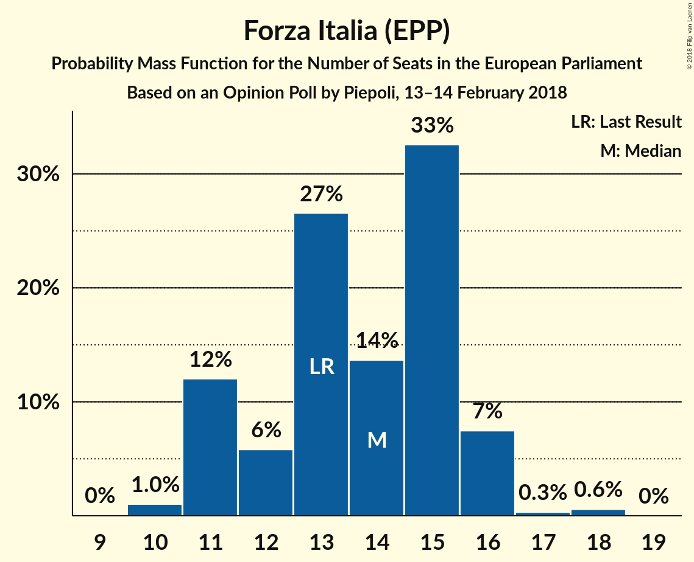

# Opinion Poll by Piepoli, 13–14 February 2018

<a href="#voting-intentions">Voting Intentions</a> | <a href="#seats">Seats</a> | <a href="#coalitions">Coalitions</a> | <a href="#technical-information">Technical Information</a>

## Voting Intentions

### Confidence Intervals

| Party | Last Result | Poll Result | 80% Confidence Interval | 90% Confidence Interval | 95% Confidence Interval | 99% Confidence Interval |
|:-----:|:-----------:|:-----------:|:-----------------------:|:-----------------------:|:-----------------------:|:-----------------------:|
| Movimento 5 Stelle (EFDD) | 21.1% | 26.9% | 24.5–29.6% |23.8–30.3% |23.2–31.0% |22.1–32.3% |
| Partito Democratico (S&D) | 40.8% | 24.6% | 22.2–27.1% |21.6–27.9% |21.0–28.5% |19.9–29.8% |
| Forza Italia (EPP) | 16.8% | 16.0% | 14.1–18.3% |13.5–18.9% |13.1–19.5% |12.2–20.6% |
| Lega Nord (ENF) | 6.2% | 13.1% | 11.3–15.2% |10.8–15.8% |10.4–16.3% |9.6–17.4% |
| Liberi e Uguali (S&D) | 0.0% | 5.9% | 4.8–7.5% |4.5–8.0% |4.2–8.4% |3.7–9.2% |
| Fratelli d’Italia (*) | 3.7% | 5.0% | 3.9–6.4% |3.6–6.8% |3.4–7.2% |2.9–8.0% |
| Più Europa (ALDE) | 0.0% | 3.0% | 2.2–4.2% |2.0–4.5% |1.8–4.8% |1.5–5.5% |
| Noi con l’Italia (EPP) | 0.0% | 3.0% | 2.2–4.2% |2.0–4.5% |1.8–4.8% |1.5–5.5% |
| Insieme (*) | 0.0% | 1.0% | 0.6–1.8% |0.5–2.1% |0.4–2.3% |0.3–2.8% |
| Civica Popolare (*) | 0.0% | 0.6% | 0.3–1.3% |0.3–1.5% |0.2–1.7% |0.1–2.2% |
| CasaPound Italia (*) | 0.0% | 0.6% | 0.3–1.3% |0.3–1.5% |0.2–1.7% |0.1–2.2% |

*Note:* The poll result column reflects the actual value used in the calculations. Published results may vary slightly, and in addition be rounded to fewer digits.

## Seats

### Confidence Intervals

| Party | Last Result | Median | 80% Confidence Interval | 90% Confidence Interval | 95% Confidence Interval | 99% Confidence Interval |
|:-----:|:-----------:|:------:|:-----------------------:|:-----------------------:|:-----------------------:|:-----------------------:|
| <a href="#movimento-5-stelle-(efdd)">Movimento 5 Stelle (EFDD)</a> | 17 | 20 | 19–23 |19–25 |19–25 |18–25 |
| <a href="#partito-democratico-(s&d)">Partito Democratico (S&D)</a> | 31 | 20 | 17–21 |17–21 |16–21 |16–22 |
| <a href="#forza-italia-(epp)">Forza Italia (EPP)</a> | 13 | 14 | 11–16 |11–16 |11–16 |10–16 |
| <a href="#lega-nord-(enf)">Lega Nord (ENF)</a> | 5 | 11 | 10–12 |10–13 |9–13 |8–14 |
| <a href="#liberi-e-uguali-(s&d)">Liberi e Uguali (S&D)</a> | 0 | 5 | 4–6 |3–6 |0–6 |0–7 |
| <a href="#fratelli-d’italia-(*)">Fratelli d’Italia (*)</a> | 0 | 5 | 4–6 |0–6 |0–7 |0–7 |
| <a href="#più-europa-(alde)">Più Europa (ALDE)</a> | 0 | 0 | 0 |0–3 |0–4 |0–4 |
| <a href="#noi-con-l’italia-(epp)">Noi con l’Italia (EPP)</a> | 0 | 0 | 0 |0–4 |0–4 |0–4 |
| <a href="#insieme-(*)">Insieme (*)</a> | 0 | 0 | 0 |0 |0 |0 |
| <a href="#civica-popolare-(*)">Civica Popolare (*)</a> | 0 | 0 | 0 |0 |0 |0 |
| <a href="#casapound-italia-(*)">CasaPound Italia (*)</a> | 0 | 0 | 0 |0 |0 |0 |

### Movimento 5 Stelle (EFDD)

*For a full overview of the results for this party, see the [Movimento 5 Stelle (EFDD)](party-movimento5stelleefdd.html) page.*

| Number of Seats | Probability | Accumulated | Special Marks |
|:---------------:|:-----------:|:-----------:|:-------------:|
| 16 | 0.1% | 100% |  |
| 17 | 0.3% | 99.9% | Last Result |
| 18 | 0.3% | 99.5% |  |
| 19 | 39% | 99.2% |  |
| 20 | 23% | 60% | Median |
| 21 | 15% | 37% |  |
| 22 | 1.5% | 23% |  |
| 23 | 12% | 21% |  |
| 24 | 3% | 9% |  |
| 25 | 6% | 7% |  |
| 26 | 0.1% | 0.5% |  |
| 27 | 0.3% | 0.3% |  |
| 28 | 0% | 0% |  |

### Partito Democratico (S&D)

*For a full overview of the results for this party, see the [Partito Democratico (S&D)](party-partitodemocraticosd.html) page.*

| Number of Seats | Probability | Accumulated | Special Marks |
|:---------------:|:-----------:|:-----------:|:-------------:|
| 15 | 0.3% | 100% |  |
| 16 | 4% | 99.6% |  |
| 17 | 8% | 96% |  |
| 18 | 14% | 89% |  |
| 19 | 4% | 75% |  |
| 20 | 55% | 71% | Median |
| 21 | 14% | 15% |  |
| 22 | 1.3% | 2% |  |
| 23 | 0.1% | 0.4% |  |
| 24 | 0.3% | 0.4% |  |
| 25 | 0% | 0% |  |
| 26 | 0% | 0% |  |
| 27 | 0% | 0% |  |
| 28 | 0% | 0% |  |
| 29 | 0% | 0% |  |
| 30 | 0% | 0% |  |
| 31 | 0% | 0% | Last Result |

### Forza Italia (EPP)

*For a full overview of the results for this party, see the [Forza Italia (EPP)](party-forzaitaliaepp.html) page.*

| Number of Seats | Probability | Accumulated | Special Marks |
|:---------------:|:-----------:|:-----------:|:-------------:|
| 10 | 1.1% | 100% |  |
| 11 | 9% | 98.8% |  |
| 12 | 11% | 90% |  |
| 13 | 13% | 79% | Last Result |
| 14 | 49% | 66% | Median |
| 15 | 1.5% | 17% |  |
| 16 | 15% | 15% |  |
| 17 | 0.3% | 0.3% |  |
| 18 | 0% | 0% |  |

### Lega Nord (ENF)

*For a full overview of the results for this party, see the [Lega Nord (ENF)](party-leganordenf.html) page.*

| Number of Seats | Probability | Accumulated | Special Marks |
|:---------------:|:-----------:|:-----------:|:-------------:|
| 5 | 0% | 100% | Last Result |
| 6 | 0% | 100% |  |
| 7 | 0.1% | 100% |  |
| 8 | 0.7% | 99.9% |  |
| 9 | 2% | 99.2% |  |
| 10 | 10% | 97% |  |
| 11 | 61% | 87% | Median |
| 12 | 16% | 26% |  |
| 13 | 9% | 10% |  |
| 14 | 0.4% | 0.6% |  |
| 15 | 0.2% | 0.2% |  |
| 16 | 0% | 0% |  |

### Liberi e Uguali (S&D)

*For a full overview of the results for this party, see the [Liberi e Uguali (S&D)](party-liberieugualisd.html) page.*

| Number of Seats | Probability | Accumulated | Special Marks |
|:---------------:|:-----------:|:-----------:|:-------------:|
| 0 | 3% | 100% | Last Result |
| 1 | 0% | 97% |  |
| 2 | 0% | 97% |  |
| 3 | 5% | 97% |  |
| 4 | 22% | 92% |  |
| 5 | 21% | 71% | Median |
| 6 | 48% | 49% |  |
| 7 | 1.2% | 2% |  |
| 8 | 0.4% | 0.4% |  |
| 9 | 0% | 0% |  |

### Fratelli d’Italia (*)

*For a full overview of the results for this party, see the [Fratelli d’Italia (*)](party-fratellid’italia.html) page.*

| Number of Seats | Probability | Accumulated | Special Marks |
|:---------------:|:-----------:|:-----------:|:-------------:|
| 0 | 6% | 100% | Last Result |
| 1 | 0% | 94% |  |
| 2 | 0% | 94% |  |
| 3 | 0.6% | 94% |  |
| 4 | 31% | 94% |  |
| 5 | 47% | 63% | Median |
| 6 | 13% | 16% |  |
| 7 | 3% | 3% |  |
| 8 | 0% | 0% |  |

### Più Europa (ALDE)

*For a full overview of the results for this party, see the [Più Europa (ALDE)](party-piùeuropaalde.html) page.*

| Number of Seats | Probability | Accumulated | Special Marks |
|:---------------:|:-----------:|:-----------:|:-------------:|
| 0 | 94% | 100% | Last Result, Median |
| 1 | 0% | 6% |  |
| 2 | 0% | 6% |  |
| 3 | 1.2% | 6% |  |
| 4 | 5% | 5% |  |
| 5 | 0.1% | 0.1% |  |
| 6 | 0% | 0% |  |

### Noi con l’Italia (EPP)

*For a full overview of the results for this party, see the [Noi con l’Italia (EPP)](party-noiconl’italiaepp.html) page.*

| Number of Seats | Probability | Accumulated | Special Marks |
|:---------------:|:-----------:|:-----------:|:-------------:|
| 0 | 94% | 100% | Last Result, Median |
| 1 | 0% | 6% |  |
| 2 | 0% | 6% |  |
| 3 | 1.2% | 6% |  |
| 4 | 5% | 5% |  |
| 5 | 0.2% | 0.2% |  |
| 6 | 0% | 0% |  |

### Insieme (*)

*For a full overview of the results for this party, see the [Insieme (*)](party-insieme.html) page.*

| Number of Seats | Probability | Accumulated | Special Marks |
|:---------------:|:-----------:|:-----------:|:-------------:|
| 0 | 100% | 100% | Last Result, Median |

### Civica Popolare (*)

*For a full overview of the results for this party, see the [Civica Popolare (*)](party-civicapopolare.html) page.*

| Number of Seats | Probability | Accumulated | Special Marks |
|:---------------:|:-----------:|:-----------:|:-------------:|
| 0 | 100% | 100% | Last Result, Median |

### CasaPound Italia (*)

*For a full overview of the results for this party, see the [CasaPound Italia (*)](party-casapounditalia.html) page.*

| Number of Seats | Probability | Accumulated | Special Marks |
|:---------------:|:-----------:|:-----------:|:-------------:|
| 0 | 100% | 100% | Last Result, Median |

## Coalitions

### Confidence Intervals

| Coalition | Last Result | Median | Majority? | 80% Confidence Interval | 90% Confidence Interval | 95% Confidence Interval | 99% Confidence Interval |
|:---------:|:-----------:|:------:|:---------:|:-----------------------:|:-----------------------:|:-----------------------:|:-----------------------:|
| Partito Democratico (S&D) – Liberi e Uguali (S&D) | 31 | 26 | 0% | 21–26 | 21–27 | 21–27 | 20–28 |
| Movimento 5 Stelle (EFDD) | 17 | 20 | 0% | 19–23 | 19–25 | 19–25 | 18–25 |
| Lega Nord (ENF) | 5 | 11 | 0% | 10–12 | 10–13 | 9–13 | 8–14 |
| Fratelli d’Italia (*) – Insieme (*) – CasaPound Italia (*) – Civica Popolare (*) | 0 | 5 | 0% | 4–6 | 0–6 | 0–7 | 0–7 |
| Più Europa (ALDE) | 0 | 0 | 0% | 0 | 0–3 | 0–4 | 0–4 |

### Partito Democratico (S&D) – Liberi e Uguali (S&D)

| Number of Seats | Probability | Accumulated | Special Marks |
|:---------------:|:-----------:|:-----------:|:-------------:|
| 18 | 0% | 100% |  |
| 19 | 0.3% | 99.9% |  |
| 20 | 0.6% | 99.6% |  |
| 21 | 11% | 99.1% |  |
| 22 | 9% | 88% |  |
| 23 | 7% | 79% |  |
| 24 | 17% | 72% |  |
| 25 | 4% | 55% | Median |
| 26 | 44% | 51% |  |
| 27 | 7% | 8% |  |
| 28 | 0.5% | 0.6% |  |
| 29 | 0.1% | 0.1% |  |
| 30 | 0% | 0% |  |
| 31 | 0% | 0% | Last Result |

### Movimento 5 Stelle (EFDD)

| Number of Seats | Probability | Accumulated | Special Marks |
|:---------------:|:-----------:|:-----------:|:-------------:|
| 16 | 0.1% | 100% |  |
| 17 | 0.3% | 99.9% | Last Result |
| 18 | 0.3% | 99.5% |  |
| 19 | 39% | 99.2% |  |
| 20 | 23% | 60% | Median |
| 21 | 15% | 37% |  |
| 22 | 1.5% | 23% |  |
| 23 | 12% | 21% |  |
| 24 | 3% | 9% |  |
| 25 | 6% | 7% |  |
| 26 | 0.1% | 0.5% |  |
| 27 | 0.3% | 0.3% |  |
| 28 | 0% | 0% |  |

### Lega Nord (ENF)

| Number of Seats | Probability | Accumulated | Special Marks |
|:---------------:|:-----------:|:-----------:|:-------------:|
| 5 | 0% | 100% | Last Result |
| 6 | 0% | 100% |  |
| 7 | 0.1% | 100% |  |
| 8 | 0.7% | 99.9% |  |
| 9 | 2% | 99.2% |  |
| 10 | 10% | 97% |  |
| 11 | 61% | 87% | Median |
| 12 | 16% | 26% |  |
| 13 | 9% | 10% |  |
| 14 | 0.4% | 0.6% |  |
| 15 | 0.2% | 0.2% |  |
| 16 | 0% | 0% |  |

### Fratelli d’Italia (*) – Insieme (*) – CasaPound Italia (*) – Civica Popolare (*)

| Number of Seats | Probability | Accumulated | Special Marks |
|:---------------:|:-----------:|:-----------:|:-------------:|
| 0 | 6% | 100% | Last Result |
| 1 | 0% | 94% |  |
| 2 | 0% | 94% |  |
| 3 | 0.6% | 94% |  |
| 4 | 31% | 94% |  |
| 5 | 47% | 63% | Median |
| 6 | 13% | 16% |  |
| 7 | 3% | 3% |  |
| 8 | 0% | 0% |  |

### Più Europa (ALDE)

| Number of Seats | Probability | Accumulated | Special Marks |
|:---------------:|:-----------:|:-----------:|:-------------:|
| 0 | 94% | 100% | Last Result, Median |
| 1 | 0% | 6% |  |
| 2 | 0% | 6% |  |
| 3 | 1.2% | 6% |  |
| 4 | 5% | 5% |  |
| 5 | 0.1% | 0.1% |  |
| 6 | 0% | 0% |  |

## Technical Information

### Opinion Poll

+ **Polling firm:** Piepoli
+ **Commissioner(s):** —
+ **Fieldwork period:** 13–14 February 2018

### Calculations

+ **Sample size:** 505
+ **Simulations done:** 262,144
+ **Error estimate:** 3.54%

