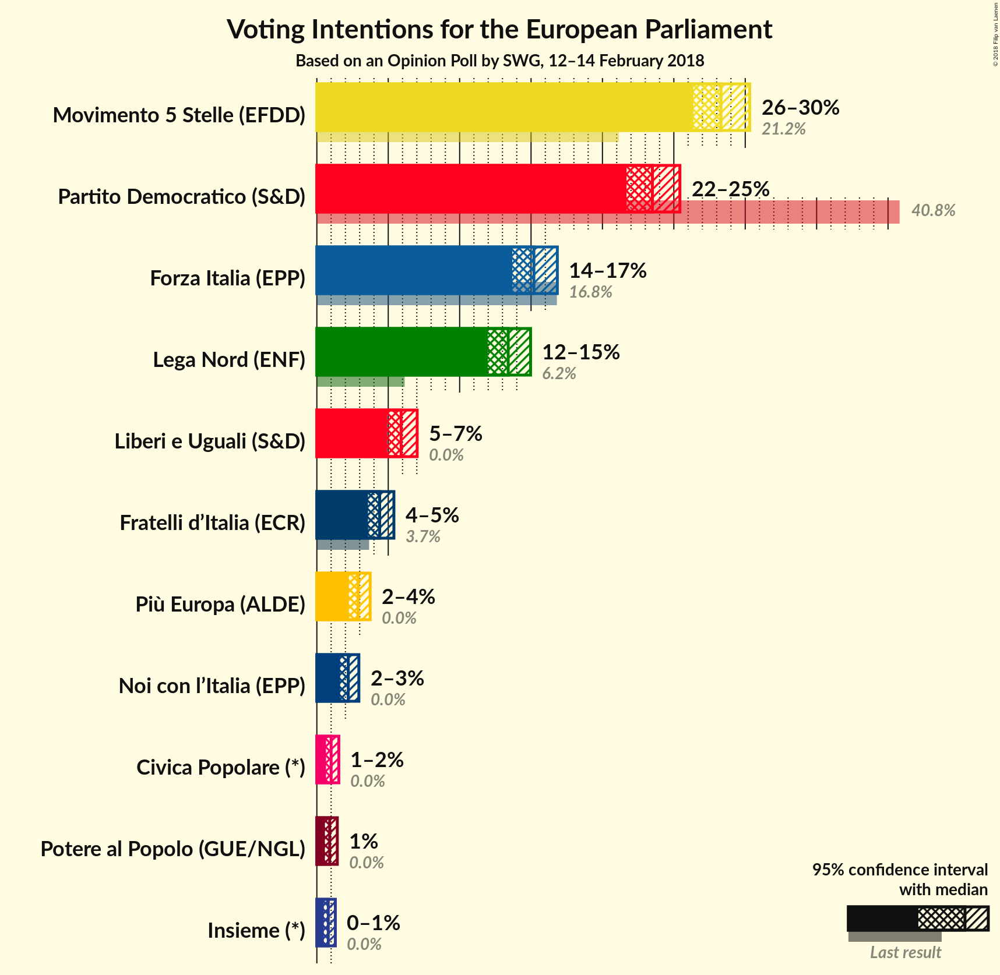
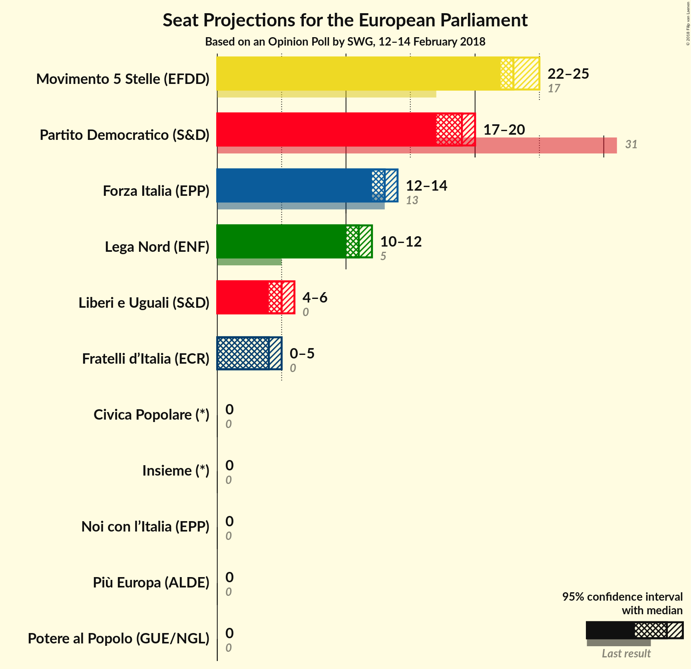

# Opinion Poll by SWG, 12–14 February 2018

<a href="#voting-intentions">Voting Intentions</a> | <a href="#seats">Seats</a> | <a href="#coalitions">Coalitions</a> | <a href="#technical-information">Technical Information</a>

## Voting Intentions

### Confidence Intervals

| Party | Last Result | Poll Result | 80% Confidence Interval | 90% Confidence Interval | 95% Confidence Interval | 99% Confidence Interval |
|:-----:|:-----------:|:-----------:|:-----------------------:|:-----------------------:|:-----------------------:|:-----------------------:|
| Movimento 5 Stelle (EFDD) | 21.1% | 28.3% | 27.0–29.6% |26.7–30.0% |26.4–30.3% |25.8–31.0% |
| Partito Democratico (S&D) | 40.8% | 23.5% | 22.3–24.8% |22.0–25.1% |21.7–25.4% |21.1–26.0% |
| Forza Italia (EPP) | 16.8% | 15.2% | 14.2–16.3% |13.9–16.6% |13.7–16.8% |13.2–17.4% |
| Lega Nord (ENF) | 6.2% | 13.4% | 12.5–14.4% |12.2–14.7% |12.0–15.0% |11.5–15.5% |
| Liberi e Uguali (S&D) | 0.0% | 5.9% | 5.3–6.6% |5.1–6.8% |4.9–7.0% |4.7–7.4% |
| Fratelli d’Italia (*) | 3.7% | 4.4% | N/A |N/A |N/A |N/A |
| Più Europa (ALDE) | 0.0% | 2.9% | N/A |N/A |N/A |N/A |
| Noi con l’Italia (EPP) | 0.0% | 2.2% | N/A |N/A |N/A |N/A |
| Civica Popolare (*) | 0.0% | 1.0% | N/A |N/A |N/A |N/A |
| Potere al Popolo (GUE/NGL) | 0.0% | 0.9% | 0.7–1.2% |0.6–1.3% |0.6–1.4% |0.5–1.6% |
| Insieme (*) | 0.0% | 0.8% | N/A |N/A |N/A |N/A |

*Note:* The poll result column reflects the actual value used in the calculations. Published results may vary slightly, and in addition be rounded to fewer digits.

## Seats

### Confidence Intervals

| Party | Last Result | Median | 80% Confidence Interval | 90% Confidence Interval | 95% Confidence Interval | 99% Confidence Interval |
|:-----:|:-----------:|:------:|:-----------------------:|:-----------------------:|:-----------------------:|:-----------------------:|
| <a href="#movimento-5-stelle-(efdd)">Movimento 5 Stelle (EFDD)</a> | 17 | 23 | 23–25 |22–25 |22–25 |22–26 |
| <a href="#partito-democratico-(s&d)">Partito Democratico (S&D)</a> | 31 | 19 | 17–20 |17–20 |17–20 |17–21 |
| <a href="#forza-italia-(epp)">Forza Italia (EPP)</a> | 13 | 13 | 12–14 |12–14 |12–14 |11–14 |
| <a href="#lega-nord-(enf)">Lega Nord (ENF)</a> | 5 | 11 | 11–12 |10–12 |10–12 |10–13 |
| <a href="#liberi-e-uguali-(s&d)">Liberi e Uguali (S&D)</a> | 0 | 5 | 4–5 |4–6 |4–6 |4–6 |
| <a href="#fratelli-d’italia-(*)">Fratelli d’Italia (*)</a> | 0 | N/A | N/A |N/A |N/A |N/A |
| <a href="#più-europa-(alde)">Più Europa (ALDE)</a> | 0 | N/A | N/A |N/A |N/A |N/A |
| <a href="#noi-con-l’italia-(epp)">Noi con l’Italia (EPP)</a> | 0 | N/A | N/A |N/A |N/A |N/A |
| <a href="#civica-popolare-(*)">Civica Popolare (*)</a> | 0 | N/A | N/A |N/A |N/A |N/A |
| <a href="#potere-al-popolo-(gue/ngl)">Potere al Popolo (GUE/NGL)</a> | 0 | 0 | 0 |0 |0 |0 |
| <a href="#insieme-(*)">Insieme (*)</a> | 0 | N/A | N/A |N/A |N/A |N/A |

