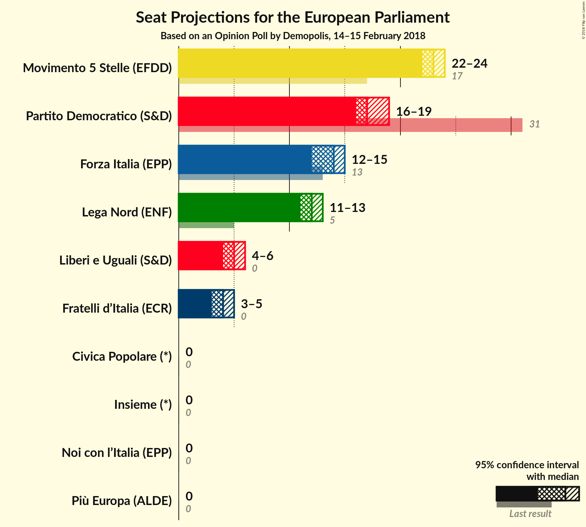

# Opinion Poll by Demopolis, 14–15 February 2018

<a href="#voting-intentions">Voting Intentions</a> | <a href="#seats">Seats</a> | <a href="#coalitions">Coalitions</a> | <a href="#technical-information">Technical Information</a>

## Voting Intentions

### Confidence Intervals

| Party | Last Result | Poll Result | 80% Confidence Interval | 90% Confidence Interval | 95% Confidence Interval | 99% Confidence Interval |
|:-----:|:-----------:|:-----------:|:-----------------------:|:-----------------------:|:-----------------------:|:-----------------------:|
| Movimento 5 Stelle (EFDD) | 21.1% | 28.0% | 26.7–29.3% |26.4–29.7% |26.1–30.0% |25.5–30.7% |
| Partito Democratico (S&D) | 40.8% | 22.5% | 21.3–23.7% |21.0–24.1% |20.7–24.4% |20.2–25.0% |
| Forza Italia (EPP) | 16.8% | 16.5% | 15.5–17.6% |15.2–17.9% |14.9–18.2% |14.4–18.7% |
| Lega Nord (ENF) | 6.2% | 14.2% | 13.2–15.3% |13.0–15.5% |12.7–15.8% |12.3–16.3% |
| Liberi e Uguali (S&D) | 0.0% | 6.0% | 5.4–6.7% |5.2–7.0% |5.0–7.1% |4.8–7.5% |
| Fratelli d’Italia (*) | 3.7% | 5.0% | N/A |N/A |N/A |N/A |
| Più Europa (ALDE) | 0.0% | 2.5% | N/A |N/A |N/A |N/A |
| Noi con l’Italia (EPP) | 0.0% | 2.3% | N/A |N/A |N/A |N/A |
| Insieme (*) | 0.0% | 1.0% | N/A |N/A |N/A |N/A |
| Civica Popolare (*) | 0.0% | 1.0% | N/A |N/A |N/A |N/A |

*Note:* The poll result column reflects the actual value used in the calculations. Published results may vary slightly, and in addition be rounded to fewer digits.

## Seats

### Confidence Intervals

| Party | Last Result | Median | 80% Confidence Interval | 90% Confidence Interval | 95% Confidence Interval | 99% Confidence Interval |
|:-----:|:-----------:|:------:|:-----------------------:|:-----------------------:|:-----------------------:|:-----------------------:|
| <a href="#movimento-5-stelle-(efdd)">Movimento 5 Stelle (EFDD)</a> | 17 | 23 | 22–24 |22–24 |22–24 |21–25 |
| <a href="#partito-democratico-(s&d)">Partito Democratico (S&D)</a> | 31 | 17 | 17–18 |16–19 |16–19 |15–20 |
| <a href="#forza-italia-(epp)">Forza Italia (EPP)</a> | 13 | 14 | 13–14 |12–15 |12–15 |12–15 |
| <a href="#lega-nord-(enf)">Lega Nord (ENF)</a> | 5 | 12 | 11–13 |11–13 |11–13 |10–13 |
| <a href="#liberi-e-uguali-(s&d)">Liberi e Uguali (S&D)</a> | 0 | 5 | 4–5 |4–6 |4–6 |4–6 |
| <a href="#fratelli-d’italia-(*)">Fratelli d’Italia (*)</a> | 0 | N/A | N/A |N/A |N/A |N/A |
| <a href="#più-europa-(alde)">Più Europa (ALDE)</a> | 0 | N/A | N/A |N/A |N/A |N/A |
| <a href="#noi-con-l’italia-(epp)">Noi con l’Italia (EPP)</a> | 0 | N/A | N/A |N/A |N/A |N/A |
| <a href="#insieme-(*)">Insieme (*)</a> | 0 | N/A | N/A |N/A |N/A |N/A |
| <a href="#civica-popolare-(*)">Civica Popolare (*)</a> | 0 | N/A | N/A |N/A |N/A |N/A |

