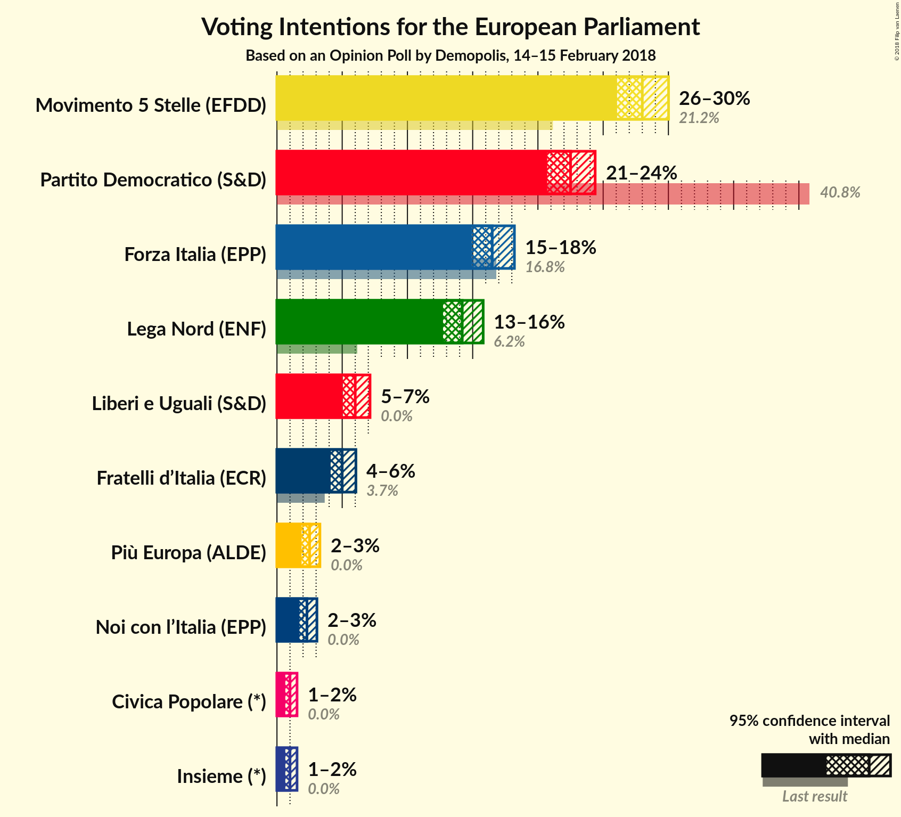
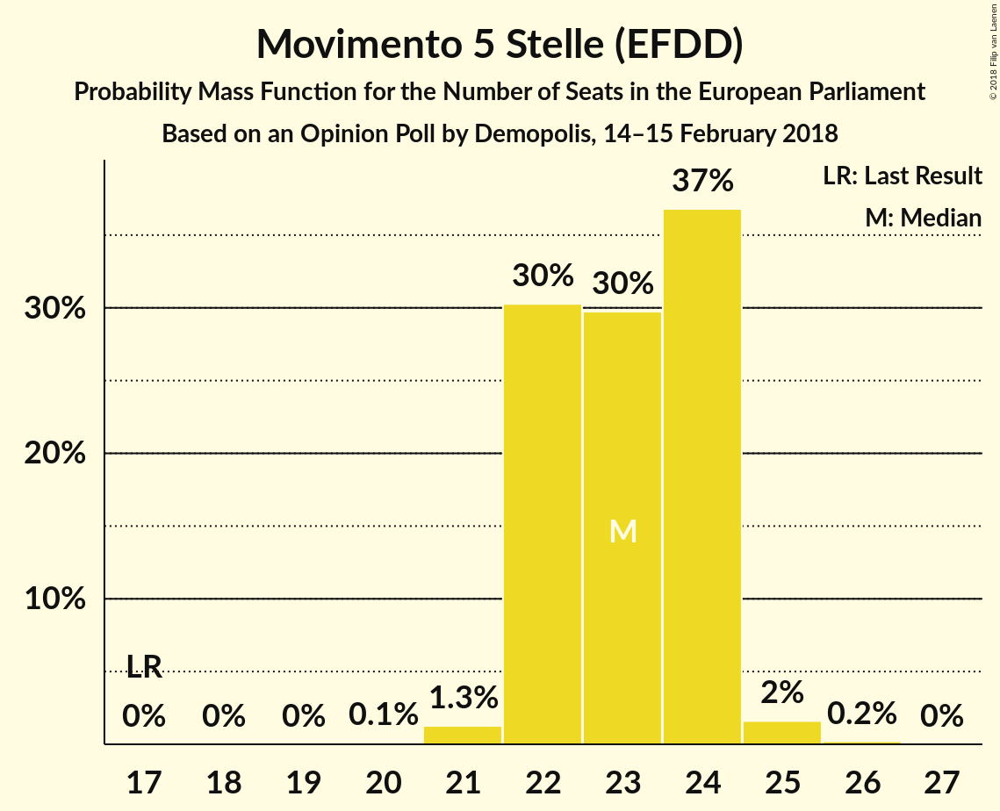
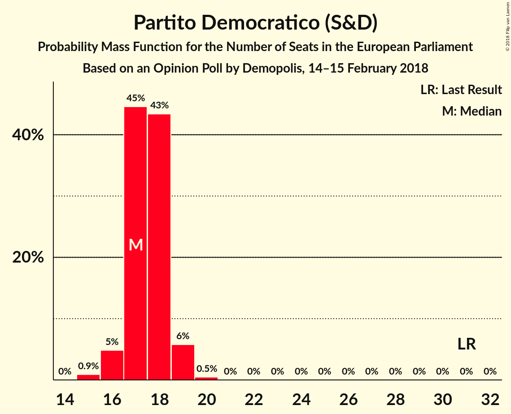
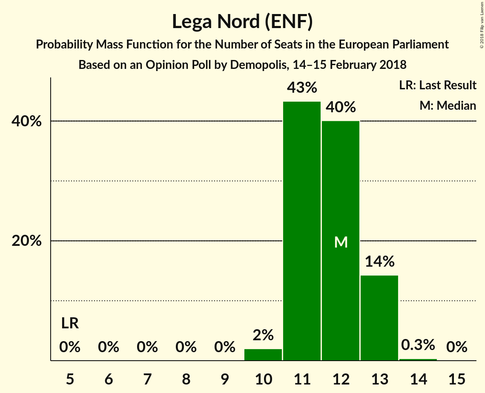
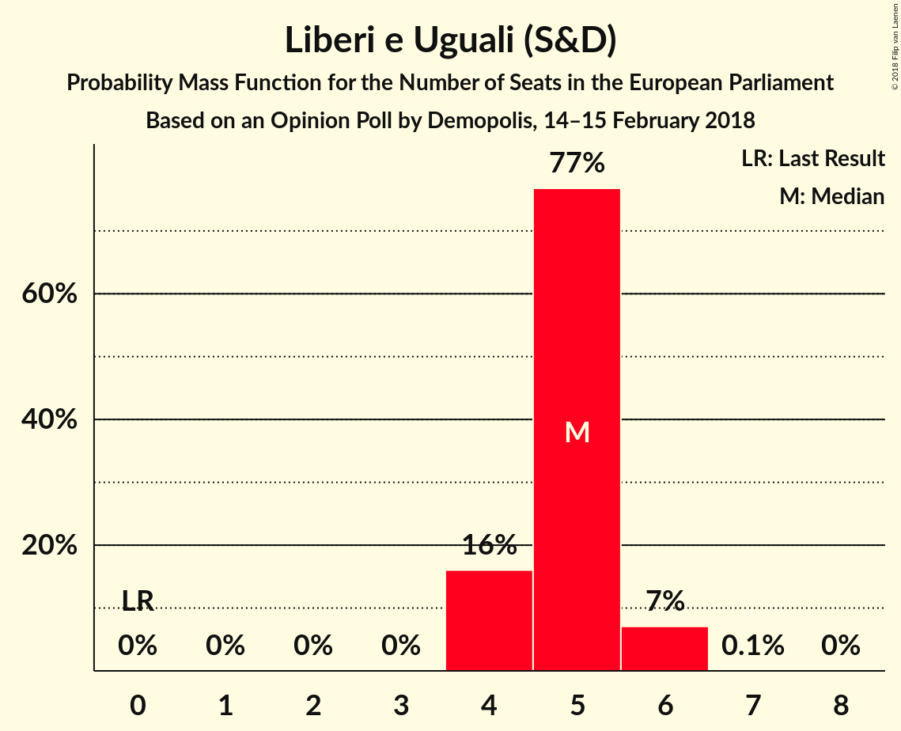
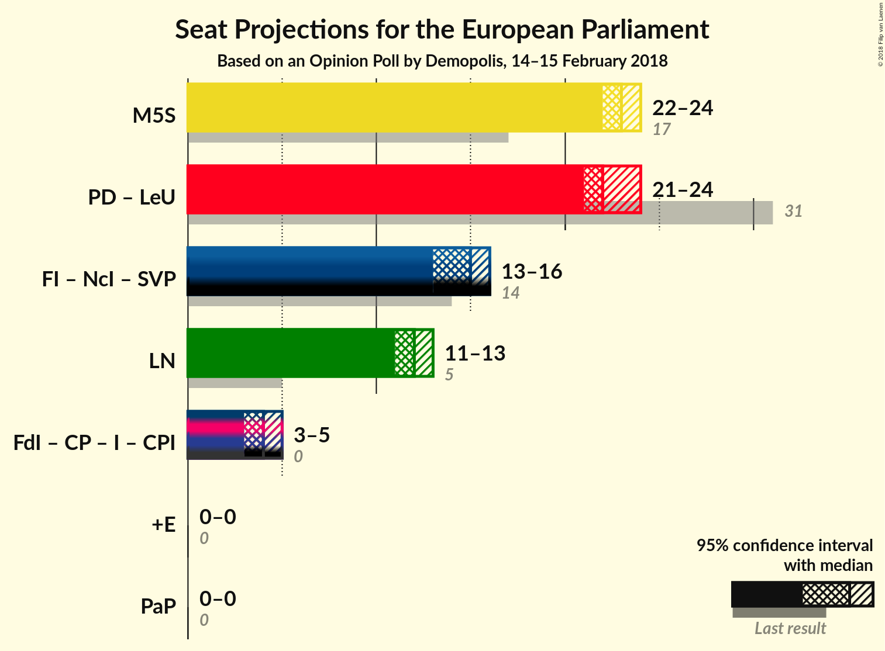

# Opinion Poll by Demopolis, 14–15 February 2018

<a href="#voting-intentions">Voting Intentions</a> | <a href="#seats">Seats</a> | <a href="#coalitions">Coalitions</a> | <a href="#technical-information">Technical Information</a>

## Voting Intentions

### Confidence Intervals

| Party | Last Result | Poll Result | 80% Confidence Interval | 90% Confidence Interval | 95% Confidence Interval | 99% Confidence Interval |
|:-----:|:-----------:|:-----------:|:-----------------------:|:-----------------------:|:-----------------------:|:-----------------------:|
| Movimento 5 Stelle (EFDD) | 21.1% | 28.0% | 26.7–29.3% |26.4–29.7% |26.1–30.0% |25.5–30.7% |
| Partito Democratico (S&D) | 40.8% | 22.5% | 21.3–23.7% |21.0–24.1% |20.7–24.4% |20.2–25.0% |
| Forza Italia (EPP) | 16.8% | 16.5% | 15.5–17.6% |15.2–17.9% |14.9–18.2% |14.4–18.7% |
| Lega Nord (ENF) | 6.2% | 14.2% | 13.2–15.3% |13.0–15.5% |12.7–15.8% |12.3–16.3% |
| Liberi e Uguali (S&D) | 0.0% | 6.0% | 5.4–6.7% |5.2–7.0% |5.0–7.1% |4.8–7.5% |
| Fratelli d’Italia (*) | 3.7% | 5.0% | 4.4–5.7% |4.3–5.9% |4.1–6.1% |3.9–6.4% |
| Più Europa (ALDE) | 0.0% | 2.5% | 2.1–3.0% |2.0–3.2% |1.9–3.3% |1.7–3.6% |
| Noi con l’Italia (EPP) | 0.0% | 2.3% | 1.9–2.8% |1.8–2.9% |1.7–3.1% |1.6–3.3% |
| Insieme (*) | 0.0% | 1.0% | 0.8–1.4% |0.7–1.5% |0.6–1.5% |0.5–1.7% |
| Civica Popolare (*) | 0.0% | 1.0% | 0.8–1.4% |0.7–1.5% |0.6–1.5% |0.5–1.7% |

*Note:* The poll result column reflects the actual value used in the calculations. Published results may vary slightly, and in addition be rounded to fewer digits.

## Seats

### Confidence Intervals

| Party | Last Result | Median | 80% Confidence Interval | 90% Confidence Interval | 95% Confidence Interval | 99% Confidence Interval |
|:-----:|:-----------:|:------:|:-----------------------:|:-----------------------:|:-----------------------:|:-----------------------:|
| <a href="#movimento-5-stelle-(efdd)">Movimento 5 Stelle (EFDD)</a> | 17 | 23 | 22–24 |22–24 |22–24 |21–25 |
| <a href="#partito-democratico-(s&d)">Partito Democratico (S&D)</a> | 31 | 18 | 17–19 |17–19 |16–19 |16–20 |
| <a href="#forza-italia-(epp)">Forza Italia (EPP)</a> | 13 | 14 | 12–14 |12–15 |12–15 |12–15 |
| <a href="#lega-nord-(enf)">Lega Nord (ENF)</a> | 5 | 11 | 11–13 |11–13 |11–13 |10–13 |
| <a href="#liberi-e-uguali-(s&d)">Liberi e Uguali (S&D)</a> | 0 | 5 | 4–5 |4–6 |4–6 |4–6 |
| <a href="#fratelli-d’italia-(*)">Fratelli d’Italia (*)</a> | 0 | 4 | 4–5 |4–5 |3–5 |0–5 |
| <a href="#più-europa-(alde)">Più Europa (ALDE)</a> | 0 | 0 | 0 |0 |0 |0 |
| <a href="#noi-con-l’italia-(epp)">Noi con l’Italia (EPP)</a> | 0 | 0 | 0 |0 |0 |0 |
| <a href="#insieme-(*)">Insieme (*)</a> | 0 | 0 | 0 |0 |0 |0 |
| <a href="#civica-popolare-(*)">Civica Popolare (*)</a> | 0 | 0 | 0 |0 |0 |0 |

### Movimento 5 Stelle (EFDD)

*For a full overview of the results for this party, see the [Movimento 5 Stelle (EFDD)](party-movimento5stelleefdd.html) page.*

| Number of Seats | Probability | Accumulated | Special Marks |
|:---------------:|:-----------:|:-----------:|:-------------:|
| 17 | 0% | 100% | Last Result |
| 18 | 0% | 100% |  |
| 19 | 0% | 100% |  |
| 20 | 0.1% | 100% |  |
| 21 | 2% | 99.9% |  |
| 22 | 13% | 98% |  |
| 23 | 43% | 85% | Median |
| 24 | 41% | 43% |  |
| 25 | 2% | 2% |  |
| 26 | 0.2% | 0.2% |  |
| 27 | 0% | 0% |  |

### Partito Democratico (S&D)

*For a full overview of the results for this party, see the [Partito Democratico (S&D)](party-partitodemocraticosd.html) page.*

| Number of Seats | Probability | Accumulated | Special Marks |
|:---------------:|:-----------:|:-----------:|:-------------:|
| 15 | 0.4% | 100% |  |
| 16 | 3% | 99.6% |  |
| 17 | 31% | 97% |  |
| 18 | 42% | 66% | Median |
| 19 | 23% | 24% |  |
| 20 | 1.3% | 1.4% |  |
| 21 | 0.1% | 0.1% |  |
| 22 | 0% | 0% |  |
| 23 | 0% | 0% |  |
| 24 | 0% | 0% |  |
| 25 | 0% | 0% |  |
| 26 | 0% | 0% |  |
| 27 | 0% | 0% |  |
| 28 | 0% | 0% |  |
| 29 | 0% | 0% |  |
| 30 | 0% | 0% |  |
| 31 | 0% | 0% | Last Result |

### Forza Italia (EPP)

*For a full overview of the results for this party, see the [Forza Italia (EPP)](party-forzaitaliaepp.html) page.*

| Number of Seats | Probability | Accumulated | Special Marks |
|:---------------:|:-----------:|:-----------:|:-------------:|
| 12 | 14% | 100% |  |
| 13 | 33% | 86% | Last Result |
| 14 | 46% | 52% | Median |
| 15 | 6% | 7% |  |
| 16 | 0.3% | 0.3% |  |
| 17 | 0% | 0% |  |

### Lega Nord (ENF)

*For a full overview of the results for this party, see the [Lega Nord (ENF)](party-leganordenf.html) page.*

| Number of Seats | Probability | Accumulated | Special Marks |
|:---------------:|:-----------:|:-----------:|:-------------:|
| 5 | 0% | 100% | Last Result |
| 6 | 0% | 100% |  |
| 7 | 0% | 100% |  |
| 8 | 0% | 100% |  |
| 9 | 0% | 100% |  |
| 10 | 2% | 100% |  |
| 11 | 49% | 98% | Median |
| 12 | 23% | 49% |  |
| 13 | 26% | 27% |  |
| 14 | 0.3% | 0.3% |  |
| 15 | 0% | 0% |  |

### Liberi e Uguali (S&D)

*For a full overview of the results for this party, see the [Liberi e Uguali (S&D)](party-liberieugualisd.html) page.*

| Number of Seats | Probability | Accumulated | Special Marks |
|:---------------:|:-----------:|:-----------:|:-------------:|
| 0 | 0% | 100% | Last Result |
| 1 | 0% | 100% |  |
| 2 | 0% | 100% |  |
| 3 | 0.5% | 100% |  |
| 4 | 48% | 99.5% |  |
| 5 | 43% | 51% | Median |
| 6 | 8% | 8% |  |
| 7 | 0.1% | 0.1% |  |
| 8 | 0% | 0% |  |

### Fratelli d’Italia (*)

*For a full overview of the results for this party, see the [Fratelli d’Italia (*)](party-fratellid’italia.html) page.*

| Number of Seats | Probability | Accumulated | Special Marks |
|:---------------:|:-----------:|:-----------:|:-------------:|
| 0 | 1.2% | 100% | Last Result |
| 1 | 0% | 98.8% |  |
| 2 | 0% | 98.8% |  |
| 3 | 1.3% | 98.8% |  |
| 4 | 87% | 97% | Median |
| 5 | 10% | 10% |  |
| 6 | 0.2% | 0.2% |  |
| 7 | 0% | 0% |  |

### Più Europa (ALDE)

*For a full overview of the results for this party, see the [Più Europa (ALDE)](party-piùeuropaalde.html) page.*

| Number of Seats | Probability | Accumulated | Special Marks |
|:---------------:|:-----------:|:-----------:|:-------------:|
| 0 | 99.7% | 100% | Last Result, Median |
| 1 | 0% | 0.3% |  |
| 2 | 0% | 0.3% |  |
| 3 | 0.2% | 0.3% |  |
| 4 | 0% | 0% |  |

### Noi con l’Italia (EPP)

*For a full overview of the results for this party, see the [Noi con l’Italia (EPP)](party-noiconl’italiaepp.html) page.*

| Number of Seats | Probability | Accumulated | Special Marks |
|:---------------:|:-----------:|:-----------:|:-------------:|
| 0 | 100% | 100% | Last Result, Median |

### Insieme (*)

*For a full overview of the results for this party, see the [Insieme (*)](party-insieme.html) page.*

| Number of Seats | Probability | Accumulated | Special Marks |
|:---------------:|:-----------:|:-----------:|:-------------:|
| 0 | 100% | 100% | Last Result, Median |

### Civica Popolare (*)

*For a full overview of the results for this party, see the [Civica Popolare (*)](party-civicapopolare.html) page.*

| Number of Seats | Probability | Accumulated | Special Marks |
|:---------------:|:-----------:|:-----------:|:-------------:|
| 0 | 100% | 100% | Last Result, Median |

## Coalitions

### Confidence Intervals

| Coalition | Last Result | Median | Majority? | 80% Confidence Interval | 90% Confidence Interval | 95% Confidence Interval | 99% Confidence Interval |
|:---------:|:-----------:|:------:|:---------:|:-----------------------:|:-----------------------:|:-----------------------:|:-----------------------:|
| Movimento 5 Stelle (EFDD) | 17 | 23 | 0% | 22–24 | 22–24 | 22–24 | 21–25 |
| Partito Democratico (S&D) – Liberi e Uguali (S&D) | 31 | 23 | 0% | 21–23 | 21–24 | 21–24 | 21–25 |
| Lega Nord (ENF) | 5 | 11 | 0% | 11–13 | 11–13 | 11–13 | 10–13 |
| Più Europa (ALDE) | 0 | 0 | 0% | 0 | 0 | 0 | 0 |

### Movimento 5 Stelle (EFDD)

| Number of Seats | Probability | Accumulated | Special Marks |
|:---------------:|:-----------:|:-----------:|:-------------:|
| 17 | 0% | 100% | Last Result |
| 18 | 0% | 100% |  |
| 19 | 0% | 100% |  |
| 20 | 0.1% | 100% |  |
| 21 | 2% | 99.9% |  |
| 22 | 13% | 98% |  |
| 23 | 43% | 85% | Median |
| 24 | 41% | 43% |  |
| 25 | 2% | 2% |  |
| 26 | 0.2% | 0.2% |  |
| 27 | 0% | 0% |  |

### Partito Democratico (S&D) – Liberi e Uguali (S&D)

| Number of Seats | Probability | Accumulated | Special Marks |
|:---------------:|:-----------:|:-----------:|:-------------:|
| 20 | 0.2% | 100% |  |
| 21 | 27% | 99.8% |  |
| 22 | 10% | 73% |  |
| 23 | 55% | 63% | Median |
| 24 | 7% | 9% |  |
| 25 | 2% | 2% |  |
| 26 | 0.2% | 0.2% |  |
| 27 | 0% | 0% |  |
| 28 | 0% | 0% |  |
| 29 | 0% | 0% |  |
| 30 | 0% | 0% |  |
| 31 | 0% | 0% | Last Result |

### Lega Nord (ENF)

| Number of Seats | Probability | Accumulated | Special Marks |
|:---------------:|:-----------:|:-----------:|:-------------:|
| 5 | 0% | 100% | Last Result |
| 6 | 0% | 100% |  |
| 7 | 0% | 100% |  |
| 8 | 0% | 100% |  |
| 9 | 0% | 100% |  |
| 10 | 2% | 100% |  |
| 11 | 49% | 98% | Median |
| 12 | 23% | 49% |  |
| 13 | 26% | 27% |  |
| 14 | 0.3% | 0.3% |  |
| 15 | 0% | 0% |  |

### Più Europa (ALDE)

| Number of Seats | Probability | Accumulated | Special Marks |
|:---------------:|:-----------:|:-----------:|:-------------:|
| 0 | 99.7% | 100% | Last Result, Median |
| 1 | 0% | 0.3% |  |
| 2 | 0% | 0.3% |  |
| 3 | 0.2% | 0.3% |  |
| 4 | 0% | 0% |  |

## Technical Information

### Opinion Poll

+ **Polling firm:** Demopolis
+ **Commissioner(s):** —
+ **Fieldwork period:** 14–15 February 2018

### Calculations

+ **Sample size:** 2000
+ **Simulations done:** 131,072
+ **Error estimate:** 2.21%

