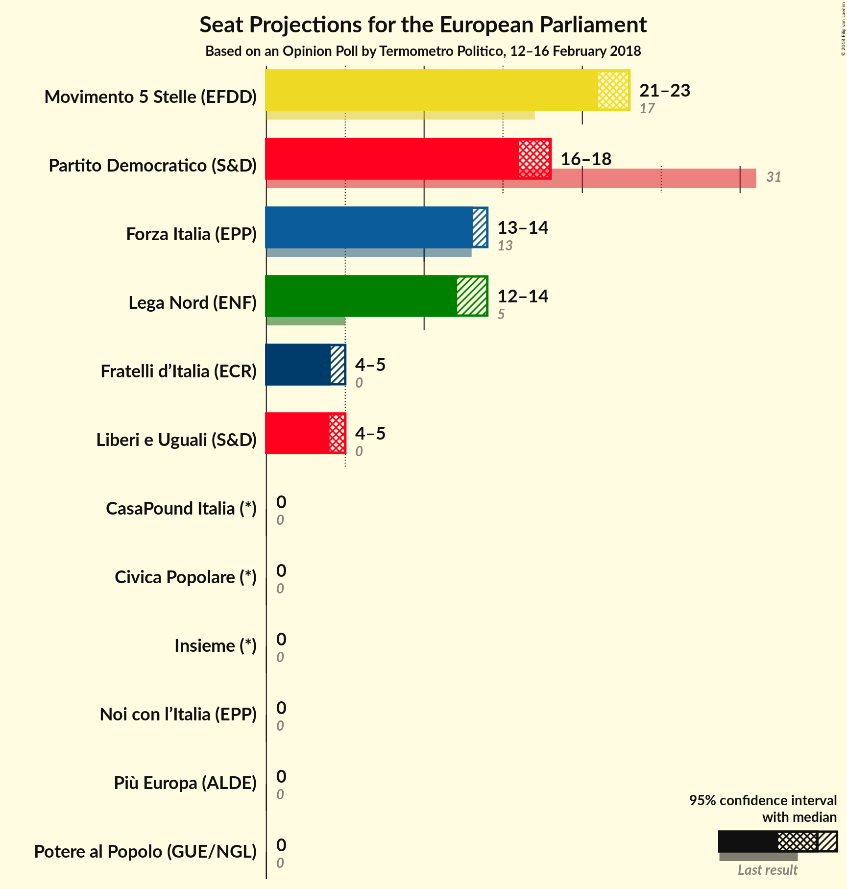
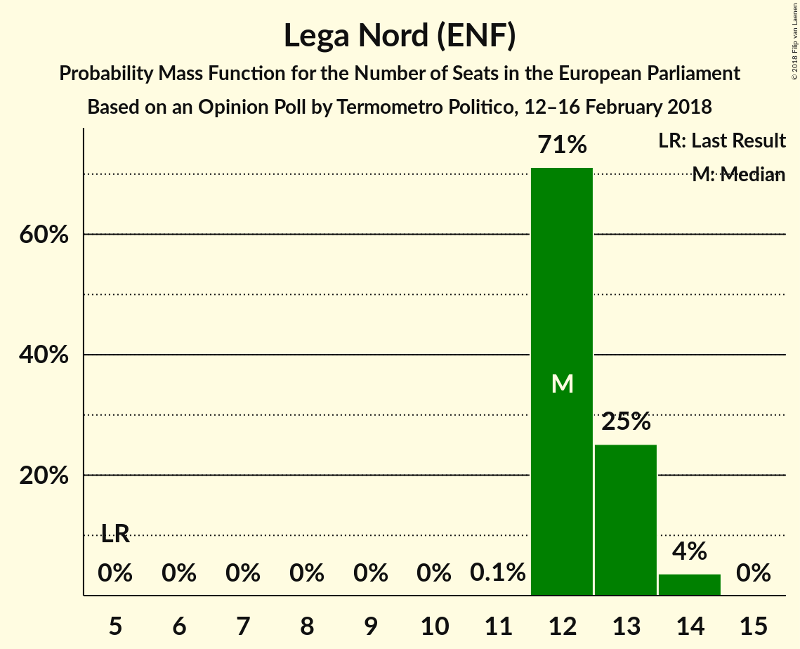

# Opinion Poll by Termometro Politico, 12–16 February 2018

<a href="#voting-intentions">Voting Intentions</a> | <a href="#seats">Seats</a> | <a href="#coalitions">Coalitions</a> | <a href="#technical-information">Technical Information</a>

## Voting Intentions

### Confidence Intervals

| Party | Last Result | Poll Result | 80% Confidence Interval | 90% Confidence Interval | 95% Confidence Interval | 99% Confidence Interval |
|:-----:|:-----------:|:-----------:|:-----------------------:|:-----------------------:|:-----------------------:|:-----------------------:|
| Movimento 5 Stelle (EFDD) | 21.2% | 26.3% | 25.5–27.2% |25.2–27.4% |25.0–27.6% |24.6–28.0% |
| Partito Democratico (S&D) | 40.8% | 21.3% | 20.5–22.1% |20.3–22.3% |20.1–22.5% |19.8–22.9% |
| Forza Italia (EPP) | 16.8% | 15.9% | 15.2–16.6% |15.0–16.8% |14.9–17.0% |14.5–17.4% |
| Lega Nord (ENF) | 6.2% | 14.8% | 14.1–15.5% |13.9–15.7% |13.8–15.9% |13.5–16.2% |
| Liberi e Uguali (S&D) | 0.0% | 5.3% | 4.9–5.8% |4.8–5.9% |4.7–6.0% |4.5–6.2% |
| Fratelli d’Italia (*) | 3.7% | 5.0% | 4.6–5.4% |4.5–5.6% |4.4–5.7% |4.2–5.9% |
| Più Europa (ALDE) | 0.0% | 2.8% | 2.5–3.2% |2.4–3.2% |2.3–3.3% |2.2–3.5% |
| Noi con l’Italia (EPP) | 0.0% | 1.8% | 1.6–2.1% |1.5–2.2% |1.4–2.2% |1.3–2.4% |
| CasaPound Italia (*) | 0.0% | 1.8% | 1.6–2.1% |1.5–2.2% |1.4–2.2% |1.3–2.4% |
| Potere al Popolo (GUE/NGL) | 0.0% | 1.7% | 1.5–2.0% |1.4–2.1% |1.4–2.1% |1.3–2.3% |
| Insieme (*) | 0.0% | 0.9% | 0.7–1.1% |0.7–1.2% |0.7–1.2% |0.6–1.4% |
| Civica Popolare (*) | 0.0% | 0.9% | 0.7–1.1% |0.7–1.2% |0.7–1.2% |0.6–1.4% |

*Note:* The poll result column reflects the actual value used in the calculations. Published results may vary slightly, and in addition be rounded to fewer digits.

## Seats

### Confidence Intervals

| Party | Last Result | Median | 80% Confidence Interval | 90% Confidence Interval | 95% Confidence Interval | 99% Confidence Interval |
|:-----:|:-----------:|:------:|:-----------------------:|:-----------------------:|:-----------------------:|:-----------------------:|
| <a href="#movimento-5-stelle-(efdd)">Movimento 5 Stelle (EFDD)</a> | 17 | 23 | 22–23 |22–23 |21–23 |21–24 |
| <a href="#partito-democratico-(s&d)">Partito Democratico (S&D)</a> | 31 | 18 | 17–18 |16–18 |16–18 |16–18 |
| <a href="#forza-italia-(epp)">Forza Italia (EPP)</a> | 13 | 13 | 13–14 |13–14 |13–14 |13–15 |
| <a href="#lega-nord-(enf)">Lega Nord (ENF)</a> | 5 | 12 | 12–13 |12–13 |12–14 |12–14 |
| <a href="#liberi-e-uguali-(s&d)">Liberi e Uguali (S&D)</a> | 0 | 5 | 4–5 |4–5 |4–5 |4–5 |
| <a href="#fratelli-d’italia-(*)">Fratelli d’Italia (*)</a> | 0 | 4 | 4–5 |4–5 |4–5 |3–5 |
| <a href="#più-europa-(alde)">Più Europa (ALDE)</a> | 0 | 0 | 0 |0 |0 |0 |
| <a href="#noi-con-l’italia-(epp)">Noi con l’Italia (EPP)</a> | 0 | 0 | 0 |0 |0 |0 |
| <a href="#casapound-italia-(*)">CasaPound Italia (*)</a> | 0 | 0 | 0 |0 |0 |0 |
| <a href="#potere-al-popolo-(gue/ngl)">Potere al Popolo (GUE/NGL)</a> | 0 | 0 | 0 |0 |0 |0 |
| <a href="#insieme-(*)">Insieme (*)</a> | 0 | 0 | 0 |0 |0 |0 |
| <a href="#civica-popolare-(*)">Civica Popolare (*)</a> | 0 | 0 | 0 |0 |0 |0 |

### Movimento 5 Stelle (EFDD)

*For a full overview of the results for this party, see the [Movimento 5 Stelle (EFDD)](party-movimento5stelleefdd.html) page.*

| Number of Seats | Probability | Accumulated | Special Marks |
|:---------------:|:-----------:|:-----------:|:-------------:|
| 17 | 0% | 100% | Last Result |
| 18 | 0% | 100% |  |
| 19 | 0% | 100% |  |
| 20 | 0% | 100% |  |
| 21 | 3% | 100% |  |
| 22 | 12% | 97% |  |
| 23 | 84% | 85% | Median |
| 24 | 1.2% | 1.2% |  |
| 25 | 0% | 0% |  |

### Partito Democratico (S&D)

*For a full overview of the results for this party, see the [Partito Democratico (S&D)](party-partitodemocraticosd.html) page.*

| Number of Seats | Probability | Accumulated | Special Marks |
|:---------------:|:-----------:|:-----------:|:-------------:|
| 16 | 7% | 100% |  |
| 17 | 22% | 93% |  |
| 18 | 71% | 72% | Median |
| 19 | 0.4% | 0.4% |  |
| 20 | 0% | 0% |  |
| 21 | 0% | 0% |  |
| 22 | 0% | 0% |  |
| 23 | 0% | 0% |  |
| 24 | 0% | 0% |  |
| 25 | 0% | 0% |  |
| 26 | 0% | 0% |  |
| 27 | 0% | 0% |  |
| 28 | 0% | 0% |  |
| 29 | 0% | 0% |  |
| 30 | 0% | 0% |  |
| 31 | 0% | 0% | Last Result |

### Forza Italia (EPP)

*For a full overview of the results for this party, see the [Forza Italia (EPP)](party-forzaitaliaepp.html) page.*

| Number of Seats | Probability | Accumulated | Special Marks |
|:---------------:|:-----------:|:-----------:|:-------------:|
| 12 | 0.1% | 100% |  |
| 13 | 82% | 99.9% | Last Result, Median |
| 14 | 17% | 18% |  |
| 15 | 0.9% | 0.9% |  |
| 16 | 0% | 0% |  |

### Lega Nord (ENF)

*For a full overview of the results for this party, see the [Lega Nord (ENF)](party-leganordenf.html) page.*

| Number of Seats | Probability | Accumulated | Special Marks |
|:---------------:|:-----------:|:-----------:|:-------------:|
| 5 | 0% | 100% | Last Result |
| 6 | 0% | 100% |  |
| 7 | 0% | 100% |  |
| 8 | 0% | 100% |  |
| 9 | 0% | 100% |  |
| 10 | 0% | 100% |  |
| 11 | 0.1% | 100% |  |
| 12 | 71% | 99.9% | Median |
| 13 | 25% | 29% |  |
| 14 | 4% | 4% |  |
| 15 | 0% | 0% |  |

### Liberi e Uguali (S&D)

*For a full overview of the results for this party, see the [Liberi e Uguali (S&D)](party-liberieugualisd.html) page.*

| Number of Seats | Probability | Accumulated | Special Marks |
|:---------------:|:-----------:|:-----------:|:-------------:|
| 0 | 0% | 100% | Last Result |
| 1 | 0% | 100% |  |
| 2 | 0% | 100% |  |
| 3 | 0% | 100% |  |
| 4 | 19% | 100% |  |
| 5 | 81% | 81% | Median |
| 6 | 0% | 0% |  |

### Fratelli d’Italia (*)

*For a full overview of the results for this party, see the [Fratelli d’Italia (*)](party-fratellid’italia.html) page.*

| Number of Seats | Probability | Accumulated | Special Marks |
|:---------------:|:-----------:|:-----------:|:-------------:|
| 0 | 0% | 100% | Last Result |
| 1 | 0% | 100% |  |
| 2 | 0% | 100% |  |
| 3 | 2% | 100% |  |
| 4 | 77% | 98% | Median |
| 5 | 22% | 22% |  |
| 6 | 0% | 0% |  |

### Più Europa (ALDE)

*For a full overview of the results for this party, see the [Più Europa (ALDE)](party-piùeuropaalde.html) page.*

| Number of Seats | Probability | Accumulated | Special Marks |
|:---------------:|:-----------:|:-----------:|:-------------:|
| 0 | 100% | 100% | Last Result, Median |

### Noi con l’Italia (EPP)

*For a full overview of the results for this party, see the [Noi con l’Italia (EPP)](party-noiconl’italiaepp.html) page.*

| Number of Seats | Probability | Accumulated | Special Marks |
|:---------------:|:-----------:|:-----------:|:-------------:|
| 0 | 100% | 100% | Last Result, Median |

### CasaPound Italia (*)

*For a full overview of the results for this party, see the [CasaPound Italia (*)](party-casapounditalia.html) page.*

| Number of Seats | Probability | Accumulated | Special Marks |
|:---------------:|:-----------:|:-----------:|:-------------:|
| 0 | 100% | 100% | Last Result, Median |

### Potere al Popolo (GUE/NGL)

*For a full overview of the results for this party, see the [Potere al Popolo (GUE/NGL)](party-poterealpopologuengl.html) page.*

| Number of Seats | Probability | Accumulated | Special Marks |
|:---------------:|:-----------:|:-----------:|:-------------:|
| 0 | 100% | 100% | Last Result, Median |

### Insieme (*)

*For a full overview of the results for this party, see the [Insieme (*)](party-insieme.html) page.*

| Number of Seats | Probability | Accumulated | Special Marks |
|:---------------:|:-----------:|:-----------:|:-------------:|
| 0 | 100% | 100% | Last Result, Median |

### Civica Popolare (*)

*For a full overview of the results for this party, see the [Civica Popolare (*)](party-civicapopolare.html) page.*

| Number of Seats | Probability | Accumulated | Special Marks |
|:---------------:|:-----------:|:-----------:|:-------------:|
| 0 | 100% | 100% | Last Result, Median |

## Coalitions

### Confidence Intervals

| Coalition | Last Result | Median | Majority? | 80% Confidence Interval | 90% Confidence Interval | 95% Confidence Interval | 99% Confidence Interval |
|:---------:|:-----------:|:------:|:---------:|:-----------------------:|:-----------------------:|:-----------------------:|:-----------------------:|
| Movimento 5 Stelle (EFDD) | 17 | 23 | 0% | 22–23 | 22–23 | 21–23 | 21–24 |
| Partito Democratico (S&D) – Liberi e Uguali (S&D) | 31 | 23 | 0% | 21–23 | 21–23 | 20–23 | 20–23 |
| Lega Nord (ENF) | 5 | 12 | 0% | 12–13 | 12–13 | 12–14 | 12–14 |
| Fratelli d’Italia (*) – CasaPound Italia (*) – Civica Popolare (*) – Insieme (*) | 0 | 4 | 0% | 4–5 | 4–5 | 4–5 | 3–5 |
| Più Europa (ALDE) | 0 | 0 | 0% | 0 | 0 | 0 | 0 |
| Potere al Popolo (GUE/NGL) | 0 | 0 | 0% | 0 | 0 | 0 | 0 |

### Movimento 5 Stelle (EFDD)

| Number of Seats | Probability | Accumulated | Special Marks |
|:---------------:|:-----------:|:-----------:|:-------------:|
| 17 | 0% | 100% | Last Result |
| 18 | 0% | 100% |  |
| 19 | 0% | 100% |  |
| 20 | 0% | 100% |  |
| 21 | 3% | 100% |  |
| 22 | 12% | 97% |  |
| 23 | 84% | 85% | Median |
| 24 | 1.2% | 1.2% |  |
| 25 | 0% | 0% |  |

### Partito Democratico (S&D) – Liberi e Uguali (S&D)

| Number of Seats | Probability | Accumulated | Special Marks |
|:---------------:|:-----------:|:-----------:|:-------------:|
| 20 | 3% | 100% |  |
| 21 | 17% | 97% |  |
| 22 | 12% | 81% |  |
| 23 | 68% | 68% | Median |
| 24 | 0% | 0% |  |
| 25 | 0% | 0% |  |
| 26 | 0% | 0% |  |
| 27 | 0% | 0% |  |
| 28 | 0% | 0% |  |
| 29 | 0% | 0% |  |
| 30 | 0% | 0% |  |
| 31 | 0% | 0% | Last Result |

### Lega Nord (ENF)

| Number of Seats | Probability | Accumulated | Special Marks |
|:---------------:|:-----------:|:-----------:|:-------------:|
| 5 | 0% | 100% | Last Result |
| 6 | 0% | 100% |  |
| 7 | 0% | 100% |  |
| 8 | 0% | 100% |  |
| 9 | 0% | 100% |  |
| 10 | 0% | 100% |  |
| 11 | 0.1% | 100% |  |
| 12 | 71% | 99.9% | Median |
| 13 | 25% | 29% |  |
| 14 | 4% | 4% |  |
| 15 | 0% | 0% |  |

### Fratelli d’Italia (*) – CasaPound Italia (*) – Civica Popolare (*) – Insieme (*)

| Number of Seats | Probability | Accumulated | Special Marks |
|:---------------:|:-----------:|:-----------:|:-------------:|
| 0 | 0% | 100% | Last Result |
| 1 | 0% | 100% |  |
| 2 | 0% | 100% |  |
| 3 | 2% | 100% |  |
| 4 | 77% | 98% | Median |
| 5 | 22% | 22% |  |
| 6 | 0% | 0% |  |

### Più Europa (ALDE)

| Number of Seats | Probability | Accumulated | Special Marks |
|:---------------:|:-----------:|:-----------:|:-------------:|
| 0 | 100% | 100% | Last Result, Median |

### Potere al Popolo (GUE/NGL)

| Number of Seats | Probability | Accumulated | Special Marks |
|:---------------:|:-----------:|:-----------:|:-------------:|
| 0 | 100% | 100% | Last Result, Median |

## Technical Information

### Opinion Poll

+ **Polling firm:** Termometro Politico
+ **Commissioner(s):** —
+ **Fieldwork period:** 12–16 February 2018

### Calculations

+ **Sample size:** 4500
+ **Simulations done:** 1,048,576
+ **Error estimate:** 1.13%

