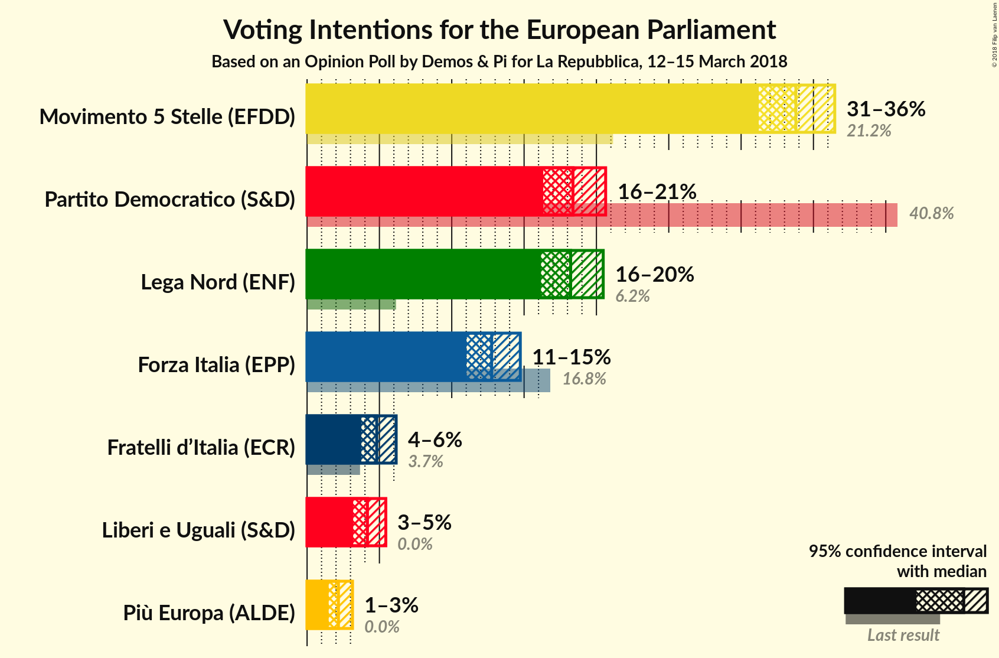
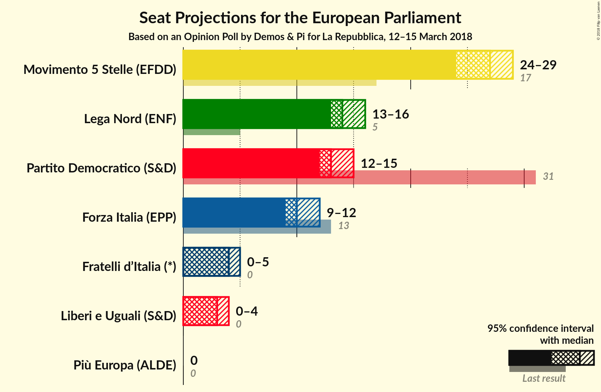
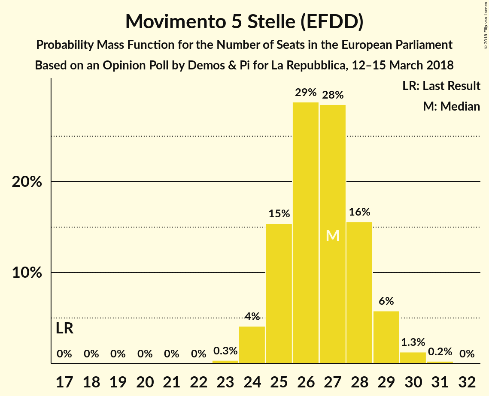
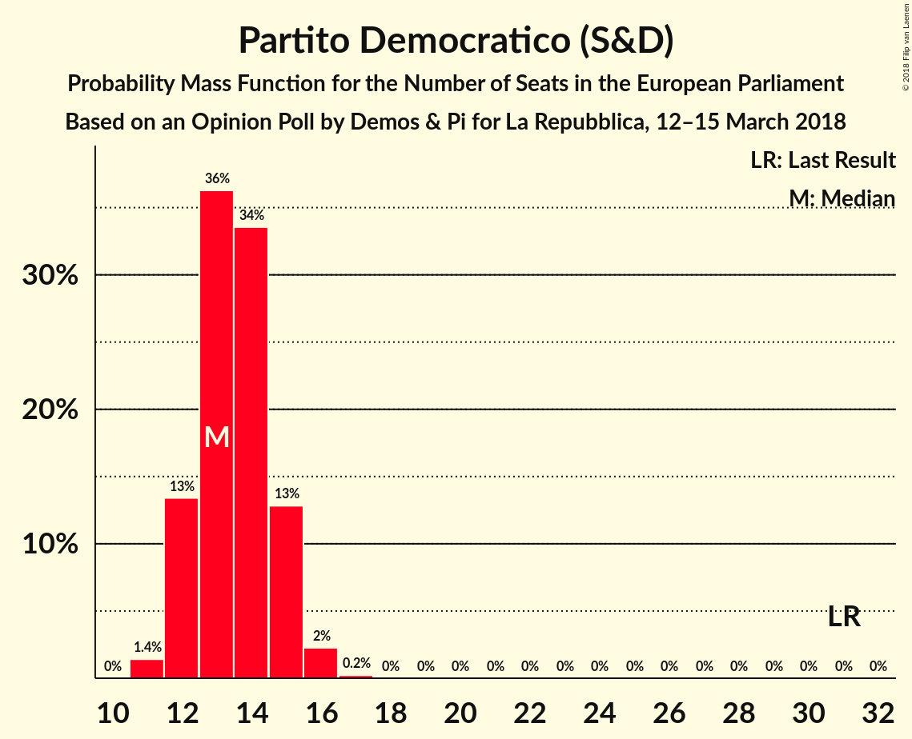
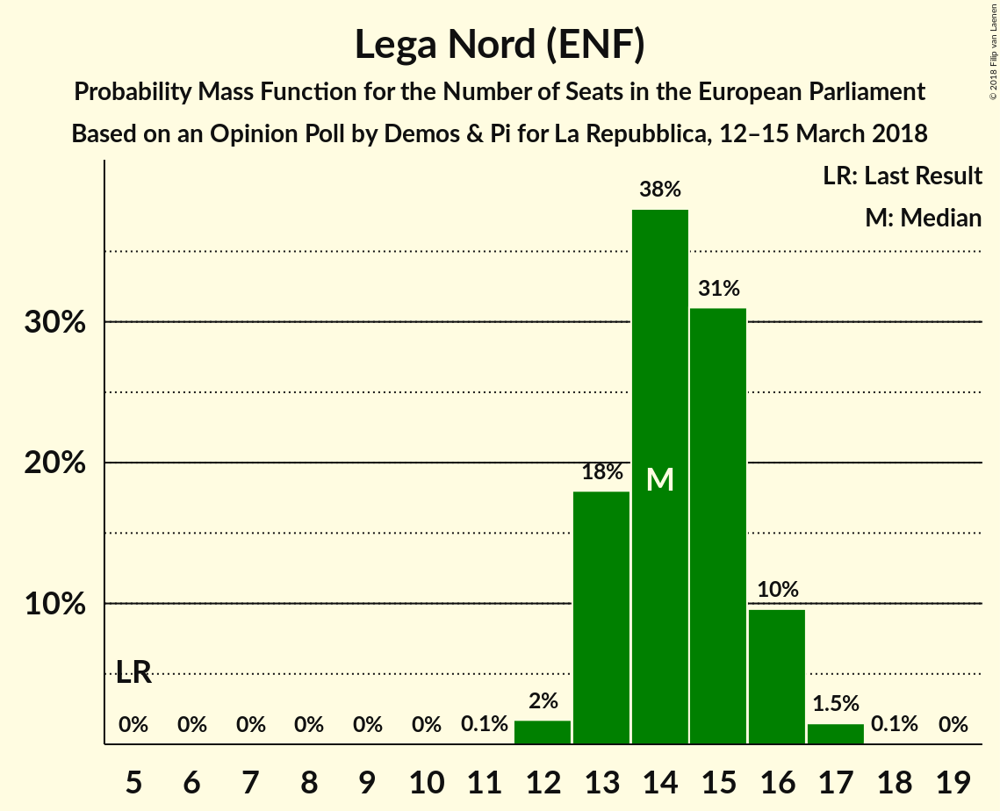
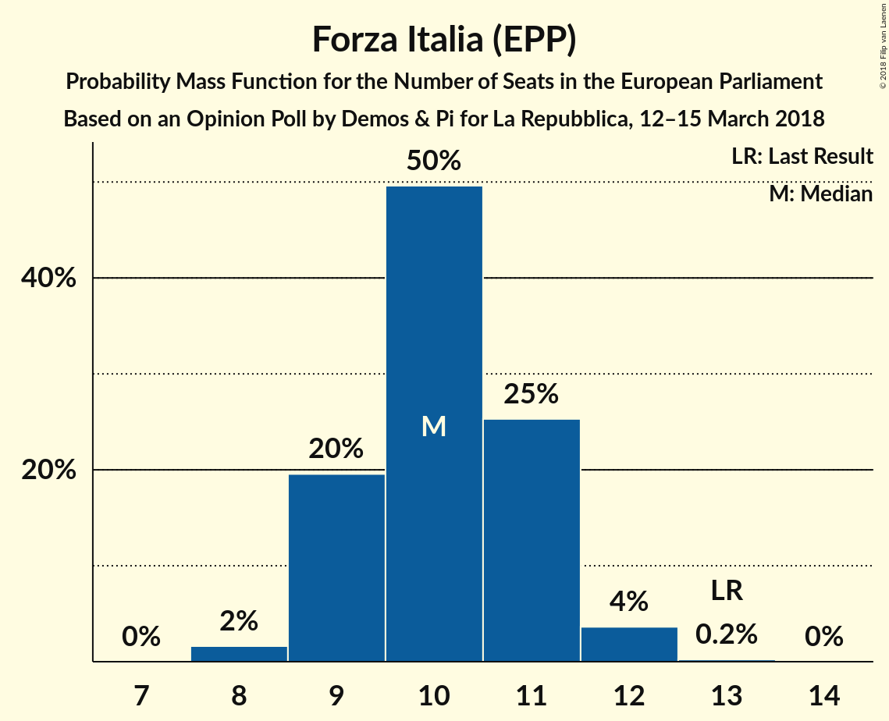
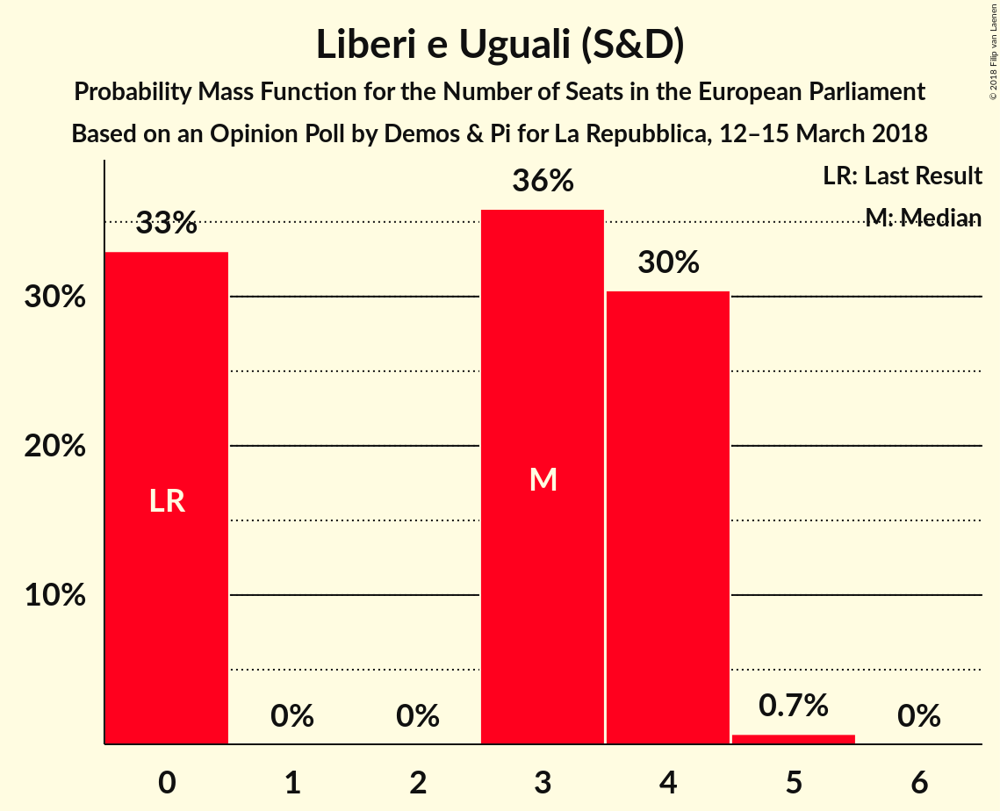
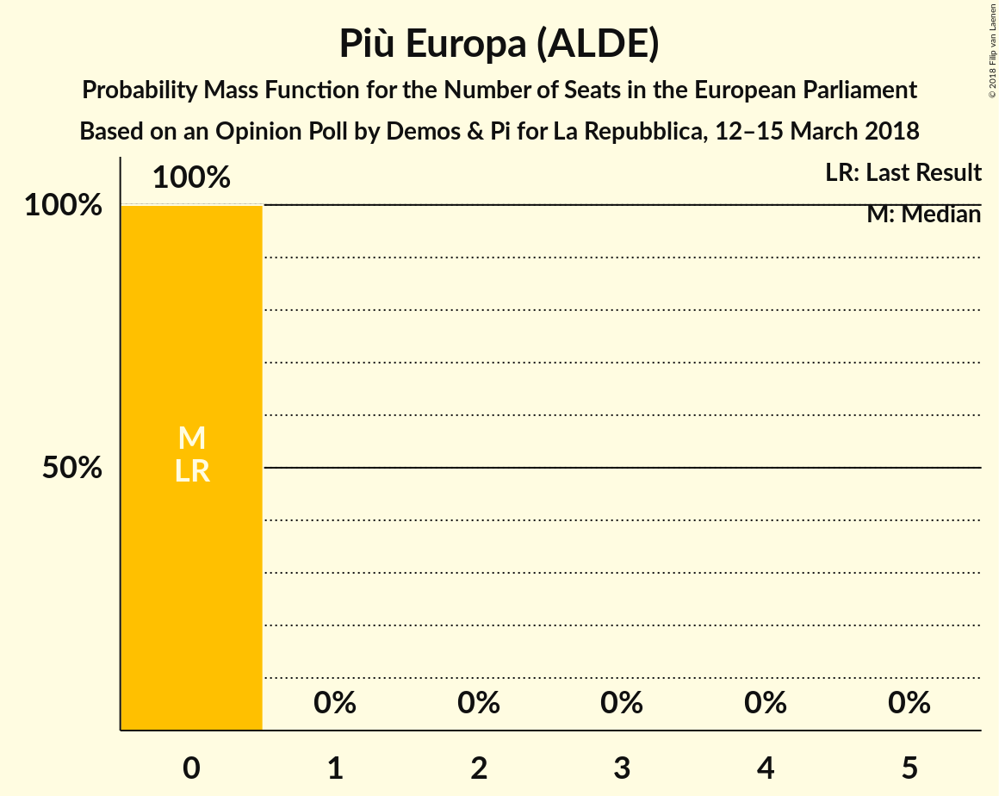

# Opinion Poll by Demos & Pi for La Repubblica, 12–15 March 2018

<a href="#voting-intentions">Voting Intentions</a> | <a href="#seats">Seats</a> | <a href="#coalitions">Coalitions</a> | <a href="#technical-information">Technical Information</a>

## Voting Intentions

### Confidence Intervals

| Party | Last Result | Poll Result | 80% Confidence Interval | 90% Confidence Interval | 95% Confidence Interval | 99% Confidence Interval |
|:-----:|:-----------:|:-----------:|:-----------------------:|:-----------------------:|:-----------------------:|:-----------------------:|
| Movimento 5 Stelle (EFDD) | 21.1% | 33.8% | 32.1–35.5% |31.6–36.0% |31.2–36.5% |30.4–37.3% |
| Partito Democratico (S&D) | 40.8% | 18.4% | 17.0–19.9% |16.6–20.3% |16.3–20.6% |15.7–21.4% |
| Lega Nord (ENF) | 6.2% | 18.2% | 16.9–19.7% |16.5–20.1% |16.2–20.5% |15.5–21.2% |
| Forza Italia (EPP) | 16.8% | 12.8% | 11.6–14.1% |11.3–14.4% |11.0–14.7% |10.5–15.4% |
| Fratelli d’Italia (*) | 3.7% | 4.8% | 4.1–5.7% |3.9–5.9% |3.7–6.2% |3.4–6.6% |
| Liberi e Uguali (S&D) | 0.0% | 4.2% | 3.5–5.0% |3.3–5.2% |3.2–5.4% |2.9–5.9% |
| Più Europa (ALDE) | 0.0% | 2.2% | 1.7–2.8% |1.6–3.0% |1.5–3.1% |1.3–3.5% |

*Note:* The poll result column reflects the actual value used in the calculations. Published results may vary slightly, and in addition be rounded to fewer digits.

## Seats

### Confidence Intervals

| Party | Last Result | Median | 80% Confidence Interval | 90% Confidence Interval | 95% Confidence Interval | 99% Confidence Interval |
|:-----:|:-----------:|:------:|:-----------------------:|:-----------------------:|:-----------------------:|:-----------------------:|
| <a href="#movimento-5-stelle-(efdd)">Movimento 5 Stelle (EFDD)</a> | 17 | 27 | 25–28 |25–28 |25–29 |24–30 |
| <a href="#partito-democratico-(s&d)">Partito Democratico (S&D)</a> | 31 | 11 | 11–14 |11–14 |11–15 |11–17 |
| <a href="#lega-nord-(enf)">Lega Nord (ENF)</a> | 5 | 15 | 14–15 |13–15 |13–15 |12–16 |
| <a href="#forza-italia-(epp)">Forza Italia (EPP)</a> | 13 | 9 | 9–12 |9–12 |9–12 |8–12 |
| <a href="#fratelli-d’italia-(*)">Fratelli d’Italia (*)</a> | 0 | 4 | 4 |4 |4 |3–5 |
| <a href="#liberi-e-uguali-(s&d)">Liberi e Uguali (S&D)</a> | 0 | 4 | 0–4 |0–4 |0–4 |0–4 |
| <a href="#più-europa-(alde)">Più Europa (ALDE)</a> | 0 | 0 | 0 |0 |0 |0 |

### Movimento 5 Stelle (EFDD)

*For a full overview of the results for this party, see the [Movimento 5 Stelle (EFDD)](party-movimento5stelleefdd.html) page.*

| Number of Seats | Probability | Accumulated | Special Marks |
|:---------------:|:-----------:|:-----------:|:-------------:|
| 17 | 0% | 100% | Last Result |
| 18 | 0% | 100% |  |
| 19 | 0% | 100% |  |
| 20 | 0% | 100% |  |
| 21 | 0% | 100% |  |
| 22 | 0% | 100% |  |
| 23 | 0.4% | 100% |  |
| 24 | 0.3% | 99.6% |  |
| 25 | 20% | 99.3% |  |
| 26 | 1.0% | 79% |  |
| 27 | 54% | 78% | Median |
| 28 | 20% | 23% |  |
| 29 | 1.2% | 3% |  |
| 30 | 2% | 2% |  |
| 31 | 0.1% | 0.1% |  |
| 32 | 0% | 0% |  |

### Partito Democratico (S&D)

*For a full overview of the results for this party, see the [Partito Democratico (S&D)](party-partitodemocraticosd.html) page.*

| Number of Seats | Probability | Accumulated | Special Marks |
|:---------------:|:-----------:|:-----------:|:-------------:|
| 11 | 52% | 100% | Median |
| 12 | 22% | 48% |  |
| 13 | 2% | 25% |  |
| 14 | 20% | 23% |  |
| 15 | 1.0% | 3% |  |
| 16 | 1.0% | 2% |  |
| 17 | 1.0% | 1.0% |  |
| 18 | 0% | 0% |  |
| 19 | 0% | 0% |  |
| 20 | 0% | 0% |  |
| 21 | 0% | 0% |  |
| 22 | 0% | 0% |  |
| 23 | 0% | 0% |  |
| 24 | 0% | 0% |  |
| 25 | 0% | 0% |  |
| 26 | 0% | 0% |  |
| 27 | 0% | 0% |  |
| 28 | 0% | 0% |  |
| 29 | 0% | 0% |  |
| 30 | 0% | 0% |  |
| 31 | 0% | 0% | Last Result |

### Lega Nord (ENF)

*For a full overview of the results for this party, see the [Lega Nord (ENF)](party-leganordenf.html) page.*

| Number of Seats | Probability | Accumulated | Special Marks |
|:---------------:|:-----------:|:-----------:|:-------------:|
| 5 | 0% | 100% | Last Result |
| 6 | 0% | 100% |  |
| 7 | 0% | 100% |  |
| 8 | 0% | 100% |  |
| 9 | 0% | 100% |  |
| 10 | 0% | 100% |  |
| 11 | 0% | 100% |  |
| 12 | 0.9% | 100% |  |
| 13 | 4% | 99.1% |  |
| 14 | 41% | 95% |  |
| 15 | 53% | 54% | Median |
| 16 | 1.1% | 1.2% |  |
| 17 | 0.1% | 0.1% |  |
| 18 | 0% | 0% |  |

### Forza Italia (EPP)

*For a full overview of the results for this party, see the [Forza Italia (EPP)](party-forzaitaliaepp.html) page.*

| Number of Seats | Probability | Accumulated | Special Marks |
|:---------------:|:-----------:|:-----------:|:-------------:|
| 8 | 0.8% | 100% |  |
| 9 | 54% | 99.2% | Median |
| 10 | 4% | 45% |  |
| 11 | 19% | 41% |  |
| 12 | 21% | 21% |  |
| 13 | 0% | 0% | Last Result |

### Fratelli d’Italia (*)

*For a full overview of the results for this party, see the [Fratelli d’Italia (*)](party-fratellid’italia.html) page.*

| Number of Seats | Probability | Accumulated | Special Marks |
|:---------------:|:-----------:|:-----------:|:-------------:|
| 0 | 0.4% | 100% | Last Result |
| 1 | 0% | 99.6% |  |
| 2 | 0% | 99.6% |  |
| 3 | 1.0% | 99.6% |  |
| 4 | 97% | 98.6% | Median |
| 5 | 0.8% | 1.2% |  |
| 6 | 0.4% | 0.4% |  |
| 7 | 0% | 0% |  |

### Liberi e Uguali (S&D)

*For a full overview of the results for this party, see the [Liberi e Uguali (S&D)](party-liberieugualisd.html) page.*

| Number of Seats | Probability | Accumulated | Special Marks |
|:---------------:|:-----------:|:-----------:|:-------------:|
| 0 | 24% | 100% | Last Result |
| 1 | 0% | 76% |  |
| 2 | 0% | 76% |  |
| 3 | 22% | 76% |  |
| 4 | 54% | 54% | Median |
| 5 | 0% | 0% |  |

### Più Europa (ALDE)

*For a full overview of the results for this party, see the [Più Europa (ALDE)](party-piùeuropaalde.html) page.*

| Number of Seats | Probability | Accumulated | Special Marks |
|:---------------:|:-----------:|:-----------:|:-------------:|
| 0 | 100% | 100% | Last Result, Median |

## Coalitions

### Confidence Intervals

| Coalition | Last Result | Median | Majority? | 80% Confidence Interval | 90% Confidence Interval | 95% Confidence Interval | 99% Confidence Interval |
|:---------:|:-----------:|:------:|:---------:|:-----------------------:|:-----------------------:|:-----------------------:|:-----------------------:|
| Movimento 5 Stelle (EFDD) | 17 | 27 | 0% | 25–28 | 25–28 | 25–29 | 24–30 |
| Partito Democratico (S&D) – Liberi e Uguali (S&D) | 31 | 15 | 0% | 12–17 | 12–17 | 12–17 | 12–19 |
| Lega Nord (ENF) | 5 | 15 | 0% | 14–15 | 13–15 | 13–15 | 12–16 |
| Più Europa (ALDE) | 0 | 0 | 0% | 0 | 0 | 0 | 0 |

### Movimento 5 Stelle (EFDD)

| Number of Seats | Probability | Accumulated | Special Marks |
|:---------------:|:-----------:|:-----------:|:-------------:|
| 17 | 0% | 100% | Last Result |
| 18 | 0% | 100% |  |
| 19 | 0% | 100% |  |
| 20 | 0% | 100% |  |
| 21 | 0% | 100% |  |
| 22 | 0% | 100% |  |
| 23 | 0.4% | 100% |  |
| 24 | 0.3% | 99.6% |  |
| 25 | 20% | 99.3% |  |
| 26 | 1.0% | 79% |  |
| 27 | 54% | 78% | Median |
| 28 | 20% | 23% |  |
| 29 | 1.2% | 3% |  |
| 30 | 2% | 2% |  |
| 31 | 0.1% | 0.1% |  |
| 32 | 0% | 0% |  |

### Partito Democratico (S&D) – Liberi e Uguali (S&D)

| Number of Seats | Probability | Accumulated | Special Marks |
|:---------------:|:-----------:|:-----------:|:-------------:|
| 11 | 0.1% | 100% |  |
| 12 | 20% | 99.9% |  |
| 13 | 0.9% | 80% |  |
| 14 | 0.3% | 79% |  |
| 15 | 54% | 78% | Median |
| 16 | 2% | 25% |  |
| 17 | 22% | 23% |  |
| 18 | 0.3% | 0.9% |  |
| 19 | 0.5% | 0.6% |  |
| 20 | 0.1% | 0.1% |  |
| 21 | 0% | 0% |  |
| 22 | 0% | 0% |  |
| 23 | 0% | 0% |  |
| 24 | 0% | 0% |  |
| 25 | 0% | 0% |  |
| 26 | 0% | 0% |  |
| 27 | 0% | 0% |  |
| 28 | 0% | 0% |  |
| 29 | 0% | 0% |  |
| 30 | 0% | 0% |  |
| 31 | 0% | 0% | Last Result |

### Lega Nord (ENF)

| Number of Seats | Probability | Accumulated | Special Marks |
|:---------------:|:-----------:|:-----------:|:-------------:|
| 5 | 0% | 100% | Last Result |
| 6 | 0% | 100% |  |
| 7 | 0% | 100% |  |
| 8 | 0% | 100% |  |
| 9 | 0% | 100% |  |
| 10 | 0% | 100% |  |
| 11 | 0% | 100% |  |
| 12 | 0.9% | 100% |  |
| 13 | 4% | 99.1% |  |
| 14 | 41% | 95% |  |
| 15 | 53% | 54% | Median |
| 16 | 1.1% | 1.2% |  |
| 17 | 0.1% | 0.1% |  |
| 18 | 0% | 0% |  |

### Più Europa (ALDE)

| Number of Seats | Probability | Accumulated | Special Marks |
|:---------------:|:-----------:|:-----------:|:-------------:|
| 0 | 100% | 100% | Last Result, Median |

## Technical Information

### Opinion Poll

+ **Polling firm:** Demos & Pi
+ **Commissioner(s):** La Repubblica
+ **Fieldwork period:** 12–15 March 2018

### Calculations

+ **Sample size:** 1246
+ **Simulations done:** 1,024
+ **Error estimate:** 2.94%

