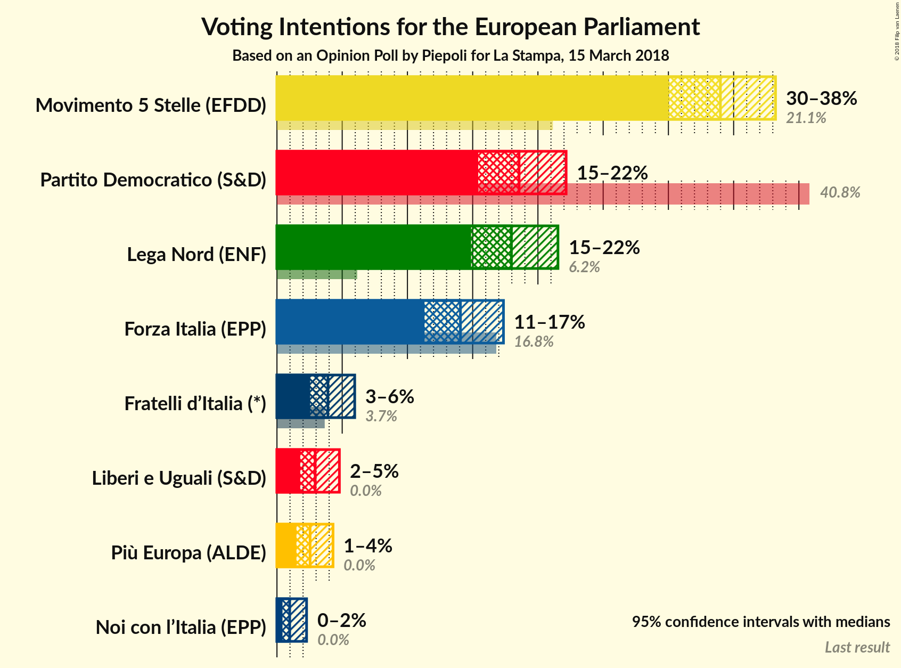
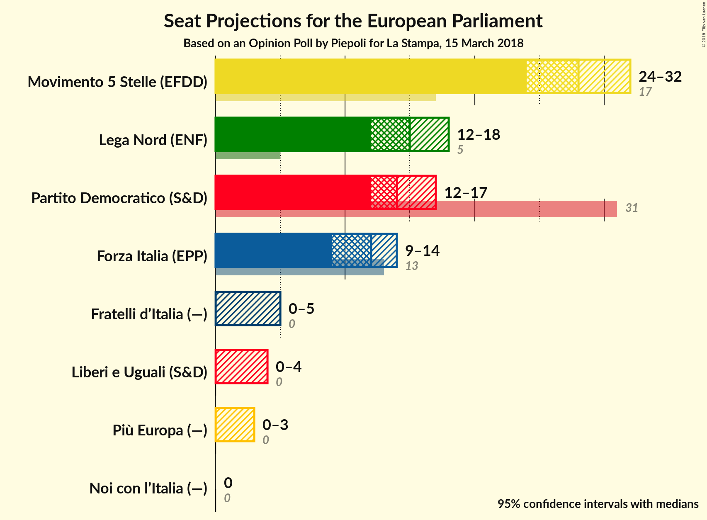
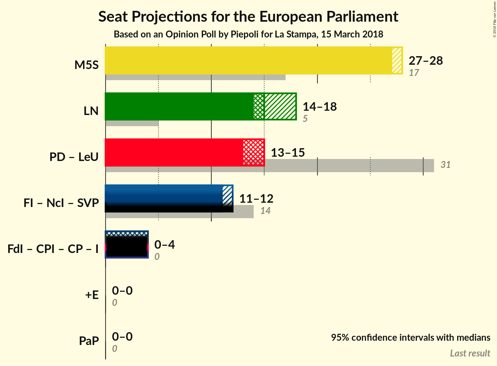

# Opinion Poll by Piepoli for La Stampa, 15 March 2018

<a href="#voting-intentions">Voting Intentions</a> | <a href="#seats">Seats</a> | <a href="#coalitions">Coalitions</a> | <a href="#technical-information">Technical Information</a>

## Voting Intentions

### Confidence Intervals

| Party | Last Result | Poll Result | 80% Confidence Interval | 90% Confidence Interval | 95% Confidence Interval | 99% Confidence Interval |
|:-----:|:-----------:|:-----------:|:-----------------------:|:-----------------------:|:-----------------------:|:-----------------------:|
| Movimento 5 Stelle (EFDD) | 21.1% | 34.0% | N/A |N/A |N/A |N/A |
| Partito Democratico (S&D) | 40.8% | 18.6% | N/A |N/A |N/A |N/A |
| Lega Nord (ENF) | 6.2% | 18.0% | N/A |N/A |N/A |N/A |
| Forza Italia (EPP) | 16.8% | 14.1% | N/A |N/A |N/A |N/A |
| Fratelli d’Italia (—) | 3.7% | 3.9% | N/A |N/A |N/A |N/A |
| Liberi e Uguali (S&D) | 0.0% | 2.9% | N/A |N/A |N/A |N/A |
| Più Europa (—) | 0.0% | 2.5% | N/A |N/A |N/A |N/A |
| Noi con l’Italia (—) | 0.0% | 1.0% | N/A |N/A |N/A |N/A |

*Note:* The poll result column reflects the actual value used in the calculations. Published results may vary slightly, and in addition be rounded to fewer digits.

## Seats

### Confidence Intervals

| Party | Last Result | Median | 80% Confidence Interval | 90% Confidence Interval | 95% Confidence Interval | 99% Confidence Interval |
|:-----:|:-----------:|:------:|:-----------------------:|:-----------------------:|:-----------------------:|:-----------------------:|
| <a href="#movimento-5-stelle-(efdd)">Movimento 5 Stelle (EFDD)</a> | 17 | N/A | N/A |N/A |N/A |N/A |
| <a href="#partito-democratico-(s&d)">Partito Democratico (S&D)</a> | 31 | N/A | N/A |N/A |N/A |N/A |
| <a href="#lega-nord-(enf)">Lega Nord (ENF)</a> | 5 | N/A | N/A |N/A |N/A |N/A |
| <a href="#forza-italia-(epp)">Forza Italia (EPP)</a> | 13 | N/A | N/A |N/A |N/A |N/A |
| <a href="#fratelli-d’italia-(—)">Fratelli d’Italia (—)</a> | 0 | N/A | N/A |N/A |N/A |N/A |
| <a href="#liberi-e-uguali-(s&d)">Liberi e Uguali (S&D)</a> | 0 | N/A | N/A |N/A |N/A |N/A |
| <a href="#più-europa-(—)">Più Europa (—)</a> | 0 | N/A | N/A |N/A |N/A |N/A |
| <a href="#noi-con-l’italia-(—)">Noi con l’Italia (—)</a> | 0 | N/A | N/A |N/A |N/A |N/A |

## Coalitions

## Technical Information

### Opinion Poll

+ **Polling firm:** Piepoli
+ **Commissioner(s):** La Stampa
+ **Fieldwork period:** 15 March 2018

### Calculations

+ **Sample size:** 512
+ **Simulations done:** 0
+ **Error estimate:** 100.00%

