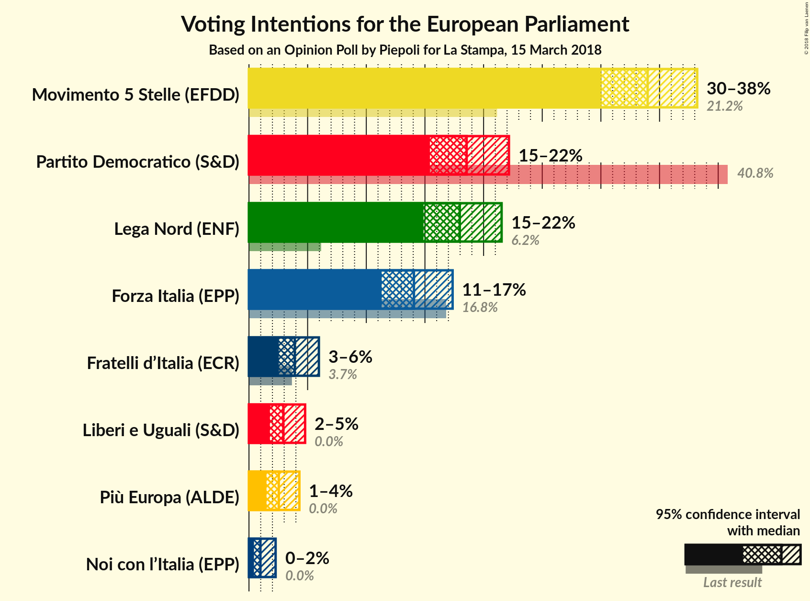
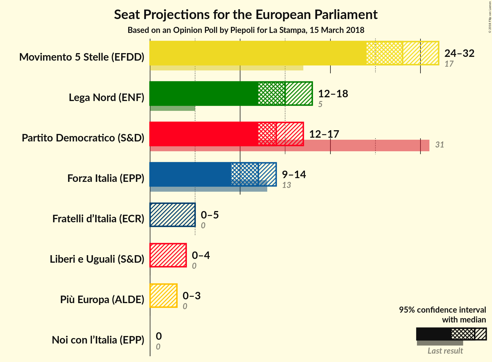
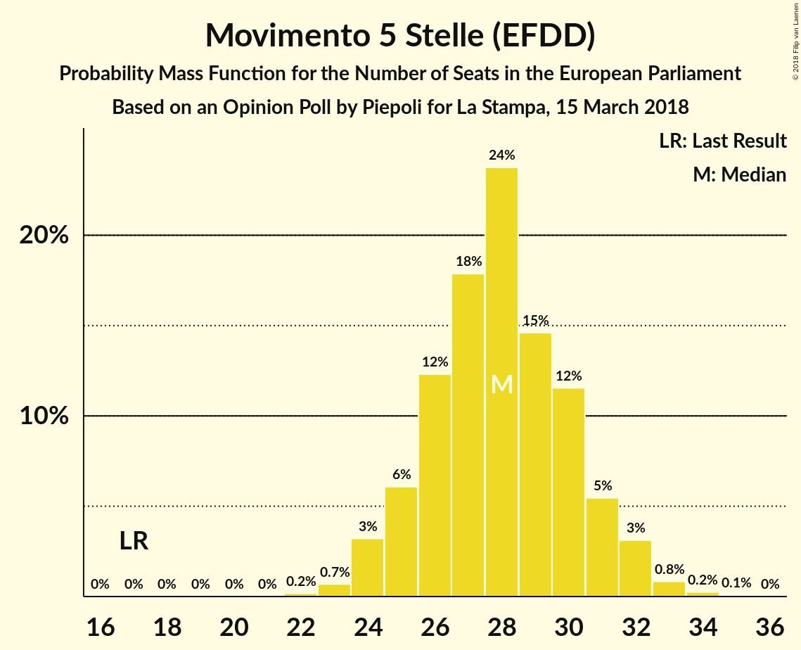
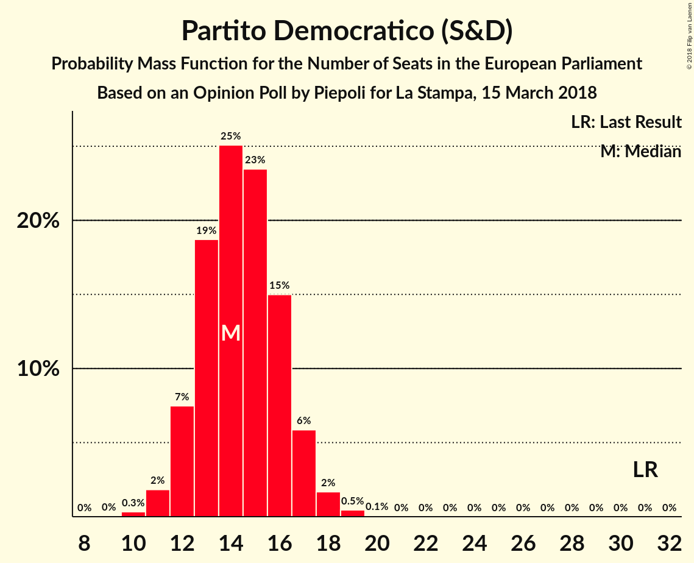
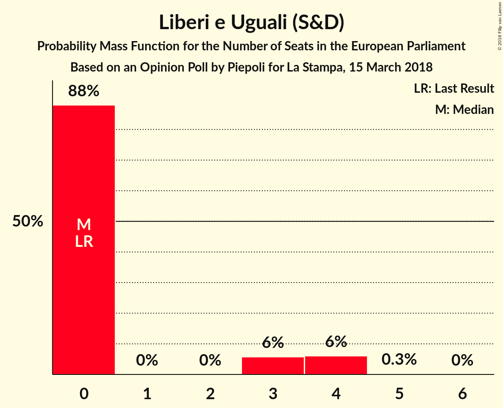
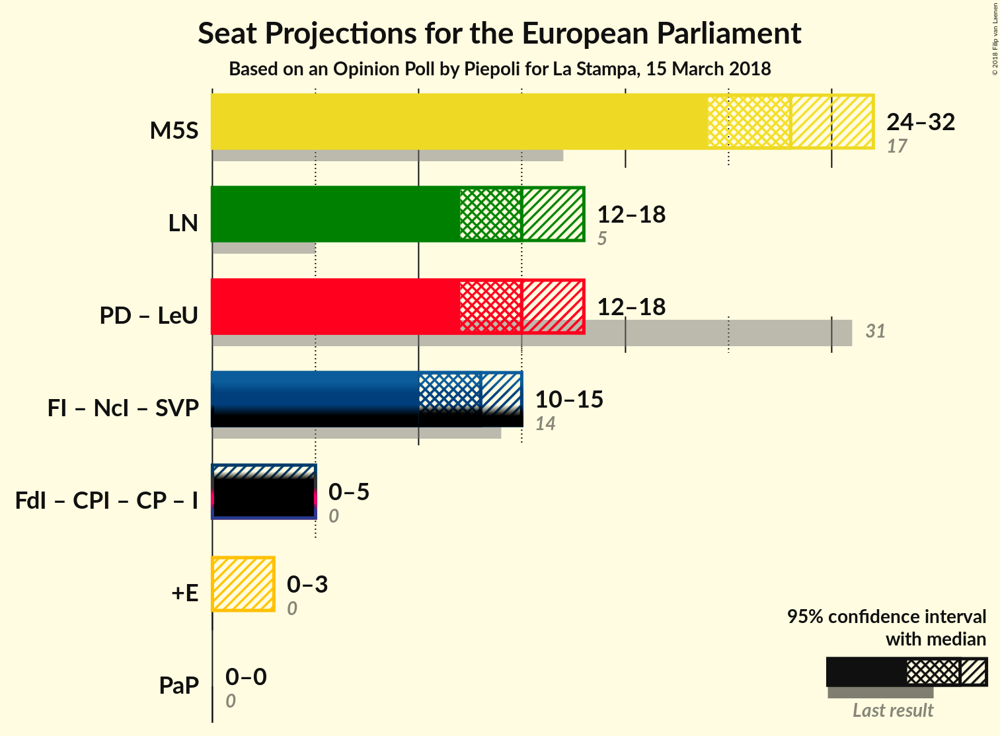

# Opinion Poll by Piepoli for La Stampa, 15 March 2018

<a href="#voting-intentions">Voting Intentions</a> | <a href="#seats">Seats</a> | <a href="#coalitions">Coalitions</a> | <a href="#technical-information">Technical Information</a>

## Voting Intentions

### Confidence Intervals

| Party | Last Result | Poll Result | 80% Confidence Interval | 90% Confidence Interval | 95% Confidence Interval | 99% Confidence Interval |
|:-----:|:-----------:|:-----------:|:-----------------------:|:-----------------------:|:-----------------------:|:-----------------------:|
| Movimento 5 Stelle (EFDD) | 21.1% | 34.0% | 31.4–36.7% |30.6–37.5% |30.0–38.2% |28.8–39.5% |
| Partito Democratico (S&D) | 40.8% | 18.6% | 16.5–20.9% |15.9–21.6% |15.4–22.2% |14.5–23.3% |
| Lega Nord (ENF) | 6.2% | 18.0% | 15.9–20.3% |15.4–21.0% |14.9–21.5% |14.0–22.7% |
| Forza Italia (EPP) | 16.8% | 14.1% | 12.3–16.2% |11.8–16.8% |11.3–17.4% |10.5–18.4% |
| Fratelli d’Italia (*) | 3.7% | 3.9% | 3.0–5.2% |2.8–5.6% |2.5–6.0% |2.2–6.7% |
| Liberi e Uguali (S&D) | 0.0% | 2.9% | 2.2–4.1% |2.0–4.5% |1.8–4.8% |1.5–5.4% |
| Più Europa (ALDE) | 0.0% | 2.5% | 1.8–3.7% |1.6–4.0% |1.5–4.3% |1.2–4.9% |
| Noi con l’Italia (EPP) | 0.0% | 1.0% | 0.6–1.8% |0.5–2.0% |0.4–2.3% |0.3–2.7% |

*Note:* The poll result column reflects the actual value used in the calculations. Published results may vary slightly, and in addition be rounded to fewer digits.

## Seats

### Confidence Intervals

| Party | Last Result | Median | 80% Confidence Interval | 90% Confidence Interval | 95% Confidence Interval | 99% Confidence Interval |
|:-----:|:-----------:|:------:|:-----------------------:|:-----------------------:|:-----------------------:|:-----------------------:|
| <a href="#movimento-5-stelle-(efdd)">Movimento 5 Stelle (EFDD)</a> | 17 | 28 | 25–30 |25–31 |24–32 |23–33 |
| <a href="#partito-democratico-(s&d)">Partito Democratico (S&D)</a> | 31 | 15 | 13–16 |12–17 |12–17 |11–18 |
| <a href="#lega-nord-(enf)">Lega Nord (ENF)</a> | 5 | 14 | 13–16 |12–17 |12–18 |11–18 |
| <a href="#forza-italia-(epp)">Forza Italia (EPP)</a> | 13 | 12 | 10–13 |10–13 |9–14 |8–15 |
| <a href="#fratelli-d’italia-(*)">Fratelli d’Italia (*)</a> | 0 | 3 | 0–4 |0–5 |0–5 |0–6 |
| <a href="#liberi-e-uguali-(s&d)">Liberi e Uguali (S&D)</a> | 0 | 0 | 0–3 |0–4 |0–4 |0–4 |
| <a href="#più-europa-(alde)">Più Europa (ALDE)</a> | 0 | 0 | 0 |0 |0–4 |0–4 |
| <a href="#noi-con-l’italia-(epp)">Noi con l’Italia (EPP)</a> | 0 | 0 | 0 |0 |0 |0 |

### Movimento 5 Stelle (EFDD)

*For a full overview of the results for this party, see the [Movimento 5 Stelle (EFDD)](party-movimento5stelleefdd.html) page.*

| Number of Seats | Probability | Accumulated | Special Marks |
|:---------------:|:-----------:|:-----------:|:-------------:|
| 17 | 0% | 100% | Last Result |
| 18 | 0% | 100% |  |
| 19 | 0% | 100% |  |
| 20 | 0% | 100% |  |
| 21 | 0% | 100% |  |
| 22 | 0.2% | 100% |  |
| 23 | 1.0% | 99.7% |  |
| 24 | 2% | 98.7% |  |
| 25 | 7% | 96% |  |
| 26 | 12% | 90% |  |
| 27 | 22% | 77% |  |
| 28 | 18% | 55% | Median |
| 29 | 12% | 37% |  |
| 30 | 18% | 25% |  |
| 31 | 2% | 7% |  |
| 32 | 3% | 4% |  |
| 33 | 1.4% | 2% |  |
| 34 | 0.1% | 0.1% |  |
| 35 | 0% | 0% |  |

### Partito Democratico (S&D)

*For a full overview of the results for this party, see the [Partito Democratico (S&D)](party-partitodemocraticosd.html) page.*

| Number of Seats | Probability | Accumulated | Special Marks |
|:---------------:|:-----------:|:-----------:|:-------------:|
| 10 | 0.4% | 100% |  |
| 11 | 1.2% | 99.6% |  |
| 12 | 8% | 98% |  |
| 13 | 18% | 91% |  |
| 14 | 17% | 73% |  |
| 15 | 33% | 56% | Median |
| 16 | 16% | 23% |  |
| 17 | 5% | 7% |  |
| 18 | 2% | 2% |  |
| 19 | 0.2% | 0.2% |  |
| 20 | 0.1% | 0.1% |  |
| 21 | 0% | 0% |  |
| 22 | 0% | 0% |  |
| 23 | 0% | 0% |  |
| 24 | 0% | 0% |  |
| 25 | 0% | 0% |  |
| 26 | 0% | 0% |  |
| 27 | 0% | 0% |  |
| 28 | 0% | 0% |  |
| 29 | 0% | 0% |  |
| 30 | 0% | 0% |  |
| 31 | 0% | 0% | Last Result |

### Lega Nord (ENF)

*For a full overview of the results for this party, see the [Lega Nord (ENF)](party-leganordenf.html) page.*

| Number of Seats | Probability | Accumulated | Special Marks |
|:---------------:|:-----------:|:-----------:|:-------------:|
| 5 | 0% | 100% | Last Result |
| 6 | 0% | 100% |  |
| 7 | 0% | 100% |  |
| 8 | 0% | 100% |  |
| 9 | 0% | 100% |  |
| 10 | 0% | 100% |  |
| 11 | 2% | 100% |  |
| 12 | 5% | 98% |  |
| 13 | 26% | 94% |  |
| 14 | 26% | 68% | Median |
| 15 | 18% | 42% |  |
| 16 | 14% | 24% |  |
| 17 | 7% | 10% |  |
| 18 | 2% | 3% |  |
| 19 | 0.2% | 0.3% |  |
| 20 | 0.1% | 0.1% |  |
| 21 | 0% | 0% |  |

### Forza Italia (EPP)

*For a full overview of the results for this party, see the [Forza Italia (EPP)](party-forzaitaliaepp.html) page.*

| Number of Seats | Probability | Accumulated | Special Marks |
|:---------------:|:-----------:|:-----------:|:-------------:|
| 8 | 0.6% | 100% |  |
| 9 | 3% | 99.4% |  |
| 10 | 11% | 96% |  |
| 11 | 32% | 85% |  |
| 12 | 27% | 53% | Median |
| 13 | 22% | 26% | Last Result |
| 14 | 3% | 4% |  |
| 15 | 1.0% | 1.1% |  |
| 16 | 0.1% | 0.1% |  |
| 17 | 0% | 0% |  |

### Fratelli d’Italia (*)

*For a full overview of the results for this party, see the [Fratelli d’Italia (*)](party-fratellid’italia.html) page.*

| Number of Seats | Probability | Accumulated | Special Marks |
|:---------------:|:-----------:|:-----------:|:-------------:|
| 0 | 48% | 100% | Last Result |
| 1 | 0% | 52% |  |
| 2 | 0% | 52% |  |
| 3 | 26% | 52% | Median |
| 4 | 20% | 25% |  |
| 5 | 5% | 5% |  |
| 6 | 0.6% | 0.6% |  |
| 7 | 0% | 0% |  |

### Liberi e Uguali (S&D)

*For a full overview of the results for this party, see the [Liberi e Uguali (S&D)](party-liberieugualisd.html) page.*

| Number of Seats | Probability | Accumulated | Special Marks |
|:---------------:|:-----------:|:-----------:|:-------------:|
| 0 | 87% | 100% | Last Result, Median |
| 1 | 0% | 13% |  |
| 2 | 0% | 13% |  |
| 3 | 7% | 13% |  |
| 4 | 6% | 6% |  |
| 5 | 0.3% | 0.3% |  |
| 6 | 0% | 0% |  |

### Più Europa (ALDE)

*For a full overview of the results for this party, see the [Più Europa (ALDE)](party-piùeuropaalde.html) page.*

| Number of Seats | Probability | Accumulated | Special Marks |
|:---------------:|:-----------:|:-----------:|:-------------:|
| 0 | 95% | 100% | Last Result, Median |
| 1 | 0% | 5% |  |
| 2 | 0% | 5% |  |
| 3 | 1.4% | 5% |  |
| 4 | 3% | 3% |  |
| 5 | 0% | 0% |  |

### Noi con l’Italia (EPP)

*For a full overview of the results for this party, see the [Noi con l’Italia (EPP)](party-noiconl’italiaepp.html) page.*

| Number of Seats | Probability | Accumulated | Special Marks |
|:---------------:|:-----------:|:-----------:|:-------------:|
| 0 | 100% | 100% | Last Result, Median |

## Coalitions

### Confidence Intervals

| Coalition | Last Result | Median | Majority? | 80% Confidence Interval | 90% Confidence Interval | 95% Confidence Interval | 99% Confidence Interval |
|:---------:|:-----------:|:------:|:---------:|:-----------------------:|:-----------------------:|:-----------------------:|:-----------------------:|
| Movimento 5 Stelle (EFDD) | 17 | 28 | 0% | 25–30 | 25–31 | 24–32 | 23–33 |
| Lega Nord (ENF) | 5 | 14 | 0% | 13–16 | 12–17 | 12–18 | 11–18 |
| Partito Democratico (S&D) – Liberi e Uguali (S&D) | 31 | 15 | 0% | 13–17 | 12–18 | 12–18 | 11–20 |
| Più Europa (ALDE) | 0 | 0 | 0% | 0 | 0 | 0–4 | 0–4 |

### Movimento 5 Stelle (EFDD)

| Number of Seats | Probability | Accumulated | Special Marks |
|:---------------:|:-----------:|:-----------:|:-------------:|
| 17 | 0% | 100% | Last Result |
| 18 | 0% | 100% |  |
| 19 | 0% | 100% |  |
| 20 | 0% | 100% |  |
| 21 | 0% | 100% |  |
| 22 | 0.2% | 100% |  |
| 23 | 1.0% | 99.7% |  |
| 24 | 2% | 98.7% |  |
| 25 | 7% | 96% |  |
| 26 | 12% | 90% |  |
| 27 | 22% | 77% |  |
| 28 | 18% | 55% | Median |
| 29 | 12% | 37% |  |
| 30 | 18% | 25% |  |
| 31 | 2% | 7% |  |
| 32 | 3% | 4% |  |
| 33 | 1.4% | 2% |  |
| 34 | 0.1% | 0.1% |  |
| 35 | 0% | 0% |  |

### Lega Nord (ENF)

| Number of Seats | Probability | Accumulated | Special Marks |
|:---------------:|:-----------:|:-----------:|:-------------:|
| 5 | 0% | 100% | Last Result |
| 6 | 0% | 100% |  |
| 7 | 0% | 100% |  |
| 8 | 0% | 100% |  |
| 9 | 0% | 100% |  |
| 10 | 0% | 100% |  |
| 11 | 2% | 100% |  |
| 12 | 5% | 98% |  |
| 13 | 26% | 94% |  |
| 14 | 26% | 68% | Median |
| 15 | 18% | 42% |  |
| 16 | 14% | 24% |  |
| 17 | 7% | 10% |  |
| 18 | 2% | 3% |  |
| 19 | 0.2% | 0.3% |  |
| 20 | 0.1% | 0.1% |  |
| 21 | 0% | 0% |  |

### Partito Democratico (S&D) – Liberi e Uguali (S&D)

| Number of Seats | Probability | Accumulated | Special Marks |
|:---------------:|:-----------:|:-----------:|:-------------:|
| 10 | 0.3% | 100% |  |
| 11 | 0.8% | 99.7% |  |
| 12 | 6% | 99.0% |  |
| 13 | 14% | 92% |  |
| 14 | 12% | 78% |  |
| 15 | 32% | 66% | Median |
| 16 | 17% | 34% |  |
| 17 | 9% | 16% |  |
| 18 | 5% | 8% |  |
| 19 | 1.1% | 2% |  |
| 20 | 1.1% | 1.2% |  |
| 21 | 0.1% | 0.1% |  |
| 22 | 0% | 0% |  |
| 23 | 0% | 0% |  |
| 24 | 0% | 0% |  |
| 25 | 0% | 0% |  |
| 26 | 0% | 0% |  |
| 27 | 0% | 0% |  |
| 28 | 0% | 0% |  |
| 29 | 0% | 0% |  |
| 30 | 0% | 0% |  |
| 31 | 0% | 0% | Last Result |

### Più Europa (ALDE)

| Number of Seats | Probability | Accumulated | Special Marks |
|:---------------:|:-----------:|:-----------:|:-------------:|
| 0 | 95% | 100% | Last Result, Median |
| 1 | 0% | 5% |  |
| 2 | 0% | 5% |  |
| 3 | 1.4% | 5% |  |
| 4 | 3% | 3% |  |
| 5 | 0% | 0% |  |

## Technical Information

### Opinion Poll

+ **Polling firm:** Piepoli
+ **Commissioner(s):** La Stampa
+ **Fieldwork period:** 15 March 2018

### Calculations

+ **Sample size:** 512
+ **Simulations done:** 131,072
+ **Error estimate:** 2.91%

