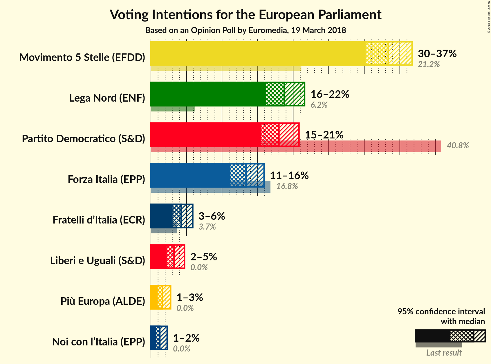
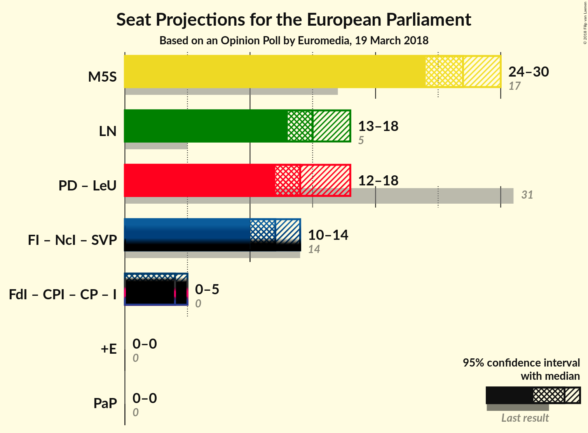

# Opinion Poll by Euromedia, 19 March 2018

<a href="#voting-intentions">Voting Intentions</a> | <a href="#seats">Seats</a> | <a href="#coalitions">Coalitions</a> | <a href="#technical-information">Technical Information</a>

## Voting Intentions

### Confidence Intervals

| Party | Last Result | Poll Result | 80% Confidence Interval | 90% Confidence Interval | 95% Confidence Interval | 99% Confidence Interval |
|:-----:|:-----------:|:-----------:|:-----------------------:|:-----------------------:|:-----------------------:|:-----------------------:|
| Movimento 5 Stelle (EFDD) | 21.1% | 33.4% | 31.3–35.6% |30.7–36.2% |30.2–36.7% |29.2–37.8% |
| Lega Nord (ENF) | 6.2% | 18.8% | 17.1–20.6% |16.6–21.2% |16.2–21.6% |15.4–22.5% |
| Partito Democratico (S&D) | 40.8% | 18.0% | 16.4–19.8% |15.9–20.4% |15.5–20.8% |14.7–21.7% |
| Forza Italia (EPP) | 16.8% | 13.4% | 11.9–15.0% |11.5–15.5% |11.2–15.9% |10.5–16.8% |
| Fratelli d’Italia (*) | 3.7% | 4.2% | 3.5–5.3% |3.2–5.6% |3.0–5.9% |2.7–6.4% |
| Liberi e Uguali (S&D) | 0.0% | 3.2% | 2.6–4.2% |2.4–4.5% |2.2–4.7% |1.9–5.2% |
| Più Europa (ALDE) | 0.0% | 1.6% | 1.2–2.4% |1.1–2.6% |0.9–2.8% |0.8–3.2% |
| Noi con l’Italia (EPP) | 0.0% | 1.2% | 0.9–1.9% |0.8–2.1% |0.7–2.3% |0.5–2.7% |

*Note:* The poll result column reflects the actual value used in the calculations. Published results may vary slightly, and in addition be rounded to fewer digits.

## Seats

### Confidence Intervals

| Party | Last Result | Median | 80% Confidence Interval | 90% Confidence Interval | 95% Confidence Interval | 99% Confidence Interval |
|:-----:|:-----------:|:------:|:-----------------------:|:-----------------------:|:-----------------------:|:-----------------------:|
| <a href="#movimento-5-stelle-(efdd)">Movimento 5 Stelle (EFDD)</a> | 17 | 27 | 25–29 |25–30 |24–30 |23–31 |
| <a href="#lega-nord-(enf)">Lega Nord (ENF)</a> | 5 | 15 | 14–17 |13–17 |13–18 |12–18 |
| <a href="#partito-democratico-(s&d)">Partito Democratico (S&D)</a> | 31 | 14 | 12–15 |12–16 |11–16 |11–17 |
| <a href="#forza-italia-(epp)">Forza Italia (EPP)</a> | 13 | 11 | 10–12 |9–13 |9–13 |8–14 |
| <a href="#fratelli-d’italia-(*)">Fratelli d’Italia (*)</a> | 0 | 4 | 0–4 |0–4 |0–5 |0–5 |
| <a href="#liberi-e-uguali-(s&d)">Liberi e Uguali (S&D)</a> | 0 | 0 | 0–3 |0–4 |0–4 |0–4 |
| <a href="#più-europa-(alde)">Più Europa (ALDE)</a> | 0 | 0 | 0 |0 |0 |0 |
| <a href="#noi-con-l’italia-(epp)">Noi con l’Italia (EPP)</a> | 0 | 0 | 0 |0 |0 |0 |

### Movimento 5 Stelle (EFDD)

*For a full overview of the results for this party, see the [Movimento 5 Stelle (EFDD)](party-movimento5stelleefdd.html) page.*

| Number of Seats | Probability | Accumulated | Special Marks |
|:---------------:|:-----------:|:-----------:|:-------------:|
| 17 | 0% | 100% | Last Result |
| 18 | 0% | 100% |  |
| 19 | 0% | 100% |  |
| 20 | 0% | 100% |  |
| 21 | 0% | 100% |  |
| 22 | 0.1% | 100% |  |
| 23 | 0.7% | 99.9% |  |
| 24 | 4% | 99.2% |  |
| 25 | 10% | 95% |  |
| 26 | 20% | 85% |  |
| 27 | 26% | 65% | Median |
| 28 | 22% | 39% |  |
| 29 | 10% | 18% |  |
| 30 | 5% | 7% |  |
| 31 | 1.5% | 2% |  |
| 32 | 0.3% | 0.3% |  |
| 33 | 0% | 0% |  |

### Lega Nord (ENF)

*For a full overview of the results for this party, see the [Lega Nord (ENF)](party-leganordenf.html) page.*

| Number of Seats | Probability | Accumulated | Special Marks |
|:---------------:|:-----------:|:-----------:|:-------------:|
| 5 | 0% | 100% | Last Result |
| 6 | 0% | 100% |  |
| 7 | 0% | 100% |  |
| 8 | 0% | 100% |  |
| 9 | 0% | 100% |  |
| 10 | 0% | 100% |  |
| 11 | 0% | 100% |  |
| 12 | 0.7% | 100% |  |
| 13 | 5% | 99.3% |  |
| 14 | 21% | 94% |  |
| 15 | 36% | 73% | Median |
| 16 | 24% | 37% |  |
| 17 | 10% | 13% |  |
| 18 | 3% | 4% |  |
| 19 | 0.4% | 0.5% |  |
| 20 | 0.1% | 0.1% |  |
| 21 | 0% | 0% |  |

### Partito Democratico (S&D)

*For a full overview of the results for this party, see the [Partito Democratico (S&D)](party-partitodemocraticosd.html) page.*

| Number of Seats | Probability | Accumulated | Special Marks |
|:---------------:|:-----------:|:-----------:|:-------------:|
| 10 | 0.3% | 100% |  |
| 11 | 3% | 99.7% |  |
| 12 | 13% | 97% |  |
| 13 | 31% | 83% |  |
| 14 | 33% | 53% | Median |
| 15 | 15% | 20% |  |
| 16 | 4% | 5% |  |
| 17 | 0.7% | 0.8% |  |
| 18 | 0.1% | 0.1% |  |
| 19 | 0% | 0% |  |
| 20 | 0% | 0% |  |
| 21 | 0% | 0% |  |
| 22 | 0% | 0% |  |
| 23 | 0% | 0% |  |
| 24 | 0% | 0% |  |
| 25 | 0% | 0% |  |
| 26 | 0% | 0% |  |
| 27 | 0% | 0% |  |
| 28 | 0% | 0% |  |
| 29 | 0% | 0% |  |
| 30 | 0% | 0% |  |
| 31 | 0% | 0% | Last Result |

### Forza Italia (EPP)

*For a full overview of the results for this party, see the [Forza Italia (EPP)](party-forzaitaliaepp.html) page.*

| Number of Seats | Probability | Accumulated | Special Marks |
|:---------------:|:-----------:|:-----------:|:-------------:|
| 8 | 0.6% | 100% |  |
| 9 | 7% | 99.4% |  |
| 10 | 25% | 92% |  |
| 11 | 40% | 67% | Median |
| 12 | 22% | 28% |  |
| 13 | 5% | 6% | Last Result |
| 14 | 0.6% | 0.6% |  |
| 15 | 0% | 0% |  |

### Fratelli d’Italia (*)

*For a full overview of the results for this party, see the [Fratelli d’Italia (*)](party-fratellid’italia.html) page.*

| Number of Seats | Probability | Accumulated | Special Marks |
|:---------------:|:-----------:|:-----------:|:-------------:|
| 0 | 33% | 100% | Last Result |
| 1 | 0% | 67% |  |
| 2 | 0% | 67% |  |
| 3 | 16% | 67% |  |
| 4 | 47% | 52% | Median |
| 5 | 5% | 5% |  |
| 6 | 0.1% | 0.1% |  |
| 7 | 0% | 0% |  |

### Liberi e Uguali (S&D)

*For a full overview of the results for this party, see the [Liberi e Uguali (S&D)](party-liberieugualisd.html) page.*

| Number of Seats | Probability | Accumulated | Special Marks |
|:---------------:|:-----------:|:-----------:|:-------------:|
| 0 | 85% | 100% | Last Result, Median |
| 1 | 0% | 15% |  |
| 2 | 0% | 15% |  |
| 3 | 8% | 15% |  |
| 4 | 7% | 7% |  |
| 5 | 0.1% | 0.1% |  |
| 6 | 0% | 0% |  |

### Più Europa (ALDE)

*For a full overview of the results for this party, see the [Più Europa (ALDE)](party-piùeuropaalde.html) page.*

| Number of Seats | Probability | Accumulated | Special Marks |
|:---------------:|:-----------:|:-----------:|:-------------:|
| 0 | 100% | 100% | Last Result, Median |

### Noi con l’Italia (EPP)

*For a full overview of the results for this party, see the [Noi con l’Italia (EPP)](party-noiconl’italiaepp.html) page.*

| Number of Seats | Probability | Accumulated | Special Marks |
|:---------------:|:-----------:|:-----------:|:-------------:|
| 0 | 100% | 100% | Last Result, Median |

## Coalitions

### Confidence Intervals

| Coalition | Last Result | Median | Majority? | 80% Confidence Interval | 90% Confidence Interval | 95% Confidence Interval | 99% Confidence Interval |
|:---------:|:-----------:|:------:|:---------:|:-----------------------:|:-----------------------:|:-----------------------:|:-----------------------:|
| Movimento 5 Stelle (EFDD) | 17 | 27 | 0% | 25–29 | 25–30 | 24–30 | 23–31 |
| Lega Nord (ENF) | 5 | 15 | 0% | 14–17 | 13–17 | 13–18 | 12–18 |
| Partito Democratico (S&D) – Liberi e Uguali (S&D) | 31 | 14 | 0% | 12–16 | 12–17 | 12–18 | 11–19 |
| Più Europa (ALDE) | 0 | 0 | 0% | 0 | 0 | 0 | 0 |

### Movimento 5 Stelle (EFDD)

| Number of Seats | Probability | Accumulated | Special Marks |
|:---------------:|:-----------:|:-----------:|:-------------:|
| 17 | 0% | 100% | Last Result |
| 18 | 0% | 100% |  |
| 19 | 0% | 100% |  |
| 20 | 0% | 100% |  |
| 21 | 0% | 100% |  |
| 22 | 0.1% | 100% |  |
| 23 | 0.7% | 99.9% |  |
| 24 | 4% | 99.2% |  |
| 25 | 10% | 95% |  |
| 26 | 20% | 85% |  |
| 27 | 26% | 65% | Median |
| 28 | 22% | 39% |  |
| 29 | 10% | 18% |  |
| 30 | 5% | 7% |  |
| 31 | 1.5% | 2% |  |
| 32 | 0.3% | 0.3% |  |
| 33 | 0% | 0% |  |

### Lega Nord (ENF)

| Number of Seats | Probability | Accumulated | Special Marks |
|:---------------:|:-----------:|:-----------:|:-------------:|
| 5 | 0% | 100% | Last Result |
| 6 | 0% | 100% |  |
| 7 | 0% | 100% |  |
| 8 | 0% | 100% |  |
| 9 | 0% | 100% |  |
| 10 | 0% | 100% |  |
| 11 | 0% | 100% |  |
| 12 | 0.7% | 100% |  |
| 13 | 5% | 99.3% |  |
| 14 | 21% | 94% |  |
| 15 | 36% | 73% | Median |
| 16 | 24% | 37% |  |
| 17 | 10% | 13% |  |
| 18 | 3% | 4% |  |
| 19 | 0.4% | 0.5% |  |
| 20 | 0.1% | 0.1% |  |
| 21 | 0% | 0% |  |

### Partito Democratico (S&D) – Liberi e Uguali (S&D)

| Number of Seats | Probability | Accumulated | Special Marks |
|:---------------:|:-----------:|:-----------:|:-------------:|
| 10 | 0.1% | 100% |  |
| 11 | 2% | 99.9% |  |
| 12 | 11% | 98% |  |
| 13 | 26% | 87% |  |
| 14 | 29% | 62% | Median |
| 15 | 16% | 33% |  |
| 16 | 8% | 17% |  |
| 17 | 5% | 9% |  |
| 18 | 3% | 4% |  |
| 19 | 1.0% | 1.1% |  |
| 20 | 0.1% | 0.1% |  |
| 21 | 0% | 0% |  |
| 22 | 0% | 0% |  |
| 23 | 0% | 0% |  |
| 24 | 0% | 0% |  |
| 25 | 0% | 0% |  |
| 26 | 0% | 0% |  |
| 27 | 0% | 0% |  |
| 28 | 0% | 0% |  |
| 29 | 0% | 0% |  |
| 30 | 0% | 0% |  |
| 31 | 0% | 0% | Last Result |

### Più Europa (ALDE)

| Number of Seats | Probability | Accumulated | Special Marks |
|:---------------:|:-----------:|:-----------:|:-------------:|
| 0 | 100% | 100% | Last Result, Median |

## Technical Information

### Opinion Poll

+ **Polling firm:** Euromedia
+ **Commissioner(s):** —
+ **Fieldwork period:** 19 March 2018

### Calculations

+ **Sample size:** 800
+ **Simulations done:** 1,048,576
+ **Error estimate:** 1.30%

