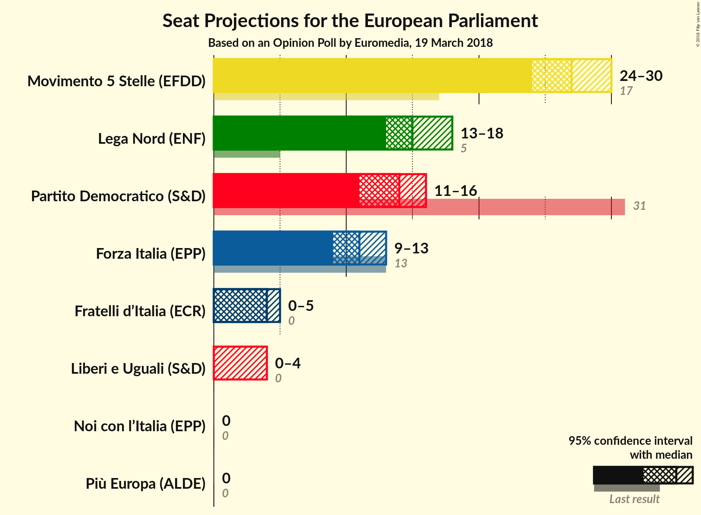
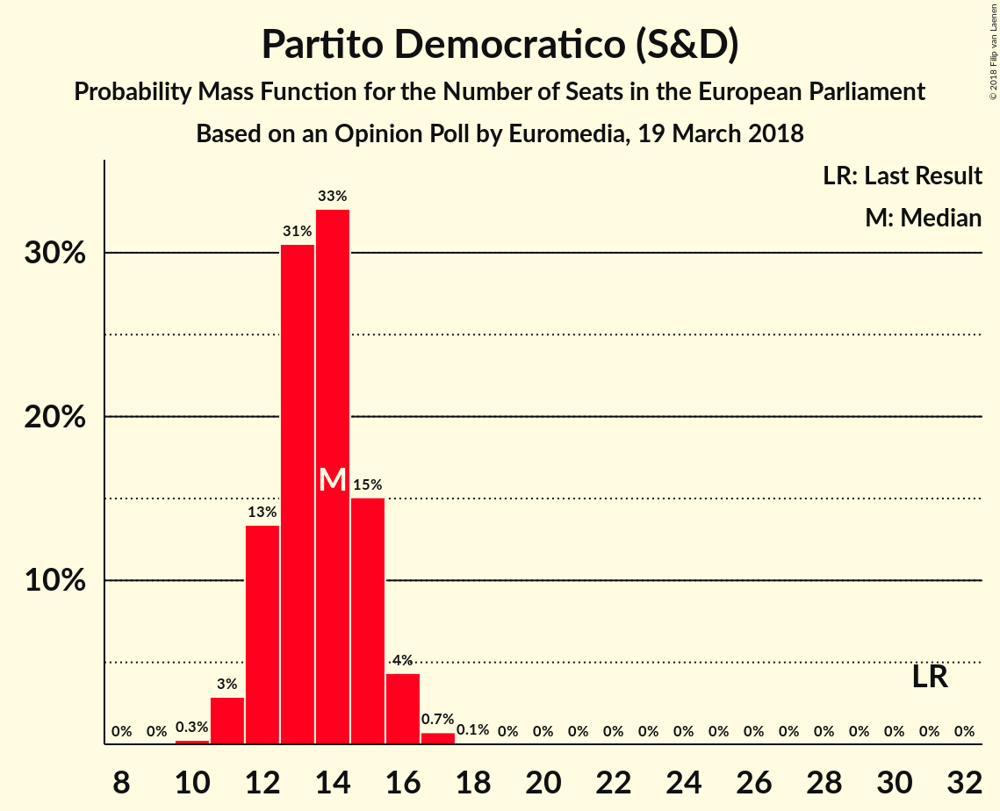
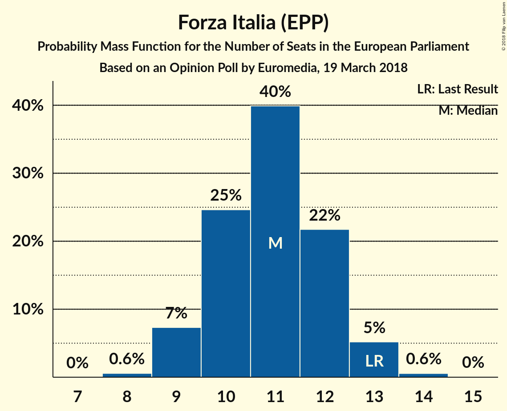
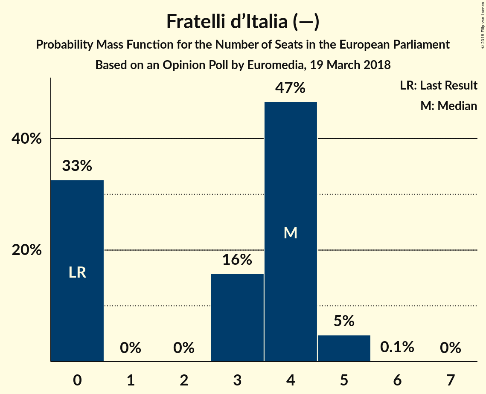
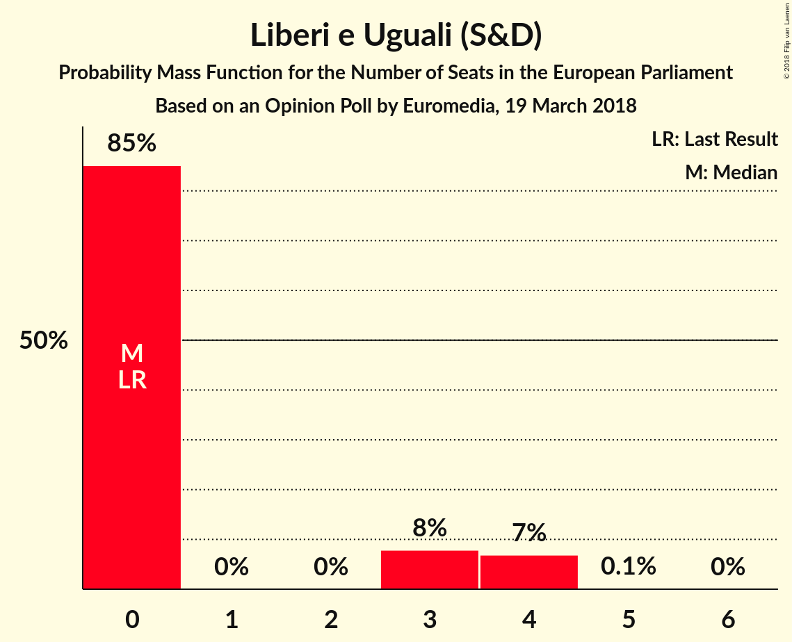

# Opinion Poll by Euromedia, 19 March 2018

<a href="#voting-intentions">Voting Intentions</a> | <a href="#seats">Seats</a> | <a href="#coalitions">Coalitions</a> | <a href="#technical-information">Technical Information</a>

## Voting Intentions

### Confidence Intervals

| Party | Last Result | Poll Result | 80% Confidence Interval | 90% Confidence Interval | 95% Confidence Interval | 99% Confidence Interval |
|:-----:|:-----------:|:-----------:|:-----------------------:|:-----------------------:|:-----------------------:|:-----------------------:|
| Movimento 5 Stelle (EFDD) | 21.1% | 33.4% | 31.3–35.6% |30.7–36.2% |30.2–36.7% |29.2–37.8% |
| Lega Nord (ENF) | 6.2% | 18.8% | 17.1–20.6% |16.6–21.2% |16.2–21.6% |15.4–22.5% |
| Partito Democratico (S&D) | 40.8% | 18.0% | 16.4–19.8% |15.9–20.4% |15.5–20.8% |14.7–21.7% |
| Forza Italia (EPP) | 16.8% | 13.4% | 11.9–15.0% |11.5–15.5% |11.2–15.9% |10.5–16.8% |
| Fratelli d’Italia (—) | 3.7% | 4.2% | 3.5–5.3% |3.2–5.6% |3.0–5.9% |2.7–6.4% |
| Liberi e Uguali (S&D) | 0.0% | 3.2% | 2.6–4.2% |2.4–4.5% |2.2–4.7% |1.9–5.2% |
| Più Europa (—) | 0.0% | 1.6% | 1.2–2.4% |1.1–2.6% |0.9–2.8% |0.8–3.2% |
| Noi con l’Italia (—) | 0.0% | 1.2% | 0.9–1.9% |0.8–2.1% |0.7–2.3% |0.5–2.7% |

*Note:* The poll result column reflects the actual value used in the calculations. Published results may vary slightly, and in addition be rounded to fewer digits.

## Seats

### Confidence Intervals

| Party | Last Result | Median | 80% Confidence Interval | 90% Confidence Interval | 95% Confidence Interval | 99% Confidence Interval |
|:-----:|:-----------:|:------:|:-----------------------:|:-----------------------:|:-----------------------:|:-----------------------:|
| <a href="#movimento-5-stelle-(efdd)">Movimento 5 Stelle (EFDD)</a> | 17 | 27 | 25–28 |25–28 |25–28 |25–31 |
| <a href="#lega-nord-(enf)">Lega Nord (ENF)</a> | 5 | 15 | 14–16 |14–16 |14–16 |14–17 |
| <a href="#partito-democratico-(s&d)">Partito Democratico (S&D)</a> | 31 | 14 | 13–16 |13–16 |13–16 |10–16 |
| <a href="#forza-italia-(epp)">Forza Italia (EPP)</a> | 13 | 10 | 10–13 |10–13 |10–13 |10–13 |
| <a href="#fratelli-d’italia-(—)">Fratelli d’Italia (—)</a> | 0 | 3 | 0–3 |0–3 |0–3 |0–5 |
| <a href="#liberi-e-uguali-(s&d)">Liberi e Uguali (S&D)</a> | 0 | 0 | 0–4 |0–4 |0–4 |0–4 |
| <a href="#più-europa-(—)">Più Europa (—)</a> | 0 | 0 | 0 |0 |0 |0 |
| <a href="#noi-con-l’italia-(—)">Noi con l’Italia (—)</a> | 0 | 0 | 0 |0 |0 |0 |

### Movimento 5 Stelle (EFDD)

*For a full overview of the results for this party, see the [Movimento 5 Stelle (EFDD)](party-movimento5stelleefdd.html) page.*

| Number of Seats | Probability | Accumulated | Special Marks |
|:---------------:|:-----------:|:-----------:|:-------------:|
| 17 | 0% | 100% | Last Result |
| 18 | 0% | 100% |  |
| 19 | 0% | 100% |  |
| 20 | 0% | 100% |  |
| 21 | 0% | 100% |  |
| 22 | 0% | 100% |  |
| 23 | 0% | 100% |  |
| 24 | 0% | 100% |  |
| 25 | 32% | 100% |  |
| 26 | 9% | 68% |  |
| 27 | 24% | 59% | Median |
| 28 | 33% | 35% |  |
| 29 | 0% | 2% |  |
| 30 | 0.9% | 2% |  |
| 31 | 0.7% | 0.7% |  |
| 32 | 0% | 0% |  |

### Lega Nord (ENF)

*For a full overview of the results for this party, see the [Lega Nord (ENF)](party-leganordenf.html) page.*

| Number of Seats | Probability | Accumulated | Special Marks |
|:---------------:|:-----------:|:-----------:|:-------------:|
| 5 | 0% | 100% | Last Result |
| 6 | 0% | 100% |  |
| 7 | 0% | 100% |  |
| 8 | 0% | 100% |  |
| 9 | 0% | 100% |  |
| 10 | 0% | 100% |  |
| 11 | 0% | 100% |  |
| 12 | 0% | 100% |  |
| 13 | 0% | 100% |  |
| 14 | 40% | 100% |  |
| 15 | 35% | 60% | Median |
| 16 | 23% | 25% |  |
| 17 | 2% | 2% |  |
| 18 | 0% | 0% |  |

### Partito Democratico (S&D)

*For a full overview of the results for this party, see the [Partito Democratico (S&D)](party-partitodemocraticosd.html) page.*

| Number of Seats | Probability | Accumulated | Special Marks |
|:---------------:|:-----------:|:-----------:|:-------------:|
| 10 | 0.8% | 100% |  |
| 11 | 0.7% | 99.2% |  |
| 12 | 0% | 98% |  |
| 13 | 16% | 98% |  |
| 14 | 42% | 83% | Median |
| 15 | 0.4% | 41% |  |
| 16 | 40% | 40% |  |
| 17 | 0% | 0% |  |
| 18 | 0% | 0% |  |
| 19 | 0% | 0% |  |
| 20 | 0% | 0% |  |
| 21 | 0% | 0% |  |
| 22 | 0% | 0% |  |
| 23 | 0% | 0% |  |
| 24 | 0% | 0% |  |
| 25 | 0% | 0% |  |
| 26 | 0% | 0% |  |
| 27 | 0% | 0% |  |
| 28 | 0% | 0% |  |
| 29 | 0% | 0% |  |
| 30 | 0% | 0% |  |
| 31 | 0% | 0% | Last Result |

### Forza Italia (EPP)

*For a full overview of the results for this party, see the [Forza Italia (EPP)](party-forzaitaliaepp.html) page.*

| Number of Seats | Probability | Accumulated | Special Marks |
|:---------------:|:-----------:|:-----------:|:-------------:|
| 9 | 0.1% | 100% |  |
| 10 | 57% | 99.9% | Median |
| 11 | 0.6% | 43% |  |
| 12 | 2% | 42% |  |
| 13 | 40% | 40% | Last Result |
| 14 | 0% | 0% |  |

### Fratelli d’Italia (—)

*For a full overview of the results for this party, see the [Fratelli d’Italia (—)](party-fratellid’italia—.html) page.*

| Number of Seats | Probability | Accumulated | Special Marks |
|:---------------:|:-----------:|:-----------:|:-------------:|
| 0 | 45% | 100% | Last Result |
| 1 | 0% | 55% |  |
| 2 | 0% | 55% |  |
| 3 | 54% | 55% | Median |
| 4 | 0% | 0.7% |  |
| 5 | 0.6% | 0.6% |  |
| 6 | 0% | 0% |  |

### Liberi e Uguali (S&D)

*For a full overview of the results for this party, see the [Liberi e Uguali (S&D)](party-liberieugualisd.html) page.*

| Number of Seats | Probability | Accumulated | Special Marks |
|:---------------:|:-----------:|:-----------:|:-------------:|
| 0 | 66% | 100% | Last Result, Median |
| 1 | 0% | 34% |  |
| 2 | 0% | 34% |  |
| 3 | 8% | 34% |  |
| 4 | 26% | 26% |  |
| 5 | 0% | 0% |  |

### Più Europa (—)

*For a full overview of the results for this party, see the [Più Europa (—)](party-piùeuropa—.html) page.*

| Number of Seats | Probability | Accumulated | Special Marks |
|:---------------:|:-----------:|:-----------:|:-------------:|
| 0 | 100% | 100% | Last Result, Median |

### Noi con l’Italia (—)

*For a full overview of the results for this party, see the [Noi con l’Italia (—)](party-noiconl’italia—.html) page.*

| Number of Seats | Probability | Accumulated | Special Marks |
|:---------------:|:-----------:|:-----------:|:-------------:|
| 0 | 100% | 100% | Last Result, Median |

## Coalitions

### Confidence Intervals

| Coalition | Last Result | Median | Majority? | 80% Confidence Interval | 90% Confidence Interval | 95% Confidence Interval | 99% Confidence Interval |
|:---------:|:-----------:|:------:|:---------:|:-----------------------:|:-----------------------:|:-----------------------:|:-----------------------:|
| Movimento 5 Stelle (EFDD) | 17 | 27 | 0% | 25–28 | 25–28 | 25–28 | 25–31 |
| Partito Democratico (S&D) – Liberi e Uguali (S&D) | 31 | 16 | 0% | 13–18 | 13–18 | 13–18 | 10–18 |
| Lega Nord (ENF) | 5 | 15 | 0% | 14–16 | 14–16 | 14–16 | 14–17 |

### Movimento 5 Stelle (EFDD)

| Number of Seats | Probability | Accumulated | Special Marks |
|:---------------:|:-----------:|:-----------:|:-------------:|
| 17 | 0% | 100% | Last Result |
| 18 | 0% | 100% |  |
| 19 | 0% | 100% |  |
| 20 | 0% | 100% |  |
| 21 | 0% | 100% |  |
| 22 | 0% | 100% |  |
| 23 | 0% | 100% |  |
| 24 | 0% | 100% |  |
| 25 | 32% | 100% |  |
| 26 | 9% | 68% |  |
| 27 | 24% | 59% | Median |
| 28 | 33% | 35% |  |
| 29 | 0% | 2% |  |
| 30 | 0.9% | 2% |  |
| 31 | 0.7% | 0.7% |  |
| 32 | 0% | 0% |  |

### Partito Democratico (S&D) – Liberi e Uguali (S&D)

| Number of Seats | Probability | Accumulated | Special Marks |
|:---------------:|:-----------:|:-----------:|:-------------:|
| 10 | 0.8% | 100% |  |
| 11 | 0.7% | 99.2% |  |
| 12 | 0% | 98% |  |
| 13 | 16% | 98% |  |
| 14 | 8% | 83% | Median |
| 15 | 0.4% | 75% |  |
| 16 | 40% | 75% |  |
| 17 | 8% | 34% |  |
| 18 | 26% | 26% |  |
| 19 | 0% | 0% |  |
| 20 | 0% | 0% |  |
| 21 | 0% | 0% |  |
| 22 | 0% | 0% |  |
| 23 | 0% | 0% |  |
| 24 | 0% | 0% |  |
| 25 | 0% | 0% |  |
| 26 | 0% | 0% |  |
| 27 | 0% | 0% |  |
| 28 | 0% | 0% |  |
| 29 | 0% | 0% |  |
| 30 | 0% | 0% |  |
| 31 | 0% | 0% | Last Result |

### Lega Nord (ENF)

| Number of Seats | Probability | Accumulated | Special Marks |
|:---------------:|:-----------:|:-----------:|:-------------:|
| 5 | 0% | 100% | Last Result |
| 6 | 0% | 100% |  |
| 7 | 0% | 100% |  |
| 8 | 0% | 100% |  |
| 9 | 0% | 100% |  |
| 10 | 0% | 100% |  |
| 11 | 0% | 100% |  |
| 12 | 0% | 100% |  |
| 13 | 0% | 100% |  |
| 14 | 40% | 100% |  |
| 15 | 35% | 60% | Median |
| 16 | 23% | 25% |  |
| 17 | 2% | 2% |  |
| 18 | 0% | 0% |  |

## Technical Information

### Opinion Poll

+ **Polling firm:** Euromedia
+ **Commissioner(s):** —
+ **Fieldwork period:** 19 March 2018

### Calculations

+ **Sample size:** 800
+ **Simulations done:** 1,024
+ **Error estimate:** 2.87%

