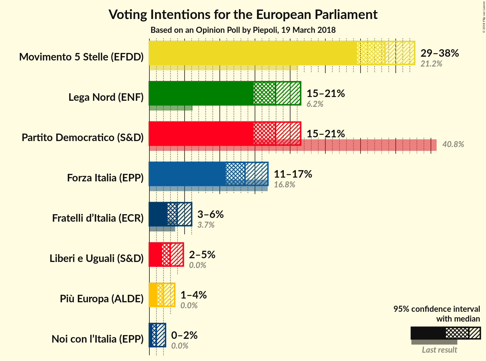
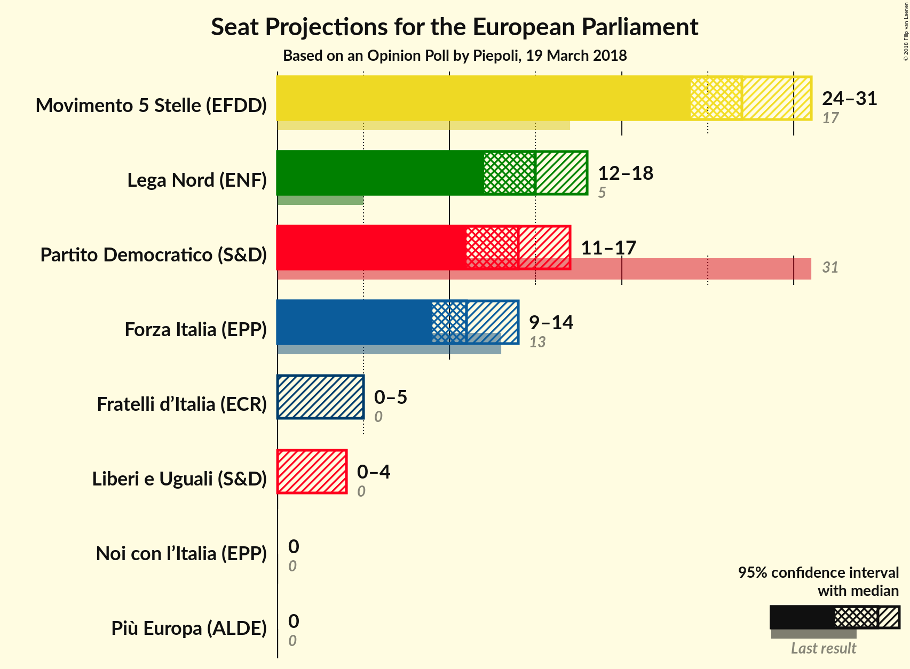
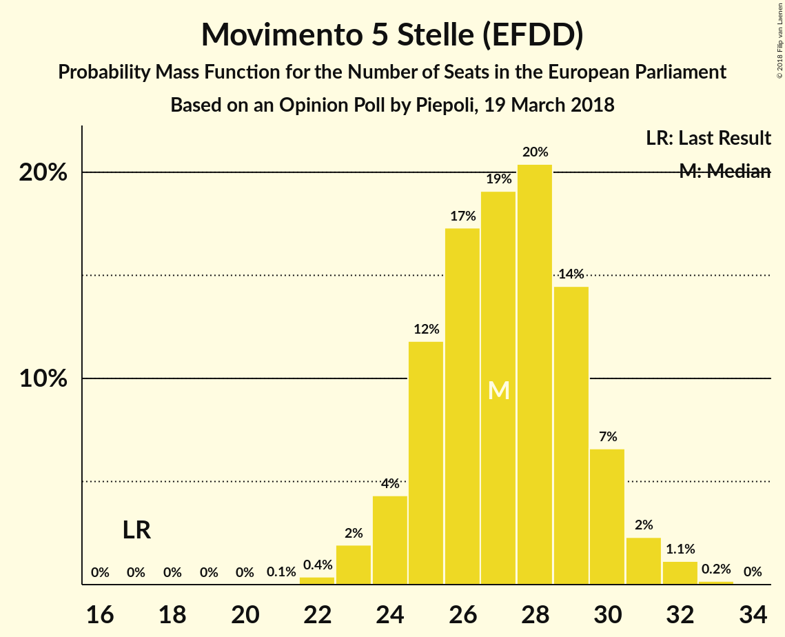
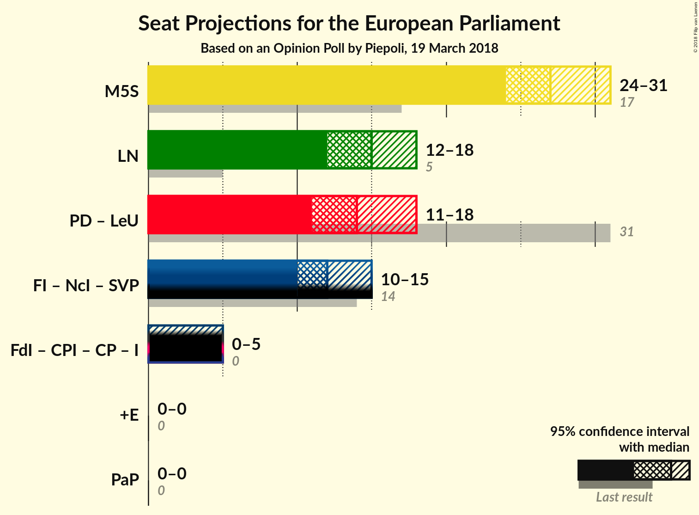

# Opinion Poll by Piepoli, 19 March 2018

<a href="#voting-intentions">Voting Intentions</a> | <a href="#seats">Seats</a> | <a href="#coalitions">Coalitions</a> | <a href="#technical-information">Technical Information</a>

## Voting Intentions

### Confidence Intervals

| Party | Last Result | Poll Result | 80% Confidence Interval | 90% Confidence Interval | 95% Confidence Interval | 99% Confidence Interval |
|:-----:|:-----------:|:-----------:|:-----------------------:|:-----------------------:|:-----------------------:|:-----------------------:|
| Movimento 5 Stelle (EFDD) | 21.1% | 33.5% | 30.9–36.2% |30.1–37.0% |29.5–37.7% |28.3–39.0% |
| Partito Democratico (S&D) | 40.8% | 17.9% | 15.9–20.3% |15.3–20.9% |14.8–21.5% |13.9–22.6% |
| Lega Nord (ENF) | 6.2% | 17.9% | 15.9–20.3% |15.3–20.9% |14.8–21.5% |13.9–22.6% |
| Forza Italia (EPP) | 16.8% | 13.6% | 11.8–15.7% |11.3–16.3% |10.9–16.8% |10.1–17.9% |
| Fratelli d’Italia (*) | 3.7% | 3.9% | 3.0–5.3% |2.8–5.7% |2.6–6.0% |2.2–6.7% |
| Liberi e Uguali (S&D) | 0.0% | 3.0% | 2.2–4.2% |2.0–4.5% |1.8–4.8% |1.5–5.5% |
| Più Europa (ALDE) | 0.0% | 2.0% | 1.4–3.0% |1.2–3.3% |1.1–3.6% |0.9–4.2% |
| Noi con l’Italia (EPP) | 0.0% | 1.0% | 0.6–1.8% |0.5–2.1% |0.4–2.3% |0.3–2.8% |

*Note:* The poll result column reflects the actual value used in the calculations. Published results may vary slightly, and in addition be rounded to fewer digits.

## Seats

### Confidence Intervals

| Party | Last Result | Median | 80% Confidence Interval | 90% Confidence Interval | 95% Confidence Interval | 99% Confidence Interval |
|:-----:|:-----------:|:------:|:-----------------------:|:-----------------------:|:-----------------------:|:-----------------------:|
| <a href="#movimento-5-stelle-(efdd)">Movimento 5 Stelle (EFDD)</a> | 17 | 27 | 25–30 |24–30 |24–31 |23–32 |
| <a href="#partito-democratico-(s&d)">Partito Democratico (S&D)</a> | 31 | 14 | 12–16 |11–16 |11–17 |10–18 |
| <a href="#lega-nord-(enf)">Lega Nord (ENF)</a> | 5 | 15 | 13–17 |12–17 |12–18 |11–18 |
| <a href="#forza-italia-(epp)">Forza Italia (EPP)</a> | 13 | 11 | 10–13 |9–13 |9–14 |8–15 |
| <a href="#fratelli-d’italia-(*)">Fratelli d’Italia (*)</a> | 0 | 0 | 0–4 |0–5 |0–5 |0–5 |
| <a href="#liberi-e-uguali-(s&d)">Liberi e Uguali (S&D)</a> | 0 | 0 | 0–3 |0–4 |0–4 |0–4 |
| <a href="#più-europa-(alde)">Più Europa (ALDE)</a> | 0 | 0 | 0 |0 |0 |0–3 |
| <a href="#noi-con-l’italia-(epp)">Noi con l’Italia (EPP)</a> | 0 | 0 | 0 |0 |0 |0 |

### Movimento 5 Stelle (EFDD)

*For a full overview of the results for this party, see the [Movimento 5 Stelle (EFDD)](party-movimento5stelleefdd.html) page.*

| Number of Seats | Probability | Accumulated | Special Marks |
|:---------------:|:-----------:|:-----------:|:-------------:|
| 17 | 0% | 100% | Last Result |
| 18 | 0% | 100% |  |
| 19 | 0% | 100% |  |
| 20 | 0% | 100% |  |
| 21 | 0.1% | 100% |  |
| 22 | 0.4% | 99.9% |  |
| 23 | 2% | 99.6% |  |
| 24 | 4% | 98% |  |
| 25 | 12% | 93% |  |
| 26 | 17% | 82% |  |
| 27 | 19% | 64% | Median |
| 28 | 20% | 45% |  |
| 29 | 14% | 25% |  |
| 30 | 7% | 10% |  |
| 31 | 2% | 4% |  |
| 32 | 1.1% | 1.3% |  |
| 33 | 0.2% | 0.2% |  |
| 34 | 0% | 0% |  |

### Partito Democratico (S&D)

*For a full overview of the results for this party, see the [Partito Democratico (S&D)](party-partitodemocraticosd.html) page.*

| Number of Seats | Probability | Accumulated | Special Marks |
|:---------------:|:-----------:|:-----------:|:-------------:|
| 9 | 0.1% | 100% |  |
| 10 | 0.9% | 99.9% |  |
| 11 | 5% | 99.0% |  |
| 12 | 14% | 94% |  |
| 13 | 29% | 80% |  |
| 14 | 23% | 50% | Median |
| 15 | 17% | 27% |  |
| 16 | 8% | 10% |  |
| 17 | 2% | 3% |  |
| 18 | 0.6% | 0.7% |  |
| 19 | 0.1% | 0.1% |  |
| 20 | 0% | 0% |  |
| 21 | 0% | 0% |  |
| 22 | 0% | 0% |  |
| 23 | 0% | 0% |  |
| 24 | 0% | 0% |  |
| 25 | 0% | 0% |  |
| 26 | 0% | 0% |  |
| 27 | 0% | 0% |  |
| 28 | 0% | 0% |  |
| 29 | 0% | 0% |  |
| 30 | 0% | 0% |  |
| 31 | 0% | 0% | Last Result |

### Lega Nord (ENF)

*For a full overview of the results for this party, see the [Lega Nord (ENF)](party-leganordenf.html) page.*

| Number of Seats | Probability | Accumulated | Special Marks |
|:---------------:|:-----------:|:-----------:|:-------------:|
| 5 | 0% | 100% | Last Result |
| 6 | 0% | 100% |  |
| 7 | 0% | 100% |  |
| 8 | 0% | 100% |  |
| 9 | 0% | 100% |  |
| 10 | 0.1% | 100% |  |
| 11 | 1.0% | 99.9% |  |
| 12 | 6% | 98.9% |  |
| 13 | 14% | 93% |  |
| 14 | 26% | 79% |  |
| 15 | 24% | 54% | Median |
| 16 | 19% | 30% |  |
| 17 | 8% | 11% |  |
| 18 | 2% | 3% |  |
| 19 | 0.4% | 0.5% |  |
| 20 | 0.1% | 0.1% |  |
| 21 | 0% | 0% |  |

### Forza Italia (EPP)

*For a full overview of the results for this party, see the [Forza Italia (EPP)](party-forzaitaliaepp.html) page.*

| Number of Seats | Probability | Accumulated | Special Marks |
|:---------------:|:-----------:|:-----------:|:-------------:|
| 7 | 0.1% | 100% |  |
| 8 | 1.4% | 99.9% |  |
| 9 | 8% | 98.5% |  |
| 10 | 22% | 90% |  |
| 11 | 34% | 68% | Median |
| 12 | 20% | 34% |  |
| 13 | 10% | 14% | Last Result |
| 14 | 3% | 4% |  |
| 15 | 0.7% | 0.7% |  |
| 16 | 0.1% | 0.1% |  |
| 17 | 0% | 0% |  |

### Fratelli d’Italia (*)

*For a full overview of the results for this party, see the [Fratelli d’Italia (*)](party-fratellid’italia.html) page.*

| Number of Seats | Probability | Accumulated | Special Marks |
|:---------------:|:-----------:|:-----------:|:-------------:|
| 0 | 50% | 100% | Last Result, Median |
| 1 | 0% | 50% |  |
| 2 | 0% | 50% |  |
| 3 | 15% | 50% |  |
| 4 | 29% | 35% |  |
| 5 | 5% | 5% |  |
| 6 | 0.3% | 0.4% |  |
| 7 | 0% | 0% |  |

### Liberi e Uguali (S&D)

*For a full overview of the results for this party, see the [Liberi e Uguali (S&D)](party-liberieugualisd.html) page.*

| Number of Seats | Probability | Accumulated | Special Marks |
|:---------------:|:-----------:|:-----------:|:-------------:|
| 0 | 88% | 100% | Last Result, Median |
| 1 | 0% | 12% |  |
| 2 | 0% | 12% |  |
| 3 | 6% | 12% |  |
| 4 | 6% | 6% |  |
| 5 | 0.3% | 0.3% |  |
| 6 | 0% | 0% |  |

### Più Europa (ALDE)

*For a full overview of the results for this party, see the [Più Europa (ALDE)](party-piùeuropaalde.html) page.*

| Number of Seats | Probability | Accumulated | Special Marks |
|:---------------:|:-----------:|:-----------:|:-------------:|
| 0 | 99.3% | 100% | Last Result, Median |
| 1 | 0% | 0.7% |  |
| 2 | 0% | 0.7% |  |
| 3 | 0.3% | 0.7% |  |
| 4 | 0.3% | 0.3% |  |
| 5 | 0% | 0% |  |

### Noi con l’Italia (EPP)

*For a full overview of the results for this party, see the [Noi con l’Italia (EPP)](party-noiconl’italiaepp.html) page.*

| Number of Seats | Probability | Accumulated | Special Marks |
|:---------------:|:-----------:|:-----------:|:-------------:|
| 0 | 100% | 100% | Last Result, Median |

## Coalitions

### Confidence Intervals

| Coalition | Last Result | Median | Majority? | 80% Confidence Interval | 90% Confidence Interval | 95% Confidence Interval | 99% Confidence Interval |
|:---------:|:-----------:|:------:|:---------:|:-----------------------:|:-----------------------:|:-----------------------:|:-----------------------:|
| Movimento 5 Stelle (EFDD) | 17 | 27 | 0% | 25–30 | 24–30 | 24–31 | 23–32 |
| Lega Nord (ENF) | 5 | 15 | 0% | 13–17 | 12–17 | 12–18 | 11–18 |
| Partito Democratico (S&D) – Liberi e Uguali (S&D) | 31 | 14 | 0% | 12–16 | 12–17 | 11–18 | 10–19 |
| Più Europa (ALDE) | 0 | 0 | 0% | 0 | 0 | 0 | 0–3 |

### Movimento 5 Stelle (EFDD)

| Number of Seats | Probability | Accumulated | Special Marks |
|:---------------:|:-----------:|:-----------:|:-------------:|
| 17 | 0% | 100% | Last Result |
| 18 | 0% | 100% |  |
| 19 | 0% | 100% |  |
| 20 | 0% | 100% |  |
| 21 | 0.1% | 100% |  |
| 22 | 0.4% | 99.9% |  |
| 23 | 2% | 99.6% |  |
| 24 | 4% | 98% |  |
| 25 | 12% | 93% |  |
| 26 | 17% | 82% |  |
| 27 | 19% | 64% | Median |
| 28 | 20% | 45% |  |
| 29 | 14% | 25% |  |
| 30 | 7% | 10% |  |
| 31 | 2% | 4% |  |
| 32 | 1.1% | 1.3% |  |
| 33 | 0.2% | 0.2% |  |
| 34 | 0% | 0% |  |

### Lega Nord (ENF)

| Number of Seats | Probability | Accumulated | Special Marks |
|:---------------:|:-----------:|:-----------:|:-------------:|
| 5 | 0% | 100% | Last Result |
| 6 | 0% | 100% |  |
| 7 | 0% | 100% |  |
| 8 | 0% | 100% |  |
| 9 | 0% | 100% |  |
| 10 | 0.1% | 100% |  |
| 11 | 1.0% | 99.9% |  |
| 12 | 6% | 98.9% |  |
| 13 | 14% | 93% |  |
| 14 | 26% | 79% |  |
| 15 | 24% | 54% | Median |
| 16 | 19% | 30% |  |
| 17 | 8% | 11% |  |
| 18 | 2% | 3% |  |
| 19 | 0.4% | 0.5% |  |
| 20 | 0.1% | 0.1% |  |
| 21 | 0% | 0% |  |

### Partito Democratico (S&D) – Liberi e Uguali (S&D)

| Number of Seats | Probability | Accumulated | Special Marks |
|:---------------:|:-----------:|:-----------:|:-------------:|
| 9 | 0.1% | 100% |  |
| 10 | 0.6% | 99.9% |  |
| 11 | 3% | 99.3% |  |
| 12 | 12% | 96% |  |
| 13 | 27% | 84% |  |
| 14 | 20% | 58% | Median |
| 15 | 19% | 37% |  |
| 16 | 10% | 18% |  |
| 17 | 5% | 9% |  |
| 18 | 3% | 4% |  |
| 19 | 0.6% | 1.0% |  |
| 20 | 0.3% | 0.4% |  |
| 21 | 0% | 0.1% |  |
| 22 | 0% | 0% |  |
| 23 | 0% | 0% |  |
| 24 | 0% | 0% |  |
| 25 | 0% | 0% |  |
| 26 | 0% | 0% |  |
| 27 | 0% | 0% |  |
| 28 | 0% | 0% |  |
| 29 | 0% | 0% |  |
| 30 | 0% | 0% |  |
| 31 | 0% | 0% | Last Result |

### Più Europa (ALDE)

| Number of Seats | Probability | Accumulated | Special Marks |
|:---------------:|:-----------:|:-----------:|:-------------:|
| 0 | 99.3% | 100% | Last Result, Median |
| 1 | 0% | 0.7% |  |
| 2 | 0% | 0.7% |  |
| 3 | 0.3% | 0.7% |  |
| 4 | 0.3% | 0.3% |  |
| 5 | 0% | 0% |  |

## Technical Information

### Opinion Poll

+ **Polling firm:** Piepoli
+ **Commissioner(s):** —
+ **Fieldwork period:** 19 March 2018

### Calculations

+ **Sample size:** 508
+ **Simulations done:** 1,048,576
+ **Error estimate:** 1.49%

