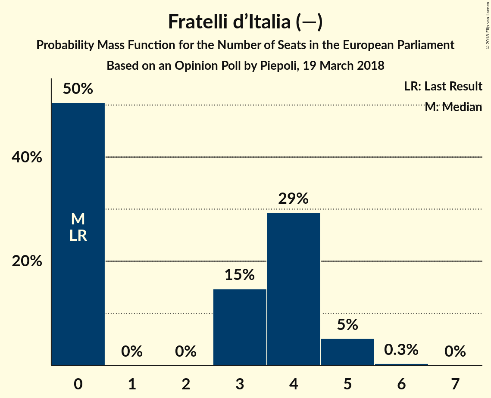
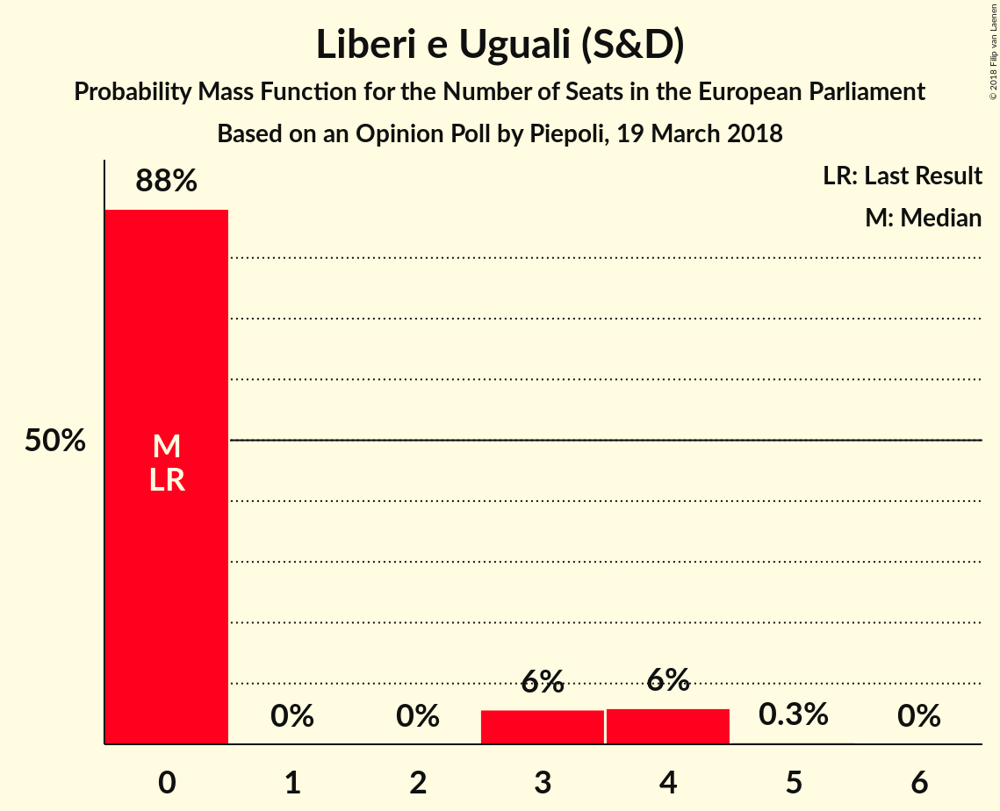

# Opinion Poll by Piepoli, 19 March 2018

<a href="#voting-intentions">Voting Intentions</a> | <a href="#seats">Seats</a> | <a href="#coalitions">Coalitions</a> | <a href="#technical-information">Technical Information</a>

## Voting Intentions

### Confidence Intervals

| Party | Last Result | Poll Result | 80% Confidence Interval | 90% Confidence Interval | 95% Confidence Interval | 99% Confidence Interval |
|:-----:|:-----------:|:-----------:|:-----------------------:|:-----------------------:|:-----------------------:|:-----------------------:|
| Movimento 5 Stelle (EFDD) | 21.1% | 33.5% | 30.9–36.2% |30.1–37.0% |29.5–37.7% |28.3–39.0% |
| Partito Democratico (S&D) | 40.8% | 17.9% | 15.9–20.3% |15.3–20.9% |14.8–21.5% |13.9–22.6% |
| Lega Nord (ENF) | 6.2% | 17.9% | 15.9–20.3% |15.3–20.9% |14.8–21.5% |13.9–22.6% |
| Forza Italia (EPP) | 16.8% | 13.6% | 11.8–15.7% |11.3–16.3% |10.9–16.8% |10.1–17.9% |
| Fratelli d’Italia (—) | 3.7% | 3.9% | 3.0–5.3% |2.8–5.7% |2.6–6.0% |2.2–6.7% |
| Liberi e Uguali (S&D) | 0.0% | 3.0% | 2.2–4.2% |2.0–4.5% |1.8–4.8% |1.5–5.5% |
| Più Europa (—) | 0.0% | 2.0% | 1.4–3.0% |1.2–3.3% |1.1–3.6% |0.9–4.2% |
| Noi con l’Italia (—) | 0.0% | 1.0% | 0.6–1.8% |0.5–2.1% |0.4–2.3% |0.3–2.8% |

*Note:* The poll result column reflects the actual value used in the calculations. Published results may vary slightly, and in addition be rounded to fewer digits.

## Seats

### Confidence Intervals

| Party | Last Result | Median | 80% Confidence Interval | 90% Confidence Interval | 95% Confidence Interval | 99% Confidence Interval |
|:-----:|:-----------:|:------:|:-----------------------:|:-----------------------:|:-----------------------:|:-----------------------:|
| <a href="#movimento-5-stelle-(efdd)">Movimento 5 Stelle (EFDD)</a> | 17 | 27 | 26–27 |26–28 |26–29 |23–29 |
| <a href="#partito-democratico-(s&d)">Partito Democratico (S&D)</a> | 31 | 13 | 12–13 |11–13 |11–13 |11–16 |
| <a href="#lega-nord-(enf)">Lega Nord (ENF)</a> | 5 | 12 | 12–15 |12–15 |12–15 |11–15 |
| <a href="#forza-italia-(epp)">Forza Italia (EPP)</a> | 13 | 13 | 10–14 |10–14 |10–14 |10–14 |
| <a href="#fratelli-d’italia-(—)">Fratelli d’Italia (—)</a> | 0 | 4 | 4 |4–5 |4–6 |4–6 |
| <a href="#liberi-e-uguali-(s&d)">Liberi e Uguali (S&D)</a> | 0 | 0 | 0–3 |0–3 |0–3 |0–3 |
| <a href="#più-europa-(—)">Più Europa (—)</a> | 0 | 0 | 0 |0 |0 |0 |
| <a href="#noi-con-l’italia-(—)">Noi con l’Italia (—)</a> | 0 | 0 | 0 |0 |0 |0 |

### Movimento 5 Stelle (EFDD)

*For a full overview of the results for this party, see the [Movimento 5 Stelle (EFDD)](party-movimento5stelleefdd.html) page.*

| Number of Seats | Probability | Accumulated | Special Marks |
|:---------------:|:-----------:|:-----------:|:-------------:|
| 17 | 0% | 100% | Last Result |
| 18 | 0% | 100% |  |
| 19 | 0% | 100% |  |
| 20 | 0% | 100% |  |
| 21 | 0% | 100% |  |
| 22 | 0% | 99.9% |  |
| 23 | 0.5% | 99.9% |  |
| 24 | 0.1% | 99.4% |  |
| 25 | 0.1% | 99.4% |  |
| 26 | 19% | 99.3% |  |
| 27 | 73% | 80% | Median |
| 28 | 3% | 7% |  |
| 29 | 3% | 3% |  |
| 30 | 0% | 0% |  |

### Partito Democratico (S&D)

*For a full overview of the results for this party, see the [Partito Democratico (S&D)](party-partitodemocraticosd.html) page.*

| Number of Seats | Probability | Accumulated | Special Marks |
|:---------------:|:-----------:|:-----------:|:-------------:|
| 10 | 0.2% | 100% |  |
| 11 | 6% | 99.8% |  |
| 12 | 26% | 93% |  |
| 13 | 66% | 67% | Median |
| 14 | 0% | 1.4% |  |
| 15 | 0.6% | 1.4% |  |
| 16 | 0.4% | 0.8% |  |
| 17 | 0.1% | 0.4% |  |
| 18 | 0.3% | 0.3% |  |
| 19 | 0% | 0% |  |
| 20 | 0% | 0% |  |
| 21 | 0% | 0% |  |
| 22 | 0% | 0% |  |
| 23 | 0% | 0% |  |
| 24 | 0% | 0% |  |
| 25 | 0% | 0% |  |
| 26 | 0% | 0% |  |
| 27 | 0% | 0% |  |
| 28 | 0% | 0% |  |
| 29 | 0% | 0% |  |
| 30 | 0% | 0% |  |
| 31 | 0% | 0% | Last Result |

### Lega Nord (ENF)

*For a full overview of the results for this party, see the [Lega Nord (ENF)](party-leganordenf.html) page.*

| Number of Seats | Probability | Accumulated | Special Marks |
|:---------------:|:-----------:|:-----------:|:-------------:|
| 5 | 0% | 100% | Last Result |
| 6 | 0% | 100% |  |
| 7 | 0% | 100% |  |
| 8 | 0% | 100% |  |
| 9 | 0% | 100% |  |
| 10 | 0.1% | 100% |  |
| 11 | 0.7% | 99.9% |  |
| 12 | 66% | 99.2% | Median |
| 13 | 6% | 33% |  |
| 14 | 11% | 27% |  |
| 15 | 15% | 15% |  |
| 16 | 0.3% | 0.5% |  |
| 17 | 0% | 0.1% |  |
| 18 | 0% | 0.1% |  |
| 19 | 0.1% | 0.1% |  |
| 20 | 0% | 0.1% |  |
| 21 | 0.1% | 0.1% |  |
| 22 | 0% | 0% |  |

### Forza Italia (EPP)

*For a full overview of the results for this party, see the [Forza Italia (EPP)](party-forzaitaliaepp.html) page.*

| Number of Seats | Probability | Accumulated | Special Marks |
|:---------------:|:-----------:|:-----------:|:-------------:|
| 10 | 26% | 100% |  |
| 11 | 8% | 74% |  |
| 12 | 0.3% | 66% |  |
| 13 | 17% | 66% | Last Result, Median |
| 14 | 48% | 48% |  |
| 15 | 0% | 0% |  |

### Fratelli d’Italia (—)

*For a full overview of the results for this party, see the [Fratelli d’Italia (—)](party-fratellid’italia—.html) page.*

| Number of Seats | Probability | Accumulated | Special Marks |
|:---------------:|:-----------:|:-----------:|:-------------:|
| 0 | 0.2% | 100% | Last Result |
| 1 | 0% | 99.8% |  |
| 2 | 0% | 99.8% |  |
| 3 | 0% | 99.8% |  |
| 4 | 91% | 99.8% | Median |
| 5 | 5% | 9% |  |
| 6 | 4% | 4% |  |
| 7 | 0% | 0% |  |

### Liberi e Uguali (S&D)

*For a full overview of the results for this party, see the [Liberi e Uguali (S&D)](party-liberieugualisd.html) page.*

| Number of Seats | Probability | Accumulated | Special Marks |
|:---------------:|:-----------:|:-----------:|:-------------:|
| 0 | 90% | 100% | Last Result, Median |
| 1 | 0% | 10% |  |
| 2 | 0% | 10% |  |
| 3 | 10% | 10% |  |
| 4 | 0% | 0% |  |

### Più Europa (—)

*For a full overview of the results for this party, see the [Più Europa (—)](party-piùeuropa—.html) page.*

| Number of Seats | Probability | Accumulated | Special Marks |
|:---------------:|:-----------:|:-----------:|:-------------:|
| 0 | 100% | 100% | Last Result, Median |

### Noi con l’Italia (—)

*For a full overview of the results for this party, see the [Noi con l’Italia (—)](party-noiconl’italia—.html) page.*

| Number of Seats | Probability | Accumulated | Special Marks |
|:---------------:|:-----------:|:-----------:|:-------------:|
| 0 | 100% | 100% | Last Result, Median |

## Coalitions

### Confidence Intervals

| Coalition | Last Result | Median | Majority? | 80% Confidence Interval | 90% Confidence Interval | 95% Confidence Interval | 99% Confidence Interval |
|:---------:|:-----------:|:------:|:---------:|:-----------------------:|:-----------------------:|:-----------------------:|:-----------------------:|
| Movimento 5 Stelle (EFDD) | 17 | 27 | 0% | 26–27 | 26–28 | 26–29 | 23–29 |
| Lega Nord (ENF) | 5 | 12 | 0% | 12–15 | 12–15 | 12–15 | 11–15 |
| Partito Democratico (S&D) – Liberi e Uguali (S&D) | 31 | 13 | 0% | 12–15 | 11–15 | 11–15 | 11–16 |

### Movimento 5 Stelle (EFDD)

| Number of Seats | Probability | Accumulated | Special Marks |
|:---------------:|:-----------:|:-----------:|:-------------:|
| 17 | 0% | 100% | Last Result |
| 18 | 0% | 100% |  |
| 19 | 0% | 100% |  |
| 20 | 0% | 100% |  |
| 21 | 0% | 100% |  |
| 22 | 0% | 99.9% |  |
| 23 | 0.5% | 99.9% |  |
| 24 | 0.1% | 99.4% |  |
| 25 | 0.1% | 99.4% |  |
| 26 | 19% | 99.3% |  |
| 27 | 73% | 80% | Median |
| 28 | 3% | 7% |  |
| 29 | 3% | 3% |  |
| 30 | 0% | 0% |  |

### Lega Nord (ENF)

| Number of Seats | Probability | Accumulated | Special Marks |
|:---------------:|:-----------:|:-----------:|:-------------:|
| 5 | 0% | 100% | Last Result |
| 6 | 0% | 100% |  |
| 7 | 0% | 100% |  |
| 8 | 0% | 100% |  |
| 9 | 0% | 100% |  |
| 10 | 0.1% | 100% |  |
| 11 | 0.7% | 99.9% |  |
| 12 | 66% | 99.2% | Median |
| 13 | 6% | 33% |  |
| 14 | 11% | 27% |  |
| 15 | 15% | 15% |  |
| 16 | 0.3% | 0.5% |  |
| 17 | 0% | 0.1% |  |
| 18 | 0% | 0.1% |  |
| 19 | 0.1% | 0.1% |  |
| 20 | 0% | 0.1% |  |
| 21 | 0.1% | 0.1% |  |
| 22 | 0% | 0% |  |

### Partito Democratico (S&D) – Liberi e Uguali (S&D)

| Number of Seats | Probability | Accumulated | Special Marks |
|:---------------:|:-----------:|:-----------:|:-------------:|
| 10 | 0.2% | 100% |  |
| 11 | 6% | 99.8% |  |
| 12 | 16% | 93% |  |
| 13 | 66% | 78% | Median |
| 14 | 0% | 12% |  |
| 15 | 11% | 12% |  |
| 16 | 0.4% | 0.9% |  |
| 17 | 0.1% | 0.4% |  |
| 18 | 0.3% | 0.3% |  |
| 19 | 0% | 0% |  |
| 20 | 0% | 0% |  |
| 21 | 0% | 0% |  |
| 22 | 0% | 0% |  |
| 23 | 0% | 0% |  |
| 24 | 0% | 0% |  |
| 25 | 0% | 0% |  |
| 26 | 0% | 0% |  |
| 27 | 0% | 0% |  |
| 28 | 0% | 0% |  |
| 29 | 0% | 0% |  |
| 30 | 0% | 0% |  |
| 31 | 0% | 0% | Last Result |

## Technical Information

### Opinion Poll

+ **Polling firm:** Piepoli
+ **Commissioner(s):** —
+ **Fieldwork period:** 19 March 2018

### Calculations

+ **Sample size:** 508
+ **Simulations done:** 1,024
+ **Error estimate:** 4.65%

