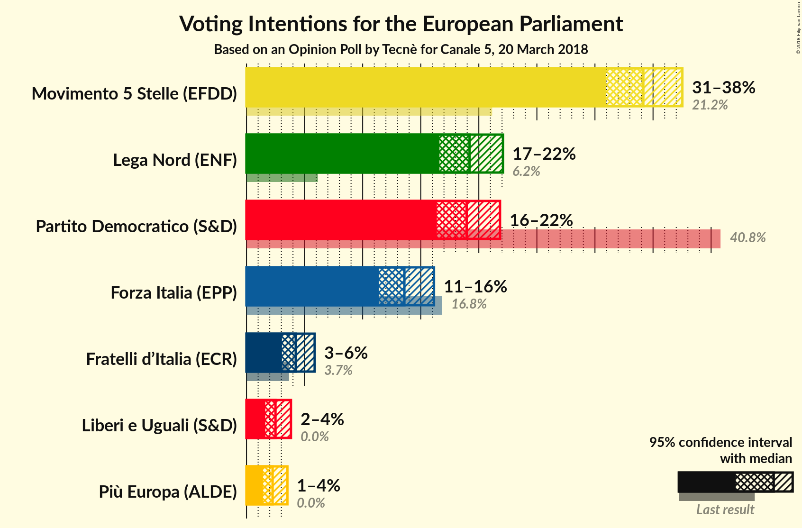
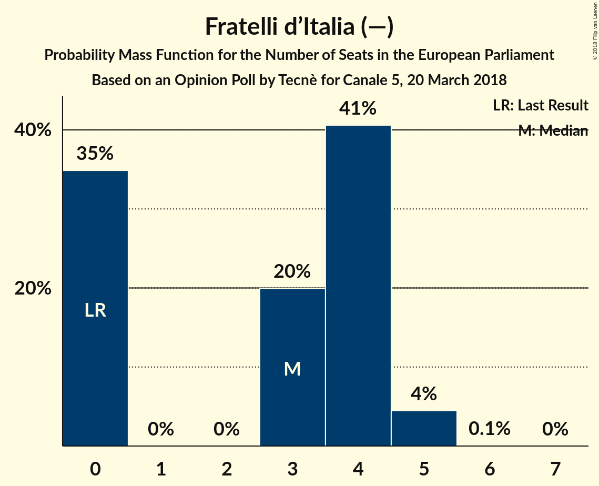
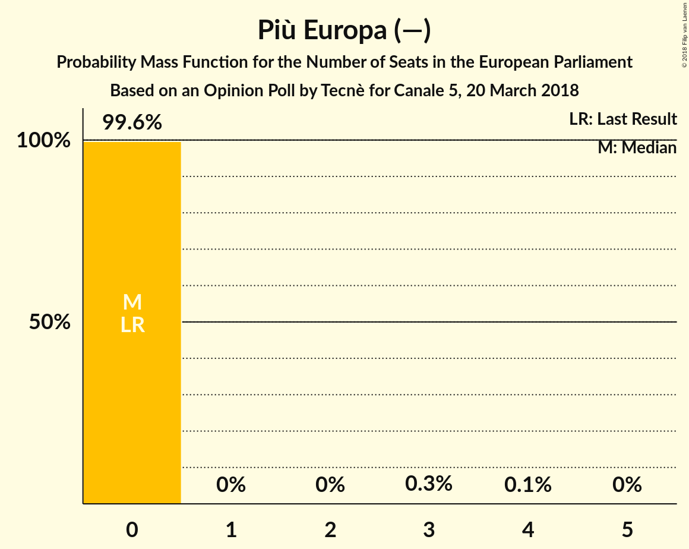

# Opinion Poll by Tecnè for Canale 5, 20 March 2018

<a href="#voting-intentions">Voting Intentions</a> | <a href="#seats">Seats</a> | <a href="#coalitions">Coalitions</a> | <a href="#technical-information">Technical Information</a>

## Voting Intentions

### Confidence Intervals

| Party | Last Result | Poll Result | 80% Confidence Interval | 90% Confidence Interval | 95% Confidence Interval | 99% Confidence Interval |
|:-----:|:-----------:|:-----------:|:-----------------------:|:-----------------------:|:-----------------------:|:-----------------------:|
| Movimento 5 Stelle (EFDD) | 21.1% | 34.2% | 32.1–36.4% |31.5–37.0% |31.0–37.5% |30.0–38.6% |
| Lega Nord (ENF) | 6.2% | 19.2% | 17.5–21.1% |17.0–21.6% |16.6–22.1% |15.8–23.0% |
| Partito Democratico (S&D) | 40.8% | 19.0% | 17.3–20.8% |16.8–21.4% |16.4–21.8% |15.6–22.7% |
| Forza Italia (EPP) | 16.8% | 13.6% | 12.1–15.3% |11.7–15.7% |11.4–16.1% |10.7–17.0% |
| Fratelli d’Italia (—) | 3.7% | 4.2% | 3.4–5.3% |3.2–5.6% |3.0–5.9% |2.7–6.4% |
| Liberi e Uguali (S&D) | 0.0% | 2.5% | 1.9–3.4% |1.8–3.6% |1.6–3.8% |1.4–4.3% |
| Più Europa (—) | 0.0% | 2.2% | 1.7–3.1% |1.6–3.3% |1.4–3.5% |1.2–4.0% |

*Note:* The poll result column reflects the actual value used in the calculations. Published results may vary slightly, and in addition be rounded to fewer digits.

## Seats

### Confidence Intervals

| Party | Last Result | Median | 80% Confidence Interval | 90% Confidence Interval | 95% Confidence Interval | 99% Confidence Interval |
|:-----:|:-----------:|:------:|:-----------------------:|:-----------------------:|:-----------------------:|:-----------------------:|
| <a href="#movimento-5-stelle-(efdd)">Movimento 5 Stelle (EFDD)</a> | 17 | 28 | 26–29 |25–30 |25–31 |24–32 |
| <a href="#lega-nord-(enf)">Lega Nord (ENF)</a> | 5 | 16 | 14–17 |14–18 |13–18 |13–19 |
| <a href="#partito-democratico-(s&d)">Partito Democratico (S&D)</a> | 31 | 14 | 13–16 |12–16 |12–17 |11–18 |
| <a href="#forza-italia-(epp)">Forza Italia (EPP)</a> | 13 | 11 | 10–12 |9–13 |9–13 |9–14 |
| <a href="#fratelli-d’italia-(—)">Fratelli d’Italia (—)</a> | 0 | 3 | 0–4 |0–4 |0–5 |0–5 |
| <a href="#liberi-e-uguali-(s&d)">Liberi e Uguali (S&D)</a> | 0 | 0 | 0 |0 |0 |0–3 |
| <a href="#più-europa-(—)">Più Europa (—)</a> | 0 | 0 | 0 |0 |0 |0 |

### Movimento 5 Stelle (EFDD)

*For a full overview of the results for this party, see the [Movimento 5 Stelle (EFDD)](party-movimento5stelleefdd.html) page.*

| Number of Seats | Probability | Accumulated | Special Marks |
|:---------------:|:-----------:|:-----------:|:-------------:|
| 17 | 0% | 100% | Last Result |
| 18 | 0% | 100% |  |
| 19 | 0% | 100% |  |
| 20 | 0% | 100% |  |
| 21 | 0% | 100% |  |
| 22 | 0% | 100% |  |
| 23 | 0.2% | 100% |  |
| 24 | 2% | 99.8% |  |
| 25 | 7% | 98% |  |
| 26 | 16% | 91% |  |
| 27 | 23% | 74% |  |
| 28 | 26% | 51% | Median |
| 29 | 16% | 26% |  |
| 30 | 6% | 10% |  |
| 31 | 3% | 4% |  |
| 32 | 0.8% | 1.0% |  |
| 33 | 0.2% | 0.2% |  |
| 34 | 0% | 0% |  |

### Lega Nord (ENF)

*For a full overview of the results for this party, see the [Lega Nord (ENF)](party-leganordenf.html) page.*

| Number of Seats | Probability | Accumulated | Special Marks |
|:---------------:|:-----------:|:-----------:|:-------------:|
| 5 | 0% | 100% | Last Result |
| 6 | 0% | 100% |  |
| 7 | 0% | 100% |  |
| 8 | 0% | 100% |  |
| 9 | 0% | 100% |  |
| 10 | 0% | 100% |  |
| 11 | 0% | 100% |  |
| 12 | 0.3% | 100% |  |
| 13 | 3% | 99.7% |  |
| 14 | 17% | 96% |  |
| 15 | 28% | 79% |  |
| 16 | 31% | 51% | Median |
| 17 | 15% | 21% |  |
| 18 | 5% | 5% |  |
| 19 | 0.9% | 1.0% |  |
| 20 | 0.1% | 0.1% |  |
| 21 | 0% | 0% |  |

### Partito Democratico (S&D)

*For a full overview of the results for this party, see the [Partito Democratico (S&D)](party-partitodemocraticosd.html) page.*

| Number of Seats | Probability | Accumulated | Special Marks |
|:---------------:|:-----------:|:-----------:|:-------------:|
| 11 | 0.6% | 100% |  |
| 12 | 5% | 99.4% |  |
| 13 | 18% | 94% |  |
| 14 | 31% | 76% | Median |
| 15 | 30% | 45% |  |
| 16 | 12% | 15% |  |
| 17 | 3% | 4% |  |
| 18 | 0.5% | 0.6% |  |
| 19 | 0.1% | 0.1% |  |
| 20 | 0% | 0% |  |
| 21 | 0% | 0% |  |
| 22 | 0% | 0% |  |
| 23 | 0% | 0% |  |
| 24 | 0% | 0% |  |
| 25 | 0% | 0% |  |
| 26 | 0% | 0% |  |
| 27 | 0% | 0% |  |
| 28 | 0% | 0% |  |
| 29 | 0% | 0% |  |
| 30 | 0% | 0% |  |
| 31 | 0% | 0% | Last Result |

### Forza Italia (EPP)

*For a full overview of the results for this party, see the [Forza Italia (EPP)](party-forzaitaliaepp.html) page.*

| Number of Seats | Probability | Accumulated | Special Marks |
|:---------------:|:-----------:|:-----------:|:-------------:|
| 8 | 0.5% | 100% |  |
| 9 | 5% | 99.5% |  |
| 10 | 30% | 95% |  |
| 11 | 31% | 65% | Median |
| 12 | 26% | 34% |  |
| 13 | 7% | 8% | Last Result |
| 14 | 1.0% | 1.1% |  |
| 15 | 0.1% | 0.1% |  |
| 16 | 0% | 0% |  |

### Fratelli d’Italia (—)

*For a full overview of the results for this party, see the [Fratelli d’Italia (—)](party-fratellid’italia—.html) page.*

| Number of Seats | Probability | Accumulated | Special Marks |
|:---------------:|:-----------:|:-----------:|:-------------:|
| 0 | 35% | 100% | Last Result |
| 1 | 0% | 65% |  |
| 2 | 0% | 65% |  |
| 3 | 20% | 65% | Median |
| 4 | 41% | 45% |  |
| 5 | 4% | 5% |  |
| 6 | 0.1% | 0.1% |  |
| 7 | 0% | 0% |  |

### Liberi e Uguali (S&D)

*For a full overview of the results for this party, see the [Liberi e Uguali (S&D)](party-liberieugualisd.html) page.*

| Number of Seats | Probability | Accumulated | Special Marks |
|:---------------:|:-----------:|:-----------:|:-------------:|
| 0 | 98.7% | 100% | Last Result, Median |
| 1 | 0% | 1.3% |  |
| 2 | 0% | 1.3% |  |
| 3 | 1.0% | 1.3% |  |
| 4 | 0.3% | 0.3% |  |
| 5 | 0% | 0% |  |

### Più Europa (—)

*For a full overview of the results for this party, see the [Più Europa (—)](party-piùeuropa—.html) page.*

| Number of Seats | Probability | Accumulated | Special Marks |
|:---------------:|:-----------:|:-----------:|:-------------:|
| 0 | 99.6% | 100% | Last Result, Median |
| 1 | 0% | 0.4% |  |
| 2 | 0% | 0.4% |  |
| 3 | 0.3% | 0.4% |  |
| 4 | 0.1% | 0.1% |  |
| 5 | 0% | 0% |  |

## Coalitions

### Confidence Intervals

| Coalition | Last Result | Median | Majority? | 80% Confidence Interval | 90% Confidence Interval | 95% Confidence Interval | 99% Confidence Interval |
|:---------:|:-----------:|:------:|:---------:|:-----------------------:|:-----------------------:|:-----------------------:|:-----------------------:|
| Movimento 5 Stelle (EFDD) | 17 | 28 | 0% | 26–29 | 25–30 | 25–31 | 24–32 |
| Lega Nord (ENF) | 5 | 16 | 0% | 14–17 | 14–18 | 13–18 | 13–19 |
| Partito Democratico (S&D) – Liberi e Uguali (S&D) | 31 | 14 | 0% | 13–16 | 12–16 | 12–17 | 11–18 |

### Movimento 5 Stelle (EFDD)

| Number of Seats | Probability | Accumulated | Special Marks |
|:---------------:|:-----------:|:-----------:|:-------------:|
| 17 | 0% | 100% | Last Result |
| 18 | 0% | 100% |  |
| 19 | 0% | 100% |  |
| 20 | 0% | 100% |  |
| 21 | 0% | 100% |  |
| 22 | 0% | 100% |  |
| 23 | 0.2% | 100% |  |
| 24 | 2% | 99.8% |  |
| 25 | 7% | 98% |  |
| 26 | 16% | 91% |  |
| 27 | 23% | 74% |  |
| 28 | 26% | 51% | Median |
| 29 | 16% | 26% |  |
| 30 | 6% | 10% |  |
| 31 | 3% | 4% |  |
| 32 | 0.8% | 1.0% |  |
| 33 | 0.2% | 0.2% |  |
| 34 | 0% | 0% |  |

### Lega Nord (ENF)

| Number of Seats | Probability | Accumulated | Special Marks |
|:---------------:|:-----------:|:-----------:|:-------------:|
| 5 | 0% | 100% | Last Result |
| 6 | 0% | 100% |  |
| 7 | 0% | 100% |  |
| 8 | 0% | 100% |  |
| 9 | 0% | 100% |  |
| 10 | 0% | 100% |  |
| 11 | 0% | 100% |  |
| 12 | 0.3% | 100% |  |
| 13 | 3% | 99.7% |  |
| 14 | 17% | 96% |  |
| 15 | 28% | 79% |  |
| 16 | 31% | 51% | Median |
| 17 | 15% | 21% |  |
| 18 | 5% | 5% |  |
| 19 | 0.9% | 1.0% |  |
| 20 | 0.1% | 0.1% |  |
| 21 | 0% | 0% |  |

### Partito Democratico (S&D) – Liberi e Uguali (S&D)

| Number of Seats | Probability | Accumulated | Special Marks |
|:---------------:|:-----------:|:-----------:|:-------------:|
| 11 | 0.5% | 100% |  |
| 12 | 5% | 99.4% |  |
| 13 | 17% | 94% |  |
| 14 | 31% | 77% | Median |
| 15 | 29% | 46% |  |
| 16 | 12% | 16% |  |
| 17 | 3% | 4% |  |
| 18 | 0.7% | 0.9% |  |
| 19 | 0.2% | 0.2% |  |
| 20 | 0% | 0% |  |
| 21 | 0% | 0% |  |
| 22 | 0% | 0% |  |
| 23 | 0% | 0% |  |
| 24 | 0% | 0% |  |
| 25 | 0% | 0% |  |
| 26 | 0% | 0% |  |
| 27 | 0% | 0% |  |
| 28 | 0% | 0% |  |
| 29 | 0% | 0% |  |
| 30 | 0% | 0% |  |
| 31 | 0% | 0% | Last Result |

## Technical Information

### Opinion Poll

+ **Polling firm:** Tecnè
+ **Commissioner(s):** Canale 5
+ **Fieldwork period:** 20 March 2018

### Calculations

+ **Sample size:** 802
+ **Simulations done:** 1,048,576
+ **Error estimate:** 1.45%

