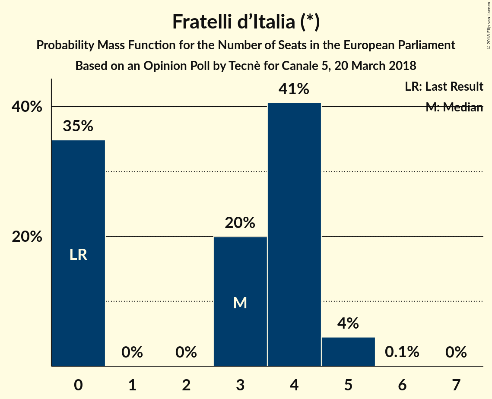
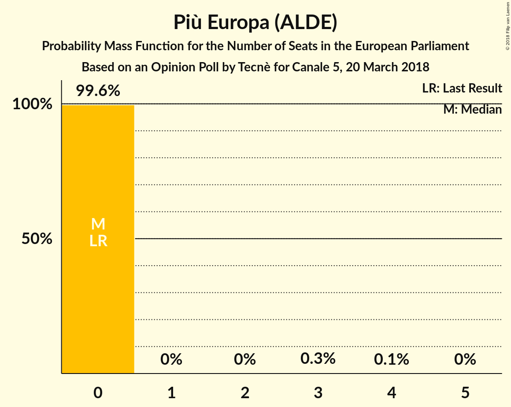

# Opinion Poll by Tecnè for Canale 5, 20 March 2018

<a href="#voting-intentions">Voting Intentions</a> | <a href="#seats">Seats</a> | <a href="#coalitions">Coalitions</a> | <a href="#technical-information">Technical Information</a>

## Voting Intentions

### Confidence Intervals

| Party | Last Result | Poll Result | 80% Confidence Interval | 90% Confidence Interval | 95% Confidence Interval | 99% Confidence Interval |
|:-----:|:-----------:|:-----------:|:-----------------------:|:-----------------------:|:-----------------------:|:-----------------------:|
| Movimento 5 Stelle (EFDD) | 21.1% | 34.2% | 32.1–36.4% |31.5–37.0% |31.0–37.5% |30.0–38.6% |
| Lega Nord (ENF) | 6.2% | 19.2% | 17.5–21.1% |17.0–21.6% |16.6–22.1% |15.8–23.0% |
| Partito Democratico (S&D) | 40.8% | 19.0% | 17.3–20.8% |16.8–21.4% |16.4–21.8% |15.6–22.7% |
| Forza Italia (EPP) | 16.8% | 13.6% | 12.1–15.3% |11.7–15.7% |11.4–16.1% |10.7–17.0% |
| Fratelli d’Italia (*) | 3.7% | 4.2% | 3.4–5.3% |3.2–5.6% |3.0–5.9% |2.7–6.4% |
| Liberi e Uguali (S&D) | 0.0% | 2.5% | 1.9–3.4% |1.8–3.6% |1.6–3.8% |1.4–4.3% |
| Più Europa (ALDE) | 0.0% | 2.2% | 1.7–3.1% |1.6–3.3% |1.4–3.5% |1.2–4.0% |

*Note:* The poll result column reflects the actual value used in the calculations. Published results may vary slightly, and in addition be rounded to fewer digits.

## Seats

### Confidence Intervals

| Party | Last Result | Median | 80% Confidence Interval | 90% Confidence Interval | 95% Confidence Interval | 99% Confidence Interval |
|:-----:|:-----------:|:------:|:-----------------------:|:-----------------------:|:-----------------------:|:-----------------------:|
| <a href="#movimento-5-stelle-(efdd)">Movimento 5 Stelle (EFDD)</a> | 17 | 30 | 29–31 |29–31 |27–31 |23–31 |
| <a href="#lega-nord-(enf)">Lega Nord (ENF)</a> | 5 | 13 | 13–17 |13–17 |13–18 |13–18 |
| <a href="#partito-democratico-(s&d)">Partito Democratico (S&D)</a> | 31 | 15 | 14–15 |14–15 |14–15 |13–17 |
| <a href="#forza-italia-(epp)">Forza Italia (EPP)</a> | 13 | 10 | 8–10 |8–12 |8–12 |8–15 |
| <a href="#fratelli-d’italia-(*)">Fratelli d’Italia (*)</a> | 0 | 3 | 0–4 |0–4 |0–4 |0–5 |
| <a href="#liberi-e-uguali-(s&d)">Liberi e Uguali (S&D)</a> | 0 | 0 | 0 |0 |0 |0–3 |
| <a href="#più-europa-(alde)">Più Europa (ALDE)</a> | 0 | 0 | 0 |0 |0 |0 |

### Movimento 5 Stelle (EFDD)

*For a full overview of the results for this party, see the [Movimento 5 Stelle (EFDD)](party-movimento5stelleefdd.html) page.*

| Number of Seats | Probability | Accumulated | Special Marks |
|:---------------:|:-----------:|:-----------:|:-------------:|
| 17 | 0% | 100% | Last Result |
| 18 | 0% | 100% |  |
| 19 | 0% | 100% |  |
| 20 | 0% | 100% |  |
| 21 | 0% | 100% |  |
| 22 | 0% | 100% |  |
| 23 | 0.8% | 100% |  |
| 24 | 0.3% | 99.2% |  |
| 25 | 1.0% | 98.9% |  |
| 26 | 0.1% | 98% |  |
| 27 | 1.0% | 98% |  |
| 28 | 0.2% | 97% |  |
| 29 | 12% | 97% |  |
| 30 | 57% | 85% | Median |
| 31 | 28% | 28% |  |
| 32 | 0.2% | 0.2% |  |
| 33 | 0% | 0% |  |

### Lega Nord (ENF)

*For a full overview of the results for this party, see the [Lega Nord (ENF)](party-leganordenf.html) page.*

| Number of Seats | Probability | Accumulated | Special Marks |
|:---------------:|:-----------:|:-----------:|:-------------:|
| 5 | 0% | 100% | Last Result |
| 6 | 0% | 100% |  |
| 7 | 0% | 100% |  |
| 8 | 0% | 100% |  |
| 9 | 0% | 100% |  |
| 10 | 0% | 100% |  |
| 11 | 0% | 100% |  |
| 12 | 0.3% | 100% |  |
| 13 | 50% | 99.7% | Median |
| 14 | 1.0% | 50% |  |
| 15 | 13% | 49% |  |
| 16 | 23% | 36% |  |
| 17 | 9% | 13% |  |
| 18 | 4% | 4% |  |
| 19 | 0% | 0.1% |  |
| 20 | 0% | 0% |  |

### Partito Democratico (S&D)

*For a full overview of the results for this party, see the [Partito Democratico (S&D)](party-partitodemocraticosd.html) page.*

| Number of Seats | Probability | Accumulated | Special Marks |
|:---------------:|:-----------:|:-----------:|:-------------:|
| 10 | 0.1% | 100% |  |
| 11 | 0% | 99.9% |  |
| 12 | 0.3% | 99.9% |  |
| 13 | 0.5% | 99.6% |  |
| 14 | 37% | 99.1% |  |
| 15 | 60% | 62% | Median |
| 16 | 0.7% | 2% |  |
| 17 | 1.0% | 1.0% |  |
| 18 | 0% | 0% |  |
| 19 | 0% | 0% |  |
| 20 | 0% | 0% |  |
| 21 | 0% | 0% |  |
| 22 | 0% | 0% |  |
| 23 | 0% | 0% |  |
| 24 | 0% | 0% |  |
| 25 | 0% | 0% |  |
| 26 | 0% | 0% |  |
| 27 | 0% | 0% |  |
| 28 | 0% | 0% |  |
| 29 | 0% | 0% |  |
| 30 | 0% | 0% |  |
| 31 | 0% | 0% | Last Result |

### Forza Italia (EPP)

*For a full overview of the results for this party, see the [Forza Italia (EPP)](party-forzaitaliaepp.html) page.*

| Number of Seats | Probability | Accumulated | Special Marks |
|:---------------:|:-----------:|:-----------:|:-------------:|
| 7 | 0.1% | 100% |  |
| 8 | 16% | 99.9% |  |
| 9 | 10% | 84% |  |
| 10 | 66% | 75% | Median |
| 11 | 0.1% | 9% |  |
| 12 | 7% | 9% |  |
| 13 | 0.8% | 2% | Last Result |
| 14 | 0.5% | 1.0% |  |
| 15 | 0.6% | 0.6% |  |
| 16 | 0% | 0% |  |

### Fratelli d’Italia (*)

*For a full overview of the results for this party, see the [Fratelli d’Italia (*)](party-fratellid’italia.html) page.*

| Number of Seats | Probability | Accumulated | Special Marks |
|:---------------:|:-----------:|:-----------:|:-------------:|
| 0 | 33% | 100% | Last Result |
| 1 | 0% | 67% |  |
| 2 | 0% | 67% |  |
| 3 | 43% | 67% | Median |
| 4 | 23% | 24% |  |
| 5 | 0.5% | 0.5% |  |
| 6 | 0% | 0% |  |

### Liberi e Uguali (S&D)

*For a full overview of the results for this party, see the [Liberi e Uguali (S&D)](party-liberieugualisd.html) page.*

| Number of Seats | Probability | Accumulated | Special Marks |
|:---------------:|:-----------:|:-----------:|:-------------:|
| 0 | 99.5% | 100% | Last Result, Median |
| 1 | 0% | 0.5% |  |
| 2 | 0% | 0.5% |  |
| 3 | 0.1% | 0.5% |  |
| 4 | 0.5% | 0.5% |  |
| 5 | 0% | 0% |  |

### Più Europa (ALDE)

*For a full overview of the results for this party, see the [Più Europa (ALDE)](party-piùeuropaalde.html) page.*

| Number of Seats | Probability | Accumulated | Special Marks |
|:---------------:|:-----------:|:-----------:|:-------------:|
| 0 | 100% | 100% | Last Result, Median |

## Coalitions

### Confidence Intervals

| Coalition | Last Result | Median | Majority? | 80% Confidence Interval | 90% Confidence Interval | 95% Confidence Interval | 99% Confidence Interval |
|:---------:|:-----------:|:------:|:---------:|:-----------------------:|:-----------------------:|:-----------------------:|:-----------------------:|
| Movimento 5 Stelle (EFDD) | 17 | 30 | 0% | 29–31 | 29–31 | 27–31 | 23–31 |
| Lega Nord (ENF) | 5 | 13 | 0% | 13–17 | 13–17 | 13–18 | 13–18 |
| Partito Democratico (S&D) – Liberi e Uguali (S&D) | 31 | 15 | 0% | 14–15 | 14–15 | 14–15 | 14–17 |
| Più Europa (ALDE) | 0 | 0 | 0% | 0 | 0 | 0 | 0 |

### Movimento 5 Stelle (EFDD)

| Number of Seats | Probability | Accumulated | Special Marks |
|:---------------:|:-----------:|:-----------:|:-------------:|
| 17 | 0% | 100% | Last Result |
| 18 | 0% | 100% |  |
| 19 | 0% | 100% |  |
| 20 | 0% | 100% |  |
| 21 | 0% | 100% |  |
| 22 | 0% | 100% |  |
| 23 | 0.8% | 100% |  |
| 24 | 0.3% | 99.2% |  |
| 25 | 1.0% | 98.9% |  |
| 26 | 0.1% | 98% |  |
| 27 | 1.0% | 98% |  |
| 28 | 0.2% | 97% |  |
| 29 | 12% | 97% |  |
| 30 | 57% | 85% | Median |
| 31 | 28% | 28% |  |
| 32 | 0.2% | 0.2% |  |
| 33 | 0% | 0% |  |

### Lega Nord (ENF)

| Number of Seats | Probability | Accumulated | Special Marks |
|:---------------:|:-----------:|:-----------:|:-------------:|
| 5 | 0% | 100% | Last Result |
| 6 | 0% | 100% |  |
| 7 | 0% | 100% |  |
| 8 | 0% | 100% |  |
| 9 | 0% | 100% |  |
| 10 | 0% | 100% |  |
| 11 | 0% | 100% |  |
| 12 | 0.3% | 100% |  |
| 13 | 50% | 99.7% | Median |
| 14 | 1.0% | 50% |  |
| 15 | 13% | 49% |  |
| 16 | 23% | 36% |  |
| 17 | 9% | 13% |  |
| 18 | 4% | 4% |  |
| 19 | 0% | 0.1% |  |
| 20 | 0% | 0% |  |

### Partito Democratico (S&D) – Liberi e Uguali (S&D)

| Number of Seats | Probability | Accumulated | Special Marks |
|:---------------:|:-----------:|:-----------:|:-------------:|
| 10 | 0.1% | 100% |  |
| 11 | 0% | 99.9% |  |
| 12 | 0.2% | 99.9% |  |
| 13 | 0.1% | 99.6% |  |
| 14 | 37% | 99.5% |  |
| 15 | 60% | 62% | Median |
| 16 | 0.7% | 2% |  |
| 17 | 1.4% | 1.5% |  |
| 18 | 0% | 0.1% |  |
| 19 | 0% | 0% |  |
| 20 | 0% | 0% |  |
| 21 | 0% | 0% |  |
| 22 | 0% | 0% |  |
| 23 | 0% | 0% |  |
| 24 | 0% | 0% |  |
| 25 | 0% | 0% |  |
| 26 | 0% | 0% |  |
| 27 | 0% | 0% |  |
| 28 | 0% | 0% |  |
| 29 | 0% | 0% |  |
| 30 | 0% | 0% |  |
| 31 | 0% | 0% | Last Result |

### Più Europa (ALDE)

| Number of Seats | Probability | Accumulated | Special Marks |
|:---------------:|:-----------:|:-----------:|:-------------:|
| 0 | 100% | 100% | Last Result, Median |

## Technical Information

### Opinion Poll

+ **Polling firm:** Tecnè
+ **Commissioner(s):** Canale 5
+ **Fieldwork period:** 20 March 2018

### Calculations

+ **Sample size:** 802
+ **Simulations done:** 1,024
+ **Error estimate:** 3.34%

