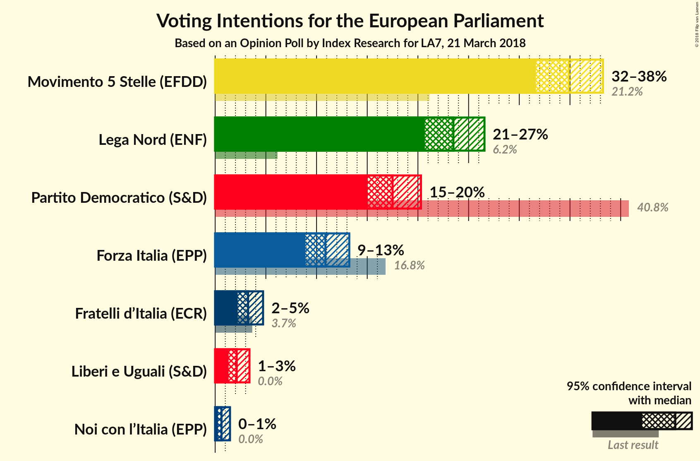
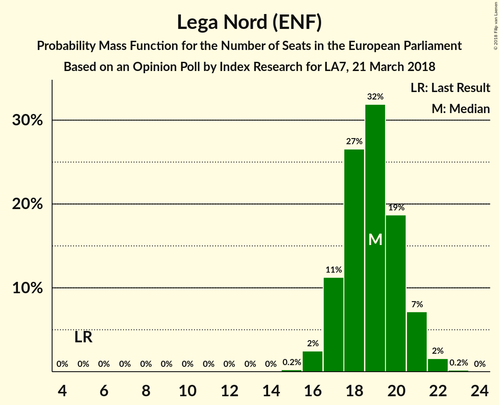
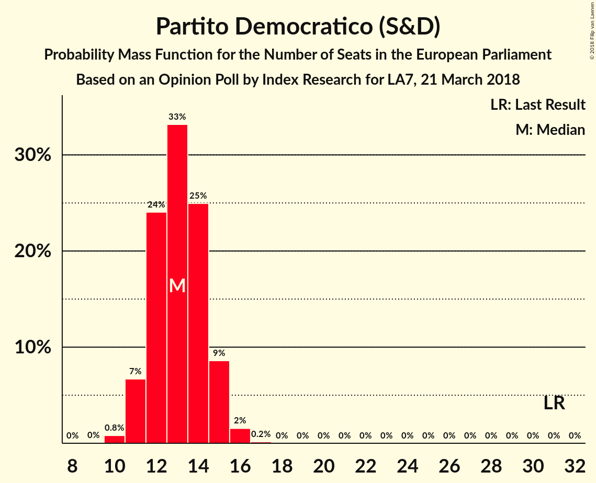
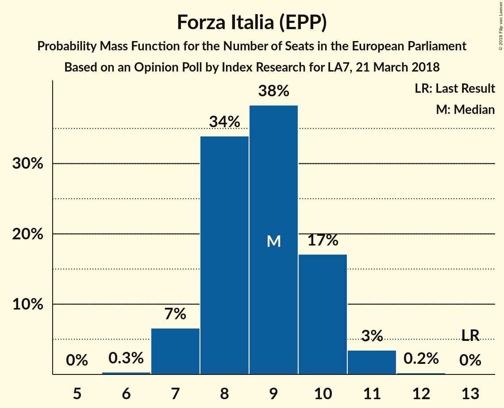
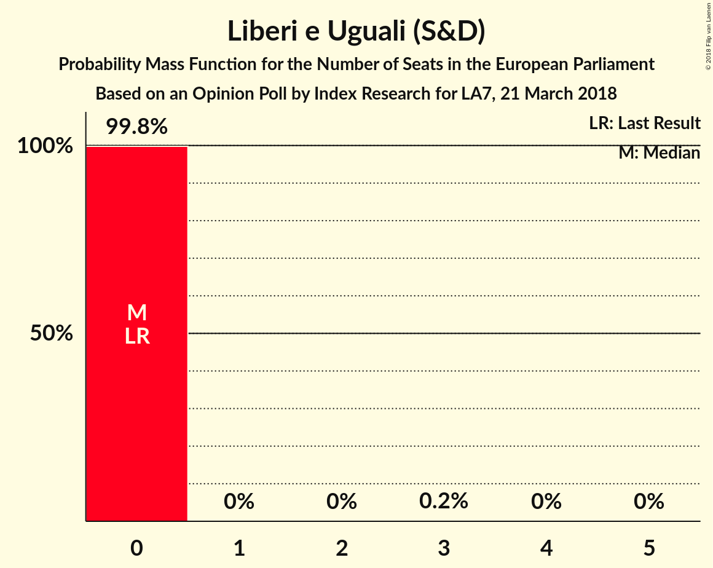
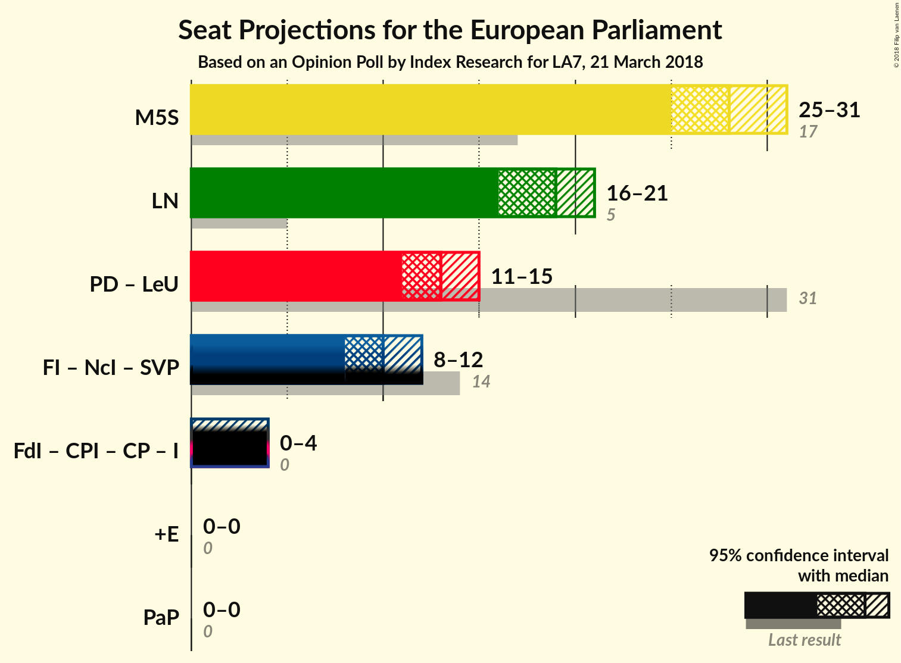

# Opinion Poll by Index Research for LA7, 21 March 2018

<a href="#voting-intentions">Voting Intentions</a> | <a href="#seats">Seats</a> | <a href="#coalitions">Coalitions</a> | <a href="#technical-information">Technical Information</a>

## Voting Intentions

### Confidence Intervals

| Party | Last Result | Poll Result | 80% Confidence Interval | 90% Confidence Interval | 95% Confidence Interval | 99% Confidence Interval |
|:-----:|:-----------:|:-----------:|:-----------------------:|:-----------------------:|:-----------------------:|:-----------------------:|
| Movimento 5 Stelle (EFDD) | 21.1% | 34.9% | 32.8–37.1% |32.2–37.7% |31.6–38.3% |30.7–39.3% |
| Lega Nord (ENF) | 6.2% | 23.5% | 21.7–25.5% |21.1–26.1% |20.7–26.6% |19.8–27.6% |
| Partito Democratico (S&D) | 40.8% | 17.5% | 15.9–19.3% |15.4–19.8% |15.0–20.3% |14.3–21.2% |
| Forza Italia (EPP) | 16.8% | 10.9% | 9.6–12.4% |9.2–12.8% |8.9–13.2% |8.3–14.0% |
| Fratelli d’Italia (*) | 3.7% | 3.2% | 2.6–4.2% |2.4–4.5% |2.2–4.7% |1.9–5.2% |
| Liberi e Uguali (S&D) | 0.0% | 2.1% | 1.6–2.9% |1.4–3.2% |1.3–3.4% |1.1–3.8% |
| Noi con l’Italia (EPP) | 0.0% | 0.6% | 0.4–1.2% |0.3–1.3% |0.3–1.5% |0.2–1.8% |

*Note:* The poll result column reflects the actual value used in the calculations. Published results may vary slightly, and in addition be rounded to fewer digits.

## Seats

### Confidence Intervals

| Party | Last Result | Median | 80% Confidence Interval | 90% Confidence Interval | 95% Confidence Interval | 99% Confidence Interval |
|:-----:|:-----------:|:------:|:-----------------------:|:-----------------------:|:-----------------------:|:-----------------------:|
| <a href="#movimento-5-stelle-(efdd)">Movimento 5 Stelle (EFDD)</a> | 17 | 28 | 26–30 |26–30 |25–31 |24–31 |
| <a href="#lega-nord-(enf)">Lega Nord (ENF)</a> | 5 | 19 | 17–20 |17–21 |16–21 |16–22 |
| <a href="#partito-democratico-(s&d)">Partito Democratico (S&D)</a> | 31 | 13 | 12–15 |11–15 |11–15 |10–16 |
| <a href="#forza-italia-(epp)">Forza Italia (EPP)</a> | 13 | 9 | 8–10 |7–10 |7–11 |7–11 |
| <a href="#fratelli-d’italia-(*)">Fratelli d’Italia (*)</a> | 0 | 0 | 0–3 |0–4 |0–4 |0–4 |
| <a href="#liberi-e-uguali-(s&d)">Liberi e Uguali (S&D)</a> | 0 | 0 | 0 |0 |0 |0 |
| <a href="#noi-con-l’italia-(epp)">Noi con l’Italia (EPP)</a> | 0 | 0 | 0 |0 |0 |0 |

### Movimento 5 Stelle (EFDD)

*For a full overview of the results for this party, see the [Movimento 5 Stelle (EFDD)](party-movimento5stelleefdd.html) page.*

| Number of Seats | Probability | Accumulated | Special Marks |
|:---------------:|:-----------:|:-----------:|:-------------:|
| 17 | 0% | 100% | Last Result |
| 18 | 0% | 100% |  |
| 19 | 0% | 100% |  |
| 20 | 0% | 100% |  |
| 21 | 0% | 100% |  |
| 22 | 0% | 100% |  |
| 23 | 0.1% | 100% |  |
| 24 | 0.6% | 99.9% |  |
| 25 | 3% | 99.4% |  |
| 26 | 11% | 96% |  |
| 27 | 22% | 85% |  |
| 28 | 28% | 63% | Median |
| 29 | 23% | 35% |  |
| 30 | 9% | 12% |  |
| 31 | 3% | 3% |  |
| 32 | 0.4% | 0.5% |  |
| 33 | 0% | 0.1% |  |
| 34 | 0% | 0% |  |

### Lega Nord (ENF)

*For a full overview of the results for this party, see the [Lega Nord (ENF)](party-leganordenf.html) page.*

| Number of Seats | Probability | Accumulated | Special Marks |
|:---------------:|:-----------:|:-----------:|:-------------:|
| 5 | 0% | 100% | Last Result |
| 6 | 0% | 100% |  |
| 7 | 0% | 100% |  |
| 8 | 0% | 100% |  |
| 9 | 0% | 100% |  |
| 10 | 0% | 100% |  |
| 11 | 0% | 100% |  |
| 12 | 0% | 100% |  |
| 13 | 0% | 100% |  |
| 14 | 0% | 100% |  |
| 15 | 0.2% | 100% |  |
| 16 | 2% | 99.8% |  |
| 17 | 11% | 97% |  |
| 18 | 27% | 86% |  |
| 19 | 32% | 59% | Median |
| 20 | 19% | 28% |  |
| 21 | 7% | 9% |  |
| 22 | 2% | 2% |  |
| 23 | 0.2% | 0.2% |  |
| 24 | 0% | 0% |  |

### Partito Democratico (S&D)

*For a full overview of the results for this party, see the [Partito Democratico (S&D)](party-partitodemocraticosd.html) page.*

| Number of Seats | Probability | Accumulated | Special Marks |
|:---------------:|:-----------:|:-----------:|:-------------:|
| 10 | 0.8% | 100% |  |
| 11 | 7% | 99.2% |  |
| 12 | 24% | 92% |  |
| 13 | 33% | 68% | Median |
| 14 | 25% | 35% |  |
| 15 | 9% | 10% |  |
| 16 | 2% | 2% |  |
| 17 | 0.2% | 0.2% |  |
| 18 | 0% | 0% |  |
| 19 | 0% | 0% |  |
| 20 | 0% | 0% |  |
| 21 | 0% | 0% |  |
| 22 | 0% | 0% |  |
| 23 | 0% | 0% |  |
| 24 | 0% | 0% |  |
| 25 | 0% | 0% |  |
| 26 | 0% | 0% |  |
| 27 | 0% | 0% |  |
| 28 | 0% | 0% |  |
| 29 | 0% | 0% |  |
| 30 | 0% | 0% |  |
| 31 | 0% | 0% | Last Result |

### Forza Italia (EPP)

*For a full overview of the results for this party, see the [Forza Italia (EPP)](party-forzaitaliaepp.html) page.*

| Number of Seats | Probability | Accumulated | Special Marks |
|:---------------:|:-----------:|:-----------:|:-------------:|
| 6 | 0.3% | 100% |  |
| 7 | 7% | 99.7% |  |
| 8 | 34% | 93% |  |
| 9 | 38% | 59% | Median |
| 10 | 17% | 21% |  |
| 11 | 3% | 4% |  |
| 12 | 0.2% | 0.2% |  |
| 13 | 0% | 0% | Last Result |

### Fratelli d’Italia (*)

*For a full overview of the results for this party, see the [Fratelli d’Italia (*)](party-fratellid’italia.html) page.*

| Number of Seats | Probability | Accumulated | Special Marks |
|:---------------:|:-----------:|:-----------:|:-------------:|
| 0 | 84% | 100% | Last Result, Median |
| 1 | 0% | 16% |  |
| 2 | 0% | 16% |  |
| 3 | 11% | 16% |  |
| 4 | 5% | 5% |  |
| 5 | 0.1% | 0.1% |  |
| 6 | 0% | 0% |  |

### Liberi e Uguali (S&D)

*For a full overview of the results for this party, see the [Liberi e Uguali (S&D)](party-liberieugualisd.html) page.*

| Number of Seats | Probability | Accumulated | Special Marks |
|:---------------:|:-----------:|:-----------:|:-------------:|
| 0 | 99.8% | 100% | Last Result, Median |
| 1 | 0% | 0.2% |  |
| 2 | 0% | 0.2% |  |
| 3 | 0.2% | 0.2% |  |
| 4 | 0% | 0% |  |

### Noi con l’Italia (EPP)

*For a full overview of the results for this party, see the [Noi con l’Italia (EPP)](party-noiconl’italiaepp.html) page.*

| Number of Seats | Probability | Accumulated | Special Marks |
|:---------------:|:-----------:|:-----------:|:-------------:|
| 0 | 100% | 100% | Last Result, Median |

## Coalitions

### Confidence Intervals

| Coalition | Last Result | Median | Majority? | 80% Confidence Interval | 90% Confidence Interval | 95% Confidence Interval | 99% Confidence Interval |
|:---------:|:-----------:|:------:|:---------:|:-----------------------:|:-----------------------:|:-----------------------:|:-----------------------:|
| Movimento 5 Stelle (EFDD) | 17 | 28 | 0% | 26–30 | 26–30 | 25–31 | 24–31 |
| Lega Nord (ENF) | 5 | 19 | 0% | 17–20 | 17–21 | 16–21 | 16–22 |
| Partito Democratico (S&D) – Liberi e Uguali (S&D) | 31 | 13 | 0% | 12–15 | 11–15 | 11–15 | 10–16 |

### Movimento 5 Stelle (EFDD)

| Number of Seats | Probability | Accumulated | Special Marks |
|:---------------:|:-----------:|:-----------:|:-------------:|
| 17 | 0% | 100% | Last Result |
| 18 | 0% | 100% |  |
| 19 | 0% | 100% |  |
| 20 | 0% | 100% |  |
| 21 | 0% | 100% |  |
| 22 | 0% | 100% |  |
| 23 | 0.1% | 100% |  |
| 24 | 0.6% | 99.9% |  |
| 25 | 3% | 99.4% |  |
| 26 | 11% | 96% |  |
| 27 | 22% | 85% |  |
| 28 | 28% | 63% | Median |
| 29 | 23% | 35% |  |
| 30 | 9% | 12% |  |
| 31 | 3% | 3% |  |
| 32 | 0.4% | 0.5% |  |
| 33 | 0% | 0.1% |  |
| 34 | 0% | 0% |  |

### Lega Nord (ENF)

| Number of Seats | Probability | Accumulated | Special Marks |
|:---------------:|:-----------:|:-----------:|:-------------:|
| 5 | 0% | 100% | Last Result |
| 6 | 0% | 100% |  |
| 7 | 0% | 100% |  |
| 8 | 0% | 100% |  |
| 9 | 0% | 100% |  |
| 10 | 0% | 100% |  |
| 11 | 0% | 100% |  |
| 12 | 0% | 100% |  |
| 13 | 0% | 100% |  |
| 14 | 0% | 100% |  |
| 15 | 0.2% | 100% |  |
| 16 | 2% | 99.8% |  |
| 17 | 11% | 97% |  |
| 18 | 27% | 86% |  |
| 19 | 32% | 59% | Median |
| 20 | 19% | 28% |  |
| 21 | 7% | 9% |  |
| 22 | 2% | 2% |  |
| 23 | 0.2% | 0.2% |  |
| 24 | 0% | 0% |  |

### Partito Democratico (S&D) – Liberi e Uguali (S&D)

| Number of Seats | Probability | Accumulated | Special Marks |
|:---------------:|:-----------:|:-----------:|:-------------:|
| 10 | 0.8% | 100% |  |
| 11 | 7% | 99.2% |  |
| 12 | 24% | 93% |  |
| 13 | 33% | 69% | Median |
| 14 | 25% | 35% |  |
| 15 | 9% | 10% |  |
| 16 | 2% | 2% |  |
| 17 | 0.2% | 0.2% |  |
| 18 | 0% | 0% |  |
| 19 | 0% | 0% |  |
| 20 | 0% | 0% |  |
| 21 | 0% | 0% |  |
| 22 | 0% | 0% |  |
| 23 | 0% | 0% |  |
| 24 | 0% | 0% |  |
| 25 | 0% | 0% |  |
| 26 | 0% | 0% |  |
| 27 | 0% | 0% |  |
| 28 | 0% | 0% |  |
| 29 | 0% | 0% |  |
| 30 | 0% | 0% |  |
| 31 | 0% | 0% | Last Result |

## Technical Information

### Opinion Poll

+ **Polling firm:** Index Research
+ **Commissioner(s):** LA7
+ **Fieldwork period:** 21 March 2018

### Calculations

+ **Sample size:** 800
+ **Simulations done:** 1,048,576
+ **Error estimate:** 3.09%

