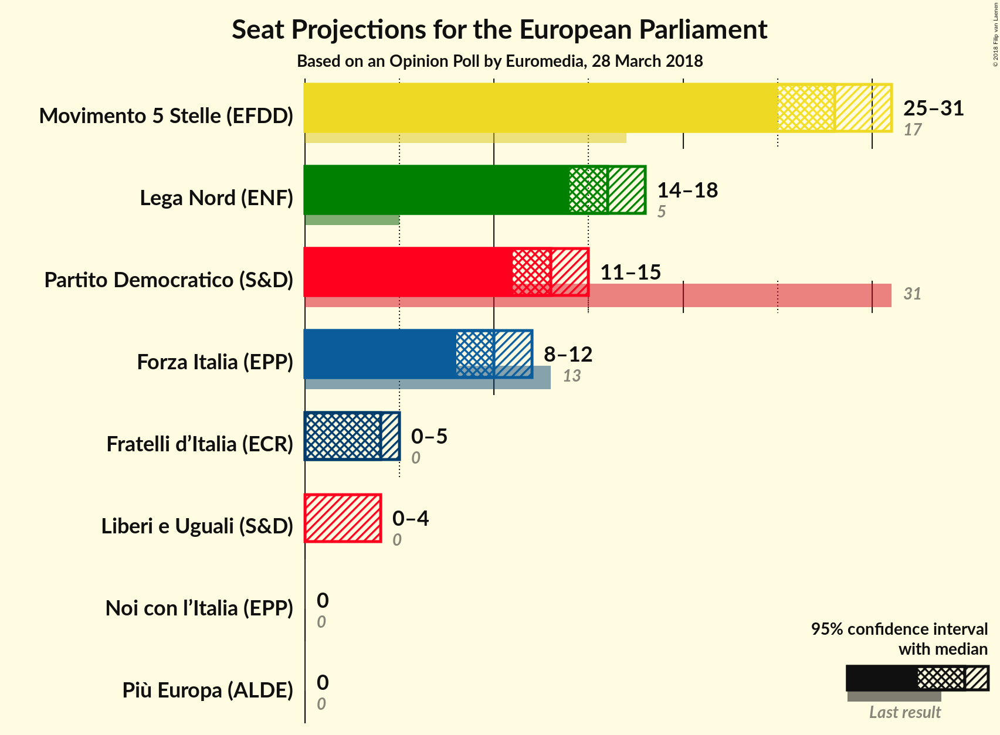
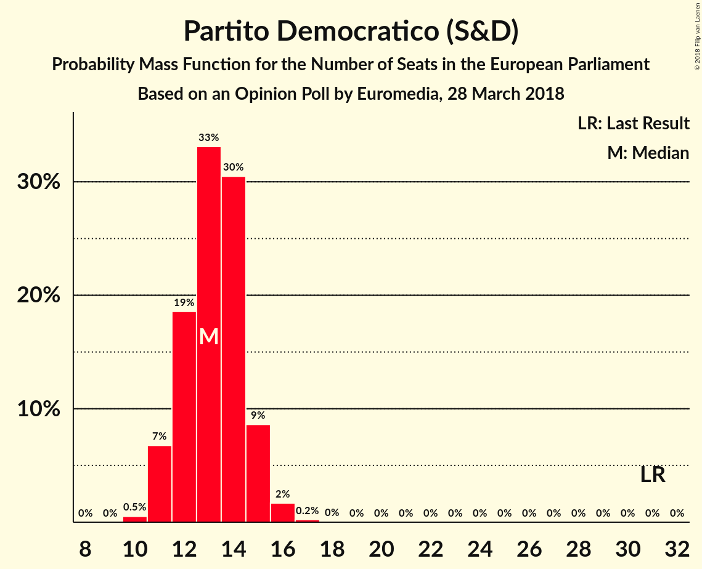
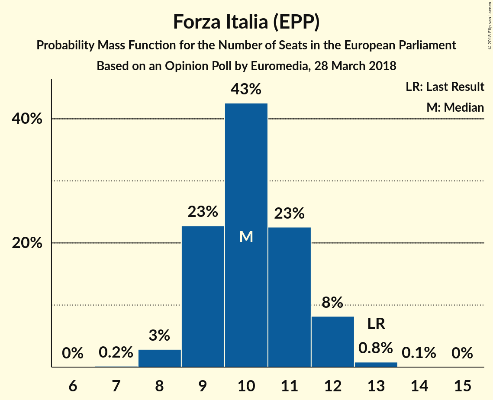
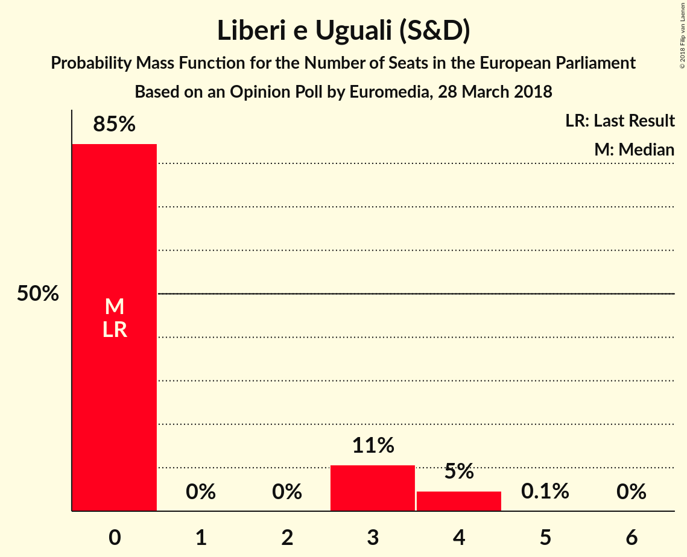

# Opinion Poll by Euromedia, 28 March 2018

<a href="#voting-intentions">Voting Intentions</a> | <a href="#seats">Seats</a> | <a href="#coalitions">Coalitions</a> | <a href="#technical-information">Technical Information</a>

## Voting Intentions

### Confidence Intervals

| Party | Last Result | Poll Result | 80% Confidence Interval | 90% Confidence Interval | 95% Confidence Interval | 99% Confidence Interval |
|:-----:|:-----------:|:-----------:|:-----------------------:|:-----------------------:|:-----------------------:|:-----------------------:|
| Movimento 5 Stelle (EFDD) | 21.2% | 34.6% | 32.5–36.8% |31.9–37.4% |31.4–38.0% |30.4–39.1% |
| Lega Nord (ENF) | 6.2% | 19.4% | 17.7–21.3% |17.2–21.8% |16.8–22.3% |16.0–23.2% |
| Partito Democratico (S&D) | 40.8% | 17.6% | 16.0–19.5% |15.5–20.0% |15.1–20.4% |14.4–21.3% |
| Forza Italia (EPP) | 16.8% | 12.5% | 11.1–14.1% |10.7–14.6% |10.4–15.0% |9.8–15.8% |
| Fratelli d’Italia (*) | 3.7% | 4.5% | 3.7–5.6% |3.5–5.9% |3.3–6.2% |2.9–6.7% |
| Liberi e Uguali (S&D) | 0.0% | 3.2% | 2.6–4.2% |2.4–4.5% |2.2–4.7% |1.9–5.2% |
| Più Europa (ALDE) | 0.0% | 1.4% | 1.0–2.1% |0.9–2.3% |0.8–2.5% |0.6–2.8% |
| Noi con l’Italia (EPP) | 0.0% | 1.0% | 0.7–1.6% |0.6–1.8% |0.5–2.0% |0.4–2.3% |

*Note:* The poll result column reflects the actual value used in the calculations. Published results may vary slightly, and in addition be rounded to fewer digits.

## Seats

### Confidence Intervals

| Party | Last Result | Median | 80% Confidence Interval | 90% Confidence Interval | 95% Confidence Interval | 99% Confidence Interval |
|:-----:|:-----------:|:------:|:-----------------------:|:-----------------------:|:-----------------------:|:-----------------------:|
| <a href="#movimento-5-stelle-(efdd)">Movimento 5 Stelle (EFDD)</a> | 17 | 28 | 26–30 |25–30 |25–31 |24–32 |
| <a href="#lega-nord-(enf)">Lega Nord (ENF)</a> | 5 | 16 | 14–17 |14–18 |14–18 |13–19 |
| <a href="#partito-democratico-(s&d)">Partito Democratico (S&D)</a> | 31 | 13 | 12–15 |11–15 |11–15 |10–16 |
| <a href="#forza-italia-(epp)">Forza Italia (EPP)</a> | 13 | 10 | 9–11 |9–12 |8–12 |8–13 |
| <a href="#fratelli-d’italia-(*)">Fratelli d’Italia (*)</a> | 0 | 4 | 0–4 |0–5 |0–5 |0–5 |
| <a href="#liberi-e-uguali-(s&d)">Liberi e Uguali (S&D)</a> | 0 | 0 | 0–3 |0–3 |0–4 |0–4 |
| <a href="#più-europa-(alde)">Più Europa (ALDE)</a> | 0 | 0 | 0 |0 |0 |0 |
| <a href="#noi-con-l’italia-(epp)">Noi con l’Italia (EPP)</a> | 0 | 0 | 0 |0 |0 |0 |

### Movimento 5 Stelle (EFDD)

*For a full overview of the results for this party, see the [Movimento 5 Stelle (EFDD)](party-movimento5stelleefdd.html) page.*

| Number of Seats | Probability | Accumulated | Special Marks |
|:---------------:|:-----------:|:-----------:|:-------------:|
| 17 | 0% | 100% | Last Result |
| 18 | 0% | 100% |  |
| 19 | 0% | 100% |  |
| 20 | 0% | 100% |  |
| 21 | 0% | 100% |  |
| 22 | 0% | 100% |  |
| 23 | 0.1% | 100% |  |
| 24 | 0.8% | 99.9% |  |
| 25 | 5% | 99.0% |  |
| 26 | 14% | 94% |  |
| 27 | 26% | 81% |  |
| 28 | 25% | 54% | Median |
| 29 | 17% | 30% |  |
| 30 | 8% | 13% |  |
| 31 | 4% | 4% |  |
| 32 | 0.6% | 0.8% |  |
| 33 | 0.2% | 0.2% |  |
| 34 | 0% | 0% |  |

### Lega Nord (ENF)

*For a full overview of the results for this party, see the [Lega Nord (ENF)](party-leganordenf.html) page.*

| Number of Seats | Probability | Accumulated | Special Marks |
|:---------------:|:-----------:|:-----------:|:-------------:|
| 5 | 0% | 100% | Last Result |
| 6 | 0% | 100% |  |
| 7 | 0% | 100% |  |
| 8 | 0% | 100% |  |
| 9 | 0% | 100% |  |
| 10 | 0% | 100% |  |
| 11 | 0% | 100% |  |
| 12 | 0.3% | 100% |  |
| 13 | 2% | 99.7% |  |
| 14 | 12% | 98% |  |
| 15 | 34% | 86% |  |
| 16 | 29% | 52% | Median |
| 17 | 15% | 23% |  |
| 18 | 7% | 7% |  |
| 19 | 0.6% | 0.7% |  |
| 20 | 0.1% | 0.1% |  |
| 21 | 0% | 0% |  |

### Partito Democratico (S&D)

*For a full overview of the results for this party, see the [Partito Democratico (S&D)](party-partitodemocraticosd.html) page.*

| Number of Seats | Probability | Accumulated | Special Marks |
|:---------------:|:-----------:|:-----------:|:-------------:|
| 10 | 0.5% | 100% |  |
| 11 | 7% | 99.5% |  |
| 12 | 19% | 93% |  |
| 13 | 33% | 74% | Median |
| 14 | 30% | 41% |  |
| 15 | 9% | 11% |  |
| 16 | 2% | 2% |  |
| 17 | 0.2% | 0.2% |  |
| 18 | 0% | 0% |  |
| 19 | 0% | 0% |  |
| 20 | 0% | 0% |  |
| 21 | 0% | 0% |  |
| 22 | 0% | 0% |  |
| 23 | 0% | 0% |  |
| 24 | 0% | 0% |  |
| 25 | 0% | 0% |  |
| 26 | 0% | 0% |  |
| 27 | 0% | 0% |  |
| 28 | 0% | 0% |  |
| 29 | 0% | 0% |  |
| 30 | 0% | 0% |  |
| 31 | 0% | 0% | Last Result |

### Forza Italia (EPP)

*For a full overview of the results for this party, see the [Forza Italia (EPP)](party-forzaitaliaepp.html) page.*

| Number of Seats | Probability | Accumulated | Special Marks |
|:---------------:|:-----------:|:-----------:|:-------------:|
| 7 | 0.2% | 100% |  |
| 8 | 3% | 99.8% |  |
| 9 | 23% | 97% |  |
| 10 | 43% | 74% | Median |
| 11 | 23% | 32% |  |
| 12 | 8% | 9% |  |
| 13 | 0.8% | 0.9% | Last Result |
| 14 | 0.1% | 0.1% |  |
| 15 | 0% | 0% |  |

### Fratelli d’Italia (*)

*For a full overview of the results for this party, see the [Fratelli d’Italia (*)](party-fratellid’italia.html) page.*

| Number of Seats | Probability | Accumulated | Special Marks |
|:---------------:|:-----------:|:-----------:|:-------------:|
| 0 | 21% | 100% | Last Result |
| 1 | 0% | 79% |  |
| 2 | 0% | 79% |  |
| 3 | 17% | 79% |  |
| 4 | 52% | 62% | Median |
| 5 | 9% | 9% |  |
| 6 | 0.3% | 0.3% |  |
| 7 | 0% | 0% |  |

### Liberi e Uguali (S&D)

*For a full overview of the results for this party, see the [Liberi e Uguali (S&D)](party-liberieugualisd.html) page.*

| Number of Seats | Probability | Accumulated | Special Marks |
|:---------------:|:-----------:|:-----------:|:-------------:|
| 0 | 85% | 100% | Last Result, Median |
| 1 | 0% | 15% |  |
| 2 | 0% | 15% |  |
| 3 | 11% | 15% |  |
| 4 | 5% | 5% |  |
| 5 | 0.1% | 0.1% |  |
| 6 | 0% | 0% |  |

### Più Europa (ALDE)

*For a full overview of the results for this party, see the [Più Europa (ALDE)](party-piùeuropaalde.html) page.*

| Number of Seats | Probability | Accumulated | Special Marks |
|:---------------:|:-----------:|:-----------:|:-------------:|
| 0 | 100% | 100% | Last Result, Median |

### Noi con l’Italia (EPP)

*For a full overview of the results for this party, see the [Noi con l’Italia (EPP)](party-noiconl’italiaepp.html) page.*

| Number of Seats | Probability | Accumulated | Special Marks |
|:---------------:|:-----------:|:-----------:|:-------------:|
| 0 | 100% | 100% | Last Result, Median |

## Coalitions

### Confidence Intervals

| Coalition | Last Result | Median | Majority? | 80% Confidence Interval | 90% Confidence Interval | 95% Confidence Interval | 99% Confidence Interval |
|:---------:|:-----------:|:------:|:---------:|:-----------------------:|:-----------------------:|:-----------------------:|:-----------------------:|
| Movimento 5 Stelle (EFDD) | 17 | 28 | 0% | 26–30 | 25–30 | 25–31 | 24–32 |
| Lega Nord (ENF) | 5 | 16 | 0% | 14–17 | 14–18 | 14–18 | 13–19 |
| Partito Democratico (S&D) – Liberi e Uguali (S&D) | 31 | 14 | 0% | 12–16 | 11–16 | 11–17 | 11–18 |
| Più Europa (ALDE) | 0 | 0 | 0% | 0 | 0 | 0 | 0 |

### Movimento 5 Stelle (EFDD)

| Number of Seats | Probability | Accumulated | Special Marks |
|:---------------:|:-----------:|:-----------:|:-------------:|
| 17 | 0% | 100% | Last Result |
| 18 | 0% | 100% |  |
| 19 | 0% | 100% |  |
| 20 | 0% | 100% |  |
| 21 | 0% | 100% |  |
| 22 | 0% | 100% |  |
| 23 | 0.1% | 100% |  |
| 24 | 0.8% | 99.9% |  |
| 25 | 5% | 99.0% |  |
| 26 | 14% | 94% |  |
| 27 | 26% | 81% |  |
| 28 | 25% | 54% | Median |
| 29 | 17% | 30% |  |
| 30 | 8% | 13% |  |
| 31 | 4% | 4% |  |
| 32 | 0.6% | 0.8% |  |
| 33 | 0.2% | 0.2% |  |
| 34 | 0% | 0% |  |

### Lega Nord (ENF)

| Number of Seats | Probability | Accumulated | Special Marks |
|:---------------:|:-----------:|:-----------:|:-------------:|
| 5 | 0% | 100% | Last Result |
| 6 | 0% | 100% |  |
| 7 | 0% | 100% |  |
| 8 | 0% | 100% |  |
| 9 | 0% | 100% |  |
| 10 | 0% | 100% |  |
| 11 | 0% | 100% |  |
| 12 | 0.3% | 100% |  |
| 13 | 2% | 99.7% |  |
| 14 | 12% | 98% |  |
| 15 | 34% | 86% |  |
| 16 | 29% | 52% | Median |
| 17 | 15% | 23% |  |
| 18 | 7% | 7% |  |
| 19 | 0.6% | 0.7% |  |
| 20 | 0.1% | 0.1% |  |
| 21 | 0% | 0% |  |

### Partito Democratico (S&D) – Liberi e Uguali (S&D)

| Number of Seats | Probability | Accumulated | Special Marks |
|:---------------:|:-----------:|:-----------:|:-------------:|
| 10 | 0.3% | 100% |  |
| 11 | 5% | 99.7% |  |
| 12 | 14% | 95% |  |
| 13 | 28% | 81% | Median |
| 14 | 30% | 54% |  |
| 15 | 12% | 24% |  |
| 16 | 8% | 12% |  |
| 17 | 3% | 4% |  |
| 18 | 0.9% | 1.3% |  |
| 19 | 0.4% | 0.4% |  |
| 20 | 0% | 0% |  |
| 21 | 0% | 0% |  |
| 22 | 0% | 0% |  |
| 23 | 0% | 0% |  |
| 24 | 0% | 0% |  |
| 25 | 0% | 0% |  |
| 26 | 0% | 0% |  |
| 27 | 0% | 0% |  |
| 28 | 0% | 0% |  |
| 29 | 0% | 0% |  |
| 30 | 0% | 0% |  |
| 31 | 0% | 0% | Last Result |

### Più Europa (ALDE)

| Number of Seats | Probability | Accumulated | Special Marks |
|:---------------:|:-----------:|:-----------:|:-------------:|
| 0 | 100% | 100% | Last Result, Median |

## Technical Information

### Opinion Poll

+ **Polling firm:** Euromedia
+ **Commissioner(s):** —
+ **Fieldwork period:** 28 March 2018

### Calculations

+ **Sample size:** 800
+ **Simulations done:** 1,048,576
+ **Error estimate:** 1.23%

