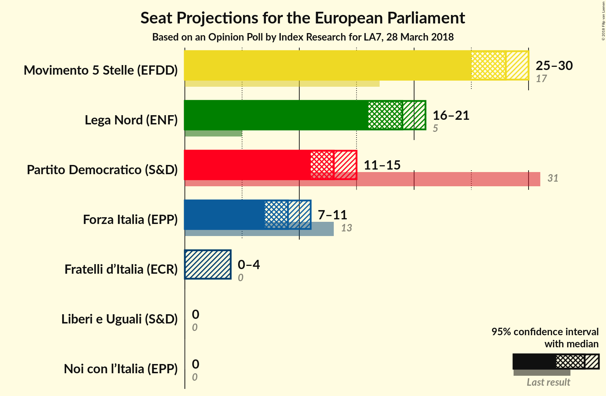
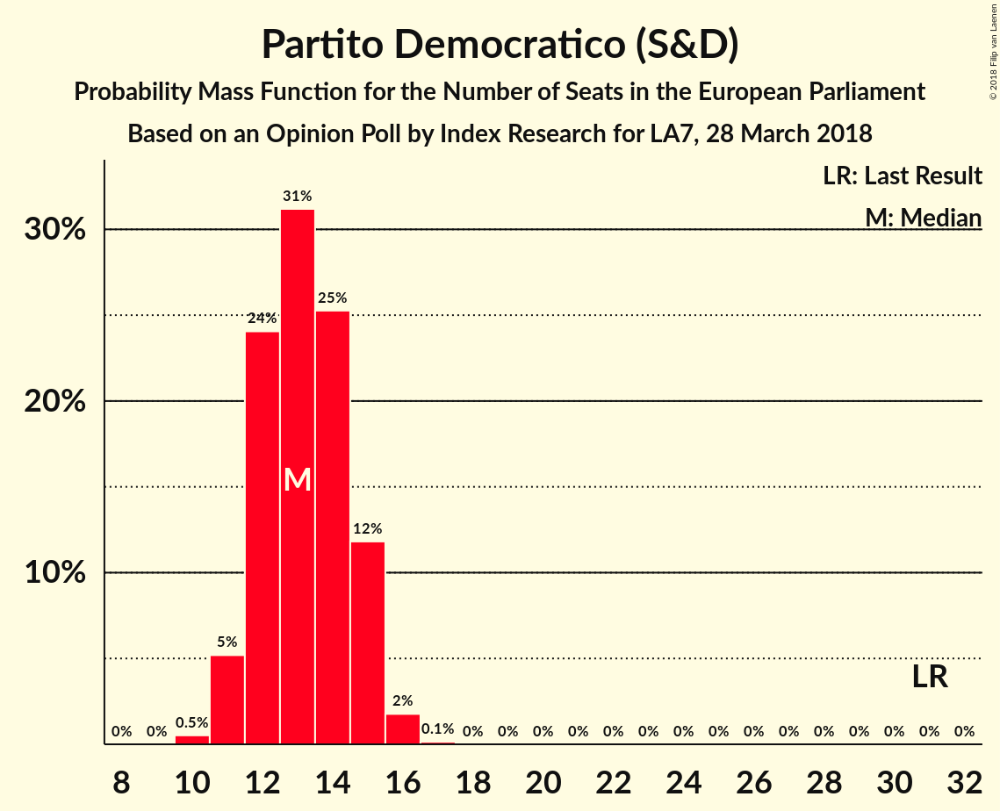
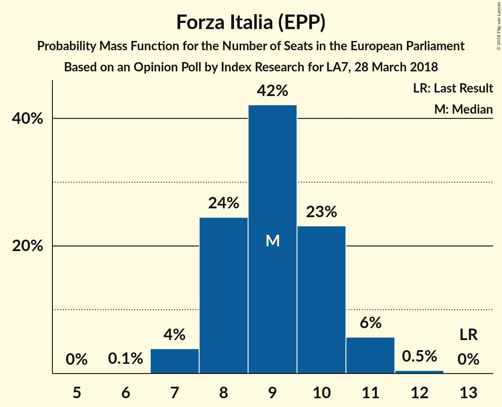
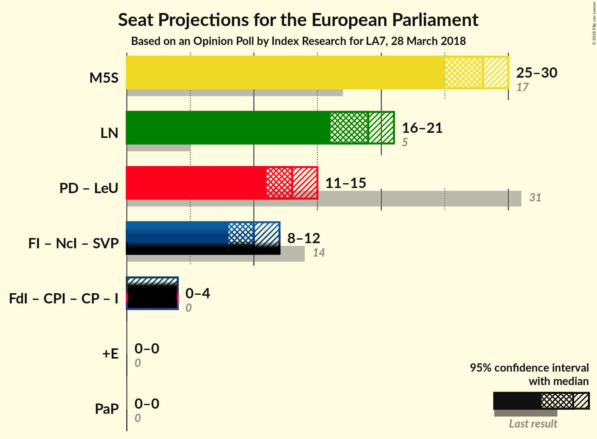

# Opinion Poll by Index Research for LA7, 28 March 2018

<a href="#voting-intentions">Voting Intentions</a> | <a href="#seats">Seats</a> | <a href="#coalitions">Coalitions</a> | <a href="#technical-information">Technical Information</a>

## Voting Intentions

### Confidence Intervals

| Party | Last Result | Poll Result | 80% Confidence Interval | 90% Confidence Interval | 95% Confidence Interval | 99% Confidence Interval |
|:-----:|:-----------:|:-----------:|:-----------------------:|:-----------------------:|:-----------------------:|:-----------------------:|
| Movimento 5 Stelle (EFDD) | 21.2% | 34.6% | 32.5–36.8% |31.9–37.4% |31.4–38.0% |30.4–39.1% |
| Lega Nord (ENF) | 6.2% | 23.5% | 21.7–25.5% |21.1–26.1% |20.7–26.6% |19.8–27.6% |
| Partito Democratico (S&D) | 40.8% | 17.8% | 16.1–19.6% |15.7–20.1% |15.3–20.6% |14.5–21.5% |
| Forza Italia (EPP) | 16.8% | 11.2% | 9.9–12.8% |9.6–13.2% |9.2–13.6% |8.6–14.4% |
| Fratelli d’Italia (*) | 3.7% | 3.4% | 2.7–4.3% |2.5–4.6% |2.3–4.9% |2.0–5.4% |
| Liberi e Uguali (S&D) | 0.0% | 2.0% | 1.5–2.8% |1.4–3.0% |1.2–3.2% |1.0–3.7% |
| Noi con l’Italia (EPP) | 0.0% | 0.4% | 0.2–0.8% |0.2–1.0% |0.1–1.1% |0.1–1.4% |

*Note:* The poll result column reflects the actual value used in the calculations. Published results may vary slightly, and in addition be rounded to fewer digits.

## Seats

### Confidence Intervals

| Party | Last Result | Median | 80% Confidence Interval | 90% Confidence Interval | 95% Confidence Interval | 99% Confidence Interval |
|:-----:|:-----------:|:------:|:-----------------------:|:-----------------------:|:-----------------------:|:-----------------------:|
| <a href="#movimento-5-stelle-(efdd)">Movimento 5 Stelle (EFDD)</a> | 17 | 28 | 26–29 |25–30 |25–30 |24–31 |
| <a href="#lega-nord-(enf)">Lega Nord (ENF)</a> | 5 | 19 | 17–20 |17–21 |16–21 |16–22 |
| <a href="#partito-democratico-(s&d)">Partito Democratico (S&D)</a> | 31 | 13 | 12–15 |11–15 |11–15 |10–16 |
| <a href="#forza-italia-(epp)">Forza Italia (EPP)</a> | 13 | 9 | 8–10 |8–11 |7–11 |7–12 |
| <a href="#fratelli-d’italia-(*)">Fratelli d’Italia (*)</a> | 0 | 0 | 0–3 |0–4 |0–4 |0–4 |
| <a href="#liberi-e-uguali-(s&d)">Liberi e Uguali (S&D)</a> | 0 | 0 | 0 |0 |0 |0 |
| <a href="#noi-con-l’italia-(epp)">Noi con l’Italia (EPP)</a> | 0 | 0 | 0 |0 |0 |0 |

### Movimento 5 Stelle (EFDD)

*For a full overview of the results for this party, see the [Movimento 5 Stelle (EFDD)](party-movimento5stelleefdd.html) page.*

| Number of Seats | Probability | Accumulated | Special Marks |
|:---------------:|:-----------:|:-----------:|:-------------:|
| 17 | 0% | 100% | Last Result |
| 18 | 0% | 100% |  |
| 19 | 0% | 100% |  |
| 20 | 0% | 100% |  |
| 21 | 0% | 100% |  |
| 22 | 0% | 100% |  |
| 23 | 0.2% | 100% |  |
| 24 | 1.3% | 99.8% |  |
| 25 | 5% | 98% |  |
| 26 | 15% | 93% |  |
| 27 | 26% | 78% |  |
| 28 | 26% | 52% | Median |
| 29 | 18% | 27% |  |
| 30 | 7% | 9% |  |
| 31 | 2% | 2% |  |
| 32 | 0.3% | 0.3% |  |
| 33 | 0% | 0% |  |

### Lega Nord (ENF)

*For a full overview of the results for this party, see the [Lega Nord (ENF)](party-leganordenf.html) page.*

| Number of Seats | Probability | Accumulated | Special Marks |
|:---------------:|:-----------:|:-----------:|:-------------:|
| 5 | 0% | 100% | Last Result |
| 6 | 0% | 100% |  |
| 7 | 0% | 100% |  |
| 8 | 0% | 100% |  |
| 9 | 0% | 100% |  |
| 10 | 0% | 100% |  |
| 11 | 0% | 100% |  |
| 12 | 0% | 100% |  |
| 13 | 0% | 100% |  |
| 14 | 0% | 100% |  |
| 15 | 0.3% | 100% |  |
| 16 | 3% | 99.7% |  |
| 17 | 12% | 97% |  |
| 18 | 30% | 84% |  |
| 19 | 26% | 54% | Median |
| 20 | 20% | 29% |  |
| 21 | 7% | 8% |  |
| 22 | 1.4% | 2% |  |
| 23 | 0.2% | 0.2% |  |
| 24 | 0% | 0% |  |

### Partito Democratico (S&D)

*For a full overview of the results for this party, see the [Partito Democratico (S&D)](party-partitodemocraticosd.html) page.*

| Number of Seats | Probability | Accumulated | Special Marks |
|:---------------:|:-----------:|:-----------:|:-------------:|
| 10 | 0.5% | 100% |  |
| 11 | 5% | 99.5% |  |
| 12 | 24% | 94% |  |
| 13 | 31% | 70% | Median |
| 14 | 25% | 39% |  |
| 15 | 12% | 14% |  |
| 16 | 2% | 2% |  |
| 17 | 0.1% | 0.2% |  |
| 18 | 0% | 0% |  |
| 19 | 0% | 0% |  |
| 20 | 0% | 0% |  |
| 21 | 0% | 0% |  |
| 22 | 0% | 0% |  |
| 23 | 0% | 0% |  |
| 24 | 0% | 0% |  |
| 25 | 0% | 0% |  |
| 26 | 0% | 0% |  |
| 27 | 0% | 0% |  |
| 28 | 0% | 0% |  |
| 29 | 0% | 0% |  |
| 30 | 0% | 0% |  |
| 31 | 0% | 0% | Last Result |

### Forza Italia (EPP)

*For a full overview of the results for this party, see the [Forza Italia (EPP)](party-forzaitaliaepp.html) page.*

| Number of Seats | Probability | Accumulated | Special Marks |
|:---------------:|:-----------:|:-----------:|:-------------:|
| 6 | 0.1% | 100% |  |
| 7 | 4% | 99.9% |  |
| 8 | 24% | 96% |  |
| 9 | 42% | 71% | Median |
| 10 | 23% | 29% |  |
| 11 | 6% | 6% |  |
| 12 | 0.5% | 0.5% |  |
| 13 | 0% | 0% | Last Result |

### Fratelli d’Italia (*)

*For a full overview of the results for this party, see the [Fratelli d’Italia (*)](party-fratellid’italia.html) page.*

| Number of Seats | Probability | Accumulated | Special Marks |
|:---------------:|:-----------:|:-----------:|:-------------:|
| 0 | 79% | 100% | Last Result, Median |
| 1 | 0% | 21% |  |
| 2 | 0% | 21% |  |
| 3 | 14% | 21% |  |
| 4 | 7% | 7% |  |
| 5 | 0.1% | 0.1% |  |
| 6 | 0% | 0% |  |

### Liberi e Uguali (S&D)

*For a full overview of the results for this party, see the [Liberi e Uguali (S&D)](party-liberieugualisd.html) page.*

| Number of Seats | Probability | Accumulated | Special Marks |
|:---------------:|:-----------:|:-----------:|:-------------:|
| 0 | 99.9% | 100% | Last Result, Median |
| 1 | 0% | 0.1% |  |
| 2 | 0% | 0.1% |  |
| 3 | 0.1% | 0.1% |  |
| 4 | 0% | 0% |  |

### Noi con l’Italia (EPP)

*For a full overview of the results for this party, see the [Noi con l’Italia (EPP)](party-noiconl’italiaepp.html) page.*

| Number of Seats | Probability | Accumulated | Special Marks |
|:---------------:|:-----------:|:-----------:|:-------------:|
| 0 | 100% | 100% | Last Result, Median |

## Coalitions

### Confidence Intervals

| Coalition | Last Result | Median | Majority? | 80% Confidence Interval | 90% Confidence Interval | 95% Confidence Interval | 99% Confidence Interval |
|:---------:|:-----------:|:------:|:---------:|:-----------------------:|:-----------------------:|:-----------------------:|:-----------------------:|
| Movimento 5 Stelle (EFDD) | 17 | 28 | 0% | 26–29 | 25–30 | 25–30 | 24–31 |
| Lega Nord (ENF) | 5 | 19 | 0% | 17–20 | 17–21 | 16–21 | 16–22 |
| Partito Democratico (S&D) – Liberi e Uguali (S&D) | 31 | 13 | 0% | 12–15 | 11–15 | 11–15 | 10–16 |

### Movimento 5 Stelle (EFDD)

| Number of Seats | Probability | Accumulated | Special Marks |
|:---------------:|:-----------:|:-----------:|:-------------:|
| 17 | 0% | 100% | Last Result |
| 18 | 0% | 100% |  |
| 19 | 0% | 100% |  |
| 20 | 0% | 100% |  |
| 21 | 0% | 100% |  |
| 22 | 0% | 100% |  |
| 23 | 0.2% | 100% |  |
| 24 | 1.3% | 99.8% |  |
| 25 | 5% | 98% |  |
| 26 | 15% | 93% |  |
| 27 | 26% | 78% |  |
| 28 | 26% | 52% | Median |
| 29 | 18% | 27% |  |
| 30 | 7% | 9% |  |
| 31 | 2% | 2% |  |
| 32 | 0.3% | 0.3% |  |
| 33 | 0% | 0% |  |

### Lega Nord (ENF)

| Number of Seats | Probability | Accumulated | Special Marks |
|:---------------:|:-----------:|:-----------:|:-------------:|
| 5 | 0% | 100% | Last Result |
| 6 | 0% | 100% |  |
| 7 | 0% | 100% |  |
| 8 | 0% | 100% |  |
| 9 | 0% | 100% |  |
| 10 | 0% | 100% |  |
| 11 | 0% | 100% |  |
| 12 | 0% | 100% |  |
| 13 | 0% | 100% |  |
| 14 | 0% | 100% |  |
| 15 | 0.3% | 100% |  |
| 16 | 3% | 99.7% |  |
| 17 | 12% | 97% |  |
| 18 | 30% | 84% |  |
| 19 | 26% | 54% | Median |
| 20 | 20% | 29% |  |
| 21 | 7% | 8% |  |
| 22 | 1.4% | 2% |  |
| 23 | 0.2% | 0.2% |  |
| 24 | 0% | 0% |  |

### Partito Democratico (S&D) – Liberi e Uguali (S&D)

| Number of Seats | Probability | Accumulated | Special Marks |
|:---------------:|:-----------:|:-----------:|:-------------:|
| 10 | 0.5% | 100% |  |
| 11 | 5% | 99.5% |  |
| 12 | 24% | 94% |  |
| 13 | 31% | 70% | Median |
| 14 | 25% | 39% |  |
| 15 | 12% | 14% |  |
| 16 | 2% | 2% |  |
| 17 | 0.2% | 0.2% |  |
| 18 | 0% | 0% |  |
| 19 | 0% | 0% |  |
| 20 | 0% | 0% |  |
| 21 | 0% | 0% |  |
| 22 | 0% | 0% |  |
| 23 | 0% | 0% |  |
| 24 | 0% | 0% |  |
| 25 | 0% | 0% |  |
| 26 | 0% | 0% |  |
| 27 | 0% | 0% |  |
| 28 | 0% | 0% |  |
| 29 | 0% | 0% |  |
| 30 | 0% | 0% |  |
| 31 | 0% | 0% | Last Result |

## Technical Information

### Opinion Poll

+ **Polling firm:** Index Research
+ **Commissioner(s):** LA7
+ **Fieldwork period:** 28 March 2018

### Calculations

+ **Sample size:** 800
+ **Simulations done:** 1,048,576
+ **Error estimate:** 1.34%

