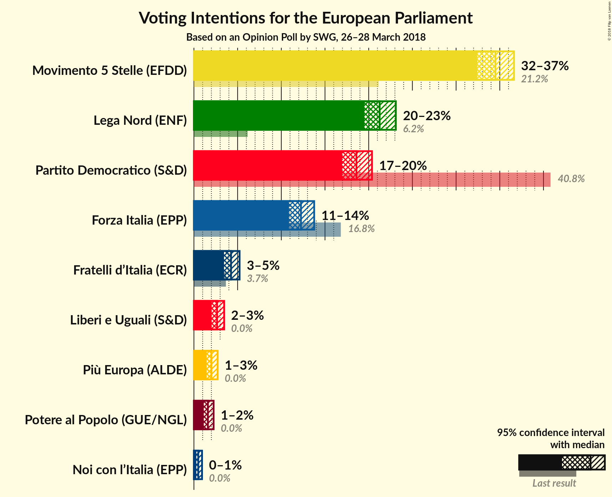
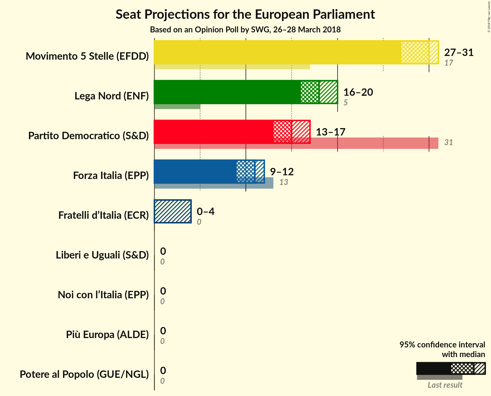
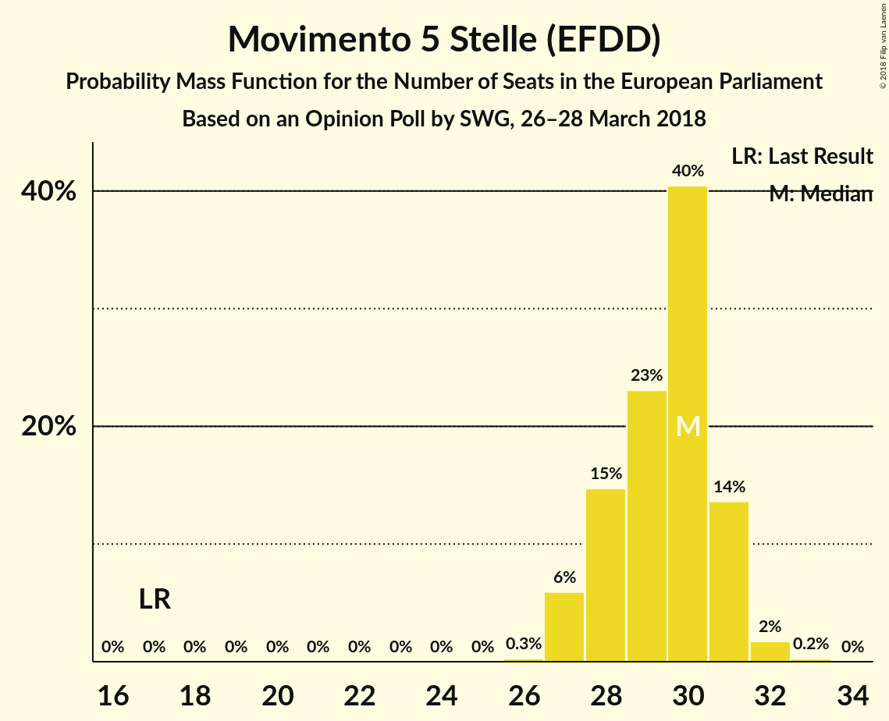
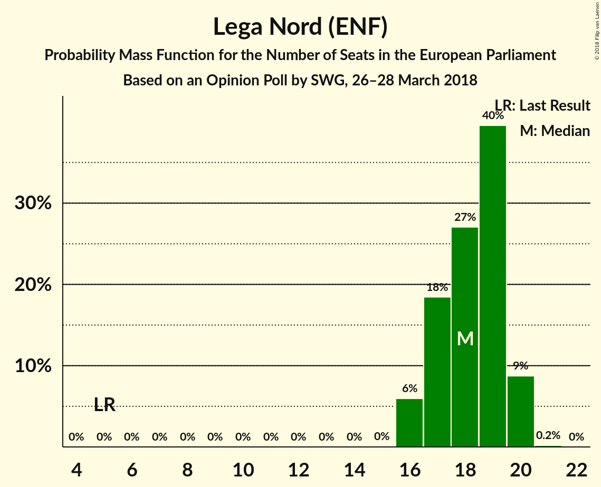

# Opinion Poll by SWG, 26–28 March 2018

<a href="#voting-intentions">Voting Intentions</a> | <a href="#seats">Seats</a> | <a href="#coalitions">Coalitions</a> | <a href="#technical-information">Technical Information</a>

## Voting Intentions

### Confidence Intervals

| Party | Last Result | Poll Result | 80% Confidence Interval | 90% Confidence Interval | 95% Confidence Interval | 99% Confidence Interval |
|:-----:|:-----------:|:-----------:|:-----------------------:|:-----------------------:|:-----------------------:|:-----------------------:|
| Movimento 5 Stelle (EFDD) | 21.1% | 34.5% | 33.2–35.9% |32.8–36.3% |32.4–36.6% |31.8–37.3% |
| Lega Nord (ENF) | 6.2% | 21.2% | 20.1–22.5% |19.8–22.8% |19.5–23.1% |19.0–23.7% |
| Partito Democratico (S&D) | 40.8% | 18.6% | 17.5–19.8% |17.2–20.1% |16.9–20.4% |16.4–20.9% |
| Forza Italia (EPP) | 16.8% | 12.2% | 11.4–13.2% |11.1–13.5% |10.9–13.8% |10.5–14.3% |
| Fratelli d’Italia (*) | 3.7% | 4.2% | 3.7–4.9% |3.6–5.1% |3.4–5.2% |3.2–5.5% |
| Liberi e Uguali (S&D) | 0.0% | 2.6% | 2.2–3.2% |2.1–3.3% |2.0–3.5% |1.8–3.7% |
| Più Europa (ALDE) | 0.0% | 2.0% | 1.6–2.5% |1.6–2.6% |1.5–2.7% |1.3–3.0% |
| Potere al Popolo (GUE/NGL) | 0.0% | 1.6% | 1.3–2.0% |1.2–2.1% |1.1–2.3% |1.0–2.5% |
| Noi con l’Italia (EPP) | 0.0% | 0.5% | 0.4–0.8% |0.3–0.9% |0.3–0.9% |0.2–1.1% |

*Note:* The poll result column reflects the actual value used in the calculations. Published results may vary slightly, and in addition be rounded to fewer digits.

## Seats

### Confidence Intervals

| Party | Last Result | Median | 80% Confidence Interval | 90% Confidence Interval | 95% Confidence Interval | 99% Confidence Interval |
|:-----:|:-----------:|:------:|:-----------------------:|:-----------------------:|:-----------------------:|:-----------------------:|
| <a href="#movimento-5-stelle-(efdd)">Movimento 5 Stelle (EFDD)</a> | 17 | 30 | 28–31 |27–31 |27–31 |27–32 |
| <a href="#lega-nord-(enf)">Lega Nord (ENF)</a> | 5 | 18 | 17–19 |16–20 |16–20 |16–20 |
| <a href="#partito-democratico-(s&d)">Partito Democratico (S&D)</a> | 31 | 15 | 14–16 |14–16 |13–17 |13–17 |
| <a href="#forza-italia-(epp)">Forza Italia (EPP)</a> | 13 | 11 | 10–11 |9–12 |9–12 |9–12 |
| <a href="#fratelli-d’italia-(*)">Fratelli d’Italia (*)</a> | 0 | 0 | 0–4 |0–4 |0–4 |0–5 |
| <a href="#liberi-e-uguali-(s&d)">Liberi e Uguali (S&D)</a> | 0 | 0 | 0 |0 |0 |0 |
| <a href="#più-europa-(alde)">Più Europa (ALDE)</a> | 0 | 0 | 0 |0 |0 |0 |
| <a href="#potere-al-popolo-(gue/ngl)">Potere al Popolo (GUE/NGL)</a> | 0 | 0 | 0 |0 |0 |0 |
| <a href="#noi-con-l’italia-(epp)">Noi con l’Italia (EPP)</a> | 0 | 0 | 0 |0 |0 |0 |

### Movimento 5 Stelle (EFDD)

*For a full overview of the results for this party, see the [Movimento 5 Stelle (EFDD)](party-movimento5stelleefdd.html) page.*

| Number of Seats | Probability | Accumulated | Special Marks |
|:---------------:|:-----------:|:-----------:|:-------------:|
| 17 | 0% | 100% | Last Result |
| 18 | 0% | 100% |  |
| 19 | 0% | 100% |  |
| 20 | 0% | 100% |  |
| 21 | 0% | 100% |  |
| 22 | 0% | 100% |  |
| 23 | 0% | 100% |  |
| 24 | 0% | 100% |  |
| 25 | 0% | 100% |  |
| 26 | 0.3% | 100% |  |
| 27 | 6% | 99.7% |  |
| 28 | 15% | 94% |  |
| 29 | 23% | 79% |  |
| 30 | 40% | 56% | Median |
| 31 | 14% | 16% |  |
| 32 | 2% | 2% |  |
| 33 | 0.2% | 0.2% |  |
| 34 | 0% | 0% |  |

### Lega Nord (ENF)

*For a full overview of the results for this party, see the [Lega Nord (ENF)](party-leganordenf.html) page.*

| Number of Seats | Probability | Accumulated | Special Marks |
|:---------------:|:-----------:|:-----------:|:-------------:|
| 5 | 0% | 100% | Last Result |
| 6 | 0% | 100% |  |
| 7 | 0% | 100% |  |
| 8 | 0% | 100% |  |
| 9 | 0% | 100% |  |
| 10 | 0% | 100% |  |
| 11 | 0% | 100% |  |
| 12 | 0% | 100% |  |
| 13 | 0% | 100% |  |
| 14 | 0% | 100% |  |
| 15 | 0% | 100% |  |
| 16 | 6% | 100% |  |
| 17 | 18% | 94% |  |
| 18 | 27% | 76% | Median |
| 19 | 40% | 48% |  |
| 20 | 9% | 9% |  |
| 21 | 0.2% | 0.2% |  |
| 22 | 0% | 0% |  |

### Partito Democratico (S&D)

*For a full overview of the results for this party, see the [Partito Democratico (S&D)](party-partitodemocraticosd.html) page.*

| Number of Seats | Probability | Accumulated | Special Marks |
|:---------------:|:-----------:|:-----------:|:-------------:|
| 12 | 0.2% | 100% |  |
| 13 | 4% | 99.8% |  |
| 14 | 24% | 96% |  |
| 15 | 46% | 71% | Median |
| 16 | 22% | 25% |  |
| 17 | 2% | 3% |  |
| 18 | 0.3% | 0.3% |  |
| 19 | 0% | 0% |  |
| 20 | 0% | 0% |  |
| 21 | 0% | 0% |  |
| 22 | 0% | 0% |  |
| 23 | 0% | 0% |  |
| 24 | 0% | 0% |  |
| 25 | 0% | 0% |  |
| 26 | 0% | 0% |  |
| 27 | 0% | 0% |  |
| 28 | 0% | 0% |  |
| 29 | 0% | 0% |  |
| 30 | 0% | 0% |  |
| 31 | 0% | 0% | Last Result |

### Forza Italia (EPP)

*For a full overview of the results for this party, see the [Forza Italia (EPP)](party-forzaitaliaepp.html) page.*

| Number of Seats | Probability | Accumulated | Special Marks |
|:---------------:|:-----------:|:-----------:|:-------------:|
| 8 | 0.1% | 100% |  |
| 9 | 7% | 99.9% |  |
| 10 | 31% | 93% |  |
| 11 | 56% | 62% | Median |
| 12 | 6% | 6% |  |
| 13 | 0.2% | 0.2% | Last Result |
| 14 | 0% | 0% |  |

### Fratelli d’Italia (*)

*For a full overview of the results for this party, see the [Fratelli d’Italia (*)](party-fratellid’italia.html) page.*

| Number of Seats | Probability | Accumulated | Special Marks |
|:---------------:|:-----------:|:-----------:|:-------------:|
| 0 | 55% | 100% | Last Result, Median |
| 1 | 0% | 45% |  |
| 2 | 0% | 45% |  |
| 3 | 9% | 45% |  |
| 4 | 34% | 36% |  |
| 5 | 2% | 2% |  |
| 6 | 0% | 0% |  |

### Liberi e Uguali (S&D)

*For a full overview of the results for this party, see the [Liberi e Uguali (S&D)](party-liberieugualisd.html) page.*

| Number of Seats | Probability | Accumulated | Special Marks |
|:---------------:|:-----------:|:-----------:|:-------------:|
| 0 | 99.9% | 100% | Last Result, Median |
| 1 | 0% | 0.1% |  |
| 2 | 0% | 0.1% |  |
| 3 | 0.1% | 0.1% |  |
| 4 | 0% | 0% |  |

### Più Europa (ALDE)

*For a full overview of the results for this party, see the [Più Europa (ALDE)](party-piùeuropaalde.html) page.*

| Number of Seats | Probability | Accumulated | Special Marks |
|:---------------:|:-----------:|:-----------:|:-------------:|
| 0 | 100% | 100% | Last Result, Median |

### Potere al Popolo (GUE/NGL)

*For a full overview of the results for this party, see the [Potere al Popolo (GUE/NGL)](party-poterealpopologuengl.html) page.*

| Number of Seats | Probability | Accumulated | Special Marks |
|:---------------:|:-----------:|:-----------:|:-------------:|
| 0 | 100% | 100% | Last Result, Median |

### Noi con l’Italia (EPP)

*For a full overview of the results for this party, see the [Noi con l’Italia (EPP)](party-noiconl’italiaepp.html) page.*

| Number of Seats | Probability | Accumulated | Special Marks |
|:---------------:|:-----------:|:-----------:|:-------------:|
| 0 | 100% | 100% | Last Result, Median |

## Coalitions

### Confidence Intervals

| Coalition | Last Result | Median | Majority? | 80% Confidence Interval | 90% Confidence Interval | 95% Confidence Interval | 99% Confidence Interval |
|:---------:|:-----------:|:------:|:---------:|:-----------------------:|:-----------------------:|:-----------------------:|:-----------------------:|
| Movimento 5 Stelle (EFDD) | 17 | 30 | 0% | 28–31 | 27–31 | 27–31 | 27–32 |
| Lega Nord (ENF) | 5 | 18 | 0% | 17–19 | 16–20 | 16–20 | 16–20 |
| Partito Democratico (S&D) – Liberi e Uguali (S&D) | 31 | 15 | 0% | 14–16 | 14–16 | 13–17 | 13–17 |
| Più Europa (ALDE) | 0 | 0 | 0% | 0 | 0 | 0 | 0 |
| Potere al Popolo (GUE/NGL) | 0 | 0 | 0% | 0 | 0 | 0 | 0 |

### Movimento 5 Stelle (EFDD)

| Number of Seats | Probability | Accumulated | Special Marks |
|:---------------:|:-----------:|:-----------:|:-------------:|
| 17 | 0% | 100% | Last Result |
| 18 | 0% | 100% |  |
| 19 | 0% | 100% |  |
| 20 | 0% | 100% |  |
| 21 | 0% | 100% |  |
| 22 | 0% | 100% |  |
| 23 | 0% | 100% |  |
| 24 | 0% | 100% |  |
| 25 | 0% | 100% |  |
| 26 | 0.3% | 100% |  |
| 27 | 6% | 99.7% |  |
| 28 | 15% | 94% |  |
| 29 | 23% | 79% |  |
| 30 | 40% | 56% | Median |
| 31 | 14% | 16% |  |
| 32 | 2% | 2% |  |
| 33 | 0.2% | 0.2% |  |
| 34 | 0% | 0% |  |

### Lega Nord (ENF)

| Number of Seats | Probability | Accumulated | Special Marks |
|:---------------:|:-----------:|:-----------:|:-------------:|
| 5 | 0% | 100% | Last Result |
| 6 | 0% | 100% |  |
| 7 | 0% | 100% |  |
| 8 | 0% | 100% |  |
| 9 | 0% | 100% |  |
| 10 | 0% | 100% |  |
| 11 | 0% | 100% |  |
| 12 | 0% | 100% |  |
| 13 | 0% | 100% |  |
| 14 | 0% | 100% |  |
| 15 | 0% | 100% |  |
| 16 | 6% | 100% |  |
| 17 | 18% | 94% |  |
| 18 | 27% | 76% | Median |
| 19 | 40% | 48% |  |
| 20 | 9% | 9% |  |
| 21 | 0.2% | 0.2% |  |
| 22 | 0% | 0% |  |

### Partito Democratico (S&D) – Liberi e Uguali (S&D)

| Number of Seats | Probability | Accumulated | Special Marks |
|:---------------:|:-----------:|:-----------:|:-------------:|
| 12 | 0.2% | 100% |  |
| 13 | 4% | 99.8% |  |
| 14 | 24% | 96% |  |
| 15 | 46% | 71% | Median |
| 16 | 22% | 25% |  |
| 17 | 2% | 3% |  |
| 18 | 0.3% | 0.3% |  |
| 19 | 0% | 0% |  |
| 20 | 0% | 0% |  |
| 21 | 0% | 0% |  |
| 22 | 0% | 0% |  |
| 23 | 0% | 0% |  |
| 24 | 0% | 0% |  |
| 25 | 0% | 0% |  |
| 26 | 0% | 0% |  |
| 27 | 0% | 0% |  |
| 28 | 0% | 0% |  |
| 29 | 0% | 0% |  |
| 30 | 0% | 0% |  |
| 31 | 0% | 0% | Last Result |

### Più Europa (ALDE)

| Number of Seats | Probability | Accumulated | Special Marks |
|:---------------:|:-----------:|:-----------:|:-------------:|
| 0 | 100% | 100% | Last Result, Median |

### Potere al Popolo (GUE/NGL)

| Number of Seats | Probability | Accumulated | Special Marks |
|:---------------:|:-----------:|:-----------:|:-------------:|
| 0 | 100% | 100% | Last Result, Median |

## Technical Information

### Opinion Poll

+ **Polling firm:** SWG
+ **Commissioner(s):** —
+ **Fieldwork period:** 26–28 March 2018

### Calculations

+ **Sample size:** 2000
+ **Simulations done:** 1,048,576
+ **Error estimate:** 1.71%

