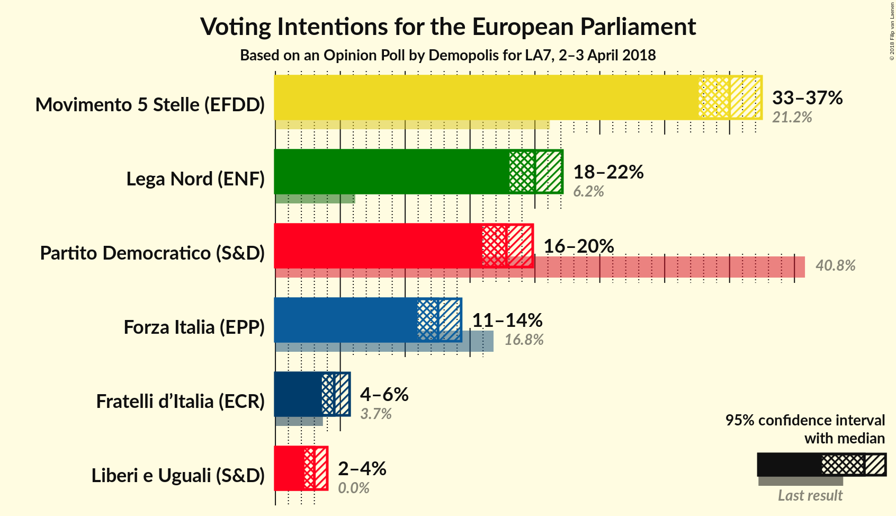

# Opinion Poll by Demopolis for LA7, 2–3 April 2018

<a href="#voting-intentions">Voting Intentions</a> | <a href="#seats">Seats</a> | <a href="#coalitions">Coalitions</a> | <a href="#technical-information">Technical Information</a>

## Voting Intentions

### Confidence Intervals

| Party | Last Result | Poll Result | 80% Confidence Interval | 90% Confidence Interval | 95% Confidence Interval | 99% Confidence Interval |
|:-----:|:-----------:|:-----------:|:-----------------------:|:-----------------------:|:-----------------------:|:-----------------------:|
| Movimento 5 Stelle (EFDD) | 21.2% | 35.0% | 33.4–36.6% |33.0–37.1% |32.6–37.5% |31.9–38.2% |
| Lega Nord (ENF) | 6.2% | 20.0% | 18.7–21.4% |18.4–21.8% |18.0–22.1% |17.5–22.8% |
| Partito Democratico (S&D) | 40.8% | 17.8% | 16.6–19.1% |16.2–19.5% |15.9–19.8% |15.4–20.5% |
| Forza Italia (EPP) | 16.8% | 12.5% | 11.5–13.7% |11.2–14.0% |10.9–14.3% |10.5–14.9% |
| Fratelli d’Italia (ECR) | 3.7% | 4.5% | 3.9–5.3% |3.7–5.5% |3.6–5.7% |3.3–6.1% |
| Liberi e Uguali (S&D) | 0.0% | 3.0% | 2.5–3.7% |2.4–3.8% |2.2–4.0% |2.0–4.3% |

*Note:* The poll result column reflects the actual value used in the calculations. Published results may vary slightly, and in addition be rounded to fewer digits.

## Seats

### Confidence Intervals

| Party | Last Result | Median | 80% Confidence Interval | 90% Confidence Interval | 95% Confidence Interval | 99% Confidence Interval |
|:-----:|:-----------:|:------:|:-----------------------:|:-----------------------:|:-----------------------:|:-----------------------:|
| <a href="#movimento-5-stelle-(efdd)">Movimento 5 Stelle (EFDD)</a> | 17 | 27 | 26–29 |26–29 |25–30 |25–31 |
| <a href="#lega-nord-(enf)">Lega Nord (ENF)</a> | 5 | 16 | 15–17 |14–17 |14–17 |14–18 |
| <a href="#partito-democratico-(s&d)">Partito Democratico (S&D)</a> | 31 | 13 | 12–14 |12–14 |11–15 |11–15 |
| <a href="#forza-italia-(epp)">Forza Italia (EPP)</a> | 13 | 10 | 9–11 |9–11 |9–11 |8–12 |
| <a href="#fratelli-d’italia-(ecr)">Fratelli d’Italia (ECR)</a> | 0 | 4 | 0–4 |0–4 |0–4 |0–5 |
| <a href="#liberi-e-uguali-(s&d)">Liberi e Uguali (S&D)</a> | 0 | 0 | 0 |0 |0 |0–3 |

### Movimento 5 Stelle (EFDD)

*For a full overview of the results for this party, see the [Movimento 5 Stelle (EFDD)](party-movimento5stelleefdd.html) page.*

| Number of Seats | Probability | Accumulated | Special Marks |
|:---------------:|:-----------:|:-----------:|:-------------:|
| 17 | 0% | 100% | Last Result |
| 18 | 0% | 100% |  |
| 19 | 0% | 100% |  |
| 20 | 0% | 100% |  |
| 21 | 0% | 100% |  |
| 22 | 0% | 100% |  |
| 23 | 0% | 100% |  |
| 24 | 0.2% | 100% |  |
| 25 | 3% | 99.8% |  |
| 26 | 15% | 97% |  |
| 27 | 33% | 82% | Median |
| 28 | 32% | 48% |  |
| 29 | 13% | 16% |  |
| 30 | 3% | 4% |  |
| 31 | 0.6% | 0.6% |  |
| 32 | 0% | 0% |  |

### Lega Nord (ENF)

*For a full overview of the results for this party, see the [Lega Nord (ENF)](party-leganordenf.html) page.*

| Number of Seats | Probability | Accumulated | Special Marks |
|:---------------:|:-----------:|:-----------:|:-------------:|
| 5 | 0% | 100% | Last Result |
| 6 | 0% | 100% |  |
| 7 | 0% | 100% |  |
| 8 | 0% | 100% |  |
| 9 | 0% | 100% |  |
| 10 | 0% | 100% |  |
| 11 | 0% | 100% |  |
| 12 | 0% | 100% |  |
| 13 | 0.3% | 100% |  |
| 14 | 7% | 99.7% |  |
| 15 | 33% | 93% |  |
| 16 | 42% | 60% | Median |
| 17 | 16% | 19% |  |
| 18 | 2% | 2% |  |
| 19 | 0.1% | 0.1% |  |
| 20 | 0% | 0% |  |

### Partito Democratico (S&D)

*For a full overview of the results for this party, see the [Partito Democratico (S&D)](party-partitodemocraticosd.html) page.*

| Number of Seats | Probability | Accumulated | Special Marks |
|:---------------:|:-----------:|:-----------:|:-------------:|
| 10 | 0.1% | 100% |  |
| 11 | 3% | 99.9% |  |
| 12 | 25% | 97% |  |
| 13 | 45% | 72% | Median |
| 14 | 23% | 27% |  |
| 15 | 4% | 4% |  |
| 16 | 0.2% | 0.2% |  |
| 17 | 0% | 0% |  |
| 18 | 0% | 0% |  |
| 19 | 0% | 0% |  |
| 20 | 0% | 0% |  |
| 21 | 0% | 0% |  |
| 22 | 0% | 0% |  |
| 23 | 0% | 0% |  |
| 24 | 0% | 0% |  |
| 25 | 0% | 0% |  |
| 26 | 0% | 0% |  |
| 27 | 0% | 0% |  |
| 28 | 0% | 0% |  |
| 29 | 0% | 0% |  |
| 30 | 0% | 0% |  |
| 31 | 0% | 0% | Last Result |

### Forza Italia (EPP)

*For a full overview of the results for this party, see the [Forza Italia (EPP)](party-forzaitaliaepp.html) page.*

| Number of Seats | Probability | Accumulated | Special Marks |
|:---------------:|:-----------:|:-----------:|:-------------:|
| 8 | 2% | 100% |  |
| 9 | 29% | 98% |  |
| 10 | 52% | 69% | Median |
| 11 | 16% | 18% |  |
| 12 | 1.2% | 1.3% |  |
| 13 | 0% | 0% | Last Result |

### Fratelli d’Italia (ECR)

*For a full overview of the results for this party, see the [Fratelli d’Italia (ECR)](party-fratellid’italiaecr.html) page.*

| Number of Seats | Probability | Accumulated | Special Marks |
|:---------------:|:-----------:|:-----------:|:-------------:|
| 0 | 13% | 100% | Last Result |
| 1 | 0% | 87% |  |
| 2 | 0% | 87% |  |
| 3 | 31% | 87% |  |
| 4 | 54% | 56% | Median |
| 5 | 2% | 2% |  |
| 6 | 0% | 0% |  |

### Liberi e Uguali (S&D)

*For a full overview of the results for this party, see the [Liberi e Uguali (S&D)](party-liberieugualisd.html) page.*

| Number of Seats | Probability | Accumulated | Special Marks |
|:---------------:|:-----------:|:-----------:|:-------------:|
| 0 | 98% | 100% | Last Result, Median |
| 1 | 0% | 2% |  |
| 2 | 0% | 2% |  |
| 3 | 2% | 2% |  |
| 4 | 0.2% | 0.2% |  |
| 5 | 0% | 0% |  |

## Coalitions

### Confidence Intervals

| Coalition | Last Result | Median | Majority? | 80% Confidence Interval | 90% Confidence Interval | 95% Confidence Interval | 99% Confidence Interval |
|:---------:|:-----------:|:------:|:---------:|:-----------------------:|:-----------------------:|:-----------------------:|:-----------------------:|
| Movimento 5 Stelle (EFDD) | 17 | 27 | 0% | 26–29 | 26–29 | 25–30 | 25–31 |
| Lega Nord (ENF) | 5 | 16 | 0% | 15–17 | 14–17 | 14–17 | 14–18 |
| Partito Democratico (S&D) – Liberi e Uguali (S&D) | 31 | 13 | 0% | 12–14 | 12–15 | 11–15 | 11–16 |

### Movimento 5 Stelle (EFDD)

| Number of Seats | Probability | Accumulated | Special Marks |
|:---------------:|:-----------:|:-----------:|:-------------:|
| 17 | 0% | 100% | Last Result |
| 18 | 0% | 100% |  |
| 19 | 0% | 100% |  |
| 20 | 0% | 100% |  |
| 21 | 0% | 100% |  |
| 22 | 0% | 100% |  |
| 23 | 0% | 100% |  |
| 24 | 0.2% | 100% |  |
| 25 | 3% | 99.8% |  |
| 26 | 15% | 97% |  |
| 27 | 33% | 82% | Median |
| 28 | 32% | 48% |  |
| 29 | 13% | 16% |  |
| 30 | 3% | 4% |  |
| 31 | 0.6% | 0.6% |  |
| 32 | 0% | 0% |  |

### Lega Nord (ENF)

| Number of Seats | Probability | Accumulated | Special Marks |
|:---------------:|:-----------:|:-----------:|:-------------:|
| 5 | 0% | 100% | Last Result |
| 6 | 0% | 100% |  |
| 7 | 0% | 100% |  |
| 8 | 0% | 100% |  |
| 9 | 0% | 100% |  |
| 10 | 0% | 100% |  |
| 11 | 0% | 100% |  |
| 12 | 0% | 100% |  |
| 13 | 0.3% | 100% |  |
| 14 | 7% | 99.7% |  |
| 15 | 33% | 93% |  |
| 16 | 42% | 60% | Median |
| 17 | 16% | 19% |  |
| 18 | 2% | 2% |  |
| 19 | 0.1% | 0.1% |  |
| 20 | 0% | 0% |  |

### Partito Democratico (S&D) – Liberi e Uguali (S&D)

| Number of Seats | Probability | Accumulated | Special Marks |
|:---------------:|:-----------:|:-----------:|:-------------:|
| 11 | 3% | 100% |  |
| 12 | 24% | 97% |  |
| 13 | 44% | 73% | Median |
| 14 | 23% | 29% |  |
| 15 | 4% | 6% |  |
| 16 | 1.0% | 1.3% |  |
| 17 | 0.2% | 0.3% |  |
| 18 | 0% | 0% |  |
| 19 | 0% | 0% |  |
| 20 | 0% | 0% |  |
| 21 | 0% | 0% |  |
| 22 | 0% | 0% |  |
| 23 | 0% | 0% |  |
| 24 | 0% | 0% |  |
| 25 | 0% | 0% |  |
| 26 | 0% | 0% |  |
| 27 | 0% | 0% |  |
| 28 | 0% | 0% |  |
| 29 | 0% | 0% |  |
| 30 | 0% | 0% |  |
| 31 | 0% | 0% | Last Result |

## Technical Information

### Opinion Poll

+ **Polling firm:** Demopolis
+ **Commissioner(s):** LA7
+ **Fieldwork period:** 2–3 April 2018

### Calculations

+ **Sample size:** 1500
+ **Simulations done:** 1,048,576
+ **Error estimate:** 0.62%

