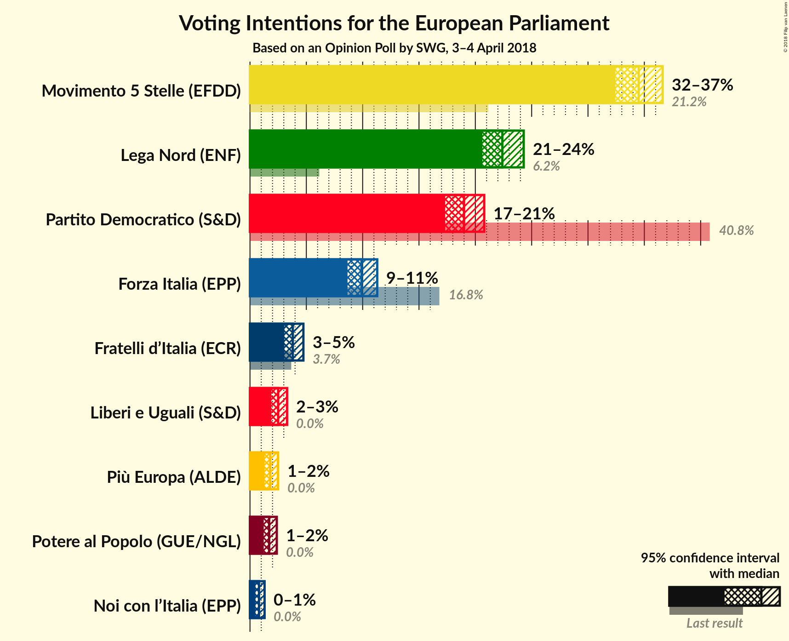
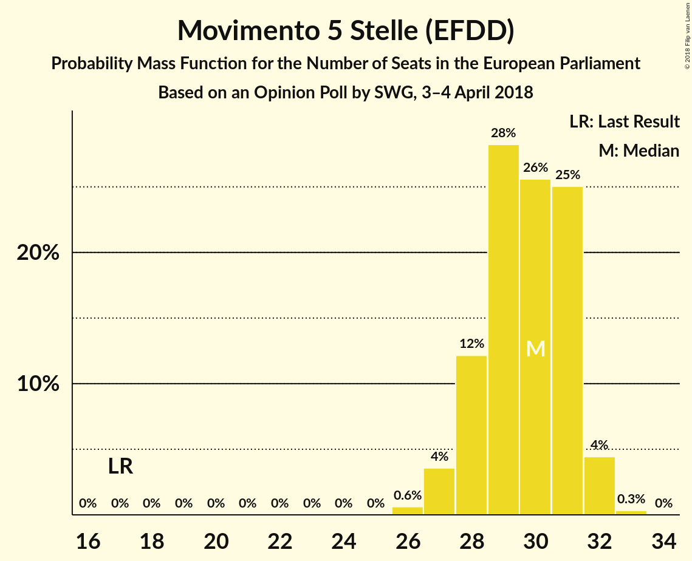
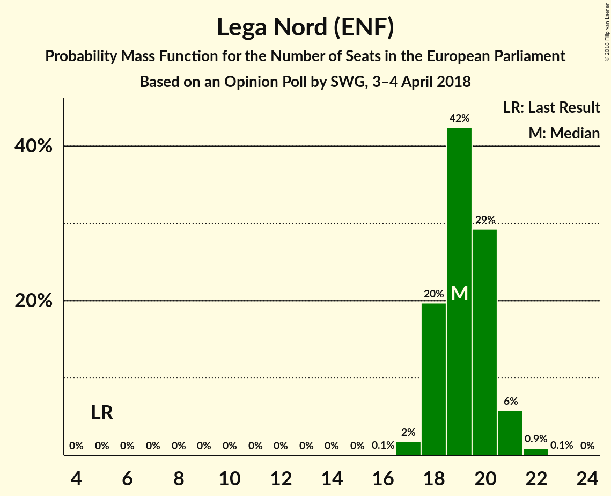
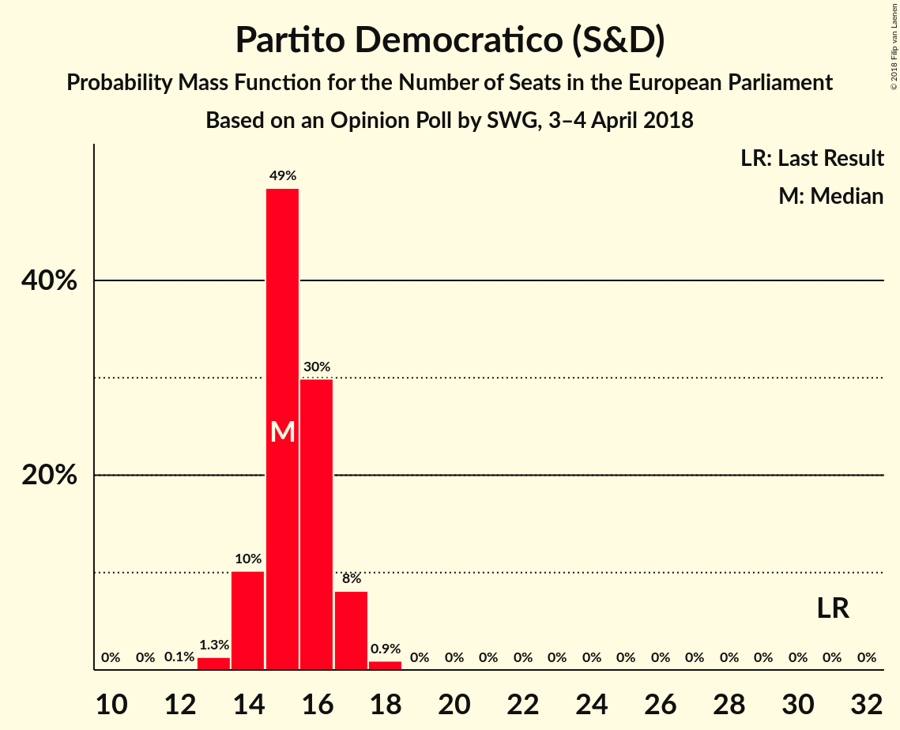
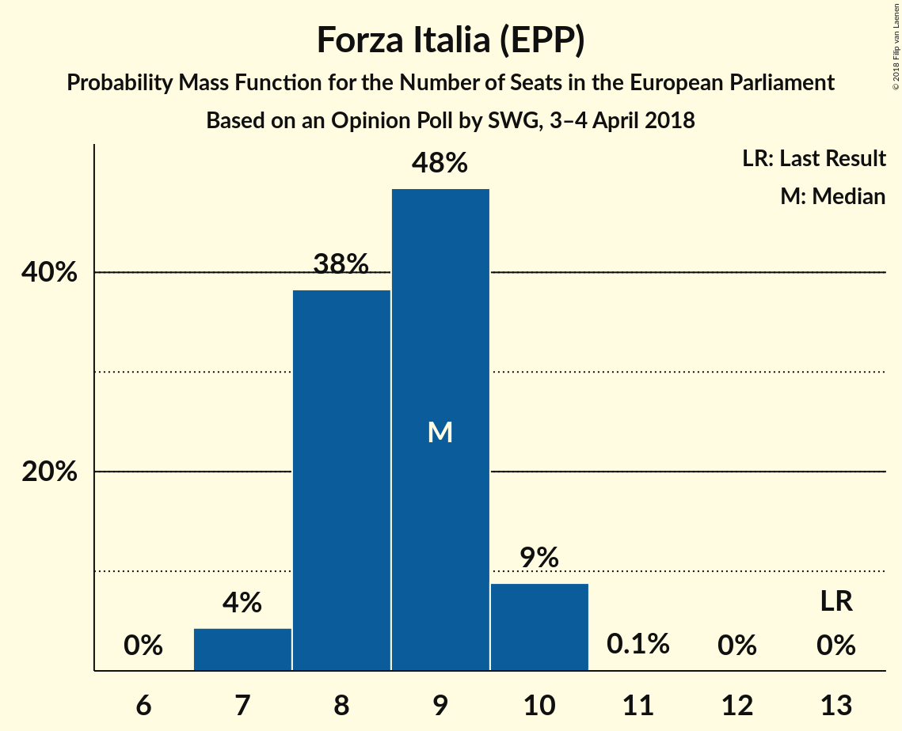

# Opinion Poll by SWG, 3–4 April 2018

<a href="#voting-intentions">Voting Intentions</a> | <a href="#seats">Seats</a> | <a href="#coalitions">Coalitions</a> | <a href="#technical-information">Technical Information</a>

## Voting Intentions

### Confidence Intervals

| Party | Last Result | Poll Result | 80% Confidence Interval | 90% Confidence Interval | 95% Confidence Interval | 99% Confidence Interval |
|:-----:|:-----------:|:-----------:|:-----------------------:|:-----------------------:|:-----------------------:|:-----------------------:|
| Movimento 5 Stelle (EFDD) | 21.1% | 34.5% | 33.2–35.9% |32.8–36.3% |32.4–36.6% |31.8–37.3% |
| Lega Nord (ENF) | 6.2% | 22.4% | 21.2–23.6% |20.9–24.0% |20.6–24.3% |20.1–24.9% |
| Partito Democratico (S&D) | 40.8% | 19.0% | 17.9–20.2% |17.6–20.5% |17.3–20.8% |16.8–21.4% |
| Forza Italia (EPP) | 16.8% | 9.9% | 9.1–10.8% |8.9–11.1% |8.7–11.3% |8.3–11.8% |
| Fratelli d’Italia (*) | 3.7% | 3.8% | 3.3–4.4% |3.2–4.6% |3.0–4.7% |2.8–5.0% |
| Liberi e Uguali (S&D) | 0.0% | 2.5% | 2.1–3.0% |2.0–3.2% |1.9–3.3% |1.7–3.6% |
| Più Europa (ALDE) | 0.0% | 1.8% | 1.5–2.3% |1.4–2.4% |1.3–2.5% |1.2–2.7% |
| Potere al Popolo (GUE/NGL) | 0.0% | 1.7% | 1.4–2.1% |1.3–2.3% |1.2–2.4% |1.1–2.6% |
| Noi con l’Italia (EPP) | 0.0% | 0.8% | 0.6–1.1% |0.5–1.2% |0.5–1.3% |0.4–1.5% |

*Note:* The poll result column reflects the actual value used in the calculations. Published results may vary slightly, and in addition be rounded to fewer digits.

## Seats

### Confidence Intervals

| Party | Last Result | Median | 80% Confidence Interval | 90% Confidence Interval | 95% Confidence Interval | 99% Confidence Interval |
|:-----:|:-----------:|:------:|:-----------------------:|:-----------------------:|:-----------------------:|:-----------------------:|
| <a href="#movimento-5-stelle-(efdd)">Movimento 5 Stelle (EFDD)</a> | 17 | 30 | 28–31 |28–31 |27–32 |26–32 |
| <a href="#lega-nord-(enf)">Lega Nord (ENF)</a> | 5 | 19 | 18–20 |18–21 |18–21 |17–22 |
| <a href="#partito-democratico-(s&d)">Partito Democratico (S&D)</a> | 31 | 15 | 14–16 |14–17 |14–17 |13–18 |
| <a href="#forza-italia-(epp)">Forza Italia (EPP)</a> | 13 | 9 | 8–9 |8–10 |7–10 |7–10 |
| <a href="#fratelli-d’italia-(*)">Fratelli d’Italia (*)</a> | 0 | 0 | 0–4 |0–4 |0–4 |0–4 |
| <a href="#liberi-e-uguali-(s&d)">Liberi e Uguali (S&D)</a> | 0 | 0 | 0 |0 |0 |0 |
| <a href="#più-europa-(alde)">Più Europa (ALDE)</a> | 0 | 0 | 0 |0 |0 |0 |
| <a href="#potere-al-popolo-(gue/ngl)">Potere al Popolo (GUE/NGL)</a> | 0 | 0 | 0 |0 |0 |0 |
| <a href="#noi-con-l’italia-(epp)">Noi con l’Italia (EPP)</a> | 0 | 0 | 0 |0 |0 |0 |

### Movimento 5 Stelle (EFDD)

*For a full overview of the results for this party, see the [Movimento 5 Stelle (EFDD)](party-movimento5stelleefdd.html) page.*

| Number of Seats | Probability | Accumulated | Special Marks |
|:---------------:|:-----------:|:-----------:|:-------------:|
| 17 | 0% | 100% | Last Result |
| 18 | 0% | 100% |  |
| 19 | 0% | 100% |  |
| 20 | 0% | 100% |  |
| 21 | 0% | 100% |  |
| 22 | 0% | 100% |  |
| 23 | 0% | 100% |  |
| 24 | 0% | 100% |  |
| 25 | 0% | 100% |  |
| 26 | 0.6% | 100% |  |
| 27 | 4% | 99.4% |  |
| 28 | 12% | 96% |  |
| 29 | 28% | 84% |  |
| 30 | 26% | 55% | Median |
| 31 | 25% | 30% |  |
| 32 | 4% | 5% |  |
| 33 | 0.3% | 0.3% |  |
| 34 | 0% | 0% |  |

### Lega Nord (ENF)

*For a full overview of the results for this party, see the [Lega Nord (ENF)](party-leganordenf.html) page.*

| Number of Seats | Probability | Accumulated | Special Marks |
|:---------------:|:-----------:|:-----------:|:-------------:|
| 5 | 0% | 100% | Last Result |
| 6 | 0% | 100% |  |
| 7 | 0% | 100% |  |
| 8 | 0% | 100% |  |
| 9 | 0% | 100% |  |
| 10 | 0% | 100% |  |
| 11 | 0% | 100% |  |
| 12 | 0% | 100% |  |
| 13 | 0% | 100% |  |
| 14 | 0% | 100% |  |
| 15 | 0% | 100% |  |
| 16 | 0.1% | 100% |  |
| 17 | 2% | 99.9% |  |
| 18 | 20% | 98% |  |
| 19 | 42% | 78% | Median |
| 20 | 29% | 36% |  |
| 21 | 6% | 7% |  |
| 22 | 0.9% | 1.0% |  |
| 23 | 0.1% | 0.1% |  |
| 24 | 0% | 0% |  |

### Partito Democratico (S&D)

*For a full overview of the results for this party, see the [Partito Democratico (S&D)](party-partitodemocraticosd.html) page.*

| Number of Seats | Probability | Accumulated | Special Marks |
|:---------------:|:-----------:|:-----------:|:-------------:|
| 12 | 0.1% | 100% |  |
| 13 | 1.3% | 99.9% |  |
| 14 | 10% | 98.6% |  |
| 15 | 49% | 88% | Median |
| 16 | 30% | 39% |  |
| 17 | 8% | 9% |  |
| 18 | 0.9% | 0.9% |  |
| 19 | 0% | 0% |  |
| 20 | 0% | 0% |  |
| 21 | 0% | 0% |  |
| 22 | 0% | 0% |  |
| 23 | 0% | 0% |  |
| 24 | 0% | 0% |  |
| 25 | 0% | 0% |  |
| 26 | 0% | 0% |  |
| 27 | 0% | 0% |  |
| 28 | 0% | 0% |  |
| 29 | 0% | 0% |  |
| 30 | 0% | 0% |  |
| 31 | 0% | 0% | Last Result |

### Forza Italia (EPP)

*For a full overview of the results for this party, see the [Forza Italia (EPP)](party-forzaitaliaepp.html) page.*

| Number of Seats | Probability | Accumulated | Special Marks |
|:---------------:|:-----------:|:-----------:|:-------------:|
| 7 | 4% | 100% |  |
| 8 | 38% | 96% |  |
| 9 | 48% | 57% | Median |
| 10 | 9% | 9% |  |
| 11 | 0.1% | 0.1% |  |
| 12 | 0% | 0% |  |
| 13 | 0% | 0% | Last Result |

### Fratelli d’Italia (*)

*For a full overview of the results for this party, see the [Fratelli d’Italia (*)](party-fratellid’italia.html) page.*

| Number of Seats | Probability | Accumulated | Special Marks |
|:---------------:|:-----------:|:-----------:|:-------------:|
| 0 | 68% | 100% | Last Result, Median |
| 1 | 0% | 32% |  |
| 2 | 0% | 32% |  |
| 3 | 10% | 32% |  |
| 4 | 22% | 23% |  |
| 5 | 0.1% | 0.1% |  |
| 6 | 0% | 0% |  |

### Liberi e Uguali (S&D)

*For a full overview of the results for this party, see the [Liberi e Uguali (S&D)](party-liberieugualisd.html) page.*

| Number of Seats | Probability | Accumulated | Special Marks |
|:---------------:|:-----------:|:-----------:|:-------------:|
| 0 | 100% | 100% | Last Result, Median |

### Più Europa (ALDE)

*For a full overview of the results for this party, see the [Più Europa (ALDE)](party-piùeuropaalde.html) page.*

| Number of Seats | Probability | Accumulated | Special Marks |
|:---------------:|:-----------:|:-----------:|:-------------:|
| 0 | 100% | 100% | Last Result, Median |

### Potere al Popolo (GUE/NGL)

*For a full overview of the results for this party, see the [Potere al Popolo (GUE/NGL)](party-poterealpopologuengl.html) page.*

| Number of Seats | Probability | Accumulated | Special Marks |
|:---------------:|:-----------:|:-----------:|:-------------:|
| 0 | 100% | 100% | Last Result, Median |

### Noi con l’Italia (EPP)

*For a full overview of the results for this party, see the [Noi con l’Italia (EPP)](party-noiconl’italiaepp.html) page.*

| Number of Seats | Probability | Accumulated | Special Marks |
|:---------------:|:-----------:|:-----------:|:-------------:|
| 0 | 100% | 100% | Last Result, Median |

## Coalitions

### Confidence Intervals

| Coalition | Last Result | Median | Majority? | 80% Confidence Interval | 90% Confidence Interval | 95% Confidence Interval | 99% Confidence Interval |
|:---------:|:-----------:|:------:|:---------:|:-----------------------:|:-----------------------:|:-----------------------:|:-----------------------:|
| Movimento 5 Stelle (EFDD) | 17 | 30 | 0% | 28–31 | 28–31 | 27–32 | 26–32 |
| Lega Nord (ENF) | 5 | 19 | 0% | 18–20 | 18–21 | 18–21 | 17–22 |
| Partito Democratico (S&D) – Liberi e Uguali (S&D) | 31 | 15 | 0% | 14–16 | 14–17 | 14–17 | 13–18 |
| Più Europa (ALDE) | 0 | 0 | 0% | 0 | 0 | 0 | 0 |
| Potere al Popolo (GUE/NGL) | 0 | 0 | 0% | 0 | 0 | 0 | 0 |

### Movimento 5 Stelle (EFDD)

| Number of Seats | Probability | Accumulated | Special Marks |
|:---------------:|:-----------:|:-----------:|:-------------:|
| 17 | 0% | 100% | Last Result |
| 18 | 0% | 100% |  |
| 19 | 0% | 100% |  |
| 20 | 0% | 100% |  |
| 21 | 0% | 100% |  |
| 22 | 0% | 100% |  |
| 23 | 0% | 100% |  |
| 24 | 0% | 100% |  |
| 25 | 0% | 100% |  |
| 26 | 0.6% | 100% |  |
| 27 | 4% | 99.4% |  |
| 28 | 12% | 96% |  |
| 29 | 28% | 84% |  |
| 30 | 26% | 55% | Median |
| 31 | 25% | 30% |  |
| 32 | 4% | 5% |  |
| 33 | 0.3% | 0.3% |  |
| 34 | 0% | 0% |  |

### Lega Nord (ENF)

| Number of Seats | Probability | Accumulated | Special Marks |
|:---------------:|:-----------:|:-----------:|:-------------:|
| 5 | 0% | 100% | Last Result |
| 6 | 0% | 100% |  |
| 7 | 0% | 100% |  |
| 8 | 0% | 100% |  |
| 9 | 0% | 100% |  |
| 10 | 0% | 100% |  |
| 11 | 0% | 100% |  |
| 12 | 0% | 100% |  |
| 13 | 0% | 100% |  |
| 14 | 0% | 100% |  |
| 15 | 0% | 100% |  |
| 16 | 0.1% | 100% |  |
| 17 | 2% | 99.9% |  |
| 18 | 20% | 98% |  |
| 19 | 42% | 78% | Median |
| 20 | 29% | 36% |  |
| 21 | 6% | 7% |  |
| 22 | 0.9% | 1.0% |  |
| 23 | 0.1% | 0.1% |  |
| 24 | 0% | 0% |  |

### Partito Democratico (S&D) – Liberi e Uguali (S&D)

| Number of Seats | Probability | Accumulated | Special Marks |
|:---------------:|:-----------:|:-----------:|:-------------:|
| 12 | 0.1% | 100% |  |
| 13 | 1.3% | 99.9% |  |
| 14 | 10% | 98.6% |  |
| 15 | 49% | 88% | Median |
| 16 | 30% | 39% |  |
| 17 | 8% | 9% |  |
| 18 | 0.9% | 1.0% |  |
| 19 | 0% | 0% |  |
| 20 | 0% | 0% |  |
| 21 | 0% | 0% |  |
| 22 | 0% | 0% |  |
| 23 | 0% | 0% |  |
| 24 | 0% | 0% |  |
| 25 | 0% | 0% |  |
| 26 | 0% | 0% |  |
| 27 | 0% | 0% |  |
| 28 | 0% | 0% |  |
| 29 | 0% | 0% |  |
| 30 | 0% | 0% |  |
| 31 | 0% | 0% | Last Result |

### Più Europa (ALDE)

| Number of Seats | Probability | Accumulated | Special Marks |
|:---------------:|:-----------:|:-----------:|:-------------:|
| 0 | 100% | 100% | Last Result, Median |

### Potere al Popolo (GUE/NGL)

| Number of Seats | Probability | Accumulated | Special Marks |
|:---------------:|:-----------:|:-----------:|:-------------:|
| 0 | 100% | 100% | Last Result, Median |

## Technical Information

### Opinion Poll

+ **Polling firm:** SWG
+ **Commissioner(s):** —
+ **Fieldwork period:** 3–4 April 2018

### Calculations

+ **Sample size:** 2000
+ **Simulations done:** 1,048,576
+ **Error estimate:** 0.91%

