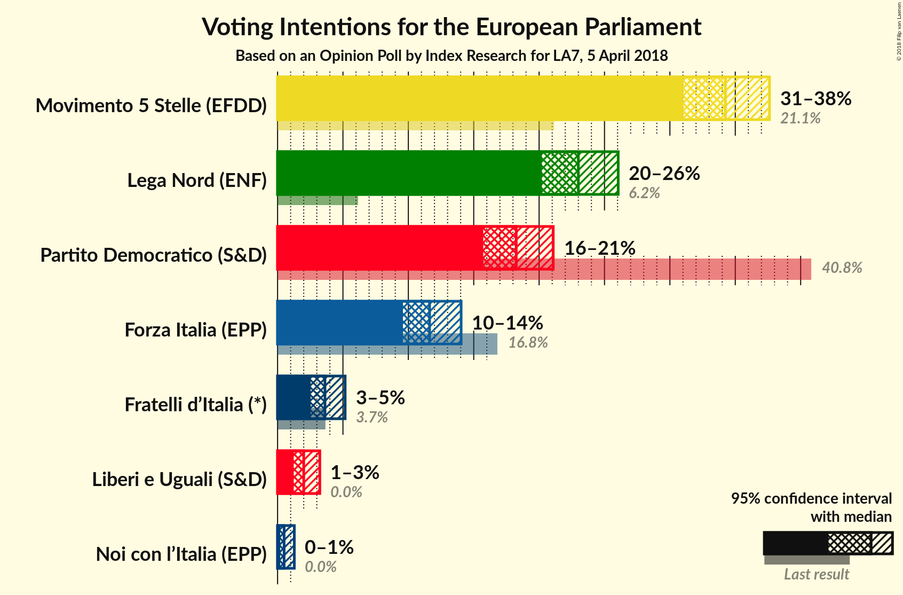
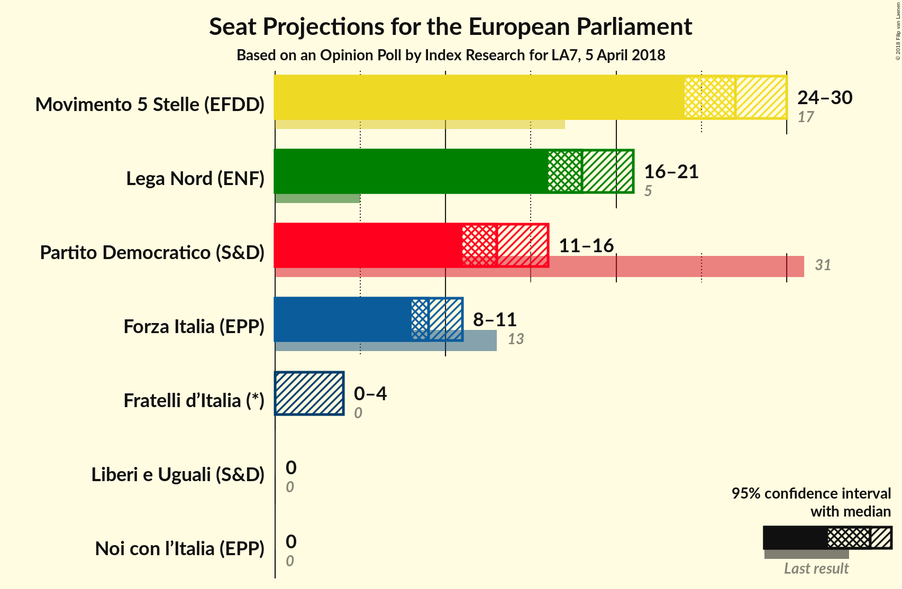
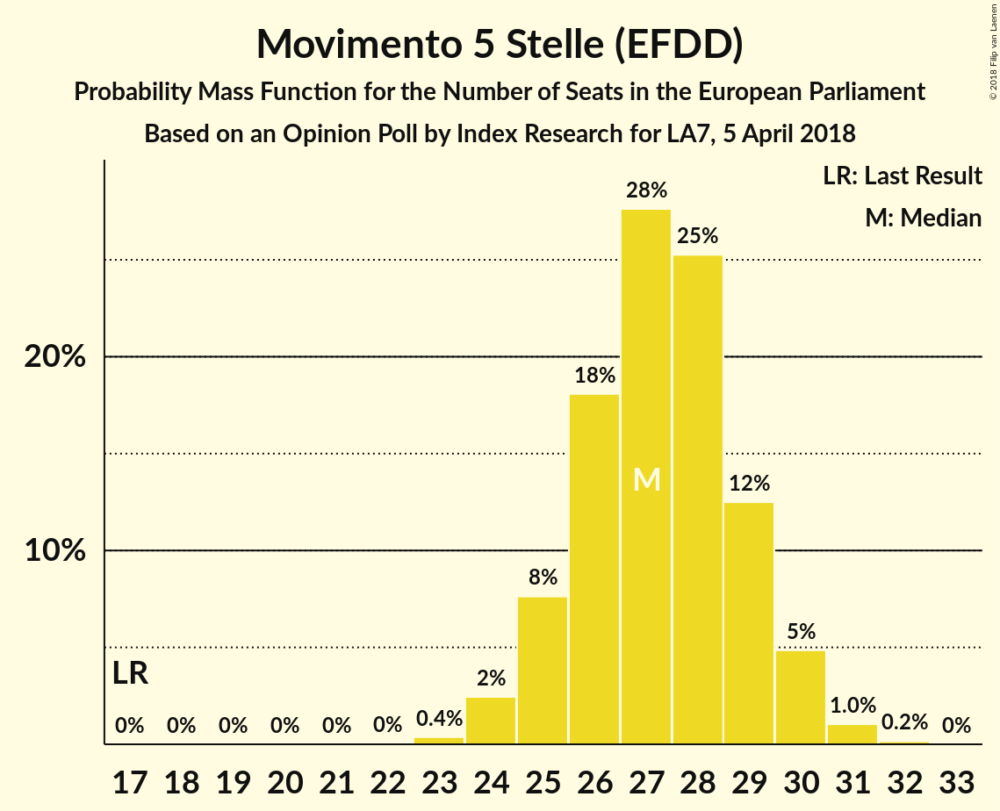
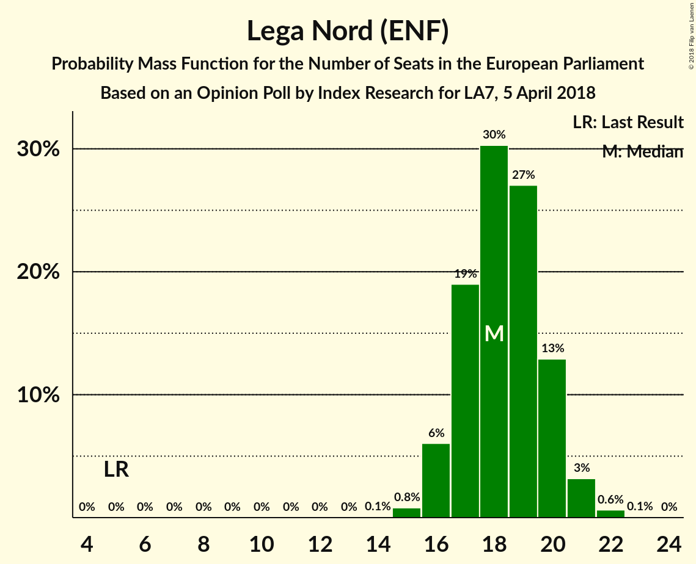
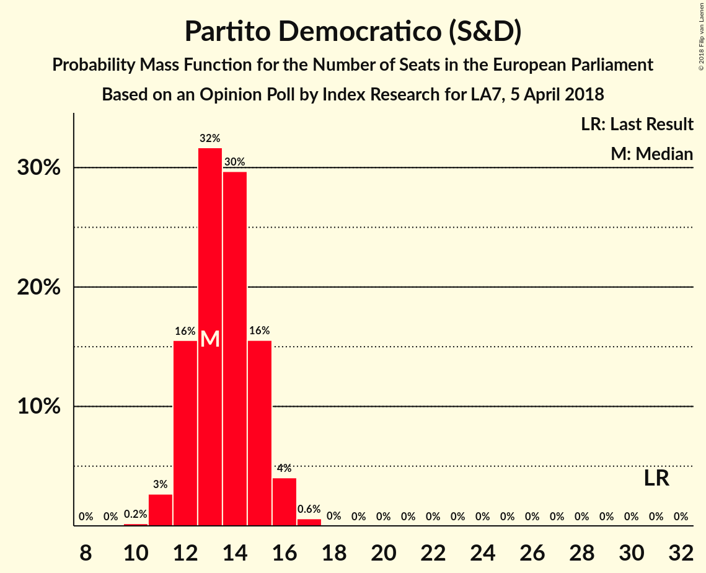
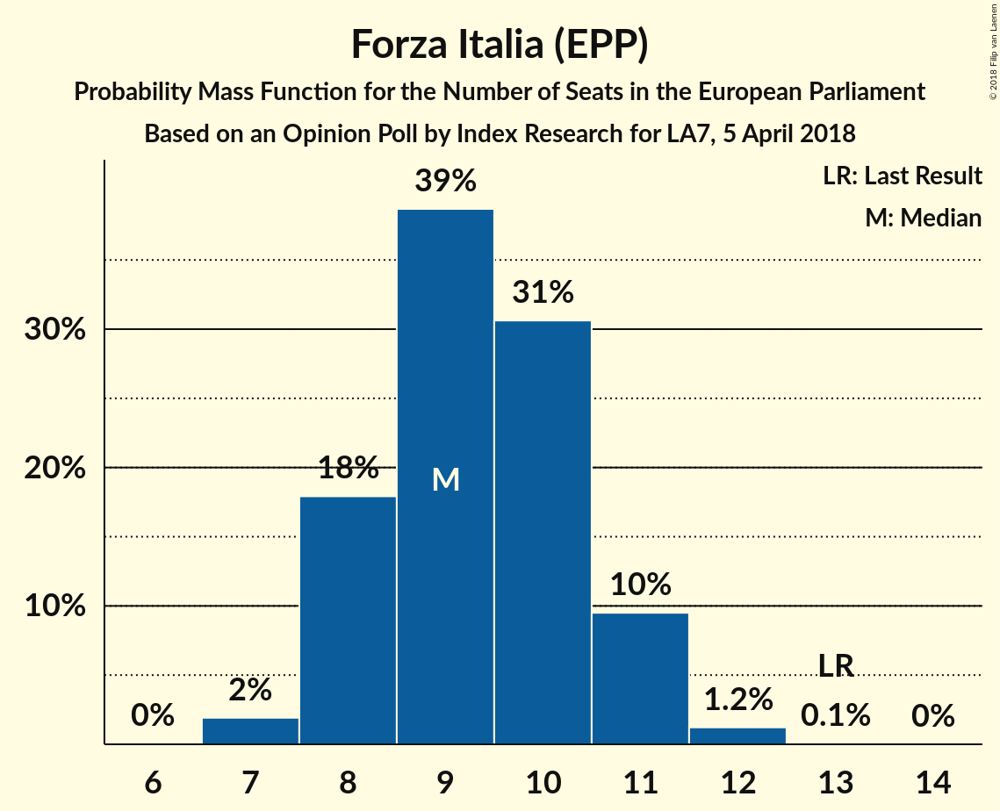
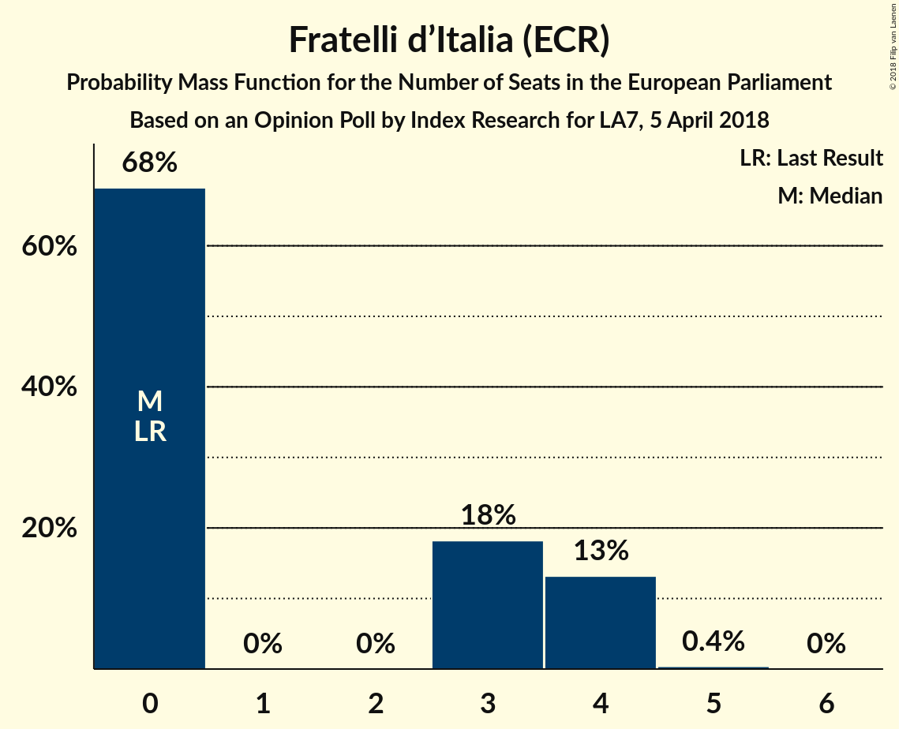
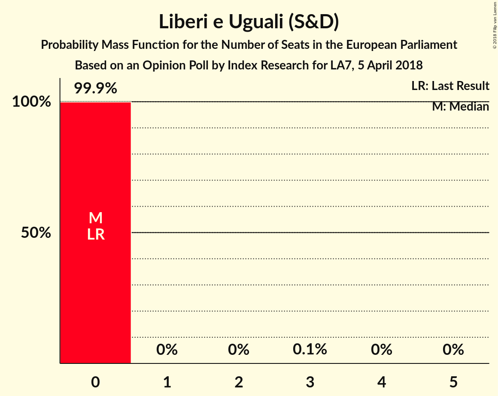
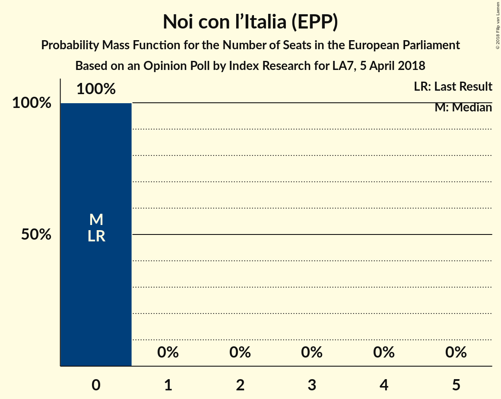
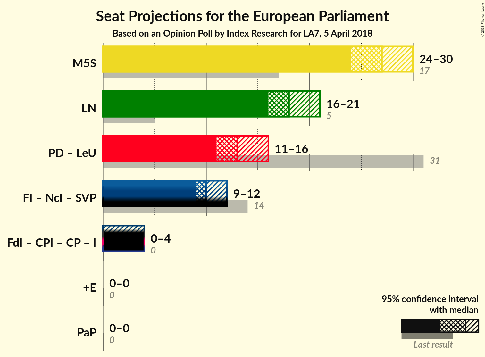

# Opinion Poll by Index Research for LA7, 5 April 2018

<a href="#voting-intentions">Voting Intentions</a> | <a href="#seats">Seats</a> | <a href="#coalitions">Coalitions</a> | <a href="#technical-information">Technical Information</a>

## Voting Intentions

### Confidence Intervals

| Party | Last Result | Poll Result | 80% Confidence Interval | 90% Confidence Interval | 95% Confidence Interval | 99% Confidence Interval |
|:-----:|:-----------:|:-----------:|:-----------------------:|:-----------------------:|:-----------------------:|:-----------------------:|
| Movimento 5 Stelle (EFDD) | 21.2% | 34.2% | 32.1–36.5% |31.6–37.1% |31.0–37.6% |30.0–38.7% |
| Lega Nord (ENF) | 6.2% | 23.0% | 21.2–25.0% |20.7–25.6% |20.2–26.0% |19.4–27.0% |
| Partito Democratico (S&D) | 40.8% | 18.2% | 16.6–20.1% |16.1–20.6% |15.7–21.1% |15.0–22.0% |
| Forza Italia (EPP) | 16.8% | 11.6% | 10.3–13.2% |9.9–13.6% |9.6–14.0% |9.0–14.8% |
| Fratelli d’Italia (ECR) | 3.7% | 3.6% | 2.9–4.6% |2.7–4.9% |2.5–5.2% |2.2–5.7% |
| Liberi e Uguali (S&D) | 0.0% | 2.0% | 1.5–2.8% |1.4–3.0% |1.2–3.2% |1.0–3.7% |
| Noi con l’Italia (EPP) | 0.0% | 0.5% | 0.3–1.0% |0.2–1.1% |0.2–1.3% |0.1–1.6% |

*Note:* The poll result column reflects the actual value used in the calculations. Published results may vary slightly, and in addition be rounded to fewer digits.

## Seats

### Confidence Intervals

| Party | Last Result | Median | 80% Confidence Interval | 90% Confidence Interval | 95% Confidence Interval | 99% Confidence Interval |
|:-----:|:-----------:|:------:|:-----------------------:|:-----------------------:|:-----------------------:|:-----------------------:|
| <a href="#movimento-5-stelle-(efdd)">Movimento 5 Stelle (EFDD)</a> | 17 | 27 | 25–29 |25–30 |24–30 |24–31 |
| <a href="#lega-nord-(enf)">Lega Nord (ENF)</a> | 5 | 18 | 17–20 |16–20 |16–21 |15–22 |
| <a href="#partito-democratico-(s&d)">Partito Democratico (S&D)</a> | 31 | 13 | 12–15 |12–15 |11–16 |11–17 |
| <a href="#forza-italia-(epp)">Forza Italia (EPP)</a> | 13 | 9 | 8–11 |8–11 |8–11 |7–12 |
| <a href="#fratelli-d’italia-(ecr)">Fratelli d’Italia (ECR)</a> | 0 | 0 | 0–4 |0–4 |0–4 |0–4 |
| <a href="#liberi-e-uguali-(s&d)">Liberi e Uguali (S&D)</a> | 0 | 0 | 0 |0 |0 |0 |
| <a href="#noi-con-l’italia-(epp)">Noi con l’Italia (EPP)</a> | 0 | 0 | 0 |0 |0 |0 |

### Movimento 5 Stelle (EFDD)

*For a full overview of the results for this party, see the [Movimento 5 Stelle (EFDD)](party-movimento5stelleefdd.html) page.*

| Number of Seats | Probability | Accumulated | Special Marks |
|:---------------:|:-----------:|:-----------:|:-------------:|
| 17 | 0% | 100% | Last Result |
| 18 | 0% | 100% |  |
| 19 | 0% | 100% |  |
| 20 | 0% | 100% |  |
| 21 | 0% | 100% |  |
| 22 | 0% | 100% |  |
| 23 | 0.4% | 100% |  |
| 24 | 2% | 99.6% |  |
| 25 | 8% | 97% |  |
| 26 | 18% | 90% |  |
| 27 | 28% | 71% | Median |
| 28 | 25% | 44% |  |
| 29 | 12% | 19% |  |
| 30 | 5% | 6% |  |
| 31 | 1.0% | 1.2% |  |
| 32 | 0.2% | 0.2% |  |
| 33 | 0% | 0% |  |

### Lega Nord (ENF)

*For a full overview of the results for this party, see the [Lega Nord (ENF)](party-leganordenf.html) page.*

| Number of Seats | Probability | Accumulated | Special Marks |
|:---------------:|:-----------:|:-----------:|:-------------:|
| 5 | 0% | 100% | Last Result |
| 6 | 0% | 100% |  |
| 7 | 0% | 100% |  |
| 8 | 0% | 100% |  |
| 9 | 0% | 100% |  |
| 10 | 0% | 100% |  |
| 11 | 0% | 100% |  |
| 12 | 0% | 100% |  |
| 13 | 0% | 100% |  |
| 14 | 0.1% | 100% |  |
| 15 | 0.8% | 99.9% |  |
| 16 | 6% | 99.1% |  |
| 17 | 19% | 93% |  |
| 18 | 30% | 74% | Median |
| 19 | 27% | 44% |  |
| 20 | 13% | 17% |  |
| 21 | 3% | 4% |  |
| 22 | 0.6% | 0.7% |  |
| 23 | 0.1% | 0.1% |  |
| 24 | 0% | 0% |  |

### Partito Democratico (S&D)

*For a full overview of the results for this party, see the [Partito Democratico (S&D)](party-partitodemocraticosd.html) page.*

| Number of Seats | Probability | Accumulated | Special Marks |
|:---------------:|:-----------:|:-----------:|:-------------:|
| 10 | 0.2% | 100% |  |
| 11 | 3% | 99.8% |  |
| 12 | 16% | 97% |  |
| 13 | 32% | 82% | Median |
| 14 | 30% | 50% |  |
| 15 | 16% | 20% |  |
| 16 | 4% | 5% |  |
| 17 | 0.6% | 0.7% |  |
| 18 | 0% | 0% |  |
| 19 | 0% | 0% |  |
| 20 | 0% | 0% |  |
| 21 | 0% | 0% |  |
| 22 | 0% | 0% |  |
| 23 | 0% | 0% |  |
| 24 | 0% | 0% |  |
| 25 | 0% | 0% |  |
| 26 | 0% | 0% |  |
| 27 | 0% | 0% |  |
| 28 | 0% | 0% |  |
| 29 | 0% | 0% |  |
| 30 | 0% | 0% |  |
| 31 | 0% | 0% | Last Result |

### Forza Italia (EPP)

*For a full overview of the results for this party, see the [Forza Italia (EPP)](party-forzaitaliaepp.html) page.*

| Number of Seats | Probability | Accumulated | Special Marks |
|:---------------:|:-----------:|:-----------:|:-------------:|
| 7 | 2% | 100% |  |
| 8 | 18% | 98% |  |
| 9 | 39% | 80% | Median |
| 10 | 31% | 41% |  |
| 11 | 10% | 11% |  |
| 12 | 1.2% | 1.3% |  |
| 13 | 0.1% | 0.1% | Last Result |
| 14 | 0% | 0% |  |

### Fratelli d’Italia (ECR)

*For a full overview of the results for this party, see the [Fratelli d’Italia (ECR)](party-fratellid’italiaecr.html) page.*

| Number of Seats | Probability | Accumulated | Special Marks |
|:---------------:|:-----------:|:-----------:|:-------------:|
| 0 | 68% | 100% | Last Result, Median |
| 1 | 0% | 32% |  |
| 2 | 0% | 32% |  |
| 3 | 18% | 32% |  |
| 4 | 13% | 14% |  |
| 5 | 0.4% | 0.4% |  |
| 6 | 0% | 0% |  |

### Liberi e Uguali (S&D)

*For a full overview of the results for this party, see the [Liberi e Uguali (S&D)](party-liberieugualisd.html) page.*

| Number of Seats | Probability | Accumulated | Special Marks |
|:---------------:|:-----------:|:-----------:|:-------------:|
| 0 | 99.9% | 100% | Last Result, Median |
| 1 | 0% | 0.1% |  |
| 2 | 0% | 0.1% |  |
| 3 | 0.1% | 0.1% |  |
| 4 | 0% | 0% |  |

### Noi con l’Italia (EPP)

*For a full overview of the results for this party, see the [Noi con l’Italia (EPP)](party-noiconl’italiaepp.html) page.*

| Number of Seats | Probability | Accumulated | Special Marks |
|:---------------:|:-----------:|:-----------:|:-------------:|
| 0 | 100% | 100% | Last Result, Median |

## Coalitions

### Confidence Intervals

| Coalition | Last Result | Median | Majority? | 80% Confidence Interval | 90% Confidence Interval | 95% Confidence Interval | 99% Confidence Interval |
|:---------:|:-----------:|:------:|:---------:|:-----------------------:|:-----------------------:|:-----------------------:|:-----------------------:|
| Movimento 5 Stelle (EFDD) | 17 | 27 | 0% | 25–29 | 25–30 | 24–30 | 24–31 |
| Lega Nord (ENF) | 5 | 18 | 0% | 17–20 | 16–20 | 16–21 | 15–22 |
| Partito Democratico (S&D) – Liberi e Uguali (S&D) | 31 | 13 | 0% | 12–15 | 12–15 | 11–16 | 11–17 |

### Movimento 5 Stelle (EFDD)

| Number of Seats | Probability | Accumulated | Special Marks |
|:---------------:|:-----------:|:-----------:|:-------------:|
| 17 | 0% | 100% | Last Result |
| 18 | 0% | 100% |  |
| 19 | 0% | 100% |  |
| 20 | 0% | 100% |  |
| 21 | 0% | 100% |  |
| 22 | 0% | 100% |  |
| 23 | 0.4% | 100% |  |
| 24 | 2% | 99.6% |  |
| 25 | 8% | 97% |  |
| 26 | 18% | 90% |  |
| 27 | 28% | 71% | Median |
| 28 | 25% | 44% |  |
| 29 | 12% | 19% |  |
| 30 | 5% | 6% |  |
| 31 | 1.0% | 1.2% |  |
| 32 | 0.2% | 0.2% |  |
| 33 | 0% | 0% |  |

### Lega Nord (ENF)

| Number of Seats | Probability | Accumulated | Special Marks |
|:---------------:|:-----------:|:-----------:|:-------------:|
| 5 | 0% | 100% | Last Result |
| 6 | 0% | 100% |  |
| 7 | 0% | 100% |  |
| 8 | 0% | 100% |  |
| 9 | 0% | 100% |  |
| 10 | 0% | 100% |  |
| 11 | 0% | 100% |  |
| 12 | 0% | 100% |  |
| 13 | 0% | 100% |  |
| 14 | 0.1% | 100% |  |
| 15 | 0.8% | 99.9% |  |
| 16 | 6% | 99.1% |  |
| 17 | 19% | 93% |  |
| 18 | 30% | 74% | Median |
| 19 | 27% | 44% |  |
| 20 | 13% | 17% |  |
| 21 | 3% | 4% |  |
| 22 | 0.6% | 0.7% |  |
| 23 | 0.1% | 0.1% |  |
| 24 | 0% | 0% |  |

### Partito Democratico (S&D) – Liberi e Uguali (S&D)

| Number of Seats | Probability | Accumulated | Special Marks |
|:---------------:|:-----------:|:-----------:|:-------------:|
| 10 | 0.2% | 100% |  |
| 11 | 3% | 99.8% |  |
| 12 | 16% | 97% |  |
| 13 | 32% | 82% | Median |
| 14 | 30% | 50% |  |
| 15 | 16% | 20% |  |
| 16 | 4% | 5% |  |
| 17 | 0.6% | 0.7% |  |
| 18 | 0.1% | 0.1% |  |
| 19 | 0% | 0% |  |
| 20 | 0% | 0% |  |
| 21 | 0% | 0% |  |
| 22 | 0% | 0% |  |
| 23 | 0% | 0% |  |
| 24 | 0% | 0% |  |
| 25 | 0% | 0% |  |
| 26 | 0% | 0% |  |
| 27 | 0% | 0% |  |
| 28 | 0% | 0% |  |
| 29 | 0% | 0% |  |
| 30 | 0% | 0% |  |
| 31 | 0% | 0% | Last Result |

## Technical Information

### Opinion Poll

+ **Polling firm:** Index Research
+ **Commissioner(s):** LA7
+ **Fieldwork period:** 5 April 2018

### Calculations

+ **Sample size:** 800
+ **Simulations done:** 1,048,576
+ **Error estimate:** 1.04%

