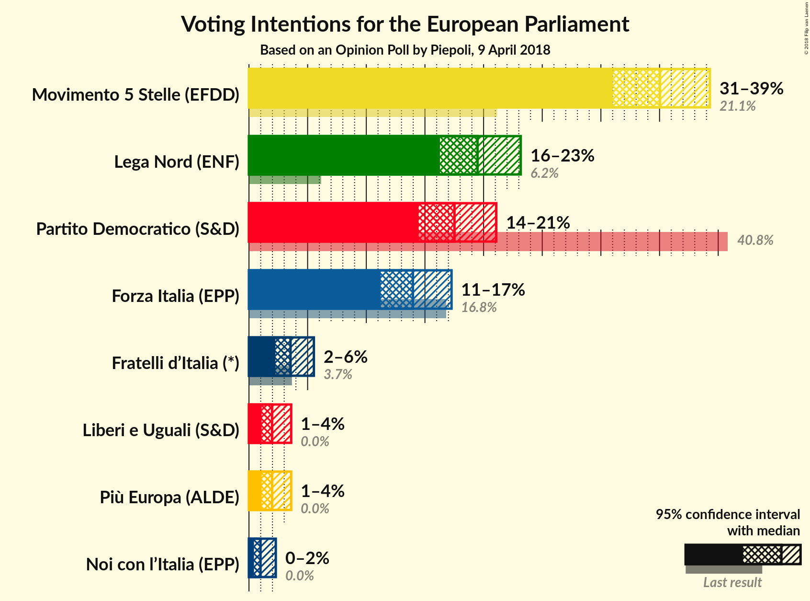
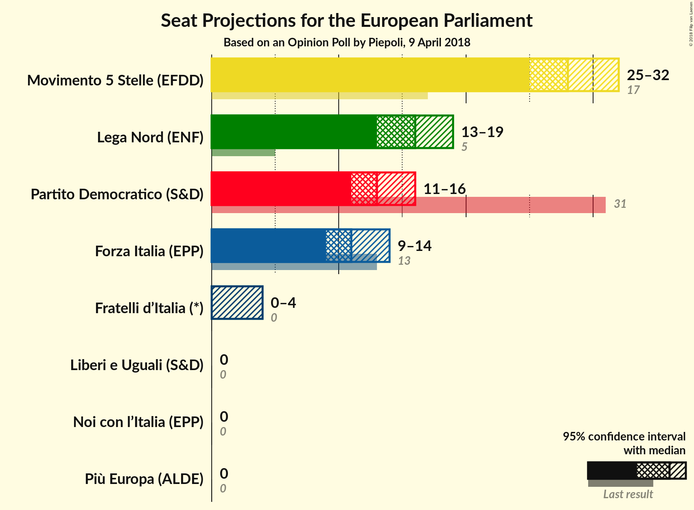
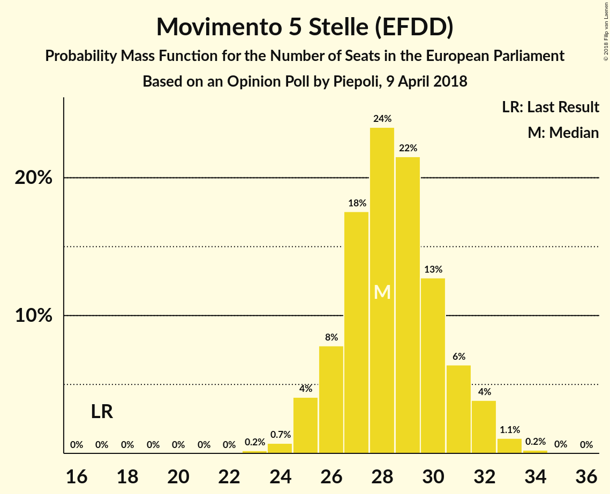
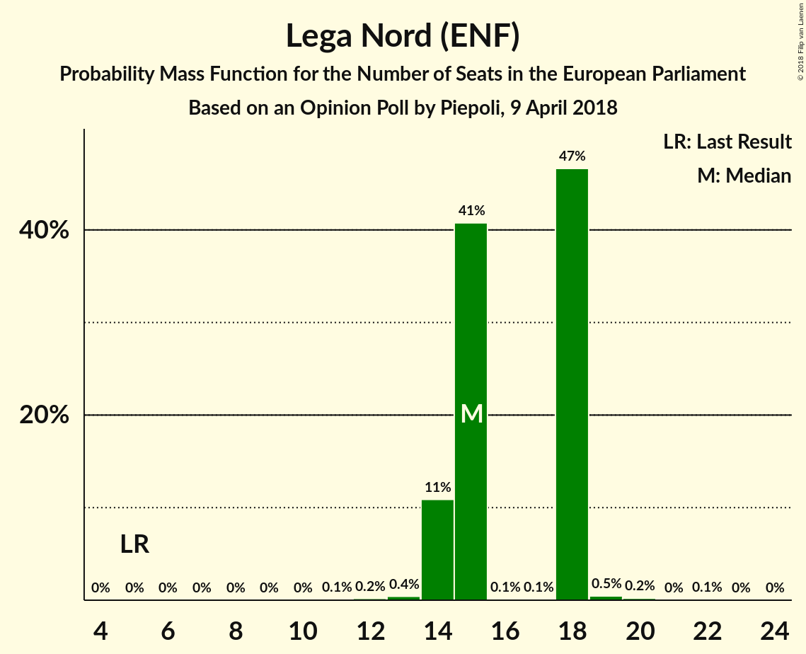
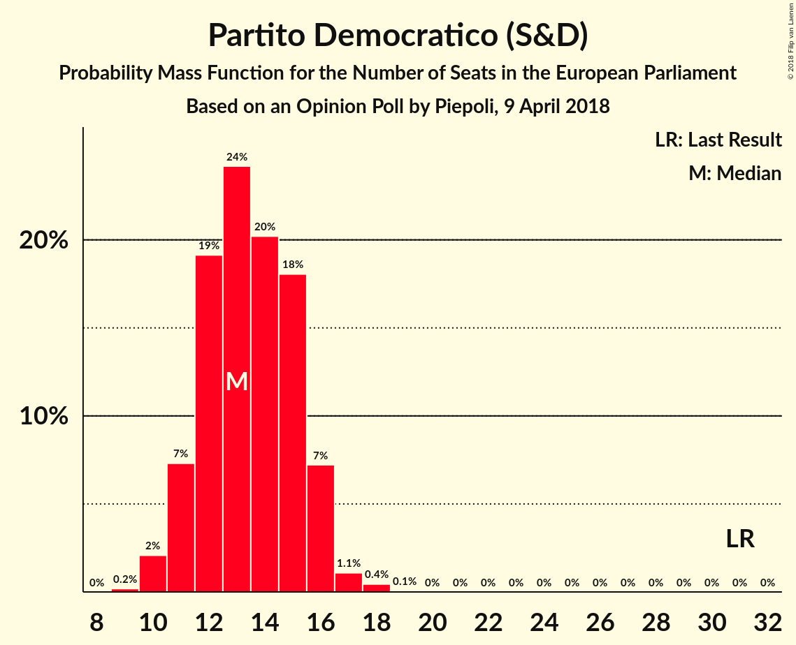
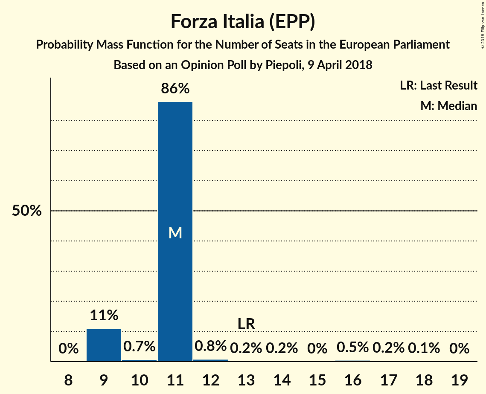
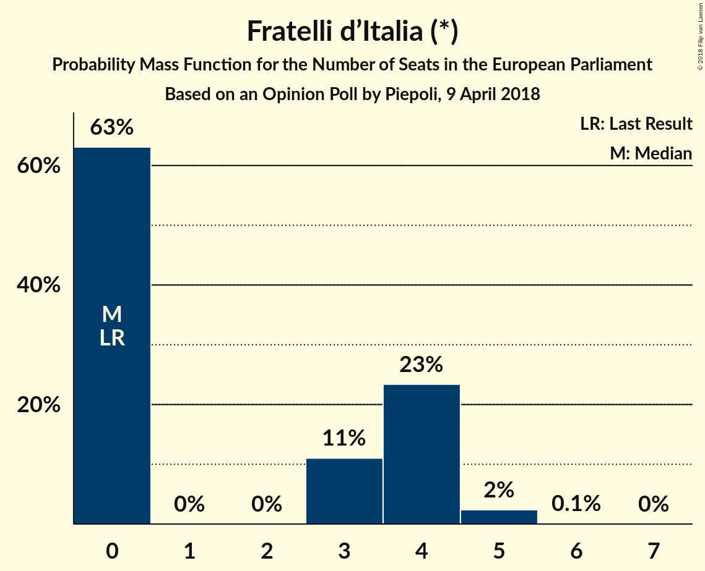
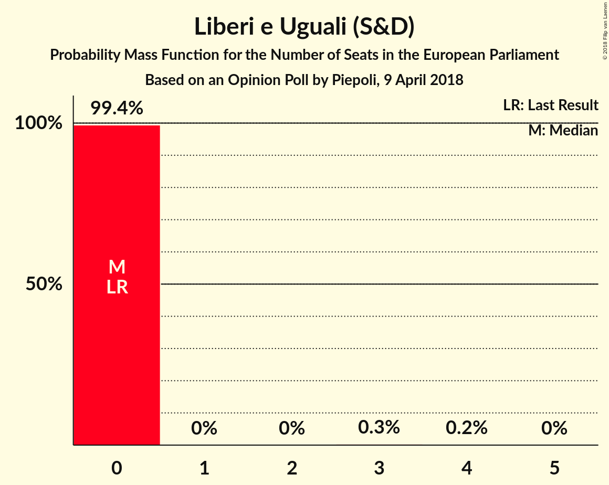
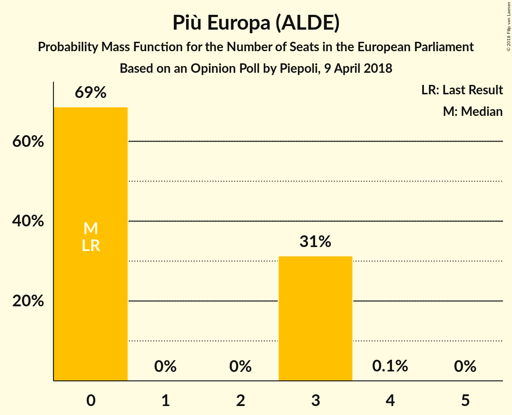
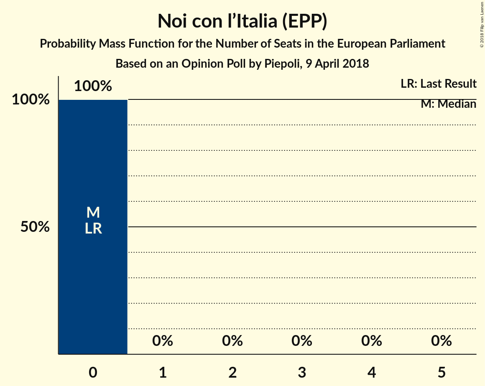

# Opinion Poll by Piepoli, 9 April 2018

<a href="#voting-intentions">Voting Intentions</a> | <a href="#seats">Seats</a> | <a href="#coalitions">Coalitions</a> | <a href="#technical-information">Technical Information</a>

## Voting Intentions

### Confidence Intervals

| Party | Last Result | Poll Result | 80% Confidence Interval | 90% Confidence Interval | 95% Confidence Interval | 99% Confidence Interval |
|:-----:|:-----------:|:-----------:|:-----------------------:|:-----------------------:|:-----------------------:|:-----------------------:|
| Movimento 5 Stelle (EFDD) | 21.1% | 35.0% | 32.4–37.8% |31.7–38.6% |31.0–39.3% |29.8–40.6% |
| Lega Nord (ENF) | 6.2% | 19.5% | 17.4–21.9% |16.8–22.6% |16.3–23.2% |15.3–24.4% |
| Partito Democratico (S&D) | 40.8% | 17.5% | 15.5–19.8% |14.9–20.5% |14.5–21.1% |13.5–22.2% |
| Forza Italia (EPP) | 16.8% | 14.0% | 12.2–16.1% |11.7–16.7% |11.2–17.3% |10.4–18.4% |
| Fratelli d’Italia (*) | 3.7% | 3.5% | 2.7–4.8% |2.5–5.2% |2.3–5.5% |1.9–6.2% |
| Liberi e Uguali (S&D) | 0.0% | 2.0% | 1.4–3.0% |1.2–3.3% |1.1–3.6% |0.9–4.2% |
| Più Europa (ALDE) | 0.0% | 2.0% | 1.4–3.0% |1.2–3.3% |1.1–3.6% |0.9–4.2% |
| Noi con l’Italia (EPP) | 0.0% | 1.0% | 0.6–1.8% |0.5–2.1% |0.4–2.3% |0.3–2.8% |

*Note:* The poll result column reflects the actual value used in the calculations. Published results may vary slightly, and in addition be rounded to fewer digits.

## Seats

### Confidence Intervals

| Party | Last Result | Median | 80% Confidence Interval | 90% Confidence Interval | 95% Confidence Interval | 99% Confidence Interval |
|:-----:|:-----------:|:------:|:-----------------------:|:-----------------------:|:-----------------------:|:-----------------------:|
| <a href="#movimento-5-stelle-(efdd)">Movimento 5 Stelle (EFDD)</a> | 17 | 28 | 26–31 |25–32 |25–32 |24–34 |
| <a href="#lega-nord-(enf)">Lega Nord (ENF)</a> | 5 | 16 | 14–18 |14–18 |13–19 |12–20 |
| <a href="#partito-democratico-(s&d)">Partito Democratico (S&D)</a> | 31 | 13 | 12–15 |11–16 |11–16 |10–18 |
| <a href="#forza-italia-(epp)">Forza Italia (EPP)</a> | 13 | 11 | 10–13 |9–14 |9–14 |8–15 |
| <a href="#fratelli-d’italia-(*)">Fratelli d’Italia (*)</a> | 0 | 0 | 0–4 |0–4 |0–4 |0–5 |
| <a href="#liberi-e-uguali-(s&d)">Liberi e Uguali (S&D)</a> | 0 | 0 | 0 |0 |0 |0 |
| <a href="#più-europa-(alde)">Più Europa (ALDE)</a> | 0 | 0 | 0 |0 |0 |0–3 |
| <a href="#noi-con-l’italia-(epp)">Noi con l’Italia (EPP)</a> | 0 | 0 | 0 |0 |0 |0 |

### Movimento 5 Stelle (EFDD)

*For a full overview of the results for this party, see the [Movimento 5 Stelle (EFDD)](party-movimento5stelleefdd.html) page.*

| Number of Seats | Probability | Accumulated | Special Marks |
|:---------------:|:-----------:|:-----------:|:-------------:|
| 17 | 0% | 100% | Last Result |
| 18 | 0% | 100% |  |
| 19 | 0% | 100% |  |
| 20 | 0% | 100% |  |
| 21 | 0% | 100% |  |
| 22 | 0% | 100% |  |
| 23 | 0.2% | 100% |  |
| 24 | 1.0% | 99.8% |  |
| 25 | 9% | 98.8% |  |
| 26 | 7% | 90% |  |
| 27 | 14% | 83% |  |
| 28 | 21% | 69% | Median |
| 29 | 20% | 48% |  |
| 30 | 17% | 28% |  |
| 31 | 6% | 11% |  |
| 32 | 4% | 5% |  |
| 33 | 1.3% | 2% |  |
| 34 | 0.5% | 0.5% |  |
| 35 | 0% | 0.1% |  |
| 36 | 0% | 0% |  |

### Lega Nord (ENF)

*For a full overview of the results for this party, see the [Lega Nord (ENF)](party-leganordenf.html) page.*

| Number of Seats | Probability | Accumulated | Special Marks |
|:---------------:|:-----------:|:-----------:|:-------------:|
| 5 | 0% | 100% | Last Result |
| 6 | 0% | 100% |  |
| 7 | 0% | 100% |  |
| 8 | 0% | 100% |  |
| 9 | 0% | 100% |  |
| 10 | 0% | 100% |  |
| 11 | 0% | 100% |  |
| 12 | 0.6% | 100% |  |
| 13 | 4% | 99.3% |  |
| 14 | 21% | 95% |  |
| 15 | 21% | 74% |  |
| 16 | 21% | 53% | Median |
| 17 | 18% | 32% |  |
| 18 | 10% | 14% |  |
| 19 | 3% | 4% |  |
| 20 | 0.6% | 0.7% |  |
| 21 | 0.1% | 0.1% |  |
| 22 | 0% | 0% |  |

### Partito Democratico (S&D)

*For a full overview of the results for this party, see the [Partito Democratico (S&D)](party-partitodemocraticosd.html) page.*

| Number of Seats | Probability | Accumulated | Special Marks |
|:---------------:|:-----------:|:-----------:|:-------------:|
| 9 | 0.2% | 100% |  |
| 10 | 2% | 99.8% |  |
| 11 | 7% | 98% |  |
| 12 | 19% | 90% |  |
| 13 | 24% | 71% | Median |
| 14 | 20% | 47% |  |
| 15 | 18% | 27% |  |
| 16 | 7% | 9% |  |
| 17 | 1.1% | 2% |  |
| 18 | 0.4% | 0.5% |  |
| 19 | 0.1% | 0.1% |  |
| 20 | 0% | 0% |  |
| 21 | 0% | 0% |  |
| 22 | 0% | 0% |  |
| 23 | 0% | 0% |  |
| 24 | 0% | 0% |  |
| 25 | 0% | 0% |  |
| 26 | 0% | 0% |  |
| 27 | 0% | 0% |  |
| 28 | 0% | 0% |  |
| 29 | 0% | 0% |  |
| 30 | 0% | 0% |  |
| 31 | 0% | 0% | Last Result |

### Forza Italia (EPP)

*For a full overview of the results for this party, see the [Forza Italia (EPP)](party-forzaitaliaepp.html) page.*

| Number of Seats | Probability | Accumulated | Special Marks |
|:---------------:|:-----------:|:-----------:|:-------------:|
| 8 | 1.0% | 100% |  |
| 9 | 4% | 98.9% |  |
| 10 | 13% | 95% |  |
| 11 | 37% | 82% | Median |
| 12 | 26% | 45% |  |
| 13 | 10% | 19% | Last Result |
| 14 | 7% | 9% |  |
| 15 | 1.2% | 1.3% |  |
| 16 | 0.1% | 0.1% |  |
| 17 | 0% | 0% |  |

### Fratelli d’Italia (*)

*For a full overview of the results for this party, see the [Fratelli d’Italia (*)](party-fratellid’italia.html) page.*

| Number of Seats | Probability | Accumulated | Special Marks |
|:---------------:|:-----------:|:-----------:|:-------------:|
| 0 | 63% | 100% | Last Result, Median |
| 1 | 0% | 37% |  |
| 2 | 0% | 37% |  |
| 3 | 11% | 37% |  |
| 4 | 23% | 26% |  |
| 5 | 2% | 2% |  |
| 6 | 0.1% | 0.1% |  |
| 7 | 0% | 0% |  |

### Liberi e Uguali (S&D)

*For a full overview of the results for this party, see the [Liberi e Uguali (S&D)](party-liberieugualisd.html) page.*

| Number of Seats | Probability | Accumulated | Special Marks |
|:---------------:|:-----------:|:-----------:|:-------------:|
| 0 | 99.6% | 100% | Last Result, Median |
| 1 | 0% | 0.4% |  |
| 2 | 0% | 0.4% |  |
| 3 | 0.1% | 0.4% |  |
| 4 | 0.3% | 0.3% |  |
| 5 | 0% | 0% |  |

### Più Europa (ALDE)

*For a full overview of the results for this party, see the [Più Europa (ALDE)](party-piùeuropaalde.html) page.*

| Number of Seats | Probability | Accumulated | Special Marks |
|:---------------:|:-----------:|:-----------:|:-------------:|
| 0 | 98.9% | 100% | Last Result, Median |
| 1 | 0% | 1.1% |  |
| 2 | 0% | 1.1% |  |
| 3 | 0.8% | 1.1% |  |
| 4 | 0.3% | 0.3% |  |
| 5 | 0% | 0% |  |

### Noi con l’Italia (EPP)

*For a full overview of the results for this party, see the [Noi con l’Italia (EPP)](party-noiconl’italiaepp.html) page.*

| Number of Seats | Probability | Accumulated | Special Marks |
|:---------------:|:-----------:|:-----------:|:-------------:|
| 0 | 100% | 100% | Last Result, Median |

## Coalitions

### Confidence Intervals

| Coalition | Last Result | Median | Majority? | 80% Confidence Interval | 90% Confidence Interval | 95% Confidence Interval | 99% Confidence Interval |
|:---------:|:-----------:|:------:|:---------:|:-----------------------:|:-----------------------:|:-----------------------:|:-----------------------:|
| Movimento 5 Stelle (EFDD) | 17 | 28 | 0% | 26–31 | 25–32 | 25–32 | 24–34 |
| Lega Nord (ENF) | 5 | 16 | 0% | 14–18 | 14–18 | 13–19 | 12–20 |
| Partito Democratico (S&D) – Liberi e Uguali (S&D) | 31 | 13 | 0% | 12–15 | 11–16 | 11–16 | 10–18 |
| Più Europa (ALDE) | 0 | 0 | 0% | 0 | 0 | 0 | 0–3 |

### Movimento 5 Stelle (EFDD)

| Number of Seats | Probability | Accumulated | Special Marks |
|:---------------:|:-----------:|:-----------:|:-------------:|
| 17 | 0% | 100% | Last Result |
| 18 | 0% | 100% |  |
| 19 | 0% | 100% |  |
| 20 | 0% | 100% |  |
| 21 | 0% | 100% |  |
| 22 | 0% | 100% |  |
| 23 | 0.2% | 100% |  |
| 24 | 1.0% | 99.8% |  |
| 25 | 9% | 98.8% |  |
| 26 | 7% | 90% |  |
| 27 | 14% | 83% |  |
| 28 | 21% | 69% | Median |
| 29 | 20% | 48% |  |
| 30 | 17% | 28% |  |
| 31 | 6% | 11% |  |
| 32 | 4% | 5% |  |
| 33 | 1.3% | 2% |  |
| 34 | 0.5% | 0.5% |  |
| 35 | 0% | 0.1% |  |
| 36 | 0% | 0% |  |

### Lega Nord (ENF)

| Number of Seats | Probability | Accumulated | Special Marks |
|:---------------:|:-----------:|:-----------:|:-------------:|
| 5 | 0% | 100% | Last Result |
| 6 | 0% | 100% |  |
| 7 | 0% | 100% |  |
| 8 | 0% | 100% |  |
| 9 | 0% | 100% |  |
| 10 | 0% | 100% |  |
| 11 | 0% | 100% |  |
| 12 | 0.6% | 100% |  |
| 13 | 4% | 99.3% |  |
| 14 | 21% | 95% |  |
| 15 | 21% | 74% |  |
| 16 | 21% | 53% | Median |
| 17 | 18% | 32% |  |
| 18 | 10% | 14% |  |
| 19 | 3% | 4% |  |
| 20 | 0.6% | 0.7% |  |
| 21 | 0.1% | 0.1% |  |
| 22 | 0% | 0% |  |

### Partito Democratico (S&D) – Liberi e Uguali (S&D)

| Number of Seats | Probability | Accumulated | Special Marks |
|:---------------:|:-----------:|:-----------:|:-------------:|
| 9 | 0.2% | 100% |  |
| 10 | 2% | 99.8% |  |
| 11 | 7% | 98% |  |
| 12 | 19% | 90% |  |
| 13 | 24% | 71% | Median |
| 14 | 20% | 47% |  |
| 15 | 18% | 27% |  |
| 16 | 7% | 9% |  |
| 17 | 1.2% | 2% |  |
| 18 | 0.5% | 0.7% |  |
| 19 | 0.1% | 0.1% |  |
| 20 | 0% | 0% |  |
| 21 | 0% | 0% |  |
| 22 | 0% | 0% |  |
| 23 | 0% | 0% |  |
| 24 | 0% | 0% |  |
| 25 | 0% | 0% |  |
| 26 | 0% | 0% |  |
| 27 | 0% | 0% |  |
| 28 | 0% | 0% |  |
| 29 | 0% | 0% |  |
| 30 | 0% | 0% |  |
| 31 | 0% | 0% | Last Result |

### Più Europa (ALDE)

| Number of Seats | Probability | Accumulated | Special Marks |
|:---------------:|:-----------:|:-----------:|:-------------:|
| 0 | 98.9% | 100% | Last Result, Median |
| 1 | 0% | 1.1% |  |
| 2 | 0% | 1.1% |  |
| 3 | 0.8% | 1.1% |  |
| 4 | 0.3% | 0.3% |  |
| 5 | 0% | 0% |  |

## Technical Information

### Opinion Poll

+ **Polling firm:** Piepoli
+ **Commissioner(s):** —
+ **Fieldwork period:** 9 April 2018

### Calculations

+ **Sample size:** 508
+ **Simulations done:** 131,072
+ **Error estimate:** 1.71%

